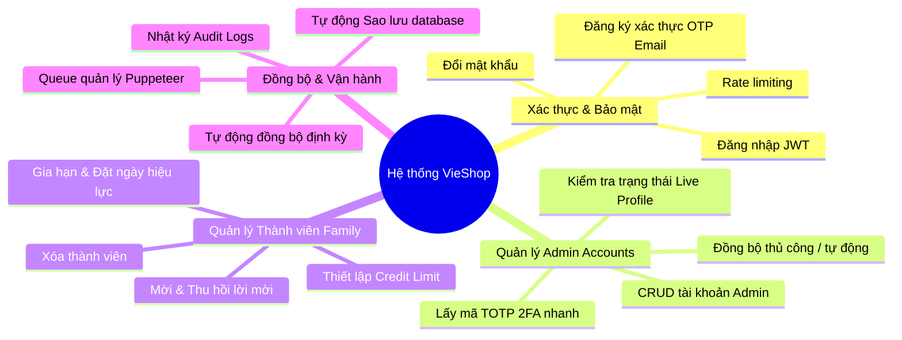
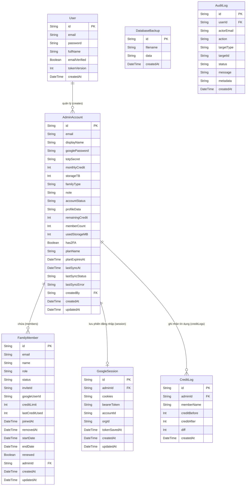

<p align="center">
  
</p>

<h1 align="center">🛒 VieShop - Tài liệu SRS & Hướng dẫn Vận hành</h1>

<p align="center">
  <strong>Hệ thống quản trị trung tâm và đồng bộ hóa tài khoản Google Family</strong>
</p>

<p align="center">
  
  
  
  
</p>

---

## 🎯 1. Mục tiêu hệ thống (System Goals)

**VieShop** là một hệ thống dashboard quản trị nội bộ cao cấp, được thiết kế chuyên biệt để giải quyết các vấn đề vận hành phức tạp liên quan đến việc quản lý, phân phối và đồng bộ hóa tài khoản dịch vụ dùng chung, cụ thể là **Google Family** (Google One, YouTube Premium).

### 1.1. Vấn đề thực tiễn
Việc quản lý thủ công hàng chục hoặc hàng trăm nhóm gia đình Google Family gây ra nhiều khó khăn:
- **Tốn thời gian:** Gửi lời mời, kiểm tra dung lượng lưu trữ của từng thành viên, thu hồi lời mời quá hạn.
- **Rủi ro bảo mật:** Chia sẻ mật khẩu trực tiếp, quản lý mã xác thực 2FA (TOTP) thủ công.
- **Thiếu kiểm soát tín dụng:** Khó theo dõi hạn mức sử dụng tín dụng (Credit) của từng thành viên Google AI API.
- **Khó đồng bộ:** Trạng thái kích hoạt và thời gian hết hạn của thành viên dễ bị lệch so với thực tế thanh toán.

### 1.2. Giải pháp của VieShop
VieShop giải quyết triệt để các vấn đề trên thông qua việc cung cấp:
- **Giao diện quản trị tập trung:** Dashboard hiển thị trực quan toàn bộ các tài khoản Admin (đại diện cho các Family hoặc Workspace) và danh sách thành viên thuộc mỗi nhóm.
- **Tự động hóa trình duyệt (Browser Automation):** Tích hợp Puppeteer để tự động đăng nhập, gửi lời mời (invite), thu hồi lời mời (revoke), loại bỏ thành viên (remove), và kiểm tra trạng thái chia sẻ (sharing status) trên trang cấu hình Google thực tế.
- **Hàng đợi đồng bộ thông minh (Sync Queue):** Tự động sắp xếp, lập lịch và kiểm soát số lượng luồng tự động hóa chạy song song để tránh bị Google chặn IP hoặc tài khoản.
- **Quản lý tín dụng (Credit Management):** Giới hạn và ghi vết chi tiết lịch sử sử dụng tín dụng của các thành viên.

---

## 🛠️ 2. Yêu cầu chức năng (Functional Requirements)

Hệ thống VieShop được chia thành các khối chức năng chính như sau:



### 2.1. Phân hệ Xác thực & Phân quyền (Authentication & Authorization)
- **Đăng nhập hệ thống (`/login`):**
  - Quản trị viên hệ thống (User) đăng nhập bằng `email` và `password`.
  - Sử dụng JWT lưu trữ trong HttpOnly Cookie để duy trì trạng thái đăng nhập.
  - Hỗ trợ cơ chế xoay vòng token (Token Rotation) bằng cách lưu `tokenVersion` trên cơ sở dữ liệu. Khi vô hiệu hóa session, `tokenVersion` sẽ được tăng lên để từ chối các JWT cũ.
- **Đăng ký tài khoản (`/register`):**
  - Đăng ký tài khoản quản trị viên mới bằng email.
  - Gửi mã OTP xác thực qua email để kích hoạt.
  - Áp dụng cơ chế giới hạn số lần gửi OTP (Rate limiting & Lockout) để tránh spam.
- **Đổi mật khẩu:** Cho phép thay đổi mật khẩu quản trị viên hiện tại, yêu cầu mật khẩu mới đáp ứng tiêu chuẩn an toàn cao.

### 2.2. Phân hệ Quản lý tài khoản Admin (Admin Accounts Management)
Tài khoản Admin đại diện cho các tài khoản Google giữ vai trò chủ sở hữu (Owner/Family Creator).
- **Thao tác nghiệp vụ (CRUD):** Thêm mới, chỉnh sửa thông tin, xem chi tiết và xóa các tài khoản Admin.
- **Cấu hình chi tiết:** Thiết lập loại gia đình (`ultra`, `pro`, `youtube`), cấu hình dung lượng lưu trữ (`storageTB`), hạn mức tín dụng hàng tháng (`monthlyCredit`), mật khẩu Google, và mã bí mật 2FA (`totpSecret`).
- **Lấy mã TOTP nhanh:** Tích hợp bộ giải mã TOTP trực tiếp trên Dashboard, cho phép Admin lấy mã xác thực 6 số tức thời mà không cần thiết bị ngoài.
- **Truy xuất thông tin thực tế (Check Profile):** Gửi yêu cầu Puppeteer đăng nhập live vào Google để đọc dung lượng thực tế đã dùng, trạng thái kích hoạt chia sẻ gia đình và các lỗi thanh toán (nếu có).

### 2.3. Phân hệ Quản lý thành viên (Family Members Management)
Quản lý các tài khoản người dùng cuối được thêm vào trong các nhóm Google Family của Admin.
- **Gửi lời mời (Invite Member):** Tự động hóa quá trình điều khiển trình duyệt để nhập email thành viên và nhấn gửi lời mời gia đình Google One.
- **Thu hồi lời mời (Revoke Invite):** Hủy bỏ lời mời đã gửi nếu thành viên không chấp nhận trong thời gian yêu cầu hoặc có thay đổi kế hoạch.
- **Xóa thành viên (Remove Member):** Tự động hóa quá trình kích thành viên ra khỏi nhóm gia đình/workspace.
- **Quản lý thời hạn:** Đặt ngày bắt đầu (`startDate`), ngày kết thúc (`endDate`), đánh dấu gia hạn (`renewed`), giúp tự động hóa việc rà soát thời hạn sử dụng.
- **Hạn mức tín dụng (Credit Limit):** Thiết lập giới hạn tín dụng (`creditLimit`) cho từng thành viên và ghi nhận lượng tín dụng đã dùng thực tế.

### 2.4. Phân hệ Đồng bộ dữ liệu & Vận hành tự động
- **Hàng đợi đồng bộ hóa (`sync-queue`):**
  - Do các tác vụ Puppeteer tiêu tốn nhiều tài nguyên hệ thống (RAM, CPU), hệ thống duy trì hai hàng đợi riêng biệt:
    - **Google Sync Queue:** Giới hạn tối đa **3** job chạy đồng thời.
  - Cơ chế tự động thử lại (Retry) khi gặp lỗi kết nối mạng và bộ giám sát thời gian chờ (Timeout Watchdog) để giải phóng hàng đợi khi luồng bị treo.
- **Đồng bộ tự động định kỳ (Auto-Sync):**
  - Tự động lên lịch đồng bộ hóa định kỳ tại phút thứ `:00` và `:30` hàng giờ khi dashboard đang hoạt động trên trình duyệt của quản trị viên.
- **Hệ thống tự động sao lưu (Auto Backup):**
  - Tự động sao lưu toàn bộ dữ liệu MongoDB tại thời điểm khởi động dự án (sau 30 giây đầu tiên).
  - Lặp lại chu kỳ sao lưu đều đặn mỗi 6 giờ.
  - Lưu giữ tối đa 10 bản sao lưu gần nhất trên cả hệ thống tệp tin vật lý (`backups/`) và bản ghi cơ sở dữ liệu (`DatabaseBackup`).
- **Ghi nhật ký hệ thống (Audit Logs):**
  - Mọi thao tác thay đổi dữ liệu nhạy cảm (Tạo admin, đồng bộ, chỉnh sửa thành viên, mời/xóa thành viên) đều được lưu vào cơ sở dữ liệu (`AuditLog`) nhằm phục vụ công tác hậu kiểm.

---

## 🔒 3. Yêu cầu phi chức năng (Non-Functional Requirements)

### 3.1. Yêu cầu Bảo mật (Security)
- **Mã hóa dữ liệu nhạy cảm:**
  - Mật khẩu tài khoản Google, mã bảo mật `totpSecret`, cookie trình duyệt và các thông tin xác thực nhạy cảm khác được mã hóa bằng thuật toán đối xứng **AES-256-GCM** trước khi lưu vào MongoDB.
  - Khóa mã hóa được dẫn xuất từ biến môi trường `JWT_SECRET` hoặc cấu hình ghi đè `CACHE_SECRET`.
- **Bảo mật mật khẩu người dùng:** Mật khẩu đăng nhập dashboard của quản trị viên được băm (hash) bằng thư viện `bcryptjs` với độ phức tạp (salt rounds) bằng **12**.
- **Bảo mật phiên làm việc:**
  - Token JWT lưu trữ tại HttpOnly Cookie với các cờ an toàn (`Secure`, `SameSite=Strict`, `HttpOnly`) nhằm chống lại các cuộc tấn công XSS và CSRF.
- **Chống Spam & Tấn công dò đường:** Tích hợp cơ chế Rate Limiter in-memory giới hạn số lượng request đối với các endpoint nhạy cảm như Đăng nhập, Gửi OTP, và các luồng Đồng bộ hóa.

### 3.2. Yêu cầu Hiệu năng (Performance)
- **Tối ưu hóa tài nguyên phần cứng:**
  - Trình duyệt Puppeteer chạy ở chế độ ẩn danh (headless mode) kết hợp với `stealth-plugin` để tránh bị phát hiện và hạn chế tải tài nguyên không cần thiết (hình ảnh, css phụ) giúp giảm tải CPU/RAM.
- **Tối ưu hóa Client-side:**
  - Trạng thái profile, dung lượng lưu trữ gia đình và trạng thái chia sẻ được lưu tạm thời vào `sessionStorage` của trình duyệt client để giảm thiểu số lần gọi API quét profile nặng nề đến server.
- **Bảo vệ Database:** Áp dụng cơ chế indexing trên các trường thường xuyên tìm kiếm hoặc sắp xếp như `createdAt` trong `CreditLog` và `AuditLog`.

### 3.3. Yêu cầu Giao diện & Trải nghiệm (UI/UX)
- **Thiết kế Premium & Hiện đại:** Sử dụng CSS Tailwind CSS v4 kết hợp cùng các hiệu ứng chuyển động mượt mà của Framer Motion.
- **Trực quan hóa dữ liệu:**
  - Hiển thị tiến trình sử dụng dung lượng lưu trữ (Storage Usage Progress Bar) trực quan.
  - Sử dụng biểu đồ/thẻ tổng hợp hiển thị hạn mức tín dụng và số lượng thành viên.
  - Đồng hồ thời gian thực (Live Clock) đồng bộ chính xác với máy chủ.
- **Trạng thái xử lý thời gian thực:**
  - Các tiến trình quét trình duyệt ngầm được phản hồi thông tin trạng thái trực tiếp lên Dashboard thông qua các thông báo Toast chuyển động sinh động (SyncToast).

---

## 📂 4. Phụ lục (Appendix)

### 4.1. Sơ đồ thực thể cơ sở dữ liệu (Database ERD)

Dưới đây là sơ đồ quan hệ của cơ sở dữ liệu VieShop được viết bằng cú pháp Mermaid:



---

### 4.2. Dữ liệu mẫu (Sample Data Structure)

Dưới đây là ví dụ về cấu trúc dữ liệu JSON mẫu của một đối tượng **AdminAccount** và danh sách **FamilyMember** liên quan:

#### Đối tượng AdminAccount mẫu
```json
{
  "_id": "64bdf64219a12c8a2b5821c4",
  "email": "owner.premium.family@gmail.com",
  "displayName": "Google One Ultra Family 2TB",
  "googlePassword": "ENC[AES-256-GCM:vS8d8uJn...]",
  "totpSecret": "ENC[AES-256-GCM:x9Fj8aK...]",
  "monthlyCredit": 100,
  "storageTB": 2,
  "familyType": "ultra",
  "note": "Nhóm gia đình hoạt động từ tháng 6/2026",
  "accountStatus": "ACTIVE",
  "profileData": "{\"plan\":\"Google One 2TB\",\"owner\":\"Owner Name\"}",
  "remainingCredit": 75,
  "memberCount": 4,
  "usedStorageMB": 850320,
  "has2FA": true,
  "planName": "Google One 2TB Annual",
  "planExpiresAt": "2027-06-15T00:00:00.000Z",
  "lastSyncAt": "2026-07-22T07:00:00.000Z",
  "lastSyncStatus": "SUCCESS",
  "lastSyncError": "",
  "createdBy": "64bdf50019a12c8a2b582100",
  "createdAt": "2026-06-15T08:30:00.000Z",
  "updatedAt": "2026-07-22T07:00:00.000Z"
}
```

#### Đối tượng FamilyMember mẫu
```json
{
  "_id": "64bdf71519a12c8a2b5821f9",
  "email": "customer.member1@gmail.com",
  "name": "Nguyễn Văn A",
  "role": "member",
  "status": "active",
  "inviteId": null,
  "googleUserId": "10892739182390129381",
  "creditLimit": 25,
  "lastCreditUsed": 5,
  "joinedAt": "2026-06-16T10:15:00.000Z",
  "removedAt": null,
  "startDate": "2026-06-16T00:00:00.000Z",
  "endDate": "2026-12-16T00:00:00.000Z",
  "renewed": true,
  "adminId": "64bdf64219a12c8a2b5821c4",
  "createdAt": "2026-06-16T10:00:00.000Z",
  "updatedAt": "2026-07-20T09:00:00.000Z"
}
```

---

### 4.3. Tổng quan về API (API Endpoint Specs)

Hệ thống cung cấp hệ thống Route Handlers chuẩn RESTful:

| Nhóm chức năng | Phương thức | Endpoint | Mô tả |
| :--- | :--- | :--- | :--- |
| **Xác thực** | `POST` | `/api/auth/login` | Đăng nhập tài khoản quản trị viên dashboard |
| | `POST` | `/api/auth/logout` | Đăng xuất, hủy bỏ cookie JWT |
| | `GET` | `/api/auth/me` | Lấy thông tin phiên làm việc hiện tại |
| | `POST` | `/api/auth/change-password` | Thay đổi mật khẩu người dùng |
| **Đăng ký & OTP** | `POST` | `/api/auth/register` | Đăng ký quản trị viên mới |
| | `POST` | `/api/auth/register/send-otp` | Yêu cầu gửi OTP qua Email |
| | `POST` | `/api/auth/register/verify-otp`| Xác thực OTP đăng ký |
| **Tiện ích Dashboard** | `GET` | `/api/dashboard/stats` | Lấy dữ liệu thống kê tổng quan hệ thống |
| | `POST` | `/api/dashboard/stats` | Cập nhật cấu hình hiển thị dashboard |
| | `POST` | `/api/backup` | Kích hoạt sao lưu cơ sở dữ liệu thủ công |
| | `GET` | `/api/time` | Đồng bộ thời gian thực từ máy chủ |
| **Quản trị Admin** | `POST` | `/api/admin` | Tạo mới tài khoản Admin |
| | `GET` | `/api/admin/[id]` | Lấy chi tiết thông tin Admin |
| | `PUT`/`PATCH` | `/api/admin/[id]` | Cập nhật thông tin cấu hình Admin |
| | `DELETE` | `/api/admin/[id]` | Xóa tài khoản Admin khỏi hệ thống |
| | `POST`/`GET` | `/api/admin/[id]/sync` | Đồng bộ hóa dữ liệu từ Google ngầm |
| | `GET` | `/api/admin/[id]/totp` | Lấy mã OTP 6 số hiện tại của tài khoản |
| | `GET` | `/api/admin/[id]/totp/secret` | Lấy mã bí mật TOTP gốc (sau giải mã) |
| **Quản trị Member**| `GET` | `/api/admin/[id]/members` | Danh sách thành viên trong nhóm |
| | `PATCH` | `/api/admin/[id]/members` | Cập nhật hàng loạt trạng thái thành viên |
| | `POST` | `/api/admin/[id]/invite` | Kích hoạt Puppeteer gửi lời mời email |
| | `POST` | `/api/admin/[id]/revoke-invite` | Kích hoạt Puppeteer hủy lời mời đã gửi |
| | `POST` | `/api/admin/[id]/remove-member` | Kích hoạt Puppeteer xóa thành viên khỏi nhóm |
| | `POST` | `/api/admin/[id]/create-family` | Tạo nhóm gia đình mới trên tài khoản Google |
| | `GET` | `/api/admin/[id]/profile` | Đọc toàn bộ trạng thái chia sẻ live |
| | `POST` | `/api/admin/[id]/toggle-sharing`| Bật hoặc tắt trạng thái chia sẻ gia đình |
| | `GET` | `/api/admin/[id]/credit-logs` | Xem lịch sử ghi nhận tín dụng |

---

### 4.4. Hướng dẫn kỹ thuật và chạy local (Technical & Operations Guide)

#### Cấu trúc thư mục dự án
```text
app/
  (auth)/login         # Giao diện Đăng nhập
  dashboard/           # Giao diện quản trị chính
  api/                 # Các Route Handlers của Next.js
components/
  auth/                # Component phục vụ Xác thực
  dashboard/           # Các component UI bảng điều khiển (Modal, Tabs, Card, Sidebar)
  ui/                  # Các UI nguyên tử tái sử dụng (Button, Input, Badge, Toast)
hooks/                 # React Custom hooks (useAutoSync, useGoogleProfile, v.v.)
lib/
  auth/                # Logic xử lý JWT, mã hóa mật khẩu, kho chứa OTP
  scanner/             # Trình duyệt tự động hóa Puppeteer quét Google
  utils/               # Các hàm tiện ích hỗ trợ format dữ liệu, xử lý ngày tháng
  db/                  # Kết nối client Prisma với MongoDB
prisma/                # File định nghĩa Schema Database Prisma
scripts/               # Các script bảo trì hệ thống (migrate, mã hóa)
specs/                 # Các kịch bản kiểm thử tự động bằng Vitest
```

#### Các biến môi trường cần thiết (.env)
Tham khảo chi tiết tại file [`.env.example`](./.env.example):

| Biến môi trường | Bắt buộc | Vai trò / Ý nghĩa |
| :--- | :--- | :--- |
| `DATABASE_URL` | Có | Chuỗi kết nối tới cơ sở dữ liệu MongoDB |
| `JWT_SECRET` | Có | Khóa ký và giải mã Token JWT, đồng thời làm khóa mã hóa dự phòng |
| `ACCOUNT_EMAIL` | Không | Email tài khoản quản trị viên mặc định để seed khi hệ thống khởi động |
| `ACCOUNT_PASSWORD`| Không | Mật khẩu tài khoản quản trị viên mặc định để seed |
| `CACHE_SECRET` | Không | Khóa mã hóa bổ sung để mã hóa dữ liệu trong Database |
| `CHROME_EXECUTABLE_PATH`| Không| Đường dẫn tệp tin thực thi Chrome ngoài (nếu dùng trên VPS Linux) |
| `GOOGLE_PROXY_URL`| Không | Proxy hỗ trợ điều hướng request tránh bị Google chặn |
| `GOOGLE_AI_API_KEY`| Không | Khóa API của Google AI phục vụ tích hợp kiểm tra tín dụng |

#### Hướng dẫn cài đặt và khởi động nhanh

1. **Tải các gói phụ thuộc (Dependencies):**
   ```bash
   npm install
   ```

2. **Thiết lập biến môi trường:**
   ```bash
   cp .env.example .env
   # Tiến hành mở file .env và điền các cấu hình kết nối thực tế.
   ```

3. **Tạo mã nguồn Prisma Client từ Schema:**
   ```bash
   npx prisma generate
   ```

4. **Khởi chạy môi trường phát triển (Dev server):**
   ```bash
   npm run dev
   ```
   *Mở trình duyệt truy cập `http://localhost:3000`. Hệ thống sẽ tự động chuyển hướng bạn đến màn hình đăng nhập `/login`.*

#### Hướng dẫn khởi chạy nhanh bằng Docker Compose

Nếu bạn muốn chạy toàn bộ ứng dụng và cơ sở dữ liệu MongoDB một cách khép kín mà không cần cài đặt MongoDB hay Chromium cục bộ:

1. **Chuẩn bị file cấu hình:**
   Đảm bảo các giá trị biến môi trường trong file `docker-compose.yml` (như `JWT_SECRET`, `CACHE_SECRET`, `ACCOUNT_EMAIL`, `ACCOUNT_PASSWORD`) đã được cấu hình theo ý bạn.

2. **Khởi chạy Docker Compose:**
   Chạy lệnh sau tại thư mục gốc của dự án:
   ```bash
   docker compose up --build
   ```

3. **Luồng khởi chạy tự động:**
   - Container `vieshop-mongodb` sẽ khởi động và bật chế độ Replica Set.
   - Container `vieshop-mongodb-rs-init` sẽ khởi tạo cấu hình Replica Set và thoát sau khi hoàn thành.
   - Container `vieshop-web` cài đặt Chromium tương thích, chạy Prisma generator, build ứng dụng và kết nối đến database.
   - Mở trình duyệt và truy cập: **`http://localhost:3000`**.
   - Tài khoản đăng nhập mặc định: `admin@vieshop.com` / `your-secure-password`.

#### Các lệnh NPM hữu ích


| Lệnh | Ý nghĩa |
| :--- | :--- |
| `npm run dev` | Chạy dự án ở chế độ phát triển (Next.js Development Server) |
| `npm run build`| Biên dịch mã nguồn tối ưu cho môi trường Production |
| `npm run start`| Khởi chạy máy chủ Production sau khi build thành công |
| `npm run lint` | Kiểm tra chất lượng mã nguồn bằng ESLint |
| `npm run format`| Tự động định dạng mã nguồn chuẩn hóa với Prettier |
| `npm test` | Thực hiện kiểm thử toàn bộ các spec test-case một lần bằng Vitest |
| `npm run test:watch`| Chạy Vitest ở chế độ theo dõi (Watch mode) phục vụ viết test |
