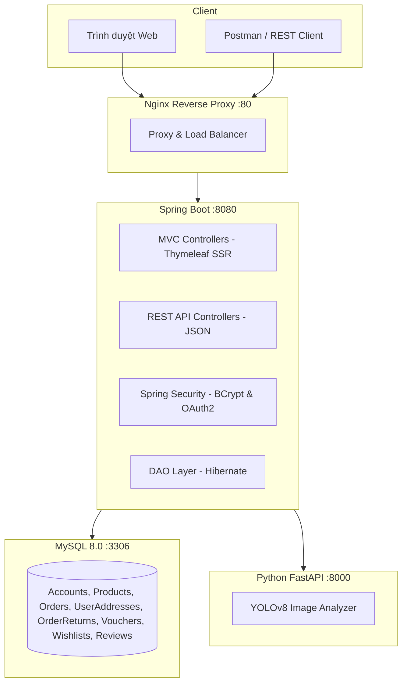
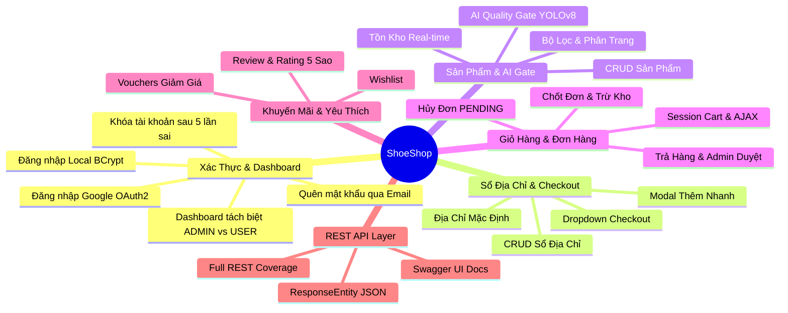
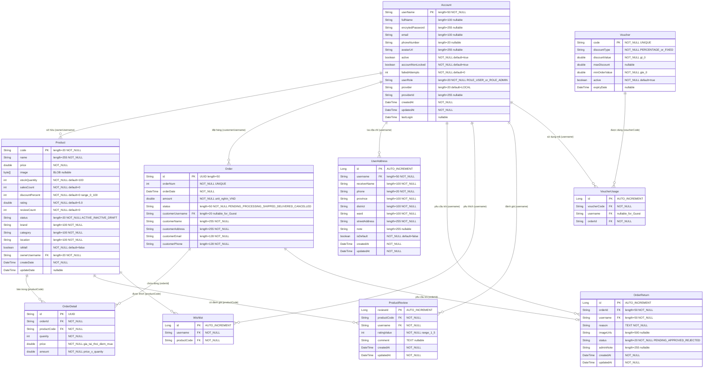

<p align="center">
  
</p>

<h1 align="center">👟 ShoeShop — Đặc Tả Yêu Cầu Phần Mềm (SRS)</h1>

<p align="center">
  <strong>Nền tảng thương mại điện tử giày dép tích hợp AI Kiểm duyệt Ảnh · Sổ Địa Chỉ · Hủy/Trả Hàng · REST API cho QA Testing</strong>
</p>

<p align="center">
  
  
  
  
  
</p>

---

## Mục Lục

1. [Giới Thiệu](#1-giới-thiệu)
2. [Mô Tả Tổng Quan Hệ Thống](#2-mô-tả-tổng-quan-hệ-thống)
3. [Tác Nhân & Phân Quyền](#3-tác-nhân--phân-quyền)
4. [Yêu Cầu Chức Năng](#4-yêu-cầu-chức-năng)
5. [Yêu Cầu Phi Chức Năng](#5-yêu-cầu-phi-chức-năng)
6. [Phụ Lục A — Từ Điển Thuật Ngữ](#6-phụ-lục-a--từ-điển-thuật-ngữ)
7. [Phụ Lục B — Sơ Đồ ERD](#7-phụ-lục-b--sơ-đồ-thực-thể-csdl-erd)
8. [Phụ Lục C — Danh Mục API](#8-phụ-lục-c--danh-mục-api-chi-tiết)
9. [Phụ Lục D — Dữ Liệu Mẫu JSON](#9-phụ-lục-d--dữ-liệu-mẫu-json)
10. [Phụ Lục E — Cấu Trúc & Vận Hành](#10-phụ-lục-e--cấu-trúc-thư-mục--hướng-dẫn-vận-hành)

---

## 1. Giới Thiệu

### 1.1. Mục Đích Tài Liệu

Tài liệu này là **Đặc Tả Yêu Cầu Phần Mềm (SRS — Software Requirements Specification)** của hệ thống **ShoeShop**, chuẩn hóa theo **IEEE 830**. Mục tiêu:

- Mô tả đầy đủ yêu cầu chức năng (FR) và phi chức năng (NFR).
- Làm **cơ sở thiết kế Test Case** — mọi biến đầu vào, ràng buộc và giới hạn giá trị đều được truy vết ngược về tài liệu này.
- Là tài liệu tham chiếu chính xác cho Developer khi lập trình và bảo trì.

### 1.2. Phạm Vi Hệ Thống

**ShoeShop** là hệ thống thương mại điện tử bán lẻ giày dép, kiến trúc lai (**Hybrid Architecture**):

- **Tầng SSR (Web):** Spring MVC + Thymeleaf phục vụ người dùng cuối qua trình duyệt.
- **Tầng REST API song song (`/api/v1/`):** JSON API thuần dữ liệu cho kiểm thử tự động (Postman, REST Assured).
- **Microservice AI (Python FastAPI):** Kiểm duyệt chất lượng ảnh bằng YOLOv8, chạy độc lập.

### 1.3. Đối Tượng Đọc Tài Liệu

| Đối tượng | Mục đích sử dụng |
| :--- | :--- |
| **QA Tester** | Thiết kế và thực thi test case dựa trên ràng buộc trong tài liệu |
| **Developer** | Tra cứu ràng buộc nghiệp vụ khi lập trình và review code |
| **Giảng viên / Reviewer** | Đánh giá tính đầy đủ, chính xác và khả năng truy vết yêu cầu |

### 1.4. Lịch Sử Phiên Bản

| Phiên bản | Ngày | Nội dung thay đổi |
| :---: | :--- | :--- |
| **v1.0** | 2026-09-01 | Phiên bản đầu tiên — kiến trúc cơ bản |
| **v2.0** | 2026-09-19 | Bổ sung Actors, Glossary, Use Case flows, ERD đầy đủ — chuẩn IEEE 830 |

---

## 2. Mô Tả Tổng Quan Hệ Thống

### 2.1. Vấn Đề Thực Tiễn

| # | Vấn đề | Biểu hiện thực tế |
| :---: | :--- | :--- |
| 1 | **Kiểm duyệt ảnh thủ công** | Người bán đăng ảnh kém chất lượng, nhái thương hiệu |
| 2 | **Bán vượt tồn kho (Overselling)** | Khách đặt hàng khi sản phẩm đã hết kho do thiếu kiểm tra Real-time |
| 3 | **Thiếu Sổ Địa Chỉ** | Khách phải nhập lại địa chỉ mỗi lần mua, không lưu được nhiều địa chỉ |
| 4 | **Thiếu quy trình Hủy/Trả hàng** | Khách liên hệ ngoài hệ thống để hủy/trả, không có luồng duyệt chuẩn |
| 5 | **Khó kiểm thử tự động** | Web SSR trả HTML, đội QA khó viết kịch bản Postman/REST Assured |
| 6 | **Phân quyền chưa tách biệt** | Chưa phân định rõ `ROLE_USER` (Khách hàng) vs `ROLE_ADMIN` (Quản trị viên) |

### 2.2. Giải Pháp

| Vấn đề | Giải pháp triển khai |
| :--- | :--- |
| Kiểm duyệt ảnh | **AI Quality Gate:** Python FastAPI + YOLOv8 phân tích ảnh trước khi lưu DB |
| Overselling | **Real-time Stock:** Trừ/hoàn kho trong `@Transactional`, chặn đặt hàng vượt kho |
| Sổ địa chỉ | **Address Book REST API** `/api/v1/users/addresses`: CRUD + Dropdown tại Checkout |
| Hủy/Trả hàng | **Order Cancel & Return:** API hủy đơn `PENDING`, yêu cầu trả kèm ảnh, Admin duyệt |
| Kiểm thử khó | **REST API `/api/v1/`:** JSON API chuẩn với HTTP Status Code chính xác + Swagger UI |
| Phân quyền | **Spring Security 2 Role:** `ROLE_ADMIN` vs `ROLE_USER`, Dashboard tách biệt hoàn toàn |

### 2.3. Kiến Trúc Tổng Quan



---

## 3. Tác Nhân & Phân Quyền

### 3.1. Danh Sách Tác Nhân

| Actor | Định danh | Mô tả | Tài khoản mẫu |
| :--- | :---: | :--- | :--- |
| **Khách vãng lai** | `Anonymous` | Chưa đăng nhập. Xem sản phẩm, thêm giỏ, đặt hàng không cần tài khoản. | *(không có)* |
| **Khách hàng** | `ROLE_USER` | Đã đăng nhập. Toàn bộ quyền Guest + quản lý cá nhân. | `employee1`, `employee2` |
| **Quản trị viên** | `ROLE_ADMIN` | Quản lý toàn bộ hệ thống. | `manager1` |
| **AI Service** | *(internal)* | Microservice Python tự động phân tích ảnh khi Admin tải lên sản phẩm. | *(tự động)* |

### 3.2. Ma Trận Phân Quyền

| Chức năng | Guest | ROLE_USER | ROLE_ADMIN |
| :--- | :---: | :---: | :---: |
| Xem / tìm kiếm sản phẩm | ✅ | ✅ | ✅ |
| Thêm vào giỏ hàng | ✅ | ✅ | ✅ |
| Đặt hàng (Guest Checkout) | ✅ | ✅ | ❌ |
| Đăng ký / Đăng nhập | ✅ | — | — |
| Quản lý sổ địa chỉ (CRUD) | ❌ | ✅ | ❌ |
| Xem lịch sử đơn hàng | ❌ | ✅ (chính chủ) | ✅ (toàn shop) |
| Hủy đơn hàng `PENDING` | ❌ | ✅ (chính chủ) | ✅ |
| Yêu cầu trả hàng | ❌ | ✅ (chính chủ) | ❌ |
| Wishlist / Đánh giá sản phẩm | ❌ | ✅ | ❌ |
| Đăng / Sửa / Xóa sản phẩm | ❌ | ❌ | ✅ |
| Quản lý Voucher | ❌ | ❌ | ✅ |
| Duyệt yêu cầu trả hàng | ❌ | ❌ | ✅ |
| Dashboard doanh thu & Analytics | ❌ | ❌ | ✅ |

> **Lưu ý cho Tester:** Mọi endpoint `/api/v1/admin/*` yêu cầu `ROLE_ADMIN`. Gọi bằng `ROLE_USER` nhận `HTTP 403`; gọi khi chưa đăng nhập nhận `HTTP 401`.

### 3.3. Cơ Chế Xác Thực

| Phương thức | Mô tả | Endpoint |
| :--- | :--- | :--- |
| **Local (BCrypt)** | Username + Password băm bằng `BCryptPasswordEncoder`. Khóa sau **5 lần thất bại**. | `POST /login` |
| **Google OAuth2** | Đăng nhập Google. Tự tạo `ROLE_USER` nếu email chưa tồn tại. | `/oauth2/authorization/google` |
| **HTTP Session** | Phiên làm việc duy trì qua HTTP Session (không stateless JWT). | — |

---

## 4. Yêu Cầu Chức Năng

### Bản Đồ Chức Năng



---

### FR-01: Xác Thực & Dashboard

#### Luồng Đăng Nhập Local
1. Nhập `username` (`[3, 50]` ký tự) và `password` (`[8, 72]` ký tự).
2. Hệ thống xác minh BCrypt.
3. **Thành công** → Khởi tạo phiên, chuyển hướng về `/`.
4. **Thất bại** → Tăng `failedAttempts`. Đạt **5 lần** → Khóa tài khoản (`accountNonLocked = false`).
5. Tài khoản `active = false` → Từ chối với thông báo lỗi.

#### Dashboard Theo Role (`/admin/accountInfo`)
| Thành phần | ROLE_USER | ROLE_ADMIN |
| :--- | :---: | :---: |
| KPI chi tiêu cá nhân / đơn hàng đã đặt | ✅ | ❌ |
| KPI tổng thành viên / tổng đơn toàn shop | ❌ | ✅ |
| Biểu đồ doanh thu Revenue Analytics | ❌ | ✅ |
| Trạng thái AI Service | ❌ | ✅ |
| Quản lý Voucher | ❌ | ✅ |

---

### FR-02: Sổ Địa Chỉ Giao Hàng

**Base Endpoint:** `/api/v1/users/addresses`

**Ràng buộc biến đầu vào (nguồn: `UserAddressApiController.java` & `UserAddress.java`):**

| Biến | Kiểu | Ràng buộc | Nguồn code |
| :--- | :---: | :--- | :--- |
| `receiverName` | `String` | `[1, 100]` ký tự; chỉ `[\p{L}0-9\s\-'.]` | `NAME_PATTERN` |
| `phone` | `String` | `[1, 20]` ký tự; chỉ `[0-9+()\-\s.]` | `PHONE_PATTERN` |
| `province` | `String` | `[1, 100]` ký tự; chỉ `[\p{L}0-9\s\-'.]` | `LOCATION_PATTERN` |
| `district` | `String` | `[1, 100]` ký tự; chỉ `[\p{L}0-9\s\-'.]` | `LOCATION_PATTERN` |
| `ward` | `String` | `[1, 100]` ký tự; chỉ `[\p{L}0-9\s\-'.]` | `LOCATION_PATTERN` |
| `streetAddress` | `String` | `[1, 255]` ký tự; không chứa `<>{}~^$%*\` | `ADDRESS_PATTERN` |
| `isDefault` | `boolean` | `true`/`false`. Địa chỉ đầu tiên **tự động** gán `true` | `UserAddressDAO.saveAddress` |
| `addressCount` | *(system)* | Tối đa **10 địa chỉ**/tài khoản → vượt: `HTTP 400` | `createAddress (chờ fix)` |

**Luồng Thêm Địa Chỉ (`POST /api/v1/users/addresses`):**
1. `currentUser == null` → `HTTP 401 Unauthorized`.
2. Thiếu 1 trong 6 trường bắt buộc → `HTTP 400`.
3. Vi phạm độ dài → `HTTP 400`.
4. Vi phạm regex → `HTTP 400`.
5. Đã có `>= 10` địa chỉ → `HTTP 400`.
6. Địa chỉ đầu tiên hoặc `isDefault = true` → Tự động unset tất cả mặc định cũ.
7. Lưu thành công → `HTTP 201 Created`.

---

### FR-03: Quản Lý Sản Phẩm & AI Gate

**Ràng buộc biến đầu vào (nguồn: `ProductFormValidator.java` & `Product.java`):**

| Biến | Kiểu | Ràng buộc | Nguồn code |
| :--- | :---: | :--- | :--- |
| `code` | `String` | `[1, 20]` ký tự, không rỗng, **duy nhất CSDL** | `MAX_CODE_LENGTH = 20` |
| `name` | `String` | `[1, 255]` ký tự, không rỗng | `MAX_NAME_LENGTH = 255` |
| `price` | `double` | Hữu hạn, `> 0` | `validate: price <= 0` |
| `stockQuantity` | `int` | `>= 0`, mặc định `100` | `validate: stockQty < 0` |
| `discountPercent` | `int` | `[0, 100]%`, mặc định `0` | `validate: < 0 or > 100` |
| `status` | `String` | Một trong: `ACTIVE`, `INACTIVE`, `DRAFT` | `@Column length=20` |
| `fileData` | `MultipartFile` | Tùy chọn. Nếu có: định dạng ảnh, `<= 10 MB` | `ProductDAO.save` |

**Luồng AI Quality Gate:**
1. Admin gửi ảnh sản phẩm.
2. Backend gọi `POST http://ai-service:8000/api/v1/analyze`.
3. `approved = true` → Lưu ảnh vào DB.
4. `approved = false` → Báo lỗi, từ chối lưu.
5. **AI offline (Fallback):** Ghi log cảnh báo, **vẫn lưu ảnh** để không gián đoạn.

---

### FR-04: Giỏ Hàng & Quy Trình Đặt Hàng

**Ràng buộc biến thông tin giao hàng (nguồn: `CustomerFormValidator.java` & `Order.java`):**

| Biến | Kiểu | Ràng buộc | Nguồn code |
| :--- | :---: | :--- | :--- |
| `customerName` | `String` | `[1, 255]`; chỉ `[\p{L}0-9\s\-'.]` | `NAME_PATTERN` |
| `customerAddress` | `String` | `[1, 255]`; không chứa `<>{}~^$%*\` | `ADDRESS_PATTERN` |
| `customerEmail` | `String` | `[6, 128]`; đúng cú pháp RFC | `emailValidator` |
| `customerPhone` | `String` | `[1, 20]`; chỉ `[0-9+()\-\s.]` | `PHONE_PATTERN` |
| `cartLines` | `List` | `size > 0`, mỗi dòng `quantity >= 1` | `validateAndRefreshCartLine` |
| `voucherCode` | `String` | Tùy chọn; nếu có: active, còn hạn, đủ min order | `refreshVoucherDiscount` |

**Luồng 4 Bước:**
1. **Step 1 — ShoppingCart:** Giỏ rỗng → Chặn, redirect `/shoppingCart`.
2. **Step 2 — CustomerForm:** Form lỗi → Giữ lại bước 2, hiển thị lỗi.
3. **Step 3 — Confirmation:** Người dùng xem lại; có thể quay lại sửa thông tin.
4. **Step 4 — Finalize:** Tạo đơn + trừ kho + xóa giỏ + ghi voucher. Lỗi tồn kho / sản phẩm inactive / voucher hết hạn → Ném `IllegalStateException`.

---

### FR-05: Hủy Đơn & Yêu Cầu Trả Hàng

#### Hủy Đơn (`POST /api/v1/orders/{orderId}/cancel`)
- Chỉ hủy khi đơn ở trạng thái `PENDING`.
- Chỉ **chủ đơn** (`customerUsername`) hoặc `ROLE_ADMIN` được hủy.
- Sau hủy: `status → CANCELLED`, **hoàn lại toàn bộ tồn kho** trong `@Transactional`.

#### Yêu Cầu Trả Hàng (`POST /api/v1/orders/{orderId}/return`)

| Biến | Kiểu | Ràng buộc |
| :--- | :---: | :--- |
| `reason` | `TEXT` | Bắt buộc, không rỗng |
| `imageUrls` | `String(500)` | Tùy chọn; danh sách URL cách nhau bởi dấu phẩy |
| `adminNote` | `String(255)` | Tùy chọn; Admin điền khi duyệt/từ chối |

#### Admin Duyệt (`PUT /api/v1/admin/orders/{orderId}/return-status`)
- `APPROVED` → Hoàn lại tồn kho trong `@Transactional`.
- `REJECTED` → Ghi `adminNote`, không hoàn kho.

---

### FR-06: Mã Giảm Giá (Voucher)

| Biến | Kiểu | Ràng buộc |
| :--- | :---: | :--- |
| `code` | `String PK` | Duy nhất, bắt buộc |
| `discountType` | `String` | `PERCENTAGE` (%) hoặc `FIXED` (VNĐ) |
| `discountValue` | `double` | `> 0`. Nếu PERCENTAGE: `[1, 100]%` |
| `maxDiscount` | `double` | Mức giảm tối đa (áp dụng khi `PERCENTAGE`) |
| `minOrderValue` | `double` | Đơn hàng tối thiểu, `>= 0` |
| `active` | `boolean` | Chỉ `active = true` mới được áp dụng |
| `expiryDate` | `DateTime` | Nullable; voucher hết hạn sau ngày này |

---

### FR-07: Đánh Giá & Nhận Xét (Review & Rating)

| Ràng buộc | Chi tiết |
| :--- | :--- |
| `ratingValue` | Bắt buộc nằm trong `[1, 5]` |
| `comment` | Tùy chọn |
| **Sửa đánh giá** | Chỉ trong **5 phút** sau khi đăng (`createdAt + 300 giây`) |
| **Xóa đánh giá** | Chỉ chủ đánh giá (`username`) hoặc `ROLE_ADMIN` |
| **Chặn Admin viết** | `ROLE_ADMIN` **không được** gửi đánh giá → `HTTP 403` |

---

## 5. Yêu Cầu Phi Chức Năng

### 5.1. Bảo Mật

| Yêu cầu | Mô tả | Mức độ |
| :--- | :--- | :---: |
| Mã hóa mật khẩu | `BCryptPasswordEncoder` với salt ngẫu nhiên | **BẮT BUỘC** |
| Phân quyền | Spring Security phân quyền URL theo `ROLE_*` | **BẮT BUỘC** |
| Chống Brute-force | Khóa tài khoản sau 5 lần đăng nhập thất bại | **BẮT BUỘC** |
| Chống CSRF | CSRF Token cho form MVC | **BẮT BUỘC** |
| Chống XSS/Injection | Regex chặn `<script>`, `{}`, `~^$%*\` trong input | **BẮT BUỘC** |
| Chống Path Traversal | Làm sạch đường dẫn tại `/viewFile` | **BẮT BUỘC** |
| Bảo vệ quyền sở hữu | Kiểm tra `username == resource.owner` trước khi sửa/xóa | **BẮT BUỘC** |

### 5.2. Hiệu Năng & Toàn Vẹn Dữ Liệu

| Yêu cầu | Mô tả | Mức độ |
| :--- | :--- | :---: |
| Giao dịch CSDL | Mọi thao tác ảnh hưởng tồn kho đều bọc `@Transactional` | **BẮT BUỘC** |
| Thời gian phản hồi | API thường `< 1s`; AI analyze `< 5s` | **KHUYẾN NGHỊ** |
| Đánh chỉ mục | Index trên `username`, `product_code`, `customer_username` | **BẮT BUỘC** |
| Tách biệt AI | YOLOv8 container riêng, không block Spring Boot | **BẮT BUỘC** |

### 5.3. Khả Năng Sử Dụng

| Yêu cầu | Mô tả | Mức độ |
| :--- | :--- | :---: |
| Thông báo lỗi | Mọi lỗi validation trả thông báo cụ thể bằng **tiếng Việt** | **BẮT BUỘC** |
| Responsive | Giao diện Web đúng trên desktop và mobile | **KHUYẾN NGHỊ** |
| Swagger UI | Tự động sinh tài liệu API tại `/swagger-ui.html` | **BẮT BUỘC** |

### 5.4. Khả Năng Sẵn Sàng & Dự Phòng

| Yêu cầu | Mô tả | Mức độ |
| :--- | :--- | :---: |
| AI Fallback | Khi AI Service offline, **vẫn lưu sản phẩm** và ghi log cảnh báo | **BẮT BUỘC** |
| DB connection | Lỗi kết nối DB → `HTTP 500` + ghi log | **BẮT BUỘC** |

### 5.5. Ràng Buộc Kỹ Thuật

| Thành phần | Phiên bản | Lý do |
| :--- | :---: | :--- |
| **Java** | 17 LTS | Spring Boot 2.7+ yêu cầu |
| **Spring Boot** | 2.7.x | Framework chính |
| **MySQL** | 8.0+ | JSON syntax, full-text index |
| **Python** | 3.10+ | FastAPI & YOLOv8 compatibility |
| **Docker Engine** | 20.10+ | Compose v3.8 syntax |
| **Nginx** | 1.24+ | Reverse proxy toàn hệ thống |

---

## 6. Phụ Lục A — Từ Điển Thuật Ngữ

| Thuật ngữ | Định nghĩa |
| :--- | :--- |
| **SRS** | Software Requirements Specification — Đặc Tả Yêu Cầu Phần Mềm |
| **FR** | Functional Requirement — Yêu Cầu Chức Năng |
| **NFR** | Non-Functional Requirement — Yêu Cầu Phi Chức Năng |
| **EP** | Equivalence Partitioning — Phân Hoạch Tương Đương |
| **BVA** | Boundary Value Analysis — Phân Tích Giá Trị Biên |
| **DTT** | Decision Table Testing — Bảng Quyết Định |
| **STT** | State Transition Testing — Chuyển Đổi Trạng Thái |
| **SSR** | Server-Side Rendering — Dựng HTML trên máy chủ bằng Thymeleaf |
| **REST** | Representational State Transfer — Kiến trúc API JSON qua HTTP |
| **ROLE_ADMIN** | Vai trò Quản trị viên trong Spring Security |
| **ROLE_USER** | Vai trò Khách hàng trong Spring Security |
| **SKU** | Stock Keeping Unit — Mã định danh sản phẩm (trường `code`) |
| **BCrypt** | Thuật toán băm mật khẩu một chiều với salt ngẫu nhiên |
| **OAuth2** | Giao thức xác thực mở, dùng đăng nhập Google |
| **YOLOv8** | Mô hình AI phát hiện đối tượng, phân tích chất lượng ảnh |
| **@Transactional** | Annotation Spring đảm bảo nhóm thao tác DB thực hiện nguyên tử |
| **PENDING** | Trạng thái đơn hàng / yêu cầu trả đang chờ xử lý |
| **APPROVED** | Trạng thái yêu cầu trả hàng đã được Admin duyệt |
| **REJECTED** | Trạng thái yêu cầu trả hàng đã bị Admin từ chối |
| **ACTIVE** | Trạng thái sản phẩm đang kinh doanh |
| **INACTIVE** | Trạng thái sản phẩm bị ẩn / ngừng kinh doanh |
| **DRAFT** | Trạng thái sản phẩm đang soạn thảo, chưa xuất bản |
| **isDefault** | Cờ đánh dấu địa chỉ mặc định trong sổ địa chỉ |
| **Fallback Mode** | Chế độ dự phòng khi AI Service offline |
| **HTTP 200** | OK — Thành công |
| **HTTP 201** | Created — Tạo mới thành công |
| **HTTP 400** | Bad Request — Dữ liệu không hợp lệ |
| **HTTP 401** | Unauthorized — Chưa xác thực |
| **HTTP 403** | Forbidden — Không đủ quyền |
| **HTTP 404** | Not Found — Tài nguyên không tồn tại |
| **HTTP 500** | Internal Server Error — Lỗi nội bộ máy chủ |

---

## 7. Phụ Lục B — Sơ Đồ Thực Thể CSDL (ERD)

> **Lưu ý cho Tester:** ERD dưới phản ánh chính xác các `@Column` trong Java entity. Đây là nguồn truy vết độ dài, kiểu dữ liệu và ràng buộc `nullable` chính thức.



---

## 8. Phụ Lục C — Danh Mục API Chi Tiết

| Nhóm | Method | Endpoint | Quyền | HTTP OK | Mô tả |
| :--- | :---: | :--- | :---: | :---: | :--- |
| **Web MVC** | `GET` | `/` | Public | 200 | Trang chủ sản phẩm nổi bật |
| | `GET` | `/productList` | Public | 200 | Danh sách & bộ lọc sản phẩm |
| | `GET` | `/productDetail` | Public | 200 | Chi tiết sản phẩm & đánh giá |
| | `GET/POST` | `/shoppingCart` | Public | 200 | Giỏ hàng session |
| | `GET/POST` | `/shoppingCartCustomer` | Public | 200/302 | Form thông tin nhận hàng |
| | `POST` | `/shoppingCartConfirmation` | Public | 302 | Xác nhận & chốt đơn |
| | `GET` | `/admin/accountInfo` | ROLE_USER+ | 200 | Dashboard phân biệt role |
| | `GET/POST` | `/admin/product` | ROLE_ADMIN | 200/302 | Form đăng bán sản phẩm |
| **Sổ Địa Chỉ** | `GET` | `/api/v1/users/addresses` | ROLE_USER | 200 | Lấy danh sách địa chỉ |
| | `POST` | `/api/v1/users/addresses` | ROLE_USER | 201 | Thêm địa chỉ mới |
| | `PUT` | `/api/v1/users/addresses/{id}` | ROLE_USER | 200 | Cập nhật địa chỉ |
| | `PUT` | `/api/v1/users/addresses/{id}/set-default` | ROLE_USER | 200 | Đặt làm địa chỉ mặc định |
| | `DELETE` | `/api/v1/users/addresses/{id}` | ROLE_USER | 200 | Xóa địa chỉ |
| **Hủy & Trả Hàng** | `POST` | `/api/v1/orders/{orderId}/cancel` | ROLE_USER | 200 | Hủy đơn PENDING & hoàn kho |
| | `POST` | `/api/v1/orders/{orderId}/return` | ROLE_USER | 201 | Gửi yêu cầu trả hàng |
| | `GET` | `/api/v1/orders/{orderId}/return` | ROLE_USER | 200 | Chi tiết yêu cầu trả hàng |
| | `PUT` | `/api/v1/admin/orders/{orderId}/return-status` | ROLE_ADMIN | 200 | Admin duyệt/từ chối |
| **Sản Phẩm** | `GET` | `/api/v1/products` | Public | 200 | Danh sách phân trang (JSON) |
| | `GET` | `/api/v1/products/{code}` | Public | 200 | Chi tiết sản phẩm |
| | `POST` | `/api/v1/products` | ROLE_ADMIN | 201 | Tạo mới sản phẩm |
| | `PUT` | `/api/v1/products/{code}` | ROLE_ADMIN | 200 | Cập nhật sản phẩm |
| | `DELETE` | `/api/v1/products/{code}` | ROLE_ADMIN | 200 | Xóa sản phẩm |
| **Đơn Hàng** | `GET` | `/api/v1/orders` | ROLE_USER+ | 200 | Danh sách đơn hàng |
| | `GET` | `/api/v1/orders/{orderId}` | ROLE_USER+ | 200 | Chi tiết đơn hàng |
| | `PUT` | `/api/v1/orders/{orderId}/status` | ROLE_ADMIN | 200 | Cập nhật trạng thái đơn |
| **Giỏ Hàng** | `GET` | `/api/v1/cart` | Public | 200 | Thông tin giỏ hàng |
| | `POST` | `/api/v1/cart/items` | Public | 200 | Thêm sản phẩm vào giỏ |
| | `POST` | `/api/v1/cart/checkout` | Public | 201 | Chốt đơn từ giỏ session |
| **Tài Khoản** | `POST` | `/api/v1/users/register` | Public | 201 | Đăng ký tài khoản |
| | `GET` | `/api/v1/users/profile` | ROLE_USER | 200 | Lấy thông tin hồ sơ |
| | `PUT` | `/api/v1/users/profile` | ROLE_USER | 200 | Cập nhật hồ sơ |
| | `POST` | `/api/v1/users/change-password` | ROLE_USER | 200 | Đổi mật khẩu |
| **Wishlist** | `GET` | `/api/v1/wishlist` | ROLE_USER | 200 | Danh sách yêu thích |
| | `POST` | `/api/v1/wishlist/toggle` | ROLE_USER | 200 | Thêm/xóa khỏi Wishlist |
| **Voucher** | `GET` | `/api/v1/vouchers/active` | Public | 200 | Voucher đang áp dụng |
| | `POST` | `/api/v1/vouchers/apply` | Public | 200 | Áp dụng Voucher |
| | `GET` | `/api/v1/admin/vouchers` | ROLE_ADMIN | 200 | Admin: toàn bộ Voucher |
| | `POST` | `/api/v1/admin/vouchers` | ROLE_ADMIN | 201 | Admin: tạo Voucher mới |
| | `DELETE` | `/api/v1/admin/vouchers/{code}` | ROLE_ADMIN | 200 | Admin: vô hiệu hóa Voucher |
| **Đánh Giá** | `GET` | `/api/v1/reviews/product/{code}` | Public | 200 | Lấy đánh giá sản phẩm |
| | `POST` | `/api/v1/reviews` | ROLE_USER | 201 | Gửi đánh giá mới |
| | `PUT` | `/api/v1/reviews/{id}` | ROLE_USER | 200 | Sửa đánh giá (trong 5 phút) |
| | `DELETE` | `/api/v1/reviews/{id}` | ROLE_USER+ | 200 | Xóa đánh giá |
| **AI Service** | `POST` | `/api/v1/analyze` | Internal | 200 | YOLOv8 phân tích chất lượng ảnh |

---

## 9. Phụ Lục D — Dữ Liệu Mẫu JSON

### `UserAddress` — Response thêm địa chỉ thành công
```json
{
  "success": true,
  "message": "Thêm địa chỉ giao hàng mới thành công!",
  "address": {
    "id": 12,
    "username": "employee1",
    "receiverName": "Nguyễn Hoàng Phương",
    "phone": "0912345678",
    "province": "Thành phố Hồ Chí Minh",
    "district": "Quận 1",
    "ward": "Phường Bến Nghé",
    "streetAddress": "123 Lê Lợi",
    "note": null,
    "default": true,
    "createdAt": "2026-09-19T10:30:00.000+07:00"
  }
}
```

### `Order` — Response sau khi đặt hàng thành công
```json
{
  "id": "cfa328b9-87a1-4e12-b91a-9f872365efd1",
  "orderNum": 42,
  "orderDate": "2026-09-19T11:00:00.000+07:00",
  "amount": 1350.0,
  "status": "PENDING",
  "customerUsername": "employee1",
  "customerName": "Nguyễn Hoàng Phương",
  "customerAddress": "123 Lê Lợi, Bến Nghé, Q1",
  "customerEmail": "phuong@gmail.com",
  "customerPhone": "0912345678"
}
```

### `OrderReturn` — Request gửi yêu cầu trả hàng
```json
{
  "reason": "Giày bị lỗi đế, giao nhầm size 42 thay vì size 41",
  "imageUrls": "/uploads/returns/proof1.jpg,/uploads/returns/proof2.jpg"
}
```

### `ProductReview` — Request gửi đánh giá
```json
{
  "productCode": "NK-PEGASUS",
  "ratingValue": 4,
  "comment": "Giày đẹp, đi êm, nhưng giao hàng hơi chậm."
}
```

### `Error` — Response lỗi validation chuẩn
```json
{
  "success": false,
  "message": "Số điện thoại tối đa 20 ký tự"
}
```

---

## 10. Phụ Lục E — Cấu Trúc Thư Mục & Hướng Dẫn Vận Hành

### 10.1. Cấu Trúc Thư Mục

```text
shoeshop-testing/
├── ai-service/                     # Python FastAPI Microservice (AI Image Quality Gate)
│   ├── app/main.py                 # FastAPI App & YOLOv8 Inference Engine
│   ├── Dockerfile
│   └── requirements.txt
├── docs/test_cases/black_box/      # Tài liệu thiết kế Test Case hộp đen
│   ├── customer_authentication/
│   ├── shopping_cart/
│   ├── checkout_order_placement/
│   ├── user_address_book/
│   ├── product_search_pagination/
│   ├── review_rating/
│   ├── admin_create_product/
│   └── admin_user_management/
├── src/main/java/com/example/demo/
│   ├── config/                     # WebSecurityConfig, OpenApiConfig
│   ├── controller/                 # MVC Controllers (Thymeleaf SSR)
│   │   └── api/                    # REST API Controllers (/api/v1/*)
│   ├── dao/                        # Hibernate DAOs
│   ├── entity/                     # JPA Entities
│   ├── form/                       # Form DTOs & Validation Forms
│   ├── model/                      # Value Models
│   ├── service/                    # Business Services
│   └── validator/                  # Spring Validators
├── src/main/resources/
│   ├── db/migration/               # Flyway Migration V1 -> V13
│   ├── static/                     # CSS, JS, Images
│   ├── templates/                  # Thymeleaf HTML
│   └── application.properties
├── docker-compose.yml
├── nginx.conf
├── pom.xml
└── README.md                       # Tài liệu SRS này
```

### 10.2. Khởi Chạy Bằng Docker Compose

```bash
docker compose up -d --build
```

| Dịch vụ | URL | Thông tin đăng nhập |
| :--- | :--- | :--- |
| 🌐 **Website (qua Nginx)** | `http://localhost` | — |
| ⚡ **Spring Boot (trực tiếp)** | `http://localhost:8080` | — |
| 📖 **Swagger UI** | `http://localhost/swagger-ui.html` | — |
| 🗄️ **phpMyAdmin** | `http://localhost:8081` | `root` / theo `.env` |
| 🤖 **AI FastAPI Service** | `http://localhost:8000/docs` | — |

### 10.3. Tài Khoản Mẫu Để Kiểm Thử

| Tài khoản | Mật khẩu | Vai trò | Ghi chú |
| :--- | :--- | :---: | :--- |
| `manager1` | `123456` | ROLE_ADMIN | Tài khoản Admin chính |
| `employee1` | `123456` | ROLE_USER | Tài khoản Khách hàng mẫu 1 |
| `employee2` | `123456` | ROLE_USER | Tài khoản Khách hàng mẫu 2 |
