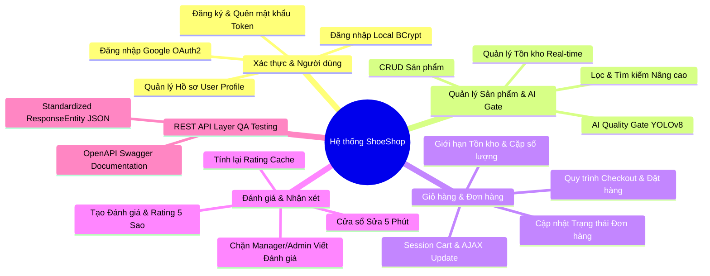
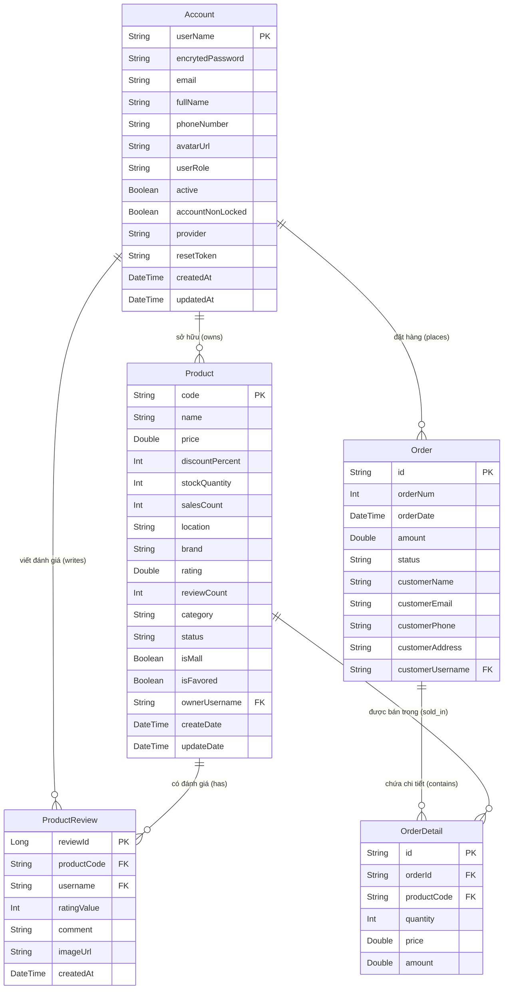

<p align="center">
  
</p>

<h1 align="center">👟 ShoeShop - Tài liệu SRS & Hướng dẫn Vận hành</h1>

<p align="center">
  <strong>Nền tảng thương mại điện tử giày dép tích hợp AI Kiểm duyệt chất lượng ảnh và REST API cho QA Testing</strong>
</p>

<p align="center">
  
  
  
  
  
</p>

---

## 🎯 1. Mục tiêu hệ thống (System Goals)

**ShoeShop** là một hệ thống thương mại điện tử đa nền tảng hiện đại, được xây dựng trên kiến trúc lai (Hybrid Architecture) kết hợp giữa **Server-Side Rendering (Thymeleaf)** cho trải nghiệm người dùng Web mượt mà và lớp **RESTful API song song (`/api/v1/`)** dành riêng cho kiểm thử tự động (QA Testing/Postman) và tích hợp ứng dụng di động. Hệ thống tích hợp sẵn Microservice AI (Python FastAPI + YOLOv8) để kiểm duyệt chất lượng hình ảnh sản phẩm trước khi lưu vào cơ sở dữ liệu.

### 1.1. Vấn đề thực tiễn
Các sàn thương mại điện tử và cửa hàng bán lẻ giày dép thường gặp phải các thách thức vận hành:
- **Kiểm duyệt ảnh thủ công tốn chi phí:** Người bán đăng ảnh kém chất lượng, ảnh nhái, không đúng chuẩn thương hiệu gây tổn hại uy tín sàn.
- **Bán vượt tồn kho (Overselling):** Không kiểm soát tồn kho tức thời (Real-time Stock) dẫn đến việc khách hàng đặt hàng khi sản phẩm đã hết trong kho.
- **Khó khăn trong kiểm thử tự động:** Các ứng dụng Web SSR thuần túy thường trả về giao diện HTML khiến đội ngũ QA khó viết kịch bản test API tự động bằng Postman hay REST Assured.
- **Phân quyền và bảo mật phức tạp:** Khó khăn trong việc phân định quyền hạn giữa Khách hàng (User), Quản lý cửa hàng (Manager) và Quản trị hệ thống (Admin).

### 1.2. Giải pháp của ShoeShop
ShoeShop giải quyết triệt để các vấn đề trên thông qua:
- **Cổng AI Kiểm duyệt ảnh tự động (AI Quality Gate):** Tích hợp microservice Python FastAPI chạy mô hình YOLOv8 để tự động phân tích độ phân giải, định dạng và chất lượng hình ảnh sản phẩm được tải lên bởi Người bán/Admin trước khi lưu DB.
- **Hệ thống Quản lý tồn kho tức thời (Stock & Inventory Management):** Tự động trừ tồn kho khi chốt đơn hàng, ngăn chặn hành vi đặt hàng vượt số lượng khả dụng, hiển thị nhãn "Hết hàng" sống động trên giao diện.
- **Kiến trúc REST API song song (`/api/v1/`):** Cung cấp bộ API RESTful chuẩn mực bọc dữ liệu trong `ResponseEntity<?>` kèm HTTP Status Codes chính xác, hỗ trợ kiểm thử tự động QA và tích hợp ứng dụng di động.
- **Hệ thống Phân quyền Role-based:** Phân định rõ ranh giới thao tác giữa ROLE_USER (Khách hàng), ROLE_MANAGER (Quản lý) và ROLE_ADMIN (Quản trị viên).

---

## 🛠️ 2. Yêu cầu chức năng (Functional Requirements)

Hệ thống ShoeShop được thiết kế thành các phân hệ chức năng chuyên biệt:



### 2.1. Phân hệ Xác thực & Quản lý Tài khoản (Authentication & Account Management)
- **Đăng nhập Hệ thống:**
  - Hỗ trợ 2 phương thức đăng nhập: Đăng nhập Local (User/Password qua `BCryptPasswordEncoder`) và Đăng nhập Google OAuth2.
  - Phân quyền người dùng theo các vai trò: `ROLE_USER` (Khách hàng), `ROLE_MANAGER` (Quản lý cửa hàng), `ROLE_ADMIN` (Quản trị viên hệ thống).
- **Đăng ký Tài khoản (`/register`):**
  - Khách hàng đăng ký tài khoản Local mới với kiểm tra trùng lặp Email/Username tự động.
- **Quên & Đặt lại mật khẩu (`/forgotPassword`, `/resetPassword`):**
  - Tạo mã xác thực ngẫu nhiên (UUID Token) lưu trên DB để người dùng xác minh và thiết lập lại mật khẩu mới an toàn.
- **Quản lý Hồ sơ Cá nhân (`/admin/user/profile`):**
  - Xem và cập nhật thông tin cá nhân (Họ tên, Email, Số điện thoại, Avatar URL).
  - Cho phép đổi mật khẩu cũ đối với tài khoản Local.

### 2.2. Phân hệ Quản lý Sản phẩm & Cổng AI Kiểm duyệt (Product Management & AI Quality Gate)
- **Danh sách & Bộ lọc Sản phẩm (`/productList`):**
  - Hiển thị danh sách sản phẩm phân trang với các bộ lọc linh hoạt: Theo danh mục, thương hiệu (GEN ALPHA, COOLMATE, Originals), địa điểm, khoảng giá, và sắp xếp (mới nhất, bán chạy, giá tăng/giảm).
- **Cổng AI Kiểm duyệt Ảnh (AI Quality Gate):**
  - Khi Seller/Admin tải ảnh sản phẩm mới lên (`/admin/product`), Spring Boot backend tự động chuyển tiếp file ảnh dưới dạng `multipart/form-data` tới Python FastAPI Service (`/api/v1/analyze`).
  - Nếu AI đánh giá ảnh không đạt tiêu chuẩn (ảnh mờ, sai định dạng, vi phạm), hệ thống từ chối lưu và phản hồi lý do lỗi AI lên màn hình.
- **Quản lý Tồn kho (Inventory Management):**
  - Cho phép Seller/Admin nhập và cập nhật số lượng tồn kho (`stockQuantity`).
  - Hiển thị thông báo "Sản phẩm còn: X" màu xanh khi còn hàng và nhãn "Hết hàng" đè lên ảnh khi `stockQuantity <= 0`.

### 2.3. Phân hệ Giỏ hàng & Xử lý Đơn hàng (Cart & Order Processing)
- **Quản lý Giỏ hàng Session (Session Cart):**
  - Thêm sản phẩm vào giỏ hàng (`/addToCart`, `/buyProduct`), cập nhật số lượng trực tiếp bằng AJAX (`/api/updateCartQuantity`) không cần reload trang.
  - Kiểm tra tồn kho thời gian thực: Tự động giới hạn số lượng trong giỏ hàng không vượt quá số lượng còn lại trong kho.
- **Quy trình Thanh toán & Chốt đơn (Checkout Flow):**
  - Nhập thông tin giao hàng (`CustomerForm`), xác nhận hóa đơn (`/shoppingCartConfirmation`) và hoàn tất đơn hàng (`/shoppingCartFinalize`).
- **Trừ Tồn kho & Ngăn chặn Bán vượt (Oversell Prevention):**
  - Trong giao dịch `@Transactional saveOrder()`, hệ thống tự động kiểm tra số lượng tồn kho khả dụng của từng sản phẩm trong đơn.
  - Nếu thiếu hàng, hệ thống tung ngoại lệ ném transaction rollback ngắt đơn hàng ngay lập tức.
  - Sau khi chốt đơn thành công, tự động trừ `stockQuantity` và tăng `salesCount` sản phẩm.
- **Quản lý Đơn hàng (Order Management):**
  - Admin/Seller xem danh sách đơn hàng (`/admin/orderList`), chi tiết đơn hàng (`/admin/order`) và cập nhật trạng thái đơn hàng (`PENDING`, `APPROVED`, `SHIPPED`, `COMPLETED`, `CANCELLED`).

### 2.4. Phân hệ Đánh giá & Nhận xét (Product Reviews & Ratings)
- **Đánh giá Sản phẩm (`/product/review`):**
  - Khách hàng đã đăng nhập có thể viết đánh giá và chấm điểm sao (1 - 5 sao) cho sản phẩm.
  - Chặn tài khoản Manager/Admin viết đánh giá (chỉ có quyền đọc đánh giá của khách hàng).
- **Cửa sổ Chỉnh sửa 5 Phút:**
  - Cho phép người dùng chỉnh sửa nội dung bài đánh giá trong vòng 5 phút kể từ lúc đăng. Qua 5 phút hệ thống khóa quyền sửa.
- **Cập nhật Cache Điểm đánh giá (Rating Counter Cache):**
  - Mỗi khi có đánh giá mới, chỉnh sửa hoặc xóa đánh giá, hệ thống tự động tính toán lại điểm đánh giá trung bình (`rating`) và số lượng nhận xét (`reviewCount`) lưu trên bảng `Products`.

### 2.5. Lớp REST API song song cho QA Testing (`/api/v1/`)
- Cung cấp bộ API RESTful thuần dữ liệu JSON cho đội ngũ QA kiểm thử tự động Postman:
  - **`ProductApiController`** (`/api/v1/products`): Tra cứu, phân trang, lấy chi tiết, tạo mới và xóa sản phẩm.
  - **`OrderApiController`** (`/api/v1/orders`): Danh sách đơn hàng, chi tiết đơn hàng, cập nhật trạng thái đơn.
  - **`CartApiController`** (`/api/v1/cart`): Quản lý giỏ hàng session, thêm/sửa/xóa item, nhập người nhận và checkout.
  - **`UserApiController`** (`/api/v1/users`): Danh sách tài khoản, thông tin tài khoản, đăng ký mới, lấy/cập nhật profile.
  - **`ReviewApiController`** (`/api/v1/reviews`): Tra cứu đánh giá theo sản phẩm, gửi/sửa/xóa đánh giá.

---

## 🔒 3. Yêu cầu phi chức năng (Non-Functional Requirements)

### 3.1. Yêu cầu Bảo mật (Security)
- **Mã hóa Mật khẩu:** Tất cả mật khẩu tài khoản Local được băm (hash) bằng `BCryptPasswordEncoder` với độ phức tạp cao.
- **Bảo mật Spring Security:**
  - Cấu hình chuỗi lọc Spring Security phân định ranh giới truy cập các đường dẫn công khai (`/`, `/productList`, `/swagger-ui.html`, `/api/v1/**`) và các đường dẫn yêu cầu đăng nhập/quyền Admin.
- **Bảo vệ Chống Tấn công Path Traversal:**
  - Kiểm tra và làm sạch đường dẫn tệp tin trong endpoint đọc file (`/viewFile`) để tránh lỗi đọc xuyên thư mục hệ thống.

### 3.2. Yêu cầu Hiệu năng (Performance)
- **Tách biệt Microservice Xử lý AI:**
  - Tác vụ tính toán thị giác máy tính nặng (YOLOv8) được chuyển giao hoàn toàn cho Microservice Python FastAPI độc lập giúp cho Spring Boot backend giữ được tốc độ phản hồi nhanh.
- **Tối ưu hóa Cơ sở dữ liệu:**
  - Đánh chỉ mục (Index) trên các trường thường xuyên tìm kiếm và lọc như `Product.code`, `Account.email`, `Order.customerUsername`, `ProductReview.productCode`.
  - Sử dụng HQL constructor queries tối ưu hóa số lượng cột lấy ra từ DB.

### 3.3. Yêu cầu Kiến trúc & Kiểm thử (Architecture & Testing)
- **Kiến trúc Lai (Hybrid Architecture):** Kết hợp hoàn hảo giữa Server-Side Rendering (Thymeleaf HTML) cho người dùng cuối và Pure REST API (JSON) cho QA Automated Testing.
- **Tài liệu OpenAPI / Swagger UI:** Tích hợp Springdoc OpenAPI 3.0 tự động sinh tài liệu API đẹp mắt tại `http://localhost/swagger-ui.html` và container Swagger UI độc lập tại `http://localhost:8082`.

---

## 📂 4. Phụ lục (Appendix)

### 4.1. Sơ đồ thực thể cơ sở dữ liệu (Database ERD)

Dưới đây là sơ đồ quan hệ của cơ sở dữ liệu ShoeShop được mô tả bằng cú pháp Mermaid:



---

### 4.2. Dữ liệu mẫu (Sample Data Structure)

Dưới đây là ví dụ về cấu trúc dữ liệu JSON mẫu của một đối tượng **Product** và **Order**:

#### Đối tượng Product mẫu
```json
{
  "code": "S001",
  "name": "Giày Thể Thao Sneaker Nam Gen Alpha",
  "price": 350.0,
  "discountPercent": 10,
  "stockQuantity": 50,
  "salesCount": 1250,
  "location": "Thành phố Hồ Chí Minh",
  "brand": "GEN ALPHA",
  "rating": 4.8,
  "reviewCount": 24,
  "category": "Giày Sneaker",
  "status": "ACTIVE",
  "isMall": true,
  "isFavored": true,
  "ownerUsername": "manager1",
  "createDate": "2026-07-20T10:00:00.000Z"
}
```

#### Đối tượng Order mẫu
```json
{
  "id": "cfa328b9-87a1-4e12-b91a-9f872365efd1",
  "orderNum": 1002,
  "orderDate": "2026-07-30T14:00:00.000Z",
  "amount": 700.0,
  "status": "APPROVED",
  "customerName": "Trương Hoài Dược",
  "customerEmail": "truongduoc1512@gmail.com",
  "customerPhone": "0949096416",
  "customerAddress": "123 Đường Nguyễn Huệ, Quận 1, TP.HCM",
  "customerUsername": "truongduoc",
  "details": [
    {
      "id": "det-001",
      "productCode": "S001",
      "productName": "Giày Thể Thao Sneaker Nam Gen Alpha",
      "quantity": 2,
      "price": 350.0,
      "amount": 700.0
    }
  ]
}
```

---

### 4.3. Tổng quan về API (API Endpoint Specs)

Hệ thống cung cấp song song giao diện Web MVC và hệ thống RESTful API chuẩn cho QA testing:

| Nhóm chức năng | Phương thức | Endpoint | Loại | Mô tả |
| :--- | :--- | :--- | :--- | :--- |
| **Giao diện Web** | `GET` | `/` | MVC | Trang chủ hiển thị sản phẩm nổi bật |
| | `GET` | `/productList` | MVC | Danh sách sản phẩm kèm bộ lọc & phân trang |
| | `GET` | `/productDetail` | MVC | Trang chi tiết sản phẩm & danh sách nhận xét |
| | `GET`/`POST` | `/shoppingCart` | MVC | Xem và cập nhật số lượng giỏ hàng Session |
| | `GET`/`POST` | `/shoppingCartCustomer` | MVC | Điền thông tin người nhận hàng |
| | `POST` | `/shoppingCartConfirmation` | MVC | Xác nhận đơn hàng và lưu DB |
| | `GET` | `/admin/login` | MVC | Màn hình đăng nhập tài khoản |
| | `GET`/`POST` | `/admin/product` | MVC | Form thêm/sửa sản phẩm tích hợp AI Gate |
| **REST API (QA)** | `GET` | `/api/v1/products` | REST | Lấy danh sách sản phẩm phân trang (JSON) |
| | `GET` | `/api/v1/products/{code}` | REST | Lấy chi tiết 1 sản phẩm theo mã Code |
| | `POST` | `/api/v1/products` | REST | Tạo mới/cập nhật sản phẩm bằng JSON |
| | `DELETE` | `/api/v1/products/{code}` | REST | Xóa sản phẩm theo mã Code |
| | `GET` | `/api/v1/orders` | REST | Lấy danh sách đơn hàng có phân trang |
| | `GET` | `/api/v1/orders/{orderId}` | REST | Lấy chi tiết đơn hàng & sản phẩm |
| | `PUT` | `/api/v1/orders/{orderId}/status` | REST | Cập nhật trạng thái đơn hàng |
| | `GET` | `/api/v1/cart` | REST | Lấy thông tin giỏ hàng hiện tại |
| | `POST` | `/api/v1/cart/items` | REST | Thêm sản phẩm vào giỏ (JSON payload) |
| | `POST` | `/api/v1/cart/checkout` | REST | Chốt đơn hàng từ giỏ hàng Session |
| | `POST` | `/api/v1/users/register` | REST | Đăng ký tài khoản người dùng mới |
| | `GET` | `/api/v1/users/profile` | REST | Lấy thông tin hồ sơ tài khoản |
| | `GET` | `/api/v1/reviews/product/{code}` | REST | Lấy danh sách nhận xét của sản phẩm |
| | `POST` | `/api/v1/reviews` | REST | Gửi nhận xét & đánh giá sao mới |

---

### 4.4. Hướng dẫn kỹ thuật và chạy local (Technical & Operations Guide)

#### Cấu trúc thư mục dự án
```text
shoeshop/
├── ai-service/                # Python FastAPI Microservice (AI Image Quality Gate)
│   ├── app/
│   │   └── main.py            # FastAPI App & YOLOv8 Inference engine
│   ├── Dockerfile
│   └── requirements.txt
├── src/
│   ├── main/
│   │   ├── java/com/example/demo/
│   │   │   ├── config/        # WebSecurity, OpenApiConfig, WebConfig
│   │   │   ├── controller/    # Controllers giao diện Web MVC (Product, Order, Cart, User, Home, Review)
│   │   │   │   └── api/       # Lớp REST API Controllers song song dành cho QA (/api/v1/*)
│   │   │   ├── dao/           # Hibernate Data Access Objects (ProductDAO, OrderDAO, AccountDAO, ProductReviewDAO)
│   │   │   ├── entity/        # JPA Entities (Product, Order, OrderDetail, Account, ProductReview)
│   │   │   ├── form/          # Form DTOs & Validation Forms
│   │   │   ├── model/         # Value Models (ProductInfo, OrderInfo, CartInfo)
│   │   │   └── service/       # Custom Security UserDetails & OAuth2 Services
│   │   └── resources/
│   │       ├── db/migration/  # Các script quản lý phiên bản Flyway DB
│   │       ├── static/        # Tệp tin tĩnh (CSS, JS, Hình ảnh giao diện)
│   │       ├── templates/     # Giao diện Thymeleaf HTML (productList, productDetail, shoppingCart, v.v.)
│   │       └── application.properties
├── docker-compose.yml         # File khởi chạy toàn bộ hệ thống Container
├── nginx.conf                 # Cấu hình Nginx Reverse Proxy
└── pom.xml                    # File cấu hình Maven Dependencies
```

#### Các biến môi trường cần thiết (.env)
Tham khảo file môi trường mẫu tại [`.env.example`](./.env.example):

| Biến môi trường | Bắt buộc | Vai trò / Ý nghĩa |
| :--- | :--- | :--- |
| `SPRING_DATASOURCE_URL` | Có | Đường dẫn kết nối JDBC tới MySQL DB |
| `SPRING_DATASOURCE_USERNAME` | Có | Tên tài khoản MySQL |
| `SPRING_DATASOURCE_PASSWORD` | Có | Mật khẩu MySQL |
| `AI_SERVICE_URL` | Có | URL kết nối tới Python AI Microservice (Mặc định `http://ai-service:8000`) |
| `GOOGLE_CLIENT_ID` | Không | OAuth2 Client ID đăng nhập bằng Google |
| `GOOGLE_CLIENT_SECRET` | Không | OAuth2 Client Secret đăng nhập bằng Google |

#### Hướng dẫn cài đặt và khởi động nhanh bằng Maven Local

1. **Khởi động MySQL Server:**
   Đảm bảo MySQL đang chạy trên port `3306` (hoặc `3307`) và tạo sẵn database `shoe_shopdb`.

2. **Biên dịch và đóng gói mã nguồn Java:**
   ```bash
   mvn clean package -DskipTests
   ```

3. **Khởi chạy ứng dụng Spring Boot:**
   ```bash
   mvn spring-boot:run
   ```
   *Mở trình duyệt truy cập: `http://localhost:8080`.*

#### Hướng dẫn khởi chạy hoàn chỉnh bằng Docker Compose

Để chạy toàn bộ hệ thống bao gồm **Spring Boot App, MySQL Database, Python AI Service, Nginx Proxy, phpMyAdmin và Swagger UI** chỉ bằng 1 lệnh duy nhất:

1. **Khởi chạy toàn bộ hệ thống Container:**
   ```bash
   docker compose up -d --build
   ```

2. **Các cổng dịch vụ sau khi khởi chạy:**
   - 🌐 **Website ShoeShop (Nginx Reverse Proxy):** `http://localhost`
   - ⚡ **Backend Spring Boot Trực tiếp:** `http://localhost:8080`
   - 📖 **Swagger UI API Documentation:** `http://localhost/swagger-ui.html` hoặc `http://localhost:8082`
   - 🗄️ **phpMyAdmin Quản trị Database:** `http://localhost:8081` (User: `root` / Pass: `truonghoaiduoc5`)
   - 🤖 **Python AI FastAPI Service:** `http://localhost:8000/docs`

3. **Luồng CI/CD Tự động hóa qua GitHub Actions:**
   - Mỗi khi đẩy code lên nhánh `main`, GitHub Actions Workflow tự động chạy kiểm thử, đóng gói Docker Image và deploy tự động lên máy chủ AWS EC2.