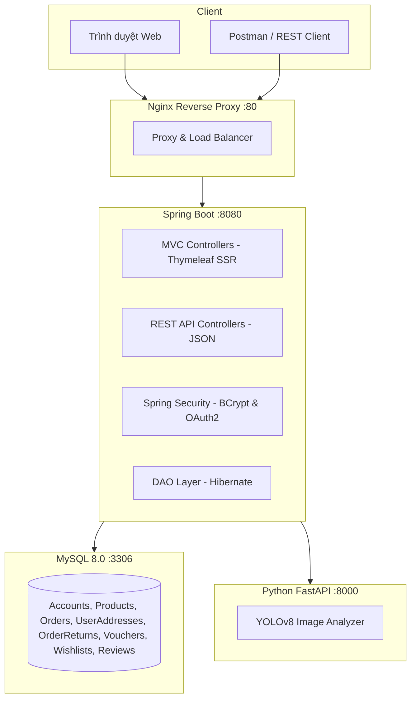
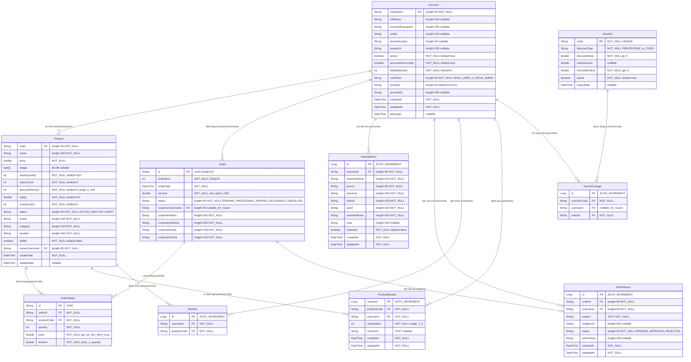

<p align="center">
  
</p>

<h1 align="center">👟 ShoeShop — Đặc Tả Yêu Cầu Phần Mềm (SRS)</h1>

<p align="center">
  <strong>Nền tảng thương mại điện tử giày dép tích hợp AI Kiểm duyệt Ảnh · Sổ Địa Chỉ · Hủy/Trả Hàng · REST API cho QA Testing</strong>
</p>

<p align="center">
  
  
  
  
  
</p>

---

## Mục Lục

1. [Giới Thiệu](#1-giới-thiệu)
2. [Mô Tả Tổng Quan Hệ Thống](#2-mô-tả-tổng-quan-hệ-thống)
3. [Tác Nhân & Phân Quyền](#3-tác-nhân--phân-quyền)
4. [Yêu Cầu Chức Năng](#4-yêu-cầu-chức-năng)
5. [Yêu Cầu Phi Chức Năng](#5-yêu-cầu-phi-chức-năng)
6. [Phụ Lục A — Từ Điển Thuật Ngữ](#6-phụ-lục-a--từ-điển-thuật-ngữ)
7. [Phụ Lục B — Sơ Đồ ERD](#7-phụ-lục-b--sơ-đồ-thực-thể-csdl-erd)
8. [Phụ Lục C — Danh Mục API](#8-phụ-lục-c--danh-mục-api-chi-tiết)
9. [Phụ Lục D — Dữ Liệu Mẫu JSON](#9-phụ-lục-d--dữ-liệu-mẫu-json)
10. [Phụ Lục E — Cấu Trúc & Vận Hành](#10-phụ-lục-e--cấu-trúc-thư-mục--hướng-dẫn-vận-hành)

---

## 1. Giới Thiệu

### 1.1. Mục Đích Tài Liệu

Tài liệu này là **Đặc Tả Yêu Cầu Phần Mềm (SRS — Software Requirements Specification)** của hệ thống **ShoeShop**, chuẩn hóa theo **IEEE 830**. Mục tiêu:

- Mô tả đầy đủ yêu cầu chức năng (FR) và phi chức năng (NFR).
- Làm **cơ sở thiết kế Test Case** — mọi biến đầu vào, ràng buộc và giới hạn giá trị đều được truy vết ngược về tài liệu này.
- Là tài liệu tham chiếu chính xác cho Developer khi lập trình và bảo trì.

### 1.2. Phạm Vi Hệ Thống

**ShoeShop** là hệ thống thương mại điện tử bán lẻ giày dép, kiến trúc lai (**Hybrid Architecture**):

- **Tầng SSR (Web):** Spring MVC + Thymeleaf phục vụ người dùng cuối qua trình duyệt.
- **Tầng REST API song song (`/api/v1/`):** JSON API thuần dữ liệu cho kiểm thử tự động (Postman, REST Assured).
- **Microservice AI (Python FastAPI):** Kiểm duyệt chất lượng ảnh bằng YOLOv8, chạy độc lập.

### 1.3. Đối Tượng Đọc Tài Liệu

| Đối tượng | Mục đích sử dụng |
| :--- | :--- |
| **QA Tester** | Thiết kế và thực thi test case dựa trên ràng buộc trong tài liệu |
| **Developer** | Tra cứu ràng buộc nghiệp vụ khi lập trình và review code |
| **Giảng viên / Reviewer** | Đánh giá tính đầy đủ, chính xác và khả năng truy vết yêu cầu |

### 1.4. Lịch Sử Phiên Bản

| Phiên bản | Ngày | Nội dung thay đổi |
| :---: | :--- | :--- |
| **v1.0** | 2026-09-01 | Phiên bản đầu tiên — kiến trúc cơ bản |
| **v2.0** | 2026-09-19 | Bổ sung Actors, Glossary, Use Case flows, ERD đầy đủ — chuẩn IEEE 830 |

---

## 2. Mô Tả Tổng Quan Hệ Thống

### 2.1. Vấn Đề Thực Tiễn

| # | Vấn đề | Biểu hiện thực tế |
| :---: | :--- | :--- |
| 1 | **Kiểm duyệt ảnh thủ công** | Người bán đăng ảnh kém chất lượng, nhái thương hiệu |
| 2 | **Bán vượt tồn kho (Overselling)** | Khách đặt hàng khi sản phẩm đã hết kho do thiếu kiểm tra Real-time |
| 3 | **Thiếu Sổ Địa Chỉ** | Khách phải nhập lại địa chỉ mỗi lần mua, không lưu được nhiều địa chỉ |
| 4 | **Thiếu quy trình Hủy/Trả hàng** | Khách liên hệ ngoài hệ thống để hủy/trả, không có luồng duyệt chuẩn |
| 5 | **Khó kiểm thử tự động** | Web SSR trả HTML, đội QA khó viết kịch bản Postman/REST Assured |
| 6 | **Phân quyền chưa tách biệt** | Chưa phân định rõ `ROLE_USER` (Khách hàng) vs `ROLE_ADMIN` (Quản trị viên) |

### 2.2. Giải Pháp

| Vấn đề | Giải pháp triển khai |
| :--- | :--- |
| Kiểm duyệt ảnh | **AI Quality Gate:** Python FastAPI + YOLOv8 phân tích ảnh trước khi lưu DB |
| Overselling | **Real-time Stock:** Trừ/hoàn kho trong `@Transactional`, chặn đặt hàng vượt kho |
| Sổ địa chỉ | **Address Book REST API** `/api/v1/users/addresses`: CRUD + Dropdown tại Checkout |
| Hủy/Trả hàng | **Order Cancel & Return:** API hủy đơn `PENDING`, yêu cầu trả kèm ảnh, Admin duyệt |
| Kiểm thử khó | **REST API `/api/v1/`:** JSON API chuẩn với HTTP Status Code chính xác + Swagger UI |
| Phân quyền | **Spring Security 2 Role:** `ROLE_ADMIN` vs `ROLE_USER`, Dashboard tách biệt hoàn toàn |

### 2.3. Kiến Trúc Tổng Quan



---

## 3. Tác Nhân & Phân Quyền

### 3.1. Danh Sách Tác Nhân

| Actor | Định danh | Mô tả | Tài khoản mẫu |
| :--- | :---: | :--- | :--- |
| **Khách vãng lai** | `Anonymous` | Chưa đăng nhập. Xem sản phẩm, thêm giỏ, đặt hàng không cần tài khoản. | *(không có)* |
| **Khách hàng** | `ROLE_USER` | Đã đăng nhập. Toàn bộ quyền Guest + quản lý cá nhân. | `employee1`, `employee2` |
| **Quản trị viên** | `ROLE_ADMIN` | Quản lý toàn bộ hệ thống. | `manager1` |
| **AI Service** | *(internal)* | Microservice Python tự động phân tích ảnh khi Admin tải lên sản phẩm. | *(tự động)* |

### 3.2. Ma Trận Phân Quyền

| Chức năng | Guest | ROLE_USER | ROLE_ADMIN |
| :--- | :---: | :---: | :---: |
| Xem / tìm kiếm sản phẩm | ✅ | ✅ | ✅ |
| Thêm vào giỏ hàng | ✅ | ✅ | ✅ |
| Đặt hàng (Guest Checkout) | ✅ | ✅ | ❌ |
| Đăng ký / Đăng nhập | ✅ | — | — |
| Quản lý sổ địa chỉ (CRUD) | ❌ | ✅ | ❌ |
| Xem lịch sử đơn hàng | ❌ | ✅ (chính chủ) | ✅ (toàn shop) |
| Hủy đơn hàng `PENDING` | ❌ | ✅ (chính chủ) | ✅ |
| Yêu cầu trả hàng | ❌ | ✅ (chính chủ) | ❌ |
| Wishlist / Đánh giá sản phẩm | ❌ | ✅ | ❌ |
| Đăng / Sửa / Xóa sản phẩm | ❌ | ❌ | ✅ |
| Quản lý Voucher | ❌ | ❌ | ✅ |
| Duyệt yêu cầu trả hàng | ❌ | ❌ | ✅ |
| Dashboard doanh thu & Analytics | ❌ | ❌ | ✅ |

> **Lưu ý cho Tester:** Mọi endpoint `/api/v1/admin/*` yêu cầu `ROLE_ADMIN`. Gọi bằng `ROLE_USER` nhận `HTTP 403`; gọi khi chưa đăng nhập nhận `HTTP 401`.

### 3.3. Cơ Chế Xác Thực

| Phương thức | Mô tả | Endpoint |
| :--- | :--- | :--- |
| **Local (BCrypt)** | Username + Password băm bằng `BCryptPasswordEncoder`. Khóa sau **5 lần thất bại**. | `POST /login` |
| **Google OAuth2** | Đăng nhập Google. Tự tạo `ROLE_USER` nếu email chưa tồn tại. | `/oauth2/authorization/google` |
| **HTTP Session** | Phiên làm việc duy trì qua HTTP Session (không stateless JWT). | — |

---

## 4. Yêu Cầu Chức Năng

### 4.1. Bảng Tổng Hợp Danh Mục Chức Năng Hệ Thống

Dưới đây là danh mục toàn bộ **38 chức năng chi tiết** của hệ thống ShoeShop, được phân loại theo 9 phân hệ nghiệp vụ, phục vụ trực tiếp cho việc thiết kế Test Case Black-box:

| Mã FR | Tên chức năng con | Tác nhân chính (Actor) | Giao diện / Endpoint | Mức độ ưu tiên |
| :--- | :--- | :--- | :--- | :---: |
| **FR-01** | **Phân Hệ Xác Thực & Tài Khoản** | | | |
| FR-01.1 | Đăng ký tài khoản người dùng mới | Khách vãng lai (Guest) | `POST /register`, `POST /api/v1/auth/register` | High |
| FR-01.2 | Đăng nhập hệ thống (Local BCrypt) | Khách / Người dùng | `POST /login`, `POST /api/v1/auth/login` | High |
| FR-01.3 | Đăng nhập qua Google OAuth2 | Khách / Người dùng | `/oauth2/authorization/google` | Medium |
| FR-01.4 | Quên mật khẩu & Đặt lại qua Email | Khách / Người dùng | `POST /forgot-password`, `POST /reset-password` | Medium |
| FR-01.5 | Đăng xuất khỏi hệ thống | Người dùng / Admin | `POST /logout` | High |
| FR-01.6 | Xem trang thông tin cá nhân & Dashboard | Người dùng / Admin | `GET /accountInfo`, `GET /admin/accountInfo` | Medium |
| FR-01.7 | Quản lý danh sách người dùng (Admin) | Quản trị viên (Admin) | `GET /api/v1/admin/users` | Medium |
| FR-01.8 | Kích hoạt / Khóa tài khoản người dùng | Quản trị viên (Admin) | `PUT /api/v1/admin/users/{username}/status` | High |
| FR-01.9 | Đặt lại mật khẩu tài khoản người dùng | Quản trị viên (Admin) | `POST /api/v1/admin/users/{username}/reset-password` | Medium |
| **FR-02** | **Phân Hệ Sổ Địa Chỉ Giao Hàng** | | | |
| FR-02.1 | Xem danh sách địa chỉ nhận hàng | Người dùng (ROLE_USER) | `GET /api/v1/users/addresses` | High |
| FR-02.2 | Xem chi tiết một địa chỉ nhận hàng | Người dùng (ROLE_USER) | `GET /api/v1/users/addresses/{id}` | Medium |
| FR-02.3 | Thêm mới địa chỉ giao hàng | Người dùng (ROLE_USER) | `POST /api/v1/users/addresses` | High |
| FR-02.4 | Cập nhật thông tin địa chỉ giao hàng | Người dùng (ROLE_USER) | `PUT /api/v1/users/addresses/{id}` | High |
| FR-02.5 | Xóa địa chỉ giao hàng | Người dùng (ROLE_USER) | `DELETE /api/v1/users/addresses/{id}` | High |
| FR-02.6 | Thiết lập địa chỉ nhận hàng mặc định | Người dùng (ROLE_USER) | `PUT /api/v1/users/addresses/{id}/default` | High |
| **FR-03** | **Phân Hệ Quản Lý Sản Phẩm & AI Gate** | | | |
| FR-03.1 | Xem danh sách và tìm kiếm sản phẩm | Mọi tác nhân | `GET /productList`, `GET /api/v1/products` | High |
| FR-03.2 | Xem chi tiết sản phẩm | Mọi tác nhân | `GET /product`, `GET /api/v1/products/{code}` | High |
| FR-03.3 | Thêm mới sản phẩm (Kèm AI Gate) | Quản trị viên (Admin) | `POST /product`, `POST /api/v1/products` | High |
| FR-03.4 | Cập nhật thông tin sản phẩm | Quản trị viên (Admin) | `POST /product`, `POST /api/v1/products` | High |
| FR-03.5 | Xóa / Ngừng kinh doanh sản phẩm | Quản trị viên (Admin) | `POST /admin/product/delete`, `DELETE /api/v1/products/{code}` | High |
| FR-03.6 | Kiểm duyệt chất lượng ảnh sản phẩm qua AI | Hệ thống / Admin | `POST http://ai-service:8000/api/v1/analyze` | High |
| **FR-04** | **Phân Hệ Giỏ Hàng (Cart)** | | | |
| FR-04.1 | Xem giỏ hàng hiện tại | Mọi tác nhân | `GET /shoppingCart`, `GET /api/v1/cart` | High |
| FR-04.2 | Thêm sản phẩm vào giỏ hàng | Mọi tác nhân | `GET /buyProduct`, `POST /api/v1/cart/items` | High |
| FR-04.3 | Cập nhật số lượng sản phẩm trong giỏ | Mọi tác nhân | `POST /shoppingCart`, `PUT /api/v1/cart/items/{productCode}` | High |
| FR-04.4 | Xóa từng sản phẩm khỏi giỏ hàng | Mọi tác nhân | `GET /shoppingCartRemoveProduct`, `DELETE /api/v1/cart/items/{productCode}` | High |
| FR-04.5 | Xóa toàn bộ sản phẩm trong giỏ hàng | Mọi tác nhân | `DELETE /api/v1/cart/items` | Medium |
| **FR-05** | **Phân Hệ Đặt Hàng & Thanh Toán (Checkout)** | | | |
| FR-05.1 | Nhập thông tin giao hàng khách hàng | Khách / Người dùng | `POST /shoppingCartCustomer`, `POST /api/v1/cart/customer` | High |
| FR-05.2 | Kiểm tra & Áp dụng mã giảm giá | Khách / Người dùng | `POST /api/v1/cart/voucher` | High |
| FR-05.3 | Xác nhận tóm tắt đơn hàng | Khách / Người dùng | `GET /shoppingCartConfirmation` | High |
| FR-05.4 | Chốt đặt hàng và trừ tồn kho | Khách / Người dùng | `POST /shoppingCartConfirmation`, `POST /api/v1/cart/checkout` | High |
| **FR-06** | **Phân Hệ Quản Lý Đơn Hàng & Hủy/Trả** | | | |
| FR-06.1 | Xem danh sách đơn hàng | Người dùng / Admin | `GET /orderList`, `GET /api/v1/orders` | High |
| FR-06.2 | Xem chi tiết đơn hàng | Người dùng / Admin | `GET /order`, `GET /api/v1/orders/{orderId}` | High |
| FR-06.3 | Cập nhật trạng thái xử lý đơn hàng | Quản trị viên (Admin) | `PUT /api/v1/admin/orders/{orderId}/status` | High |
| FR-06.4 | Hủy đơn hàng đang chờ xử lý | Người dùng / Admin | `POST /api/v1/orders/{orderId}/cancel` | High |
| FR-06.5 | Gửi yêu cầu trả hàng / hoàn tiền | Người dùng (ROLE_USER) | `POST /api/v1/orders/{orderId}/return` | High |
| FR-06.6 | Xét duyệt yêu cầu trả hàng | Quản trị viên (Admin) | `PUT /api/v1/admin/orders/{orderId}/return-status` | High |
| **FR-07** | **Phân Hệ Quản Lý Mã Giảm Giá (Voucher)** | | | |
| FR-07.1 | Xem danh sách mã giảm giá | Người dùng / Admin | `GET /api/v1/vouchers`, `GET /admin/vouchers` | Medium |
| FR-07.2 | Tạo mới mã giảm giá | Quản trị viên (Admin) | `POST /api/v1/admin/vouchers` | High |
| FR-07.3 | Cập nhật thông tin mã giảm giá | Quản trị viên (Admin) | `PUT /api/v1/admin/vouchers/{id}` | High |
| FR-07.4 | Xóa mã giảm giá | Quản trị viên (Admin) | `DELETE /api/v1/admin/vouchers/{id}` | Medium |
| **FR-08** | **Phân Hệ Đánh Giá & Bình Luận (Review)** | | | |
| FR-08.1 | Xem danh sách đánh giá của sản phẩm | Mọi tác nhân | `GET /api/v1/products/{productCode}/reviews` | High |
| FR-08.2 | Gửi đánh giá và chấm điểm sản phẩm | Người dùng (ROLE_USER) | `POST /api/v1/products/{productCode}/reviews` | High |
| FR-08.3 | Chỉnh sửa đánh giá (Trong vòng 5 phút) | Người dùng (ROLE_USER) | `PUT /api/v1/products/{productCode}/reviews/{reviewId}` | Medium |
| FR-08.4 | Xóa đánh giá | Chủ sở hữu / Admin | `DELETE /api/v1/products/{productCode}/reviews/{reviewId}` | Medium |
| **FR-09** | **Phân Hệ Danh Sách Yêu Thích (Wishlist)** | | | |
| FR-09.1 | Xem danh sách sản phẩm yêu thích | Người dùng (ROLE_USER) | `GET /api/v1/wishlist` | Medium |
| FR-09.2 | Thêm sản phẩm vào danh sách yêu thích | Người dùng (ROLE_USER) | `POST /api/v1/wishlist/{productCode}` | Medium |
| FR-09.3 | Xóa sản phẩm khỏi danh sách yêu thích | Người dùng (ROLE_USER) | `DELETE /api/v1/wishlist/{productCode}` | Medium |

---

### 4.2. Đặc Tả Chi Tiết Từng Chức Năng

#### Phân Hệ 1: Xác Thực & Quản Lý Tài Khoản (Authentication & Account)

##### FR-01.1: Đăng Ký Tài Khoản Mới
- **Tác nhân:** Khách vãng lai (Guest).
- **Mục tiêu:** Tạo tài khoản thành viên mới trên hệ thống để mua sắm và quản lý đơn hàng.
- **Tiền điều kiện:** Người dùng chưa đăng nhập.
- **Dữ liệu đầu vào & Ràng buộc (Equivalence Partitioning & BVA):**
  - `username`: Bắt buộc, chuỗi từ 3 đến 50 ký tự, định dạng `^[a-zA-Z0-9._-]+$`, không được trùng với tài khoản đã có trong hệ thống.
  - `password`: Bắt buộc, chuỗi từ 8 đến 72 ký tự, chứa ít nhất 1 chữ hoa, 1 chữ thường, 1 chữ số.
  - `confirmPassword`: Bắt buộc, phải trùng khớp 100% với `password`.
  - `email`: Bắt buộc, chuỗi từ 6 đến 128 ký tự, đúng định dạng chuẩn RFC 5322, không trùng với email đã đăng ký.
- **Luồng sự kiện chính:**
  1. Người dùng truy cập trang Đăng ký, điền form thông tin.
  2. Hệ thống kiểm tra tính hợp lệ dữ liệu và tính duy nhất của `username` & `email`.
  3. Hệ thống băm mật khẩu bằng `BCryptPasswordEncoder` (độ dài băm 60 ký tự).
  4. Lưu thông tin tài khoản với quyền mặc định `ROLE_USER`, trạng thái `active = true`, `accountNonLocked = true`.
  5. Trả về thông báo thành công (HTTP 201 hoặc redirect về trang Login).
- **Luồng ngoại lệ (Exceptions):**
  - Trùng username hoặc email: Báo lỗi "Tài khoản hoặc email đã tồn tại" (HTTP 409).
  - Vi phạm độ dài/regex: Báo lỗi validation tương ứng (HTTP 400).
  - Password không khớp confirmPassword: Báo lỗi "Mật khẩu xác nhận không khớp" (HTTP 400).

##### FR-01.2: Đăng Nhập Hệ Thống (Local BCrypt)
- **Tác nhân:** Khách / Người dùng đã có tài khoản.
- **Mục tiêu:** Xác thực danh tính và cấp quyền truy cập các tính năng tương ứng theo Role.
- **Dữ liệu đầu vào & Ràng buộc:**
  - `username`: [3, 50] ký tự, không rỗng.
  - `password`: [8, 72] ký tự, không rỗng.
- **Quy tắc nghiệp vụ & Bảng quyết định (Decision Table):**
  - Mật khẩu đúng + `active == true` + `accountNonLocked == true` -> Đăng nhập thành công, reset `failedAttempts = 0`, phân quyền session (`ROLE_USER` chuyển về trang chủ, `ROLE_ADMIN` chuyển về Dashboard).
  - Mật khẩu sai + `failedAttempts < 4` -> Đăng nhập thất bại, tăng `failedAttempts += 1`, báo lỗi "Tên đăng nhập hoặc mật khẩu không chính xác".
  - Mật khẩu sai + `failedAttempts >= 4` (lần sai thứ 5) -> Đăng nhập thất bại, khóa tài khoản (`accountNonLocked = false`), ghi nhận thông báo "Tài khoản của bạn đã bị khóa do đăng nhập sai 5 lần liên tiếp".
  - Tài khoản có `active == false` -> Báo lỗi "Tài khoản đã bị vô hiệu hóa bởi Quản trị viên".

##### FR-01.3: Đăng Nhập Bằng Google OAuth2
- **Tác nhân:** Khách / Người dùng có tài khoản Google.
- **Luồng xử lý:** Chuyển hướng sang Google Authentication. Sau khi Google xác thực thành công:
  - Nếu email đã tồn tại trong CSDL -> Tự động đăng nhập với tài khoản tương ứng.
  - Nếu email chưa tồn tại -> Tự động khởi tạo tài khoản mới với role `ROLE_USER`, mật khẩu ngẫu nhiên băm BCrypt, trạng thái `active = true`.

##### FR-01.4: Quên Mật Khẩu & Đặt Lại Mật Khẩu
- **Tác nhân:** Người dùng quên mật khẩu.
- **Đầu vào:** `email` đã đăng ký.
- **Luồng xử lý:**
  1. Người dùng nhập email yêu cầu reset mật khẩu.
  2. Hệ thống kiểm tra: Nếu email tồn tại -> Sinh token reset mật khẩu ngẫu nhiên (UUID), có hiệu lực trong 15 phút, gửi link qua email.
  3. Người dùng click link, nhập mật khẩu mới [8, 72] ký tự và xác nhận.
  4. Hệ thống cập nhật mật khẩu mới băm BCrypt, hủy token, reset `failedAttempts = 0`, mở khóa tài khoản nếu đang bị khóa.

##### FR-01.5: Đăng Xuất (Logout)
- **Tác nhân:** Người dùng / Admin đang đăng nhập.
- **Hành động:** Hủy phiên làm việc (`session.invalidate()`), xóa SecurityContext, xóa cookies ghi nhớ phiên, chuyển hướng về trang chủ hoặc màn hình đăng nhập.

##### FR-01.6: Xem Thông Tin Tài Khoản & Dashboard
- **Tác nhân:** Người dùng đã đăng nhập (`ROLE_USER` hoặc `ROLE_ADMIN`).
- **Phân quyền Dashboard (`/admin/accountInfo` vs `/accountInfo`):**
  - **ROLE_USER:** Xem thông tin cá nhân, tổng chi tiêu cá nhân, số lượng đơn hàng cá nhân, liên kết tới sổ địa chỉ và đơn mua.
  - **ROLE_ADMIN:** Xem KPI toàn diện: tổng doanh thu shop, số lượng thành viên, số lượng đơn hàng theo trạng thái, tình trạng hoạt động của Microservice AI.

##### FR-01.7: [Admin] Quản Lý Danh Sách Người Dùng
- **Tác nhân:** Quản trị viên (`ROLE_ADMIN`).
- **Endpoint:** `GET /api/v1/admin/users`.
- **Chức năng:** Xem danh sách toàn bộ tài khoản; hỗ trợ phân trang (`page`, `size`), tìm kiếm theo từ khóa `keyword` (username, email) và lọc theo trạng thái `active`.

##### FR-01.8: [Admin] Khóa / Mở Khóa Tài Khoản
- **Tác nhân:** Quản trị viên (`ROLE_ADMIN`).
- **Endpoint:** `PUT /api/v1/admin/users/{username}/status`.
- **Đầu vào:** `active` (boolean).
- **Ràng buộc nghiệp vụ:** Không cho phép Admin tự vô hiệu hóa tài khoản của chính mình (Self-lock protection).

##### FR-01.9: [Admin] Đặt Lại Mật Khẩu Người Dùng
- **Tác nhân:** Quản trị viên (`ROLE_ADMIN`).
- **Endpoint:** `POST /api/v1/admin/users/{username}/reset-password`.
- **Đầu vào:** `newPassword`: [8, 72] ký tự.
- **Kết quả:** Cập nhật mật khẩu băm BCrypt mới cho user được chỉ định, reset cờ khóa tài khoản.

---

#### Phân Hệ 2: Sổ Địa Chỉ Giao Hàng (User Address Book)

##### FR-02.1: Xem Danh Sách Địa Chỉ
- **Tác nhân:** Người dùng (`ROLE_USER`).
- **Endpoint:** `GET /api/v1/users/addresses`.
- **Mô tả:** Trả về danh sách tất cả các địa chỉ nhận hàng thuộc quyền sở hữu của người dùng hiện tại (lọc theo `currentUser.username`).

##### FR-02.2: Xem Chi Tiết Một Địa Chỉ
- **Tác nhân:** Người dùng (`ROLE_USER`).
- **Endpoint:** `GET /api/v1/users/addresses/{id}`.
- **Kiểm tra bảo mật:** Địa chỉ có `id` phải thuộc sở hữu của người dùng hiện tại. Nếu truy cập ID của người dùng khác -> Trả về `HTTP 403 Forbidden` hoặc `404 Not Found`.

##### FR-02.3: Thêm Mới Địa Chỉ Giao Hàng
- **Tác nhân:** Người dùng (`ROLE_USER`).
- **Endpoint:** `POST /api/v1/users/addresses`.
- **Bảng Ràng Buộc Dữ Liệu Kiểm Thử (BVA & EP):**
  | Trường dữ liệu | Kiểu | Giới hạn độ dài | Mẫu định dạng (Regex) / Quy tắc | Lỗi vi phạm |
  | :--- | :---: | :---: | :--- | :--- |
  | `receiverName` | String | [1, 100] ký tự | `^[\p{L}0-9\s\-'.]+$` (Hỗ trợ tiếng Việt có dấu) | Rỗng, >100 kt, chứa ký tự đặc biệt |
  | `phone` | String | [1, 20] ký tự | `^[0-9+()\-\s.]+$` | Rỗng, >20 kt, chứa chữ cái/ký tự lạ |
  | `province` | String | [1, 100] ký tự | `^[\p{L}0-9\s\-'.]+$` | Rỗng, >100 kt, chứa ký tự cấm |
  | `district` | String | [1, 100] ký tự | `^[\p{L}0-9\s\-'.]+$` | Rỗng, >100 kt, chứa ký tự cấm |
  | `ward` | String | [1, 100] ký tự | `^[\p{L}0-9\s\-'.]+$` | Rỗng, >100 kt, chứa ký tự cấm |
  | `streetAddress`| String | [1, 255] ký tự | Không chứa các ký tự XSS/Injection: `<>{}~^$%*\` | Rỗng, >255 kt, chứa ký tự nguy hiểm |
  | `isDefault` | boolean| true / false | Mặc định false nếu đã có địa chỉ trước đó | Không hợp lệ kiểu |
- **Quy tắc nghiệp vụ:**
  1. Số lượng địa chỉ tối đa của 1 user là **10 địa chỉ**. Nếu người dùng đã có 10 địa chỉ mà tiếp tục tạo -> Trả về `HTTP 400 Bad Request` ("Số lượng địa chỉ tối đa là 10").
  2. Nếu người dùng chưa có địa chỉ nào trong hệ thống -> Địa chỉ tạo mới **tự động trở thành địa chỉ mặc định** (`isDefault = true`), bất kể người dùng truyền gì.
  3. Nếu `isDefault = true` -> Hệ thống tự động gỡ bỏ cờ `isDefault` của tất cả các địa chỉ cũ của người dùng này trong cùng transaction.

##### FR-02.4: Cập Nhật Thông Tin Địa Chỉ
- **Tác nhân:** Người dùng (`ROLE_USER`).
- **Endpoint:** `PUT /api/v1/users/addresses/{id}`.
- **Ràng buộc:** Kiểm tra quyền sở hữu (`address.username == currentUser.username`). Dữ liệu cập nhật phải tuân thủ toàn bộ bảng ràng buộc như tạo mới. Nếu cập nhật `isDefault = true`, toàn bộ địa chỉ khác của user bị bỏ mặc định.

##### FR-02.5: Xóa Địa Chỉ Giao Hàng
- **Tác nhân:** Người dùng (`ROLE_USER`).
- **Endpoint:** `DELETE /api/v1/users/addresses/{id}`.
- **Ràng buộc nghiệp vụ:**
  1. Chỉ được xóa địa chỉ của chính mình.
  2. Nếu xóa địa chỉ đang là mặc định (`isDefault = true`):
     - Nếu user còn địa chỉ khác -> Tự động chuyển địa chỉ gần nhất còn lại làm mặc định.
     - Nếu là địa chỉ duy nhất -> Xóa hoàn toàn.

##### FR-02.6: Thiết Lập Địa Chỉ Nhận Hàng Mặc Định
- **Tác nhân:** Người dùng (`ROLE_USER`).
- **Endpoint:** `PUT /api/v1/users/addresses/{id}/default`.
- **Hành động:** Chuyển địa chỉ chỉ định thành `isDefault = true`, toàn bộ địa chỉ khác của user thành `isDefault = false`.

---

#### Phân Hệ 3: Quản Lý Sản Phẩm & AI Quality Gate (Product Management)

##### FR-03.1: Xem Danh Sách & Tìm Kiếm Sản Phẩm
- **Tác nhân:** Khách vãng lai, Người dùng, Admin.
- **Endpoint:** `GET /productList`, `GET /api/v1/products`.
- **Tham số tìm kiếm & lọc:**
  - `page`: Số trang, nguyên `>= 1` (mặc định 1).
  - `like`: Từ khóa tìm kiếm theo tên sản phẩm hoặc mã code, không phân biệt hoa thường.
  - `maxResult`: Số bản ghi mỗi trang (mặc định 5 hoặc 20).
- **Kết quả:** Danh sách sản phẩm kèm thông tin phân trang, giá sau giảm giá, tồn kho thực tế, trạng thái.

##### FR-03.2: Xem Chi Tiết Sản Phẩm
- **Tác nhân:** Mọi tác nhân.
- **Endpoint:** `GET /product?code={code}`, `GET /api/v1/products/{code}`.
- **Kết quả:** Thông tin đầy đủ sản phẩm: mã code, tên, giá gốc, tỷ lệ giảm giá, giá khuyến mãi, số lượng trong kho, mô tả chi tiết, hình ảnh, điểm đánh giá trung bình và các nhận xét.

##### FR-03.3: Thêm Mới Sản Phẩm (Admin)
- **Tác nhân:** Quản trị viên (`ROLE_ADMIN`).
- **Endpoint:** `POST /product`, `POST /api/v1/products`.
- **Bảng Ràng Buộc Dữ Liệu Kiểm Thử (BVA & EP):**
  | Trường dữ liệu | Kiểu | Ràng buộc giá trị / Định dạng | Nguồn Code / Validator | Lỗi vi phạm |
  | :--- | :---: | :--- | :--- | :--- |
  | `code` | String | [1, 20] ký tự, không rỗng, không chứa khoảng trắng, **duy nhất CSDL** | `MAX_CODE_LENGTH = 20` | Rỗng, >20 kt, trùng code |
  | `name` | String | [1, 255] ký tự, không rỗng | `MAX_NAME_LENGTH = 255` | Rỗng, >255 kt |
  | `price` | double | Số thực hữu hạn, **> 0** | `price <= 0` | `<= 0`, chuỗi không phải số |
  | `stockQuantity`| int | Số nguyên, **>= 0**, mặc định 100 | `stockQuantity < 0` | `< 0`, số thập phân |
  | `discountPercent`| int | Số nguyên, trong khoảng **[0, 100]%**, mặc định 0 | `< 0` hoặc `> 100` | `< 0` hoặc `> 100` |
  | `status` | String | Một trong 3 giá trị: `ACTIVE`, `INACTIVE`, `DRAFT` | `@Column(length = 20)` | Giá trị khác enum |
  | `fileData` | File | Tùy chọn. Nếu có: Định dạng ảnh (.jpg, .png, .jpeg), dung lượng `<= 10 MB` | `MultipartFile` | File không phải ảnh, dung lượng > 10MB |
- **Quy trình xử lý:** Kiểm tra form validator -> Nếu có file ảnh, chuyển qua AI Quality Gate (xem FR-03.6) -> Lưu vào CSDL với trạng thái tương ứng.

##### FR-03.4: Cập Nhật Thông Tin Sản Phẩm (Admin)
- **Tác nhân:** Quản trị viên (`ROLE_ADMIN`).
- **Endpoint:** `POST /api/v1/products` (Upsert mode: nếu `code` đã tồn tại trong CSDL -> Thực hiện Update).
- **Ràng buộc:** Không cho phép sửa `code` đã tồn tại. Cho phép sửa `name`, `price`, `stockQuantity`, `discountPercent`, `status` và cập nhật ảnh mới. Toàn bộ validation áp dụng như FR-03.3.

##### FR-03.5: Xóa / Ngừng Kinh Doanh Sản Phẩm (Admin)
- **Tác nhân:** Quản trị viên (`ROLE_ADMIN`).
- **Endpoint:** `DELETE /api/v1/products/{code}`.
- **Ràng buộc toàn vẹn CSDL:**
  - Nếu sản phẩm đã từng phát sinh trong bất kỳ đơn hàng nào (`OrderDetails`) -> Hệ thống chặn xóa vật lý để đảm bảo lịch sử giao dịch, chuyển trạng thái sản phẩm sang `status = INACTIVE`.
  - Nếu sản phẩm chưa từng có trong đơn hàng -> Cho phép xóa bản ghi khỏi CSDL.

##### FR-03.6: Kiểm Duyệt Chất Lượng Ảnh Tự Động Bằng AI Gate
- **Tác nhân:** Hệ thống / Quản trị viên.
- **Endpoint gọi nội bộ:** `POST http://ai-service:8000/api/v1/analyze`.
- **Quy trình hoạt động:**
  1. Khi Admin upload ảnh sản phẩm mới hoặc thay đổi ảnh, backend gửi stream bytes ảnh tới Microservice FastAPI (YOLOv8).
  2. AI phân tích:
     - Nếu nhận diện là giày dép hợp lệ (`is_shoe = true`) với độ tin cậy `confidence >= 0.5` -> Trả về `approved = true`. Backend lưu ảnh vào CSDL.
     - Nếu ảnh bị mờ, ảnh rác hoặc không chứa sản phẩm giày dép -> Trả về `approved = false` kèm lý do vi phạm. Backend từ chối lưu và ném thông báo lỗi cho người dùng.
  3. **Cơ chế Fallback (Khả năng chịu lỗi cao):** Nếu Microservice AI bị sự cố/offline/timeout -> Backend ghi nhận log cảnh báo mức `WARN` và **vẫn cho phép lưu ảnh** sản phẩm để không làm gián đoạn quy trình kinh doanh của cửa hàng.

---

#### Phân Hệ 4: Giỏ Hàng (Shopping Cart)

##### FR-04.1: Xem Giỏ Hàng Hiện Tại
- **Tác nhân:** Mọi tác nhân (Khách vãng lai dùng Session, User đăng nhập có thể đồng bộ).
- **Endpoint:** `GET /shoppingCart`, `GET /api/v1/cart`.
- **Thông tin trả về:** Danh sách sản phẩm đã chọn, đơn giá, tỷ lệ giảm giá, số lượng, thành tiền từng món (`lineTotal`), tổng tiền tạm tính (`orderTotal`), thông tin voucher đang áp dụng và số tiền được giảm.

##### FR-04.2: Thêm Sản Phẩm Vào Giỏ Hàng
- **Tác nhân:** Mọi tác nhân.
- **Endpoint:** `GET /buyProduct?code={code}`, `POST /api/v1/cart/items`.
- **Đầu vào:** `productCode` (String), `quantity` (int, mặc định 1 nếu không truyền).
- **Ràng buộc & Quy tắc kiểm thử:**
  - `productCode` phải tồn tại trong CSDL và có `status = ACTIVE`. Nếu không tồn tại -> Báo lỗi sản phẩm không khả dụng.
  - Số lượng thêm vào `quantity` phải là số nguyên `> 0`.
  - **Kiểm tra tồn kho:** Nếu sản phẩm đã có trong giỏ, tổng số lượng mới (`quantity_in_cart + new_quantity`) không được vượt quá số lượng hàng có sẵn trong kho (`stockQuantity`). Nếu vượt quá -> Giới hạn ở mức tồn kho tối đa hoặc báo lỗi không đủ số lượng.

##### FR-04.3: Cập Nhật Số Lượng Sản Phẩm Trong Giỏ Hàng
- **Tác nhân:** Mọi tác nhân.
- **Endpoint:** `POST /shoppingCart`, `PUT /api/v1/cart/items/{productCode}`.
- **Đầu vào:** `productCode` (String), `quantity` (int).
- **Ràng buộc:**
  - `quantity > stockQuantity`: Hệ thống thông báo lỗi số lượng vượt quá số hàng có sẵn trong kho.
  - `quantity == 0`: Hệ thống tự động xóa sản phẩm ra khỏi giỏ hàng.
  - `quantity < 0`: Vi phạm kiểm thử biên (BVA), hệ thống từ chối cập nhật, trả về `HTTP 400 Bad Request`.

##### FR-04.4: Xóa Sản Phẩm Khỏi Giỏ Hàng
- **Tác nhân:** Mọi tác nhân.
- **Endpoint:** `GET /shoppingCartRemoveProduct?code={code}`, `DELETE /api/v1/cart/items/{productCode}`.
- **Kết quả:** Xóa dòng sản phẩm tương ứng khỏi giỏ hàng, tự động tính lại tổng tiền `orderTotal`.

##### FR-04.5: Xóa Toàn Bộ Giỏ Hàng (Clear Cart)
- **Tác nhân:** Mọi tác nhân.
- **Endpoint:** `DELETE /api/v1/cart/items`.
- **Kết quả:** Làm trống giỏ hàng hoàn toàn, trả về giỏ rỗng với `cartLines = []` và `total = 0`.

---

#### Phân Hệ 5: Đặt Hàng & Thanh Toán (Checkout & Order Placement)

##### FR-05.1: Nhập & Xác Thực Thông Tin Khách Hàng Giao Hàng
- **Tác nhân:** Khách mua hàng / Người dùng đã đăng nhập.
- **Endpoint:** `POST /shoppingCartCustomer`, `POST /api/v1/cart/customer`.
- **Bảng Ràng Buộc Biến Giao Hàng (BVA & EP):**
  | Trường thông tin | Kiểu dữ liệu | Giới hạn ký tự | Ràng buộc định dạng | Ghi chú kiểm thử |
  | :--- | :---: | :---: | :--- | :--- |
  | `customerName` | String | [1, 255] ký tự | `^[\p{L}0-9\s\-'.]+$` | Không rỗng, không chứa ký tự cấm |
  | `customerAddress`| String | [1, 255] ký tự | Không chứa ký tự nguy hiểm: `<>{}~^$%*\` | Tránh tấn công XSS/Script |
  | `customerEmail` | String | [6, 128] ký tự | Chuẩn RFC 5322 (vd: `user@example.com`) | Bắt buộc đúng cú pháp email |
  | `customerPhone` | String | [1, 20] ký tự | `^[0-9+()\-\s.]+$` | Số điện thoại hợp lệ |
- **Cơ chế tiện ích:** Nếu người dùng đã đăng nhập và đã có địa chỉ mặc định trong Sổ địa chỉ -> Hệ thống tự động điền sẵn các thông tin giao hàng này vào form.

##### FR-05.2: Kiểm Tra & Áp Dụng Mã Giảm Giá (Voucher)
- **Tác nhân:** Khách mua hàng / Người dùng đã đăng nhập.
- **Endpoint:** `POST /api/v1/cart/voucher`.
- **Đầu vào:** `voucherCode` (String).
- **Quy tắc nghiệm thu & Bảng quyết định (Decision Table):**
  - Voucher không tồn tại -> Báo lỗi "Mã giảm giá không tồn tại".
  - Voucher có `active == false` -> Báo lỗi "Mã giảm giá đã bị vô hiệu hóa".
  - `expiryDate < currentDate` -> Báo lỗi "Mã giảm giá đã hết hạn sử dụng".
  - `cart.orderTotal < voucher.minOrderValue` -> Báo lỗi "Đơn hàng chưa đạt giá trị tối thiểu [minOrderValue] để sử dụng voucher".
  - Hợp lệ toàn bộ -> Áp dụng mã:
    - Nếu `discountType == PERCENTAGE`: `discount = orderTotal * discountValue / 100`, không vượt quá `maxDiscount` (nếu có cấu hình).
    - Nếu `discountType == FIXED`: `discount = discountValue`.
    - Cập nhật số tiền thanh toán cuối: `grandTotal = orderTotal - discount`.

##### FR-05.3: Xác Nhận Thông Tin Đơn Hàng (Confirmation Summary)
- **Tác nhân:** Khách mua hàng / Người dùng.
- **Endpoint:** `GET /shoppingCartConfirmation`.
- **Mô tả:** Màn hình tóm tắt trước khi chốt đơn. Hiển thị thông tin người nhận, địa chỉ giao hàng, phương thức thanh toán, chi tiết các món hàng và tổng số tiền phải trả.

##### FR-05.4: Chốt Đơn Hàng & Trừ Tồn Kho (Finalize Checkout)
- **Tác nhân:** Khách mua hàng / Người dùng.
- **Endpoint:** `POST /shoppingCartConfirmation`, `POST /api/v1/cart/checkout`.
- **Ràng buộc toàn vẹn Transaction (`@Transactional`):**
  1. Kiểm tra giỏ hàng: Nếu giỏ hàng rỗng (`cartLines.isEmpty()`) -> Chặn đặt hàng, chuyển về `/shoppingCart`.
  2. Kiểm tra tồn kho thời gian thực (Real-time stock check): Duyệt qua từng sản phẩm trong giỏ, nếu `product.stockQuantity < cartLine.quantity` -> Hủy toàn bộ giao dịch, ném `IllegalStateException` ("Sản phẩm [tên] không đủ số lượng trong kho").
  3. Lưu thông tin đơn hàng `Order` (sinh mã `orderNum` duy nhất, gán `status = PENDING`, thời gian tạo).
  4. Lưu từng chi tiết đơn hàng `OrderDetail` (lưu giá tại thời điểm mua để chống trượt giá).
  5. **Trừ kho tự động:** Cập nhật `stockQuantity = stockQuantity - cartLine.quantity` cho từng sản phẩm.
  6. Xóa dữ liệu giỏ hàng khỏi session sau khi đặt hàng thành công.

---

#### Phân Hệ 6: Quản Lý Đơn Hàng, Hủy Đơn & Trả Hàng (Order Management)

##### FR-06.1: Xem Danh Sách Đơn Hàng
- **Tác nhân:**
  - Người dùng thường (`ROLE_USER`): Chỉ xem danh sách các đơn hàng do chính mình đặt (`customerUsername == currentUser.username`).
  - Quản trị viên (`ROLE_ADMIN`): Xem toàn bộ danh sách đơn hàng của toàn hệ thống, hỗ trợ lọc theo trạng thái (`PENDING`, `CONFIRMED`, `SHIPPING`, `DELIVERED`, `CANCELLED`, `RETURN_REQUESTED`, `RETURNED`).
- **Endpoint:** `GET /orderList`, `GET /api/v1/orders`.

##### FR-06.2: Xem Chi Tiết Đơn Hàng
- **Tác nhân:** Người dùng (chủ đơn hàng) hoặc Quản trị viên.
- **Endpoint:** `GET /order?orderId={orderId}`, `GET /api/v1/orders/{orderId}`.
- **Nội dung:** Thông tin người nhận, danh sách sản phẩm, giá bán, số lượng, tiền giảm giá, trạng thái đơn hàng và lịch sử cập nhật.

##### FR-06.3: [Admin] Cập Nhật Trạng Thái Đơn Hàng
- **Tác nhân:** Quản trị viên (`ROLE_ADMIN`).
- **Endpoint:** `PUT /api/v1/admin/orders/{orderId}/status`.
- **Biểu đồ chuyển trạng thái đơn hàng (State Transition):**
  - Hợp lệ: `PENDING` -> `CONFIRMED` -> `SHIPPING` -> `DELIVERED`.
  - Admin có thể chuyển sang `CANCELLED` từ trạng thái `PENDING` hoặc `CONFIRMED`.
  - Không được phép chuyển ngược trạng thái (ví dụ từ `DELIVERED` quay về `PENDING`).

##### FR-06.4: Hủy Đơn Hàng Đang Chờ Xử Lý
- **Tác nhân:** Người dùng (chủ đơn) hoặc Quản trị viên.
- **Endpoint:** `POST /api/v1/orders/{orderId}/cancel`.
- **Quy tắc nghiệp vụ:**
  1. Chỉ được phép hủy khi đơn hàng ở trạng thái **`PENDING`**. Nếu đơn đã sang `CONFIRMED`, `SHIPPING` hoặc `DELIVERED` -> Từ chối hủy đơn, thông báo "Đơn hàng đã được xác nhận hoặc đang giao, không thể hủy trực tiếp" (HTTP 400).
  2. Người dùng chỉ được hủy đơn của chính mình. Admin có quyền hủy đơn của bất kỳ ai.
  3. **Hoàn trả tồn kho tự động (`@Transactional`):** Khi hủy đơn thành công, hệ thống tự động cộng hoàn lại toàn bộ số lượng từng mặt hàng vào kho (`stockQuantity += line.quantity`). Trạng thái đơn chuyển thành `CANCELLED`.

##### FR-06.5: Gửi Yêu Cầu Trả Hàng / Hoàn Tiền
- **Tác nhân:** Người dùng (`ROLE_USER` - chủ đơn hàng).
- **Endpoint:** `POST /api/v1/orders/{orderId}/return`.
- **Tiền điều kiện:** Đơn hàng phải có trạng thái **`DELIVERED`** (Đã giao hàng thành công).
- **Dữ liệu đầu vào & Ràng buộc:**
  - `reason`: Chuỗi ký tự, bắt buộc, không được để trống (Mô tả lý do trả hàng).
  - `imageUrls`: Chuỗi tối đa 500 ký tự, chứa các liên kết ảnh bằng chứng lỗi (tùy chọn).
- **Kết quả:** Trạng thái đơn chuyển sang `RETURN_REQUESTED`, lưu thông tin lý do và ảnh minh chứng vào đơn hàng.

##### FR-06.6: [Admin] Xét Duyệt Yêu Cầu Trả Hàng
- **Tác nhân:** Quản trị viên (`ROLE_ADMIN`).
- **Endpoint:** `PUT /api/v1/admin/orders/{orderId}/return-status`.
- **Đầu vào:** `status` (`APPROVED` hoặc `REJECTED`), `adminNote` (String tối đa 255 ký tự).
- **Quy tắc xử lý:**
  - Nếu `APPROVED`: Chuyển trạng thái đơn thành `RETURNED`. Hệ thống **tự động hoàn lại số lượng tồn kho** của các sản phẩm trong đơn trong `@Transactional`.
  - Nếu `REJECTED`: Chuyển trạng thái đơn về lại `DELIVERED`, lưu lý do từ chối vào `adminNote`, không hoàn lại kho.

---

#### Phân Hệ 7: Quản Lý Mã Giảm Giá (Voucher Management)

##### FR-07.1: Xem Danh Sách Mã Giảm Giá
- **Tác nhân:** Người dùng / Quản trị viên.
- **Endpoint:** `GET /api/v1/vouchers`, `GET /admin/vouchers`.
- **Nội dung:** Danh sách các voucher, bao gồm mã code, loại giảm giá (phần trăm / số tiền cố định), giá trị giảm, hạn mức tối đa, đơn hàng tối thiểu và ngày hết hạn.

##### FR-07.2: [Admin] Tạo Mới Mã Giảm Giá
- **Tác nhân:** Quản trị viên (`ROLE_ADMIN`).
- **Endpoint:** `POST /api/v1/admin/vouchers`.
- **Bảng Ràng Buộc Kiểm Thử (BVA & EP):**
  | Trường dữ liệu | Kiểu | Giới hạn & Quy tắc | Lỗi vi phạm |
  | :--- | :---: | :--- | :--- |
  | `code` | String | [1, 50] ký tự, viết hoa/số, không khoảng trắng, **duy nhất** | Rỗng, trùng code, chứa ký tự lạ |
  | `discountType` | String | Một trong hai: `PERCENTAGE` hoặc `FIXED` | Không đúng giá trị quy định |
  | `discountValue`| double | Số thực > 0. Nếu PERCENTAGE: bắt buộc nằm trong **[1, 100]%** | `<= 0` hoặc `> 100` khi là % |
  | `maxDiscount` | double | Số thực `>= 0` (Chỉ áp dụng khi là PERCENTAGE) | `< 0` |
  | `minOrderValue`| double | Số thực `>= 0`, giá trị đơn tối thiểu để dùng | `< 0` |
  | `active` | boolean| `true` hoặc `false` | Kiểu dữ liệu sai |
  | `expiryDate` | DateTime| Thời gian hết hạn, phải lớn hơn ngày hiện tại | Thời gian trong quá khứ |

##### FR-07.3: [Admin] Cập Nhật Mã Giảm Giá
- **Tác nhân:** Quản trị viên (`ROLE_ADMIN`).
- **Endpoint:** `PUT /api/v1/admin/vouchers/{id}`.
- **Ràng buộc:** Cho phép sửa trạng thái `active`, gia hạn `expiryDate`, điều chỉnh `minOrderValue` và `maxDiscount`.

##### FR-07.4: [Admin] Xóa Mã Giảm Giá
- **Tác nhân:** Quản trị viên (`ROLE_ADMIN`).
- **Endpoint:** `DELETE /api/v1/admin/vouchers/{id}`.
- **Hành động:** Xóa mã voucher khỏi hệ thống hoặc vô hiệu hóa để không còn áp dụng trong các giao dịch tương lai.

---

#### Phân Hệ 8: Đánh Giá & Bình Luận Sản Phẩm (Review & Rating)

##### FR-08.1: Xem Danh Sách Đánh Giá Sản Phẩm
- **Tác nhân:** Mọi tác nhân.
- **Endpoint:** `GET /api/v1/products/{productCode}/reviews`.
- **Kết quả:** Danh sách các đánh giá của khách hàng về sản phẩm, điểm số trung bình (Rating Average) từ 1.0 đến 5.0 sao và tổng số lượt đánh giá.

##### FR-08.2: Gửi Đánh Giá & Chấm Điểm Sản Phẩm
- **Tác nhân:** Người dùng đã đăng nhập (`ROLE_USER`).
- **Endpoint:** `POST /api/v1/products/{productCode}/reviews`.
- **Quy tắc & Ràng buộc kiểm thử:**
  - `ratingValue`: Số nguyên, bắt buộc nằm trong khoảng **[1, 5]** sao. Giá trị `< 1` hoặc `> 5` -> Báo lỗi `HTTP 400 Bad Request`.
  - `comment`: Chuỗi văn bản tùy chọn (tối đa 1000 ký tự).
  - **Chặn Admin viết đánh giá:** Người dùng có quyền `ROLE_ADMIN` **không được phép** đăng đánh giá sản phẩm nhằm tránh thiên vị dữ liệu -> Hệ thống chặn và trả về `HTTP 403 Forbidden`.

##### FR-08.3: Chỉnh Sửa Đánh Giá
- **Tác nhân:** Người dùng (`ROLE_USER` - tác giả của đánh giá).
- **Endpoint:** `PUT /api/v1/products/{productCode}/reviews/{reviewId}`.
- **Ràng buộc nghiệp vụ quan trọng:**
  1. Chỉ người tạo đánh giá mới có quyền sửa đánh giá của mình.
  2. **Quy tắc cửa sổ thời gian (Time-window Rule):** Người dùng chỉ được phép chỉnh sửa đánh giá trong vòng **5 phút (300 giây)** kể từ thời điểm tạo (`createdAt + 300s`). Sau 5 phút, hệ thống từ chối cập nhật và trả về `HTTP 400 Bad Request` ("Đã quá thời gian cho phép chỉnh sửa đánh giá").

##### FR-08.4: Xóa Đánh Giá
- **Tác nhân:** Người dùng (tác giả của review) hoặc Quản trị viên (`ROLE_ADMIN`).
- **Endpoint:** `DELETE /api/v1/products/{productCode}/reviews/{reviewId}`.
- **Quy tắc phân quyền:** Tác giả được phép xóa đánh giá của mình bất cứ lúc nào; Quản trị viên có quyền xóa đánh giá vi phạm tiêu chuẩn cộng đồng.

---

#### Phân Hệ 9: Danh Sách Sản Phẩm Yêu Thích (Wishlist)

##### FR-09.1: Xem Danh Sách Yêu Thích
- **Tác nhân:** Người dùng đã đăng nhập (`ROLE_USER`).
- **Endpoint:** `GET /api/v1/wishlist`.
- **Kết quả:** Danh sách các sản phẩm mà người dùng hiện tại đã lưu vào danh sách yêu thích.

##### FR-09.2: Thêm Sản Phẩm Vào Yêu Thích
- **Tác nhân:** Người dùng đã đăng nhập (`ROLE_USER`).
- **Endpoint:** `POST /api/v1/wishlist/{productCode}`.
- **Ràng buộc:** `productCode` phải tồn tại trong CSDL. Nếu sản phẩm đã có sẵn trong danh sách yêu thích của người dùng -> Giữ nguyên (idempotent, không tạo trùng lặp).

##### FR-09.3: Xóa Sản Phẩm Khỏi Yêu Thích
- **Tác nhân:** Người dùng đã đăng nhập (`ROLE_USER`).
- **Endpoint:** `DELETE /api/v1/wishlist/{productCode}`.
- **Kết quả:** Gỡ bỏ sản phẩm khỏi danh sách yêu thích của người dùng hiện tại.

---

## 5. Yêu Cầu Phi Chức Năng

### 5.1. Bảo Mật

| Yêu cầu | Mô tả | Mức độ |
| :--- | :--- | :---: |
| Mã hóa mật khẩu | `BCryptPasswordEncoder` với salt ngẫu nhiên | **BẮT BUỘC** |
| Phân quyền | Spring Security phân quyền URL theo `ROLE_*` | **BẮT BUỘC** |
| Chống Brute-force | Khóa tài khoản sau 5 lần đăng nhập thất bại | **BẮT BUỘC** |
| Chống CSRF | CSRF Token cho form MVC | **BẮT BUỘC** |
| Chống XSS/Injection | Regex chặn `<script>`, `{}`, `~^$%*\` trong input | **BẮT BUỘC** |
| Chống Path Traversal | Làm sạch đường dẫn tại `/viewFile` | **BẮT BUỘC** |
| Bảo vệ quyền sở hữu | Kiểm tra `username == resource.owner` trước khi sửa/xóa | **BẮT BUỘC** |

### 5.2. Hiệu Năng & Toàn Vẹn Dữ Liệu

| Yêu cầu | Mô tả | Mức độ |
| :--- | :--- | :---: |
| Giao dịch CSDL | Mọi thao tác ảnh hưởng tồn kho đều bọc `@Transactional` | **BẮT BUỘC** |
| Thời gian phản hồi | API thường `< 1s`; AI analyze `< 5s` | **KHUYẾN NGHỊ** |
| Đánh chỉ mục | Index trên `username`, `product_code`, `customer_username` | **BẮT BUỘC** |
| Tách biệt AI | YOLOv8 container riêng, không block Spring Boot | **BẮT BUỘC** |

### 5.3. Khả Năng Sử Dụng

| Yêu cầu | Mô tả | Mức độ |
| :--- | :--- | :---: |
| Thông báo lỗi | Mọi lỗi validation trả thông báo cụ thể bằng **tiếng Việt** | **BẮT BUỘC** |
| Responsive | Giao diện Web đúng trên desktop và mobile | **KHUYẾN NGHỊ** |
| Swagger UI | Tự động sinh tài liệu API tại `/swagger-ui.html` | **BẮT BUỘC** |

### 5.4. Khả Năng Sẵn Sàng & Dự Phòng

| Yêu cầu | Mô tả | Mức độ |
| :--- | :--- | :---: |
| AI Fallback | Khi AI Service offline, **vẫn lưu sản phẩm** và ghi log cảnh báo | **BẮT BUỘC** |
| DB connection | Lỗi kết nối DB → `HTTP 500` + ghi log | **BẮT BUỘC** |

### 5.5. Ràng Buộc Kỹ Thuật

| Thành phần | Phiên bản | Lý do |
| :--- | :---: | :--- |
| **Java** | 17 LTS | Spring Boot 2.7+ yêu cầu |
| **Spring Boot** | 2.7.x | Framework chính |
| **MySQL** | 8.0+ | JSON syntax, full-text index |
| **Python** | 3.10+ | FastAPI & YOLOv8 compatibility |
| **Docker Engine** | 20.10+ | Compose v3.8 syntax |
| **Nginx** | 1.24+ | Reverse proxy toàn hệ thống |

---

## 6. Phụ Lục A — Từ Điển Thuật Ngữ

| Thuật ngữ | Định nghĩa |
| :--- | :--- |
| **SRS** | Software Requirements Specification — Đặc Tả Yêu Cầu Phần Mềm |
| **FR** | Functional Requirement — Yêu Cầu Chức Năng |
| **NFR** | Non-Functional Requirement — Yêu Cầu Phi Chức Năng |
| **EP** | Equivalence Partitioning — Phân Hoạch Tương Đương |
| **BVA** | Boundary Value Analysis — Phân Tích Giá Trị Biên |
| **DTT** | Decision Table Testing — Bảng Quyết Định |
| **STT** | State Transition Testing — Chuyển Đổi Trạng Thái |
| **SSR** | Server-Side Rendering — Dựng HTML trên máy chủ bằng Thymeleaf |
| **REST** | Representational State Transfer — Kiến trúc API JSON qua HTTP |
| **ROLE_ADMIN** | Vai trò Quản trị viên trong Spring Security |
| **ROLE_USER** | Vai trò Khách hàng trong Spring Security |
| **SKU** | Stock Keeping Unit — Mã định danh sản phẩm (trường `code`) |
| **BCrypt** | Thuật toán băm mật khẩu một chiều với salt ngẫu nhiên |
| **OAuth2** | Giao thức xác thực mở, dùng đăng nhập Google |
| **YOLOv8** | Mô hình AI phát hiện đối tượng, phân tích chất lượng ảnh |
| **@Transactional** | Annotation Spring đảm bảo nhóm thao tác DB thực hiện nguyên tử |
| **PENDING** | Trạng thái đơn hàng / yêu cầu trả đang chờ xử lý |
| **APPROVED** | Trạng thái yêu cầu trả hàng đã được Admin duyệt |
| **REJECTED** | Trạng thái yêu cầu trả hàng đã bị Admin từ chối |
| **ACTIVE** | Trạng thái sản phẩm đang kinh doanh |
| **INACTIVE** | Trạng thái sản phẩm bị ẩn / ngừng kinh doanh |
| **DRAFT** | Trạng thái sản phẩm đang soạn thảo, chưa xuất bản |
| **isDefault** | Cờ đánh dấu địa chỉ mặc định trong sổ địa chỉ |
| **Fallback Mode** | Chế độ dự phòng khi AI Service offline |
| **HTTP 200** | OK — Thành công |
| **HTTP 201** | Created — Tạo mới thành công |
| **HTTP 400** | Bad Request — Dữ liệu không hợp lệ |
| **HTTP 401** | Unauthorized — Chưa xác thực |
| **HTTP 403** | Forbidden — Không đủ quyền |
| **HTTP 404** | Not Found — Tài nguyên không tồn tại |
| **HTTP 500** | Internal Server Error — Lỗi nội bộ máy chủ |

---

## 7. Phụ Lục B — Sơ Đồ Thực Thể CSDL (ERD)

> **Lưu ý cho Tester:** ERD dưới phản ánh chính xác các `@Column` trong Java entity. Đây là nguồn truy vết độ dài, kiểu dữ liệu và ràng buộc `nullable` chính thức.



---

## 8. Phụ Lục C — Danh Mục API Chi Tiết

> **Lưu ý cho Tester (Postman):** Tất cả endpoint bên dưới đã được xác minh khớp với code thực tế trong `src/main/java/com/example/demo/controller/api/`. Dùng đúng path này khi tạo request trong Postman.

### C.1 Giao Diện Web MVC (SSR — Trả về HTML)

| Method | Endpoint | Quyền | Mô tả |
| :---: | :--- | :---: | :--- |
| `GET` | `/` | Public | Trang chủ sản phẩm nổi bật |
| `GET` | `/productList` | Public | Danh sách & bộ lọc sản phẩm |
| `GET` | `/productDetail` | Public | Chi tiết sản phẩm & đánh giá |
| `GET/POST` | `/shoppingCart` | Public | Giỏ hàng session |
| `GET/POST` | `/shoppingCartCustomer` | Public | Form thông tin nhận hàng |
| `POST` | `/shoppingCartConfirmation` | Public | Xác nhận & chốt đơn |
| `GET` | `/admin/accountInfo` | ROLE_USER+ | Dashboard phân biệt role |
| `GET/POST` | `/admin/product` | ROLE_ADMIN | Form đăng bán sản phẩm |

### C.2 REST API — Sản Phẩm (`ProductApiController`)

> **Lưu ý:** `POST /api/v1/products` xử lý cả **tạo mới** (code chưa tồn tại → HTTP 201) và **cập nhật** (code đã tồn tại → HTTP 200) trong cùng một endpoint.

| Method | Endpoint | Quyền | HTTP | Mô tả |
| :---: | :--- | :---: | :---: | :--- |
| `GET` | `/api/v1/products` | Public | 200 | Lấy danh sách sản phẩm phân trang. Query params: `name`, `page`, `sort`, `minPrice`, `maxPrice`, `location`, `brand`, `isMall`, `category`, `rating` |
| `GET` | `/api/v1/products/{code}` | Public | 200 | Lấy chi tiết 1 sản phẩm theo mã Code |
| `POST` | `/api/v1/products` | ROLE_ADMIN | 201/200 | **Tạo mới** sản phẩm (nếu `code` chưa tồn tại → 201) hoặc **cập nhật** (nếu `code` đã có → 200) |
| `DELETE` | `/api/v1/products/{code}` | ROLE_ADMIN | 200 | Vô hiệu hóa sản phẩm (set `status=INACTIVE`) |

### C.3 REST API — Giỏ Hàng (`CartApiController`)

> **Luồng chuẩn để test Postman:** `POST /items` → `PUT /items` → `POST /customer` → `POST /checkout`

| Method | Endpoint | Quyền | HTTP | Mô tả |
| :---: | :--- | :---: | :---: | :--- |
| `GET` | `/api/v1/cart` | Public | 200 | Xem thông tin giỏ hàng session hiện tại |
| `POST` | `/api/v1/cart/items` | Public | 200 | Thêm sản phẩm vào giỏ. Body: `{"code": "SP001", "quantity": 2}` |
| `PUT` | `/api/v1/cart/items` | Public | 200 | Cập nhật số lượng sản phẩm trong giỏ. Body: `{"code": "SP001", "quantity": 5}` |
| `DELETE` | `/api/v1/cart/items/{code}` | Public | 200 | Xóa 1 sản phẩm khỏi giỏ theo mã Code |
| `POST` | `/api/v1/cart/customer` | Public | 200 | Lưu thông tin người nhận hàng (name, email, phone, address) vào session |
| `POST` | `/api/v1/cart/checkout` | Public | 201 | Chốt đơn hàng từ giỏ session (yêu cầu phải có CustomerInfo trước) |

### C.4 REST API — Đơn Hàng (`OrderApiController`)

| Method | Endpoint | Quyền | HTTP | Mô tả |
| :---: | :--- | :---: | :---: | :--- |
| `GET` | `/api/v1/orders` | ROLE_USER+ | 200 | Danh sách đơn hàng phân trang |
| `GET` | `/api/v1/orders/{orderId}` | ROLE_USER+ | 200 | Chi tiết đơn hàng và các sản phẩm |
| `PUT` | `/api/v1/orders/{orderId}/status` | ROLE_ADMIN | 200 | Admin cập nhật trạng thái đơn |

### C.5 REST API — Hủy & Trả Hàng (`OrderCancelReturnApiController`)

| Method | Endpoint | Quyền | HTTP | Mô tả |
| :---: | :--- | :---: | :---: | :--- |
| `POST` | `/api/v1/orders/{orderId}/cancel` | ROLE_USER | 200 | Hủy đơn hàng `PENDING` & hoàn lại tồn kho |
| `POST` | `/api/v1/orders/{orderId}/return` | ROLE_USER | 201 | Gửi yêu cầu trả hàng (kèm reason & imageUrls) |
| `GET` | `/api/v1/orders/{orderId}/return` | ROLE_USER | 200 | Lấy chi tiết yêu cầu trả hàng |
| `PUT` | `/api/v1/admin/orders/{orderId}/return-status` | ROLE_ADMIN | 200 | Admin duyệt (`APPROVED`) hoặc từ chối (`REJECTED`) |

### C.6 REST API — Sổ Địa Chỉ (`UserAddressApiController`)

| Method | Endpoint | Quyền | HTTP | Mô tả |
| :---: | :--- | :---: | :---: | :--- |
| `GET` | `/api/v1/users/addresses` | ROLE_USER | 200 | Lấy danh sách địa chỉ của người dùng hiện tại |
| `POST` | `/api/v1/users/addresses` | ROLE_USER | 201 | Thêm địa chỉ giao hàng mới |
| `PUT` | `/api/v1/users/addresses/{id}` | ROLE_USER | 200 | Cập nhật địa chỉ theo ID |
| `PUT` | `/api/v1/users/addresses/{id}/set-default` | ROLE_USER | 200 | Đặt địa chỉ làm mặc định |
| `DELETE` | `/api/v1/users/addresses/{id}` | ROLE_USER | 200 | Xóa địa chỉ theo ID |

### C.7 REST API — Tài Khoản Người Dùng (`UserApiController`)

| Method | Endpoint | Quyền | HTTP | Mô tả |
| :---: | :--- | :---: | :---: | :--- |
| `GET` | `/api/v1/users` | ROLE_ADMIN | 200 | Lấy danh sách tất cả người dùng (phân trang) |
| `GET` | `/api/v1/users/{userName}` | ROLE_ADMIN | 200 | Lấy thông tin tài khoản theo username |
| `POST` | `/api/v1/users/register` | Public | 201 | Đăng ký tài khoản mới |
| `GET` | `/api/v1/users/profile` | ROLE_USER | 200 | Lấy thông tin hồ sơ người dùng hiện tại |
| `PUT` | `/api/v1/users/profile` | ROLE_USER | 200 | Cập nhật hồ sơ cá nhân |
| `POST` | `/api/v1/users/change-password` | ROLE_USER | 200 | Đổi mật khẩu tài khoản |

### C.8 REST API — Wishlist (`WishlistApiController`)

> **Lưu ý:** Không có endpoint `toggle`. Thêm và xóa là 2 endpoint riêng biệt.

| Method | Endpoint | Quyền | HTTP | Mô tả |
| :---: | :--- | :---: | :---: | :--- |
| `GET` | `/api/v1/wishlist` | ROLE_USER | 200 | Lấy danh sách sản phẩm yêu thích |
| `GET` | `/api/v1/wishlist/check/{productCode}` | ROLE_USER | 200 | Kiểm tra sản phẩm có trong wishlist không |
| `POST` | `/api/v1/wishlist/{productCode}` | ROLE_USER | 201 | Thêm sản phẩm vào wishlist |
| `DELETE` | `/api/v1/wishlist/{productCode}` | ROLE_USER | 200 | Xóa sản phẩm khỏi wishlist |

### C.9 REST API — Voucher (`VoucherApiController`)

| Method | Endpoint | Quyền | HTTP | Mô tả |
| :---: | :--- | :---: | :---: | :--- |
| `GET` | `/api/v1/vouchers` | Public | 200 | Lấy danh sách Voucher đang có hiệu lực |
| `POST` | `/api/v1/vouchers/apply` | Public | 200 | Áp dụng mã Voucher vào giỏ hàng session |
| `GET` | `/api/v1/admin/vouchers` | ROLE_ADMIN | 200 | Admin: lấy toàn bộ danh sách Voucher |
| `POST` | `/api/v1/admin/vouchers` | ROLE_ADMIN | 201 | Admin: tạo mã Voucher mới |
| `DELETE` | `/api/v1/admin/vouchers/{code}` | ROLE_ADMIN | 200 | Admin: vô hiệu hóa mã Voucher |

### C.10 REST API — Đánh Giá Sản Phẩm (`ReviewApiController`)

| Method | Endpoint | Quyền | HTTP | Mô tả |
| :---: | :--- | :---: | :---: | :--- |
| `GET` | `/api/v1/reviews/product/{productCode}` | Public | 200 | Lấy tất cả đánh giá của một sản phẩm |
| `POST` | `/api/v1/reviews` | ROLE_USER | 201 | Gửi đánh giá & xếp hạng sao mới |
| `PUT` | `/api/v1/reviews/{reviewId}` | ROLE_USER | 200 | Sửa đánh giá (chỉ trong vòng 5 phút) |
| `DELETE` | `/api/v1/reviews/{reviewId}` | ROLE_USER+ | 200 | Xóa đánh giá (chủ đánh giá hoặc Admin) |

### C.11 AI Service (`Python FastAPI`)

| Method | Endpoint | Quyền | HTTP | Mô tả |
| :---: | :--- | :---: | :---: | :--- |
| `POST` | `/api/v1/analyze` | Internal | 200 | YOLOv8 phân tích chất lượng ảnh giày |

---

## 9. Phụ Lục D — Dữ Liệu Mẫu JSON

### `UserAddress` — Response thêm địa chỉ thành công
```json
{
  "success": true,
  "message": "Thêm địa chỉ giao hàng mới thành công!",
  "address": {
    "id": 12,
    "username": "employee1",
    "receiverName": "Nguyễn Hoàng Phương",
    "phone": "0912345678",
    "province": "Thành phố Hồ Chí Minh",
    "district": "Quận 1",
    "ward": "Phường Bến Nghé",
    "streetAddress": "123 Lê Lợi",
    "note": null,
    "default": true,
    "createdAt": "2026-09-19T10:30:00.000+07:00"
  }
}
```

### `Order` — Response sau khi đặt hàng thành công
```json
{
  "id": "cfa328b9-87a1-4e12-b91a-9f872365efd1",
  "orderNum": 42,
  "orderDate": "2026-09-19T11:00:00.000+07:00",
  "amount": 1350.0,
  "status": "PENDING",
  "customerUsername": "employee1",
  "customerName": "Nguyễn Hoàng Phương",
  "customerAddress": "123 Lê Lợi, Bến Nghé, Q1",
  "customerEmail": "phuong@gmail.com",
  "customerPhone": "0912345678"
}
```

### `OrderReturn` — Request gửi yêu cầu trả hàng
```json
{
  "reason": "Giày bị lỗi đế, giao nhầm size 42 thay vì size 41",
  "imageUrls": "/uploads/returns/proof1.jpg,/uploads/returns/proof2.jpg"
}
```

### `ProductReview` — Request gửi đánh giá
```json
{
  "productCode": "NK-PEGASUS",
  "ratingValue": 4,
  "comment": "Giày đẹp, đi êm, nhưng giao hàng hơi chậm."
}
```

### `Error` — Response lỗi validation chuẩn
```json
{
  "success": false,
  "message": "Số điện thoại tối đa 20 ký tự"
}
```

---

## 10. Phụ Lục E — Cấu Trúc Thư Mục & Hướng Dẫn Vận Hành

### 10.1. Cấu Trúc Thư Mục

```text
shoeshop-testing/
├── ai-service/                     # Python FastAPI Microservice (AI Image Quality Gate)
│   ├── app/main.py                 # FastAPI App & YOLOv8 Inference Engine
│   ├── Dockerfile
│   └── requirements.txt
├── docs/test_cases/black_box/      # Tài liệu thiết kế Test Case hộp đen
│   ├── customer_authentication/
│   ├── shopping_cart/
│   ├── checkout_order_placement/
│   ├── user_address_book/
│   ├── product_search_pagination/
│   ├── review_rating/
│   ├── admin_create_product/
│   └── admin_user_management/
├── src/main/java/com/example/demo/
│   ├── config/                     # WebSecurityConfig, OpenApiConfig
│   ├── controller/                 # MVC Controllers (Thymeleaf SSR)
│   │   └── api/                    # REST API Controllers (/api/v1/*)
│   ├── dao/                        # Hibernate DAOs
│   ├── entity/                     # JPA Entities
│   ├── form/                       # Form DTOs & Validation Forms
│   ├── model/                      # Value Models
│   ├── service/                    # Business Services
│   └── validator/                  # Spring Validators
├── src/main/resources/
│   ├── db/migration/               # Flyway Migration V1 -> V13
│   ├── static/                     # CSS, JS, Images
│   ├── templates/                  # Thymeleaf HTML
│   └── application.properties
├── docker-compose.yml
├── nginx.conf
├── pom.xml
└── README.md                       # Tài liệu SRS này
```

### 10.2. Khởi Chạy Bằng Docker Compose

```bash
docker compose up -d --build
```

| Dịch vụ | URL | Thông tin đăng nhập |
| :--- | :--- | :--- |
| 🌐 **Website (qua Nginx)** | `http://localhost` | — |
| ⚡ **Spring Boot (trực tiếp)** | `http://localhost:8080` | — |
| 📖 **Swagger UI** | `http://localhost/swagger-ui.html` | — |
| 🗄️ **phpMyAdmin** | `http://localhost:8081` | `root` / theo `.env` |
| 🤖 **AI FastAPI Service** | `http://localhost:8000/docs` | — |

### 10.3. Tài Khoản Mẫu Để Kiểm Thử

| Tài khoản | Mật khẩu | Vai trò | Ghi chú |
| :--- | :--- | :---: | :--- |
| `manager1` | `123456` | ROLE_ADMIN | Tài khoản Admin chính |
| `employee1` | `123456` | ROLE_USER | Tài khoản Khách hàng mẫu 1 |
| `employee2` | `123456` | ROLE_USER | Tài khoản Khách hàng mẫu 2 |
