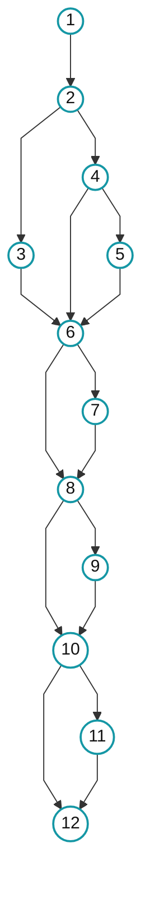

# TEST-17 — Measure white-box coverage

## 1. Kết quả

| Nội dung | Kết quả |
|---|---:|
| Tests | 1.074 total, 1.073 passed, 0 failures, 0 errors, 1 skipped |
| Thời gian thực thi lần cuối | 44,95 giây cho Maven; khoảng 48 giây end-to-end |
| Instruction coverage | 14.508/14.528 — **99,8623%** |
| Line coverage | 3.372/3.377 — **99,8519%** |
| Branch coverage | 1.776/1.788 — **99,3289%** |
| Complexity coverage | 1.665/1.677 — **99,2844%** |
| Method coverage | 782/782 — **100%** |
| Class coverage | 69/69 — **100%** |
| Coverage khả thi | **100% line và branch có thể đạt** |
| Production/POM/config | Không thay đổi |

Thời gian thực tế có thể thay đổi theo máy, Docker state và Maven cache.

Lệnh run:

```powershell
.\scripts\test-coverage.ps1
```

## 2. Phạm vi

- Đo toàn bộ Java production code trong `src/main/java` bằng JaCoCo `0.8.15`.
- Chạy unit test và Spring integration test thuộc default Maven suite.
- Bổ sung/refactor test để phủ các line và branch có thể kích hoạt bằng public behavior hợp lệ.
- Không exclude class/branch, gọi private method bằng reflection hoặc tạo mock trái contract để ép tỷ lệ.
- Python `ai-service` không thuộc phạm vi vì JaCoCo chỉ đo JVM bytecode.

Thiết kế test áp dụng statement, branch/decision, boundary, equivalence partition và control-flow testing.

## 3. Đầu vào và điều kiện chạy

| Đầu vào | Yêu cầu |
|---|---|
| Repository | Chạy từ root project |
| PowerShell | Có thể thực thi `.ps1` |
| Maven | `mvn` có trong `PATH` |
| Docker | Docker engine đang hoạt động |
| MySQL test | Container/service `shoeshop-mysql` có thể khởi động và tạo schema tạm |
| Test scope | Mặc định là toàn bộ Maven test suite |

### Dữ liệu cụ thể wrapper sử dụng

| Input | Nguồn | Giá trị truyền vào lần chạy |
|---|---|---|
| MySQL container | Cố định trong wrapper | `shoeshop-mysql` |
| MySQL container port | Cố định trong wrapper | `3306/tcp` |
| MySQL host port | Đọc bằng `docker port` | Cổng đang publish trên máy, ví dụ `3307` |
| Database username | Wrapper thiết lập | `root` |
| Database password | Đọc từ `MYSQL_ROOT_PASSWORD` của container | Chỉ giữ trong process, không ghi vào tài liệu/log |
| Database name | Wrapper tự sinh | `shoeshop_cov_<32 ký tự hex>`, ví dụ `shoeshop_cov_a1b2...` |
| JDBC URL | Wrapper ghép từ host port và database name | `jdbc:mysql://localhost:<port>/<schema>?useSSL=false&allowPublicKeyRetrieval=true&serverTimezone=UTC` |
| Database schema/data | Flyway khi Spring test khởi động | Versioned migrations `V1` đến `V16` trong `src/main/resources/db/migration` |
| Java input | Working tree hiện tại | Production classes trong `src/main/java` và tests trong `src/test/java` |
| Test selection | Tham số người dùng | Full suite, hoặc giá trị `-TestSelector` nếu chạy targeted test |

Schema `shoeshop_cov_<uuid>` ban đầu rỗng. Trong full suite, các Spring test khởi động application context và Flyway tạo cấu trúc cùng seed data mới từ migration: accounts, products, orders/order details, vouchers và user addresses. Unit test thuần dùng fixture/mock trong từng test và không đọc MySQL.

Wrapper truyền ba biến sau riêng cho Maven process:

```text
SPRING_DATASOURCE_URL=jdbc:mysql://localhost:<host-port>/<temporary-schema>?useSSL=false&allowPublicKeyRetrieval=true&serverTimezone=UTC
SPRING_DATASOURCE_USERNAME=root
SPRING_DATASOURCE_PASSWORD=<password đọc từ container>
```

Wrapper không copy hoặc đọc dữ liệu từ `shoe_shopdb`. Mọi dữ liệu do integration test tạo chỉ nằm trong schema tạm; sau khi Maven kết thúc, wrapper khôi phục ba biến môi trường và xóa đúng schema đó.

## 4. Cách sử dụng

### Chạy full suite và tạo report chính

```powershell
.\scripts\test-coverage.ps1
```

### Chạy và mở report HTML

```powershell
.\scripts\test-coverage.ps1 -OpenReport
```

### Chạy một hoặc nhiều test để chẩn đoán

```powershell
.\scripts\test-coverage.ps1 -TestSelector ProductDAOTest
.\scripts\test-coverage.ps1 -TestSelector 'OrderDAOTest,OrderReturnDAOTest'
```

`-TestSelector` tạo partial report cho test đã chọn. Trước khi bàn giao hoặc đọc coverage toàn project, phải chạy lại lệnh full suite không có selector.

## 5. Đầu ra

| File/thư mục | Nội dung |
|---|---|
| `target/jacoco.exec` | Execution data của JaCoCo |
| `target/site/jacoco/index.html` | Báo cáo để xem trên trình duyệt |
| `target/site/jacoco/jacoco.xml` | Counter cho CI hoặc kiểm tra tự động |
| `target/site/jacoco/jacoco.csv` | Counter dạng bảng |
| `target/surefire-reports/` | Kết quả và lỗi chi tiết của test |

Các artifact nằm trong `target/`, được Git ignore và bị thay thế ở lần `clean` tiếp theo.

## 6. Những phần đã làm

1. Tạo phép đo baseline sạch và xác minh report không dùng artifact stale.
2. Sửa fixture test integration liên quan persistence context, seed product, order ownership và customer validity.
3. Bổ sung white-box test cho:
   - model, form, entity, pagination, utility và validator;
   - MVC controller và REST API;
   - service, config/advice và application bootstrap;
   - DAO và Spring integration.
4. Tạo `scripts/test-coverage.ps1` để chạy coverage một lệnh với database tạm cô lập và cleanup an toàn.
5. Refactor test theo hướng mỗi test chỉ kiểm tra một outcome; dùng parameterized test cho các partition cùng contract; làm rõ tên test/helper; cố định dữ liệu thời gian; siết Mockito strict stubbing.
6. Chạy targeted gate sau từng nhóm, aggregate gate và cuối cùng là clean full regression.
7. Xác minh report, Git integrity, datasource restoration và database cleanup.

## 7. Mức cải thiện coverage

| Counter | Phép đo hợp lệ ban đầu | Kết quả cuối |
|---|---:|---:|
| Instruction | 7.299/14.528 — 50,24% | 14.508/14.528 — **99,8623%** |
| Line | 1.685/3.377 — 49,90% | 3.372/3.377 — **99,8519%** |
| Branch | 745/1.788 — 41,67% | 1.776/1.788 — **99,3289%** |
| Complexity | 799/1.677 — 47,64% | 1.665/1.677 — **99,2844%** |
| Method | 469/782 — 59,97% | 782/782 — **100%** |
| Class | 65/69 — 94,20% | 69/69 — **100%** |

Threshold `Line > 70%` và `Branch > 65%` đều **PASS**.

### Phần raw còn thiếu

| Residual | Vị trí | Giải thích |
|---|---|---|
| 5 lines | `AccountDAO`, `VoucherDAO`, `OrderReturnDAO` | Catch/private guard bị runtime hoặc public contract chặn |
| 12 branches | `ProductDAO`, `OrderDAO`, `VoucherDAO`, `OrderReturnDAO`, `CartController`, `OrderStatus` | Defensive condition hoặc invariant không thể tạo bằng input hợp lệ |

Reachable coverage là **3.372/3.372 lines** và **1.776/1.776 branches**. Các residual vẫn nằm trong mẫu số JaCoCo; không có exclusion hoặc production hook để làm đẹp kết quả.

Test bị skip duy nhất là `ProductDAOIntegrationTest` vì system property `dao.integration.enabled` không được bật. Đây là integration suite opt-in, không phải test error.

## 8. Refactor và integrity

- Phạm vi gồm 34 Java test file, 10.646 dòng và 587 test annotation.
- So với baseline refactor, mã test tăng thực 1.869 line. Git hiển thị toàn bộ file chưa tracked như phần thêm mới.
- `target/` được Git ignore.
- Schema coverage tạm đã được xóa; `shoe_shopdb` không bị reset hoặc xóa.
- Datasource environment được khôi phục sau chạy.
- AI/OAuth và external endpoint trong test đều được mock.

## 9. File bàn giao

- Task document: [`docs/TEST-17.md`](./TEST-17.md)
- Wrapper: [`scripts/test-coverage.ps1`](../scripts/test-coverage.ps1)
- JaCoCo HTML: [`target/site/jacoco/index.html`](../target/site/jacoco/index.html)

## 10. Phân tích CFG và độ phức tạp Cyclomatic V(G)

### 10.1. Hàm được chọn và quy ước

Phân tích hàm `validate(Object target, Errors errors)` trong
[`CustomerFormValidator.java`](../src/main/java/com/example/demo/validator/CustomerFormValidator.java).
Các câu lệnh tuần tự được gom thành basic block; mỗi `if`/`else if` là một node quyết định.
Biểu thức ghép bằng `&&` nằm trong cùng node và luồng nội bộ của hàm được gọi không được mở rộng.

### 10.2. Đồ thị luồng điều khiển (Control Flow Graph)



| Node | Câu lệnh/basic block | Luồng kế tiếp |
|---|---|---|
| 1 | Ép kiểu `target`, gọi `normalize()` và kiểm tra bốn trường bắt buộc | 2 |
| 2 | Email không rỗng và dài hơn 128 ký tự? | T → 3; F → 4 |
| 3 | Reject `Length.customerForm.email` | 6 |
| 4 | Email không rỗng và sai định dạng? | T → 5; F → 6 |
| 5 | Reject `Pattern.customerForm.email` | 6 |
| 6 | Name khác `null` và dài hơn 255 ký tự? | T → 7; F → 8 |
| 7 | Reject `Length.customerForm.name` | 8 |
| 8 | Address khác `null` và dài hơn 255 ký tự? | T → 9; F → 10 |
| 9 | Reject `Length.customerForm.address` | 10 |
| 10 | Phone khác `null` và dài hơn 128 ký tự? | T → 11; F → 12 |
| 11 | Reject `Length.customerForm.phone` | 12 |
| 12 | Kết thúc hàm | — |

`T` = True, `F` = False. Đồ thị có **N = 12** node, **E = 16** cạnh và **P = 5** node
quyết định (`2`, `4`, `6`, `8`, `10`).

### 10.3. Tính thủ công độ phức tạp Cyclomatic

```text
V(G) = E - N + 2 = 16 - 12 + 2 = 6
V(G) = P + 1     = 5 + 1         = 6
```

Hai công thức cùng cho **V(G) = 6**, tương ứng sáu independent basis paths.

### 10.4. Basis Path Coverage và Test Cases

| Path | Chuỗi node trên CFG | Test case đi qua path |
|---|---|---|
| B1 | 1 → 2(F) → 4(F) → 6(F) → 8(F) → 10(F) → 12 | `validate_validCustomer_normalizesInputAndHasNoErrors` |
| B2 | 1 → 2(T) → 3 → 6(F) → 8(F) → 10(F) → 12 | `validate_emailOverMaximumLength_rejectsOnlyLengthCode` |
| B3 | 1 → 2(F) → 4(T) → 5 → 6(F) → 8(F) → 10(F) → 12 | `validate_invalidEmail_rejectsPatternCode` |
| B4 | 1 → 2(F) → 4(F) → 6(T) → 7 → 8(F) → 10(F) → 12 | `validate_nameOutsideBoundary_rejectsExpectedCode` với độ dài `256` |
| B5 | 1 → 2(F) → 4(F) → 6(F) → 8(T) → 9 → 10(F) → 12 | `validate_addressOverMaximumLength_rejectsLengthCode` với độ dài `256` |
| B6 | 1 → 2(F) → 4(F) → 6(F) → 8(F) → 10(T) → 11 → 12 | `validate_phoneOverMaximumLength_rejectsLengthCode` với độ dài `129` |

B1–B6 tạo thành sáu independent basis paths đúng bằng `V(G)` và đi qua cả hai hướng của năm
node quyết định, chứng minh basis path coverage cho hàm `validate()`.
