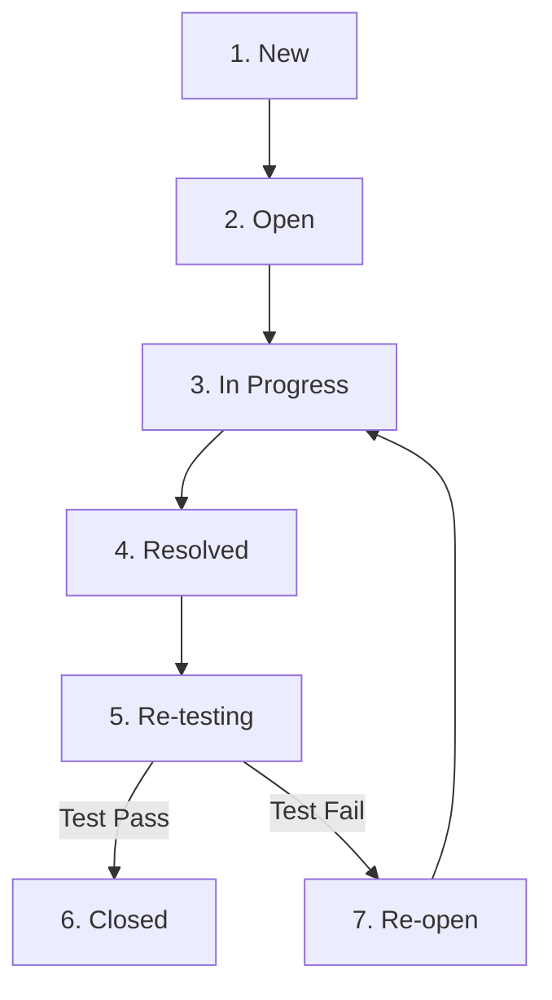

# 🐛 QUY TRÌNH QUẢN LÝ VÒNG ĐỜI LỖI (BUG LIFECYCLE MANAGEMENT) - TASK TEST-19

> **Mã Task Jira:** TEST-19  
> **Tiêu đề Task:** Manage bug lifecycle: Assign and classify bugs  
> **Dự án:** ShoeShop Quality Assurance & Testing  
> **Phiên bản tài liệu:** 1.0  

---

## 📌 1. MỤC TIÊU
Tài liệu này thiết lập quy trình chuẩn hóa về **Quản lý vòng đời Bug (Bug Lifecycle Process)** cho dự án bao gồm cả ứng dụng Web ShoeShop (Backend Java Spring Boot + Web Frontend + MySQL) và Dịch vụ AI (Python FastAPI + YOLOv8).

Quy trình giúp:
1. Thống nhất các trạng thái của lỗi từ lúc phát hiện cho tới khi đóng lỗi.
2. Phân loại lỗi chính xác theo mức độ nghiêm trọng (**Severity / Priority**) và phân vùng lỗi (**Category**).
3. Đảm bảo quy tắc phân công xử lý (**Assignee Rules**) rõ ràng, tránh chồng chéo hoặc bỏ sót công việc.
4. Chuẩn hóa cách thức thao tác trực tiếp trên giao diện Jira.

---

## 🔄 2. CÁC TRẠNG THÁI VÀ VÒNG ĐỜI CỦA BUG (BUG LIFECYCLE)

### 2.1. Sơ đồ chuyển đổi trạng thái (State Transition Diagram)



### 2.2. Chi tiết từng trạng thái

| STT | Trạng thái (Status) | Mô tả chi tiết | Người thực hiện chính |
| :---: | :--- | :--- | :--- |
| **1** | `New` | Bug vừa được Tester/QA hoặc User phát hiện và tạo ticket trên Jira. Chưa được duyệt hoặc phân công. | QA / Tester |
| **2** | `Open` | Bug đã được QA Leader / Tech Lead xác nhận là hợp lệ (Valid Bug), đủ thông tin tái lập và chuẩn bị gán cho Developer. | QA Lead / Tech Lead |
| **3** | `In Progress` | Developer nhận ticket và đang tiến hành kiểm tra mã nguồn, tìm nguyên nhân gốc (root cause) và sửa lỗi. | Developer (Assignee) |
| **4** | `Resolved` | Developer đã sửa xong lỗi trên môi trường Dev/Staging, commit code và push bản fix để chờ kiểm thử lại. | Developer (Assignee) |
| **5** | `Re-testing` | Tester nhận thông báo fix lỗi và tiến hành chạy lại các kịch bản test (Re-test) trên môi trường Staging/Test. | QA / Tester |
| **6** | `Closed` | Kết quả re-test thành công, bug đã được sửa hoàn toàn và không phát sinh lỗi phụ. Ticket chính thức hoàn tất. | QA / Tester |
| **7** | `Re-open` | Kết quả re-test thất bại (vẫn bị lỗi hoặc fix chưa triệt để). Ticket được đẩy lại cho Developer xử lý tiếp. | QA / Tester |

### 2.3. Bảng chuyển đổi trạng thái (State Transition Table)

Bảng chuyển đổi trạng thái mô tả các bước chuyển đổi hợp lệ trong cỗ máy trạng thái (State Machine) quản lý vòng đời Bug theo 3 cột tiêu chuẩn:

| Trạng thái bắt đầu (Start State) | Đầu vào / Sự kiện (Input / Event) | Trạng thái kết thúc (End State) |
| :--- | :--- | :--- |
| `NEW` | QA Lead / Tech Lead xác nhận lỗi hợp lệ và phê duyệt | `OPEN` |
| `NEW` | Dev xác nhận lỗi và bắt đầu sửa trực tiếp | `IN PROGRESS` |
| `OPEN` | Developer nhận ticket và tiến hành kiểm tra, xử lý mã nguồn | `IN PROGRESS` |
| `IN PROGRESS` | Developer sửa xong lỗi, commit code & push bản fix lên môi trường Test | `RESOLVED` |
| `RESOLVED` | Tester tiếp nhận bản fix và chuyển sang thực thi kiểm thử lại | `RE-TESTING` |
| `RE-TESTING` | Kiểm thử lại thành công (Test Pass 100%, không phát sinh lỗi phụ) | `CLOSED` |
| `RE-TESTING` | Kiểm thử lại thất bại (Test Fail, lỗi chưa được fix triệt để) | `RE-OPEN` |
| `RE-OPEN` | Developer tiếp nhận lại ticket bị Re-open để debug và sửa tiếp | `IN PROGRESS` |

---

## 📊 3. BẢNG TIÊU CHÍ PHÂN LOẠI BUG (BUG CLASSIFICATION)

### 3.1. Phân loại theo Mức độ nghiêm trọng & Độ ưu tiên (Severity / Priority)

| Mức độ (Severity) | Độ ưu tiên (Priority) | Định nghĩa & Tiêu chuẩn đánh giá | Ví dụ thực tế trong dự án | SLA Thời gian xử lý |
| :--- | :--- | :--- | :--- | :---: |
| **Blocker** | **P1 - Highest** | Lỗi làm sập hệ thống (Crash/Down), mất toàn bộ chức năng cốt lõi, không có cách khắc phục tạm thời (Workaround). | AI Service sập hoàn toàn (`500 Internal Error` toàn bộ API), DB MySQL ngắt kết nối không đặt được hàng. | **< 2 Giờ** |
| **Critical** | **P2 - High** | Lỗi tính năng quan trọng, tính toán sai dữ liệu tài chính/đơn hàng, hoặc ảnh hưởng nghiêm trọng đến luồng mua hàng. | Đặt hàng thành công nhưng tổng tiền đơn hàng bị tính sai, API phân tích ảnh bị gãy luồng thanh toán. | **< 8 Giờ** |
| **Major** | **P3 - Medium** | Lỗi chức năng chính nhưng có thể dùng kịch bản khắc phục tạm thời; hoặc lỗi xử lý logic phụ. | Không upload được avatar cá nhân, bộ lọc tìm kiếm sản phẩm theo giá bị lỗi trang thứ 2. | **< 24 Giờ** |
| **Minor** | **P4 - Low** | Lỗi nhỏ về giao diện, sai chính tả, hiển thị định dạng sai ngày tháng/tiền tệ nhưng không hỏng logic. | Nút "Thêm vào giỏ" bị lệch 5px, chữ "Thành tiền" viết sai chính tả thành "Thành tiêm". | **< 3 Ngày** |
| **Trivial** | **P5 - Lowest** | Lỗi giao diện cực nhỏ, gợi ý cải tiến UX/UI, hiệu ứng hover chưa mượt. | Font chữ phần Footer nhỏ hơn 1px so với thiết kế Figma, thiếu hiệu ứng bóng mờ (box-shadow). | **Kỳ Sprint tiếp theo** |

---

### 3.2. Phân loại theo Phân vùng lỗi (Bug Category)

| Loại lỗi (Category) | Mô tả phạm vi | Thành phần liên quan trong Repository |
| :--- | :--- | :--- |
| `UI/UX` | Lỗi giao diện hiển thị, responsive, CSS/HTML, thao tác người dùng trên Browser/Mobile. | Frontend Web templates, Nginx static resources, CSS/JS assets. |
| `Backend/API` | Lỗi xử lý logic nghiệp vụ, HTTP status code sai (4xx, 5xx), lỗi RESTful API, authentication/authorization. | Spring Boot Backend (`src/main/java/`), Controllers, Services. |
| `Database` | Lỗi truy vấn SQL, khóa ngoại, trích xuất dữ liệu sai, mất tính toàn vẹn dữ liệu (Data Integrity). | MySQL Database, migration scripts, `seed_data.sql`. |
| `Logic & AI` | Lỗi mô hình AI YOLOv8 nhận diện sai sản phẩm, timeout xử lý ảnh qua GPU/CPU, gãy luồng Image QA. | Python AI Service (`ai-service/app/image_qa.py`, `models/yolov8n.pt`). |

---

### 3.3. Quy tắc gán Người xử lý (Assignee Assignment Rules)

| Phân vùng Bug (Category) | Mức độ | Người xử lý được gán (Assignee Role) | Ghi chú & Đội ngũ phụ trách |
| :--- | :--- | :--- | :--- |
| `Logic & AI` | Mọi mức độ | **AI/ML Engineer Lead** (`ai-team-lead`) | Phụ trách `ai-service/`, YOLOv8 model và OpenCV pipeline. |
| `Backend/API` | Blocker / Critical | **Backend Senior Dev / Tech Lead** (`be-tech-lead`) | Phụ trách ưu tiên khắc phục các sự cố API & Core Services. |
| `Backend/API` | Major / Minor | **Backend Developer** (`be-dev-team`) | Phụ trách fix các lỗi logic API thông thường. |
| `Database` | Mọi mức độ | **Database Specialist / Backend Lead** (`dba-lead`) | Phụ trách tối ưu SQL query, sửa bảng và transaction scope. |
| `UI/UX` | Mọi mức độ | **Frontend Developer / UI Specialist** (`fe-dev-team`) | Phụ trách sửa lỗi HTML/CSS/JS và hiển thị giao diện. |

---

## 🛠️ 4. CHUẨN MẪU BÁO CÁO BUG (BUG REPORT FORM TEMPLATE)

Mọi Bug ticket khi tạo trên Jira **bắt buộc** phải tuân thủ cấu trúc chuẩn sau:

```markdown
* [Summary]: [Phân vùng] - Tóm tắt ngắn gọn lỗi xuất hiện
* [Issue Type]: Bug
* [Severity/Priority]: Blocker / Critical / Major / Minor / Trivial
* [Component/Category]: UI/UX | Backend/API | Database | Logic & AI
* [Environment]: Staging / Local / Docker (OS: Windows/Linux, Browser: Chrome v120)

### 1. Description (Mô tả chi tiết)
[Mô tả bối cảnh xảy ra lỗi và hành vi bất thường của hệ thống]

### 2. Steps to Reproduce (Các bước tái lập)
1. Truy cập vào trang ...
2. Gửi yêu cầu POST đến API ... với payload ...
3. Quan sát kết quả trả về ...

### 3. Expected Result (Kết quả kỳ vọng)
[Hệ thống trả về HTTP 200 OK với kết quả phân tích chính xác...]

### 4. Actual Result (Kết quả thực tế)
[Hệ thống trả về HTTP 500 Internal Server Error với stack trace...]

### 5. Attachments / Logs (Hình ảnh & Nhật ký lỗi)
- Screenshot / Video clip minh họa
- Log chi tiết (JSON / Log output)
```

---

## 🖥️ 5. HƯỚNG DẪN THAO TÁC CẬP NHẬT TRỰC TIẾP TRÊN GIAO DIỆN JIRA UI

### Bước 1: Tạo mới Ticket Bug (Create Issue)
1. Đăng nhập vào Jira project `TEST` (ShoeShop Quality Assurance).
2. Bấm nút **+ Create** ở thanh công cụ phía trên.
3. Điền các trường thông tin:
   - **Project**: `ShoeShop Testing (TEST)`
   - **Issue Type**: Select `Bug`
   - **Summary**: Điền theo mẫu `[AI-Service] API /api/v1/analyze ném ngoại lệ 500 khi ảnh bị lỗi định dạng`
   - **Component/s**: Chọn `AI-Service` hoặc `Backend`
   - **Priority**: Chọn `P2 - High` (nếu là Critical)
   - **Description**: Dán nội dung theo Chuẩn mẫu ở Mục 4.
4. Bấm **Create**. Ticket sẽ ở trạng thái `New`.

### Bước 2: Duyệt & Phân công Bug (Classify & Assign)
1. QA Lead kiểm tra ticket ở trạng thái `New`.
2. Xác nhận tính chính xác và chuyển trạng thái sang `Open`.
3. Kiểm tra mục **Assignee Rules** (Mục 3.3):
   - Nếu là lỗi AI Service ➔ Gán **Assignee** cho Developer phụ trách AI (`ai-team-lead`).
   - Nếu là lỗi Backend Java ➔ Gán **Assignee** cho Backend Dev (`be-dev-team`).
4. Điền trường **Labels**: `bug-lifecycle`, `test-19`, `ai-service`.

### Bước 3: Developer tiến hành Fix Bug (In Progress ➔ Resolved)
1. Developer nhận được thông báo qua Mail/Jira.
2. Chuyển trạng thái ticket từ `Open` ➔ `In Progress`.
3. Tạo nhánh Git fix lỗi, tiến hành code và đẩy bản sửa lên môi trường Test.
4. Thêm bình luận (Comment) trên Jira kèm thông tin Commit Hash: `Fixed issue in commit #abc1234`.
5. Chuyển trạng thái ticket ➔ `Resolved` và gán lại **Assignee** cho Tester ban đầu.

### Bước 4: Tester kiểm thử lại & Đóng Ticket (Re-testing ➔ Closed / Re-open)
1. Tester thấy ticket ở trạng thái `Resolved`, chuyển ticket ➔ `Re-testing`.
2. Thực hiện chạy kịch bản kiểm thử tự động / thủ công trên môi trường Staging.
3. **Nếu Pass**:
   - Thêm comment: `Re-tested successfully on Staging env build #45. Bug resolved.`
   - Chuyển trạng thái ticket ➔ `Closed`.
4. **Nếu Fail**:
   - Thêm comment chi tiết lỗi còn sót lại kèm log mới.
   - Chuyển trạng thái ticket ➔ `Re-open` (ticket tự động quay về `In Progress` để Dev xử lý tiếp).

---

## 💻 6. TÍCH HỢP TỰ ĐỘNG HÓA VỚI CODE LOGGING

Dự án cung cấp 2 công cụ hỗ trợ ghi log và chuẩn hóa dữ liệu Bug report:
1. **Template JSON**: [bugs_report_template.json](file:///c:/shoeshopp/Testing/bugs_report_template.json) dùng để lưu trữ báo cáo bug dạng file cấu trúc.
2. **Helper Module Python**: [`ai-service/app/bug_logger.py`](file:///c:/shoeshopp/Testing/ai-service/app/bug_logger.py) tự động bắt ngoại lệ (Exception), phân loại Severity/Category và gợi ý Assignee.
