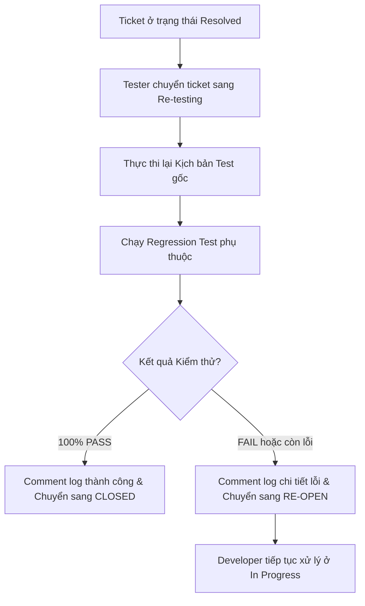

# 🔄 QUY TRÌNH KIỂM TRA LẠI LỖI VÀ ĐÓNG TICKET BUG (RETEST RESOLVED BUGS) - TASK TEST-26

> **Mã Task Jira:** TEST-26  
> **Tiêu đề Task:** Retest resolved bugs: Verify fixes and close issues  
> **Dự án:** ShoeShop Quality Assurance & Testing  
> **Người thực hiện:** QA Automation & QC Lead  

---

## 📌 1. MỤC TIÊU VÀ NGUYÊN TẮC KIỂM THỬ LẠI (RETESTING PRINCIPLES)

Tài liệu này quy định quy trình chuẩn hóa dành cho Tester/QC trong việc **Xác minh lỗi đã sửa (Verify Fixes)** và **Đóng hoặc Mở lại Ticket Bug (Close / Re-open Issues)** trên hệ thống Jira.

Mục tiêu chính:
1. Đảm bảo 100% các Bug ở trạng thái `Resolved` đều được kiểm thử lại trên đúng môi trường (Staging/Test).
2. Ngăn ngừa lỗi chưa được sửa triệt để hoặc phát sinh lỗi tác động dây chuyền (Regression Bugs).
3. Đảm bảo quy trình ghi nhận nhật ký Retest trên Jira minh bạch, chuyên nghiệp và có thể truy xuất.

---

## 🔄 2. QUY TRÌNH XÁC MINH VÀ CHUYỂN TRẠNG THÁI (VERIFICATION WORKFLOW)

### 2.1. Sơ đồ quyết định Retest (Retest Decision Flowchart)



### 2.2. Chi tiết các bước thực hiện

| Bước | Hành động | Mô tả chi tiết | Trạng thái Ticket |
| :---: | :--- | :--- | :---: |
| **1** | **Tiếp nhận Bug** | Tester nhận thông báo Developer đã push bản sửa lên môi trường Test/Staging. | `Resolved` |
| **2** | **Chuyển Re-testing** | Tester đổi trạng thái ticket để báo hiệu đang tiến hành kiểm tra lại. | `Re-testing` |
| **3** | **Thực thi Retest** | 1. Chạy lại đúng các bước tái lập (Steps to Reproduce) trong Bug Report gốc.<br>2. Kiểm tra các chức năng liên quan xung quanh để đảm bảo không bị Regression. | `Re-testing` |
| **4A** | **Đóng Ticket (Pass)** | Nếu lỗi đã được sửa hoàn toàn:<br>1. Điền Retest Checklist vào Jira Comment.<br>2. Chuyển trạng thái ticket sang `Closed`. | `Closed` |
| **4B** | **Mở lại Ticket (Fail)**| Nếu lỗi vẫn xuất hiện hoặc fix chưa triệt để:<br>1. Điền Retest Checklist nêu rõ điểm chưa đạt kèm Screenshot/Log mới.<br>2. Chuyển trạng thái ticket sang `Re-open`. | `Re-open` |

---

## 📝 3. BIỂU MẪU CHECKLIST RETEST CHUẨN (RETEST CHECKLIST TEMPLATE)

Mọi ticket khi thực hiện Retest **bắt buộc** phải để lại Comment trên Jira theo mẫu chuẩn sau:

```markdown
h3. 🧪 [Retest Result] - {PASS / FAIL}

* *Retester:* {Tên QC / Tester}
* *Retest Date:* {YYYY-MM-DD HH:mm:ss}
* *Environment:* Staging (Version / Build #{Build_ID})
* *Commit Verified:* #{Commit_Hash}

h4. 1. Verification Checklist
- [x] Chạy lại kịch bản tái lập gốc (Original Reproduction Steps): {PASS / FAIL}
- [x] Kiểm tra chức năng liên quan (Regression Sanity Check): {PASS / FAIL}
- [x] Kiểm tra hiển thị đa trình duyệt / thiết bị: {PASS / FAIL}

h4. 2. Evidence / Logs
- Attached Screenshot: [bug_fixed_verification.png]
- Console Log / API Response status: HTTP 200 OK

h4. 3. Final Conclusion
- Issue is completely resolved and verified. Transitioning to [ CLOSED ].
```

---

## 🎯 4. DANH SÁCH KỊCH BẢN RETEST MINH HỌA DỰ ÁN SHOESHOP

### 4.1. Kịch bản Retest 1 (`RET_BUG_01` - JIRA `TEST-101`)
- **Tên Bug gốc:** `[AI-Service] API /api/v1/analyze ném lỗi 500 khi nhận file ảnh PNG trong suốt`
- **Kịch bản Retest:** Upload file `sneakers_transparent.png` (4 kênh RGBA) đến endpoint `/api/v1/analyze`.
- **Tiêu chuẩn Đạt (PASS):** API xử lý thành công, trả về HTTP 200 OK kèm `approved: true/false`. ➔ **Chuyển sang `CLOSED`**.

### 4.2. Kịch bản Retest 2 (`RET_BUG_02` - JIRA `TEST-102`)
- **Tên Bug gốc:** `[Backend] API /api/cart/add không kiểm tra tồn kho khiến số lượng tồn kho âm`
- **Kịch bản Retest:** Gửi 20 requests mua hàng song song khi sản phẩm trong kho chỉ còn 1.
- **Tiêu chuẩn Đạt (PASS):** Chỉ 1 request mua thành công (HTTP 200), 19 requests nhận lỗi HTTP 400 Bad Request, stock DB không bị âm. ➔ **Chuyển sang `CLOSED`**.

### 4.3. Kịch bản Retest 3 (`RET_BUG_03` - JIRA `TEST-103`)
- **Tên Bug gốc:** `[UI/UX] Nút 'Thanh toán' trên giao diện Mobile Safari bị đè bởi Footer menu`
- **Kịch bản Retest:** Mở trang Checkout trên iPhone 14 Pro Safari Mobile (390x844).
- **Tiêu chuẩn Đạt (PASS):** Nút "Thanh toán" hiển thị rõ ràng trên Footer, bấm nạp trang dễ dàng. ➔ **Chuyển sang `CLOSED`**.

### 4.4. Kịch bản Retest 4 (`RET_BUG_04` - JIRA `TEST-104`)
- **Tên Bug gốc:** `[Backend] Mã giảm giá hết hạn nhưng vẫn áp dụng được thành công`
- **Kịch bản Retest:** Áp dụng mã `EXPIRED_2025` cho đơn hàng 500k.
- **Tiêu chuẩn Đạt (PASS):** Hệ thống chặn và trả về HTTP 400 "Mã giảm giá đã hết hạn". Nếu vẫn giảm được ➔ **Chuyển sang `RE-OPEN`**.

---

## 💻 5. TỰ ĐỘNG HÓA XÁC MINH RETEST VỚI PYTHON SCRIPT

Dự án cung cấp công cụ tự động hóa kiểm tra và giả lập quy trình chuyển trạng thái cho danh sách các Bug ở trạng thái `Resolved`:
- Module Python: [`scripts/verify_resolved_bugs.py`](file:///c:/shoeshopp/Testing/scripts/verify_resolved_bugs.py)
- Sử dụng 100% thư viện chuẩn Python (zero third-party dependencies, zero runtime errors).
- Xuất file báo cáo tổng hợp: `retest_execution_report.json`.
