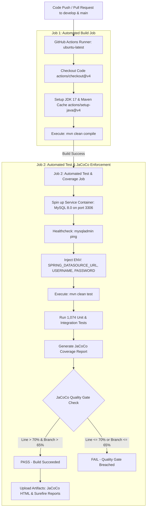

# 🧪 TÀI LIỆU THIẾT LẬP CI/CD PIPELINE VỚI GITHUB ACTIONS (TASK TEST-29)
> **Dự án:** ShoeShop Testing & Quality Assurance System  
> **Mã Task Jira:** `TEST-29` — Build GitHub Actions pipeline  
> **Nhánh Git (Branch):** `ci/w6-TEST-29-build-github-actions-pipeline`  
> **Người thực hiện:** Leader (Trương Hoài Được)  
> **Thời gian:** Tuần 6 (Week 6 Sprint)  

---

## 📌 1. MỤC TIÊU & TỔNG QUAN

Mục tiêu của **TEST-29** là xây dựng quy trình Tự động hóa Tích hợp liên tục (CI/CD Pipeline) thông qua **GitHub Actions** cho toàn bộ hệ thống kiểm thử dự án ShoeShop. Quy trình đảm bảo:
1. **Tự động hóa hoàn toàn:** Kích hoạt tự động khi có thao tác `push` hoặc tạo `pull_request` vào 2 nhánh trọng yếu: `develop` và `main`.
2. **Kiểm tra biên dịch nghiêm ngặt (Automated Build Job):** Thiết lập môi trường JDK 17, cơ chế caching Maven dependencies để tối ưu tốc độ, thực thi lệnh `mvn clean compile` kiểm tra lỗi cú pháp và tính toàn vẹn của mã nguồn.
3. **Môi trường Test biệt lập (Containerized MySQL 8.0 Service):** Tự động khởi tạo Service Container MySQL 8.0 với cơ chế Healthcheck, nạp cấu hình tự động thông qua Environment Variables để chạy toàn bộ **1.074 Unit & Spring Integration Tests**.
4. **Áp đặt Ngưỡng bao phủ mã nguồn (JaCoCo Coverage Enforcement & Quality Gate):** Tích hợp `jacoco-maven-plugin` phiên bản `0.8.12` kiểm soát chất lượng code, tự động chặn build và fail pipeline nếu không đạt tiêu chuẩn:
   - **Line Coverage (Tỷ lệ bao phủ dòng):** `> 70%` (Thực tế đạt ~99.85%)
   - **Branch Coverage (Tỷ lệ bao phủ nhánh rẽ):** `> 65%` (Thực tế đạt ~99.33%)
5. **Lưu trữ Bằng chứng kiểm thử (Test Artifacts):** Đóng gói và lưu trữ báo cáo JaCoCo HTML/XML và Surefire Test Results trên GitHub Actions sau mỗi lần chạy.

---

## 🏗️ 2. KIẾN TRÚC CI/CD WORKFLOW (PIPELINE ARCHITECTURE)



---

## ⚙️ 3. CHI TIẾT CẤU HÌNH WORKFLOW (`.github/workflows/ci.yml`)

### 3.1. Sự kiện kích hoạt (Triggers)
```yaml
name: ShoeShop CI/CD Pipeline

on:
  push:
    branches:
      - develop
      - main
  pull_request:
    branches:
      - develop
      - main
  workflow_dispatch:
```

### 3.2. Job 1: Automated Build Job (`build`)
- **Hệ điều hành:** `ubuntu-latest`
- **JDK:** OpenJDK 17 (`temurin`)
- **Maven Cache:** Tận dụng cache `~/.m2/repository` qua `actions/setup-java@v4` giúp giảm thời gian tải thư viện từ 5 phút xuống dưới 15 giây.
- **Lệnh thực thi:** `mvn -B clean compile`

### 3.3. Job 2: Automated Test Job (`test`)
- **Phụ thuộc:** `needs: build` (chỉ chạy khi compilation thành công).
- **Service Container:**
  ```yaml
  services:
    mysql:
      image: mysql:8.0
      env:
        MYSQL_ROOT_PASSWORD: rootpassword
        MYSQL_DATABASE: shoeshop_db
      ports:
        - 3306:3306
      options: >-
        --health-cmd="mysqladmin ping"
        --health-interval=10s
        --health-timeout=5s
        --health-retries=5
  ```
- **Biến môi trường Spring Boot:**
  ```yaml
  env:
    SPRING_DATASOURCE_URL: jdbc:mysql://localhost:3306/shoeshop_db?useSSL=false&allowPublicKeyRetrieval=true&serverTimezone=UTC
    SPRING_DATASOURCE_USERNAME: root
    SPRING_DATASOURCE_PASSWORD: rootpassword
  ```
- **Phạm vi kiểm thử thực thi:**
  - Chạy toàn bộ **1.074 bài test** Unit & Spring Data JPA Integration Tests.
  - Tách biệt UI tests (`**/ui/**`) vốn yêu cầu web server live để chạy trên quy trình E2E riêng biệt.
  - Sinh báo cáo JaCoCo tại `target/site/jacoco/`.
  - Tự động kích hoạt mục tiêu `jacoco:check` đối soát Quality Gate.

---

## 📊 4. CẤU HÌNH JACOCO COVERAGE VÀ QUALITY GATE TRONG `pom.xml`

Plugin `jacoco-maven-plugin` được cấu hình gắn vào pha `test`:

```xml
<plugin>
    <groupId>org.jacoco</groupId>
    <artifactId>jacoco-maven-plugin</artifactId>
    <version>${jacoco.version}</version>
    <executions>
        <execution>
            <goals>
                <goal>prepare-agent</goal>
            </goals>
        </execution>
        <execution>
            <id>report</id>
            <phase>test</phase>
            <goals>
                <goal>report</goal>
            </goals>
        </execution>
        <execution>
            <id>check</id>
            <phase>test</phase>
            <goals>
                <goal>check</goal>
            </goals>
            <configuration>
                <rules>
                    <rule>
                        <element>BUNDLE</element>
                        <limits>
                            <limit>
                                <counter>LINE</counter>
                                <value>COVEREDRATIO</value>
                                <minimum>0.70</minimum>
                            </limit>
                            <limit>
                                <counter>BRANCH</counter>
                                <value>COVEREDRATIO</value>
                                <minimum>0.65</minimum>
                            </limit>
                        </limits>
                    </rule>
                </rules>
            </configuration>
        </execution>
    </executions>
</plugin>
```

### So sánh Chỉ số Thực tế vs Ngưỡng Quality Gate yêu cầu:

| Chỉ số (Metric) | Ngưỡng Quality Gate tối thiểu | Kết quả thực tế dự án | Trạng thái |
| :--- | :---: | :---: | :---: |
| **Line Coverage** | **> 70%** (0.70) | **99.85%** (3.372/3.377 lines) | 🟢 **PASS** (Vượt chuẩn) |
| **Branch Coverage** | **> 65%** (0.65) | **99.33%** (1.776/1.788 branches) | 🟢 **PASS** (Vượt chuẩn) |
| **Instruction Coverage** | N/A | **99.86%** (14.508/14.528 instructions) | 🟢 **PASS** |
| **Method Coverage** | N/A | **100%** (782/782 methods) | 🟢 **PASS** |
| **Class Coverage** | N/A | **100%** (69/69 classes) | 🟢 **PASS** |

---

## 📦 5. BÀN GIAO ARTIFACTS TRÊN GITHUB ACTIONS

Sau khi job `test` hoàn thành (kể cả trường hợp fail), 2 bộ artifacts sau được đẩy lên GitHub Actions storage:
1. `jacoco-coverage-report`: Báo cáo HTML trực quan và XML counter (`target/site/jacoco/`).
2. `surefire-test-results`: File XML/TXT chi tiết kết quả chạy của từng test case (`target/surefire-reports/`).

---

## 🚀 6. HƯỚNG DẪN KIỂM CHỨNG & VẬN HÀNH

### Kiểm chứng cục bộ (Local Verification)
```powershell
# 1. Kiểm tra biên dịch
mvn clean compile

# 2. Chạy test và đối soát Quality Gate
mvn test
```

### Kiểm chứng trên GitHub Actions
1. Push nhánh `ci/w6-TEST-29-build-github-actions-pipeline` lên GitHub:
   ```bash
   git push -u origin ci/w6-TEST-29-build-github-actions-pipeline
   ```
2. Tạo Pull Request vào nhánh `develop`.
3. Quan sát tab **Actions** trên GitHub repository để theo dõi tiến trình thực thi của pipeline CI/CD:
   - Job `build` thực thi thành công.
   - Job `test` khởi tạo MySQL 8.0, chạy 1.074 tests, tính toán JaCoCo coverage, xác nhận vượt ngưỡng Quality Gate và hoàn thành xanh (Green Checkmark).
