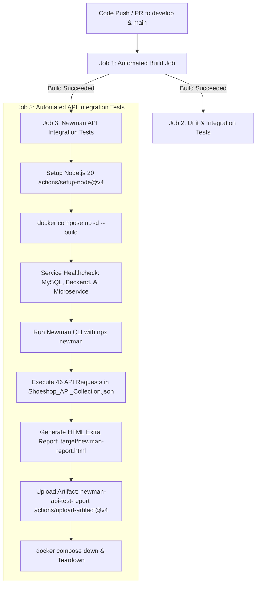

# 🧪 TÀI LIỆU TÍCH HỢP NEWMAN API TESTING VÀO CI/CD (TASK TEST-30)
> **Dự án:** ShoeShop Testing & Quality Assurance System  
> **Mã Task Jira:** `TEST-30` — Integrate Newman into CI  
> **Nhánh Git (Branch):** `ci/w6-TEST-30-integrate-newman-into-ci`  
> **Người thực hiện:** Leader (Trương Hoài Được)  
> **Thời gian:** Tuần 6 (Week 6 Sprint)  

---

## 📌 1. MỤC TIÊU & TỔNG QUAN

Nhiệm vụ **TEST-30** mở rộng quy trình CI/CD Pipeline trên **GitHub Actions** bằng cách tự động hóa hoàn toàn việc kiểm thử API End-to-End (E2E) thông qua **Newman CLI**. Công việc bao gồm:
1. **Tạo Job kiểm thử API tự động (Automated API Integration Job):** Tích hợp job `api-test` chạy song song với `test` sau khi hoàn thành biên dịch `build`.
2. **Khởi chạy hệ sinh thái Docker hoàn chỉnh (Dockerized Service Setup):** Build và kích hoạt tự động toàn bộ 4 containers: `shoeshop-mysql`, `ai-service` (FastAPI YOLOv8), `shoeshop-backend` (Spring Boot 2.7) và `nginx-proxy` (Cổng 80) ngay trên GitHub Actions runner.
3. **Thực thi bộ Test Suite Master (Automated Collection Execution):** Sử dụng Newman CLI (`npx newman`) chạy toàn bộ file Postman Collection `docs/Shoeshop_API_Collection.json` bọc qua biến môi trường `docs/Shoeshop_Postman_Environment.json` nhắm thẳng vào các endpoint thực tế đang chạy trên container.
4. **Đóng gói Báo cáo HTML nâng cao (CI Test Artifacts):** Tự động sinh báo cáo kiểm thử giao diện HTML trực quan (`newman-reporter-htmlextra`) tại `target/newman-report.html` và lưu trữ làm workflow artifact.

---

## 🏗️ 2. QUY TRÌNH THỰC THI TRONG CI/CD (PIPELINE FLOW)



---

## ⚙️ 3. CHI TIẾT CẤU HÌNH JOB `api-test` TRONG `.github/workflows/ci.yml`

```yaml
  api-test:
    name: Automated API Integration Tests (Newman)
    needs: build
    runs-on: ubuntu-latest

    steps:
      - name: Checkout repository
        uses: actions/checkout@v4

      - name: Set up Node.js for Newman CLI
        uses: actions/setup-node@v4
        with:
          node-version: '20'

      - name: Build and Launch Dockerized Services
        run: |
          docker compose up -d --build shoeshop-mysql ai-service shoeshop-backend nginx-proxy

      - name: Wait for Services Health and Readiness
        run: |
          echo "Waiting for services to become healthy..."
          docker compose exec -T shoeshop-mysql mysqladmin ping -h localhost --silent --wait=60
          
          echo "Waiting for Backend (via Nginx proxy on port 80)..."
          timeout 120s bash -c 'until curl -s -f http://localhost/admin/login > /dev/null || curl -s http://localhost/ > /dev/null; do echo "Backend warming up..."; sleep 3; done'
          
          echo "Waiting for AI Microservice (port 8000)..."
          timeout 60s bash -c 'until curl -s -f http://localhost:8000/docs > /dev/null; do echo "AI service warming up..."; sleep 2; done'
          
          echo "All services are up and responding successfully!"

      - name: Execute Newman API Test Collection
        run: |
          mkdir -p target
          npx --yes newman run docs/Shoeshop_API_Collection.json \
            -e docs/Shoeshop_Postman_Environment.json \
            -r cli,htmlextra \
            --reporter-htmlextra-export target/newman-report.html \
            --insecure

      - name: Upload Newman HTML Test Report
        uses: actions/upload-artifact@v4
        if: always()
        with:
          name: newman-api-test-report
          path: target/newman-report.html
          retention-days: 14

      - name: Teardown Services and Dump Logs on Failure
        if: always()
        run: |
          if [ "${{ job.status }}" != "success" ]; then
            echo "Pipeline failed, dumping docker compose logs:"
            docker compose logs
          fi
          docker compose down
```

---

## 🐳 4. ĐẶC TẢ DỊCH VỤ DOCKER CONTAINER

Hệ sinh thái dịch vụ phục vụ kiểm thử API gồm 4 container được liên kết qua mạng `shoeshop-net`:

| Tên Container | Hình ảnh (Image) | Cổng Host:Container | Mục đích & Vai trò |
| :--- | :--- | :---: | :--- |
| `shoeshop-mysql` | `mysql:8.0` | `3307:3306` | CSDL lưu trữ với Flyway tự động migrate schema `V1`..`V16` |
| `shoeshop-ai` | `shoeshop-ai:latest` (Dockerfile) | `8000:8000` | Microservice Python FastAPI + YOLOv8 phân tích và kiểm duyệt ảnh sản phẩm |
| `shoeshop-api` | `shoeshop-backend:latest` (Dockerfile) | N/A (Internal `8080`) | Backend Java Spring Boot xử lý nghiệp vụ mua bán, voucher, đánh giá |
| `shoeshop-nginx` | `nginx:alpine` | `80:80` | Reverse proxy chuyển tiếp toàn bộ request từ `http://localhost` về backend |

---

## 🧪 5. ĐẶC TẢ POSTMAN COLLECTION & NEWMAN ARTIFACTS

### 5.1. Dữ liệu đầu vào
1. **Master Collection:** `docs/Shoeshop_API_Collection.json`
   - Bao gồm toàn bộ các phân hệ: Authentication, Product Search & Pagination, Cart & Order, Vouchers, Review & Rating, Cancel & Return Order, Admin Management, AI Gate Analysis.
   - Chứa 46 kịch bản request với pre-request scripts và test scripts kiểm tra status code, response time, JSON schema và data assertions.
2. **Environment File:** `docs/Shoeshop_Postman_Environment.json`
   - `base_url`: `http://localhost`
   - `ai_url`: `http://localhost:8000`

### 5.2. Đầu ra kiểm thử (Artifacts)
- **Báo cáo dòng lệnh (CLI Summary):** Hiển thị bảng tổng hợp Pass/Fail, Total Run Time, Failed Assertions ngay trên console log của GitHub Actions.
- **Báo cáo HTML trực quan (HTML Extra Report):** Sinh tại `target/newman-report.html`, bao gồm:
  - Dashboard tổng quan (Passed, Failed, Skipped).
  - Chi tiết từng Request Header, Request Body, Response Header, Response Body.
  - Thời gian phản hồi (Response Time) và biểu đồ phân phối hiệu năng API.
  - Được lưu trữ dưới dạng artifact `newman-api-test-report` với thời hạn lưu trữ 14 ngày.

---

## 🚀 6. HƯỚNG DẪN KIỂM CHỨNG (VERIFICATION GUIDE)

### Chạy kiểm thử thủ công cục bộ (Local Run)
```powershell
# Sử dụng script wrapper tự động
.\scripts\run-api-tests.ps1
```

### Kiểm chứng trên GitHub Actions
1. Push nhánh `ci/w6-TEST-30-integrate-newman-into-ci` lên GitHub.
2. Tạo Pull Request vào `develop` hoặc kích hoạt qua tab **Actions** -> **ShoeShop CI/CD Pipeline**.
3. Quan sát job `Automated API Integration Tests (Newman)`:
   - Các containers khởi động và qua bước Readiness Check.
   - Newman thực thi toàn bộ 46 APIs.
   - Báo cáo HTML `target/newman-report.html` được upload lên tab Artifacts của workflow run.
