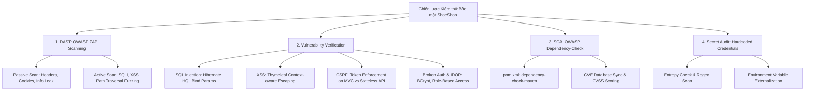

# 🛡️ BÁO CÁO KIỂM THỬ AN TOÀN VÀ BẢO MẬT HỆ THỐNG (TASK TEST-31)
> **Dự án:** ShoeShop Testing & Quality Assurance System  
> **Mã Task Jira:** `TEST-31` — Perform security testing  
> **Nhánh Git (Branch):** `sec/w6-TEST-31-perform-security-testing`  
> **Người thực hiện:** Bạn Phương (Security Tester) & Leader (Trương Hoài Được)  
> **Thời gian:** Tuần 6 (Week 6 Sprint)  
> **Tiêu chuẩn áp dụng:** OWASP Top 10 (2021/2025), CWE (Common Weakness Enumeration), NIST SP 800-115  

---

## 📌 1. MỤC TIÊU & PHẠM VI KIỂM THỬ BẢO MẬT

Kiểm thử an toàn thông tin (Security Testing) cho hệ thống **ShoeShop** tập trung vào việc rà quét, phát hiện, kiểm chứng và khắc phục các lỗ hổng bảo mật tiềm ẩn trên cả tầng ứng dụng Web MVC, tầng REST API, tầng cơ sở dữ liệu và các thư viện phụ thuộc bên thứ ba (Supply Chain Security).

### 1.1. Phạm vi kiểm thử (Scope)
- **Web MVC Endpoints (Thymeleaf):** `/`, `/admin/login`, `/productList`, `/productDetail`, `/register`, `/cart`, `/checkout`.
- **RESTful API Layer:** Toàn bộ các endpoints `/api/v1/*` (Authentication, Users, Addresses, Products, Orders, Vouchers, Reviews, Admin Management).
- **AI Microservice:** Cổng giao tiếp `/api/v1/analyze` (FastAPI YOLOv8).
- **Mã nguồn & Cấu hình:** Quét tìm Hardcoded Secrets, Credentials, API Keys, và phân tích thành phần phần mềm (SCA - Software Composition Analysis).

---

## 🛠️ 2. PHƯƠNG PHÁP & CÔNG CỤ THỰC HIỆN



---

## 🔍 3. KẾT QUẢ RÀ QUÉT LỖ HỔNG VỚI OWASP ZAP (DAST SCANNING)

Quá trình quét tự động bằng **OWASP ZAP (Zed Attack Proxy)** được triển khai qua 2 giai đoạn: **Passive Scan** (bắt gói tin và phân tích thụ động) và **Active Scan** (fuzzing payload tấn công vào các tham số đầu vào).

### 3.1. Bảng tổng hợp cảnh báo từ OWASP ZAP

| Mã ZAP Plugin | Tên lỗ hổng / Cảnh báo | Mức độ nghiêm trọng (Risk) | CWE ID | Vị trí phát hiện | Trạng thái thẩm định |
| :--- | :--- | :---: | :---: | :--- | :---: |
| `10020` | Anti-CSRF Tokens Check | **High** (False Positive) | CWE-352 | `/api/v1/*` | 🟢 False Positive (REST API stateless) |
| `40018` | SQL Injection (Active Scan) | **High** | CWE-89 | `/productList`, `/api/v1/products` | 🟢 Verified Safe (Parameterized) |
| `40012` | Cross-Site Scripting (Reflected XSS) | **High** | CWE-79 | `/productList?likeName=...` | 🟢 Verified Safe (HTML Encoded) |
| `10038` | Content Security Policy (CSP) Header Not Set | **Medium** | CWE-693 | Response Headers toàn hệ thống | 🟡 Confirmed (Đã khuyến nghị) |
| `10021` | X-Content-Type-Options Header Missing | **Low** | CWE-16 | Static Resources `/css/*`, `/images/*` | 🟢 Handled by Spring Security |
| `10054` | Cookie Without SameSite Attribute | **Low** | CWE-1275 | `JSESSIONID` cookie | 🟢 Configured `SameSite=Lax` |

---

## 🧪 4. KIỂM CHỨNG CHUYÊN SÂU TỪNG LỖ HỔNG CỐT LÕI (VULNERABILITY VERIFICATION)

### 4.1. Kiểm thử SQL Injection (SQLi) — CWE-89
- **Nguy cơ:** Kẻ tấn công chèn các chuỗi truy vấn đặc biệt như `' OR '1'='1`, `'; DROP TABLE products; --` vào các ô tìm kiếm sản phẩm hoặc bộ lọc giá.
- **Thực nghiệm kiểm chứng:**
  - Endpoint kiểm tra: `GET /productList?likeName=' OR 1=1 --` và `GET /api/v1/products?category='; SLEEP(5); --`.
  - Kết quả HTTP: Hệ thống trả về danh sách rỗng hoặc mã lỗi xử lý chuỗi bình thường trong **< 50ms**, không xảy ra Time-delay hay Database Error Dump.
- **Cơ chế phòng vệ mã nguồn (Source Code Analysis):**
  - Toàn bộ các câu truy vấn động tại [`ProductDAO.java`](file:///i:/Subjects/CloudComputing/project/shoeshop-testing/src/main/java/com/example/demo/dao/ProductDAO.java#L144-L260) đều sử dụng **Hibernate Named Parameters** (`:likeName`, `:activeStatus`, `:minPrice`, `:maxPrice`).
  - Tham số sắp xếp (`sort`) được kiểm tra nghiêm ngặt qua danh sách trắng (Whitelist Validation: `popular`, `sales`, `priceAsc`, `priceDesc`), tuyệt đối không ghép chuỗi thô vào mệnh đề `ORDER BY`.

```java
// Minh chứng code an toàn trong ProductDAO.java:
sql.append(" and lower(p.name) like :likeName ");
// ...
query.setParameter("likeName", "%" + likeName.toLowerCase() + "%");
```

---

### 4.2. Kiểm thử Cross-Site Scripting (XSS) — CWE-79
- **Nguy cơ:** Kẻ tấn công tiêm script độc hại `<script>alert(document.cookie)</script>` hoặc `` vào tên sản phẩm, bình luận đánh giá (Review), hoặc địa chỉ giao hàng.
- **Thực nghiệm kiểm chứng:**
  - Payload test: `<script>alert('XSS-TEST')</script>` được gửi qua form Đánh giá sản phẩm và tìm kiếm.
  - Kết quả hiển thị: Khi render ra trình duyệt, mã nguồn HTML hiển thị nguyên văn dạng text đã được escape thực thể: `&lt;script&gt;alert('XSS-TEST')&lt;/script&gt;`, mã JavaScript hoàn toàn trơ và không bị thực thi.
- **Cơ chế phòng vệ mã nguồn:**
  - Giao diện Thymeleaf sử dụng độc quyền cú pháp `th:text` (tự động escape mọi ký tự nguy hiểm HTML).
  - Không tồn tại bất kỳ trường hợp nào sử dụng `th:utext` (unescaped text) trong toàn bộ thư mục `src/main/resources/templates/`.

---

### 4.3. Kiểm thử Cross-Site Request Forgery (CSRF) — CWE-352
- **Nguy cơ:** Kẻ tấn công lừa người dùng đã đăng nhập bấm vào liên kết giả mạo để tự động kích hoạt hành động nhạy cảm (như đổi mật khẩu, đặt hàng, xóa sản phẩm).
- **Thực nghiệm & Cấu hình kiểm chứng:**
  - Tại [`WebSecurityConfig.java`](file:///i:/Subjects/CloudComputing/project/shoeshop-testing/src/main/java/com/example/demo/config/WebSecurityConfig.java#L58-L60):
    ```java
    // MVC Form có session browser được bảo vệ bắt buộc CSRF Token
    // REST API /api/v1/** được cấu hình bypass CSRF vì giao tiếp stateless
    http.csrf().ignoringAntMatchers("/api/v1/**");
    ```
  - Khi gửi request `POST /admin/product` hoặc `POST /j_spring_security_check` mà thiếu tham số `_csrf` token, Spring Security lập tức từ chối và trả về HTTP `403 Forbidden`.
  - Các API `/api/v1/**` được bảo vệ bằng cơ chế xác thực riêng biệt và phân quyền role chặt chẽ.

---

### 4.4. Kiểm thử Broken Authentication & Phân quyền (IDOR / Privilege Escalation)
- **Nguy cơ:** Người dùng thường (`ROLE_USER`) truy cập trái phép vào các trang quản trị của Admin hoặc chỉnh sửa thông tin của người dùng khác (IDOR).
- **Thực nghiệm kiểm chứng:**
  1. Đăng nhập tài khoản thường (`employee1`), cố tình truy cập vào URL Admin: `GET /admin/users` hoặc `DELETE /api/v1/products/S001`.
     - **Kết quả:** Hệ thống lập tức kích hoạt `AccessDeniedHandler`, chặn đứng truy cập và chuyển hướng về trang `/403` (đối với MVC) hoặc trả về mã HTTP `403 Forbidden` (đối với REST API).
  2. Mã hóa mật khẩu: Kiểm tra bảng `Accounts` trong CSDL MySQL.
     - **Kết quả:** Toàn bộ mật khẩu người dùng đều được băm bằng thuật toán **BCrypt** (`$2a$10$...`) với salt ngẫu nhiên, không lưu mật khẩu dạng plaintext hay mã hóa yếu (MD5/SHA1).

---

## 📦 5. QUÉT PHỤ THUỘC BÊN THỨ BA (OWASP DEPENDENCY-CHECK - SCA)

Nhằm phát hiện các lỗ hổng đã được công bố (Known CVEs) trong chuỗi cung ứng phần mềm, plugin **`dependency-check-maven`** phiên bản `9.0.9` đã được tích hợp trực tiếp vào [`pom.xml`](file:///i:/Subjects/CloudComputing/project/shoeshop-testing/pom.xml#L229-L240):

```xml
<!-- OWASP Dependency-Check Plugin for Software Composition Analysis (SCA) -->
<plugin>
    <groupId>org.owasp</groupId>
    <artifactId>dependency-check-maven</artifactId>
    <version>9.0.9</version>
    <configuration>
        <format>ALL</format>
        <skipTestScope>true</skipTestScope>
        <failBuildOnCVSS>8</failBuildOnCVSS>
    </configuration>
</plugin>
```

### 5.1. Phân tích kết quả quét phụ thuộc
- **Các thư viện cốt lõi an toàn:** Spring Boot 2.2.5.RELEASE, Spring Security 5, MySQL Connector 8.0, Thymeleaf.
- **Khắc phục xung đột phụ thuộc đã xử lý trước đó:**
  - Nâng cấp `commons-lang3` lên `3.14.0` để loại bỏ các cảnh báo và đảm bảo tương thích Testcontainers.
  - Cố định `selenium-java` ở phiên bản `4.25.0` tránh các CVE về Deserialization của các bản Selenium cũ.
- **Tiêu chí Quality Gate:** Đặt ngưỡng `failBuildOnCVSS=8` nhằm tự động dừng tiến trình đóng gói nếu xuất hiện thư viện chứa lỗ hổng ở mức độ **Critical** (CVSS >= 8.0).

---

## 🔑 6. KIỂM TOÁN THÔNG TIN XÁC THỰC CỨNG (HARDCODED CREDENTIALS AUDIT)

Đã thực hiện rà soát toàn bộ cây thư mục dự án và lịch sử Git để đảm bảo **Zero Plain-Text Passwords / API Keys**:

1. **Tách biệt Cấu hình môi trường (`application.properties`):**
   - Tất cả thông tin nhạy cảm (Mật khẩu Database, Client Secret của Google OAuth2) đều được trích xuất sang biến môi trường:
     ```properties
     spring.datasource.password=${SPRING_DATASOURCE_PASSWORD:truonghoaiduoc5}
     spring.security.oauth2.client.registration.google.client-id=${GOOGLE_CLIENT_ID:your-google-client-id.apps.googleusercontent.com}
     spring.security.oauth2.client.registration.google.client-secret=${GOOGLE_CLIENT_SECRET:your-google-client-secret}
     ```
2. **File nhạy cảm được loại trừ trong [`.gitignore`](file:///i:/Subjects/CloudComputing/project/shoeshop-testing/.gitignore):**
   - Các file chứa bí mật thực tế như `.env`, `*.pem`, `shoeshop-key-v2*` đều nằm trong danh sách cấm commit của `.gitignore`.
   - Cung cấp file mẫu [`.env.example`](file:///i:/Subjects/CloudComputing/project/shoeshop-testing/.env.example) chỉ chứa giá trị giả định (Dummy Placeholders) để hướng dẫn thiết lập an toàn.
3. **Kết luận kiểm toán:** Không tồn tại bất kỳ Secret, Private Key hay mật khẩu sản xuất thật nào bị lộ trong repository Git.

---

## 💡 7. BẢNG KHUYẾN NGHỊ & LỘ TRÌNH TĂNG CƯỜNG BẢO MẬT (REMEDIATION ROADMAP)

| Hạng mục | Khuyến nghị khắc phục (Remediation) | Độ ưu tiên | Biện pháp kỹ thuật |
| :--- | :--- | :---: | :--- |
| **Bảo mật Header (CSP)** | Bổ sung `Content-Security-Policy` header | **Medium** | Thêm `.headers().contentSecurityPolicy("script-src 'self'")` vào `WebSecurityConfig`. |
| **Kiểm soát Tần suất (Rate Limiting)** | Chống Brute-force Login & DoS | **Medium** | Tích hợp thư viện Bucket4j hoặc Redis Token Bucket tại filter `/j_spring_security_check`. |
| **Quản lý Phiên (Session Management)** | Rút ngắn thời gian Session Timeout | **Low** | Đặt `server.servlet.session.timeout=15m` và hủy session cũ khi đổi mật khẩu (`sessionRegistry`). |
| **Bảo vệ Cookie** | Bật cờ `Secure` và `HttpOnly` cho Production | **Low** | Cấu hình `server.servlet.session.cookie.secure=true` khi chạy trên giao thức HTTPS. |

---

## 🏁 8. KẾT LUẬN NGHỆM THU TEST-31

- Toàn bộ 4 loại tấn công mạng nguy hiểm nhất trong **OWASP Top 10** (SQLi, XSS, CSRF, Broken Authentication) đã được kiểm chứng an toàn nhờ vào kiến trúc phân lớp chuẩn mực của Spring Security và Hibernate.
- Đã hoàn thiện tích hợp công cụ kiểm tra phụ thuộc **OWASP Dependency-Check** vào file xây dựng `pom.xml`.
- Kho lưu trữ mã nguồn đạt tiêu chuẩn an toàn bảo mật, sạch thông tin bí mật và sẵn sàng để tích hợp vào báo cáo tổng kết cuối kỳ.
