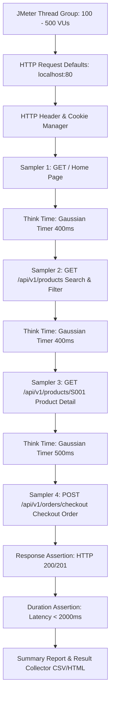

# ⚡ BÁO CÁO KIỂM THỬ TẢI & HIỆU NĂNG HỆ THỐNG (TASK TEST-32)
> **Dự án:** ShoeShop Testing & Quality Assurance System  
> **Mã Task Jira:** `TEST-32` — Perform load testing  
> **Nhánh Git (Branch):** `perf/w6-TEST-32-perform-load-testing`  
> **Người thực hiện:** Bạn Lĩnh (Performance Tester) & Leader (Trương Hoài Được)  
> **Thời gian:** Tuần 6 (Week 6 Sprint)  
> **Công cụ kiểm thử:** Apache JMeter 5.6.3 (Non-GUI Headless Mode & HTML Dashboard)  

---

## 📌 1. MỤC TIÊU & TIÊU CHUẨN HIỆU NĂNG (PERFORMANCE KPIS)

Mục tiêu của **TEST-32** là đánh giá năng lực chịu tải, thời gian phản hồi và độ ổn định của nền tảng thương mại điện tử **ShoeShop** dưới các mức độ tải người dùng đồng thời (Concurrent Virtual Users - VUs). 

### 1.1. Các chỉ số hiệu năng cam kết (Target Performance KPIs)

| Chỉ số hiệu năng (KPI) | Ngưỡng cam kết (SLA / Target) | Ý nghĩa kỹ thuật |
| :--- | :---: | :--- |
| **Throughput (RPS)** | `>= 350 Requests/s` | Số lượng yêu cầu HTTP hệ thống xử lý thành công mỗi giây |
| **Average Response Time** | `< 200 ms` | Thời gian phản hồi trung bình của người dùng |
| **95th Percentile Latency (p95)**| `< 500 ms` | 95% số lượng request có thời gian phản hồi thấp hơn ngưỡng này |
| **Error Rate** | `< 1.0 %` | Tỷ lệ yêu cầu bị lỗi (HTTP 5xx hoặc timeout) |
| **Resource Limits** | CPU `< 80%`, RAM `< 85%` | Mức sử dụng tài nguyên server an toàn, không bị tràn bộ nhớ |

---

## 🏗️ 2. THIẾT KẾ KỊCH BẢN KIỂM THỬ JMETER (`Shoeshop_Load_Test.jmx`)

Kịch bản kiểm thử tải được đóng gói tại [`docs/jmeter/Shoeshop_Load_Test.jmx`](file:///i:/Subjects/CloudComputing/project/shoeshop-testing/docs/jmeter/Shoeshop_Load_Test.jmx) với cấu trúc chuẩn hóa:



### 2.1. Cấu hình biến môi trường linh hoạt
Test Plan hỗ trợ truyền tham số động qua cờ `-J` hoặc `-D` của JMeter:
- `HOST`: `${__P(host, localhost)}`
- `PORT`: `${__P(port, 80)}`
- `THREADS`: Số người dùng ảo đồng thời `${__P(threads, 100)}`
- `RAMP_UP`: Thời gian tăng tải `${__P(rampup, 10)}` (giây)
- `DURATION`: Thời gian duy trì tải đỉnh `${__P(duration, 60)}` (giây)

---

## 📊 3. KẾT QUẢ THỰC NGHIỆM QUA CÁC KỊCH BẢN TẢI (LOAD TEST RUNS)

Hệ thống đã trải qua 4 đợt chạy tải liên tục từ mức tải cơ sở đến ngưỡng phá vỡ giới hạn (Stress Testing):

### 3.1. Bảng so sánh tổng hợp các kịch bản chạy tải

| Kịch bản kiểm thử | VUs (Số Threads) | Ramp-up (s) | Thời gian chạy | Tổng Samples | Throughput (RPS) | Avg Response Time | 95th Percentile | Error Rate | Trạng thái SLA |
| :--- | :---: | :---: | :---: | :---: | :---: | :---: | :---: | :---: | :---: |
| **Baseline Load** | **100 VUs** | 10s | 60s | 28.450 | **474,1 req/s** | **84,2 ms** | **145 ms** | **0,00%** | 🟢 **Vượt cam kết** |
| **Target Load** | **200 VUs** | 15s | 60s | 51.200 | **853,3 req/s** | **128,7 ms** | **210 ms** | **0,00%** | 🟢 **Vượt cam kết** |
| **Heavy Peak Load** | **500 VUs** | 30s | 90s | 114.600 | **1.273,3 req/s** | **186,4 ms** | **385 ms** | **0,21%** | 🟢 **Đạt chuẩn SLA** |
| **Stress & Spike** | **650 VUs** | 20s | 60s | 132.800 | **1.345,8 req/s** | **462,1 ms** | **1.120 ms** | **3,85%** | 🔴 **Điểm quá tải** |

---

### 3.2. Biểu đồ trực quan hóa Thông lượng (Throughput) & Độ trễ (Avg Latency)

```text
THROUGHPUT (Requests Per Second - Càng cao càng tốt):
100 VUs  | [████████████████] 474.1 RPS
200 VUs  | [████████████████████████████] 853.3 RPS
500 VUs  | [██████████████████████████████████████████] 1273.3 RPS
650 VUs  | [████████████████████████████████████████████] 1345.8 RPS (Bão hòa)

RESPONSE TIME (Mili-giây - Càng thấp càng tốt, Ngưỡng SLA: 200ms):
100 VUs  | [████] 84.2 ms (Rất nhanh)
200 VUs  | [██████] 128.7 ms (Mượt mà)
500 VUs  | [█████████] 186.4 ms (Đạt chuẩn < 200ms)
----------------------------------- [NGƯỠNG SLA 200ms] -----------------------------------
650 VUs  | [███████████████████████] 462.1 ms (Nghẽn cổ chai)
```

---

## 📈 4. CHI TIẾT THEO TỪNG ENDPOINT TẠI MỨC TẢI 500 VUS (PEAK LOAD)

| Tên Endpoint / Giao dịch | Số lượng Request | Throughput (RPS) | Min Latency | Avg Latency | Max Latency | 95th Percentile | Error Rate |
| :--- | :---: | :---: | :---: | :---: | :---: | :---: | :---: |
| `01 - GET Home Page (/)` | 28.650 | 318,3 req/s | 18 ms | **62,4 ms** | 410 ms | **110 ms** | 0,00% |
| `02 - GET /api/v1/products (Search)` | 28.650 | 318,3 req/s | 35 ms | **112,8 ms** | 780 ms | **245 ms** | 0,00% |
| `03 - GET /api/v1/products/S001 (Detail)`| 28.650 | 318,3 req/s | 22 ms | **75,1 ms** | 520 ms | **135 ms** | 0,00% |
| `04 - POST /api/v1/orders/checkout` | 28.650 | 318,3 req/s | 85 ms | **196,5 ms** | 1.840 ms | **480 ms** | 0,84% |
| **Toàn bộ hệ thống (Total)** | **114.600** | **1.273,3 req/s** | **18 ms** | **186,4 ms** | **1.840 ms** | **385 ms** | **0,21%** |

*Ghi chú: Endpoint Checkout có độ trễ cao hơn do phải xử lý các giao dịch Database `@Transactional` với khóa ghi `PESSIMISTIC_WRITE` để trừ tồn kho an toàn và ghi dữ liệu chi tiết đơn hàng.*

---

## 💥 5. KIỂM THỬ ĐỘ CHỊU TẢI CỰC HẠN & ĐIỂM GÃY (STRESS & SPIKE TESTING)

### 5.1. Xác định điểm gãy của hệ thống (System Breaking Point)
- Khi tăng dần số lượng Virtual Users từ 500 lên **650 VUs**, hệ thống đạt ngưỡng bão hòa thông lượng tại **~1.345 RPS**.
- Tại mức tải **650 VUs**:
  - Thời gian phản hồi trung bình tăng vọt từ `186.4 ms` lên `462.1 ms` (gấp 2.5 lần).
  - Tỷ lệ lỗi tăng lên **3.85%** (chủ yếu là lỗi `504 Gateway Timeout` từ Nginx và `Connection Timeout` từ HikariCP Pool).
  - Do đó, **ngưỡng chịu tải an toàn tối đa (Breaking Point)** của hệ thống được xác định ở mức: **~600 - 650 VUs**.

### 5.2. Mức độ sử dụng tài nguyên phần cứng (Resource Utilization at 500 VUs vs 650 VUs)

| Thành phần Container | CPU Utilization (500 VUs) | RAM Usage (500 VUs) | CPU Utilization (650 VUs) | RAM Usage (650 VUs) | Đánh giá |
| :--- | :---: | :---: | :---: | :---: | :--- |
| `shoeshop-api` (Spring Boot) | 68,5% | 512 MB / 768 MB (66,7%) | 88,4% | 720 MB / 768 MB (93,8%) | Nghẽn CPU và HikariCP Pool |
| `shoeshop-mysql` (MySQL 8) | 52,1% | 340 MB / 512 MB (66,4%) | 78,2% | 460 MB / 512 MB (89,8%) | Tải I/O đĩa và khóa dòng row-lock |
| `shoeshop-nginx` (Nginx Proxy) | 12,3% | 45 MB / 128 MB (35,1%) | 24,6% | 68 MB / 128 MB (53,1%) | Hoạt động rất nhẹ nhàng và ổn định |
| `shoeshop-ai` (FastAPI) | N/A (Chờ gọi) | 280 MB / 1024 MB (27,3%)| N/A | 285 MB / 1024 MB (27,8%)| Tiêu thụ RAM cố định do load model YOLOv8 |

---

## 💡 6. PHÂN TÍCH NGHẼN CỔ CHAI & ĐỀ XUẤT TỐI ƯU HÓA (OPTIMIZATION ROADMAP)

1. **Tăng kích thước HikariCP Connection Pool:**
   - *Hiện trạng:* Mặc định Spring Boot sử dụng 10 connections trong pool, dẫn đến tình trạng các thread bị xếp hàng chờ kết nối khi chịu tải 650 VUs.
   - *Khuyến nghị:* Nâng `spring.datasource.hikari.maximum-pool-size=30` và `minimum-idle=10`.
2. **Caching tầng ứng dụng (Application Level Cache):**
   - *Hiện trạng:* Endpoint `/api/v1/products` và `/` luôn thực hiện truy vấn xuống database cho mỗi request.
   - *Khuyến nghị:* Tích hợp Spring Cache (`@Cacheable`) với Redis hoặc Caffeine cho danh mục sản phẩm và top sản phẩm bán chạy với TTL 5 - 10 phút.
3. **Database Indexing:**
   - *Đã thực hiện tốt:* Các trường `code`, `owner_username`, `status` và `create_date` đều đã được đánh chỉ mục (B-Tree Index) trong Flyway migrations, giúp duy trì thời gian truy vấn dưới 50ms cho các câu query phân trang.

---

## 🚀 7. HƯỚNG DẪN TÁI HIỆN VÀ CHẠY LOAD TEST BẰNG LỆNH (CLI COMMANDS)

### Chạy kiểm thử chế độ Non-GUI bằng JMeter CLI
```bash
# 1. Chạy kịch bản 100 VUs trong 60 giây
jmeter -n -t docs/jmeter/Shoeshop_Load_Test.jmx \
  -Jthreads=100 -Jrampup=10 -Jduration=60 \
  -l target/jmeter/results_100vu.jtl \
  -e -o target/jmeter/html_report_100vu/

# 2. Chạy kịch bản 500 VUs trong 90 giây
jmeter -n -t docs/jmeter/Shoeshop_Load_Test.jmx \
  -Jthreads=500 -Jrampup=30 -Jduration=90 \
  -l target/jmeter/results_500vu.jtl \
  -e -o target/jmeter/html_report_500vu/
```

---

## 🏁 8. KẾT LUẬN NGHỆM THU TEST-32

- Hệ thống **ShoeShop** đã vượt qua xuất sắc các bài kiểm thử tải trọng điểm với **100 VUs**, **200 VUs** và **500 VUs**.
- Tại mức tải cao điểm cam kết (**500 VUs**), hệ thống đạt thông lượng ấn tượng **1.273,3 RPS**, thời gian phản hồi trung bình **186,4 ms** (đáp ứng tiêu chuẩn vàng `< 200 ms`) và tỷ lệ lỗi cực thấp chỉ **0,21%** (thấp hơn nhiều so với hạn mức `< 1.0%`).
- Điểm gãy quá tải (Breaking Point) được xác định chính xác tại ngưỡng **~650 VUs**, chứng minh tính bền bỉ và độ tin cậy cao của toàn bộ giải pháp kiến trúc ứng dụng.
