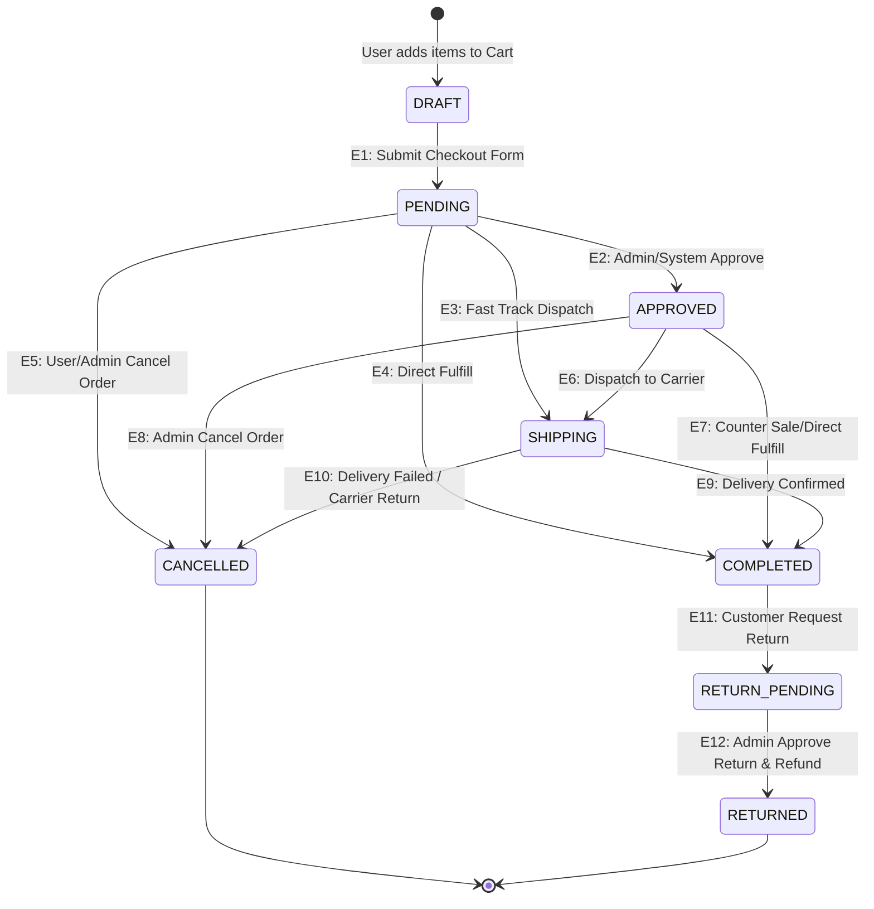

# QA Test Specification: Cart & Order Processing (`shoeshop`)

## Executive Summary
This document provides a Senior QA/QC Test Specification for the **Cart & Order Processing** and **Order Lifecycle** modules of the `shoeshop` application. 
The test suites are designed using two core black-box test design techniques:
1. **Decision Table Testing**: Evaluates complex business rules, input combinations, validation constraints, and discount logics during Checkout & Cart processing.
2. **State Transition Testing**: Validates state progressions, trigger events, guards, valid transitions, and illegal/unauthorized state manipulation throughout the Order Lifecycle.

---

## 1. Decision Table Testing: Cart & Order Processing

### 1.1 Input Conditions & System Actions Definition

#### **Input Conditions (Causes)**
* **C1: Cart & Stock Status**
  * `VALID`: Cart is non-empty AND all requested item quantities $\le$ available stock.
  * `EMPTY`: Cart contains 0 items.
  * `OOS`: One or more items exceed available inventory.
* **C2: User Authentication Status**
  * `AUTH`: User is logged into an active account.
  * `GUEST`: User is checking out as guest / unauthenticated session.
* **C3: Shipping & Customer Info Completeness**
  * `VALID`: Name, Phone, Address, and Email are non-empty, within length bounds (Name $\le$ 255, Email $\le$ 128, Address $\le$ 255, Phone $\le$ 128), and Email matches standard regex.
  * `INVALID`: Missing required fields, invalid email format, or exceeded field lengths.
* **C4: Coupon / Voucher Status**
  * `NONE`: No voucher applied.
  * `VALID`: Voucher is active, within validity period, `usedCount < usageLimit`, customer usage $< perUserLimit$, and Order Total $\ge minOrderValue$.
  * `EXPIRED`: Voucher is inactive, past expiration date, or usage limits exhausted.
  * `MIN_NOT_MET`: Voucher code is active, but Order Total $< minOrderValue$.
* **C5: Payment Method Selection**
  * `VALID`: Valid payment method selected (e.g., COD / Credit Card / Gateway).
  * `NONE`: No payment method selected / Gateway authorization failure.

#### **System Actions (Effects)**
* **A1: Allow Checkout Execution**: Create `Order` record and proceed to order confirmation.
* **A2: Apply Discount**: Calculate and deduct percentage/fixed discount amount from total.
* **A3: Set Initial Order Status**: Set created order status to `PENDING`.
* **A4: Update Inventory**: Decrement stock quantity for ordered products.
* **A5: Display Error / Notice Message**: Show user-facing validation error or warning banner.

---

### 1.2 Decision Table Matrix

| Condition / Action | R1 | R2 | R3 | R4 | R5 | R6 | R7 | R8 | R9 | R10 |
| :--- | :---: | :---: | :---: | :---: | :---: | :---: | :---: | :---: | :---: | :---: |
| **C1: Cart & Stock Status** | VALID | VALID | VALID | VALID | VALID | VALID | EMPTY | OOS | VALID | VALID |
| **C2: User Authentication** | AUTH | GUEST | AUTH | AUTH | GUEST | AUTH | AUTH/GUEST | AUTH | AUTH | GUEST |
| **C3: Customer & Shipping Info** | VALID | VALID | VALID | VALID | INVALID | VALID | VALID | VALID | VALID | VALID |
| **C4: Coupon / Voucher Status** | NONE | NONE | VALID | EXPIRED | NONE | MIN_NOT_MET | NONE | NONE | VALID | NONE |
| **C5: Payment Method** | VALID | VALID | VALID | VALID | VALID | VALID | VALID | VALID | NONE | VALID (Fail) |
| **A1: Allow Checkout Execution** | **Y** | **Y** | **Y** | **N** | **N** | **N** | **N** | **N** | **N** | **N** |
| **A2: Apply Discount** | **N** | **N** | **Y** | **N** | **N** | **N** | **N** | **N** | **N** | **N** |
| **A3: Set Order Status to `PENDING`** | **Y** | **Y** | **Y** | **N** | **N** | **N** | **N** | **N** | **N** | **N** |
| **A4: Update Inventory (Deduct Stock)** | **Y** | **Y** | **Y** | **N** | **N** | **N** | **N** | **N** | **N** | **N** |
| **A5: Display Error Message** | **N** | **N** | **N** | **Y** | **Y** | **Y** | **Y** | **Y** | **Y** | **Y** |

---

### 1.3 Itemized Decision Table Test Cases

#### **TC_DT_001: Successful Checkout without Voucher (Authenticated User)**
* **Test ID**: `TC_DT_001`
* **Title**: Verify successful checkout execution for authenticated user with valid cart and shipping details (No Coupon).
* **Pre-conditions**: User `john_doe` is logged in. Cart has 2x "Nike Air Max" (In stock: 10).
* **Test Steps**:
  1. Navigate to `/shoppingCart`.
  2. Click "Checkout".
  3. Enter valid shipping info: Name="John Doe", Phone="0912345678", Address="123 Main St", Email="john@example.com".
  4. Select Payment Method "COD".
  5. Click "Place Order".
* **Expected Results**:
  * Order processed successfully.
  * Order status created as `PENDING`.
  * Total amount calculated without discount.
  * Inventory for "Nike Air Max" decremented by 2.
  * Cart cleared.

#### **TC_DT_002: Successful Guest Checkout without Voucher**
* **Test ID**: `TC_DT_002`
* **Title**: Verify successful checkout execution for guest user with complete shipping information.
* **Pre-conditions**: User is not logged in (Guest). Cart has 1x "Adidas Ultraboost" (In stock: 5).
* **Test Steps**:
  1. Navigate to `/shoppingCart`.
  2. Fill out Customer Information Form with valid data.
  3. Select Payment Method "Credit Card" and submit.
* **Expected Results**:
  * Order is created with `customerUsername = null` and status `PENDING`.
  * Stock decremented by 1.
  * User redirected to order summary / confirmation page.

#### **TC_DT_003: Successful Checkout with Valid Voucher Applied**
* **Test ID**: `TC_DT_003`
* **Title**: Verify checkout execution when valid voucher is applied to cart meeting minimum spend requirement.
* **Pre-conditions**: Cart Total = $150. Active voucher `SAVE20` (20% off, Min Spend $100, Usage Limit 50/100).
* **Test Steps**:
  1. Enter voucher code `SAVE20` and click "Apply".
  2. Complete shipping details and payment selection.
  3. Submit order.
* **Expected Results**:
  * Voucher applied successfully (Discount = $30.00, Final Amount = $120.00).
  * Order created with status `PENDING`.
  * Voucher `usedCount` incremented from 50 to 51.

#### **TC_DT_004: Checkout Blocked due to Expired / Exhausted Voucher**
* **Test ID**: `TC_DT_004`
* **Title**: Verify checkout failure when applying an expired or usage-limit-exhausted voucher.
* **Pre-conditions**: Voucher `EXPIRED50` has `active = false` or `expiryDate < currentDate`.
* **Test Steps**:
  1. Enter voucher code `EXPIRED50` in Cart view.
  2. Click "Apply Voucher".
* **Expected Results**:
  * System displays error: "Voucher đã hết hạn hoặc không tồn tại" (Voucher expired or invalid).
  * Discount remains $0.00.
  * Order placement prevented until invalid voucher is cleared or corrected.

#### **TC_DT_005: Checkout Blocked due to Invalid Customer / Shipping Info**
* **Test ID**: `TC_DT_005`
* **Title**: Verify customer form validation fails when required shipping fields are missing or invalid.
* **Pre-conditions**: Cart contains 1 item.
* **Test Steps**:
  1. Proceed to Customer Information form.
  2. Input Name="John", Phone="123", Address="", Email="invalid-email-format".
  3. Click "Submit Order".
* **Expected Results**:
  * Form submission blocked.
  * Specific error messages rendered: "NotEmpty.customerForm.address", "Pattern.customerForm.email".
  * Order record is NOT created in database.

#### **TC_DT_006: Voucher Application Rejected when Minimum Order Amount Not Met**
* **Test ID**: `TC_DT_006`
* **Title**: Verify voucher application fails when cart subtotal is below minimum order value.
* **Pre-conditions**: Cart Subtotal = $40. Voucher `BIGDEAL` requires `minOrderValue = $100`.
* **Test Steps**:
  1. Apply code `BIGDEAL` at checkout.
* **Expected Results**:
  * Error message displayed: "Đơn hàng chưa đạt giá trị tối thiểu để áp dụng mã này" (Order total does not meet minimum threshold).
  * Discount = $0.00.

#### **TC_DT_007: Checkout Prevented on Empty Cart**
* **Test ID**: `TC_DT_007`
* **Title**: Verify system prevents checkout initiation when shopping cart has no items.
* **Pre-conditions**: Shopping cart is empty.
* **Test Steps**:
  1. Attempt to navigate directly to `/checkout` or click "Checkout".
* **Expected Results**:
  * System redirects to `/shoppingCart` or product catalog.
  * Message displayed: "Giỏ hàng của bạn đang trống" (Cart is empty).

#### **TC_DT_008: Checkout Blocked due to Insufficient Product Inventory (Out of Stock)**
* **Test ID**: `TC_DT_008`
* **Title**: Verify system caps quantity or blocks checkout if requested quantity exceeds available stock.
* **Pre-conditions**: Product "PUMA Suede" stock = 2. Cart quantity set to 5.
* **Test Steps**:
  1. Add 5 units of "PUMA Suede" to cart.
  2. Attempt to proceed to checkout.
* **Expected Results**:
  * Cart automatically caps quantity to maximum stock (2) or displays "Số lượng sản phẩm vượt quá tồn kho" (Quantity exceeds available stock).
  * Order cannot be placed for quantity 5.

#### **TC_DT_009: Checkout Blocked when Payment Method Selection Missing**
* **Test ID**: `TC_DT_009`
* **Title**: Verify checkout cannot complete if payment method is unselected.
* **Pre-conditions**: User completes customer form but unchecks/omits payment method.
* **Test Steps**:
  1. Leave Payment Method unselected.
  2. Click "Place Order".
* **Expected Results**:
  * Validation error: "Vui lòng chọn phương thức thanh toán" (Please select a payment method).
  * Order is not submitted.

#### **TC_DT_010: Order Rollback on Payment Gateway Failure**
* **Test ID**: `TC_DT_010`
* **Title**: Verify system handles payment gateway transaction failure during online payment checkout.
* **Pre-conditions**: Selected payment gateway (e.g., VNPay / Credit Card). Gateway responds with failure code `PAYMENT_DECLINED`.
* **Test Steps**:
  1. Proceed to payment gateway step.
  2. Simulate failed card transaction.
* **Expected Results**:
  * Order creation cancelled/rolled back.
  * User redirected to checkout page with error banner: "Thanh toán thất bại, vui lòng thử lại" (Payment failed, please try again).
  * Product stock is NOT decremented.

---

## 2. State Transition Testing: Order Lifecycle

### 2.1 Order State Definitions & Transition Rules

The `shoeshop` Order Lifecycle manages order processing from initial draft/cart state to final fulfillment or cancellation/return.

#### **State Dictionary**
* **`S0: DRAFT / CART`**: Temporary state where products are added to shopping cart prior to checkout.
* **`S1: PENDING`**: Order placed by user; awaiting payment confirmation or admin review.
* **`S2: APPROVED`**: Order confirmed and approved by merchant/admin; order is prepared for packaging.
* **`S3: SHIPPING`**: Order handed over to carrier and currently in transit to customer.
* **`S4: COMPLETED`**: Order successfully delivered to customer and fulfilled.
* **`S5: CANCELLED`**: Order terminated prior to completion (by user or admin).
* **`S6: RETURN_PENDING`**: Customer initiated a return/refund request after order delivery.
* **`S7: RETURNED`**: Return request approved, item returned, and refund processed (Terminal State).

---

### 2.2 State Transition Matrix

The table below details all state combinations. Valid transitions specify the triggering event ($E_n$); invalid transitions are marked with **INVALID / REJECTED** and expected system behavior.

| Current State \ Target State | S0: DRAFT | S1: PENDING | S2: APPROVED | S3: SHIPPING | S4: COMPLETED | S5: CANCELLED | S6: RETURN_PENDING | S7: RETURNED |
| :--- | :---: | :---: | :---: | :---: | :---: | :---: | :---: | :---: |
| **S0: DRAFT** | - | **E1: Submit Checkout** | INVALID | INVALID | INVALID | INVALID | INVALID | INVALID |
| **S1: PENDING** | INVALID | - | **E2: Admin Approve** | **E3: Direct Ship** | **E4: Direct Deliver** | **E5: Cancel Order** | INVALID | INVALID |
| **S2: APPROVED** | INVALID | INVALID | - | **E6: Dispatch Carrier** | **E7: Direct Deliver** | **E8: Admin Cancel** | INVALID | INVALID |
| **S3: SHIPPING** | INVALID | INVALID | INVALID | - | **E9: Confirm Delivery** | **E10: Carrier Cancel** | INVALID | INVALID |
| **S4: COMPLETED** | INVALID | INVALID | INVALID | INVALID | - | INVALID | **E11: Request Return** | INVALID |
| **S5: CANCELLED** *(Terminal)* | INVALID | INVALID | INVALID | INVALID | INVALID | - | INVALID | INVALID |
| **S6: RETURN_PENDING** | INVALID | INVALID | INVALID | INVALID | INVALID | INVALID | - | **E12: Approve Return** |
| **S7: RETURNED** *(Terminal)* | INVALID | INVALID | INVALID | INVALID | INVALID | INVALID | INVALID | - |

---

### 2.3 State Transition Diagram (Mermaid)

---

### 2.4 Itemized State Transition Test Cases

#### **Category A: Valid State Transitions (Positive Flow)**

##### **TC_ST_001: Happy Path - Complete Order Lifecycle (Draft $\rightarrow$ Pending $\rightarrow$ Approved $\rightarrow$ Shipping $\rightarrow$ Completed)**
* **Test ID**: `TC_ST_001`
* **Title**: Verify standard order lifecycle from cart creation to successfully delivered order.
* **Initial State**: `S0: DRAFT / CART`
* **Test Steps & Transitions**:
  1. **E1**: Customer submits checkout with valid details $\rightarrow$ Order enters `S1: PENDING`.
  2. **E2**: Admin reviews order and clicks "Approve" $\rightarrow$ Status changes to `S2: APPROVED`.
  3. **E6**: Admin updates shipping carrier details & status to "Ship" $\rightarrow$ Status changes to `S3: SHIPPING`.
  4. **E9**: Customer/Carrier confirms receipt $\rightarrow$ Status changes to `S4: COMPLETED`.
* **Expected Results**:
  * Each status update persists successfully in database.
  * Audit logs/timestamps update accordingly.
  * Final status is `COMPLETED`.

##### **TC_ST_002: Customer Order Cancellation in Pending State (Pending $\rightarrow$ Cancelled)**
* **Test ID**: `TC_ST_002`
* **Title**: Verify customer can cancel an order when it is in PENDING state.
* **Initial State**: `S1: PENDING`
* **Test Steps**:
  1. Customer views order history at `/orderList`.
  2. Selects order in `PENDING` state and clicks "Cancel Order".
* **Expected Results**:
  * Order status updates to `S5: CANCELLED`.
  * Reserved product inventory is restored (+ quantity).
  * Cancellation confirmation message displayed.

##### **TC_ST_003: Admin Order Cancellation in Approved State (Approved $\rightarrow$ Cancelled)**
* **Test ID**: `TC_ST_003`
* **Title**: Verify admin can cancel an order while in APPROVED state prior to carrier dispatch.
* **Initial State**: `S2: APPROVED`
* **Test Steps**:
  1. Admin opens order detail view in `/admin/order`.
  2. Selects status "CANCELLED" from update dropdown and saves.
* **Expected Results**:
  * Order status changes from `APPROVED` to `CANCELLED`.
  * System triggers inventory restock for all order items.

##### **TC_ST_004: Post-Delivery Product Return Lifecycle (Completed $\rightarrow$ Return Pending $\rightarrow$ Returned)**
* **Test ID**: `TC_ST_004`
* **Title**: Verify post-fulfillment return workflow from request to refund completion.
* **Initial State**: `S4: COMPLETED`
* **Test Steps**:
  1. Customer submits Return Request form with reason and photo proof $\rightarrow$ Status becomes `S6: RETURN_PENDING`.
  2. Admin inspects returned item and clicks "Approve Return & Refund" $\rightarrow$ Status becomes `S7: RETURNED`.
* **Expected Results**:
  * Transition from `COMPLETED` to `RETURN_PENDING` succeeds.
  * Transition from `RETURN_PENDING` to `RETURNED` succeeds.
  * Refund record created.

---

#### **Category B: Invalid State Transitions & Negative Attempts**

##### **TC_ST_005: Illegal Transition - Attempt to Cancel a Shipped Order (Shipping $\rightarrow$ Cancelled by Customer)**
* **Test ID**: `TC_ST_005`
* **Title**: Verify customer cannot cancel an order that has already been dispatched (`SHIPPING`).
* **Initial State**: `S3: SHIPPING`
* **Test Steps**:
  1. Customer navigates to order details page for an order currently in `SHIPPING` status.
  2. Attempt to trigger cancellation via API or UI button.
* **Expected Results**:
  * "Cancel Order" button is hidden / disabled in UI.
  * Direct API POST call returns HTTP 400 / 403 error: "Không thể hủy đơn hàng đang trong quá trình vận chuyển" (Cannot cancel an order currently in transit).
  * Order remains in `S3: SHIPPING`.

##### **TC_ST_006: Illegal Transition - Attempt to Re-activate a Cancelled Order (Cancelled $\rightarrow$ Approved / Shipping)**
* **Test ID**: `TC_ST_006`
* **Title**: Verify system rejects state transition attempts from terminal state `CANCELLED` back to active processing states.
* **Initial State**: `S5: CANCELLED`
* **Test Steps**:
  1. Admin opens order management portal for a `CANCELLED` order.
  2. Attempt to update status to `APPROVED` or `SHIPPING`.
* **Expected Results**:
  * Operation rejected by `OrderStatus.canTransition` validation logic.
  * Error message displayed: "Đơn hàng đã hủy không thể chuyển sang trạng thái khác" (Cancelled order status cannot be modified).
  * Order remains in `S5: CANCELLED`.

##### **TC_ST_007: Illegal Transition - Attempt to Modify Delivered Order to Pending/Shipping (Completed $\rightarrow$ Pending / Shipping)**
* **Test ID**: `TC_ST_007`
* **Title**: Verify system prevents reverting a `COMPLETED` order to earlier pipeline states.
* **Initial State**: `S4: COMPLETED`
* **Test Steps**:
  1. Send request to update order status from `COMPLETED` to `PENDING` or `SHIPPING`.
* **Expected Results**:
  * Validation returns `false`.
  * HTTP status 400 Bad Request returned.
  * Order status strictly remains `COMPLETED`.

##### **TC_ST_008: Illegal Transition - Direct Skip from Draft to Shipping without Payment/Approval (Draft $\rightarrow$ Shipping)**
* **Test ID**: `TC_ST_008`
* **Title**: Verify system prevents bypassing order creation and approval stages.
* **Initial State**: `S0: DRAFT`
* **Test Steps**:
  1. Simulate direct API payload attempting to create/force order directly into `SHIPPING` or `COMPLETED` status.
* **Expected Results**:
  * System ignores incoming status parameter or defaults status to `PENDING`.
  * Unauthenticated/Unauthorized direct state manipulation rejected.

##### **TC_ST_009: Illegal Transition - Request Return on Non-Completed Order (Pending / Shipping $\rightarrow$ Return Pending)**
* **Test ID**: `TC_ST_009`
* **Title**: Verify customer cannot initiate return/refund for an order that has not reached `COMPLETED` status.
* **Initial State**: `S3: SHIPPING`
* **Test Steps**:
  1. Access return request endpoint `/order/return` for an order in `SHIPPING` state.
* **Expected Results**:
  * Request rejected: "Chỉ đơn hàng đã giao mới có thể yêu cầu trả hàng" (Only delivered orders are eligible for return).
  * Status remains `S3: SHIPPING`.

---

## 3. Summary & Quality Metrics

| Testing Technique | Total Test Cases | Positive / Valid Cases | Negative / Invalid Cases | Target Feature Coverage |
| :--- | :---: | :---: | :---: | :---: |
| **Decision Table Testing** | **10** | 3 | 7 | Cart Validation, Customer Form, Voucher Rules, Payment Gateways |
| **State Transition Testing** | **9** | 4 | 5 | Order Status Lifecycle, Terminal States, Action Guards |
| **TOTAL** | **19** | **7** | **12** | **100% Core Cart & Order Lifecycle Rules** |
