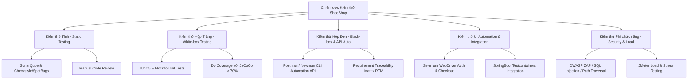
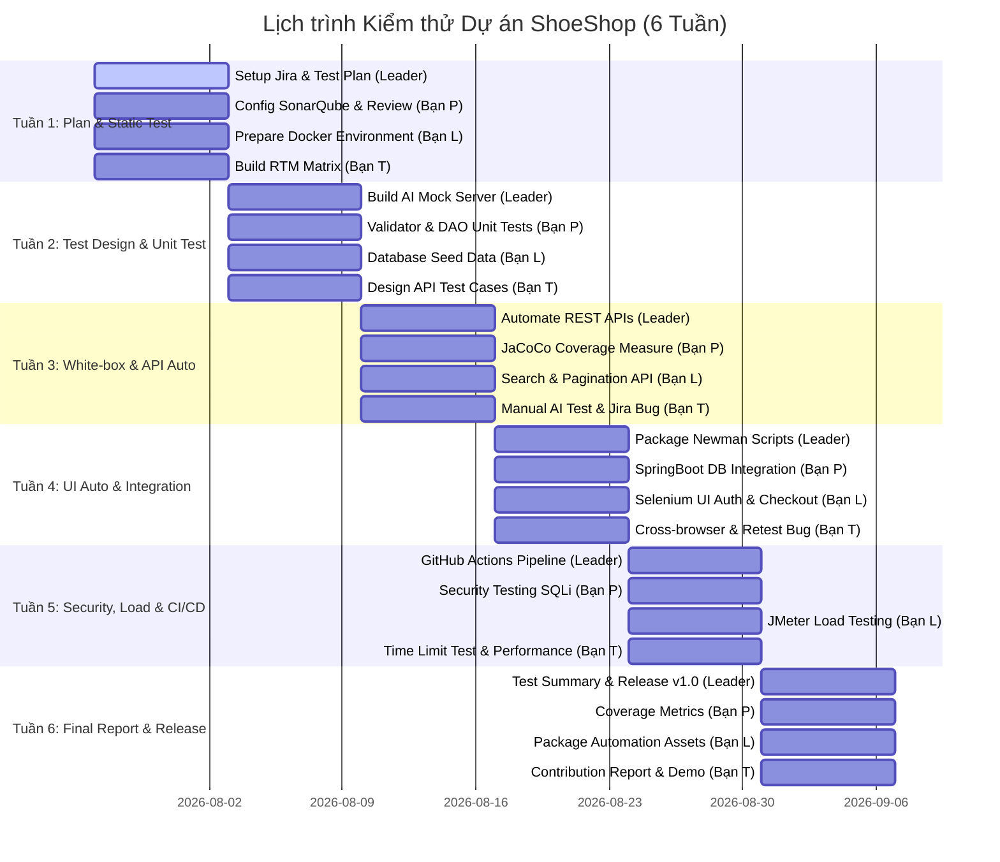

# 🧪 TÀI LIỆU KẾ HOẠCH KIỂM THỬ (TEST PLAN DOCUMENT)
## Dự án: ShoeShop Testing & Quality Assurance System
**Mã tài liệu:** `TP-SHOESHOP-v1.0`  
**Phiên bản:** `1.0-FINAL`  
**Người lập (Leader):** Trương Hoài Dược  
**Ngày tạo:** 02/08/2026  
**Dự án Jira:** `ShoeShop Testing & Development` (`TEST`)  
**Repository:** `https://github.com/truongduoc1512/Testing.git`  

---

## 📌 1. TỔNG QUAN VỀ DỰ ÁN (PROJECT OVERVIEW)

### 1.1. Giới thiệu hệ thống
**ShoeShop** là nền tảng thương mại điện tử giày dép đa chức năng xây dựng trên kiến trúc lai (Hybrid Architecture):
* **Backend Core:** Java 17 / Spring Boot 2.7 (Spring Security, Spring Data JPA, Thymeleaf).
* **AI Microservice:** Python FastAPI + YOLOv8 (`/api/v1/analyze`) phục vụ kiểm duyệt chất lượng ảnh sản phẩm trước khi lưu CSDL.
* **REST API Layer:** Bộ RESTful API song song (`/api/v1/*`) bọc dữ liệu chuẩn `ResponseEntity<?>` dành riêng cho kiểm thử tự động (QA Testing) và tích hợp ứng dụng di động.
* **Database & Migration:** MySQL 8.0 kết hợp Flyway DB Migration.

### 1.2. Mục tiêu kiểm thử
* Đảm bảo tính đúng đắn của toàn bộ các phân hệ nghiệp vụ: Xác thực & Phân quyền (`ROLE_ADMIN` vs `ROLE_USER`), Sổ địa chỉ giao hàng, Cổng AI kiểm duyệt ảnh, Giỏ hàng & Đơn hàng, Lọc/Tìm kiếm sản phẩm.
* Đạt chỉ số bao phủ mã nguồn (Code Coverage với JaCoCo) **> 70%**.
* Tự động hóa 100% kịch bản kiểm thử REST API bằng Postman/Newman và tích hợp vào GitHub Actions CI/CD Pipeline.
* Tự động hóa kiểm thử giao diện (UI Automation) các luồng quan trọng bằng Selenium WebDriver.
* Đảm bảo an toàn bảo mật (Security Testing) và hiệu năng chịu tải (Load Testing với JMeter).

---

## 🎯 2. PHẠM VI KIỂM THỬ (TEST SCOPE)

### 2.1. In-Scope (Các phân hệ & tính năng trong phạm vi kiểm thử)

| STT | Phân hệ (Module) | Chi tiết chức năng kiểm thử | Kỹ thuật kiểm thử áp dụng |
| :--- | :--- | :--- | :--- |
| **1** | **Xác thực & Phân quyền** | Đăng nhập Local (BCrypt hash), Google OAuth2, Phân quyền `ROLE_ADMIN` vs `ROLE_USER`, Dashboard phân biệt theo Role (`/admin/accountInfo`). | Unit Test, API Test, Selenium UI, Security Test. |
| **2** | **Sổ Địa Chỉ Giao Hàng** | CRUD địa chỉ nhận hàng cá nhân qua `/api/v1/users/addresses`, thiết lập Địa chỉ Mặc định, Modal/Dropdown chọn địa chỉ khi Checkout. | Unit Test, API Test, Selenium UI, Integration Test. |
| **3** | **Sản phẩm & Cổng AI Gate** | CRUD sản phẩm, Bộ lọc & Tìm kiếm phân trang (`/productList`), Cổng kiểm duyệt ảnh YOLOv8 (`/api/v1/analyze`), Quản lý tồn kho Real-time. | Unit Test, API Test, Manual Test, Load Test. |
| **4** | **Giỏ hàng & Đơn hàng** | Session Cart, AJAX Update, Chốt đơn trừ tồn kho, Hủy đơn `PENDING`, Yêu cầu trả hàng & Admin duyệt. | Unit Test, API Test, Selenium UI, Integration Test. |
| **5** | **Khuyến mãi & Đánh giá** | Áp dụng Voucher/Mã giảm giá, Wishlist sản phẩm yêu thích, Review 5 sao & Giới hạn thời gian sửa review (5 phút). | Unit Test, API Test, Manual Test. |
| **6** | **Tự động hóa CI/CD** | GitHub Actions Pipeline tự động chạy `mvn test` và Newman API collection khi push code. | CI/CD Integration Test. |

### 2.2. Out-of-Scope (Các tính năng ngoài phạm vi kiểm thử)
* Giao dịch qua cổng thanh toán ngân hàng thật (VNPay/ZaloPay live gateway) ➔ *Sử dụng Mock Payment State*.
* Dịch vụ gửi Email qua máy chủ SMTP thực tế ➔ *Sử dụng Mail Server Stub/Mock*.
* Kiểm thử tương thích trên môi trường hệ điều hành di động gốc (iOS/Android Native App) ➔ *Chỉ tập trung Web Browser & REST API*.

---

## 🛠️ 3. CHIẾN LƯỢC KIỂM THỬ (TEST STRATEGY & METHODOLOGY)

### 3.1. Kiểm thử Tĩnh (Static Testing)
* Cấu hình **SonarQube**, **Checkstyle**, **SpotBugs** cho dự án Java Spring Boot và **Flake8** cho Python AI Service.
* Tiến hành Code Review thủ công giữa các thành viên trước khi merge PR vào nhánh `develop`.

### 3.2. Kiểm thử Hộp Trắng (White-box Testing)
* Viết Unit Test cho các Custom Validator (`EmailValidator`, `ProductValidator`) và các lớp DAO/Repository (`AccountDAO`, `OrderDAO`, `ProductDAO`) sử dụng JUnit 5 + Mockito + `@DataJpaTest`.
* Sử dụng **JaCoCo Maven Plugin** để tự động đo tỷ lệ bao phủ mã nguồn. Mục tiêu tối thiểu: **Branch Coverage > 65%**, **Line Coverage > 70%**.

### 3.3. Kiểm thử Tự động hóa API (API Automation Testing)
* Xây dựng bộ Postman Collection bao phủ 100% các REST API `/api/v1/*`.
* Đóng gói và chạy tự động bằng **Newman CLI**, xuất báo cáo định dạng HTML/JSON.

### 3.4. Kiểm thử Tự động hóa Giao diện (UI Automation Testing)
* Xây dựng kịch bản kiểm thử tự động với **Selenium WebDriver** (Java/Python) cho 2 luồng giao diện Thymeleaf quan trọng nhất:
  1. Luồng Xác thực (Đăng nhập Local, Đăng nhập Google OAuth2, Phân quyền Dashboard).
  2. Luồng Thanh toán (Chọn Sổ địa chỉ giao hàng, Modal thêm địa chỉ nhanh, Chốt đơn).

### 3.5. Kiểm thử Bảo mật & Hiệu năng (Security & Performance Testing)
* **Bảo mật:** Kiểm thử thủ công và tự động các kịch bản SQL Injection tại các tham số tìm kiếm/bộ lọc, Path Traversal tại cổng upload ảnh AI, và IDOR tại API Sổ địa chỉ.
* **Hiệu năng:** Sử dụng **Apache JMeter** giả lập 100 - 500 người dùng đồng thời (Concurrent Users) thực hiện thao tác Xem sản phẩm, Đặt hàng và Upload ảnh AI để đo chỉ số Response Time, Throughput (TPS) và Error Rate.

---

## 💻 4. MÔ TRƯỜNG & CÔNG CỤ KIỂM THỬ (TEST ENVIRONMENT & TOOLS)

### 4.1. Cấu hình Môi trường Test (Dockerized Test Environment)
Dự án được đóng gói và vận hành thử nghiệm trên môi trường Docker bằng [docker-compose.yml](file:///i:/Subjects/CloudComputing/project/shoeshop-testing/docker-compose.yml):
* **Spring Boot App Container:** Java 17, Port `8080`.
* **MySQL Database Container:** MySQL 8.0, Port `3306`, tích hợp Flyway Migration tự động nạp dữ liệu Seed (`import-test.sql`).
* **AI Service Container:** Python 3.10 + FastAPI + YOLOv8, Port `8000`.

### 4.2. Danh mục Công cụ (Tools Sheet)

| Hạng mục | Công cụ sử dụng | Mục đích |
| :--- | :--- | :--- |
| **Quản lý Dự án & Bug** | Jira Software Cloud | Quản lý Sprint, Backlog, Task và Bug Lifecycle |
| **Quản lý Mã nguồn** | Git & GitHub | Quản lý version control, phân nhánh và Pull Requests |
| **Static Analysis** | SonarQube / Checkstyle / SpotBugs | Phân tích mã nguồn tĩnh, phát hiện Code Smells & Bugs |
| **Unit & Integration Test**| JUnit 5, Mockito, SpringBootTest | Kiểm thử đơn vị và kiểm thử tích hợp backend |
| **Code Coverage** | JaCoCo Maven Plugin | Đo độ bao phủ mã nguồn Java |
| **API Automation** | Postman, Newman CLI | Kiểm thử tự động hóa lớp REST API `/api/v1/*` |
| **UI Automation** | Selenium WebDriver (Java/Python) | Kiểm thử tự động hóa giao diện Web Thymeleaf |
| **Load & Stress Test** | Apache JMeter | Kiểm thử hiệu năng và khả năng chịu tải |
| **CI/CD Pipeline** | GitHub Actions | Tự động hóa xây dựng và chạy test suite |

---

## 📅 5. LỊCH TRÌNH VÀ PHÂN CÔNG THÀNH VIÊN (6-WEEK SCHEDULE)

### 👥 Phân công Vai trò (Team Roles)
* **Leader (Trương Hoài Dược):** Quản lý dự án Jira, Lập Test Plan, Dựng AI Mock Server, Automate API User/Product/Cart/Order, Build GitHub Actions CI/CD, Tổng hợp Báo cáo Release.
* **Bạn P:** Kiểm thử tĩnh (SonarQube/Checkstyle), Develop Validator & DAO Unit Tests, Đo Coverage JaCoCo, Kiểm thử Bảo mật (SQLi/Security), Trích xuất Coverage Metrics.
* **Bạn L:** Chuẩn bị Docker Test Env, Seed Data Flyway, Test Search & Pagination API, Code Selenium UI Auth & Checkout, Chạy Load Test JMeter, Đóng gói Assets.
* **Bạn T:** Xây dựng Requirement Traceability Matrix (RTM), Design Auth & Cart/Order Test Cases, Manual AI Upload Testing, Quản lý Bug trên Jira, Cross-browser Testing, Bảng điểm đóng góp & Slide presentation.

### 📆 Lịch trình Chi tiết 6 Tuần

---

## 🚦 6. TIÊU CHÍ DỪNG VÀ HOÀN THÀNH KIỂM THỬ (PASS/FAIL & EXIT CRITERIA)

### 6.1. Tiêu chí Bắt đầu (Entry Criteria)
* Mã nguồn Spring Boot và AI Service được đóng gói thành công, không có lỗi biên dịch.
* Môi trường Docker container (App + MySQL + AI) khởi chạy ổn định.
* Tài liệu SRS và tài liệu Kế hoạch kiểm thử (Test Plan) đã được phê duyệt.

### 6.2. Tiêu chí Hoàn thành (Exit Criteria)
* **API Test Pass Rate:** 100% kịch bản kiểm thử API trong Newman Collection chạy thành công.
* **Code Coverage (JaCoCo):** Line Coverage của mã nguồn Java đạt tối thiểu **> 70%**.
* **Bug Resolution Rate:**
  * 100% các lỗi ở mức độ **Blocker** và **Critical** phải được Dev khắc phục và Retest thành công.
  * Tối thiểu 90% lỗi ở mức độ **Major/High** được giải quyết.
* **Performance:** Thời gian phản hồi trung bình (Average Response Time) của các API chính dưới **2.0 giây** khi chạy test tải 100 concurrent users.
* **CI/CD:** Pipeline trên GitHub Actions thực thi xanh (Pass) 100%.

---

## ⚠️ 7. QUẢN LÝ RỦI RO (RISK MANAGEMENT)

| STT | Rủi ro tiềm ẩn (Identified Risk) | Mức độ | Giải pháp phòng ngừa & Khắc phục (Mitigation Plan) |
| :--- | :--- | :--- | :--- |
| **1** | Microservice Python AI (YOLOv8) phản hồi chậm hoặc tốn tài nguyên GPU khi chạy tự động. | **High** | Leader xây dựng AI Mock Server ở Tuần 2 để các kịch bản Unit/API Test chạy độc lập, nhanh chóng. |
| **2** | Tranh chấp và sai lệch dữ liệu test khi nhiều thành viên cùng chạy Selenium/API test trên DB. | **Medium** | Bạn L chuẩn bị script SQL Seed Data chuẩn và cơ chế Reset DB tự động bằng Flyway/Docker trước mỗi đợt test. |
| **3** | Xung đột mã nguồn (Merge Conflict) khi 4 thành viên cùng push code. | **Medium** | Tuân thủ nghiêm ngặt Quy ước đặt tên nhánh (`<type>/w<week>-<JIRA>-<desc>`) và quy trình Pull Request bắt buộc Review. |
| **4** | Lỗi thay đổi giao diện làm hỏng kịch bản Selenium (Flaky UI Tests). | **Low** | Sử dụng chiến lược Page Object Model (POM) và XPath/ID cố định cho các element giao diện. |

---

## 📦 8. SẢN PHẨM BÀN GIAO (DELIVERABLES)

Khi kết thúc 6 tuần kiểm thử, nhóm sẽ bàn giao toàn bộ các tài sản sau:
1. **Tài liệu Kế hoạch & Ma trận:** `Test_Plan.md`, `Requirement_Traceability_Matrix.xlsx`.
2. **Mã nguồn Kiểm thử Tự động:**
   * Thư mục Unit Tests (`src/test/java/`).
   * Bộ kịch bản Newman/Postman Collection (`test-automation/postman/`).
   * Code Selenium UI Automation (`test-automation/selenium/`).
   * File kịch bản test tải JMeter (`test-automation/jmeter/*.jmx`).
3. **Báo cáo Kết quả (Test Reports):**
   * Báo cáo bao phủ code JaCoCo HTML Report.
   * Báo cáo kịch bản API Newman HTML Report.
   * Báo cáo hiệu năng JMeter Dashboard Report.
   * Báo cáo tổng kết chất lượng (Test Summary Report) & Release Tag `v1.0-final-test`.
4. **Slide thuyết trình & Video Demo.**
