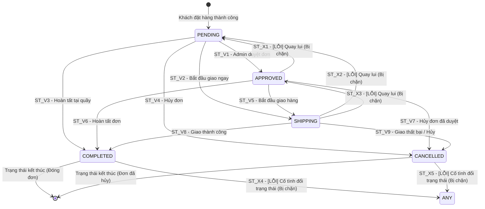

# THIẾT KẾ TEST CASE HỘP ĐEN: QUẢN LÝ & CẬP NHẬT ĐƠN HÀNG (ADMIN ORDER MANAGEMENT)

> **Chức năng:** Quản lý danh sách, Xem chi tiết & Cập nhật trạng thái đơn hàng dành cho Quản trị viên (`ROLE_ADMIN`).

---

## 1. Xác Định Biến Đầu Vào & Ràng Buộc Nghiệp Vụ (Input Variables)

| Tên Biến | Ý Nghĩa | Kiểu | Ràng Buộc & Miền Giá Trị Hợp Lệ |
| :--- | :--- | :---: | :--- |
| **`currentUserRole`** | Quyền đăng nhập | `Role` | Bắt buộc `ROLE_ADMIN` (`ROLE_USER` / Guest bị từ chối) |
| **`orderId`** | Mã định danh đơn hàng | `UUID` | Chuỗi 36 ký tự, tồn tại trong CSDL và thuộc quyền Admin (`canManageOrder`) |
| **`status`** | Trạng thái cập nhật mới | `Enum` | `PENDING`, `APPROVED`, `SHIPPING`, `COMPLETED`, `CANCELLED` |
| **`currentStatus`** | Trạng thái hiện tại | `Enum` | Trạng thái trước cập nhật, quyết định quy tắc vòng đời (`canTransition`) |
| **`page`** | Số trang danh sách | `int` | $page \in [1, totalPages]$ (mặc định / fallback $= 1$ khi $\le 0$ hoặc phi số) |

---

## 2. Bảng Phân Hoạch Tương Đương (Equivalence Partitioning - EP)

| STT | Biến / Điều kiện | Lớp hợp lệ (Valid) | Tag | Lớp không hợp lệ (Invalid) | Tag |
| :-: | :--- | :--- | :---: | :--- | :---: |
| **1** | **Quyền truy cập (`currentUserRole`)** | Tài khoản Quản trị viên (`ROLE_ADMIN`) | **V1** | • Khách vãng lai chưa đăng nhập (`Guest`) • Tài khoản người dùng thường (`ROLE_USER`) | **X1** **X2** |
| **2** | **Mã đơn hàng mục tiêu (`orderId`)** | UUID 36 ký tự tồn tại trong CSDL và thuộc quyền quản lý | **V2** | • Để trống hoặc rỗng (`null` / `""`) • Không tồn tại trong CSDL • Không thuộc quyền quản lý của Admin | **X3** **X4** **X5** |
| **3** | **Trạng thái cập nhật (`status`)** | Trạng thái Admin: `PENDING`, `APPROVED`, `SHIPPING`, `COMPLETED`, `CANCELLED` | **V3** | • Trạng thái của Customer: `RETURN_PENDING`, `RETURNED` • Trạng thái rác sai chuẩn (`INVALID_XYZ`) • Để trống hoặc rỗng (`null` / `""`) | **X6** **X7** **X8** |
| **4** | **Số trang danh sách (`page`)** | Số nguyên trong đoạn $[1, totalPages]$ | **V4** | • Số nguyên $\le 0$ ($page = 0, -1$) • Vượt quá tổng số trang ($page > totalPages$) • Chuỗi ký tự phi số (`"abc"`) | **X9** **X10** **X11** |

---

## 3. Bảng Phân Tích Giá Trị Biên (Boundary Value Analysis - BVA)

### 3.1 Bảng 5 mốc giá trị biên chuẩn cho biến có dải giá trị (`page`)

*(Giả định hệ thống có tổng số $totalPages = 5$ trang).*

| Biến Kiểm Thử | Cận dưới ($min$) | Kề dưới ($min^+$) | Danh định ($nom$) | Kề trên ($max^-$) | Cận trên ($max$) | Quy tắc & Giới hạn |
| :--- | :---: | :---: | :---: | :---: | :---: | :--- |
| **Số trang `page`** ($1 \le page \le 5$) | `1` | `2` | `3` | `4` | `5` | $min = 1$ (trang đầu), $nom = 3$ (trang giữa), $max = 5$ (trang cuối) |

---

### 3.2 Phân tích biên cho biến định danh độ dài cố định (`orderId` - UUID 36 ký tự)

| Tiêu chí độ dài | Mốc kiểm thử | Giá trị đại diện | Phân loại | Kết quả mong đợi |
| :--- | :---: | :--- | :---: | :--- |
| **Dưới độ dài chuẩn ($min^-$)** | `35` ký tự | `c5dc163f-5456-4f98-9578-aa7c2287efa` | Không hợp lệ | Không tìm thấy đơn hàng, redirect `/admin/orderList` |
| **Độ dài chuẩn ($min = nom = max$)** | **`36` ký tự** | `c5dc163f-5456-4f98-9578-aa7c2287efa4` | **Hợp lệ** | Hiển thị chi tiết đơn hàng (HTTP 200 OK) |
| **Vượt độ dài chuẩn ($max^+$)** | `37` ký tự | `c5dc163f-5456-4f98-9578-aa7c2287efa4X` | Không hợp lệ | Không tìm thấy đơn hàng, redirect `/admin/orderList` |

---

### 3.3 Bảng Boundary Value Analysis Test Cases cho biến `page`

| Case | Số trang (`page`) | Mốc kiểm thử | Dữ liệu đầu vào | Kết quả mong đợi (Expected Output) | Tag Biên |
| :-: | :---: | :---: | :--- | :--- | :-: |
| **1** | `3` | $nom$ (Danh định) | `page = 3` | **Hợp lệ:** Hiển thị danh sách đơn trang 3 (HTTP 200 OK) | **B1** |
| **2** | `1` | $min$ (Cận dưới) | `page = 1` | **Hợp lệ:** Hiển thị danh sách đơn trang đầu (HTTP 200 OK) | **B2** |
| **3** | `2` | $min^+$ (Kề dưới) | `page = 2` | **Hợp lệ:** Hiển thị danh sách đơn trang 2 (HTTP 200 OK) | **B3** |
| **4** | `4` | $max^-$ (Kề trên) | `page = 4` | **Hợp lệ:** Hiển thị danh sách đơn trang 4 (HTTP 200 OK) | **B4** |
| **5** | `5` | $max$ (Cận trên) | `page = 5` | **Hợp lệ:** Hiển thị danh sách đơn trang cuối (HTTP 200 OK) | **B5** |
| **6** | `0` | $min^-$ (Ngoại biên dưới) | `page = 0` | **Fallback:** Tự động chuyển hướng an toàn về trang 1 | **B6** |
| **7** | `-1` | $min^{--}$ (Ngoại biên âm) | `page = -1` | **Fallback:** Tự động chuyển hướng an toàn về trang 1 | **B7** |
| **8** | `6` | $max^+$ (Ngoại biên trên) | `page = 6` | **Hợp lệ:** Trả về trang rỗng (không có đơn hàng) | **B8** |

---

## 4. Bảng Quyết Định (Decision Table Testing - DT)

### 4.1 Xác định Điều kiện & Hành động

**Điều kiện đầu vào:**
• **C1 — Quyền Admin:** Tài khoản có quyền `ROLE_ADMIN`?  
• **C2 — Quyền quản lý đơn:** Mã đơn tồn tại trong CSDL và Admin có quyền quản lý (`canManageOrder`)?  
• **C3 — Trạng thái Admin:** Trạng thái đích thuộc danh mục cho phép của Admin (`isAdminStatus`)?  
• **C4 — Quy tắc vòng đời:** Chuyển đổi trạng thái hợp lệ theo máy trạng thái (`canTransition`)?

**Hành động hệ thống:**
• **A1 — Cập nhật thành công:** Lưu trạng thái mới vào CSDL, flash: *"Cập nhật trạng thái đơn hàng thành công!"*, redirect `/admin/order`.  
• **A2 — Chặn truy cập:** Redirect `/403` (Từ chối truy cập).  
• **A3 — Báo lỗi trạng thái:** Flash: *"Trạng thái đơn hàng không hợp lệ!"*, redirect `/admin/order`.  
• **A4 — Báo lỗi vòng đời:** Flash: *"Không thể chuyển trạng thái đơn hàng từ {currentStatus} sang {status}."*, redirect `/admin/order`.

---

### 4.2 Bảng Quyết Định (Decision Table: 6 Rules)

| | Điều kiện / Hành động | R1 | R2 | R3 | R4 | R5 | R6 |
| :---: | :--- | :---: | :---: | :---: | :---: | :---: | :---: |
| **C1** | `currentUserRole == ROLE_ADMIN`? | **T** | **F** | **T** | **T** | **T** | **T** |
| **C2** | `canManageOrder(orderId)` = TRUE? | **T** | - | **F** | **T** | **T** | **T** |
| **C3** | `isAdminStatus(status)` = TRUE? | **T** | - | - | **F** | **T** | **T** |
| **C4** | `canTransition(currentStatus, status)` = TRUE? | **T** | - | - | - | **F (Quay lui)** | **F (Đã đóng)** |
| **A1** | Cập nhật thành công (Flash `message`, redirect `/admin/order`) | **X** | - | - | - | - | - |
| **A2** | Chặn truy cập (Redirect `/403`) | - | **X** | **X** | - | - | - |
| **A3** | Báo lỗi: *"Trạng thái đơn hàng không hợp lệ!"* (Flash `errorMessage`) | - | - | - | **X** | - | - |
| **A4** | Báo lỗi vi phạm vòng đời chuyển đổi (Flash `errorMessage`) | - | - | - | - | **X** | **X** |
| **Tag** | **Tag định danh kiểm thử** | **D1** | **D2** | **D3** | **D4** | **D5** | **D6** |

*Ý nghĩa quy tắc:*
• **R1 (Thành công chuẩn):** Đủ quyền, đơn thuộc quyền quản lý, trạng thái và vòng đời hợp lệ $\rightarrow$ Cập nhật thành công.  
• **R2 (Chặn phi Admin):** Không có `ROLE_ADMIN` $\rightarrow$ Chặn truy cập (`/403`).  
• **R3 (Không thuộc quyền / Không tồn tại):** Đơn không tồn tại hoặc không do Admin quản lý $\rightarrow$ Chặn truy cập (`/403`).  
• **R4 (Trạng thái sai chuẩn):** Trạng thái ngoài danh mục Admin (`INVALID_XYZ`, `RETURNED`) $\rightarrow$ Báo lỗi trạng thái.  
• **R5 (Chặn quay lui):** Cố ý lùi trạng thái về trước $\rightarrow$ Báo lỗi quy tắc vòng đời.  
• **R6 (Chặn sửa đơn đã đóng):** Đơn đã `COMPLETED` hoặc `CANCELLED` $\rightarrow$ Chặn mọi thay đổi trạng thái.

---

## 5. Kỹ Thuật Kiểm Thử Chuyển Đổi Trạng Thái (State Transition Testing - STT)

### 5.1 Sơ đồ chuyển đổi trạng thái đơn hàng

---

### 5.2 Ma trận chuyển đổi trạng thái (State Transition Matrix: 5x5)

| Trạng thái hiện tại \ Trạng thái đích | PENDING | APPROVED | SHIPPING | COMPLETED | CANCELLED |
| :--- | :---: | :---: | :---: | :---: | :---: |
| **1. PENDING (Chờ xử lý)** | `V (Same)` | **`V`** | **`V`** | **`V`** | **`V`** |
| **2. APPROVED (Đã duyệt)** | **`X (Chặn quay lui)`** | `V (Same)` | **`V`** | **`V`** | **`V`** |
| **3. SHIPPING (Đang giao)** | **`X (Chặn quay lui)`** | **`X (Chặn quay lui)`** | `V (Same)` | **`V`** | **`V`** |
| **4. COMPLETED (Hoàn tất)** | **`X (Đã đóng)`** | **`X (Đã đóng)`** | **`X (Đã đóng)`** | `V (Same)` | **`X (Đã đóng)`** |
| **5. CANCELLED (Đã hủy)** | **`X (Đã đóng)`** | **`X (Đã đóng)`** | **`X (Đã đóng)`** | **`X (Đã đóng)`** | `V (Same)` |

---

### 5.3 Bảng phân tích chi tiết các Ca chuyển đổi trạng thái (State Transition Details)

| Mã Transition | Trạng thái hiện tại (`currentStatus`) | Trạng thái yêu cầu (`status`) | Phân loại | Kết quả xử lý & Thông báo từ hệ thống | Tag |
| :---: | :--- | :--- | :---: | :--- | :---: |
| **ST_01** | `PENDING` | `APPROVED` | Hợp lệ | **Thành công:** Lưu trạng thái `APPROVED`, flash: *"Cập nhật trạng thái đơn hàng thành công!"* | **ST_V1** |
| **ST_02** | `PENDING` | `SHIPPING` | Hợp lệ | **Thành công:** Lưu trạng thái `SHIPPING`, flash: *"Cập nhật trạng thái đơn hàng thành công!"* | **ST_V2** |
| **ST_03** | `PENDING` | `COMPLETED` | Hợp lệ | **Thành công:** Lưu trạng thái `COMPLETED`, flash: *"Cập nhật trạng thái đơn hàng thành công!"* | **ST_V3** |
| **ST_04** | `PENDING` | `CANCELLED` | Hợp lệ | **Thành công:** Lưu trạng thái `CANCELLED`, flash: *"Cập nhật trạng thái đơn hàng thành công!"* | **ST_V4** |
| **ST_05** | `APPROVED` | `SHIPPING` | Hợp lệ | **Thành công:** Lưu trạng thái `SHIPPING`, flash: *"Cập nhật trạng thái đơn hàng thành công!"* | **ST_V5** |
| **ST_06** | `APPROVED` | `COMPLETED` | Hợp lệ | **Thành công:** Lưu trạng thái `COMPLETED`, flash: *"Cập nhật trạng thái đơn hàng thành công!"* | **ST_V6** |
| **ST_07** | `APPROVED` | `CANCELLED` | Hợp lệ | **Thành công:** Lưu trạng thái `CANCELLED`, flash: *"Cập nhật trạng thái đơn hàng thành công!"* | **ST_V7** |
| **ST_08** | `APPROVED` | `PENDING` | Không hợp lệ | **Lỗi:** Flash: *"Không thể chuyển trạng thái đơn hàng từ APPROVED sang PENDING."* | **ST_X1** |
| **ST_09** | `SHIPPING` | `COMPLETED` | Hợp lệ | **Thành công:** Lưu trạng thái `COMPLETED`, flash: *"Cập nhật trạng thái đơn hàng thành công!"* | **ST_V8** |
| **ST_10** | `SHIPPING` | `CANCELLED` | Hợp lệ | **Thành công:** Lưu trạng thái `CANCELLED`, flash: *"Cập nhật trạng thái đơn hàng thành công!"* | **ST_V9** |
| **ST_11** | `SHIPPING` | `PENDING` | Không hợp lệ | **Lỗi:** Flash: *"Không thể chuyển trạng thái đơn hàng từ SHIPPING sang PENDING."* | **ST_X2** |
| **ST_12** | `SHIPPING` | `APPROVED` | Không hợp lệ | **Lỗi:** Flash: *"Không thể chuyển trạng thái đơn hàng từ SHIPPING sang APPROVED."* | **ST_X3** |
| **ST_13** | `COMPLETED` | `SHIPPING` *(hoặc bất kỳ)* | Không hợp lệ | **Lỗi:** Flash: *"Không thể chuyển trạng thái đơn hàng từ COMPLETED sang SHIPPING."* | **ST_X4** |
| **ST_14** | `CANCELLED` | `PENDING` *(hoặc bất kỳ)* | Không hợp lệ | **Lỗi:** Flash: *"Không thể chuyển trạng thái đơn hàng từ CANCELLED sang PENDING."* | **ST_X5** |
| **ST_15** | `APPROVED` | `APPROVED` *(giữ nguyên)* | Hợp lệ | **Thành công:** Giữ nguyên trạng thái, flash: *"Cập nhật trạng thái đơn hàng thành công!"* | **ST_V10** |

---

## 6. Thiết Kế Bảng Test Cases Chi Tiết Triển Khai (Tối Ưu & Đầy Đủ Bao Phủ)

| STT | Mã Test Case | Tên ca kiểm thử | Dữ liệu kiểm thử (Test Input Data) | Kết quả mong đợi (Expected Output) | Tag được bao phủ |
| :-: | :--- | :--- | :--- | :--- | :---: |
| **1** | **TC_ORD_01** | Xem danh sách đơn hàng tại trang đầu tiên ($page = 1$) | • `currentUserRole`: `ROLE_ADMIN` • `page`: `1` (Cận dưới: $min$) | **Hợp lệ:** Trả về view `orderList`, hiển thị 5 đơn hàng đầu tiên tại trang 1 (HTTP 200 OK). | **V1, V4, B2** |
| **2** | **TC_ORD_02** | Xem danh sách đơn hàng tại trang kế tiếp ($page = 2$) | • `currentUserRole`: `ROLE_ADMIN` • `page`: `2` (Kề dưới: $min^+$) | **Hợp lệ:** Trả về view `orderList`, hiển thị danh sách đơn hàng trang 2 (HTTP 200 OK). | **V4, B3** |
| **3** | **TC_ORD_03** | Xem danh sách đơn hàng tại trang danh định giữa ($page = 3$) | • `currentUserRole`: `ROLE_ADMIN` • `page`: `3` (Danh định: $nom$) | **Hợp lệ:** Trả về view `orderList`, hiển thị danh sách đơn hàng tại trang 3 (HTTP 200 OK). | **V4, B1** |
| **4** | **TC_ORD_04** | Xem danh sách đơn hàng tại trang áp chót ($page = 4$) | • `currentUserRole`: `ROLE_ADMIN` • `page`: `4` (Kề trên: $max^-$) | **Hợp lệ:** Trả về view `orderList`, hiển thị danh sách đơn hàng tại trang 4 (HTTP 200 OK). | **V4, B4** |
| **5** | **TC_ORD_05** | Xem danh sách đơn hàng tại trang cuối cùng ($page = 5$) | • `currentUserRole`: `ROLE_ADMIN` • `page`: `5` (Cận trên: $max$) | **Hợp lệ:** Trả về view `orderList`, hiển thị danh sách đơn hàng tại trang cuối 5 (HTTP 200 OK). | **V4, B5** |
| **6** | **TC_ORD_06** | Phân trang với số trang ngoại biên âm và bằng 0 ($page = 0, -1$) | • `currentUserRole`: `ROLE_ADMIN` • `page`: `0` hoặc `-1` ($min^-, min^{--}$) | **Fallback:** Tự động chuyển hướng an toàn về `page = 1`, hiển thị danh sách trang đầu (HTTP 200 OK). | **X9, B6, B7** |
| **7** | **TC_ORD_07** | Phân trang vượt quá tổng số trang ($page = 6 > totalPages$) | • `currentUserRole`: `ROLE_ADMIN` • `page`: `6` ($max^+$) | **Hợp lệ:** Trả về view `orderList` với danh sách rỗng, không gây lỗi hệ thống (HTTP 200 OK). | **X10, B8** |
| **8** | **TC_ORD_08** | Phân trang với định dạng chuỗi không phải số (`page = "abc"`) | • `currentUserRole`: `ROLE_ADMIN` • `page`: `"abc"` (Phi số) | **Fallback:** Bắt `NumberFormatException`, tự động chuyển về `page = 1` trang đầu (HTTP 200 OK). | **X11** |
| **9** | **TC_ORD_09** | Khách vãng lai chưa đăng nhập truy cập danh sách đơn hàng | • `currentUserRole`: `Guest` (Chưa đăng nhập) • `page`: `1` | **Bị chặn:** Spring Security chặn truy cập người dùng chưa xác thực, chuyển hướng về `/login`. | **X1** |
| **10** | **TC_ORD_10** | Khách hàng thường xem danh sách đơn hàng (Kiểm tra cô lập dữ liệu) | • `currentUserRole`: `ROLE_USER` • `page`: `1` | **Cô lập dữ liệu:** Trả về view `orderList` chỉ hiển thị các đơn do tài khoản đặt, không thấy đơn người khác. | **X2** |
| **11** | **TC_ORD_11** | Xem chi tiết đơn hàng hợp lệ thuộc quyền Admin | • `currentUserRole`: `ROLE_ADMIN` • `orderId`: `"c5dc163f-5456-4f98-9578-aa7c2287efa4"` (UUID 36 ký tự) | **Hợp lệ:** Trả về view `order`, hiển thị đầy đủ thông tin khách hàng, tổng tiền và sản phẩm (HTTP 200 OK). | **V1, V2** |
| **12** | **TC_ORD_12** | Tra cứu chi tiết đơn hàng với mã đơn để trống hoặc null | • `currentUserRole`: `ROLE_ADMIN` • `orderId`: `""` (Rỗng hoặc `null`) | **Lỗi:** Hệ thống kiểm tra tham số rỗng, chuyển hướng an toàn về `/admin/orderList`. | **X3** |
| **13** | **TC_ORD_13** | Tra cứu chi tiết đơn hàng với mã đơn không tồn tại hoặc sai độ dài (35/37 ký tự) | • `currentUserRole`: `ROLE_ADMIN` • `orderId`: `"non-existent-uuid-404-000000000000"` (hoặc 35, 37 ký tự) | **Lỗi:** Không tìm thấy đơn hàng trong CSDL, chuyển hướng an toàn về `/admin/orderList`. | **X4** |
| **14** | **TC_ORD_14** | Tài khoản Non-Admin gửi request cập nhật trạng thái đơn hàng (Rule D2) | • `currentUserRole`: `ROLE_USER` (Khách hàng) • `orderId`: `"b5ba86bd-144d-4a85-9563-3c373b216efe"` • `status`: `"APPROVED"` | **Bị chặn:** Chặn tài khoản không có quyền `ROLE_ADMIN`, chuyển hướng từ chối truy cập về `/403`. | **X2, D2** |
| **15** | **TC_ORD_15** | Admin cập nhật đơn hàng không tồn tại hoặc không thuộc quyền quản lý (Rule D3) | • `currentUserRole`: `ROLE_ADMIN` • `orderId`: `"non-existent-uuid-404-000000000000"` (hoặc không thuộc quyền) • `status`: `"APPROVED"` | **Bị chặn:** `canManageOrder` trả về false, từ chối thao tác và chuyển hướng về `/403`. | **X4, X5, D3** |
| **16** | **TC_ORD_16** | Admin gửi trạng thái rác hoặc chuỗi không xác định (Rule D4) | • `currentUserRole`: `ROLE_ADMIN` • `orderId`: `"c5dc163f-5456-4f98-9578-aa7c2287efa4"` • `status`: `"INVALID_STATUS_XYZ"` | **Lỗi:** Không phải trạng thái Admin, redirect `/admin/order`, flash: *"Trạng thái đơn hàng không hợp lệ!"*. | **X7, D4** |
| **17** | **TC_ORD_17** | Admin gửi trạng thái thuộc Customer (`RETURNED`) hoặc rỗng (Rule D4) | • `currentUserRole`: `ROLE_ADMIN` • `orderId`: `"c5dc163f-5456-4f98-9578-aa7c2287efa4"` • `status`: `"RETURNED"` hoặc `""` | **Lỗi:** Trạng thái không hợp lệ, redirect `/admin/order`, flash: *"Trạng thái đơn hàng không hợp lệ!"*. | **X6, X8, D4** |
| **18** | **TC_ORD_18** | Vòng đời đơn hàng: Chuyển từ PENDING sang APPROVED (Rule D1 & ST_01) | • `currentUserRole`: `ROLE_ADMIN` • `orderId`: Mã đơn có `currentStatus` = `PENDING` • `status`: `"APPROVED"` | **Hợp lệ:** Lưu trạng thái `APPROVED`, redirect `/admin/order`, flash: *"Cập nhật trạng thái đơn hàng thành công!"*. | **V1, V2, V3, D1, ST_V1** |
| **19** | **TC_ORD_19** | Vòng đời đơn hàng: Chuyển từ PENDING sang SHIPPING (Rule D1 & ST_02) | • `currentUserRole`: `ROLE_ADMIN` • `orderId`: Mã đơn có `currentStatus` = `PENDING` • `status`: `"SHIPPING"` | **Hợp lệ:** Lưu trạng thái `SHIPPING`, redirect `/admin/order`, flash: *"Cập nhật trạng thái đơn hàng thành công!"*. | **D1, ST_V2** |
| **20** | **TC_ORD_20** | Vòng đời đơn hàng: Chuyển từ PENDING sang COMPLETED (Rule D1 & ST_03) | • `currentUserRole`: `ROLE_ADMIN` • `orderId`: Mã đơn có `currentStatus` = `PENDING` • `status`: `"COMPLETED"` | **Hợp lệ:** Lưu trạng thái `COMPLETED`, redirect `/admin/order`, flash: *"Cập nhật trạng thái đơn hàng thành công!"*. | **D1, ST_V3** |
| **21** | **TC_ORD_21** | Vòng đời đơn hàng: Chuyển từ PENDING sang CANCELLED (Rule D1 & ST_04) | • `currentUserRole`: `ROLE_ADMIN` • `orderId`: Mã đơn có `currentStatus` = `PENDING` • `status`: `"CANCELLED"` | **Hợp lệ:** Lưu trạng thái `CANCELLED`, redirect `/admin/order`, flash: *"Cập nhật trạng thái đơn hàng thành công!"*. | **D1, ST_V4** |
| **22** | **TC_ORD_22** | Vòng đời đơn hàng: Chuyển từ APPROVED sang SHIPPING (Rule D1 & ST_05) | • `currentUserRole`: `ROLE_ADMIN` • `orderId`: Mã đơn có `currentStatus` = `APPROVED` • `status`: `"SHIPPING"` | **Hợp lệ:** Lưu trạng thái `SHIPPING`, redirect `/admin/order`, flash: *"Cập nhật trạng thái đơn hàng thành công!"*. | **D1, ST_V5** |
| **23** | **TC_ORD_23** | Vòng đời đơn hàng: Chuyển từ APPROVED sang COMPLETED (Rule D1 & ST_06) | • `currentUserRole`: `ROLE_ADMIN` • `orderId`: Mã đơn có `currentStatus` = `APPROVED` • `status`: `"COMPLETED"` | **Hợp lệ:** Lưu trạng thái `COMPLETED`, redirect `/admin/order`, flash: *"Cập nhật trạng thái đơn hàng thành công!"*. | **D1, ST_V6** |
| **24** | **TC_ORD_24** | Vòng đời đơn hàng: Chuyển từ APPROVED sang CANCELLED (Rule D1 & ST_07) | • `currentUserRole`: `ROLE_ADMIN` • `orderId`: Mã đơn có `currentStatus` = `APPROVED` • `status`: `"CANCELLED"` | **Hợp lệ:** Lưu trạng thái `CANCELLED`, redirect `/admin/order`, flash: *"Cập nhật trạng thái đơn hàng thành công!"*. | **D1, ST_V7** |
| **25** | **TC_ORD_25** | Vòng đời đơn hàng: Chuyển từ SHIPPING sang COMPLETED / CANCELLED (Rule D1 & ST_08, ST_09) | • `currentUserRole`: `ROLE_ADMIN` • `orderId`: Mã đơn có `currentStatus` = `SHIPPING` • `status`: `"COMPLETED"` (hoặc `"CANCELLED"`) | **Hợp lệ:** Lưu trạng thái mới vào CSDL, redirect `/admin/order`, flash: *"Cập nhật trạng thái đơn hàng thành công!"*. | **D1, ST_V8, ST_V9** |
| **26** | **TC_ORD_26** | Vòng đời đơn hàng: Cập nhật giữ nguyên trạng thái cũ (Rule D1 & ST_10) | • `currentUserRole`: `ROLE_ADMIN` • `orderId`: Mã đơn có `currentStatus` = `APPROVED` • `status`: `"APPROVED"` | **Hợp lệ:** Giữ nguyên trạng thái `APPROVED`, redirect `/admin/order`, flash: *"Cập nhật trạng thái đơn hàng thành công!"*. | **D1, ST_V10** |
| **27** | **TC_ORD_27** | Vòng đời đơn hàng: Chặn quay lui trạng thái (Rule D5 & ST_11, ST_12, ST_13) | • `currentUserRole`: `ROLE_ADMIN` • `orderId`: Mã đơn có `currentStatus` = `APPROVED` (hoặc `SHIPPING`) • `status`: `"PENDING"` (hoặc `"APPROVED"` khi đang giao) | **Lỗi:** Ném `IllegalStateException`, flash: *"Không thể chuyển trạng thái đơn hàng từ {currentStatus} sang {status}."*. | **D5, ST_X1, ST_X2, ST_X3** |
| **28** | **TC_ORD_28** | Vòng đời đơn hàng: Chặn can thiệp khi đơn hàng đã kết thúc/đã đóng (Rule D6 & ST_14, ST_15) | • `currentUserRole`: `ROLE_ADMIN` • `orderId`: Mã đơn có `currentStatus` = `COMPLETED` hoặc `CANCELLED` • `status`: `"SHIPPING"` (hoặc bất kỳ) | **Lỗi:** Ném `IllegalStateException`, flash: *"Không thể chuyển trạng thái đơn hàng từ {currentStatus} sang {status}."*. | **D6, ST_X4, ST_X5** |
