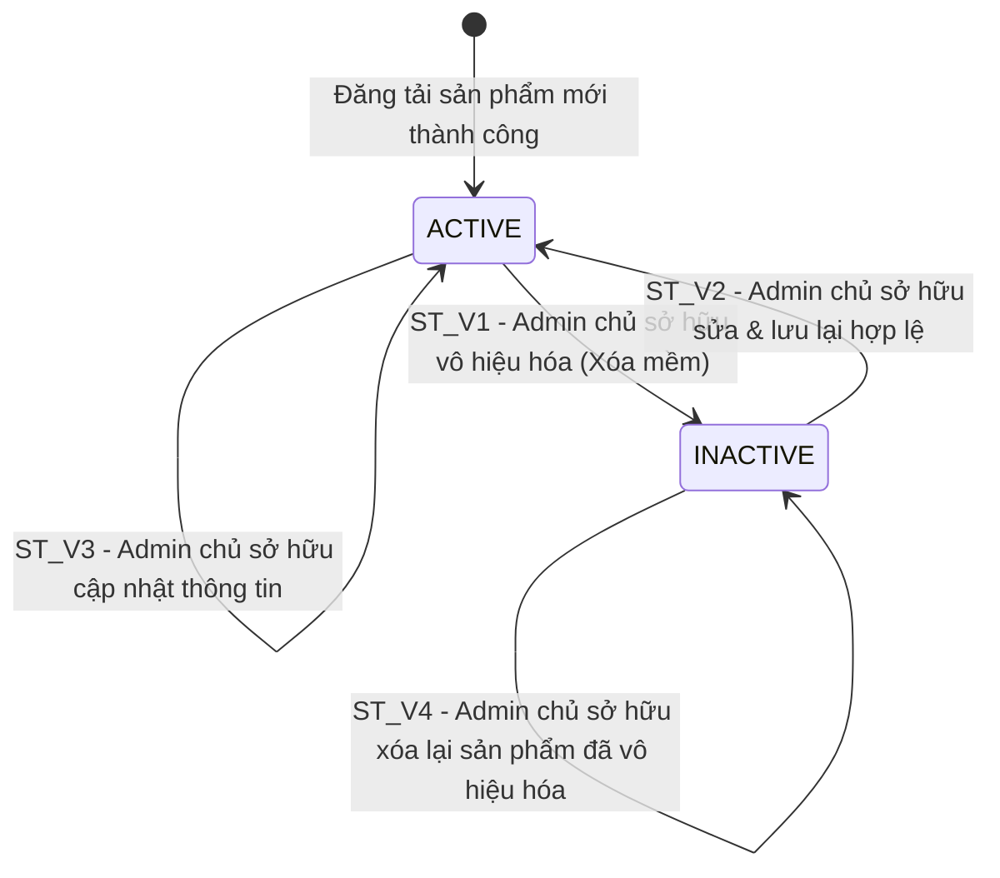

# THIẾT KẾ TEST CASE HỘP ĐEN: CHỈNH SỬA & XÓA SẢN PHẨM (ADMIN PRODUCT EDIT & DELETE)

> **Chức năng:** Quản lý, Chỉnh sửa thông tin hồ sơ và Vô hiệu hóa (Xóa mềm) sản phẩm dành cho Quản trị viên (`ROLE_ADMIN`).

---

## 1. Xác Định Biến Đầu Vào & Ràng Buộc Nghiệp Vụ (Input Variables)

| Tên Biến | Ý Nghĩa | Kiểu | Ràng Buộc & Miền Giá Trị Hợp Lệ |
| :--- | :--- | :---: | :--- |
| **`currentUserRole`** | Quyền đăng nhập | `Role` | Bắt buộc `ROLE_ADMIN` (`ROLE_USER` / Guest bị từ chối) |
| **`currentUsername`** & **`ownerUsername`** | Quyền sở hữu sản phẩm | `String` | Bắt buộc chính chủ (`currentUsername == ownerUsername`); khác chủ bị chặn |
| **`code`** | Mã định danh sản phẩm | `String` | Độ dài $[1, 20]$, không rỗng, phải tồn tại trong CSDL |
| **`name`** | Tên hiển thị sản phẩm | `String` | Độ dài $[1, 255]$, không rỗng |
| **`price`** | Đơn giá sản phẩm (VNĐ) | `double` | Số thực $> 0$ (thực tế $[1.000, 100.000.000]$ VNĐ) |
| **`discountPercent`** | Giảm giá khuyến mãi (%) | `int` | Số nguyên trong đoạn $[0, 100]\%$ |
| **`stockQuantity`** | Số lượng hàng tồn kho | `int` | Số nguyên không âm $\ge 0$ (thực tế $[0, 10.000]$) |
| **`fileData`** | Tệp hình ảnh đại diện | `MultipartFile` | Tùy chọn (rỗng kích hoạt Image Retention); tệp mới: định dạng ảnh, $\le 10\text{ MB}$, AI duyệt |
| **`status`** | Trạng thái vòng đời | `Enum` | `ACTIVE` (Đang bán) hoặc `INACTIVE` (Đã vô hiệu hóa sau xóa mềm) |

---

## 2. Bảng Phân Hoạch Tương Đương (Equivalence Partitioning - EP)

| STT | Biến / Điều kiện | Lớp hợp lệ (Valid) | Tag | Lớp không hợp lệ (Invalid) | Tag |
| :-: | :--- | :--- | :---: | :--- | :---: |
| **1** | **Quyền truy cập (`currentUserRole`)** | Tài khoản Quản trị viên (`ROLE_ADMIN`) | **V1** | • Khách vãng lai chưa đăng nhập (`Guest`) • Tài khoản người dùng thường (`ROLE_USER`) | **X1** **X2** |
| **2** | **Quyền sở hữu (`ownerUsername`)** | Chính chủ sở hữu (`currentUsername == ownerUsername`) | **V2** | Thuộc sở hữu của Admin khác (`currentUsername != ownerUsername`) | **X3** |
| **3** | **Mã sản phẩm (`code`)** | Chuỗi độ dài $[1, 20]$, tồn tại trong CSDL | **V3** | • Để trống hoặc rỗng (`""`) • Vượt quá 20 ký tự ($L > 20$) • Không tồn tại trong CSDL | **X4** **X5** **X6** |
| **4** | **Tên sản phẩm (`name`)** | Chuỗi độ dài $[1, 255]$ không rỗng | **V4** | • Để trống hoặc toàn khoảng trắng • Vượt quá 255 ký tự ($L > 255$) | **X7** **X8** |
| **5** | **Đơn giá (`price`)** | Số thực hữu hạn $> 0$ ($price \ge 1.000$ VNĐ) | **V5** | • Đơn giá bằng $0$ • Đơn giá âm ($< 0$) • Ký tự phi số | **X9** **X10** **X11** |
| **6** | **Giảm giá (`discountPercent`)** | Số nguyên trong đoạn $[0, 100]\%$ | **V6** | • Số nguyên âm ($< 0$) • Vượt trần 100% ($> 100\%$) • Ký tự phi số | **X12** **X13** **X14** |
| **7** | **Tồn kho (`stockQuantity`)** | Số nguyên không âm ($\ge 0$) | **V7** | • Số nguyên âm ($< 0$) • Ký tự phi số | **X15** **X16** |
| **8** | **Hình ảnh (`fileData`)** | • Rỗng / 0 byte (bảo lưu ảnh cũ - Image Retention) • Ảnh $\le 10\text{ MB}$, hợp lệ, AI duyệt (`approved = true`) • Ảnh hợp lệ khi AI offline (Fallback mode) | **V8** **V9** **V10** | • Bị AI từ chối (`approved = false`) • Sai định dạng (`.exe`, `.txt`, `.pdf`) • Vượt dung lượng ($> 10\text{ MB}$) • Lỗi đọc byte (`IOException`) | **X17** **X18** **X19** **X20** |
| **9** | **Trạng thái đối tượng (`status`)** | Sản phẩm ở trạng thái `ACTIVE` hoặc `INACTIVE` | **V11** | N/A (Trường trạng thái nội bộ hệ thống) | N/A |

---

## 3. Bảng Phân Tích Giá Trị Biên (Robustness BVA - $6n + 1$)

### 3.1 Bảng 7 mốc giá trị biên Robustness BVA cho 6 biến định lượng

*(Ghi chú bộ giá trị danh định chuẩn: `code` $nom = 10\text{ ký tự}$ (`"P_EDIT_01"`), `name` $nom = 25\text{ ký tự}$ (`"Giày Sneaker Nam Chạy Bộ"`), `price` $nom = 500.000\text{ VNĐ}$, `stockQuantity` $nom = 50$, `discountPercent` $nom = 10\%$, `fileData` $nom = 2\text{ MB}$).*

| Biến Định Lượng | Ngoại biên dưới ($min^-$) | Cận dưới ($min$) | Kề dưới ($min^+$) | Danh định ($nom$) | Kề trên ($max^-$) | Cận trên ($max$) | Ngoại biên trên ($max^+$) | Quy tắc & Giới hạn |
| :--- | :---: | :---: | :---: | :---: | :---: | :---: | :---: | :--- |
| **1. Độ dài `code`** | `0` *(rỗng)* | **`1`** | **`2`** | **`10`** | **`19`** | **`20`** | `21` | Miền $[1, 20]$. Rỗng hoặc $> 20$ báo lỗi |
| **2. Độ dài `name`** | `0` *(rỗng)* | **`1`** | **`2`** | **`25`** | **`254`** | **`255`** | `256` | Miền $[1, 255]$. Rỗng hoặc $> 255$ báo lỗi |
| **3. Đơn giá `price`** (VNĐ) | `0` *(hoặc âm)* | **`1.000`** | **`10.000`** | **`500.000`** | **`99.990.000`** | **`100.000.000`** | `100.000.001` | Miền $> 0$. $\le 0$ báo lỗi: *"Giá sản phẩm phải lớn hơn 0!"* |
| **4. Tồn kho `stockQuantity`** | `-1` *(âm)* | **`0`** | **`1`** | **`50`** | **`9.999`** | **`10.000`** | `10.001` | Miền $\ge 0$. Âm báo lỗi: *"Số lượng tồn kho không được âm!"* |
| **5. Giảm giá `discountPercent`** (%)| `-1` *(âm)* | **`0`** | **`1`** | **`10`** | **`99`** | **`100`** | `101` | Miền $[0, 100]\%$. $< 0$ hoặc $> 100$ báo lỗi |
| **6. Dung lượng `fileData`** | `0 byte` *(rỗng)* | **`1 byte`** | **`1 KB`** | **`2 MB`** | **`9.99 MB`** | **`10 MB`** | `10.01 MB` | Miền $\le 10\text{ MB}$. Rỗng giữ ảnh cũ; $> 10\text{ MB}$ ngắt kết nối |

---

### 3.2 Bảng Đầy Đủ Robustness BVA Test Cases ($6n + 1 = 37$ Ca Kiểm Thử)

| Case | Mã SP (`code`) | Tên sản phẩm (`name`) | Đơn giá (`price`) | Tồn kho (`stockQuantity`) | Giảm giá (`discountPercent`) | Tệp ảnh (`fileData`) | Mốc kiểm thử | Kết quả mong đợi (Expected Output) | Tag Biên |
| :-: | :--- | :--- | :---: | :---: | :---: | :---: | :--- | :--- | :-: |
| **1** | `"P_EDIT_01"` *(nom)* | `"Giày Sneaker Nam Chạy Bộ"` *(nom)* | `500.000` *(nom)* | `50` *(nom)* | `10` *(nom)* | `2 MB` *(nom)* | **Tất cả ở nom** | **Hợp lệ:** Cập nhật thành công | **B1** |
| **2** | `""` *(min-)* | `"Giày Sneaker Nam Chạy Bộ"` | `500.000` | `50` | `10` | `2 MB` | `code = min-` | **Lỗi:** Mã sản phẩm không được để trống | **B2** |
| **3** | `"P"` *(min)* | `"Giày Sneaker Nam Chạy Bộ"` | `500.000` | `50` | `10` | `2 MB` | `code = min` | **Hợp lệ:** Cập nhật thành công | **B3** |
| **4** | `"P1"` *(min+)* | `"Giày Sneaker Nam Chạy Bộ"` | `500.000` | `50` | `10` | `2 MB` | `code = min+` | **Hợp lệ:** Cập nhật thành công | **B4** |
| **5** | `[19 ký tự]` *(max-)* | `"Giày Sneaker Nam Chạy Bộ"` | `500.000` | `50` | `10` | `2 MB` | `code = max-` | **Hợp lệ:** Cập nhật thành công | **B5** |
| **6** | `[20 ký tự]` *(max)* | `"Giày Sneaker Nam Chạy Bộ"` | `500.000` | `50` | `10` | `2 MB` | `code = max` | **Hợp lệ:** Cập nhật thành công | **B6** |
| **7** | `[21 ký tự]` *(max+)* | `"Giày Sneaker Nam Chạy Bộ"` | `500.000` | `50` | `10` | `2 MB` | `code = max+` | **Lỗi:** Mã sản phẩm tối đa 20 ký tự | **B7** |
| **8** | `"P_EDIT_01"` | `""` *(min-)* | `500.000` | `50` | `10` | `2 MB` | `name = min-` | **Lỗi:** Tên sản phẩm không được để trống | **B8** |
| **9** | `"P_EDIT_01"` | `"A"` *(min)* | `500.000` | `50` | `10` | `2 MB` | `name = min` | **Hợp lệ:** Cập nhật thành công | **B9** |
| **10**| `"P_EDIT_01"` | `"AB"` *(min+)* | `500.000` | `50` | `10` | `2 MB` | `name = min+` | **Hợp lệ:** Cập nhật thành công | **B10**|
| **11**| `"P_EDIT_01"` | `[254 ký tự]` *(max-)* | `500.000` | `50` | `10` | `2 MB` | `name = max-` | **Hợp lệ:** Cập nhật thành công | **B11**|
| **12**| `"P_EDIT_01"` | `[255 ký tự]` *(max)* | `500.000` | `50` | `10` | `2 MB` | `name = max` | **Hợp lệ:** Cập nhật thành công | **B12**|
| **13**| `"P_EDIT_01"` | `[256 ký tự]` *(max+)* | `500.000` | `50` | `10` | `2 MB` | `name = max+` | **Lỗi:** Tên sản phẩm tối đa 255 ký tự | **B13**|
| **14**| `"P_EDIT_01"` | `"Giày Sneaker Nam Chạy Bộ"` | `0` *(min-)* | `50` | `10` | `2 MB` | `price = min-` | **Lỗi:** Giá sản phẩm phải lớn hơn 0! | **B14**|
| **15**| `"P_EDIT_01"` | `"Giày Sneaker Nam Chạy Bộ"` | `1.000` *(min)* | `50` | `10` | `2 MB` | `price = min` | **Hợp lệ:** Cập nhật thành công | **B15**|
| **16**| `"P_EDIT_01"` | `"Giày Sneaker Nam Chạy Bộ"` | `10.000` *(min+)* | `50` | `10` | `2 MB` | `price = min+` | **Hợp lệ:** Cập nhật thành công | **B16**|
| **17**| `"P_EDIT_01"` | `"Giày Sneaker Nam Chạy Bộ"` | `99.990.000` *(max-)*| `50` | `10` | `2 MB` | `price = max-` | **Hợp lệ:** Cập nhật thành công | **B17**|
| **18**| `"P_EDIT_01"` | `"Giày Sneaker Nam Chạy Bộ"` | `100.000.000` *(max)* | `50` | `10` | `2 MB` | `price = max` | **Hợp lệ:** Cập nhật thành công | **B18**|
| **19**| `"P_EDIT_01"` | `"Giày Sneaker Nam Chạy Bộ"` | `100.000.001` *(max+)*| `50` | `10` | `2 MB` | `price = max+` | **Cảnh báo:** Vượt ngưỡng bán lẻ thông thường | **B19**|
| **20**| `"P_EDIT_01"` | `"Giày Sneaker Nam Chạy Bộ"` | `500.000` | `-1` *(min-)* | `10` | `2 MB` | `stock = min-` | **Lỗi:** Số lượng tồn kho không được âm! | **B20**|
| **21**| `"P_EDIT_01"` | `"Giày Sneaker Nam Chạy Bộ"` | `500.000` | `0` *(min)* | `10` | `2 MB` | `stock = min` | **Hợp lệ:** Cập nhật thành công | **B21**|
| **22**| `"P_EDIT_01"` | `"Giày Sneaker Nam Chạy Bộ"` | `500.000` | `1` *(min+)* | `10` | `2 MB` | `stock = min+` | **Hợp lệ:** Cập nhật thành công | **B22**|
| **23**| `"P_EDIT_01"` | `"Giày Sneaker Nam Chạy Bộ"` | `500.000` | `9.999` *(max-)* | `10` | `2 MB` | `stock = max-` | **Hợp lệ:** Cập nhật thành công | **B23**|
| **24**| `"P_EDIT_01"` | `"Giày Sneaker Nam Chạy Bộ"` | `500.000` | `10.000` *(max)* | `10` | `2 MB` | `stock = max` | **Hợp lệ:** Cập nhật thành công | **B24**|
| **25**| `"P_EDIT_01"` | `"Giày Sneaker Nam Chạy Bộ"` | `500.000` | `10.001` *(max+)* | `10` | `2 MB` | `stock = max+` | **Cảnh báo:** Vượt ngưỡng tồn kho thông thường | **B25**|
| **26**| `"P_EDIT_01"` | `"Giày Sneaker Nam Chạy Bộ"` | `500.000` | `50` | `-1` *(min-)* | `2 MB` | `discount = min-` | **Lỗi:** Phần trăm giảm giá phải trong khoảng 0 đến 100! | **B26**|
| **27**| `"P_EDIT_01"` | `"Giày Sneaker Nam Chạy Bộ"` | `500.000` | `50` | `0` *(min)* | `2 MB` | `discount = min` | **Hợp lệ:** Cập nhật thành công | **B27**|
| **28**| `"P_EDIT_01"` | `"Giày Sneaker Nam Chạy Bộ"` | `500.000` | `50` | `1` *(min+)* | `2 MB` | `discount = min+` | **Hợp lệ:** Cập nhật thành công | **B28**|
| **29**| `"P_EDIT_01"` | `"Giày Sneaker Nam Chạy Bộ"` | `500.000` | `50` | `99` *(max-)* | `2 MB` | `discount = max-` | **Hợp lệ:** Cập nhật thành công | **B29**|
| **30**| `"P_EDIT_01"` | `"Giày Sneaker Nam Chạy Bộ"` | `500.000` | `50` | `100` *(max)* | `2 MB` | `discount = max` | **Hợp lệ:** Cập nhật thành công | **B30**|
| **31**| `"P_EDIT_01"` | `"Giày Sneaker Nam Chạy Bộ"` | `500.000` | `50` | `101` *(max+)* | `2 MB` | `discount = max+` | **Lỗi:** Phần trăm giảm giá phải trong khoảng 0 đến 100! | **B31**|
| **32**| `"P_EDIT_01"` | `"Giày Sneaker Nam Chạy Bộ"` | `500.000` | `50` | `10` | `0 byte` *(min-)* | `file = min-` | **Hợp lệ:** Giữ nguyên ảnh cũ (Image Retention) | **B32**|
| **33**| `"P_EDIT_01"` | `"Giày Sneaker Nam Chạy Bộ"` | `500.000` | `50` | `10` | `1 byte` *(min)* | `file = min` | **Hợp lệ:** Cập nhật ảnh mới 1 byte thành công | **B33**|
| **34**| `"P_EDIT_01"` | `"Giày Sneaker Nam Chạy Bộ"` | `500.000` | `50` | `10` | `1 KB` *(min+)* | `file = min+` | **Hợp lệ:** Cập nhật ảnh mới 1 KB thành công | **B34**|
| **35**| `"P_EDIT_01"` | `"Giày Sneaker Nam Chạy Bộ"` | `500.000` | `50` | `10` | `9.99 MB` *(max-)* | `file = max-` | **Hợp lệ:** Cập nhật ảnh mới 9.99 MB thành công | **B35**|
| **36**| `"P_EDIT_01"` | `"Giày Sneaker Nam Chạy Bộ"` | `500.000` | `50` | `10` | `10 MB` *(max)* | `file = max` | **Hợp lệ:** Cập nhật ảnh mới 10 MB thành công | **B36**|
| **37**| `"P_EDIT_01"` | `"Giày Sneaker Nam Chạy Bộ"` | `500.000` | `50` | `10` | `10.01 MB` *(max+)*| `file = max+` | **Lỗi:** Vượt trần 10MB (`MaxUploadSizeExceeded`) | **B37**|

---

## 4. Kỹ Thuật Bảng Quyết Định (Decision Table Testing - DTT)

### 4.1 Xác định Điều kiện & Hành động

**Điều kiện đầu vào:**
• **C1 — Quyền Admin:** Tài khoản có quyền `ROLE_ADMIN` (`Y` / `N`).  
• **C2 — Sự tồn tại:** Mã `code` có tồn tại trong CSDL (`Y` / `N`).  
• **C3 — Đúng chủ sở hữu:** Người thao tác là người tạo (`currentUsername == ownerUsername`) (`Y` / `N`).  
• **C4 — Dữ liệu Form:** Thông tin biểu mẫu hợp lệ (`Y` / `N`).

**Hành động hệ thống:**
• **A1 — Lưu cập nhật thành công:** Cập nhật DB, `status = ACTIVE`, flash: *"Lưu sản phẩm thành công!"*, redirect `/productList`.  
• **A2 — Vô hiệu hóa thành công:** Cập nhật DB, `status = INACTIVE`, flash: *"Đã vô hiệu hóa sản phẩm thành công!"*, redirect `/productList`.  
• **A3 — Chặn truy cập phi Admin:** Chuyển hướng `/admin/login` hoặc mã HTTP 403 Forbidden.  
• **A4 — Chặn quyền sở hữu:** Flash: *"Bạn không có quyền cập nhật/xóa sản phẩm của người khác!"*, redirect `/productList`.  
• **A5 — Báo lỗi dữ liệu Form:** Giữ nguyên form `product.html`, hiển thị thông báo lỗi validation chi tiết.  
• **A6 — Chuyển hướng an toàn:** Redirect `/productList`.

---

### 4.2 Bảng Quyết Định (Decision Table: 8 Rules)

| | Điều kiện / Hành động | R1 | R2 | R3 | R4 | R5 | R6 | R7 | R8 |
| :---: | :--- | :---: | :---: | :---: | :---: | :---: | :---: | :---: | :---: |
| **C1** | Quyền là Admin (`ROLE_ADMIN`)? | **Y** | **Y** | **N** | **N** | **Y** | **Y** | **Y** | **Y** |
| **C2** | Sản phẩm tồn tại trong CSDL? | **Y** | **Y** | - | - | **Y** | **Y** | **Y** | **N** |
| **C3** | Đúng chủ sở hữu (`currentUsername == owner`)? | **Y** | **Y** | - | - | **N** | **N** | **Y** | - |
| **C4** | Dữ liệu Form hợp lệ? | **Y** | - | - | - | - | - | **N** | - |
| **A1** | Lưu cập nhật thành công (`ACTIVE`) | **X** | - | - | - | - | - | - | - |
| **A2** | Vô hiệu hóa thành công (`INACTIVE`) | - | **X** | - | - | - | - | - | - |
| **A3** | Chặn truy cập phi Admin (HTTP 403/302) | - | - | **X** | **X** | - | - | - | - |
| **A4** | Chặn vi phạm quyền sở hữu | - | - | - | - | **X** | **X** | - | - |
| **A5** | Báo lỗi biểu mẫu validation | - | - | - | - | - | - | **X** | - |
| **A6** | Chuyển hướng an toàn về `/productList` | - | - | - | - | - | - | - | **X** |
| **Tag** | **Tag định danh kiểm thử** | **D1** | **D2** | **D3** | **D4** | **D5** | **D6** | **D7** | **D8** |

*Ý nghĩa quy tắc:*
• **R1 (Sửa OK):** Admin chính chủ sửa với dữ liệu hợp lệ $\rightarrow$ Lưu thành công (`ACTIVE`).  
• **R2 (Xóa OK):** Admin chính chủ xóa sản phẩm tồn tại $\rightarrow$ Vô hiệu hóa thành công (`INACTIVE`).  
• **R3, R4 (Phi Admin Sửa/Xóa):** Tài khoản thường hoặc chưa đăng nhập $\rightarrow$ Chặn truy cập (HTTP 403/302).  
• **R5, R6 (Khác chủ Sửa/Xóa):** Cố ý sửa hoặc xóa sản phẩm của Admin khác $\rightarrow$ Chặn vi phạm sở hữu.  
• **R7 (Lỗi Form):** Dữ liệu form không hợp lệ $\rightarrow$ Giữ nguyên form, hiển thị lỗi validation.  
• **R8 (SP không tồn tại):** Thao tác với mã không có trong CSDL $\rightarrow$ Chuyển hướng an toàn.

---

## 5. Kỹ Thuật Chuyển Đổi Trạng Thái (State Transition Testing - STT)

### 5.1 Sơ đồ chuyển đổi trạng thái vòng đời sản phẩm

### 5.2 Bảng Chuyển Đổi Trạng Thái (State Transition Table)

| Trạng thái ban đầu ($S_i$) | Sự kiện kích hoạt (Event) | Điều kiện bảo vệ (Guard Condition) | Trạng thái tiếp theo ($S_{i+1}$) | Hiển thị giao diện & Kết quả mong đợi | Tag |
| :---: | :--- | :--- | :---: | :--- | :---: |
| **`ACTIVE`** | Gửi yêu cầu Xóa | Đúng chủ sở hữu, `code` tồn tại | **`INACTIVE`** | Cập nhật `status = INACTIVE`, flash: *"Đã vô hiệu hóa sản phẩm thành công!"* | **ST_V1** |
| **`INACTIVE`**| Gửi Form Cập nhật | Đúng chủ sở hữu, Form hợp lệ | **`ACTIVE`** | Cập nhật DB, tái kích hoạt `status = ACTIVE`, flash: *"Lưu sản phẩm thành công!"* | **ST_V2** |
| **`ACTIVE`** | Gửi Form Cập nhật | Đúng chủ sở hữu, Form hợp lệ | **`ACTIVE`** | Cập nhật DB, duy trì `status = ACTIVE`, flash: *"Lưu sản phẩm thành công!"* | **ST_V3** |
| **`INACTIVE`**| Gửi yêu cầu Xóa | Đúng chủ sở hữu, `code` tồn tại | **`INACTIVE`** | Duy trì `status = INACTIVE`, flash: *"Đã vô hiệu hóa sản phẩm thành công!"* | **ST_V4** |

---

## 6. Thiết Kế Bảng Test Cases Chi Tiết Triển Khai (Tối Ưu & Đầy Đủ Bao Phủ)

| STT | Mã Test Case | Tên ca kiểm thử | Dữ liệu kiểm thử (Test Input Data) | Kết quả mong đợi (Expected Output) | Tag được bao phủ |
| :-: | :--- | :--- | :--- | :--- | :---: |
| **1** | **TC_PROD_01** | Cập nhật thành công toàn diện sản phẩm chính chủ với giá trị danh định ($nom$) và giữ nguyên ảnh cũ | • `currentUserRole`: `ROLE_ADMIN` • `currentUsername`: `manager1` (chủ sở hữu) • `code`: `"P_EDIT_01"` (tồn tại, `status = ACTIVE`) • `name`: `"Giày Sneaker Nam Chạy Bộ Cải Tiến"` • `price`: `500.000` • `stockQuantity`: `50` • `discountPercent`: `10` • `fileData`: Rỗng (0 byte, không chọn file mới) | **Hợp lệ:** Kích hoạt Image Retention giữ ảnh cũ, CSDL cập nhật thông tin, duy trì `status = ACTIVE`, flash: *"Lưu sản phẩm thành công!"*, redirect `/productList`. | **V1, V2, V3, V4, V5, V6, V7, V8, V11, B1, B32, D1, ST_V3** |
| **2** | **TC_PROD_02** | Vô hiệu hóa (xóa mềm) sản phẩm chính chủ đang `ACTIVE` sang `INACTIVE` | • `currentUserRole`: `ROLE_ADMIN` • `currentUsername`: `manager1` (chủ sở hữu) • `code`: `"P_EDIT_01"` (`status = ACTIVE`) | **Hợp lệ:** Xóa mềm thành công, CSDL cập nhật `status = INACTIVE`, flash: *"Đã vô hiệu hóa sản phẩm thành công!"*, redirect `/productList`. | **D2, ST_V1** |
| **3** | **TC_PROD_03** | Tái kích hoạt sản phẩm từ `INACTIVE` sang `ACTIVE` bằng cập nhật biểu mẫu hợp lệ | • `currentUserRole`: `ROLE_ADMIN` • `currentUsername`: `manager1` (chủ sở hữu) • `code`: `"P_EDIT_01"` (`status = INACTIVE`) • Dữ liệu Form danh định hợp lệ | **Hợp lệ:** Cập nhật dữ liệu mới, tái kích hoạt `status = ACTIVE` trong CSDL, flash: *"Lưu sản phẩm thành công!"*, redirect `/productList`. | **ST_V2** |
| **4** | **TC_PROD_04** | Xóa lại sản phẩm đang ở trạng thái `INACTIVE` để xác nhận tính idempotent (duy trì `INACTIVE`) | • `currentUserRole`: `ROLE_ADMIN` • `currentUsername`: `manager1` (chủ sở hữu) • `code`: `"P_EDIT_01"` (`status = INACTIVE`) | **Hợp lệ:** Vô hiệu hóa an toàn, duy trì `status = INACTIVE` trong CSDL, flash: *"Đã vô hiệu hóa sản phẩm thành công!"*, redirect `/productList`. | **ST_V4** |
| **5** | **TC_PROD_05** | Chặn tài khoản thường (`ROLE_USER`) và khách vãng lai (`Guest`) thực hiện cập nhật sản phẩm | • Thử nghiệm tuần tự:   - `currentUserRole`: `Guest` (chưa đăng nhập)   - `currentUserRole`: `ROLE_USER`, `currentUsername`: `employee1` • `code`: `"P_EDIT_01"` • Dữ liệu Form cập nhật | **Bị chặn:** Chuyển hướng login hoặc HTTP 403 Forbidden, dữ liệu trong CSDL không đổi. | **X1, X2, D3** |
| **6** | **TC_PROD_06** | Chặn tài khoản người dùng thường (`ROLE_USER`) thực hiện xóa sản phẩm | • `currentUserRole`: `ROLE_USER` • `currentUsername`: `employee1` • `code`: `"P_EDIT_01"` | **Bị chặn:** Chuyển hướng login hoặc HTTP 403 Forbidden, trạng thái sản phẩm trong CSDL được bảo toàn. | **X2, D4** |
| **7** | **TC_PROD_07** | Chặn Admin chỉnh sửa sản phẩm thuộc quyền sở hữu của Admin khác (`currentUsername != owner`) | • `currentUserRole`: `ROLE_ADMIN` • `currentUsername`: `manager1` • `code`: `"P_OTHER_01"` (do `admin2` tạo) | **Bị chặn:** Controller kiểm tra quyền sở hữu, từ chối cập nhật, flash: *"Bạn không có quyền cập nhật sản phẩm của người khác!"*, redirect `/productList`. Dữ liệu không đổi. | **X3, D5** |
| **8** | **TC_PROD_08** | Chặn Admin xóa sản phẩm thuộc quyền sở hữu của Admin khác (`currentUsername != owner`) | • `currentUserRole`: `ROLE_ADMIN` • `currentUsername`: `manager1` • `code`: `"P_OTHER_01"` (do `admin2` tạo) | **Bị chặn:** Controller kiểm tra quyền sở hữu, từ chối xóa, flash: *"Bạn không có quyền xóa sản phẩm của người khác!"*, redirect `/productList`. Dữ liệu không đổi. | **X3, D6** |
| **9** | **TC_PROD_09** | Xử lý an toàn khi gửi yêu cầu cập nhật hoặc xóa với mã sản phẩm không tồn tại trong CSDL | • `currentUserRole`: `ROLE_ADMIN` • `currentUsername`: `manager1` • `code`: `"NON_EXISTENT_CODE"` (không tồn tại trong CSDL) | **Xử lý an toàn:** Không tìm thấy sản phẩm tương ứng, không phát sinh lỗi server, redirect an toàn về `/productList`. | **X6, D8** |
| **10** | **TC_PROD_10** | Cập nhật thành công với tất cả các trường dữ liệu ở biên hợp lệ tối thiểu ($min$) | • `currentUserRole`: `ROLE_ADMIN` • `code`: `"P"` (1 ký tự) • `name`: `"A"` (1 ký tự) • `price`: `1.000` • `stockQuantity`: `0` • `discountPercent`: `0` • `fileData`: Tệp ảnh 1 byte | **Hợp lệ:** Cập nhật CSDL và lưu ảnh 1 byte thành công, flash: *"Lưu sản phẩm thành công!"*, redirect `/productList`. | **V9, B3, B9, B15, B21, B27, B33** |
| **11** | **TC_PROD_11** | Cập nhật thành công với tất cả các trường dữ liệu ở biên hợp lệ cận dưới ($min^+$) | • `currentUserRole`: `ROLE_ADMIN` • `code`: `"P1"` (2 ký tự) • `name`: `"AB"` (2 ký tự) • `price`: `10.000` • `stockQuantity`: `1` • `discountPercent`: `1` • `fileData`: Tệp ảnh 1 KB | **Hợp lệ:** Cập nhật CSDL và lưu ảnh 1 KB thành công, flash: *"Lưu sản phẩm thành công!"*, redirect `/productList`. | **B4, B10, B16, B22, B28, B34** |
| **12** | **TC_PROD_12** | Cập nhật thành công với tất cả các trường dữ liệu ở biên hợp lệ cận trên ($max^-$) | • `currentUserRole`: `ROLE_ADMIN` • `code`: Chuỗi 19 ký tự • `name`: Chuỗi 254 ký tự • `price`: `99.990.000` • `stockQuantity`: `9.999` • `discountPercent`: `99` • `fileData`: Tệp ảnh 9.99 MB | **Hợp lệ:** Cập nhật CSDL và lưu ảnh 9.99 MB thành công, flash: *"Lưu sản phẩm thành công!"*, redirect `/productList`. | **B5, B11, B17, B23, B29, B35** |
| **13** | **TC_PROD_13** | Cập nhật thành công với tất cả các trường dữ liệu ở biên hợp lệ tối đa ($max$) | • `currentUserRole`: `ROLE_ADMIN` • `code`: Chuỗi 20 ký tự • `name`: Chuỗi 255 ký tự • `price`: `100.000.000` • `stockQuantity`: `10.000` • `discountPercent`: `100` • `fileData`: Tệp ảnh đúng 10 MB (10.485.760 bytes) | **Hợp lệ:** Cập nhật CSDL và lưu ảnh 10 MB thành công, flash: *"Lưu sản phẩm thành công!"*, redirect `/productList`. | **B6, B12, B18, B24, B30, B36** |
| **14** | **TC_PROD_14** | Cập nhật với dữ liệu đơn giá và số lượng vượt ngưỡng bán lẻ thông thường ($max^+$ price, stockQuantity) | • `currentUserRole`: `ROLE_ADMIN` • `code`: `"P_EDIT_01"` • `price`: `100.000.001` • `stockQuantity`: `10.001` • Các trường khác điền giá trị danh định hợp lệ | **Hợp lệ / Cảnh báo:** Hệ thống tiếp nhận thành công giá trị số lớn, lưu CSDL hoặc ghi nhận log cảnh báo, redirect `/productList`. | **B19, B25** |
| **15** | **TC_PROD_15** | Cập nhật sản phẩm thành công khi AI Quality Gate ngoại tuyến/timeout (cơ chế Fallback) | • `currentUserRole`: `ROLE_ADMIN` • `code`: `"P_EDIT_01"` • `fileData`: Tệp ảnh hợp lệ • Dịch vụ AI ngoại tuyến hoặc phản hồi timeout | **Hợp lệ (Fallback):** Kích hoạt cơ chế dự phòng an toàn, bỏ qua bước AI duyệt, cập nhật CSDL và lưu ảnh thành công, ghi nhận log cảnh báo AI. | **V10** |
| **16** | **TC_PROD_16** | Xử lý ngoại lệ tính toàn vẹn CSDL khi cập nhật trùng mã sản phẩm của bản ghi khác | • `currentUserRole`: `ROLE_ADMIN` • Thay đổi `code` thành mã đang thuộc về sản phẩm khác đã có trong CSDL | **Lỗi:** Bắt lỗi ràng buộc Unique (`DuplicateKeyException`), hiển thị thông báo lỗi trùng mã, giữ nguyên form. | **V11** |
| **17** | **TC_PROD_17** | Báo lỗi để trống các trường bắt buộc (`code`, `name`) ($min^-$) | • `currentUserRole`: `ROLE_ADMIN` • `code`: `""` (để trống) • `name`: `""` (để trống) • Các trường khác điền giá trị danh định | **Lỗi:** Chặn submit, giữ nguyên form `product.html`, hiển thị lỗi: *"Mã sản phẩm không được để trống"* và *"Tên sản phẩm không được để trống"*. | **X4, X7, B2, B8, D7** |
| **18** | **TC_PROD_18** | Báo lỗi khi mã sản phẩm `code` chứa khoảng trắng, ký tự đặc biệt hoặc vượt độ dài 20 ký tự ($max^+$) | • `currentUserRole`: `ROLE_ADMIN` • Thử nghiệm tuần tự `code`: chứa khoảng trắng (`"P 01"`), ký tự đặc biệt (`"P@#$"`), hoặc dài 21 ký tự | **Lỗi:** Chặn submit, hiển thị thông báo lỗi: mã không chứa khoảng trắng/ký tự đặc biệt, hoặc vượt quá 20 ký tự. | **X5, B7, D7** |
| **19** | **TC_PROD_19** | Báo lỗi khi tên sản phẩm `name` chứa ký tự nguy hiểm (XSS, SQLi) hoặc vượt quá 255 ký tự ($max^+$) | • `currentUserRole`: `ROLE_ADMIN` • Thử nghiệm tuần tự `name`: ``, SQL `'; DROP TABLE...`, hoặc dài 256 ký tự | **Lỗi:** Chặn submit, validator phát hiện ký tự nguy hiểm hoặc độ dài vượt quá 255 ký tự, giữ nguyên form. | **X8, B13, D7** |
| **20** | **TC_PROD_20** | Báo lỗi khi đơn giá sản phẩm `price` bằng 0 ($min^-$) hoặc giá trị âm | • `currentUserRole`: `ROLE_ADMIN` • Thử nghiệm `price`: `0` hoặc `-50.000` • Các trường khác điền giá trị danh định | **Lỗi:** Chặn submit, giữ nguyên form `product.html`, hiển thị lỗi: *"Giá sản phẩm phải lớn hơn 0!"*. | **X9, X10, B14, D7** |
| **21** | **TC_PROD_21** | Báo lỗi khi số lượng tồn kho `stockQuantity` có giá trị âm ($min^-$) | • `currentUserRole`: `ROLE_ADMIN` • `stockQuantity`: `-1` • Các trường khác điền giá trị danh định | **Lỗi:** Chặn submit, giữ nguyên form `product.html`, hiển thị lỗi: *"Số lượng tồn kho không được âm!"*. | **X15, B20, D7** |
| **22** | **TC_PROD_22** | Báo lỗi khi tỷ lệ chiết khấu giảm giá âm ($min^-$) hoặc vượt trần 100% ($max^+$) | • `currentUserRole`: `ROLE_ADMIN` • Thử nghiệm `discountPercent`: `-1` hoặc `101` • Các trường khác điền giá trị danh định | **Lỗi:** Chặn submit, giữ nguyên form `product.html`, hiển thị lỗi: *"Phần trăm giảm giá phải trong khoảng 0 đến 100!"*. | **X12, X13, B26, B31, D7** |
| **23** | **TC_PROD_23** | Báo lỗi khi nhập dữ liệu chuỗi ký tự không phải số cho các trường số học (`price`, `stockQuantity`, `discountPercent`) | • `currentUserRole`: `ROLE_ADMIN` • `code`: `"P_EDIT_01"` • Thử nghiệm: `price`: `"abc"`, hoặc `stockQuantity`: `"xyz"`, hoặc `discountPercent`: `"#@%"` | **Lỗi:** Spring binding bắt lỗi `TypeMismatchException`, giữ nguyên form, hiển thị lỗi định dạng số. | **X11, X14, X16, D7** |
| **24** | **TC_PROD_24** | Xử lý ngoại lệ tệp ảnh: AI từ chối, sai định dạng (.exe), dung lượng vượt trần 10MB ($max^+$) hoặc lỗi I/O | • `currentUserRole`: `ROLE_ADMIN` • `code`: `"P_EDIT_01"` • `fileData`: tệp bị AI từ chối (`blurry.jpg`), file `payload.exe`, file `10.01 MB`, hoặc file lỗi I/O | **Lỗi:** Chặn cập nhật ảnh mới, hiển thị thông báo lỗi tương ứng (`aiError`, sai định dạng, hoặc `MaxUploadSizeExceededException`), giữ nguyên ảnh cũ. | **X17, X18, X19, X20, B37, D7** |
