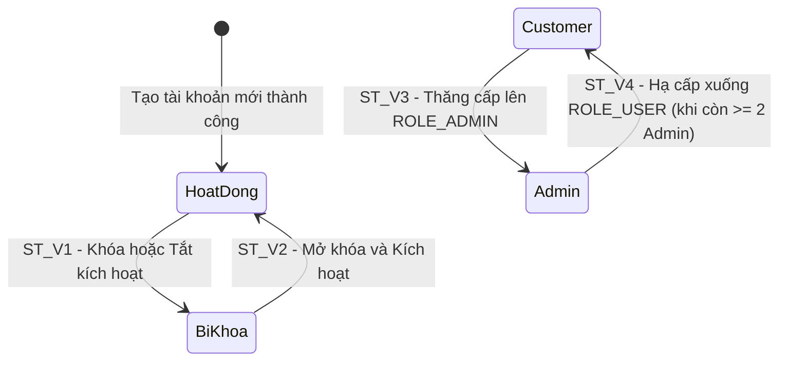

# THIẾT KẾ TEST CASE HỘP ĐEN: QUẢN LÝ TÀI KHOẢN & PHÂN QUYỀN (ADMIN USER MANAGEMENT)

> **Chức năng:** Quản lý danh sách tài khoản, xem và cập nhật hồ sơ, phân quyền Quản trị viên và kiểm soát trạng thái khóa/mở khóa tài khoản cho Quản trị viên (`ROLE_ADMIN`).

---

## 1. Xác Định Biến Đầu Vào & Ràng Buộc Nghiệp Vụ (Input Variables)

| Tên Biến | Ý Nghĩa | Kiểu | Ràng Buộc & Miền Giá Trị Hợp Lệ |
| :--- | :--- | :---: | :--- |
| **`currentUserRole`** | Quyền đăng nhập | `Role` | Bắt buộc `ROLE_ADMIN` (`ROLE_USER` / Guest bị từ chối) |
| **`userName`** | Tên đăng nhập mục tiêu | `String` | Độ dài $[1, 20]$, không rỗng, tồn tại trong CSDL (chỉ đọc trên UI) |
| **`fullName`** | Họ và tên hiển thị | `String` | Độ dài $[1, 100]$, không rỗng |
| **`email`** | Địa chỉ email | `String` | Độ dài $[6, 100]$, chuẩn RFC, không trùng lặp |
| **`phoneNumber`** | Số điện thoại | `String` | Chuỗi số độ dài $[0, 20]$ (cho phép rỗng) |
| **`userRole`** | Vai trò hệ thống | `Enum` | `ROLE_USER` (Khách hàng) hoặc `ROLE_ADMIN` (Quản trị viên) |
| **`active`** | Kích hoạt | `boolean` | `true` (Kích hoạt) hoặc `false` (Tắt kích hoạt) |
| **`accountNonLocked`** | Trạng thái khóa | `boolean` | `true` (Mở khóa) hoặc `false` (Bị khóa) |
| **`countActiveAdmins`**| Số Admin hoạt động | `int` | $\ge 2$ (an toàn); $= 1$ (kích hoạt bảo vệ Admin cuối) |

---

## 2. Bảng Phân Hoạch Tương Đương (Equivalence Partitioning - EP)

| STT | Biến / Điều kiện | Lớp hợp lệ (Valid) | Tag | Lớp không hợp lệ (Invalid) | Tag |
| :-: | :--- | :--- | :---: | :--- | :---: |
| **1** | **Quyền truy cập (`currentUserRole`)** | Tài khoản Quản trị viên (`ROLE_ADMIN`) | **V1** | • Khách vãng lai chưa đăng nhập (`Guest`) • Tài khoản người dùng thường (`ROLE_USER`) | **X1** **X2** |
| **2** | **Tài khoản mục tiêu (`userName`)** | Chuỗi độ dài $[1, 20]$, tồn tại trong CSDL | **V2** | • Để trống hoặc rỗng (`""`) • Vượt quá 20 ký tự ($L > 20$) • Không tồn tại trong CSDL | **X3** **X4** **X5** |
| **3** | **Họ và tên (`fullName`)** | Chuỗi độ dài $[1, 100]$ ký tự | **V3** | • Để trống hoặc toàn khoảng trắng • Vượt quá 100 ký tự ($L > 100$) | **X6** **X7** |
| **4** | **Địa chỉ Email (`email`)** | Chuỗi $[6, 100]$ ký tự, chuẩn RFC, chưa sử dụng | **V4** | • Để trống hoặc sai định dạng RFC • Vượt quá 100 ký tự ($L > 100$) • Trùng với tài khoản khác | **X8** **X9** **X10** |
| **5** | **Số điện thoại (`phoneNumber`)** | Chuỗi số độ dài $[0, 20]$ (cho phép rỗng) | **V5** | Vượt quá 20 ký tự số ($L > 20$) | **X11** |
| **6** | **Vai trò tài khoản (`userRole`)** | `ROLE_ADMIN` hoặc `ROLE_USER` | **V6** | Giá trị sai chuẩn (`MODERATOR`, `GUEST`,...) | **X12** |
| **7** | **Trạng thái tài khoản (`active` / `locked`)** | `true` hoặc `false` | **V7** | Giá trị phi boolean hoặc bị rỗng | **X13** |
| **8** | **Quy tắc Admin cuối (`countActiveAdmins`)**| Số Admin hoạt động $\ge 2$ | **V8** | Số Admin hoạt động $= 1$ (hạ cấp, tắt kích hoạt hoặc khóa) | **X14** |

---

## 3. Bảng Phân Tích Giá Trị Biên (Robustness BVA - $6n + 1$)

### 3.1 Bảng 7 mốc giá trị biên Robustness BVA cho 5 biến định lượng

*(Ghi chú bộ giá trị danh định chuẩn: `userName` $nom = \text{"employee1"}$, `fullName` $nom = 25\text{ ký tự}$ (`"Nguyen Van A"`), `phoneNumber` $nom = 10\text{ số}$ (`"0912345678"`), `email` $nom = 25\text{ ký tự}$ (`"user.test25@shoeshop.com"`), `countActiveAdmins` $nom = 5\text{ tài khoản}$).*

| Biến Định Lượng | Ngoại biên dưới ($min^-$) | Cận dưới ($min$) | Kề dưới ($min^+$) | Danh định ($nom$) | Kề trên ($max^-$) | Cận trên ($max$) | Ngoại biên trên ($max^+$) | Quy tắc & Giới hạn |
| :--- | :---: | :---: | :---: | :---: | :---: | :---: | :---: | :--- |
| **1. Độ dài `userName`** | `0` *(rỗng)* | **`1`** | **`2`** | **`9`** | **`19`** | **`20`** | `21` | Miền $[1, 20]$. Rỗng hoặc $> 20$ báo lỗi |
| **2. Độ dài `fullName`** | `0` *(rỗng)* | **`1`** | **`2`** | **`25`** | **`99`** | **`100`** | `101` | Miền $[1, 100]$. Bắt buộc; $> 100$ báo lỗi |
| **3. Độ dài `phoneNumber`** | N/A | **`0`** *(rỗng)* | **`1`** | **`10`** | **`19`** | **`20`** | `21` | Miền $[0, 20]$. Cho phép rỗng; $> 20$ báo lỗi |
| **4. Độ dài `email`** | `5` | **`6`** | **`7`** | **`25`** | **`99`** | **`100`** | `101` | Miền $[6, 100]$. Chuẩn RFC; $> 100$ hoặc sai định dạng báo lỗi |
| **5. Số Admin hoạt động (`countAdmin`)** | `1` *(Admin cuối)* | **`2`** | **`3`** | **`5`** | **`9`** | **`10`** | `11` | Miền $\ge 2$ cho phép hạ quyền/khóa; $= 1$ chặn bảo vệ hệ thống |

---

### 3.2 Bảng Đầy Đủ Robustness BVA Test Cases ($6n + 1 = 31$ Ca Kiểm Thử)

| Case | Tên đăng nhập (`userName`) | Họ và tên (`fullName`) | Số điện thoại (`phoneNumber`) | Email (`email`) | Số Admin (`countAdmin`) | Mốc kiểm thử | Kết quả mong đợi (Expected Output) | Tag Biên |
| :-: | :--- | :--- | :---: | :--- | :---: | :--- | :--- | :-: |
| **1** | `"employee1"` *(nom)* | `"Nguyen Van A"` *(nom)* | `"0912345678"` *(nom)* | `"user.test25@shoeshop.com"` *(nom)* | `5` *(nom)* | **Tất cả ở nom** | **Hợp lệ:** Cập nhật hồ sơ thành công | **B1** |
| **2** | `""` *(min-)* | `"Nguyen Van A"` | `"0912345678"` | `"user.test25@shoeshop.com"` | `5` | `userName = min-` | **Lỗi:** "Không tìm thấy người dùng!" | **B2** |
| **3** | `"u"` *(min)* | `"Nguyen Van A"` | `"0912345678"` | `"user.test25@shoeshop.com"` | `5` | `userName = min` | **Hợp lệ:** Cập nhật thành công | **B3** |
| **4** | `"us"` *(min+)* | `"Nguyen Van A"` | `"0912345678"` | `"user.test25@shoeshop.com"` | `5` | `userName = min+` | **Hợp lệ:** Cập nhật thành công | **B4** |
| **5** | `[19 ký tự]` *(max-)* | `"Nguyen Van A"` | `"0912345678"` | `"user.test25@shoeshop.com"` | `5` | `userName = max-` | **Hợp lệ:** Cập nhật thành công | **B5** |
| **6** | `[20 ký tự]` *(max)* | `"Nguyen Van A"` | `"0912345678"` | `"user.test25@shoeshop.com"` | `5` | `userName = max` | **Hợp lệ:** Cập nhật thành công | **B6** |
| **7** | `[21 ký tự]` *(max+)* | `"Nguyen Van A"` | `"0912345678"` | `"user.test25@shoeshop.com"` | `5` | `userName = max+` | **Lỗi:** "Không tìm thấy người dùng!" | **B7** |
| **8** | `"employee1"` | `""` *(min-)* | `"0912345678"` | `"user.test25@shoeshop.com"` | `5` | `fullName = min-` | **Lỗi:** Form yêu cầu nhập họ và tên | **B8** |
| **9** | `"employee1"` | `"A"` *(min)* | `"0912345678"` | `"user.test25@shoeshop.com"` | `5` | `fullName = min` | **Hợp lệ:** Cập nhật thành công | **B9** |
| **10**| `"employee1"` | `"AB"` *(min+)* | `"0912345678"` | `"user.test25@shoeshop.com"` | `5` | `fullName = min+` | **Hợp lệ:** Cập nhật thành công | **B10**|
| **11**| `"employee1"` | `[99 ký tự]` *(max-)* | `"0912345678"` | `"user.test25@shoeshop.com"` | `5` | `fullName = max-` | **Hợp lệ:** Cập nhật thành công | **B11**|
| **12**| `"employee1"` | `[100 ký tự]` *(max)* | `"0912345678"` | `"user.test25@shoeshop.com"` | `5` | `fullName = max` | **Hợp lệ:** Cập nhật thành công | **B12**|
| **13**| `"employee1"` | `[101 ký tự]` *(max+)* | `"0912345678"` | `"user.test25@shoeshop.com"` | `5` | `fullName = max+` | **Lỗi:** "Thông tin hồ sơ vượt quá độ dài cho phép!" | **B13**|
| **14**| `"employee1"` | `"Nguyen Van A"` | `""` *(min)* | `"user.test25@shoeshop.com"` | `5` | `phone = min` | **Hợp lệ:** Cập nhật thành công (cho phép rỗng) | **B14**|
| **15**| `"employee1"` | `"Nguyen Van A"` | `"0"` *(min+)* | `"user.test25@shoeshop.com"` | `5` | `phone = min+` | **Hợp lệ:** Cập nhật thành công | **B15**|
| **16**| `"employee1"` | `"Nguyen Van A"` | `"09"` *(min+)* | `"user.test25@shoeshop.com"` | `5` | `phone = 2 ký tự` | **Hợp lệ:** Cập nhật thành công | **B16**|
| **17**| `"employee1"` | `"Nguyen Van A"` | `[19 số]` *(max-)* | `"user.test25@shoeshop.com"` | `5` | `phone = max-` | **Hợp lệ:** Cập nhật thành công | **B17**|
| **18**| `"employee1"` | `"Nguyen Van A"` | `[20 số]` *(max)* | `"user.test25@shoeshop.com"` | `5` | `phone = max` | **Hợp lệ:** Cập nhật thành công | **B18**|
| **19**| `"employee1"` | `"Nguyen Van A"` | `[21 số]` *(max+)* | `"user.test25@shoeshop.com"` | `5` | `phone = max+` | **Lỗi:** "Thông tin hồ sơ vượt quá độ dài cho phép!" | **B19**|
| **20**| `"employee1"` | `"Nguyen Van A"` | `"0912345678"` | `"a@b.c"` *(min-)* | `5` | `email = min-` | **Lỗi:** "Email không hợp lệ!" | **B20**|
| **21**| `"employee1"` | `"Nguyen Van A"` | `"0912345678"` | `"a@b.co"` *(min)* | `5` | `email = min` | **Hợp lệ:** Cập nhật thành công | **B21**|
| **22**| `"employee1"` | `"Nguyen Van A"` | `"0912345678"` | `"ab@b.co"` *(min+)* | `5` | `email = min+` | **Hợp lệ:** Cập nhật thành công | **B22**|
| **23**| `"employee1"` | `"Nguyen Van A"` | `"0912345678"` | `[99 ký tự]` *(max-)* | `5` | `email = max-` | **Hợp lệ:** Cập nhật thành công | **B23**|
| **24**| `"employee1"` | `"Nguyen Van A"` | `"0912345678"` | `[100 ký tự]` *(max)* | `5` | `email = max` | **Hợp lệ:** Cập nhật thành công | **B24**|
| **25**| `"employee1"` | `"Nguyen Van A"` | `"0912345678"` | `[101 ký tự]` *(max+)* | `5` | `email = max+` | **Lỗi:** "Email không hợp lệ!" | **B25**|
| **26**| `"employee1"` | `"Nguyen Van A"` | `"0912345678"` | `"user.test25@shoeshop.com"` | `1` *(min-)* | `countAdmin = min-` | **Chặn:** "Không thể vô hiệu hóa quản trị viên hoạt động cuối cùng!" | **B26**|
| **27**| `"employee1"` | `"Nguyen Van A"` | `"0912345678"` | `"user.test25@shoeshop.com"` | `2` *(min)* | `countAdmin = min` | **Hợp lệ:** Cho phép hạ quyền hoặc khóa Admin | **B27**|
| **28**| `"employee1"` | `"Nguyen Van A"` | `"0912345678"` | `"user.test25@shoeshop.com"` | `3` *(min+)* | `countAdmin = min+` | **Hợp lệ:** Cập nhật thành công | **B28**|
| **29**| `"employee1"` | `"Nguyen Van A"` | `"0912345678"` | `"user.test25@shoeshop.com"` | `9` *(max-)* | `countAdmin = max-` | **Hợp lệ:** Cập nhật thành công | **B29**|
| **30**| `"employee1"` | `"Nguyen Van A"` | `"0912345678"` | `"user.test25@shoeshop.com"` | `10` *(max)* | `countAdmin = max` | **Hợp lệ:** Cập nhật thành công | **B30**|
| **31**| `"employee1"` | `"Nguyen Van A"` | `"0912345678"` | `"user.test25@shoeshop.com"` | `11` *(max+)* | `countAdmin = max+` | **Hợp lệ:** Cập nhật thành công | **B31**|

---

## 4. Kỹ Thuật Bảng Quyết Định (Decision Table Testing - DTT)

### Bảng Quyết Định Chuẩn (Decision Table: 7 Rules - Định dạng Y/N và X/-)

| | Điều kiện / Hành động | R1 | R2 | R3 | R4 | R5 | R6 | R7 |
| :---: | :--- | :---: | :---: | :---: | :---: | :---: | :---: | :---: |
| **C1** | Tài khoản mục tiêu hiện là Admin | **Y** | **Y** | **Y** | **Y** | **Y** | **Y** | **N** |
| **C2** | Thao tác hạ quyền xuống Khách hàng (`ROLE_USER`) | **Y** | **N** | **N** | **Y** | **N** | **N** | - |
| **C3** | Thao tác tắt kích hoạt (`active = false`) | **N** | **Y** | **N** | **N** | **Y** | **N** | - |
| **C4** | Thao tác khóa tài khoản (`accountNonLocked = false`) | **N** | **N** | **Y** | **N** | **N** | **Y** | - |
| **C5** | Hệ thống chỉ còn 1 Admin hoạt động duy nhất | **Y** | **Y** | **Y** | **N** | **N** | **N** | - |
| **A1** | Chặn, báo lỗi: *"Không thể vô hiệu hóa quản trị viên hoạt động cuối cùng!"* | **X** | **X** | **X** | - | - | - | - |
| **A2** | Cập nhật thành công, flash: *"Cập nhật người dùng thành công!"* | - | - | - | **X** | **X** | **X** | **X** |
| **Tag** | **Tag định danh** | **D1** | **D2** | **D3** | **D4** | **D5** | **D6** | **D7** |

*Ý nghĩa quy tắc:*
• **R1, R2, R3 (Vi phạm bảo vệ Admin cuối):** Làm mất quyền hoạt động khi chỉ còn 1 Admin $\rightarrow$ Chặn và báo lỗi.  
• **R4, R5, R6 (Thao tác Admin hợp lệ khi $\ge 2$ Admin):** Hạ quyền, tắt kích hoạt hoặc khóa tài khoản $\rightarrow$ Cập nhật thành công.  
• **R7 (Tài khoản người dùng thường):** Sửa tài khoản Khách hàng không ảnh hưởng số Admin $\rightarrow$ Cập nhật thành công.

---

## 5. Kỹ Thuật Chuyển Đổi Trạng Thái (State Transition Testing - STT)

### 5.1 Sơ đồ chuyển đổi trạng thái vòng đời Tài khoản

Trên danh sách tài khoản (`userList.html`), hệ thống hiển thị:
• **`Hoạt động`** (Xanh lá): `active = true` **và** `accountNonLocked = true`.  
• **`Bị khóa`** (Đỏ): `active = false` **hoặc** `accountNonLocked = false`.  
• Vai trò: **`Admin`** (Vàng) $\leftrightarrow$ **`Customer`** (Xanh dương).

### 5.2 Bảng Chuyển đổi trạng thái (State Transition Table)

| Trạng thái ban đầu ($S_i$) | Sự kiện kích hoạt (Event) | Điều kiện bảo vệ (Guard Condition) | Trạng thái tiếp theo ($S_{i+1}$) | Hiển thị giao diện & Kết quả mong đợi | Tag |
| :--- | :--- | :--- | :---: | :--- | :---: |
| **`Hoạt động`** | Khóa tài khoản hoặc tắt kích hoạt | Hệ thống còn $\ge 2$ Admin (nếu khóa Admin) | **`Bị khóa`** | Nhãn đỏ **`Bị khóa`**, hạn chế đăng nhập | **ST_V1** |
| **`Bị khóa`** | Mở khóa và kích hoạt tài khoản | Form hợp lệ | **`Hoạt động`** | Nhãn xanh **`Hoạt động`**, đăng nhập bình thường | **ST_V2** |
| **`Customer`** | Đổi vai trò thành `ROLE_ADMIN` | Form hợp lệ | **`Admin`** | Nhãn vàng **`Admin`**, cấp quyền quản trị | **ST_V3** |
| **`Admin`** | Đổi vai trò thành `ROLE_USER` | Hệ thống còn $\ge 2$ Admin hoạt động | **`Customer`** | Nhãn xanh **`Customer`**, thu hồi quyền quản trị | **ST_V4** |

---

## 6. Thiết Kế Bảng Test Cases Chi Tiết Triển Khai (Tối Ưu & Đầy Đủ Bao Phủ)

| STT | Mã Test Case | Tên ca kiểm thử | Dữ liệu kiểm thử (Test Input Data) | Kết quả mong đợi (Expected Output) | Tag được bao phủ |
| :-: | :--- | :--- | :--- | :--- | :---: |
| **1** | **TC_USR_01** | Quản trị viên xem danh sách người dùng phân trang thành công | • `currentUserRole`: `ROLE_ADMIN` • `currentUsername`: `"manager1"` | **Thành công:** Tải danh sách người dùng kèm phân trang (10 mục/trang), hiển thị đầy đủ cột thông tin. | **V1** |
| **2** | **TC_USR_02** | Chặn tài khoản người dùng thường (`ROLE_USER`) truy cập khu vực quản lý | • `currentUserRole`: `ROLE_USER` • `currentUsername`: `"employee1"` | **Bị chặn:** Chuyển hướng về trang lỗi `403 Forbidden`. | **X2** |
| **3** | **TC_USR_03** | Chặn khách vãng lai chưa đăng nhập (`Guest`) truy cập khu vực quản trị | • `currentUserRole`: `Guest` (Chưa đăng nhập) | **Bị chặn:** Chuyển hướng về trang đăng nhập `/admin/login`. | **X1** |
| **4** | **TC_USR_04** | Cập nhật thành công thông tin danh định ($nom$) tài khoản bình thường | • `userName`: `"employee1"` • `fullName`: `"Nguyen Van A"` • `email`: `"user.test25@shoeshop.com"` • `phoneNumber`: `"0912345678"` • `userRole`: `"ROLE_USER"` • `active`: `true`, `accountNonLocked`: `true` | **Hợp lệ:** Lưu thông tin thành công, flash: *"Cập nhật người dùng thành công!"*, chuyển về danh sách. | **V2, V3, V4, V5, V6, V7, B1, D7** |
| **5** | **TC_USR_05** | Chuyển đổi trạng thái tài khoản thường từ `Hoạt động` sang `Bị khóa` | • Trạng thái ban đầu: `Hoạt động` • `userName`: `"employee1"` • `fullName`: `"Nguyen Van A"`, `email`: `"user.test25@shoeshop.com"`, `phoneNumber`: `"0912345678"` • `userRole`: `"ROLE_USER"`, `active`: `true`, `accountNonLocked`: `false` | **Thành công:** Trạng thái chuyển sang nhãn đỏ **`Bị khóa`**, hạn chế đăng nhập. | **ST_V1** |
| **6** | **TC_USR_06** | Chuyển đổi trạng thái tài khoản thường từ `Bị khóa` sang `Hoạt động` | • Trạng thái ban đầu: `Bị khóa` • `userName`: `"employee1"` • `fullName`: `"Nguyen Van A"`, `email`: `"user.test25@shoeshop.com"`, `phoneNumber`: `"0912345678"` • `userRole`: `"ROLE_USER"`, `active`: `true`, `accountNonLocked`: `true` | **Thành công:** Trạng thái chuyển sang nhãn xanh **`Hoạt động`**, đăng nhập bình thường. | **ST_V2** |
| **7** | **TC_USR_07** | Thăng cấp vai trò người dùng từ `Customer` lên `Admin` | • Trạng thái ban đầu: `Customer` (`ROLE_USER`) • `userName`: `"employee1"` • `fullName`: `"Nguyen Van A"`, `email`: `"user.test25@shoeshop.com"`, `phoneNumber`: `"0912345678"` • `userRole`: `"ROLE_ADMIN"`, `active`: `true`, `accountNonLocked`: `true` | **Thành công:** Vai trò chuyển sang nhãn vàng **`Admin`**, cấp quyền quản trị. | **ST_V3** |
| **8** | **TC_USR_08** | Hạ cấp vai trò từ `Admin` xuống `Customer` khi còn $\ge 2$ Admin hoạt động | • Tiền điều kiện: `countActiveAdmins = 2` (`manager1`, `admin2`) • `userName`: `"admin2"` • `fullName`: `"Admin Two"`, `email`: `"admin2@shoeshop.com"`, `phoneNumber`: `"0987654321"` • `userRole`: `"ROLE_USER"`, `active`: `true`, `accountNonLocked`: `true` | **Thành công:** Hạ quyền thành công, vai trò đổi thành **`Customer`**, hệ thống an toàn. | **ST_V4, V8, D4, B27** |
| **9** | **TC_USR_09** | Tắt kích hoạt tài khoản Admin (`active = false`) khi còn $\ge 2$ Admin hoạt động | • Tiền điều kiện: `countActiveAdmins = 2` (`manager1`, `admin2`) • `userName`: `"admin2"` • `fullName`: `"Admin Two"`, `email`: `"admin2@shoeshop.com"`, `phoneNumber`: `"0987654321"` • `userRole`: `"ROLE_ADMIN"`, `active`: `false`, `accountNonLocked`: `true` | **Thành công:** `admin2` chuyển sang trạng thái **`Bị khóa`**, hệ thống còn 1 Admin hoạt động. | **D5** |
| **10** | **TC_USR_10** | Khóa tài khoản Admin (`accountNonLocked = false`) khi còn $\ge 2$ Admin hoạt động | • Tiền điều kiện: `countActiveAdmins = 2` (`manager1`, `admin2`) • `userName`: `"admin2"` • `fullName`: `"Admin Two"`, `email`: `"admin2@shoeshop.com"`, `phoneNumber`: `"0987654321"` • `userRole`: `"ROLE_ADMIN"`, `active`: `true`, `accountNonLocked`: `false` | **Thành công:** `admin2` chuyển sang trạng thái **`Bị khóa`**, hệ thống còn 1 Admin hoạt động. | **D6** |
| **11** | **TC_USR_11** | Chặn hạ quyền Admin khi hệ thống chỉ còn 1 Admin hoạt động duy nhất | • Tiền điều kiện: `countActiveAdmins = 1` • `userName`: `"manager1"` • `fullName`: `"Truong Ban Quan Tri"`, `email`: `"manager1@shoeshop.com"`, `phoneNumber`: `"0988888888"` • `userRole`: `"ROLE_USER"`, `active`: `true`, `accountNonLocked`: `true` | **Chặn:** Báo lỗi: *"Không thể vô hiệu hóa quản trị viên hoạt động cuối cùng!"*. | **X14, D1, B26** |
| **12** | **TC_USR_12** | Chặn tắt kích hoạt Admin khi hệ thống chỉ còn 1 Admin hoạt động duy nhất | • Tiền điều kiện: `countActiveAdmins = 1` • `userName`: `"manager1"` • `fullName`: `"Truong Ban Quan Tri"`, `email`: `"manager1@shoeshop.com"`, `phoneNumber`: `"0988888888"` • `userRole`: `"ROLE_ADMIN"`, `active`: `false`, `accountNonLocked`: `true` | **Chặn:** Báo lỗi: *"Không thể vô hiệu hóa quản trị viên hoạt động cuối cùng!"*. | **D2** |
| **13** | **TC_USR_13** | Chặn khóa tài khoản Admin khi hệ thống chỉ còn 1 Admin hoạt động duy nhất | • Tiền điều kiện: `countActiveAdmins = 1` • `userName`: `"manager1"` • `fullName`: `"Truong Ban Quan Tri"`, `email`: `"manager1@shoeshop.com"`, `phoneNumber`: `"0988888888"` • `userRole`: `"ROLE_ADMIN"`, `active`: `true`, `accountNonLocked`: `false` | **Chặn:** Báo lỗi: *"Không thể vô hiệu hóa quản trị viên hoạt động cuối cùng!"*. | **D3** |
| **14** | **TC_USR_14** | Cập nhật thành công với tất cả các trường ở cận biên hợp lệ tối thiểu ($min$) | • `userName`: `"u"` (1 ký tự) • `fullName`: `"A"` (1 ký tự) • `phoneNumber`: `""` (0 ký tự, để trống) • `email`: `"a@b.co"` (6 ký tự chuẩn RFC) • `userRole`: `"ROLE_USER"`, `active`: `true`, `accountNonLocked`: `true` | **Hợp lệ:** Tiếp nhận thành công giá trị biên dưới, flash: *"Cập nhật người dùng thành công!"*. | **B3, B9, B14, B21** |
| **15** | **TC_USR_15** | Cập nhật thành công với tất cả các trường ở kề cận dưới ($min^+$) | • `userName`: `"us"` (2 ký tự) • `fullName`: `"AB"` (2 ký tự) • `phoneNumber`: `"0"` (1 số) hoặc `"09"` (2 số) • `email`: `"ab@b.co"` (7 ký tự) • Tiền điều kiện `countActiveAdmins = 3` • `userRole`: `"ROLE_USER"`, `active`: `true`, `accountNonLocked`: `true` | **Hợp lệ:** Lưu thành công thông tin tài khoản ở kề cận dưới, flash: *"Cập nhật người dùng thành công!"*. | **B4, B10, B15, B16, B22, B28** |
| **16** | **TC_USR_16** | Cập nhật thành công với tất cả các trường ở kề cận trên ($max^-$) | • `userName`: Chuỗi 19 ký tự • `fullName`: Chuỗi 99 ký tự • `phoneNumber`: Chuỗi 19 chữ số • `email`: Chuỗi 99 ký tự hợp lệ • Tiền điều kiện `countActiveAdmins = 9` • `userRole`: `"ROLE_USER"`, `active`: `true`, `accountNonLocked`: `true` | **Hợp lệ:** Lưu thành công thông tin tài khoản ở kề cận trên, flash: *"Cập nhật người dùng thành công!"*. | **B5, B11, B17, B23, B29** |
| **17** | **TC_USR_17** | Cập nhật thành công với tất cả các trường ở cận trên tối đa ($max$) | • `userName`: Chuỗi 20 ký tự • `fullName`: Chuỗi 100 ký tự • `phoneNumber`: Chuỗi 20 chữ số • `email`: Chuỗi 100 ký tự hợp lệ • Tiền điều kiện `countActiveAdmins = 10` • `userRole`: `"ROLE_USER"`, `active`: `true`, `accountNonLocked`: `true` | **Hợp lệ:** Tiếp nhận thành công giá trị chạm trần tối đa, flash: *"Cập nhật người dùng thành công!"*. | **B6, B12, B18, B24, B30** |
| **18** | **TC_USR_18** | Cập nhật thành công khi số Admin vượt ngưỡng danh định ($max^+$: 11 Admin) | • Tiền điều kiện: `countActiveAdmins = 11` • Thao tác phân quyền Admin với dữ liệu hợp lệ | **Hợp lệ:** Xử lý thông suốt, quản lý nhiều quản trị viên an toàn, flash: *"Cập nhật người dùng thành công!"*. | **B31** |
| **19** | **TC_USR_19** | Báo lỗi khi `userName` để trống ($min^-$), vượt 20 ký tự ($max^+$) hoặc không tồn tại | • Thử nghiệm tuần tự `userName`: rỗng `""`, chuỗi 21 ký tự, hoặc chuỗi không tồn tại `"non_existent_user_999"` | **Lỗi:** Không tìm thấy tài khoản trong CSDL, flash: *"Không tìm thấy người dùng!"*, chuyển về danh sách. | **X3, X4, X5, B2, B7** |
| **20** | **TC_USR_20** | Báo lỗi khi `fullName` để trống/khoảng trắng ($min^-$) hoặc vượt 100 ký tự ($max^+$) | • Thử nghiệm tuần tự `fullName`: rỗng `""`, toàn khoảng trắng `"   "`, hoặc chuỗi 101 ký tự | **Lỗi:** Form yêu cầu nhập họ tên hoặc báo lỗi: *"Thông tin hồ sơ vượt quá độ dài cho phép!"*. | **X6, X7, B8, B13** |
| **21** | **TC_USR_21** | Báo lỗi khi số điện thoại `phoneNumber` vượt 20 chữ số ($max^+$) | • `phoneNumber`: Chuỗi 21 chữ số (`"012345678901234567891"`) • Các trường khác điền giá trị hợp lệ | **Lỗi:** Backend báo lỗi: *"Thông tin hồ sơ vượt quá độ dài cho phép!"*. | **X11, B19** |
| **22** | **TC_USR_22** | Báo lỗi khi `email` sai định dạng, quá ngắn ($min^-$), vượt 100 ký tự ($max^+$) hoặc trùng lặp | • Thử nghiệm tuần tự `email`: sai RFC (`"notanemail"`), 5 ký tự (`"a@b.c"`), 101 ký tự, hoặc trùng lặp (`"manager1@shoeshop.com"`) | **Lỗi:** Báo lỗi: *"Email không hợp lệ!"* hoặc *"Email đã được sử dụng bởi tài khoản khác!"*. | **X8, X9, X10, B20, B25** |
| **23** | **TC_USR_23** | Báo lỗi khi `userRole` không hợp lệ hoặc `active` / `accountNonLocked` phi boolean | • `userRole`: `"MODERATOR"` (hoặc `"GUEST"`) • `active` hoặc `accountNonLocked`: giá trị rỗng hoặc phi boolean | **Lỗi:** Controller báo lỗi: *"Vai trò người dùng không hợp lệ!"* hoặc từ chối binding dữ liệu. | **X12, X13** |
