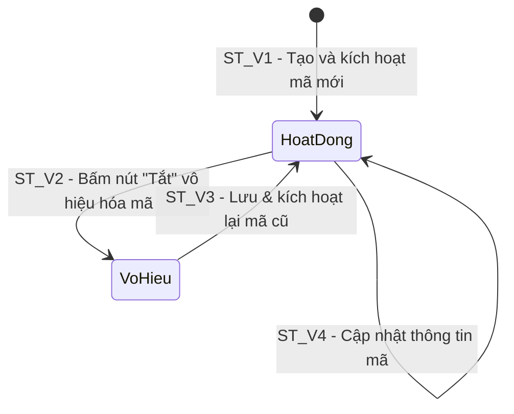

# THIẾT KẾ TEST CASE HỘP ĐEN: QUẢN LÝ MÃ GIẢM GIÁ (ADMIN VOUCHER CRUD)

> **Chức năng:** Quản lý, Thêm mới, Chỉnh sửa (Cập nhật) và Vô hiệu hóa (Xóa mềm) Mã giảm giá dành cho Quản trị viên (`ROLE_ADMIN`).

---

## 1. Xác Định Biến Đầu Vào & Ràng Buộc Nghiệp Vụ (Input Variables)

| Tên Biến | Ý Nghĩa | Kiểu | Ràng Buộc & Miền Giá Trị Hợp Lệ |
| :--- | :--- | :---: | :--- |
| **`code`** | Mã voucher | `String` | Độ dài $[1, 50]$, không rỗng, tự động UPPERCASE |
| **`discountType`** | Loại giảm giá | `Enum` | `PERCENT` (%) hoặc `FIXED` (K VNĐ). Mặc định: `PERCENT` |
| **`discountValue`**| Mức giảm | `double` | $> 0$ (với `PERCENT`: $(0, 100]\%$; với `FIXED`: $> 0$ K VNĐ) |
| **`maxDiscount`** | Trần giảm tối đa | `Double` | $\ge 0$ K VNĐ hoặc `null` (không giới hạn trần) |
| **`minOrderValue`**| Đơn tối thiểu | `double` | $\ge 0$ K VNĐ (mặc định: `0` K VNĐ) |
| **`expiryDate`** | Hạn sử dụng | `Date` | Ngày trong tương lai ($> \text{hiện tại}$) hoặc `null` (vô hạn) |
| **`usageLimit`** | Tổng lượt dùng | `int` | Số nguyên dương $\ge 1$ (mặc định: `100`) |
| **`perUserLimit`**| Lượt / khách | `int` | Số nguyên trong $[1, usageLimit]$ (mặc định: `1`) |
| **`active`** | Kích hoạt | `boolean` | `true` (Hoạt động) hoặc `false` (Vô hiệu) |
| **`currentUserRole`** | Quyền thao tác | `Role` | Bắt buộc `ROLE_ADMIN` (`ROLE_USER` / Guest bị chặn) |

---

## 2. Bảng Phân Hoạch Tương Đương (Equivalence Partitioning - EP)

| STT | Biến / Điều kiện | Lớp hợp lệ (Valid) | Tag | Lớp không hợp lệ (Invalid) | Tag |
| :-: | :--- | :--- | :---: | :--- | :---: |
| **1** | **Quyền truy cập (`currentUserRole`)** | Tài khoản Quản trị viên (`ROLE_ADMIN`) | **V1** | • Khách vãng lai chưa đăng nhập (`Guest`) • Tài khoản người dùng thường (`ROLE_USER`) | **X1** **X2** |
| **2** | **Mã voucher (`code`)** | Chuỗi ký tự độ dài $[1, 50]$ | **V2** | • Để trống hoặc chỉ chứa khoảng trắng • Độ dài vượt quá 50 ký tự ($L > 50$) | **X3** **X4** |
| **3** | **Loại giảm giá (`discountType`)** | • `"PERCENT"` (theo phần trăm) • `"FIXED"` (theo số tiền cố định) | **V3** **V4** | Giá trị sai chuẩn (`"CASH"`, `"RANDOM"`, rỗng) | **X5** |
| **4** | **Giá trị giảm (`discountValue`)** | • `PERCENT`: Thuộc đoạn $(0, 100]$ (%) • `FIXED`: Số thực $> 0$ K VNĐ | **V5** **V6** | • Giá trị $\le 0$ • `PERCENT` vượt trần ($> 100\%$) • Ký tự phi số | **X6** **X7** **X8** |
| **5** | **Trần giảm tối đa (`maxDiscount`)** | • Số thực $\ge 0$ K VNĐ • Giá trị `null` (không giới hạn trần) | **V7** **V8** | • Giá trị âm ($< 0$ K VNĐ) • Ký tự phi số | **X9** **X10** |
| **6** | **Đơn tối thiểu (`minOrderValue`)** | • Bằng 0 K VNĐ (mọi đơn hàng) • Số thực $> 0$ K VNĐ | **V9** **V10** | • Giá trị âm ($< 0$ K VNĐ) • Ký tự phi số | **X11** **X12** |
| **7** | **Hạn sử dụng (`expiryDate`)** | • Ngày trong tương lai ($> \text{hiện tại}$) • Giá trị `null` (vô thời hạn) | **V11** **V12** | • Ngày trong quá khứ ($\le \text{hiện tại}$) • Chuỗi sai định dạng ngày | **X13** **X14** |
| **8** | **Tổng lượt dùng (`usageLimit`)** | Số nguyên dương $\ge 1$ | **V13** | • Số nguyên $\le 0$ • Số thập phân hoặc phi số | **X15** **X16** |
| **9** | **Lượt dùng / khách (`perUserLimit`)** | Số nguyên trong đoạn $[1, usageLimit]$ | **V14** | • Số nguyên $\le 0$ • Vượt tổng lượt ($> usageLimit$) • Số thập phân hoặc phi số | **X17** **X18** **X19** |
| **10** | **Trạng thái kích hoạt (`active`)** | • `true` (Hoạt động) • `false` (Vô hiệu) | **V15** **V16** | Giá trị phi boolean (khác true/false) | **X20** |

---

## 3. Bảng Phân Tích Giá Trị Biên (Robustness BVA - $6n + 1$)

### 3.1 Bảng 7 mốc giá trị biên Robustness BVA cho 6 biến định lượng

*(Ghi chú bộ giá trị danh định chuẩn: `code` $nom = 10\text{ ký tự}$ (`"TESTVOU20"`), `discountType` $nom = \text{"PERCENT"}$, `discountValue` $nom = 20\%$, `maxDiscount` $nom = 50\text{ K ₫}$, `minOrderValue` $nom = 200\text{ K ₫}$, `usageLimit` $nom = 100\text{ lượt}$, `perUserLimit` $nom = 1\text{ lượt}$).*

| Biến Định Lượng | Ngoại biên dưới ($min^-$) | Cận dưới ($min$) | Kề dưới ($min^+$) | Danh định ($nom$) | Kề trên ($max^-$) | Cận trên ($max$) | Ngoại biên trên ($max^+$) | Quy tắc & Giới hạn |
| :--- | :---: | :---: | :---: | :---: | :---: | :---: | :---: | :--- |
| **1. Độ dài `code`** | `0` *(rỗng)* | **`1`** | **`2`** | **`10`** | **`49`** | **`50`** | `51` | Miền $[1, 50]$. Rỗng hoặc $> 50$ báo lỗi |
| **2. `discountValue`** (%) | `0` *(hoặc âm)* | **`1`** | **`2`** | **`20`** | **`99`** | **`100`** | `101` | Miền $(0, 100]\%$. $\le 0$ hoặc $> 100$ báo lỗi |
| **3. `maxDiscount`** (K ₫) | `-1` *(âm)* | **`0`** | **`1`** | **`50`** | **`9.999`** | **`10.000`** | `10.001` | Miền $\ge 0$. Âm báo lỗi |
| **4. `minOrderValue`** (K ₫)| `-1` *(âm)* | **`0`** | **`1`** | **`200`** | **`49.999`** | **`50.000`** | `50.001` | Miền $\ge 0$. Âm báo lỗi |
| **5. `usageLimit`** (Lượt) | `0` *(hoặc âm)* | **`1`** | **`2`** | **`100`** | **`99.999`** | **`100.000`** | `100.001` | Miền $\ge 1$. $\le 0$ báo lỗi |
| **6. `perUserLimit`** (Lượt) | `0` *(hoặc âm)* | **`1`** | **`2`** | **`1`** | **`99`** | **`100`** | `101` | Miền $[1, usageLimit]$. $\le 0$ hoặc $> usageLimit$ báo lỗi |

---

### 3.2 Bảng Đầy Đủ Robustness BVA Test Cases ($6n + 1 = 37$ Ca Kiểm Thử)

| Case | Mã voucher (`code`) | Mức giảm (`discountValue`) | Trần giảm (`maxDiscount`) | Đơn tối thiểu (`minOrderValue`) | Tổng lượt (`usageLimit`) | Lượt/khách (`perUserLimit`) | Mốc kiểm thử | Kết quả mong đợi (Expected Output) | Tag Biên |
| :-: | :--- | :---: | :---: | :---: | :---: | :---: | :---: | :--- | :-: |
| **1** | `"TESTVOU20"` *(nom)* | `20` *(nom)* | `50` *(nom)* | `200` *(nom)* | `100` *(nom)* | `1` *(nom)* | **Tất cả ở nom** | **Hợp lệ:** HTTP 201 Created | **B1** |
| **2** | `""` *(min-)* | `20` | `50` | `200` | `100` | `1` | `code = min-` | **Báo lỗi:** HTTP 400 (Mã không được rỗng) | **B2** |
| **3** | `"V"` *(min)* | `20` | `50` | `200` | `100` | `1` | `code = min` | **Hợp lệ:** HTTP 201 Created (Mã 1 ký tự) | **B3** |
| **4** | `"V1"` *(min+)* | `20` | `50` | `200` | `100` | `1` | `code = min+` | **Hợp lệ:** HTTP 201 Created (Mã 2 ký tự) | **B4** |
| **5** | `[Mã đúng 49 ký tự]` *(max-)* | `20` | `50` | `200` | `100` | `1` | `code = max-` | **Hợp lệ:** HTTP 201 Created (Mã 49 ký tự) | **B5** |
| **6** | `[Mã đúng 50 ký tự]` *(max)* | `20` | `50` | `200` | `100` | `1` | `code = max` | **Hợp lệ:** HTTP 201 Created (Mã 50 ký tự) | **B6** |
| **7** | `[Mã dài 51 ký tự]` *(max+)* | `20` | `50` | `200` | `100` | `1` | `code = max+` | **Báo lỗi:** HTTP 400 (Mã vượt quá 50 ký tự) | **B7** |
| **8** | `"TESTVOU20"` | `0` *(min-)* | `50` | `200` | `100` | `1` | `discountValue = min-` | **Báo lỗi:** HTTP 400 (Mức giảm phải > 0) | **B8** |
| **9** | `"TESTVOU20"` | `1` *(min)* | `50` | `200` | `100` | `1` | `discountValue = min` | **Hợp lệ:** HTTP 201 Created (Giảm 1%) | **B9** |
| **10** | `"TESTVOU20"` | `2` *(min+)* | `50` | `200` | `100` | `1` | `discountValue = min+` | **Hợp lệ:** HTTP 201 Created (Giảm 2%) | **B10**|
| **11** | `"TESTVOU20"` | `99` *(max-)* | `50` | `200` | `100` | `1` | `discountValue = max-` | **Hợp lệ:** HTTP 201 Created (Giảm 99%) | **B11**|
| **12** | `"TESTVOU20"` | `100` *(max)* | `50` | `200` | `100` | `1` | `discountValue = max` | **Hợp lệ:** HTTP 201 Created (Giảm 100%) | **B12**|
| **13** | `"TESTVOU20"` | `101` *(max+)* | `50` | `200` | `100` | `1` | `discountValue = max+` | **Báo lỗi:** HTTP 400 (Mức giảm vượt 100%) | **B13**|
| **14** | `"TESTVOU20"` | `20` | `-1` *(min-)* | `200` | `100` | `1` | `maxDiscount = min-` | **Báo lỗi:** HTTP 400 (Trần giảm không được âm) | **B14**|
| **15** | `"TESTVOU20"` | `20` | `0` *(min)* | `200` | `100` | `1` | `maxDiscount = min` | **Hợp lệ:** HTTP 201 Created (Trần 0 K ₫) | **B15**|
| **16** | `"TESTVOU20"` | `20` | `1` *(min+)* | `200` | `100` | `1` | `maxDiscount = min+` | **Hợp lệ:** HTTP 201 Created (Trần 1 K ₫) | **B16**|
| **17** | `"TESTVOU20"` | `20` | `9999` *(max-)* | `200` | `100` | `1` | `maxDiscount = max-` | **Hợp lệ:** HTTP 201 Created (Trần 9.999 K ₫) | **B17**|
| **18** | `"TESTVOU20"` | `20` | `10000` *(max)* | `200` | `100` | `1` | `maxDiscount = max` | **Hợp lệ:** HTTP 201 Created (Trần 10.000 K ₫) | **B18**|
| **19** | `"TESTVOU20"` | `20` | `10001` *(max+)* | `200` | `100` | `1` | `maxDiscount = max+` | **Kiểm soát:** HTTP 201/400 (Ngưỡng lớn hệ thống) | **B19**|
| **20** | `"TESTVOU20"` | `20` | `50` | `-1` *(min-)* | `100` | `1` | `minOrderValue = min-` | **Báo lỗi:** HTTP 400 (Đơn tối thiểu không được âm) | **B20**|
| **21** | `"TESTVOU20"` | `20` | `50` | `0` *(min)* | `100` | `1` | `minOrderValue = min` | **Hợp lệ:** HTTP 201 Created (Đơn từ 0 K ₫) | **B21**|
| **22** | `"TESTVOU20"` | `20` | `50` | `1` *(min+)* | `100` | `1` | `minOrderValue = min+` | **Hợp lệ:** HTTP 201 Created (Đơn tối thiểu 1 K ₫) | **B22**|
| **23** | `"TESTVOU20"` | `20` | `50` | `49999` *(max-)* | `100` | `1` | `minOrderValue = max-` | **Hợp lệ:** HTTP 201 Created (Đơn 49.999 K ₫) | **B23**|
| **24** | `"TESTVOU20"` | `20` | `50` | `50000` *(max)* | `100` | `1` | `minOrderValue = max` | **Hợp lệ:** HTTP 201 Created (Đơn 50.000 K ₫) | **B24**|
| **25** | `"TESTVOU20"` | `20` | `50` | `50001` *(max+)* | `100` | `1` | `minOrderValue = max+` | **Kiểm soát:** HTTP 201/400 (Ngưỡng lớn hệ thống) | **B25**|
| **26** | `"TESTVOU20"` | `20` | `50` | `200` | `0` *(min-)* | `1` | `usageLimit = min-` | **Báo lỗi:** HTTP 400 (Lượt dùng phải >= 1) | **B26**|
| **27** | `"TESTVOU20"` | `20` | `50` | `200` | `1` *(min)* | `1` | `usageLimit = min` | **Hợp lệ:** HTTP 201 Created (Phát hành 1 lượt) | **B27**|
| **28** | `"TESTVOU20"` | `20` | `50` | `200` | `2` *(min+)* | `1` | `usageLimit = min+` | **Hợp lệ:** HTTP 201 Created (Phát hành 2 lượt) | **B28**|
| **29** | `"TESTVOU20"` | `20` | `50` | `200` | `99999` *(max-)* | `1` | `usageLimit = max-` | **Hợp lệ:** HTTP 201 Created (99.999 lượt) | **B29**|
| **30** | `"TESTVOU20"` | `20` | `50` | `200` | `100000` *(max)* | `1` | `usageLimit = max` | **Hợp lệ:** HTTP 201 Created (Trần 100.000 lượt) | **B30**|
| **31** | `"TESTVOU20"` | `20` | `50` | `200` | `100001` *(max+)* | `1` | `usageLimit = max+` | **Kiểm soát:** HTTP 201/400 (Ngưỡng lớn hệ thống) | **B31**|
| **32** | `"TESTVOU20"` | `20` | `50` | `200` | `100` | `0` *(min-)* | `perUserLimit = min-` | **Báo lỗi:** HTTP 400 (Lượt/khách phải >= 1) | **B32**|
| **33** | `"TESTVOU20"` | `20` | `50` | `200` | `100` | `1` *(min)* | `perUserLimit = min` | **Hợp lệ:** HTTP 201 Created (Mỗi khách 1 lượt) | **B33**|
| **34** | `"TESTVOU20"` | `20` | `50` | `200` | `100` | `2` *(min+)* | `perUserLimit = min+` | **Hợp lệ:** HTTP 201 Created (Mỗi khách 2 lượt) | **B34**|
| **35** | `"TESTVOU20"` | `20` | `50` | `200` | `100` | `99` *(max-)* | `perUserLimit = max-` | **Hợp lệ:** HTTP 201 Created (Mỗi khách 99 lượt) | **B35**|
| **36** | `"TESTVOU20"` | `20` | `50` | `200` | `100` | `100` *(max)* | `perUserLimit = max` | **Hợp lệ:** HTTP 201 Created (Bằng tổng lượt) | **B36**|
| **37** | `"TESTVOU20"` | `20` | `50` | `200` | `100` | `101` *(max+)* | `perUserLimit = max+` | **Báo lỗi:** HTTP 400 (Lượt/khách vượt tổng lượt) | **B37**|

---

## 4. Kỹ Thuật Bảng Quyết Định (Decision Table Testing - DTT)

### 4.1 Bối cảnh & Điều kiện logic
Quá trình xử lý tạo mới hoặc cập nhật mã giảm giá tại `POST /api/v1/admin/vouchers` được chi phối bởi 5 điều kiện nghiệp vụ ($C_1 \to C_5$) và 6 hành động kết quả tương ứng ($A_1 \to A_6$):

* **C1 — Quyền tài khoản:** Người gửi request có quyền Quản trị viên (`currentUserRole == ROLE_ADMIN`)?
* **C2 — Mã không rỗng:** Mã `code` được nhập hợp lệ, không rỗng (`code != null && !code.trim().isEmpty()`)?
* **C3 — Mức giảm hợp lệ:** Giá trị giảm giá lớn hơn 0 (`discountValue > 0`)?
* **C4 — Tỷ lệ % hợp lệ:** Nếu là `PERCENT` thì mức giảm có nằm trong đoạn $(0, 100]$?
* **C5 — Giới hạn khách hợp lệ:** Số lượt dùng mỗi khách không vượt quá tổng lượt (`perUserLimit <= usageLimit`)?

### 4.2 Bảng Quyết Định Chuẩn (Decision Table: 6 Rules - Định dạng Y/N và X/-)

| | Condition/Action | R1 | R2 | R3 | R4 | R5 | R6 |
| :---: | :--- | :---: | :---: | :---: | :---: | :---: | :---: |
| **C1** | Quyền là Admin (`ROLE_ADMIN`) | **Y** | **N** | **Y** | **Y** | **Y** | **Y** |
| **C2** | Mã `code` không để trống | **Y** | - | **N** | **Y** | **Y** | **Y** |
| **C3** | Mức giảm `discountValue > 0` | **Y** | - | - | **N** | **Y** | **Y** |
| **C4** | Tỷ lệ giảm % hợp lệ ($\le 100$) | **Y** | - | - | - | **N** | **Y** |
| **C5** | Giới hạn `perUserLimit <= usageLimit` | **Y** | - | - | - | - | **N** |
| **A1** | Tạo / Cập nhật thành công (HTTP 201 Created) | **X** | - | - | - | - | - |
| **A2** | Chặn phân quyền (HTTP 401/403 Forbidden) | - | **X** | - | - | - | - |
| **A3** | Báo lỗi: "Mã giảm giá không được để trống!" (HTTP 400) | - | - | **X** | - | - | - |
| **A4** | Báo lỗi: "Giá trị giảm giá phải lớn hơn 0!" (HTTP 400) | - | - | - | **X** | - | - |
| **A5** | Báo lỗi: Phần trăm giảm giá không được vượt quá 100% | - | - | - | - | **X** | - |
| **A6** | Báo lỗi: Giới hạn mỗi người dùng không hợp lệ | - | - | - | - | - | **X** |
| **Tag** | **Tag định danh kiểm thử** | **D1** | **D2** | **D3** | **D4** | **D5** | **D6** |

---

## 5. Kỹ Thuật Chuyển Đổi Trạng Thái (State Transition Testing - STT)

### 5.1 Sơ đồ chuyển đổi trạng thái vòng đời Voucher trên Giao diện Admin

Thực thể Voucher được kiểm soát qua trường `active` trong CSDL với **2 trạng thái**:
* **`Hoạt động`** (`active = true`): Badge màu xanh lá, kèm nút bấm **`Tắt`**.
* **`Vô hiệu`** (`active = false`): Badge màu xám, hiển thị văn bản **`Đã tắt`**.

### 5.2 Bảng Chuyển đổi trạng thái (State Transition Table)

| Trạng thái ban đầu ($S_i$) | Sự kiện kích hoạt (Event) | Điều kiện bảo vệ (Guard Condition) | Trạng thái tiếp theo ($S_{i+1}$) | Kết quả hiển thị & Trạng thái | Tag |
| :--- | :--- | :--- | :---: | :--- | :---: |
| **None** (Chưa có) | Admin bấm *"Lưu & Kích Hoạt Voucher"* | Gửi form với mã mới | **`Hoạt động`** | HTTP 201, Badge xanh **`Hoạt động`**, nút **`Tắt`** | **ST_V1** |
| **`Hoạt động`** | Admin bấm nút **`Tắt`** | Gửi yêu cầu vô hiệu hóa mã | **`Vô hiệu`** | HTTP 200, Badge xám **`Vô hiệu`**, chữ **`Đã tắt`** | **ST_V2** |
| **`Vô hiệu`** | Admin nhập lại mã cũ và bấm Lưu | Gửi form (`active = true`) | **`Hoạt động`** | HTTP 201, chuyển lại Badge xanh **`Hoạt động`** | **ST_V3** |
| **`Hoạt động`** | Admin cập nhật thông tin mã | Gửi form với dữ liệu mới | **`Hoạt động`** | HTTP 201, cập nhật dữ liệu, giữ **`Hoạt động`** | **ST_V4** |

---

## 6. Thiết Kế Bảng Test Cases Chi Tiết Triển Khai (Tối Ưu & Đầy Đủ Bao Phủ)

| STT | Mã Test Case | Tên ca kiểm thử | Dữ liệu kiểm thử (Test Input Data) | Kết quả mong đợi (Expected Output) | Tag được bao phủ |
| :-: | :--- | :--- | :--- | :--- | :---: |
| **1** | **TC_VOU_01** | Quản trị viên xem danh sách toàn bộ voucher thành công | • `currentUserRole`: `ROLE_ADMIN` • `currentUsername`: `manager1` | **Thành công:** Tải danh sách voucher đầy đủ các cột và badge trạng thái. | **V1** |
| **2** | **TC_VOU_02** | Chặn tài khoản người dùng thường (`ROLE_USER`) xem/thao tác voucher | • `currentUserRole`: `ROLE_USER` • `currentUsername`: `employee1` | **Bị chặn:** HTTP 403 Forbidden. | **X2, D2** |
| **3** | **TC_VOU_03** | Chặn khách vãng lai chưa đăng nhập (`Guest`) truy cập API voucher | • Tài khoản: Khách vãng lai (`Guest`) | **Bị chặn:** HTTP 401 Unauthorized / 403 Forbidden. | **X1** |
| **4** | **TC_VOU_04** | Tạo thành công voucher phần trăm danh định ($nom$) đầy đủ tham số | • `code`: `"TESTVOU20"` • `type`: `"PERCENT"`, `val`: `20`, `max`: `50`, `min`: `200` • `expiryDate`: `"2026-12-31"`, `usage`: `100`, `perUser`: `1`, `active`: `true` | **Hợp lệ:** HTTP 201 Created, hiển thị nhãn xanh **Hoạt động**. | **V2, V3, V5, V7, V9, V11, V13, V14, V15, B1, D1, ST_V1** |
| **5** | **TC_VOU_05** | Tạo thành công voucher số tiền cố định (`FIXED`) không trần và vô hạn | • `code`: `"FIX50K"` • `type`: `"FIXED"`, `val`: `50`, `max`: `null`, `min`: `300` • `expiryDate`: `null`, `usage`: `200`, `perUser`: `2`, `active`: `true` | **Hợp lệ:** HTTP 201 Created, tạo voucher 50K cố định vô thời hạn. | **V4, V6, V8, V10, V12** |
| **6** | **TC_VOU_06** | Vô hiệu hóa (tắt) voucher đang hoạt động chuyển sang trạng thái `Vô hiệu` | • Trạng thái ban đầu: `TESTVOU20` đang **Hoạt động** • Gửi yêu cầu vô hiệu hóa mã `TESTVOU20` | **Thành công:** HTTP 200 OK, chuyển trạng thái sang **Vô hiệu**. | **V16, ST_V2** |
| **7** | **TC_VOU_07** | Tái kích hoạt voucher đã vô hiệu chuyển lại sang `Hoạt động` | • Trạng thái ban đầu: `TESTVOU20` đang **Vô hiệu** • Gửi form cập nhật `code = TESTVOU20` với `active = true` | **Thành công:** HTTP 201 Created, tái kích hoạt lại **Hoạt động**. | **ST_V3** |
| **8** | **TC_VOU_08** | Cập nhật chi tiết voucher đang hoạt động, duy trì trạng thái `Hoạt động` | • Trạng thái ban đầu: `TESTVOU20` đang **Hoạt động** với mức giảm `20%` • Gửi form cập nhật `code = TESTVOU20`, đổi mức giảm thành `25%` | **Thành công:** HTTP 201 Created, cập nhật mức giảm, duy trì **Hoạt động**. | **ST_V4** |
| **9** | **TC_VOU_09** | Xử lý an toàn khi gửi yêu cầu vô hiệu hóa mã không tồn tại trong CSDL | • `code`: `"MISSING_CODE_999"` (không tồn tại trong CSDL) • Gửi yêu cầu vô hiệu hóa | **Báo lỗi:** HTTP 404 Not Found (Không tìm thấy mã giảm giá). | **D1** |
| **10** | **TC_VOU_10** | Tạo/Cập nhật thành công với tất cả các trường ở cận biên tối thiểu ($min$) | • `code`: `"V"` (1 ký tự) • `val`: `1%`, `max`: `0`, `min`: `0`, `usage`: `1`, `perUser`: `1` • `type`: `"PERCENT"`, `active`: `true` | **Hợp lệ:** HTTP 201 Created, lưu thành công mốc cận dưới ($min$). | **B3, B9, B15, B21, B27, B33** |
| **11** | **TC_VOU_11** | Tạo/Cập nhật thành công với các trường ở cận biên kề cận dưới ($min^+$) | • `code`: `"V1"` (2 ký tự) • `val`: `2%`, `max`: `1`, `min`: `1`, `usage`: `2`, `perUser`: `2` • `type`: `"PERCENT"`, `active`: `true` | **Hợp lệ:** HTTP 201 Created, lưu thành công mốc kề cận dưới ($min^+$). | **B4, B10, B16, B22, B28, B34** |
| **12** | **TC_VOU_12** | Tạo/Cập nhật thành công với các trường ở cận biên kề cận trên ($max^-$) | • `code`: Chuỗi 49 ký tự • `val`: `99%`, `max`: `9.999`, `min`: `49.999`, `usage`: `99.999`, `perUser`: `99` • `type`: `"PERCENT"`, `active`: `true` | **Hợp lệ:** HTTP 201 Created, lưu thành công mốc kề cận trên ($max^-$). | **B5, B11, B17, B23, B29, B35** |
| **13** | **TC_VOU_13** | Tạo/Cập nhật thành công với các trường ở cận biên tối đa hợp lệ ($max$) | • `code`: Chuỗi 50 ký tự • `val`: `100%`, `max`: `10.000`, `min`: `50.000`, `usage`: `100.000`, `perUser`: `100` • `type`: `"PERCENT"`, `active`: `true` | **Hợp lệ:** HTTP 201 Created, lưu thành công mốc chạm trần ($max$). | **B6, B12, B18, B24, B30, B36** |
| **14** | **TC_VOU_14** | Kiểm soát xử lý các mốc ngoại biên trên cho phép ($max^+$) | • `max`: `10.001`, `min`: `50.001`, `usage`: `100.001` (ngưỡng lớn ngoại biên trên) • Các trường khác điền giá trị danh định chuẩn | **Kiểm soát:** HTTP 201/400 Tiếp nhận thành công hoặc cảnh báo ngưỡng lớn. | **B19, B25, B31** |
| **15** | **TC_VOU_15** | Báo lỗi khi mã voucher `code` để trống/khoảng trắng ($min^-$) hoặc vượt quá 50 ký tự ($max^+$) | • Thử nghiệm `code`: rỗng `""`, toàn khoảng trắng `"   "`, hoặc chuỗi dài 51 ký tự | **Không hợp lệ:** HTTP 400 (Mã không được để trống / vượt quá 50 ký tự). | **X3, X4, B2, B7, D3** |
| **16** | **TC_VOU_16** | Báo lỗi khi loại hình giảm giá `discountType` chứa giá trị không hợp lệ | • `discountType`: `"CASH"`, `"RANDOM"` hoặc chuỗi rỗng | **Không hợp lệ:** HTTP 400 (Loại hình giảm giá không hợp lệ). | **X5** |
| **17** | **TC_VOU_17** | Báo lỗi khi mức giảm giá `discountValue` bằng 0 ($min^-$) hoặc số âm | • Thử nghiệm `discountValue`: `0` hoặc `-10` | **Không hợp lệ:** HTTP 400 (Giá trị giảm giá phải lớn hơn 0). | **X6, B8, D4** |
| **18** | **TC_VOU_18** | Báo lỗi khi loại `PERCENT` có mức giảm vượt trần 100% ($max^+$) | • `discountType`: `"PERCENT"`, `discountValue`: `101` | **Không hợp lệ:** HTTP 400 (Phần trăm giảm giá không được vượt quá 100%). | **X7, B13, D5** |
| **19** | **TC_VOU_19** | Báo lỗi khi trường mức giảm giá `discountValue` chứa ký tự phi số | • `discountValue`: Chuỗi phi số (`"abc"`, `"#@$"`) | **Không hợp lệ:** HTTP 400 (Sai định dạng kiểu dữ liệu số). | **X8** |
| **20** | **TC_VOU_20** | Báo lỗi khi mức giảm tối đa `maxDiscount` là số âm ($min^-$) hoặc chứa ký tự phi số | • Thử nghiệm `maxDiscount`: Số âm (`-1`) hoặc ký tự phi số (`"xyz"`) | **Không hợp lệ:** HTTP 400 (Mức giảm tối đa không được âm hoặc phi số). | **X9, X10, B14** |
| **21** | **TC_VOU_21** | Báo lỗi khi giá trị đơn hàng tối thiểu `minOrderValue` là số âm ($min^-$) hoặc chứa ký tự phi số | • Thử nghiệm `minOrderValue`: Số âm (`-1`) hoặc ký tự phi số (`"abc"`) | **Không hợp lệ:** HTTP 400 (Đơn tối thiểu không được âm hoặc phi số). | **X11, X12, B20** |
| **22** | **TC_VOU_22** | Báo lỗi khi hạn sử dụng `expiryDate` là thời điểm trong quá khứ hoặc sai chuẩn định dạng | • Thử nghiệm `expiryDate`: Ngày quá khứ (`"2020-01-01"`) hoặc sai chuẩn (`"invalid-date"`) | **Không hợp lệ:** HTTP 400 (Hạn dùng phải trong tương lai và đúng định dạng). | **X13, X14** |
| **23** | **TC_VOU_23** | Báo lỗi khi tổng số lượt dùng `usageLimit` bằng 0, số âm ($min^-$) hoặc là số thập phân / phi số | • Thử nghiệm `usageLimit`: `0`, số âm (`-5`), thập phân (`10.5`), hoặc phi số (`"abc"`) | **Không hợp lệ:** HTTP 400 (Tổng lượt dùng phải là số nguyên dương $\ge 1$). | **X15, X16, B26** |
| **24** | **TC_VOU_24** | Báo lỗi khi số lượt dùng mỗi khách `perUserLimit` bằng 0, âm ($min^-$), vượt quá tổng lượt ($max^+$), hoặc phi số | • Thử nghiệm `perUserLimit`: `0`, số âm (`-1`), vượt tổng lượt (`101 > 100`), hoặc phi số | **Không hợp lệ:** HTTP 400 (Lượt/khách phải trong khoảng $[1, usageLimit]$). | **X17, X18, X19, B32, B37, D6** |
| **25** | **TC_VOU_25** | Báo lỗi khi trạng thái kích hoạt `active` nhận giá trị phi boolean | • `active`: Nhận giá trị chuỗi chữ `"not_boolean"` hoặc số khác 0/1 | **Không hợp lệ:** HTTP 400 (Trạng thái kích hoạt phải là kiểu boolean). | **X20** |
