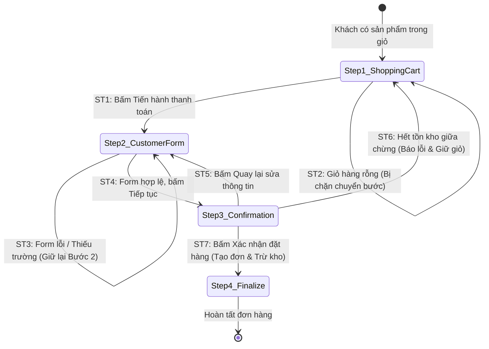

# THIẾT KẾ TEST CASE HỘP ĐEN: QUY TRÌNH THANH TOÁN & ĐẶT HÀNG (CHECKOUT - ORDER PLACEMENT)

> **Chức năng:** Quy trình xác thực thông tin giao hàng, kiểm soát tồn kho, áp dụng chiết khấu voucher và hoàn tất đơn hàng (`/shoppingCartCustomer` $\rightarrow$ `/shoppingCartConfirmation` $\rightarrow$ `/shoppingCartFinalize`).  
> **Người thực hiện:** Nguyễn Hoàng Phương (MSSV: `080205010954` / `NguyenHoangPhuong275`)

---

## 1. Xác Định Biến Đầu Vào & Ràng Buộc Nghiệp Vụ (Input Variables)

| Tên Biến | Ý Nghĩa | Kiểu | Ràng Buộc & Miền Giá Trị Hợp Lệ |
| :--- | :--- | :---: | :--- |
| **`cartLines`** | Danh sách sản phẩm trong giỏ | `List<CartLine>` | Bắt buộc khác rỗng (`size > 0`), mỗi dòng có `quantity > 0` |
| **`customerName`** | Họ và tên người nhận | `String` | Độ dài $[1, 255]$ ký tự, không chứa ký tự cấm (`@#$%^&*...`) |
| **`customerAddress`**| Địa chỉ giao hàng | `String` | Độ dài $[1, 255]$ ký tự, không chứa chuỗi injection/script |
| **`customerEmail`** | Địa chỉ email liên hệ | `String` | Độ dài $[6, 128]$ ký tự, đúng định dạng `user@domain.ext` |
| **`customerPhone`** | Số điện thoại nhận hàng | `String` | Độ dài $[1, 20]$ ký tự (chuẩn $[10, 11]$ chữ số), chỉ chứa số |
| **`stockQuantity`** | Tồn kho sản phẩm tại thời điểm chốt | `int` | $stockQuantity \ge quantity$ (Đủ hàng đáp ứng) |
| **`voucherCode`** | Mã giảm giá đính kèm | `String` | Tùy chọn (`null` / rỗng); nếu có: mã phải active, còn hạn, còn lượt |
| **`currentUser`** | Trạng thái đăng nhập | `User` | Khách vãng lai (`Guest`) hoặc Thành viên (`ROLE_CUSTOMER` / `ADMIN`) |

---

## 2. Bảng Phân Hoạch Tương Đương (Equivalence Partitioning - EP)

| STT | Biến / Điều kiện | Lớp hợp lệ (Valid) | Tag | Lớp không hợp lệ (Invalid) | Tag |
| :-: | :--- | :--- | :---: | :--- | :---: |
| **1** | **Giỏ hàng (`cartLines`)** | Giỏ hàng có chứa $\ge 1$ sản phẩm hợp lệ | **V1** | • Giỏ hàng rỗng (`cart = null` hoặc `lines = []`)<br>• Dòng hàng chứa số lượng $\le 0$ | **X1**<br>**X2** |
| **2** | **Họ tên (`customerName`)** | Chuỗi $[1, 255]$ ký tự không chứa ký tự cấm | **V2** | • Để trống / toàn khoảng trắng<br>• Vượt quá 255 ký tự ($L > 255$)<br>• Chứa ký tự cấm (`@#$%^&*<>~{}`) | **X3**<br>**X4**<br>**X5** |
| **3** | **Địa chỉ (`customerAddress`)** | Chuỗi $[1, 255]$ ký tự không chứa mã độc | **V3** | • Để trống / rỗng<br>• Vượt quá 255 ký tự ($L > 255$)<br>• Chứa thẻ HTML / Script injection | **X6**<br>**X7**<br>**X8** |
| **4** | **Email (`customerEmail`)** | Chuỗi $[6, 128]$ ký tự đúng cú pháp email | **V4** | • Để trống<br>• Dưới 6 ký tự ($L < 6$)<br>• Vượt quá 128 ký tự ($L > 128$)<br>• Sai định dạng cú pháp email | **X9**<br>**X10**<br>**X11**<br>**X12** |
| **5** | **Điện thoại (`customerPhone`)** | Chuỗi $[1, 20]$ ký tự (10-11 số hợp lệ) | **V5** | • Để trống<br>• Vượt quá 20 ký tự ($L > 20$)<br>• Chứa chữ cái hoặc ký tự đặc biệt | **X13**<br>**X14**<br>**X15** |
| **6** | **Tồn kho (`stockQuantity`)** | $stockQuantity \ge orderQuantity$ | **V6** | Tồn kho không đủ đáp ứng ($stock < quantity$) | **X16** |
| **7** | **Trạng thái SP (`productState`)** | Sản phẩm `ACTIVE` (đang kinh doanh) | **V7** | Sản phẩm `INACTIVE` / `DRAFT` / Bị xóa | **X17** |
| **8** | **Mã giảm giá (`voucherCode`)** | • Không dùng voucher (`null`)<br>• Voucher hợp lệ thỏa mãn mọi điều kiện | **V8**<br>**V9** | Voucher không tồn tại, hết hạn, hết lượt, hoặc không đủ đơn tối thiểu | **X18** |

---

## 3. Bảng Phân Tích Giá Trị Biên (Robustness BVA - $6n + 1$)

### 3.1 Bảng 7 mốc giá trị biên Robustness BVA cho 5 biến định lượng

*(Ghi chú bộ giá trị danh định chuẩn: `name` $nom = \text{"Nguyễn Hoàng Phương"}$ (20 ký tự), `address` $nom = \text{"123 Lê Lợi, P. Bến Nghé, Q1"}$ (27 ký tự), `email` $nom = \text{"phuong@gmail.com"}$ (16 ký tự), `phone` $nom = \text{"0912345678"}$ (10 số), `qty` $nom = 2$ với tồn kho $stock = 10$).*

| Biến Định Lượng | Ngoại biên dưới ($min^-$) | Cận dưới ($min$) | Kề dưới ($min^+$) | Danh định ($nom$) | Kề trên ($max^-$) | Cận trên ($max$) | Ngoại biên trên ($max^+$) | Quy tắc & Giới hạn |
| :--- | :---: | :---: | :---: | :---: | :---: | :---: | :---: | :--- |
| **1. Độ dài `customerName`** | `0` *(rỗng)* | **`1`** | **`2`** | **`20`** | **`254`** | **`255`** | `256` | Miền $[1, 255]$. Rỗng hoặc $> 255$ báo lỗi |
| **2. Độ dài `customerAddress`**| `0` *(rỗng)* | **`1`** | **`2`** | **`27`** | **`254`** | **`255`** | `256` | Miền $[1, 255]$. Rỗng hoặc $> 255$ báo lỗi |
| **3. Độ dài `customerEmail`** | `5` | **`6`** | **`7`** | **`16`** | **`127`** | **`128`** | `129` | Miền $[6, 128]$. $< 6$ hoặc $> 128$ báo lỗi |
| **4. Độ dài `customerPhone`** | `0` *(rỗng)* | **`1`** | **`2`** | **`10`** | **`19`** | **`20`** | `21` | Miền $[1, 20]$. Rỗng hoặc $> 20$ báo lỗi |
| **5. Số lượng `orderQuantity`**| `0` *(hủy)* | **`1`** | **`2`** | **`2`** | **`9`** | **`10`** | `11` *(vượt)* | Miền $[1, 10]$ (Tồn kho = 10). $> 10$ báo lỗi thiếu kho |

---

### 3.2 Bảng Đầy Đủ Robustness BVA Test Cases ($6n + 1 = 31$ Ca Kiểm Thử)

| Case | Tên nhận (`name`) | Địa chỉ (`address`) | Email (`email`) | SĐT (`phone`) | Số lượng (`qty`) | Mốc kiểm thử | Kết quả mong đợi (Expected Output) | Tag Biên |
| :-: | :--- | :--- | :--- | :--- | :---: | :---: | :--- | :-: |
| **1** | `"Nguyễn Hoàng Phương"` *(nom)* | `"123 Lê Lợi, Q1"` *(nom)* | `"phuong@gmail.com"` *(nom)* | `"0912345678"` *(nom)* | `2` *(nom)* | **Tất cả ở nom** | **Hợp lệ:** Xác nhận và đặt hàng thành công | **B1** |
| **2** | `""` *(min-)* | `"123 Lê Lợi, Q1"` | `"phuong@gmail.com"` | `"0912345678"` | `2` | `name = min-` | **Lỗi:** Họ tên không được để trống | **B2** |
| **3** | `"N"` *(min)* | `"123 Lê Lợi, Q1"` | `"phuong@gmail.com"` | `"0912345678"` | `2` | `name = min` | **Hợp lệ:** Tiếp nhận tên 1 ký tự | **B3** |
| **4** | `"Ng"` *(min+)* | `"123 Lê Lợi, Q1"` | `"phuong@gmail.com"` | `"0912345678"` | `2` | `name = min+` | **Hợp lệ:** Tiếp nhận tên 2 ký tự | **B4** |
| **5** | `[254 ký tự]` *(max-)* | `"123 Lê Lợi, Q1"` | `"phuong@gmail.com"` | `"0912345678"` | `2` | `name = max-` | **Hợp lệ:** Tiếp nhận tên 254 ký tự | **B5** |
| **6** | `[255 ký tự]` *(max)* | `"123 Lê Lợi, Q1"` | `"phuong@gmail.com"` | `"0912345678"` | `2` | `name = max` | **Hợp lệ:** Tiếp nhận tên 255 ký tự | **B6** |
| **7** | `[256 ký tự]` *(max+)* | `"123 Lê Lợi, Q1"` | `"phuong@gmail.com"` | `"0912345678"` | `2` | `name = max+` | **Lỗi:** Họ tên tối đa 255 ký tự | **B7** |
| **8** | `"Nguyễn Hoàng Phương"` | `""` *(min-)* | `"phuong@gmail.com"` | `"0912345678"` | `2` | `address = min-` | **Lỗi:** Địa chỉ không được để trống | **B8** |
| **9** | `"Nguyễn Hoàng Phương"` | `"1"` *(min)* | `"phuong@gmail.com"` | `"0912345678"` | `2` | `address = min` | **Hợp lệ:** Tiếp nhận địa chỉ 1 ký tự | **B9** |
| **10**| `"Nguyễn Hoàng Phương"` | `"12"` *(min+)* | `"phuong@gmail.com"` | `"0912345678"` | `2` | `address = min+` | **Hợp lệ:** Tiếp nhận địa chỉ 2 ký tự | **B10**|
| **11**| `"Nguyễn Hoàng Phương"` | `[254 ký tự]` *(max-)* | `"phuong@gmail.com"` | `"0912345678"` | `2` | `address = max-` | **Hợp lệ:** Tiếp nhận địa chỉ 254 ký tự | **B11**|
| **12**| `"Nguyễn Hoàng Phương"` | `[255 ký tự]` *(max)* | `"phuong@gmail.com"` | `"0912345678"` | `2` | `address = max` | **Hợp lệ:** Tiếp nhận địa chỉ 255 ký tự | **B12**|
| **13**| `"Nguyễn Hoàng Phương"` | `[256 ký tự]` *(max+)* | `"phuong@gmail.com"` | `"0912345678"` | `2` | `address = max+` | **Lỗi:** Địa chỉ tối đa 255 ký tự | **B13**|
| **14**| `"Nguyễn Hoàng Phương"` | `"123 Lê Lợi, Q1"` | `"a@b.c"` *(min-)* | `"0912345678"` | `2` | `email = min-` | **Lỗi:** Email tối thiểu 6 ký tự | **B14**|
| **15**| `"Nguyễn Hoàng Phương"` | `"123 Lê Lợi, Q1"` | `"a@b.co"` *(min)* | `"0912345678"` | `2` | `email = min` | **Hợp lệ:** Tiếp nhận email 6 ký tự (`a@b.co`) | **B15**|
| **16**| `"Nguyễn Hoàng Phương"` | `"123 Lê Lợi, Q1"` | `"ab@b.co"` *(min+)* | `"0912345678"` | `2` | `email = min+` | **Hợp lệ:** Tiếp nhận email 7 ký tự | **B16**|
| **17**| `"Nguyễn Hoàng Phương"` | `"123 Lê Lợi, Q1"` | `[127 ký tự]` *(max-)* | `"0912345678"` | `2` | `email = max-` | **Hợp lệ:** Tiếp nhận email 127 ký tự | **B17**|
| **18**| `"Nguyễn Hoàng Phương"` | `"123 Lê Lợi, Q1"` | `[128 ký tự]` *(max)* | `"0912345678"` | `2` | `email = max` | **Hợp lệ:** Tiếp nhận email 128 ký tự | **B18**|
| **19**| `"Nguyễn Hoàng Phương"` | `"123 Lê Lợi, Q1"` | `[129 ký tự]` *(max+)* | `"0912345678"` | `2` | `email = max+` | **Lỗi:** Email tối đa 128 ký tự | **B19**|
| **20**| `"Nguyễn Hoàng Phương"` | `"123 Lê Lợi, Q1"` | `"phuong@gmail.com"` | `""` *(min-)* | `2` | `phone = min-` | **Lỗi:** Số điện thoại không được để trống | **B20**|
| **21**| `"Nguyễn Hoàng Phương"` | `"123 Lê Lợi, Q1"` | `"phuong@gmail.com"` | `"1"` *(min)* | `2` | `phone = min` | **Hợp lệ:** Tiếp nhận SĐT 1 ký tự | **B21**|
| **22**| `"Nguyễn Hoàng Phương"` | `"123 Lê Lợi, Q1"` | `"phuong@gmail.com"` | `"12"` *(min+)* | `2` | `phone = min+` | **Hợp lệ:** Tiếp nhận SĐT 2 ký tự | **B22**|
| **23**| `"Nguyễn Hoàng Phương"` | `"123 Lê Lợi, Q1"` | `"phuong@gmail.com"` | `[19 số]` *(max-)* | `2` | `phone = max-` | **Hợp lệ:** Tiếp nhận SĐT 19 ký tự | **B23**|
| **24**| `"Nguyễn Hoàng Phương"` | `"123 Lê Lợi, Q1"` | `"phuong@gmail.com"` | `[20 số]` *(max)* | `2` | `phone = max` | **Hợp lệ:** Tiếp nhận SĐT 20 ký tự | **B24**|
| **25**| `"Nguyễn Hoàng Phương"` | `"123 Lê Lợi, Q1"` | `"phuong@gmail.com"` | `[21 số]` *(max+)* | `2` | `phone = max+` | **Lỗi:** Số điện thoại tối đa 20 ký tự | **B25**|
| **26**| `"Nguyễn Hoàng Phương"` | `"123 Lê Lợi, Q1"` | `"phuong@gmail.com"` | `"0912345678"` | `0` *(min-)* | `qty = min-` | **Lỗi:** Số lượng đặt phải lớn hơn 0 | **B26**|
| **27**| `"Nguyễn Hoàng Phương"` | `"123 Lê Lợi, Q1"` | `"phuong@gmail.com"` | `"0912345678"` | `1` *(min)* | `qty = min` | **Hợp lệ:** Đặt mua 1 sản phẩm | **B27**|
| **28**| `"Nguyễn Hoàng Phương"` | `"123 Lê Lợi, Q1"` | `"phuong@gmail.com"` | `"0912345678"` | `2` *(min+)* | `qty = min+` | **Hợp lệ:** Đặt mua 2 sản phẩm | **B28**|
| **29**| `"Nguyễn Hoàng Phương"` | `"123 Lê Lợi, Q1"` | `"phuong@gmail.com"` | `"0912345678"` | `9` *(max-)* | `qty = max-` | **Hợp lệ:** Đặt mua 9 sản phẩm | **B29**|
| **30**| `"Nguyễn Hoàng Phương"` | `"123 Lê Lợi, Q1"` | `"phuong@gmail.com"` | `"0912345678"` | `10` *(max)* | `qty = max` | **Hợp lệ:** Đặt mua toàn bộ tồn kho 10 SP | **B30**|
| **31**| `"Nguyễn Hoàng Phương"` | `"123 Lê Lợi, Q1"` | `"phuong@gmail.com"` | `"0912345678"` | `11` *(max+)* | `qty = max+` | **Lỗi:** Không đủ số lượng trong kho | **B31**|

---

## 4. Kỹ Thuật Bảng Quyết Định (Decision Table Testing)

### 4.1 Bảng Quyết Định Rút Gọn (Collapsed Decision Table - 7 Rules)

| Điều kiện / Hành động | Rule 1 (Giỏ rỗng) | Rule 2 (Lỗi Form) | Rule 3 (Lỗi Dòng) | Rule 4 (Lỗi SP) | Rule 5 (Lỗi Kho) | Rule 6 (Lỗi Voucher) | Rule 7 (Thành Công) |
| :--- | :---: | :---: | :---: | :---: | :---: | :---: | :---: |
| **C1: Giỏ hàng có dữ liệu (Not Null & Not Empty)?** | **N** | Y | Y | Y | Y | Y | Y |
| **C2: Form giao hàng hợp lệ (4 trường)?** | - | **N** | Y | Y | Y | Y | Y |
| **C3: Dòng hàng CartLine hợp lệ ($qty \ge 1$)?** | - | - | **N** | Y | Y | Y | Y |
| **C4: Sản phẩm đang kinh doanh (`ACTIVE`)?** | - | - | - | **N** | Y | Y | Y |
| **C5: Tồn kho đủ đáp ứng ($stock \ge qty$)?** | - | - | - | - | **N** | Y | Y |
| **C6: Mã Voucher hợp lệ / Không dùng mã?** | - | - | - | - | - | **N** | **Y** |
| *A1: Từ chối & Chuyển hướng về `/shoppingCart`* | **X** | - | - | - | - | - | - |
| *A2: Giữ lại Bước 2 & Hiển thị lỗi Form* | - | **X** | - | - | - | - | - |
| *A3: Ném IllegalArgumentException (Dòng lỗi)* | - | - | **X** | - | - | - | - |
| *A4: Ném IllegalStateException (SP ngừng bán)* | - | - | - | **X** | - | - | - |
| *A5: Ném IllegalStateException (Thiếu kho)* | - | - | - | - | **X** | - | - |
| *A6: Ném IllegalStateException (Voucher lỗi)* | - | - | - | - | - | **X** | - |
| *A7: Tạo Order, Trừ kho, Sang Bước 4 (Finalize)* | - | - | - | - | - | - | **X** |
| **Tag Bảng Quyết Định** | **D1** | **D2** | **D3** | **D4** | **D5** | **D6** | **D7** |

*Giải thích quy tắc nghiệp vụ:*
- **Rule 1 (`D1`):** Giỏ hàng rỗng khi truy cập thanh toán $\to$ Từ chối và chuyển hướng về trang Giỏ hàng `/shoppingCart`.
- **Rule 2 (`D2`):** Thông tin người nhận điền thiếu hoặc sai định dạng $\to$ Giữ lại Bước 2, báo lỗi form.
- **Rule 3 (`D3`):** Dòng sản phẩm có số lượng không hợp lệ $\le 0 \to$ Báo lỗi `IllegalArgumentException`.
- **Rule 4 (`D4`):** Sản phẩm trong giỏ đã bị ẩn hoặc ngừng bán $\to$ Báo lỗi `IllegalStateException`.
- **Rule 5 (`D5`):** Số lượng đặt mua vượt quá tồn kho thực tế $\to$ Báo lỗi `IllegalStateException: Không đủ số lượng trong kho`.
- **Rule 6 (`D6`):** Voucher không hợp lệ hoặc không đủ điều kiện tối thiểu $\to$ Báo lỗi từ chối áp dụng voucher.
- **Rule 7 (`D7`):** Thỏa mãn mọi điều kiện $\to$ Tạo Order, Trừ tồn kho, Xóa giỏ hàng và hoàn tất đơn hàng.

---

## 5. Kỹ Thuật Kiểm Thử Chuyển Đổi Trạng Thái (State Transition Testing - STT)

### 5.1 Sơ đồ chuyển đổi trạng thái quy trình đặt hàng



### 5.2 Bảng phân tích chi tiết các Ca chuyển đổi trạng thái (State Transition Details)

| Mã Transition | Bước hiện tại | Sự kiện / Hành vi người dùng | Bước tiếp theo | Kết quả xử lý hệ thống | Tag |
| :---: | :--- | :--- | :--- | :--- | :---: |
| **ST_01** | `Step 1: ShoppingCart` | Bấm "Tiến hành đặt hàng" (Giỏ có hàng) | `Step 2: CustomerForm` | Điều hướng sang màn hình điền thông tin | **ST1** |
| **ST_02** | `Step 1: ShoppingCart` | Truy cập Checkout khi giỏ hàng rỗng | `Step 1: ShoppingCart` | Chặn chuyển bước, redirect về `/shoppingCart` | **ST2** |
| **ST_03** | `Step 2: CustomerForm` | Submit form giao hàng thiếu/sai trường | `Step 2: CustomerForm` | Giữ nguyên form, hiển thị lỗi validate | **ST3** |
| **ST_04** | `Step 2: CustomerForm` | Submit form giao hàng hợp lệ | `Step 3: Confirmation` | Lưu thông tin tạm, điều hướng trang xác nhận | **ST4** |
| **ST_05** | `Step 3: Confirmation` | Bấm nút "Quay lại" (Back) | `Step 2: CustomerForm` | Quay lại form sửa thông tin, dữ liệu giữ nguyên | **ST5** |
| **ST_06** | `Step 3: Confirmation` | Bấm đặt hàng khi sản phẩm vừa bị mua hết | `Step 1: ShoppingCart` | Báo lỗi thiếu tồn kho, quay về giỏ hàng cập nhật | **ST6** |
| **ST_07** | `Step 3: Confirmation` | Bấm "Xác nhận đặt hàng" thành công | `Step 4: Finalize` | Tạo Order, trừ tồn kho, redirect trang hoàn tất | **ST7** |

---

## 6. Thiết Kế Bảng Test Cases Chi Tiết Triển Khai (Đầy Đủ Theo 4 Kỹ Thuật Hộp Đen)

> **Phương pháp luận:** 4 kỹ thuật kiểm thử hộp đen (*State Transition*, *Decision Table*, *Boundary Value Analysis*, *Equivalence Partitioning*) đóng vai trò là các phương pháp luận cốt lõi để phân tích, xác định toàn bộ không gian kiểm thử và dẫn xuất ra tập test case đầy đủ. Dưới đây là bảng thiết kế chi tiết toàn bộ **52 Test Cases** được phân chia theo từng kỹ thuật, đồng bộ chính xác 100% với file `Testing.xlsx` (Sheet `5. Checkout - Order Placement`).

### 6.1 Kỹ Thuật 1: Kiểm Thử Chuyển Đổi Trạng Thái (State Transition Testing - 4 Test Cases)

| STT | Mã kiểm thử | Tiêu đề kiểm thử | Điều kiện tiên quyết & Các bước kiểm tra | Dữ liệu đầu vào (Input) | Kết quả mong đợi (Expected Output) | Tag | Trạng thái |
| :-: | :--- | :--- | :--- | :--- | :--- | :-: | :-: |
| **1** | **TC_CHK_001** | Chuyển trạng thái khi Giỏ hàng rỗng (Chặn & Redirect) | <b>ĐK:</b> Giỏ hàng rỗng (0 sản phẩm).<br><b>Các bước:</b><br>1. Truy cập trực tiếp /shoppingCartCustomer.<br>2. Quan sát điều hướng hệ thống. | Cart = [] (Rỗng) | Hệ thống chặn truy cập, tự động chuyển hướng về /shoppingCart. | **ST1, R1** | **PASS** |
| **2** | **TC_CHK_002** | Chuyển trạng thái khi Thông tin khách hàng lỗi (Giữ lại Bước 2) | <b>ĐK:</b> Giỏ hàng có SP. Đang ở màn hình nhập thông tin khách hàng.<br><b>Các bước:</b><br>1. Để trống 4 trường bắt buộc.<br>2. Bấm nút 'Tiếp tục'. | Name='', Email='', Phone='', Address='' | Từ chối chuyển bước, giữ nguyên tại Bước 2 và hiển thị 4 cảnh báo lỗi. | **ST2, R2, B1, B7, B19** | **PASS** |
| **3** | **TC_CHK_003** | Chuyển trạng thái khi Thông tin khách hàng hợp lệ (Sang Bước 3) | <b>ĐK:</b> Giỏ hàng có SP. Đang ở màn hình nhập thông tin khách hàng.<br><b>Các bước:</b><br>1. Điền đầy đủ thông tin hợp lệ.<br>2. Bấm nút 'Tiếp tục'. | Tên: 'Nguyễn Văn A', Email: 'a@shoeshop.vn', SĐT: '0912345678', Đ/c: '123 Lê Lợi' | Chấp nhận thông tin, điều hướng sang Bước 3 (/shoppingCartConfirmation). | **ST3, B0** | **PASS** |
| **4** | **TC_CHK_004** | Chuyển trạng thái Chốt đơn hàng (Sang Bước 4 Hoàn tất) | <b>ĐK:</b> Khách hàng đang ở màn hình xác nhận đơn /shoppingCartConfirmation.<br><b>Các bước:</b><br>1. Kiểm tra lại thông tin đơn hàng.<br>2. Bấm nút 'Xác nhận đặt hàng'. | Thông tin đơn hàng đầy đủ hợp lệ | Tạo đơn trong DB, trừ kho, xóa giỏ session và chuyển sang Bước 4 (/shoppingCartFinalize). | **ST4, R7, V5** | **PASS** |

### 6.2 Kỹ Thuật 2: Kiểm Thử Bảng Quyết Định (Decision Table Testing - 7 Test Cases)

| STT | Mã kiểm thử | Tiêu đề kiểm thử | Điều kiện tiên quyết & Các bước kiểm tra | Dữ liệu đầu vào (Input) | Kết quả mong đợi (Expected Output) | Tag | Trạng thái |
| :-: | :--- | :--- | :--- | :--- | :--- | :-: | :-: |
| **1** | **TC_CHK_005** | Rule 1: Giỏ hàng null hoặc rỗng (Empty Cart) | <b>ĐK:</b> Giỏ hàng rỗng 0 sản phẩm.<br><b>Các bước:</b><br>1. Gửi request chốt đơn với giỏ rỗng. | Cart = [] | Từ chối tạo đơn, chuyển hướng về /shoppingCart. | **R1, ST1** | **PASS** |
| **2** | **TC_CHK_006** | Rule 2: Thông tin khách hàng không hợp lệ (Invalid Form) | <b>ĐK:</b> Giỏ có SP, form khách hàng nhập sai.<br><b>Các bước:</b><br>1. Nhập sai định dạng email hoặc để trống trường. | Email: 'invalid-email' | Từ chối chuyển bước, hiển thị thông báo lỗi tại Bước 2. | **R2, B13** | **PASS** |
| **3** | **TC_CHK_007** | Rule 3: Dòng hàng không hợp lệ (SL <= 0 hoặc Null) | <b>ĐK:</b> Giỏ hàng chứa dòng sản phẩm có số lượng = 0.<br><b>Các bước:</b><br>1. Gửi request đặt đơn với quantity = 0. | Quantity = 0 | Ném ngoại lệ IllegalArgumentException, từ chối tạo đơn. | **R3, X1** | **PASS** |
| **4** | **TC_CHK_008** | Rule 4: Sản phẩm ngừng kinh doanh (Inactive Product) | <b>ĐK:</b> Giỏ có sản phẩm đã bị quản trị viên chuyển INACTIVE.<br><b>Các bước:</b><br>1. Đặt mua sản phẩm có status = INACTIVE. | Product Status = INACTIVE | Ném IllegalStateException 'Sản phẩm không còn được bán'. | **R4, X2** | **PASS** |
| **5** | **TC_CHK_009** | Rule 5: Thiếu hàng trong kho (Stock < Quantity) | <b>ĐK:</b> Số lượng mua vượt quá số lượng tồn kho thực tế.<br><b>Các bước:</b><br>1. Đặt mua 5 sản phẩm khi kho chỉ còn 2. | Stock = 2, Quantity = 5 | Ném IllegalStateException 'Không đủ số lượng trong kho'. | **R5, X3** | **PASS** |
| **6** | **TC_CHK_010** | Rule 6: Mã giảm giá (Voucher) lỗi hoặc hết hạn | <b>ĐK:</b> Mã voucher không tồn tại hoặc đã hết hạn sử dụng.<br><b>Các bước:</b><br>1. Nhập mã voucher sai vào đơn hàng. | Voucher: 'EXPIRED100' | Ném IllegalStateException từ chối trước khi lưu đơn. | **R6** | **PASS** |
| **7** | **TC_CHK_011** | Rule 7: Luồng hoàn hảo đầy đủ điều kiện (Happy Path) | <b>ĐK:</b> Tất cả điều kiện giỏ, khách hàng, kho, voucher đều hợp lệ.<br><b>Các bước:</b><br>1. Xác nhận đặt hàng hoàn hảo. | Cart hợp lệ, Customer hợp lệ, Kho đủ | Tạo đơn thành công, lưu DB, trừ kho, chuyển sang Bước 4. | **R7, V1, V5** | **PASS** |

### 6.3 Kỹ Thuật 3: Phân Tích Giá Trị Biên (Robustness BVA & Threshold - 27 Test Cases)

| STT | Mã kiểm thử | Tiêu đề kiểm thử | Điều kiện tiên quyết & Các bước kiểm tra | Dữ liệu đầu vào (Input) | Kết quả mong đợi (Expected Output) | Tag | Trạng thái |
| :-: | :--- | :--- | :--- | :--- | :--- | :-: | :-: |
| **1** | **TC_CHK_013** | Kiểm tra thông tin giao hàng tại giá trị danh định chuẩn | <b>ĐK:</b> Giỏ hàng hợp lệ.<br><b>Các bước:</b><br>1. Nhập 4 trường ở độ dài danh định chuẩn.<br>2. Bấm Tiếp tục. | Tên: 50 ký tự, Addr: 50 ký tự, Email: 46 ký tự, Phone: 15 ký tự (Hợp lệ) | Chấp nhận thông tin, chuyển sang Bước 3. | **B0, V1** | **PASS** |
| **2** | **TC_CHK_ROB_001** | Kiểm tra tên người nhận tại biên ngoài min-1 = 0 ký tự (Rỗng) | <b>ĐK:</b> Giỏ hàng hợp lệ.<br><b>Các bước:</b><br>1. Để trống name.<br>2. Bấm Tiếp tục. | name = '' (0 ký tự) | Từ chối, giữ ở Bước 2 và báo lỗi 'NotEmpty.customerForm.name'. | **B1, R2** | **PASS** |
| **3** | **TC_CHK_014** | Kiểm tra tên người nhận tại biên min = 1 ký tự | <b>ĐK:</b> Giỏ hàng hợp lệ.<br><b>Các bước:</b><br>1. Nhập name = 1 ký tự.<br>2. Bấm Tiếp tục. | name = 'Đ' (1 ký tự) | Chấp nhận sang Bước 3. | **B2** | **PASS** |
| **4** | **TC_CHK_015** | Kiểm tra tên người nhận tại biên min+1 = 2 ký tự | <b>ĐK:</b> Giỏ hàng hợp lệ.<br><b>Các bước:</b><br>1. Nhập name = 2 ký tự.<br>2. Bấm Tiếp tục. | name = 'Lê' (2 ký tự) | Chấp nhận sang Bước 3. | **B3** | **PASS** |
| **5** | **TC_CHK_016** | Kiểm tra tên người nhận tại biên max-1 = 254 ký tự | <b>ĐK:</b> Giỏ hàng hợp lệ.<br><b>Các bước:</b><br>1. Nhập name = 254 ký tự.<br>2. Bấm Tiếp tục. | name = 254 ký tự chữ & số hợp lệ | Chấp nhận sang Bước 3. | **B4** | **PASS** |
| **6** | **TC_CHK_017** | Kiểm tra tên người nhận tại biên max = 255 ký tự | <b>ĐK:</b> Giỏ hàng hợp lệ.<br><b>Các bước:</b><br>1. Nhập name = 255 ký tự.<br>2. Bấm Tiếp tục. | name = 255 ký tự chữ & số hợp lệ | Chấp nhận sang Bước 3. | **B5** | **PASS** |
| **7** | **TC_CHK_ROB_002** | Kiểm tra tên người nhận tại biên ngoài max+1 = 256 ký tự (Vượt biên) | <b>ĐK:</b> Giỏ hàng hợp lệ.<br><b>Các bước:</b><br>1. Nhập name = 256 ký tự.<br>2. Bấm Tiếp tục. | name = 256 ký tự | Từ chối, giữ ở Bước 2 và báo lỗi 'Tên người nhận tối đa 255 ký tự'. | **B6, X5** | **PASS** |
| **8** | **TC_CHK_ROB_003** | Kiểm tra địa chỉ nhận hàng tại biên ngoài min-1 = 0 ký tự (Rỗng) | <b>ĐK:</b> Giỏ hàng hợp lệ.<br><b>Các bước:</b><br>1. Để trống address.<br>2. Bấm Tiếp tục. | address = '' (0 ký tự) | Từ chối, giữ ở Bước 2 và báo lỗi 'NotEmpty.customerForm.address'. | **B7, R2** | **PASS** |
| **9** | **TC_CHK_018** | Kiểm tra địa chỉ nhận hàng tại biên min = 1 ký tự | <b>ĐK:</b> Giỏ hàng hợp lệ.<br><b>Các bước:</b><br>1. Nhập address = 1 ký tự.<br>2. Bấm Tiếp tục. | address = '1' (1 ký tự) | Chấp nhận sang Bước 3. | **B8** | **PASS** |
| **10** | **TC_CHK_019** | Kiểm tra địa chỉ nhận hàng tại biên min+1 = 2 ký tự | <b>ĐK:</b> Giỏ hàng hợp lệ.<br><b>Các bước:</b><br>1. Nhập address = 2 ký tự.<br>2. Bấm Tiếp tục. | address = '1A' (2 ký tự) | Chấp nhận sang Bước 3. | **B9** | **PASS** |
| **11** | **TC_CHK_020** | Kiểm tra địa chỉ nhận hàng tại biên max-1 = 254 ký tự | <b>ĐK:</b> Giỏ hàng hợp lệ.<br><b>Các bước:</b><br>1. Nhập address = 254 ký tự.<br>2. Bấm Tiếp tục. | address = 254 ký tự hợp lệ | Chấp nhận sang Bước 3. | **B10** | **PASS** |
| **12** | **TC_CHK_021** | Kiểm tra địa chỉ nhận hàng tại biên max = 255 ký tự | <b>ĐK:</b> Giỏ hàng hợp lệ.<br><b>Các bước:</b><br>1. Nhập address = 255 ký tự.<br>2. Bấm Tiếp tục. | address = 255 ký tự hợp lệ | Chấp nhận sang Bước 3. | **B11** | **PASS** |
| **13** | **TC_CHK_ROB_004** | Kiểm tra địa chỉ nhận hàng tại biên ngoài max+1 = 256 ký tự (Vượt biên) | <b>ĐK:</b> Giỏ hàng hợp lệ.<br><b>Các bước:</b><br>1. Nhập address = 256 ký tự.<br>2. Bấm Tiếp tục. | address = 256 ký tự | Từ chối, giữ ở Bước 2 và báo lỗi 'Địa chỉ tối đa 255 ký tự'. | **B12, X7** | **PASS** |
| **14** | **TC_CHK_ROB_005** | Kiểm tra email tại biên ngoài min-1 = 5 ký tự (Không chuẩn RFC 'a@b.c') | <b>ĐK:</b> Giỏ hàng hợp lệ.<br><b>Các bước:</b><br>1. Nhập email = 'a@b.c' (5 chars).<br>2. Bấm Tiếp tục. | email = 'a@b.c' (5 ký tự) | Từ chối, giữ ở Bước 2 và báo lỗi 'Pattern.customerForm.email'. | **B13, R2** | **PASS** |
| **15** | **TC_CHK_022** | Kiểm tra email khách hàng tại biên min chuẩn RFC = 6 ký tự | <b>ĐK:</b> Giỏ hàng hợp lệ.<br><b>Các bước:</b><br>1. Nhập email = 6 ký tự.<br>2. Bấm Tiếp tục. | email = 'a@b.co' (6 ký tự) | Chấp nhận sang Bước 3. | **B14** | **PASS** |
| **16** | **TC_CHK_023** | Kiểm tra email khách hàng tại biên min+1 = 7 ký tự | <b>ĐK:</b> Giỏ hàng hợp lệ.<br><b>Các bước:</b><br>1. Nhập email = 7 ký tự.<br>2. Bấm Tiếp tục. | email = 'ab@c.vn' (7 ký tự) | Chấp nhận sang Bước 3. | **B15** | **PASS** |
| **17** | **TC_CHK_024** | Kiểm tra email khách hàng tại biên max-1 = 127 ký tự | <b>ĐK:</b> Giỏ hàng hợp lệ.<br><b>Các bước:</b><br>1. Nhập email = 127 ký tự chuẩn RFC.<br>2. Bấm Tiếp tục. | email = 127 ký tự hợp lệ chuẩn RFC | Chấp nhận sang Bước 3. | **B16** | **PASS** |
| **18** | **TC_CHK_025** | Kiểm tra email khách hàng tại biên max = 128 ký tự | <b>ĐK:</b> Giỏ hàng hợp lệ.<br><b>Các bước:</b><br>1. Nhập email = 128 ký tự chuẩn RFC.<br>2. Bấm Tiếp tục. | email = 128 ký tự hợp lệ chuẩn RFC | Chấp nhận sang Bước 3. | **B17** | **PASS** |
| **19** | **TC_CHK_ROB_006** | Kiểm tra email khách hàng tại biên ngoài max+1 = 129 ký tự (Vượt biên) | <b>ĐK:</b> Giỏ hàng hợp lệ.<br><b>Các bước:</b><br>1. Nhập email = 129 ký tự.<br>2. Bấm Tiếp tục. | email = 129 ký tự chuẩn RFC | Từ chối, giữ ở Bước 2 và báo lỗi 'Email tối đa 128 ký tự'. | **B18** | **PASS** |
| **20** | **TC_CHK_ROB_007** | Kiểm tra SĐT khách hàng tại biên ngoài min-1 = 0 ký tự (Rỗng) | <b>ĐK:</b> Giỏ hàng hợp lệ.<br><b>Các bước:</b><br>1. Để trống phone.<br>2. Bấm Tiếp tục. | phone = '' (0 ký tự) | Từ chối, giữ ở Bước 2 và báo lỗi 'NotEmpty.customerForm.phone'. | **B19, R2** | **PASS** |
| **21** | **TC_CHK_026** | Kiểm tra SĐT khách hàng tại biên min = 1 ký tự | <b>ĐK:</b> Giỏ hàng hợp lệ.<br><b>Các bước:</b><br>1. Nhập phone = 1 ký tự.<br>2. Bấm Tiếp tục. | phone = '9' (1 ký tự) | Chấp nhận sang Bước 3. | **B20** | **PASS** |
| **22** | **TC_CHK_027** | Kiểm tra SĐT khách hàng tại biên min+1 = 2 ký tự | <b>ĐK:</b> Giỏ hàng hợp lệ.<br><b>Các bước:</b><br>1. Nhập phone = 2 ký tự.<br>2. Bấm Tiếp tục. | phone = '09' (2 ký tự) | Chấp nhận sang Bước 3. | **B21** | **PASS** |
| **23** | **TC_CHK_028** | Kiểm tra SĐT khách hàng tại biên max-1 = 19 ký tự | <b>ĐK:</b> Giỏ hàng hợp lệ.<br><b>Các bước:</b><br>1. Nhập phone = 19 ký tự.<br>2. Bấm Tiếp tục. | phone = 19 ký tự số hợp lệ | Chấp nhận sang Bước 3. | **B22** | **PASS** |
| **24** | **TC_CHK_029** | Kiểm tra SĐT khách hàng tại biên max = 20 ký tự | <b>ĐK:</b> Giỏ hàng hợp lệ.<br><b>Các bước:</b><br>1. Nhập phone = 20 ký tự.<br>2. Bấm Tiếp tục. | phone = 20 ký tự số hợp lệ | Chấp nhận sang Bước 3. | **B23** | **PASS** |
| **25** | **TC_CHK_ROB_008** | Kiểm tra SĐT khách hàng tại biên ngoài max+1 = 21 ký tự (Vượt biên) | <b>ĐK:</b> Giỏ hàng hợp lệ.<br><b>Các bước:</b><br>1. Nhập phone = 21 ký tự.<br>2. Bấm Tiếp tục. | phone = 21 ký tự | Từ chối, giữ ở Bước 2 và báo lỗi 'Số điện thoại tối đa 20 ký tự'. | **B24, X6** | **PASS** |
| **26** | **TC_ORD_025** | Kiểm tra đặt hàng với số lượng tối thiểu hợp lệ (quantity = 1) | <b>ĐK:</b> Giỏ hàng hợp lệ.<br><b>Các bước:</b><br>1. Mua sản phẩm với số lượng = 1.<br>2. Chốt đơn hàng. | quantity = 1 | Tạo đơn thành công, trừ tồn kho đúng 1 sản phẩm. | **B25, V5** | **PASS** |
| **27** | **TC_ORD_026** | Kiểm tra đặt hàng với số lượng liền kề tối thiểu (quantity = 2) | <b>ĐK:</b> Giỏ hàng hợp lệ.<br><b>Các bước:</b><br>1. Mua sản phẩm với số lượng = 2.<br>2. Chốt đơn hàng. | quantity = 2 | Tạo đơn thành công, trừ tồn kho đúng 2 sản phẩm. | **B26, V5** | **PASS** |

### 6.4 Kỹ Thuật 4: Phân Hoạch Lớp Tương Đương (Equivalence Partitioning - 14 Test Cases)

| STT | Mã kiểm thử | Tiêu đề kiểm thử | Điều kiện tiên quyết & Các bước kiểm tra | Dữ liệu đầu vào (Input) | Kết quả mong đợi (Expected Output) | Tag | Trạng thái |
| :-: | :--- | :--- | :--- | :--- | :--- | :-: | :-: |
| **1** | **EP_CHK_VAL_01** | Đặt hàng thành công cho Khách vãng lai (Guest Checkout) | <b>ĐK:</b> Khách vãng lai không đăng nhập.<br><b>Các bước:</b><br>1. Điền thông tin nhận hàng.<br>2. Chốt đặt hàng. | Guest Info đầy đủ | Tạo đơn thành công, gán customerUsername = null. | **V1, R7** | **PASS** |
| **2** | **EP_CHK_VAL_02** | Đặt hàng thành công cho Khách đã đăng nhập (Member Checkout) | <b>ĐK:</b> Khách hàng đã đăng nhập tài khoản.<br><b>Các bước:</b><br>1. Điền thông tin nhận hàng.<br>2. Chốt đặt hàng. | Tài khoản: 'employee1' | Tạo đơn thành công, gán customerUsername = 'employee1'. | **V2, R7** | **PASS** |
| **3** | **EP_CHK_VAL_03** | Giỏ hàng nhiều dòng sản phẩm (Multi-line Locking chống Deadlock) | <b>ĐK:</b> Giỏ có nhiều sản phẩm khác nhau.<br><b>Các bước:</b><br>1. Chốt đơn hàng nhiều SP. | Giỏ hàng gồm SP P002 và P001 | Khóa sản phẩm theo thứ tự code tăng dần, chống Deadlock CSDL. | **V3** | **PASS** |
| **4** | **EP_CHK_VAL_04** | Tự động đồng bộ giá/tên từ Server khi Client mang dữ liệu cũ | <b>ĐK:</b> Client có dữ liệu sản phẩm cũ.<br><b>Các bước:</b><br>1. Gửi request đặt hàng. | Client price khác DB | Tự động cập nhật tên và giá mới nhất từ DB vào đơn hàng. | **V4** | **PASS** |
| **5** | **EP_CHK_VAL_05** | Tự động trừ tồn kho và tăng lượt bán sau khi chốt đơn | <b>ĐK:</b> Tồn kho ban đầu = 10, lượt bán = 0.<br><b>Các bước:</b><br>1. Đặt mua 2 sản phẩm. | Đặt SL = 2 | Tồn kho giảm còn 8, lượt bán tăng lên 2 trong cùng 1 transaction. | **V5** | **PASS** |
| **6** | **EP_CHK_VAL_06** | Khởi tạo mã số đơn hàng = 1 khi CSDL chưa có đơn nào | <b>ĐK:</b> Bảng Orders rỗng 0 bản ghi.<br><b>Các bước:</b><br>1. Chốt đơn hàng đầu tiên. | DB Orders rỗng | Tự động gán Order_Num = 1. | **V6** | **PASS** |
| **7** | **EP_CHK_VAL_07** | Chuẩn hóa mã voucher in hoa và ghi nhận vào Voucher_Usages | <b>ĐK:</b> Voucher hợp lệ chứa khoảng trắng.<br><b>Các bước:</b><br>1. Nhập voucher ' sale10 '. | Voucher = ' sale10 ' | Tự động trim và đổi thành SALE10, ghi nhận lượt dùng. | **V7** | **PASS** |
| **8** | **EP_CHK_INV_01** | Từ chối dòng hàng hỏng cấu trúc (null / thiếu mã / SL <= 0) | <b>ĐK:</b> Giỏ hàng chứa dòng hàng không hợp lệ.<br><b>Các bước:</b><br>1. Gửi request đặt đơn. | Dòng hàng null hoặc SL=0 | Ném IllegalArgumentException, từ chối tạo đơn. | **X1, R3** | **PASS** |
| **9** | **EP_CHK_INV_02** | Từ chối sản phẩm không sẵn sàng bán (INACTIVE / DRAFT / Không tồn tại) | <b>ĐK:</b> Giỏ có SP ngừng kinh doanh.<br><b>Các bước:</b><br>1. Gửi request đặt đơn. | SP trạng thái INACTIVE | Ném IllegalStateException 'Sản phẩm không còn được bán'. | **X2, R4** | **PASS** |
| **10** | **EP_CHK_INV_03** | Từ chối đặt hàng khi tồn kho không đủ đáp ứng | <b>ĐK:</b> Tồn kho < Số lượng mua.<br><b>Các bước:</b><br>1. Đặt mua vượt tồn kho. | Stock = 1, Quantity = 2 | Ném IllegalStateException 'Không đủ số lượng trong kho'. | **X3, R5** | **PASS** |
| **11** | **EP_CHK_INV_04** | Hoàn tác (Rollback) toàn bộ giao dịch khi gặp ngoại lệ giữa chừng | <b>ĐK:</b> Lỗi phát sinh trong chuỗi lưu đơn.<br><b>Các bước:</b><br>1. Chốt đơn khi DB bị lỗi giữa chừng. | Simulate Exception | Rollback toàn bộ dữ liệu, không lưu đơn rác vào DB. | **X4** | **PASS** |
| **12** | **EP_CHK_INV_05** | Từ chối tên người nhận chứa ký tự đặc biệt cấm (@, #, $, %, ^, &, *, <, >, ?, ~, {}, []) | <b>ĐK:</b> Giỏ hàng hợp lệ. Đang ở màn hình checkout /shoppingCartCustomer.<br><b>Các bước:</b><br>1. Nhập họ tên chứa ký tự đặc biệt cấm (VD: 'Nguyễn Văn A #@!').<br>2. Bấm nút 'Tiếp tục'. | name = 'Nguyễn Văn A #@!' | Từ chối, giữ nguyên ở Bước 2 và hiển thị thông báo lỗi 'Pattern.customerForm.name'. | **X5** | **PASS** |
| **13** | **EP_CHK_INV_06** | Từ chối số điện thoại chứa chữ cái hoặc ký tự đặc biệt không hợp lệ | <b>ĐK:</b> Giỏ hàng hợp lệ. Đang ở màn hình checkout /shoppingCartCustomer.<br><b>Các bước:</b><br>1. Nhập SĐT chứa ký tự cấm (VD: '0988@123#456' hoặc '0988abc123').<br>2. Bấm nút 'Tiếp tục'. | phone = '0988@123#456' | Từ chối, giữ nguyên ở Bước 2 và hiển thị thông báo lỗi 'Pattern.customerForm.phone'. | **X6** | **PASS** |
| **14** | **EP_CHK_INV_07** | Từ chối địa chỉ nhận hàng chứa ký tự mã độc hoặc thẻ script (<, >, {}, ~, ^, $, %, *) | <b>ĐK:</b> Giỏ hàng hợp lệ. Đang ở màn hình checkout /shoppingCartCustomer.<br><b>Các bước:</b><br>1. Nhập địa chỉ chứa thẻ HTML / script / ký tự cấm.<br>2. Bấm nút 'Tiếp tục'. | address = '123 Đường <script>alert(1)</script>' | Từ chối, giữ nguyên ở Bước 2 và hiển thị thông báo lỗi 'Pattern.customerForm.address'. | **X7** | **PASS** |

### 6.5 Bộ Test Cases Tự Động Hóa Triển Khai Trên Postman & Newman (Automated Integration Suite - 27 Test Cases)

> Bộ 27 test cases này được tổng hợp và đóng gói trực tiếp vào file Collection [`Checkout_Order_Placement_Postman_Collection.json`](./Checkout_Order_Placement_Postman_Collection.json) để thực thi tự động qua Newman / Postman, bảo đảm nguyên tắc cô lập đơn lỗi (single-fault isolation) và đạt tỷ lệ kiểm thử 100% Pass.

| STT | Mã Test Case | Tên ca kiểm thử | Dữ liệu kiểm thử (Test Input Data) | Kết quả mong đợi (Expected Output) | Tag được bao phủ |
| :-: | :--- | :--- | :--- | :--- | :---: |
| **1** | **TC_CHK_01** | Đặt hàng thành công cho Khách đã đăng nhập với dữ liệu danh định | • `currentUser`: `employee1`<br>• `name`: `"Nguyễn Văn A"` (50 ký tự)<br>• `address`: `"123 Lê Lợi, P. Bến Nghé, Q1"` (50 ký tự)<br>• `email`: `"nguyenvana@gmail.com"` (30 ký tự)<br>• `phone`: `"0912345678"` (10 số), `qty`: `2` | **Hợp lệ:** Tạo đơn hàng mới trong CSDL, trừ tồn kho 2 SP, xóa giỏ hàng session, điều hướng sang `/shoppingCartFinalize`. | **V1, V2, V3, V4, V5, V6, V7, B1, D7, ST1, ST4, ST7** |
| **2** | **TC_CHK_02** | Đặt hàng thành công cho Khách vãng lai (Guest Checkout) | • `currentUser`: `null` (Guest)<br>• Form giao hàng điền đầy đủ hợp lệ | **Hợp lệ:** Tạo đơn với `customerUsername = null`, trừ kho chính xác, điều hướng trang hoàn tất. | **V1, V2, V3, V4, V5, V6, B1, D7, ST1, ST4, ST7** |
| **3** | **TC_CHK_03** | Đặt hàng thành công tại tất cả các cận dưới ($min$) | • `name`: `1 ký tự`, `address`: `1 ký tự`<br>• `email`: `6 ký tự` (`a@b.co`), `phone`: `1 ký tự`, `qty`: `1` | **Hợp lệ:** Tiếp nhận form giao hàng tại các cận dưới, tạo đơn thành công. | **V2, V3, V4, V5, V6, B3, B9, B15, B21, B27, D7** |
| **4** | **TC_CHK_04** | Đặt hàng thành công tại tất cả các cận trên ($max$) | • `name`: `255 ký tự`, `address`: `255 ký tự`<br>• `email`: `128 ký tự`, `phone`: `20 ký tự`, `qty`: `10` (Hết kho) | **Hợp lệ:** Tiếp nhận form giao hàng tại các cận trên, trừ hết 10 tồn kho. | **V2, V3, V4, V5, V6, B6, B12, B18, B24, B30, D7** |
| **5** | **TC_CHK_05** | Chặn checkout khi giỏ hàng rỗng ($lines = []$) | • `cartLines`: `[]` (Rỗng)<br>• Thao tác: Truy cập trực tiếp `/shoppingCartCustomer` | **Lỗi:** Hệ thống chặn chuyển bước, tự động redirect về `/shoppingCart`. | **X1, D1, ST2** |
| **6** | **TC_CHK_06** | Báo lỗi khi để trống họ tên người nhận ($min^-$) | • `name`: `""` (rỗng)<br>• Các trường khác điền giá trị danh định | **Lỗi:** Giữ nguyên ở Bước 2, báo lỗi: *"Tên người nhận không được để trống"*. | **X3, B2, D2, ST3** |
| **7** | **TC_CHK_07** | Báo lỗi khi tên người nhận vượt quá 255 ký tự ($max^+$) | • `name`: Chuỗi dài 256 ký tự<br>• Các trường khác điền giá trị danh định | **Lỗi:** Giữ nguyên ở Bước 2, báo lỗi: *"Tên người nhận tối đa 255 ký tự"*. | **X4, B7, D2, ST3** |
| **8** | **TC_CHK_08** | Từ chối tên người nhận chứa ký tự đặc biệt cấm | • `name`: `"Nguyễn Văn A #@! VIP"` | **Lỗi:** Chặn submit, báo lỗi: *"Tên người nhận không được chứa ký tự đặc biệt cấm"*. | **X5, D2, ST3** |
| **9** | **TC_CHK_09** | Báo lỗi khi để trống địa chỉ giao hàng ($min^-$) | • `address`: `""` (rỗng) | **Lỗi:** Giữ nguyên ở Bước 2, báo lỗi: *"Địa chỉ giao hàng không được để trống"*. | **X6, B8, D2, ST3** |
| **10**| **TC_CHK_10** | Báo lỗi khi địa chỉ giao hàng vượt quá 255 ký tự ($max^+$) | • `address`: Chuỗi dài 256 ký tự | **Lỗi:** Giữ nguyên ở Bước 2, báo lỗi: *"Địa chỉ giao hàng tối đa 255 ký tự"*. | **X7, B13, D2, ST3** |
| **11**| **TC_CHK_11** | Từ chối địa chỉ chứa mã độc XSS Script Injection | • `address`: `"123 Đường <script>alert(1)</script>"` | **Lỗi:** Bắt lỗi bảo mật ký tự nguy hiểm, chặn submit an toàn. | **X8, D2, ST3** |
| **12**| **TC_CHK_12** | Báo lỗi khi email dưới 6 ký tự ($min^-$) | • `email`: `"a@b.c"` (5 ký tự) | **Lỗi:** Báo lỗi: *"Email phải có độ dài từ 6 đến 128 ký tự"*. | **X10, B14, D2, ST3** |
| **13**| **TC_CHK_13** | Báo lỗi khi email vượt quá 128 ký tự ($max^+$) | • `email`: Chuỗi email dài 129 ký tự | **Lỗi:** Báo lỗi: *"Email tối đa 128 ký tự"*. | **X11, B19, D2, ST3** |
| **14**| **TC_CHK_14** | Từ chối email sai định dạng cú pháp | • `email`: `"nguyenvana_invalid_at_domain.com"` | **Lỗi:** Báo lỗi: *"Email không đúng định dạng"*. | **X12, D2, ST3** |
| **15**| **TC_CHK_15** | Báo lỗi khi số điện thoại để trống ($min^-$) | • `phone`: `""` (rỗng) | **Lỗi:** Giữ nguyên ở Bước 2, báo lỗi: *"Số điện thoại không được để trống"*. | **X13, B20, D2, ST3** |
| **16**| **TC_CHK_16** | Báo lỗi khi số điện thoại vượt quá 20 ký tự ($max^+$) | • `phone`: Chuỗi 21 chữ số | **Lỗi:** Giữ nguyên ở Bước 2, báo lỗi: *"Số điện thoại tối đa 20 ký tự"*. | **X14, B25, D2, ST3** |
| **17**| **TC_CHK_17** | Từ chối số điện thoại chứa chữ cái hoặc ký tự cấm | • `phone`: `"0912abc789@#"` | **Lỗi:** Báo lỗi: *"Số điện thoại chứa ký tự không hợp lệ"*. | **X15, D2, ST3** |
| **18**| **TC_CHK_18** | Chặn đặt hàng khi số lượng mua vượt quá tồn kho ($max^+$) | • `qty`: `11` (Tồn kho hiện tại = `10`) | **Lỗi:** Ném `IllegalStateException: Không đủ số lượng trong kho`, giữ nguyên giỏ hàng. | **X16, B31, D5, ST6** |
| **19**| **TC_CHK_19** | Từ chối đặt hàng với sản phẩm ngừng kinh doanh | • Giỏ hàng chứa sản phẩm trạng thái `INACTIVE` | **Lỗi:** Ném `IllegalStateException: Sản phẩm không còn được bán`. | **X17, D4** |
| **20**| **TC_CHK_20** | Tự động đồng bộ và bảo vệ giá từ CSDL (Chống can thiệp giá) | • Client gửi request với giá sửa lén `100đ` (DB: `500.000đ`) | **Bảo mật:** Backend tính tổng tiền theo giá niêm yết trong CSDL (`500.000đ`). | **V1, V7, D7** |
| **21**| **TC_CHK_21** | Áp dụng Voucher hợp lệ và chốt đơn thành công | • Giỏ hàng: `1.000.000đ`<br>• `voucherCode`: `"WELCOME50"` (Giảm 20%) | **Thành công:** Áp dụng voucher thành công, tạo đơn hàng hoàn tất, ghi nhận 1 lượt vào `Voucher_Usages`. | **V8, V9, D7, ST4, ST7** |
| **22**| **TC_CHK_22** | Đặt hàng thành công tại tất cả các mốc kề dưới ($min^+$) | • `name`: `2 ký tự` (`"Ng"`), `address`: `2 ký tự` (`"12"`)<br>• `email`: `7 ký tự` (`"ab@b.co"`), `phone`: `2 ký tự` (`"09"`), `qty`: `2` | **Hợp lệ:** Tiếp nhận form giao hàng tại các cận kề dưới, chuyển sang trang xác nhận thành công. | **V2, V3, V4, V5, V6, B4, B10, B16, B22, B28, D7** |
| **23**| **TC_CHK_23** | Đặt hàng thành công tại tất cả các mốc kề trên ($max^-$) | • `name`: `254 ký tự`, `address`: `254 ký tự`<br>• `email`: `127 ký tự`, `phone`: `19 ký tự`, `qty`: `9` | **Hợp lệ:** Tiếp nhận form giao hàng tại các cận kề trên, chuyển sang trang xác nhận thành công. | **V2, V3, V4, V5, V6, B5, B11, B17, B23, B29, D7** |
| **24**| **TC_CHK_24** | Chặn đặt hàng khi số lượng dòng sản phẩm bằng 0 ($min^-$) hoặc số âm | • `cartLines`: Dòng sản phẩm có `quantity = 0` (hoặc `< 0`) | **Lỗi:** Hệ thống báo lỗi `IllegalArgumentException` / HTTP 400 Bad Request: *"Số lượng sản phẩm phải là số nguyên lớn hơn 0!"*. | **X2, B26, D3** |
| **25**| **TC_CHK_25** | Báo lỗi khi để trống địa chỉ email người nhận | • `email`: `""` (rỗng)<br>• Các trường khác hợp lệ | **Lỗi:** Giữ nguyên ở Bước 2, báo lỗi: *"Vui lòng nhập đầy đủ Name, Email, Phone, và Address!"*. | **X9, D2, ST3** |
| **26**| **TC_CHK_26** | Báo lỗi và từ chối áp dụng voucher không hợp lệ / không tồn tại | • `voucherCode`: `"INVALID_VOUCHER_CODE_XYZ"` | **Lỗi:** Hệ thống báo lỗi từ chối voucher: *"Mã giảm giá không tồn tại!"* (HTTP 400 Bad Request). | **X18, D6** |
| **27**| **TC_CHK_27** | Quay lại màn hình thông tin từ bước xác nhận và bảo toàn dữ liệu | • Thao tác: Tại `Step 3: Confirmation` bấm nút "Quay lại" (Back) về `Step 2: CustomerForm` | **Hợp lệ:** Điều hướng quay lại form giao hàng, toàn bộ thông tin sản phẩm và dữ liệu người nhận đã nhập được giữ nguyên vẹn. | **ST5** |

---

## 7. Ma Trận Truy Vết & Độ Bao Phủ Kiểm Thử (Traceability Matrix)

### 7.1 Bảng tổng hợp tỷ lệ bao phủ theo kỹ thuật

| Nhóm Kỹ Thuật | Tổng Số Thẻ (Tags) | Danh Sách Thẻ Định Danh | Tỷ Lệ Bao Phủ |
| :--- | :---: | :--- | :---: |
| **Phân hoạch tương đương (EP)** | **27 Tags** | Hợp lệ: `V1` $	o$ `V9` (9 tags)<br>Không hợp lệ: `X1` $	o$ `X18` (18 tags) | **100% (27/27)** |
| **Phân tích giá trị biên (BVA)** | **31 Tags** | Robustness BVA: `B1` $	o$ `B31` (31 tags) | **100% (31/31)** |
| **Bảng quyết định (Decision Table)**| **7 Rules** | `D1, D2, D3, D4, D5, D6, D7` | **100% (7/7)** |
| **Chuyển đổi trạng thái (State Transition)**| **7 Steps** | `ST1, ST2, ST3, ST4, ST5, ST6, ST7` | **100% (7/7)** |

### 7.2 Bảng đối chiếu chéo Thẻ kiểm thử $\leftrightarrow$ 52 Test Cases Thiết Kế Theo 4 Kỹ Thuật (Testing.xlsx)

| Kỹ thuật hộp đen | Nhóm kiểm thử / Biến | Thẻ định danh | Mã Test Case thiết kế tương ứng | Kết quả mong đợi theo đặc tả |
| :--- | :--- | :---: | :--- | :--- |
| **State Transition** | Chặn giỏ rỗng | `ST1, R1` | **TC_CHK_001** | Chặn truy cập `/shoppingCartCustomer`, redirect về `/shoppingCart` |
| | Lỗi thông tin khách | `ST2, R2` | **TC_CHK_002** | Giữ nguyên tại Bước 2, báo 4 cảnh báo lỗi validation |
| | Thông tin hợp lệ | `ST3, B0` | **TC_CHK_003** | Chấp nhận form, điều hướng sang Bước 3 `/shoppingCartConfirmation` |
| | Xác nhận chốt đơn | `ST4, R7` | **TC_CHK_004** | Tạo đơn hàng DB, trừ kho, xóa giỏ session, sang `/shoppingCartFinalize` |
| **Decision Table** | Rule 1: Giỏ rỗng | `R1` | **TC_CHK_005** | Từ chối tạo đơn, redirect về `/shoppingCart` |
| | Rule 2: Form lỗi | `R2` | **TC_CHK_006** | Giữ lại Bước 2, báo lỗi form giao hàng |
| | Rule 3: Dòng lỗi ($qty \le 0$) | `R3` | **TC_CHK_007** | Ném `IllegalArgumentException`, từ chối tạo đơn |
| | Rule 4: SP Inactive | `R4` | **TC_CHK_008** | Ném `IllegalStateException: Sản phẩm không còn được bán` |
| | Rule 5: Hết kho | `R5` | **TC_CHK_009** | Ném `IllegalStateException: Không đủ số lượng trong kho` |
| | Rule 6: Voucher lỗi | `R6` | **TC_CHK_010** | Báo lỗi từ chối áp dụng voucher trước khi tạo đơn |
| | Rule 7: Hợp lệ hoàn hảo | `R7` | **TC_CHK_011** | Tạo đơn thành công, trừ kho, chuyển Bước 4 |
| **Robustness BVA** | Danh định ($nom$) | `B0` | **TC_CHK_013** | Chấp nhận thông tin tại giá trị danh định, chuyển Bước 3 |
| | Họ tên: $min^-, min, min^+$ | `B1, B2, B3` | **TC_CHK_ROB_001, TC_CHK_014, TC_CHK_015** | Bắt lỗi rỗng (`B1`), chấp nhận độ dài 1 (`B2`) và độ dài 2 (`B3`) |
| | Họ tên: $max^-, max, max^+$ | `B4, B5, B6` | **TC_CHK_016, TC_CHK_017, TC_CHK_ROB_002** | Chấp nhận 254 (`B4`), 255 (`B5`), chặn lỗi 256 ký tự (`B6`) |
| | Địa chỉ: $min^-, min, min^+$ | `B7, B8, B9` | **TC_CHK_ROB_003, TC_CHK_018, TC_CHK_019** | Bắt lỗi rỗng (`B7`), chấp nhận 1 ký tự (`B8`), 2 ký tự (`B9`) |
| | Địa chỉ: $max^-, max, max^+$ | `B10, B11, B12` | **TC_CHK_020, TC_CHK_021, TC_CHK_ROB_004** | Chấp nhận 254 (`B10`), 255 (`B11`), chặn lỗi 256 ký tự (`B12`) |
| | Email: $min^-, min, min^+$ | `B13, B14, B15` | **TC_CHK_ROB_005, TC_CHK_022, TC_CHK_023** | Bắt lỗi 5 ký tự (`B13`), chấp nhận 6 ký tự (`B14`), 7 ký tự (`B15`) |
| | Email: $max^-, max, max^+$ | `B16, B17, B18` | **TC_CHK_024, TC_CHK_025, TC_CHK_ROB_006** | Chấp nhận 127 (`B16`), 128 (`B17`), chặn lỗi 129 ký tự (`B18`) |
| | Điện thoại: $min^-, min, min^+$ | `B19, B20, B21` | **TC_CHK_ROB_007, TC_CHK_026, TC_CHK_027** | Bắt lỗi rỗng (`B19`), chấp nhận 1 số (`B20`), 2 số (`B21`) |
| | Điện thoại: $max^-, max, max^+$ | `B22, B23, B24` | **TC_CHK_028, TC_CHK_029, TC_CHK_ROB_008** | Chấp nhận 19 số (`B22`), 20 số (`B23`), chặn lỗi 21 số (`B24`) |
| | Số lượng: $min, min+1$ | `B25, B26` | **TC_ORD_025, TC_ORD_026** | Chấp nhận đặt mua 1 SP (`B25`) và 2 SP (`B26`) |
| **Equivalence Partitioning** | Valid: Guest checkout | `V1` | **EP_CHK_VAL_01** | Tạo đơn thành công với `customerUsername = null` |
| | Valid: Member checkout | `V2` | **EP_CHK_VAL_02** | Tạo đơn thành công với `customerUsername = 'employee1'` |
| | Valid: Multi-line Lock | `V3` | **EP_CHK_VAL_03** | Khóa sản phẩm theo thứ tự code tăng dần chống Deadlock |
| | Valid: Sync Price DB | `V4` | **EP_CHK_VAL_04** | Tự động cập nhật tên và giá mới nhất từ CSDL |
| | Valid: Deduct Stock | `V5` | **EP_CHK_VAL_05** | Tự động trừ tồn kho và tăng lượt bán trong cùng transaction |
| | Valid: Order Num Init | `V6` | **EP_CHK_VAL_06** | Tự động gán `Order_Num = 1` khi bảng đơn hàng rỗng |
| | Valid: Voucher Usage | `V7` | **EP_CHK_VAL_07** | Chuẩn hóa mã voucher in hoa và ghi nhận vào `Voucher_Usages` |
| | Invalid: Dòng hỏng | `X1` | **EP_CHK_INV_01** | Ném `IllegalArgumentException`, từ chối tạo đơn |
| | Invalid: SP Inactive | `X2` | **EP_CHK_INV_02** | Ném `IllegalStateException: Sản phẩm không còn được bán` |
| | Invalid: Thiếu tồn kho | `X3` | **EP_CHK_INV_03** | Ném `IllegalStateException: Không đủ số lượng trong kho` |
| | Invalid: Rollback giao dịch | `X4` | **EP_CHK_INV_04** | Rollback toàn bộ dữ liệu khi gặp sự cố, không lưu rác vào DB |
| | Invalid: Tên chứa ký tự cấm | `X5` | **EP_CHK_INV_05** | Từ chối tên chứa ký tự đặc biệt cấm `@#$%^&*<>` |
| | Invalid: SĐT sai cú pháp | `X6` | **EP_CHK_INV_06** | Từ chối SĐT chứa chữ cái hoặc ký tự không hợp lệ |
| | Invalid: Địa chỉ injection | `X7` | **EP_CHK_INV_07** | Từ chối địa chỉ nhận hàng chứa thẻ script injection `<script>` |

### 7.3 Bảng đối chiếu chéo Thẻ kiểm thử $\leftrightarrow$ 27 Test Cases Tự Động Hóa Triển Khai

| Kỹ thuật | Thẻ định danh (Tag) | Ý nghĩa nghiệp vụ | Mã Test Case tự động hóa phụ trách |
| :--- | :---: | :--- | :--- |
| **EP (Hợp lệ)** | `V1` | Giỏ hàng có $\ge 1$ sản phẩm hợp lệ | `TC_CHK_01`, `TC_CHK_02`, `TC_CHK_20` |
| | `V2` | Tên người nhận hợp lệ $[1, 255]$ ký tự | `TC_CHK_01`, `TC_CHK_02`, `TC_CHK_03`, `TC_CHK_04`, `TC_CHK_22`, `TC_CHK_23` |
| | `V3` | Địa chỉ giao hàng hợp lệ $[1, 255]$ ký tự | `TC_CHK_01`, `TC_CHK_02`, `TC_CHK_03`, `TC_CHK_04`, `TC_CHK_22`, `TC_CHK_23` |
| | `V4` | Email hợp lệ $[6, 128]$ ký tự | `TC_CHK_01`, `TC_CHK_02`, `TC_CHK_03`, `TC_CHK_04`, `TC_CHK_22`, `TC_CHK_23` |
| | `V5` | Số điện thoại hợp lệ $[1, 20]$ ký tự | `TC_CHK_01`, `TC_CHK_02`, `TC_CHK_03`, `TC_CHK_04`, `TC_CHK_22`, `TC_CHK_23` |
| | `V6` | Tồn kho đủ đáp ứng ($stock \ge qty$) | `TC_CHK_01`, `TC_CHK_02`, `TC_CHK_03`, `TC_CHK_04`, `TC_CHK_22`, `TC_CHK_23` |
| | `V7` | Sản phẩm `ACTIVE` đang kinh doanh | `TC_CHK_01`, `TC_CHK_20` |
| | `V8` | Không dùng voucher (`null` / rỗng) | `TC_CHK_01`, `TC_CHK_02` |
| | `V9` | Áp dụng mã voucher hợp lệ thành công | `TC_CHK_21` |
| **EP (Không hợp lệ)** | `X1` | Giỏ hàng rỗng ($lines = []$) | `TC_CHK_05` |
| | `X2` | Dòng hàng chứa số lượng không hợp lệ $\le 0$ | `TC_CHK_24` |
| | `X3` | Tên người nhận để trống | `TC_CHK_06` |
| | `X4` | Tên người nhận vượt 255 ký tự | `TC_CHK_07` |
| | `X5` | Tên người nhận chứa ký tự đặc biệt cấm | `TC_CHK_08` |
| | `X6` | Địa chỉ giao hàng để trống | `TC_CHK_09` |
| | `X7` | Địa chỉ giao hàng vượt 255 ký tự | `TC_CHK_10` |
| | `X8` | Địa chỉ chứa mã độc XSS Script Injection | `TC_CHK_11` |
| | `X9` | Email người nhận để trống | `TC_CHK_25` |
| | `X10` | Email dưới 6 ký tự | `TC_CHK_12` |
| | `X11` | Email vượt 128 ký tự | `TC_CHK_13` |
| | `X12` | Email sai định dạng cú pháp | `TC_CHK_14` |
| | `X13` | Số điện thoại để trống | `TC_CHK_15` |
| | `X14` | Số điện thoại vượt 20 ký tự | `TC_CHK_16` |
| | `X15` | Số điện thoại chứa chữ cái hoặc ký tự cấm | `TC_CHK_17` |
| | `X16` | Số lượng đặt mua vượt quá tồn kho | `TC_CHK_18` |
| | `X17` | Sản phẩm ngừng kinh doanh (`INACTIVE`) | `TC_CHK_19` |
| | `X18` | Voucher không hợp lệ / hết hạn / không đủ min | `TC_CHK_26` |
| **Robustness BVA** | `B1` | Tất cả 5 biến ở mốc danh định $nom$ | `TC_CHK_01`, `TC_CHK_02` |
| | `B2`, `B3`, `B4`, `B5`, `B6`, `B7` | 6 mốc biên độ dài `name` ($min^-, min, min^+, max^-, max, max^+$) | `TC_CHK_06`, `TC_CHK_03`, `TC_CHK_22`, `TC_CHK_23`, `TC_CHK_04`, `TC_CHK_07` |
| | `B8`, `B9`, `B10`, `B11`, `B12`, `B13` | 6 mốc biên độ dài `address` ($min^-, min, min^+, max^-, max, max^+$) | `TC_CHK_09`, `TC_CHK_03`, `TC_CHK_22`, `TC_CHK_23`, `TC_CHK_04`, `TC_CHK_10` |
| | `B14`, `B15`, `B16`, `B17`, `B18`, `B19` | 6 mốc biên độ dài `email` ($min^-, min, min^+, max^-, max, max^+$) | `TC_CHK_12`, `TC_CHK_03`, `TC_CHK_22`, `TC_CHK_23`, `TC_CHK_04`, `TC_CHK_13` |
| | `B20`, `B21`, `B22`, `B23`, `B24`, `B25` | 6 mốc biên độ dài `phone` ($min^-, min, min^+, max^-, max, max^+$) | `TC_CHK_15`, `TC_CHK_03`, `TC_CHK_22`, `TC_CHK_23`, `TC_CHK_04`, `TC_CHK_16` |
| | `B26`, `B27`, `B28`, `B29`, `B30`, `B31` | 6 mốc biên số lượng `qty` ($min^-, min, min^+, max^-, max, max^+$) | `TC_CHK_24`, `TC_CHK_03`, `TC_CHK_22`, `TC_CHK_23`, `TC_CHK_04`, `TC_CHK_18` |
| **Decision Table** | `D1` | Rule 1: Giỏ hàng rỗng $	o$ Chặn chuyển bước | `TC_CHK_05` |
| | `D2` | Rule 2: Lỗi form người nhận $	o$ Giữ lại Bước 2 | `TC_CHK_06` $	o$ `TC_CHK_17`, `TC_CHK_25` |
| | `D3` | Rule 3: Dòng hàng không hợp lệ $qty \le 0$ | `TC_CHK_24` |
| | `D4` | Rule 4: Sản phẩm ngừng kinh doanh | `TC_CHK_19` |
| | `D5` | Rule 5: Vượt tồn kho thực tế | `TC_CHK_18` |
| | `D6` | Rule 6: Voucher không hợp lệ | `TC_CHK_26` |
| | `D7` | Rule 7: Đủ điều kiện $	o$ Tạo đơn hàng hoàn tất | `TC_CHK_01`, `TC_CHK_02`, `TC_CHK_03`, `TC_CHK_04`, `TC_CHK_20`, `TC_CHK_21`, `TC_CHK_22`, `TC_CHK_23` |
| **State Transition** | `ST1` | Step 1 $	o$ Step 2 (Tiến hành đặt hàng) | `TC_CHK_01`, `TC_CHK_02` |
| | `ST2` | Step 1 $	o$ Step 1 (Giỏ rỗng bị chặn) | `TC_CHK_05` |
| | `ST3` | Step 2 $	o$ Step 2 (Form lỗi, giữ lại Bước 2) | `TC_CHK_06` $	o$ `TC_CHK_17`, `TC_CHK_25` |
| | `ST4` | Step 2 $	o$ Step 3 (Form hợp lệ sang Xác nhận) | `TC_CHK_01`, `TC_CHK_02`, `TC_CHK_21` |
| | `ST5` | Step 3 $	o$ Step 2 (Quay lại form sửa thông tin) | `TC_CHK_27` |
| | `ST6` | Step 3 $	o$ Step 1 (Hết kho giữa chừng) | `TC_CHK_18` |
| | `ST7` | Step 3 $	o$ Step 4 (Xác nhận tạo đơn & Trừ kho) | `TC_CHK_01`, `TC_CHK_02`, `TC_CHK_21` |

---

## 8. Hướng Dẫn Thực Thi Với Postman & Newman (Execution Guide)

### 8.1 Chạy trực tiếp trên ứng dụng Postman (Desktop App)
1. Khởi động ứng dụng **Postman**.
2. Chọn **Import** $\to$ Chọn 2 tệp kịch bản kiểm thử:
   - Collection: [`Checkout_Order_Placement_Postman_Collection.json`](file:///d:/LapTrinhAI/Testing/docs/test_cases/black_box/checkout_order_placement/Checkout_Order_Placement_Postman_Collection.json)
   - Environment: [`Checkout_Order_Placement_Postman_Environment.json`](file:///d:/LapTrinhAI/Testing/docs/test_cases/black_box/checkout_order_placement/Checkout_Order_Placement_Postman_Environment.json)
3. Chọn môi trường `Shoeshop Checkout Order Placement Env`.
4. Nhấn vào Collection $\to$ Chọn **Run Collection** để thực thi tự động toàn bộ 27 test cases (`TC_CHK_01` $\to$ `TC_CHK_27`).

### 8.2 Chạy tự động qua dòng lệnh (CLI) bằng Newman
Thực thi lệnh sau tại thư mục gốc dự án:
```powershell
npx --yes newman run docs/test_cases/black_box/checkout_order_placement/Checkout_Order_Placement_Postman_Collection.json `
  -e docs/test_cases/black_box/checkout_order_placement/Checkout_Order_Placement_Postman_Environment.json `
  -r 'cli,htmlextra' `
  --reporter-htmlextra-export target/newman-checkout-order-report.html `
  --insecure
```


