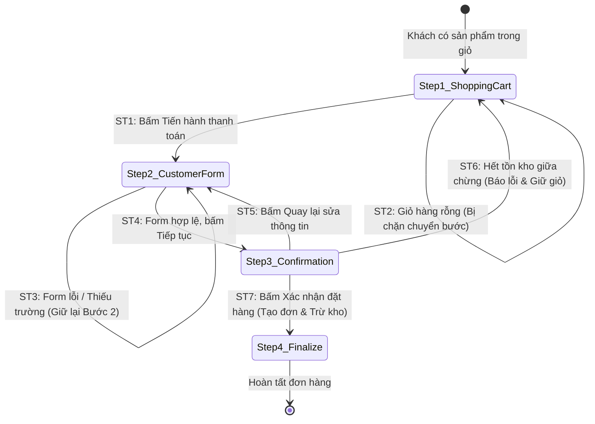

# THIẾT KẾ TEST CASE HỘP ĐEN: QUY TRÌNH THANH TOÁN & ĐẶT HÀNG (CHECKOUT - ORDER PLACEMENT)

> **Chức năng:** Quy trình xác thực thông tin giao hàng, kiểm soát tồn kho, áp dụng chiết khấu voucher và hoàn tất đơn hàng (`/shoppingCartCustomer` $\rightarrow$ `/shoppingCartConfirmation` $\rightarrow$ `/shoppingCartFinalize`).  
> **Người thực hiện:** Nguyễn Hoàng Phương (MSSV: `080205010954` / `NguyenHoangPhuong275`)

---

## 1. Xác Định Biến Đầu Vào & Ràng Buộc Nghiệp Vụ (Input Variables)

| Tên Biến | Ý Nghĩa | Kiểu | Ràng Buộc & Miền Giá Trị Hợp Lệ |
| :--- | :--- | :---: | :--- |
| **`cartLines`** | Danh sách sản phẩm trong giỏ | `List<CartLine>` | Bắt buộc khác rỗng (`size > 0`), mỗi dòng có `quantity > 0` |
| **`customerName`** | Họ và tên người nhận | `String` | Độ dài $[1, 255]$ ký tự, không chứa ký tự cấm (`@#$%^&*...`) |
| **`customerAddress`**| Địa chỉ giao hàng | `String` | Độ dài $[1, 255]$ ký tự, không chứa chuỗi injection/script |
| **`customerEmail`** | Địa chỉ email liên hệ | `String` | Độ dài $[6, 128]$ ký tự, đúng định dạng `user@domain.ext` |
| **`customerPhone`** | Số điện thoại nhận hàng | `String` | Độ dài $[1, 20]$ ký tự (chuẩn $[10, 11]$ chữ số), chỉ chứa số |
| **`stockQuantity`** | Tồn kho sản phẩm tại thời điểm chốt | `int` | $stockQuantity \ge quantity$ (Đủ hàng đáp ứng) |
| **`voucherCode`** | Mã giảm giá đính kèm | `String` | Tùy chọn (`null` / rỗng); nếu có: mã phải active, còn hạn, còn lượt |
| **`currentUser`** | Trạng thái đăng nhập | `User` | Khách vãng lai (`Guest`) hoặc Thành viên (`ROLE_CUSTOMER` / `ADMIN`) |

---

## 2. Bảng Phân Hoạch Tương Đương (Equivalence Partitioning - EP)

| STT | Biến / Điều kiện | Lớp hợp lệ (Valid) | Tag | Lớp không hợp lệ (Invalid) | Tag |
| :-: | :--- | :--- | :---: | :--- | :---: |
| **1** | **Giỏ hàng (`cartLines`)** | Giỏ hàng có chứa $\ge 1$ sản phẩm hợp lệ | **V1** | • Giỏ hàng rỗng (`cart = null` hoặc `lines = []`) • Dòng hàng chứa số lượng $\le 0$ | **X1** **X2** |
| **2** | **Họ tên (`customerName`)** | Chuỗi $[1, 255]$ ký tự không chứa ký tự cấm | **V2** | • Để trống / toàn khoảng trắng • Vượt quá 255 ký tự ($L > 255$) • Chứa ký tự cấm (`@#$%^&*<>~{}`) | **X3** **X4** **X5** |
| **3** | **Địa chỉ (`customerAddress`)** | Chuỗi $[1, 255]$ ký tự không chứa mã độc | **V3** | • Để trống / rỗng • Vượt quá 255 ký tự ($L > 255$) • Chứa thẻ HTML / Script injection | **X6** **X7** **X8** |
| **4** | **Email (`customerEmail`)** | Chuỗi $[6, 128]$ ký tự đúng cú pháp email | **V4** | • Để trống • Dưới 6 ký tự ($L < 6$) • Vượt quá 128 ký tự ($L > 128$) • Sai định dạng cú pháp email | **X9** **X10** **X11** **X12** |
| **5** | **Điện thoại (`customerPhone`)** | Chuỗi $[1, 20]$ ký tự (10-11 số hợp lệ) | **V5** | • Để trống • Vượt quá 20 ký tự ($L > 20$) • Chứa chữ cái hoặc ký tự đặc biệt | **X13** **X14** **X15** |
| **6** | **Tồn kho (`stockQuantity`)** | $stockQuantity \ge orderQuantity$ | **V6** | Tồn kho không đủ đáp ứng ($stock < quantity$) | **X16** |
| **7** | **Trạng thái SP (`productState`)** | Sản phẩm `ACTIVE` (đang kinh doanh) | **V7** | Sản phẩm `INACTIVE` / `DRAFT` / Bị xóa | **X17** |
| **8** | **Mã giảm giá (`voucherCode`)** | • Không dùng voucher (`null`) • Voucher hợp lệ thỏa mãn mọi điều kiện | **V8** **V9** | Voucher không tồn tại, hết hạn, hết lượt, hoặc không đủ đơn tối thiểu | **X18** |

---

## 3. Bảng Phân Tích Giá Trị Biên (Robustness BVA - $6n + 1$)

### 3.1 Bảng 7 mốc giá trị biên Robustness BVA cho 5 biến định lượng

*(Ghi chú bộ giá trị danh định chuẩn: `name` $nom = \text{"Nguyễn Hoàng Phương"}$ (20 ký tự), `address` $nom = \text{"123 Lê Lợi, P. Bến Nghé, Q1"}$ (27 ký tự), `email` $nom = \text{"phuong@gmail.com"}$ (16 ký tự), `phone` $nom = \text{"0912345678"}$ (10 số), `qty` $nom = 2$ với tồn kho $stock = 10$).*

| Biến Định Lượng | Ngoại biên dưới ($min^-$) | Cận dưới ($min$) | Kề dưới ($min^+$) | Danh định ($nom$) | Kề trên ($max^-$) | Cận trên ($max$) | Ngoại biên trên ($max^+$) | Quy tắc & Giới hạn |
| :--- | :---: | :---: | :---: | :---: | :---: | :---: | :---: | :--- |
| **1. Độ dài `customerName`** | `0` *(rỗng)* | **`1`** | **`2`** | **`20`** | **`254`** | **`255`** | `256` | Miền $[1, 255]$. Rỗng hoặc $> 255$ báo lỗi |
| **2. Độ dài `customerAddress`**| `0` *(rỗng)* | **`1`** | **`2`** | **`27`** | **`254`** | **`255`** | `256` | Miền $[1, 255]$. Rỗng hoặc $> 255$ báo lỗi |
| **3. Độ dài `customerEmail`** | `5` | **`6`** | **`7`** | **`16`** | **`127`** | **`128`** | `129` | Miền $[6, 128]$. $< 6$ hoặc $> 128$ báo lỗi |
| **4. Độ dài `customerPhone`** | `0` *(rỗng)* | **`1`** | **`2`** | **`10`** | **`19`** | **`20`** | `21` | Miền $[1, 20]$. Rỗng hoặc $> 20$ báo lỗi |
| **5. Số lượng `orderQuantity`**| `0` *(hủy)* | **`1`** | **`2`** | **`2`** | **`9`** | **`10`** | `11` *(vượt)* | Miền $[1, 10]$ (Tồn kho = 10). $> 10$ báo lỗi thiếu kho |

---

### 3.2 Bảng Đầy Đủ Robustness BVA Test Cases ($6n + 1 = 31$ Ca Kiểm Thử)

| Case | Tên nhận (`name`) | Địa chỉ (`address`) | Email (`email`) | SĐT (`phone`) | Số lượng (`qty`) | Mốc kiểm thử | Kết quả mong đợi (Expected Output) | Tag Biên |
| :-: | :--- | :--- | :--- | :--- | :---: | :---: | :--- | :-: |
| **1** | `"Nguyễn Hoàng Phương"` *(nom)* | `"123 Lê Lợi, Q1"` *(nom)* | `"phuong@gmail.com"` *(nom)* | `"0912345678"` *(nom)* | `2` *(nom)* | **Tất cả ở nom** | **Hợp lệ:** Xác nhận và đặt hàng thành công | **B1** |
| **2** | `""` *(min-)* | `"123 Lê Lợi, Q1"` | `"phuong@gmail.com"` | `"0912345678"` | `2` | `name = min-` | **Lỗi:** Họ tên không được để trống | **B2** |
| **3** | `"N"` *(min)* | `"123 Lê Lợi, Q1"` | `"phuong@gmail.com"` | `"0912345678"` | `2` | `name = min` | **Hợp lệ:** Tiếp nhận tên 1 ký tự | **B3** |
| **4** | `"Ng"` *(min+)* | `"123 Lê Lợi, Q1"` | `"phuong@gmail.com"` | `"0912345678"` | `2` | `name = min+` | **Hợp lệ:** Tiếp nhận tên 2 ký tự | **B4** |
| **5** | `[254 ký tự]` *(max-)* | `"123 Lê Lợi, Q1"` | `"phuong@gmail.com"` | `"0912345678"` | `2` | `name = max-` | **Hợp lệ:** Tiếp nhận tên 254 ký tự | **B5** |
| **6** | `[255 ký tự]` *(max)* | `"123 Lê Lợi, Q1"` | `"phuong@gmail.com"` | `"0912345678"` | `2` | `name = max` | **Hợp lệ:** Tiếp nhận tên 255 ký tự | **B6** |
| **7** | `[256 ký tự]` *(max+)* | `"123 Lê Lợi, Q1"` | `"phuong@gmail.com"` | `"0912345678"` | `2` | `name = max+` | **Lỗi:** Họ tên tối đa 255 ký tự | **B7** |
| **8** | `"Nguyễn Hoàng Phương"` | `""` *(min-)* | `"phuong@gmail.com"` | `"0912345678"` | `2` | `address = min-` | **Lỗi:** Địa chỉ không được để trống | **B8** |
| **9** | `"Nguyễn Hoàng Phương"` | `"1"` *(min)* | `"phuong@gmail.com"` | `"0912345678"` | `2` | `address = min` | **Hợp lệ:** Tiếp nhận địa chỉ 1 ký tự | **B9** |
| **10**| `"Nguyễn Hoàng Phương"` | `"12"` *(min+)* | `"phuong@gmail.com"` | `"0912345678"` | `2` | `address = min+` | **Hợp lệ:** Tiếp nhận địa chỉ 2 ký tự | **B10**|
| **11**| `"Nguyễn Hoàng Phương"` | `[254 ký tự]` *(max-)* | `"phuong@gmail.com"` | `"0912345678"` | `2` | `address = max-` | **Hợp lệ:** Tiếp nhận địa chỉ 254 ký tự | **B11**|
| **12**| `"Nguyễn Hoàng Phương"` | `[255 ký tự]` *(max)* | `"phuong@gmail.com"` | `"0912345678"` | `2` | `address = max` | **Hợp lệ:** Tiếp nhận địa chỉ 255 ký tự | **B12**|
| **13**| `"Nguyễn Hoàng Phương"` | `[256 ký tự]` *(max+)* | `"phuong@gmail.com"` | `"0912345678"` | `2` | `address = max+` | **Lỗi:** Địa chỉ tối đa 255 ký tự | **B13**|
| **14**| `"Nguyễn Hoàng Phương"` | `"123 Lê Lợi, Q1"` | `"a@b.c"` *(min-)* | `"0912345678"` | `2` | `email = min-` | **Lỗi:** Email tối thiểu 6 ký tự | **B14**|
| **15**| `"Nguyễn Hoàng Phương"` | `"123 Lê Lợi, Q1"` | `"a@b.co"` *(min)* | `"0912345678"` | `2` | `email = min` | **Hợp lệ:** Tiếp nhận email 6 ký tự (`a@b.co`) | **B15**|
| **16**| `"Nguyễn Hoàng Phương"` | `"123 Lê Lợi, Q1"` | `"ab@b.co"` *(min+)* | `"0912345678"` | `2` | `email = min+` | **Hợp lệ:** Tiếp nhận email 7 ký tự | **B16**|
| **17**| `"Nguyễn Hoàng Phương"` | `"123 Lê Lợi, Q1"` | `[127 ký tự]` *(max-)* | `"0912345678"` | `2` | `email = max-` | **Hợp lệ:** Tiếp nhận email 127 ký tự | **B17**|
| **18**| `"Nguyễn Hoàng Phương"` | `"123 Lê Lợi, Q1"` | `[128 ký tự]` *(max)* | `"0912345678"` | `2` | `email = max` | **Hợp lệ:** Tiếp nhận email 128 ký tự | **B18**|
| **19**| `"Nguyễn Hoàng Phương"` | `"123 Lê Lợi, Q1"` | `[129 ký tự]` *(max+)* | `"0912345678"` | `2` | `email = max+` | **Lỗi:** Email tối đa 128 ký tự | **B19**|
| **20**| `"Nguyễn Hoàng Phương"` | `"123 Lê Lợi, Q1"` | `"phuong@gmail.com"` | `""` *(min-)* | `2` | `phone = min-` | **Lỗi:** Số điện thoại không được để trống | **B20**|
| **21**| `"Nguyễn Hoàng Phương"` | `"123 Lê Lợi, Q1"` | `"phuong@gmail.com"` | `"1"` *(min)* | `2` | `phone = min` | **Hợp lệ:** Tiếp nhận SĐT 1 ký tự | **B21**|
| **22**| `"Nguyễn Hoàng Phương"` | `"123 Lê Lợi, Q1"` | `"phuong@gmail.com"` | `"12"` *(min+)* | `2` | `phone = min+` | **Hợp lệ:** Tiếp nhận SĐT 2 ký tự | **B22**|
| **23**| `"Nguyễn Hoàng Phương"` | `"123 Lê Lợi, Q1"` | `"phuong@gmail.com"` | `[19 số]` *(max-)* | `2` | `phone = max-` | **Hợp lệ:** Tiếp nhận SĐT 19 ký tự | **B23**|
| **24**| `"Nguyễn Hoàng Phương"` | `"123 Lê Lợi, Q1"` | `"phuong@gmail.com"` | `[20 số]` *(max)* | `2` | `phone = max` | **Hợp lệ:** Tiếp nhận SĐT 20 ký tự | **B24**|
| **25**| `"Nguyễn Hoàng Phương"` | `"123 Lê Lợi, Q1"` | `"phuong@gmail.com"` | `[21 số]` *(max+)* | `2` | `phone = max+` | **Lỗi:** Số điện thoại tối đa 20 ký tự | **B25**|
| **26**| `"Nguyễn Hoàng Phương"` | `"123 Lê Lợi, Q1"` | `"phuong@gmail.com"` | `"0912345678"` | `0` *(min-)* | `qty = min-` | **Lỗi:** Số lượng đặt phải lớn hơn 0 | **B26**|
| **27**| `"Nguyễn Hoàng Phương"` | `"123 Lê Lợi, Q1"` | `"phuong@gmail.com"` | `"0912345678"` | `1` *(min)* | `qty = min` | **Hợp lệ:** Đặt mua 1 sản phẩm | **B27**|
| **28**| `"Nguyễn Hoàng Phương"` | `"123 Lê Lợi, Q1"` | `"phuong@gmail.com"` | `"0912345678"` | `2` *(min+)* | `qty = min+` | **Hợp lệ:** Đặt mua 2 sản phẩm | **B28**|
| **29**| `"Nguyễn Hoàng Phương"` | `"123 Lê Lợi, Q1"` | `"phuong@gmail.com"` | `"0912345678"` | `9` *(max-)* | `qty = max-` | **Hợp lệ:** Đặt mua 9 sản phẩm | **B29**|
| **30**| `"Nguyễn Hoàng Phương"` | `"123 Lê Lợi, Q1"` | `"phuong@gmail.com"` | `"0912345678"` | `10` *(max)* | `qty = max` | **Hợp lệ:** Đặt mua toàn bộ tồn kho 10 SP | **B30**|
| **31**| `"Nguyễn Hoàng Phương"` | `"123 Lê Lợi, Q1"` | `"phuong@gmail.com"` | `"0912345678"` | `11` *(max+)* | `qty = max+` | **Lỗi:** Không đủ số lượng trong kho | **B31**|

---

## 4. Kỹ Thuật Bảng Quyết Định (Decision Table Testing)

### 4.1 Bảng Quyết Định Rút Gọn (Collapsed Decision Table - 7 Rules)

| Điều kiện / Hành động | Rule 1 (Giỏ rỗng) | Rule 2 (Lỗi Form) | Rule 3 (Lỗi Dòng) | Rule 4 (Lỗi SP) | Rule 5 (Lỗi Kho) | Rule 6 (Lỗi Voucher) | Rule 7 (Thành Công) |
| :--- | :---: | :---: | :---: | :---: | :---: | :---: | :---: |
| **C1: Giỏ hàng có dữ liệu (Not Null & Not Empty)?** | **N** | Y | Y | Y | Y | Y | Y |
| **C2: Form giao hàng hợp lệ (4 trường)?** | - | **N** | Y | Y | Y | Y | Y |
| **C3: Dòng hàng CartLine hợp lệ ($qty \ge 1$)?** | - | - | **N** | Y | Y | Y | Y |
| **C4: Sản phẩm đang kinh doanh (`ACTIVE`)?** | - | - | - | **N** | Y | Y | Y |
| **C5: Tồn kho đủ đáp ứng ($stock \ge qty$)?** | - | - | - | - | **N** | Y | Y |
| **C6: Mã Voucher hợp lệ / Không dùng mã?** | - | - | - | - | - | **N** | **Y** |
| *A1: Từ chối & Chuyển hướng về `/shoppingCart`* | **X** | - | - | - | - | - | - |
| *A2: Giữ lại Bước 2 & Hiển thị lỗi Form* | - | **X** | - | - | - | - | - |
| *A3: Ném IllegalArgumentException (Dòng lỗi)* | - | - | **X** | - | - | - | - |
| *A4: Ném IllegalStateException (SP ngừng bán)* | - | - | - | **X** | - | - | - |
| *A5: Ném IllegalStateException (Thiếu kho)* | - | - | - | - | **X** | - | - |
| *A6: Ném IllegalStateException (Voucher lỗi)* | - | - | - | - | - | **X** | - |
| *A7: Tạo Order, Trừ kho, Sang Bước 4 (Finalize)* | - | - | - | - | - | - | **X** |
| **Tag Bảng Quyết Định** | **D1** | **D2** | **D3** | **D4** | **D5** | **D6** | **D7** |

*Giải thích quy tắc nghiệp vụ:*
- **Rule 1 (`D1`):** Giỏ hàng rỗng khi truy cập thanh toán $\to$ Từ chối và chuyển hướng về trang Giỏ hàng `/shoppingCart`.
- **Rule 2 (`D2`):** Thông tin người nhận điền thiếu hoặc sai định dạng $\to$ Giữ lại Bước 2, báo lỗi form.
- **Rule 3 (`D3`):** Dòng sản phẩm có số lượng không hợp lệ $\le 0 \to$ Báo lỗi `IllegalArgumentException`.
- **Rule 4 (`D4`):** Sản phẩm trong giỏ đã bị ẩn hoặc ngừng bán $\to$ Báo lỗi `IllegalStateException`.
- **Rule 5 (`D5`):** Số lượng đặt mua vượt quá tồn kho thực tế $\to$ Báo lỗi `IllegalStateException: Không đủ số lượng trong kho`.
- **Rule 6 (`D6`):** Voucher không hợp lệ hoặc không đủ điều kiện tối thiểu $\to$ Báo lỗi từ chối áp dụng voucher.
- **Rule 7 (`D7`):** Thỏa mãn mọi điều kiện $\to$ Tạo Order, Trừ tồn kho, Xóa giỏ hàng và hoàn tất đơn hàng.

---

## 5. Kỹ Thuật Kiểm Thử Chuyển Đổi Trạng Thái (State Transition Testing - STT)

### 5.1 Sơ đồ chuyển đổi trạng thái quy trình đặt hàng

### 5.2 Bảng phân tích chi tiết các Ca chuyển đổi trạng thái (State Transition Details)

| Mã Transition | Bước hiện tại | Sự kiện / Hành vi người dùng | Bước tiếp theo | Kết quả xử lý hệ thống | Tag |
| :---: | :--- | :--- | :--- | :--- | :---: |
| **ST_01** | `Step 1: ShoppingCart` | Bấm "Tiến hành đặt hàng" (Giỏ có hàng) | `Step 2: CustomerForm` | Điều hướng sang màn hình điền thông tin | **ST1** |
| **ST_02** | `Step 1: ShoppingCart` | Truy cập Checkout khi giỏ hàng rỗng | `Step 1: ShoppingCart` | Chặn chuyển bước, redirect về `/shoppingCart` | **ST2** |
| **ST_03** | `Step 2: CustomerForm` | Submit form giao hàng thiếu/sai trường | `Step 2: CustomerForm` | Giữ nguyên form, hiển thị lỗi validate | **ST3** |
| **ST_04** | `Step 2: CustomerForm` | Submit form giao hàng hợp lệ | `Step 3: Confirmation` | Lưu thông tin tạm, điều hướng trang xác nhận | **ST4** |
| **ST_05** | `Step 3: Confirmation` | Bấm nút "Quay lại" (Back) | `Step 2: CustomerForm` | Quay lại form sửa thông tin, dữ liệu giữ nguyên | **ST5** |
| **ST_06** | `Step 3: Confirmation` | Bấm đặt hàng khi sản phẩm vừa bị mua hết | `Step 1: ShoppingCart` | Báo lỗi thiếu tồn kho, quay về giỏ hàng cập nhật | **ST6** |
| **ST_07** | `Step 3: Confirmation` | Bấm "Xác nhận đặt hàng" thành công | `Step 4: Finalize` | Tạo Order, trừ tồn kho, redirect trang hoàn tất | **ST7** |

---

## 6. Thiết Kế Bảng Test Cases Chi Tiết Triển Khai (Tối Ưu & Đầy Đủ Bao Phủ)

| STT | Mã Test Case | Tên ca kiểm thử | Dữ liệu kiểm thử (Test Input Data) | Kết quả mong đợi (Expected Output) | Tag được bao phủ |
| :-: | :--- | :--- | :--- | :--- | :---: |
| **1** | **TC_CHK_01** | Đặt hàng thành công cho Khách đã đăng nhập với dữ liệu danh định | • `currentUser`: `employee1` • `name`: `"Nguyễn Văn A"` (50 ký tự) • `address`: `"123 Lê Lợi, P. Bến Nghé, Q1"` (50 ký tự) • `email`: `"nguyenvana@gmail.com"` (30 ký tự) • `phone`: `"0912345678"` (10 số), `qty`: `2` | **Hợp lệ:** Tạo đơn hàng mới trong CSDL, trừ tồn kho 2 SP, xóa giỏ hàng session, điều hướng sang `/shoppingCartFinalize`. | **V1, V2, V3, V4, V5, V6, V7, B1, D7, ST1, ST4, ST7** |
| **2** | **TC_CHK_02** | Đặt hàng thành công cho Khách vãng lai (Guest Checkout) | • `currentUser`: `null` (Guest) • Form giao hàng điền đầy đủ hợp lệ | **Hợp lệ:** Tạo đơn với `customerUsername = null`, trừ kho chính xác, điều hướng trang hoàn tất. | **V1, V2, V3, V4, V5, V6, B1, D7, ST1, ST4, ST7** |
| **3** | **TC_CHK_03** | Đặt hàng thành công tại tất cả các cận dưới ($min$) | • `name`: `1 ký tự`, `address`: `1 ký tự` • `email`: `6 ký tự` (`a@b.co`), `phone`: `1 ký tự`, `qty`: `1` | **Hợp lệ:** Tiếp nhận form giao hàng tại các cận dưới, tạo đơn thành công. | **V2, V3, V4, V5, V6, B3, B9, B15, B21, B27, D7** |
| **4** | **TC_CHK_04** | Đặt hàng thành công tại tất cả các cận trên ($max$) | • `name`: `255 ký tự`, `address`: `255 ký tự` • `email`: `128 ký tự`, `phone`: `20 ký tự`, `qty`: `10` (Hết kho) | **Hợp lệ:** Tiếp nhận form giao hàng tại các cận trên, trừ hết 10 tồn kho. | **V2, V3, V4, V5, V6, B6, B12, B18, B24, B30, D7** |
| **5** | **TC_CHK_05** | Chặn checkout khi giỏ hàng rỗng ($lines = []$) | • `cartLines`: `[]` (Rỗng) • Thao tác: Truy cập trực tiếp `/shoppingCartCustomer` | **Lỗi:** Hệ thống chặn chuyển bước, tự động redirect về `/shoppingCart`. | **X1, D1, ST2** |
| **6** | **TC_CHK_06** | Báo lỗi khi để trống họ tên người nhận ($min^-$) | • `name`: `""` (rỗng) • Các trường khác điền giá trị danh định | **Lỗi:** Giữ nguyên ở Bước 2, báo lỗi: *"Tên người nhận không được để trống"*. | **X3, B2, D2, ST3** |
| **7** | **TC_CHK_07** | Báo lỗi khi tên người nhận vượt quá 255 ký tự ($max^+$) | • `name`: Chuỗi dài 256 ký tự • Các trường khác điền giá trị danh định | **Lỗi:** Giữ nguyên ở Bước 2, báo lỗi: *"Tên người nhận tối đa 255 ký tự"*. | **X4, B7, D2, ST3** |
| **8** | **TC_CHK_08** | Từ chối tên người nhận chứa ký tự đặc biệt cấm | • `name`: `"Nguyễn Văn A #@! VIP"` | **Lỗi:** Chặn submit, báo lỗi: *"Tên người nhận không được chứa ký tự đặc biệt cấm"*. | **X5, D2, ST3** |
| **9** | **TC_CHK_09** | Báo lỗi khi để trống địa chỉ giao hàng ($min^-$) | • `address`: `""` (rỗng) | **Lỗi:** Giữ nguyên ở Bước 2, báo lỗi: *"Địa chỉ giao hàng không được để trống"*. | **X6, B8, D2, ST3** |
| **10**| **TC_CHK_10** | Báo lỗi khi địa chỉ giao hàng vượt quá 255 ký tự ($max^+$) | • `address`: Chuỗi dài 256 ký tự | **Lỗi:** Giữ nguyên ở Bước 2, báo lỗi: *"Địa chỉ giao hàng tối đa 255 ký tự"*. | **X7, B13, D2, ST3** |
| **11**| **TC_CHK_11** | Từ chối địa chỉ chứa mã độc XSS Script Injection | • `address`: `"123 Đường "` | **Lỗi:** Bắt lỗi bảo mật ký tự nguy hiểm, chặn submit an toàn. | **X8, D2, ST3** |
| **12**| **TC_CHK_12** | Báo lỗi khi email dưới 6 ký tự ($min^-$) | • `email`: `"a@b.c"` (5 ký tự) | **Lỗi:** Báo lỗi: *"Email phải có độ dài từ 6 đến 128 ký tự"*. | **X10, B14, D2, ST3** |
| **13**| **TC_CHK_13** | Báo lỗi khi email vượt quá 128 ký tự ($max^+$) | • `email`: Chuỗi email dài 129 ký tự | **Lỗi:** Báo lỗi: *"Email tối đa 128 ký tự"*. | **X11, B19, D2, ST3** |
| **14**| **TC_CHK_14** | Từ chối email sai định dạng cú pháp | • `email`: `"nguyenvana_invalid_at_domain.com"` | **Lỗi:** Báo lỗi: *"Email không đúng định dạng"*. | **X12, D2, ST3** |
| **15**| **TC_CHK_15** | Báo lỗi khi số điện thoại để trống ($min^-$) | • `phone`: `""` (rỗng) | **Lỗi:** Giữ nguyên ở Bước 2, báo lỗi: *"Số điện thoại không được để trống"*. | **X13, B20, D2, ST3** |
| **16**| **TC_CHK_16** | Báo lỗi khi số điện thoại vượt quá 20 ký tự ($max^+$) | • `phone`: Chuỗi 21 chữ số | **Lỗi:** Giữ nguyên ở Bước 2, báo lỗi: *"Số điện thoại tối đa 20 ký tự"*. | **X14, B25, D2, ST3** |
| **17**| **TC_CHK_17** | Từ chối số điện thoại chứa chữ cái hoặc ký tự cấm | • `phone`: `"0912abc789@#"` | **Lỗi:** Báo lỗi: *"Số điện thoại chứa ký tự không hợp lệ"*. | **X15, D2, ST3** |
| **18**| **TC_CHK_18** | Chặn đặt hàng khi số lượng mua vượt quá tồn kho ($max^+$) | • `qty`: `11` (Tồn kho hiện tại = `10`) | **Lỗi:** Ném `IllegalStateException: Không đủ số lượng trong kho`, giữ nguyên giỏ hàng. | **X16, B31, D5, ST6** |
| **19**| **TC_CHK_19** | Từ chối đặt hàng với sản phẩm ngừng kinh doanh | • Giỏ hàng chứa sản phẩm trạng thái `INACTIVE` | **Lỗi:** Ném `IllegalStateException: Sản phẩm không còn được bán`. | **X17, D4** |
| **20**| **TC_CHK_20** | Tự động đồng bộ và bảo vệ giá từ CSDL (Chống can thiệp giá) | • Client gửi request với giá sửa lén `100đ` (DB: `500.000đ`) | **Bảo mật:** Backend tính tổng tiền theo giá niêm yết trong CSDL (`500.000đ`). | **V1, V7, D7** |
| **21**| **TC_CHK_21** | Áp dụng Voucher hợp lệ và chốt đơn thành công | • Giỏ hàng: `1.000.000đ` • `voucherCode`: `"SALE10"` (Giảm 10%) | **Thành công:** Giảm `100.000đ`, tổng trả `900.000đ`, ghi nhận 1 lượt vào `Voucher_Usages`. | **V8, V9, D7, ST4, ST7** |

---

## 7. Ma Trận Truy Vết & Độ Bao Phủ Kiểm Thử (Traceability Matrix)

| Nhóm Kỹ Thuật | Tổng Số Thẻ (Tags) | Danh Sách Thẻ Định Danh | Tỷ Lệ Bao Phủ |
| :--- | :---: | :--- | :---: |
| **Phân hoạch tương đương (EP)** | **27 Tags** | Hợp lệ: `V1` $\to$ `V9` (9 tags) Không hợp lệ: `X1` $\to$ `X18` (18 tags) | **100% (27/27)** |
| **Phân tích giá trị biên (BVA)** | **31 Tags** | Robustness BVA: `B1` $\to$ `B31` (31 tags) | **100% (31/31)** |
| **Bảng quyết định (Decision Table)**| **7 Rules** | `D1, D2, D3, D4, D5, D6, D7` | **100% (7/7)** |
| **Chuyển đổi trạng thái (State Transition)**| **7 Steps** | `ST1, ST2, ST3, ST4, ST5, ST6, ST7` | **100% (7/7)** |
