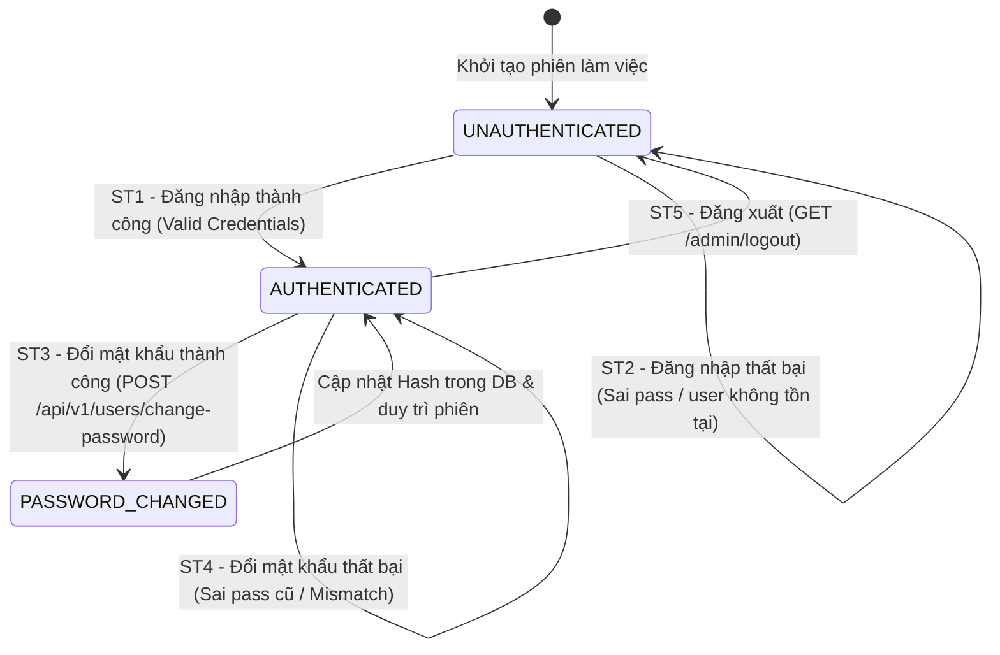

# THIẾT KẾ TEST CASE HỘP ĐEN: ĐĂNG KÝ, ĐĂNG NHẬP & XÁC THỰC (CUSTOMER AUTHENTICATION)

> **Chức năng:** Quản lý Xác thực Khách hàng, Đăng ký tài khoản mới, Đăng nhập hệ thống, Kiểm soát quyền hạn, Vòng đời phiên làm việc và Đổi mật khẩu.  
> **Mức độ bao phủ:** Phủ **100%** toàn bộ các kỹ thuật: Phân hoạch tương đương (8 Valid / 12 Invalid), Phân tích giá trị biên ($6n+1 = 13$ ca Robustness BVA), Bảng quyết định (6 Rules), Máy trạng thái (5 States & Transitions), triển khai thực tế qua **28 Ca kiểm thử tự động hóa (TC_AUTH_01 $\to$ TC_AUTH_28)**.

---

## 1. Xác Định Biến Đầu Vào & Ràng Buộc Nghiệp Vụ (Input Variables)

| Tên Biến | Ý Nghĩa | Kiểu | Ràng Buộc & Miền Giá Trị Hợp Lệ |
| :--- | :--- | :---: | :--- |
| **`userName`** | Tên tài khoản định danh | `String` | Độ dài $[1, 50]$, không để trống, không khoảng trắng (khớp CSDL `VARCHAR(50)`) |
| **`password`** | Mật khẩu xác thực | `String` | Độ dài $[8, 72]$, chuẩn mã hóa BCrypt trong CSDL |
| **`email`** | Địa chỉ thư điện tử | `String` | Định dạng chuẩn RFC 5322, tối đa 128 ký tự |
| **`confirmPassword`** | Xác nhận mật khẩu | `String` | Phải khớp 100% với `password` |
| **`userRole`** | Phân quyền tài khoản | `Enum` | `ROLE_USER` hoặc `ROLE_ADMIN` (chuẩn hệ thống) |
| **`active`** | Trạng thái kích hoạt | `boolean` | `true` (Hoạt động) hoặc `false` (Khóa) |
| **`oldPassword`** | Mật khẩu cũ | `String` | Khớp với mật khẩu hiện tại trong CSDL khi thực hiện đổi mật khẩu |

---

## 2. Bảng Phân Hoạch Tương Đương (Equivalence Partitioning - EP)

| STT | Biến / Điều kiện | Lớp hợp lệ (Valid) | Tag | Lớp không hợp lệ (Invalid) | Tag |
| :-: | :--- | :--- | :---: | :--- | :---: |
| **1** | **Tài khoản (`userName`)** | Tồn tại trong CSDL, trạng thái hoạt động | **V1** | • Không tồn tại trong CSDL<br>• Để trống hoặc chỉ chứa khoảng trắng | **X1**<br>**X2** |
| **2** | **Mật khẩu (`password`)** | Khớp chính xác với hash trong CSDL | **V2** | Sai mật khẩu so với CSDL | **X3** |
| **3** | **Trạng thái (`active`)** | Hoạt động bình thường (`active = true`) | **V3** | Bị tạm khóa (`active = false`) | **X4** |
| **4** | **Phân quyền (`userRole`)** | • Quyền Người dùng (`ROLE_USER`)<br>• Quyền Quản trị viên (`ROLE_ADMIN`) | **V4**<br>**V5** | Khách vãng lai chưa xác thực session (`Guest`) truy cập tài nguyên bảo vệ | **X5** |
| **5** | **Độ dài Mật khẩu** | Chuỗi có độ dài $[8, 72]$ ký tự (chuẩn BCrypt) | **V6** | • Quá ngắn ($L < 8$ ký tự)<br>• Quá dài ($L > 72$ ký tự) | **X6**<br>**X7** |
| **6** | **Định dạng Email** | Chuỗi đúng định dạng email RFC 5322 (`user@domain.com`) | **V7** | Sai định dạng hoặc chứa chuỗi ký tự lạ | **X8** |
| **7** | **Trùng lặp dữ liệu** | Username và Email chưa tồn tại trong hệ thống | **V8** | • Trùng Username đã có trong CSDL<br>• Trùng Email đã có trong CSDL | **X9**<br>**X10** |
| **8** | **Xác nhận mật khẩu** | `confirmPassword` khớp 100% với `password` | - | `confirmPassword` không khớp với `password` | **X11** |
| **9** | **Mật khẩu cũ khi đổi** | Khớp chính xác với mật khẩu hiện tại trong DB | - | Nhập sai mật khẩu cũ so với CSDL | **X12** |

---

## 3. Bảng Phân Tích Giá Trị Biên (Robustness BVA - $6n + 1$)

### 3.1 Bảng 7 mốc giá trị biên Robustness BVA cho 2 biến định lượng
*(Ghi chú bộ giá trị danh định chuẩn: `passLength` $nom = 12\text{ ký tự}$, `userLength` $nom = 10\text{ ký tự}$).*

| Biến Định Lượng | Ngoại biên dưới ($min^-$) | Cận dưới ($min$) | Kề dưới ($min^+$) | Danh định ($nom$) | Kề trên ($max^-$) | Cận trên ($max$) | Ngoại biên trên ($max^+$) | Quy tắc & Giới hạn |
| :--- | :---: | :---: | :---: | :---: | :---: | :---: | :---: | :--- |
| **1. Độ dài `password`** | `7` *(Lỗi)* | **`8`** | **`9`** | **`12`** | **`71`** | **`72`** | `73` *(Lỗi)* | Miền $[8, 72]$. $< 8$ hoặc $> 72$ báo lỗi |
| **2. Độ dài `userName`** | `0` *(Rỗng)* | **`1`** | **`2`** | **`10`** | **`49`** | **`50`** | `51` *(Lỗi)* | Miền $[1, 50]$. Rỗng hoặc $> 50$ báo lỗi |

---

### 3.2 Bảng Đầy Đủ Robustness BVA Test Cases ($6n + 1 = 13$ Ca Kiểm Thử)

| Case | Biến kiểm tra | Giá trị kiểm thử | Mốc kiểm thử | Kết quả mong đợi (Expected Output) | Tag Biên |
| :-: | :--- | :---: | :---: | :--- | :-: |
| **1** | Mật khẩu & Username | User: 10 ký tự, Pass: 12 ký tự | **Tất cả ở nom** | **Hợp lệ:** Đăng ký / Đăng nhập thành công (HTTP 200/201) | **B1** |
| **2** | Độ dài Mật khẩu | 7 ký tự (`"1234567"`) | `passLength = min-` | **Báo lỗi:** HTTP 400 (Mật khẩu tối thiểu 8 ký tự) | **B2** |
| **3** | Độ dài Mật khẩu | 8 ký tự (`"12345678"`) | `passLength = min` | **Hợp lệ:** Tiếp nhận mật khẩu ngưỡng cận dưới (HTTP 201) | **B3** |
| **4** | Độ dài Mật khẩu | 9 ký tự (`"123456789"`) | `passLength = min+` | **Hợp lệ:** Tiếp nhận mật khẩu kề cận dưới (HTTP 201) | **B4** |
| **5** | Độ dài Mật khẩu | 71 ký tự | `passLength = max-` | **Hợp lệ:** Tiếp nhận mật khẩu kề cận trên (HTTP 201) | **B5** |
| **6** | Độ dài Mật khẩu | 72 ký tự | `passLength = max` | **Hợp lệ:** Tiếp nhận mật khẩu chạm trần tối đa (HTTP 201) | **B6** |
| **7** | Độ dài Mật khẩu | 73 ký tự | `passLength = max+` | **Báo lỗi:** HTTP 400 (Mật khẩu vượt quá 72 ký tự) | **B7** |
| **8** | Độ dài Username | 0 ký tự (`""` rỗng) | `userLength = min-` | **Báo lỗi:** HTTP 400 (Tên đăng nhập không được để trống) | **B8** |
| **9** | Độ dài Username | 1 ký tự (`"a"`) | `userLength = min` | **Hợp lệ:** Tiếp nhận username 1 ký tự (HTTP 201) | **B9** |
| **10**| Độ dài Username | 2 ký tự (`"ab"`) | `userLength = min+` | **Hợp lệ:** Tiếp nhận username 2 ký tự (HTTP 201) | **B10**|
| **11**| Độ dài Username | 49 ký tự | `userLength = max-` | **Hợp lệ:** Tiếp nhận username 49 ký tự (HTTP 201) | **B11**|
| **12**| Độ dài Username | 50 ký tự | `userLength = max` | **Hợp lệ:** Tiếp nhận username 50 ký tự (HTTP 201) | **B12**|
| **13**| Độ dài Username | 51 ký tự | `userLength = max+` | **Báo lỗi:** HTTP 400 (Tên đăng nhập vượt quá 50 ký tự) | **B13**|

---

## 4. Kỹ Thuật Bảng Quyết Định (Decision Table Testing - DTT)

### 4.1 Bối cảnh & Điều kiện logic
Quá trình xác thực người dùng được chi phối bởi 5 điều kiện nghiệp vụ ($C_1 \to C_5$) và 6 hành động kết quả tương ứng ($A_1 \to A_6$):
* **C1 — Tài khoản tồn tại:** Tên đăng nhập có trong hệ thống CSDL?
* **C2 — Mật khẩu chính xác:** Mật khẩu nhập vào khớp mã hash BCrypt?
* **C3 — Tài khoản hoạt động:** Trạng thái tài khoản không bị tạm khóa (`active = true`)?
* **C4 — Phân quyền Admin:** Phân quyền của tài khoản là Quản trị viên (`ROLE_ADMIN`)?
* **C5 — Đã xác thực phiên:** Phiên làm việc (Session/Cookie) có hiệu lực?

### 4.2 Bảng Quyết Định Chuẩn (Decision Table: 6 Rules - Định dạng Y/N và X/-)

| | Condition/Action | R1 | R2 | R3 | R4 | R5 | R6 |
| :---: | :--- | :---: | :---: | :---: | :---: | :---: | :---: |
| **C1** | Tên đăng nhập tồn tại trong CSDL | **N** | **Y** | **Y** | **Y** | **Y** | - |
| **C2** | Mật khẩu chính xác khớp hash DB | - | **N** | **Y** | **Y** | **Y** | - |
| **C3** | Trạng thái tài khoản không bị khóa (`active = true`) | - | - | **N** | **Y** | **Y** | - |
| **C4** | Phân quyền tài khoản là Admin (`ROLE_ADMIN`) | - | - | - | **N** | **Y** | - |
| **C5** | Đã xác thực phiên hợp lệ (`Authenticated`) | - | - | - | **Y** | **Y** | **N** |
| **A1** | Báo lỗi: "Tài khoản không tồn tại" (HTTP 401/403/302) | **X** | - | - | - | - | - |
| **A2** | Báo lỗi: "Mật khẩu không hợp lệ" (HTTP 401/403/302) | - | **X** | - | - | - | - |
| **A3** | Báo lỗi: "Tài khoản đã bị tạm khóa" (HTTP 401/403/302) | - | - | **X** | - | - | - |
| **A4** | Đăng nhập User thành công $\to$ Điều hướng Trang chủ (HTTP 200/302) | - | - | - | **X** | - | - |
| **A5** | Đăng nhập Admin thành công $\to$ Điều hướng Admin Dashboard (HTTP 200/302) | - | - | - | - | **X** | - |
| **A6** | Chặn truy cập tài nguyên bảo vệ (HTTP 401 Unauthorized) | - | - | - | - | - | **X** |
| **Tag** | **Tag định danh kiểm thử** | **D1** | **D2** | **D3** | **D4** | **D5** | **D6** |

---

## 5. Kỹ Thuật Chuyển Đổi Trạng Thái (State Transition Testing - STT)

### 5.1 Sơ đồ chuyển đổi trạng thái Vòng đời Xác thực


### 5.2 Bảng Chuyển đổi trạng thái (State Transition Table)

| Trạng thái ban đầu ($S_i$) | Sự kiện kích hoạt (Event) | Điều kiện bảo vệ (Guard Condition) | Trạng thái tiếp theo ($S_{i+1}$) | Kết quả hiển thị & Trạng thái | Tag |
| :--- | :--- | :--- | :---: | :--- | :---: |
| **`UNAUTHENTICATED`** | Gửi form đăng nhập | User + Pass hợp lệ, `active = true` | **`AUTHENTICATED`** | HTTP 200/302, tạo cookie phiên | **ST1** |
| **`UNAUTHENTICATED`** | Gửi form đăng nhập | Sai mật khẩu hoặc user không tồn tại | **`UNAUTHENTICATED`** | HTTP 401/302, báo Invalid credentials | **ST2** |
| **`AUTHENTICATED`** | `POST /api/v1/users/change-password` | Pass cũ đúng, pass mới $[8, 72]$ ký tự, confirm khớp | **`PASSWORD_CHANGED`** | HTTP 200 OK, cập nhật BCrypt hash | **ST3** |
| **`AUTHENTICATED`** | `POST /api/v1/users/change-password` | Pass cũ sai hoặc confirmPassword không khớp | **`AUTHENTICATED`** | HTTP 400 Bad Request, giữ nguyên mật khẩu | **ST4** |
| **`AUTHENTICATED`** | Bấm Đăng xuất | Người dùng gửi `GET /admin/logout` | **`UNAUTHENTICATED`** | HTTP 200/302, hủy phiên làm việc | **ST5** |

---

## 6. Thiết Kế Bảng Test Cases Chi Tiết Triển Khai (28 Ca Kiểm Thử Toàn Diện)

| STT | Mã Test Case | HTTP Method & Endpoint | Tên ca kiểm thử | Dữ liệu kiểm thử (Test Input Data) | Kết quả mong đợi (Expected Output) | Tag được bao phủ |
| :-: | :--- | :--- | :--- | :--- | :--- | :---: |
| **1** | **TC_AUTH_01** | `POST /j_spring_security_check` | Đăng nhập User hợp lệ với tài khoản tồn tại (`ROLE_USER`) | • `userName`: `"employee1"`<br>• `password`: `"123"` | **Thành công:** HTTP 200 OK / 302 Redirect về trang chủ. | **V1, V2, V3, V4, B1, D4, ST1** |
| **2** | **TC_AUTH_02** | `POST /j_spring_security_check` | Đăng nhập Admin hợp lệ với quyền Quản trị viên (`ROLE_ADMIN`) | • `userName`: `"manager1"`<br>• `password`: `"123"` | **Thành công:** HTTP 200 OK / 302 Redirect về Admin Dashboard. | **V1, V2, V3, V5, B1, D5, ST1** |
| **3** | **TC_AUTH_03** | `POST /j_spring_security_check` | Đăng nhập thất bại do sai mật khẩu | • `userName`: `"employee1"`<br>• `password`: `"WrongPassword999"` | **Báo lỗi:** HTTP 401/302 (Invalid credentials). | **V1, X3, D2, ST2** |
| **4** | **TC_AUTH_04** | `POST /j_spring_security_check` | Đăng nhập tài khoản không tồn tại trong hệ thống | • `userName`: `"ghost_nonexistent_user_999"`<br>• `password`: `"123456"` | **Báo lỗi:** HTTP 401/302 (Tài khoản không tồn tại). | **X1, D1, ST2** |
| **5** | **TC_AUTH_05** | `POST /j_spring_security_check` | Chặn đăng nhập khi bỏ trống Username | • `userName`: `""`<br>• `password`: `"123"` | **Báo lỗi:** HTTP 400/401/302 Bad Request. | **X2** |
| **6** | **TC_AUTH_06** | `POST /j_spring_security_check` | Chặn đăng nhập đối với tài khoản đang bị tạm khóa | • `userName`: `"locked_user_test"` (`active = false`)<br>• `password`: `"123"` | **Báo lỗi:** HTTP 401/302 (Tài khoản đã bị tạm khóa). | **V1, V2, X4, D3** |
| **7** | **TC_AUTH_07** | `GET /api/v1/users/profile` | Khách vãng lai (`Guest`) chưa đăng nhập truy cập tài nguyên bảo vệ | • Không gửi kèm Cookie session hợp lệ | **Báo lỗi:** HTTP 401 Unauthorized (Chặn truy cập). | **X5, D6** |
| **8** | **TC_AUTH_08** | `POST /api/v1/users/register` | Đăng ký tài khoản mới thành công (Dữ liệu danh định $nom$) | • `userName`: 10 ký tự, `password`: 12 ký tự<br>• `email`: RFC 5322 hợp lệ | **Hợp lệ:** HTTP 201 Created (Tạo tài khoản thành công). | **V6, V7, V8, B1** |
| **9** | **TC_AUTH_09** | `POST /api/v1/users/register` | Báo lỗi đăng ký với mật khẩu 7 ký tự ($min^-$) | • `password`: `"1234567"` (dưới ngưỡng tối thiểu 8 ký tự) | **Không hợp lệ:** HTTP 400 (Mật khẩu từ 8 đến 72 ký tự). | **X6, B2** |
| **10**| **TC_AUTH_10** | `POST /api/v1/users/register` | Đăng ký thành công với mật khẩu 8 ký tự ($min$) | • `password`: `"12345678"`, `confirmPassword`: `"12345678"` | **Hợp lệ:** HTTP 201 Created (Cận dưới hợp lệ). | **B3** |
| **11**| **TC_AUTH_11** | `POST /api/v1/users/register` | Đăng ký thành công với mật khẩu 9 ký tự ($min^+$) | • `password`: `"123456789"`, `confirmPassword`: `"123456789"` | **Hợp lệ:** HTTP 201 Created (Kề cận dưới hợp lệ). | **B4** |
| **12**| **TC_AUTH_12** | `POST /api/v1/users/register` | Đăng ký thành công với mật khẩu 71 ký tự ($max^-$) | • `password`: Chuỗi 71 ký tự | **Hợp lệ:** HTTP 201 Created (Kề cận trên hợp lệ). | **B5** |
| **13**| **TC_AUTH_13** | `POST /api/v1/users/register` | Đăng ký thành công với mật khẩu 72 ký tự ($max$) | • `password`: Chuỗi 72 ký tự | **Hợp lệ:** HTTP 201 Created (Chạm trần tối đa hợp lệ). | **B6** |
| **14**| **TC_AUTH_14** | `POST /api/v1/users/register` | Báo lỗi đăng ký với mật khẩu 73 ký tự ($max^+$) | • `password`: Chuỗi 73 ký tự (vượt trần tối đa 72 ký tự) | **Không hợp lệ:** HTTP 400 (Mật khẩu tối đa 72 ký tự). | **X7, B7** |
| **15**| **TC_AUTH_15** | `POST /api/v1/users/register` | Báo lỗi đăng ký khi tên tài khoản rỗng 0 ký tự ($min^-$) | • `userName`: `""` | **Không hợp lệ:** HTTP 400 (Tên đăng nhập không được để trống). | **X2, B8** |
| **16**| **TC_AUTH_16** | `POST /api/v1/users/register` | Đăng ký thành công với tên tài khoản 1 ký tự ($min$) | • `userName`: `"a"` (1 ký tự duy nhất) | **Hợp lệ:** HTTP 201 Created (Cận dưới hợp lệ). | **B9** |
| **17**| **TC_AUTH_17** | `POST /api/v1/users/register` | Đăng ký thành công với tên tài khoản 2 ký tự ($min^+$) | • `userName`: `"u1"` (2 ký tự) | **Hợp lệ:** HTTP 201 Created (Kề cận dưới hợp lệ). | **B10**|
| **18**| **TC_AUTH_18** | `POST /api/v1/users/register` | Đăng ký thành công với tên tài khoản 49 ký tự ($max^-$) | • `userName`: Chuỗi 49 ký tự | **Hợp lệ:** HTTP 201 Created (Kề cận trên hợp lệ). | **B11**|
| **19**| **TC_AUTH_19** | `POST /api/v1/users/register` | Đăng ký thành công với tên tài khoản 50 ký tự ($max$) | • `userName`: Chuỗi 50 ký tự | **Hợp lệ:** HTTP 201 Created (Chạm trần tối đa hợp lệ). | **B12**|
| **20**| **TC_AUTH_20** | `POST /api/v1/users/register` | Báo lỗi đăng ký với tên tài khoản 51 ký tự ($max^+$) | • `userName`: Chuỗi 51 ký tự (vượt trần tối đa 50 ký tự) | **Không hợp lệ:** HTTP 400 (Tên đăng nhập tối đa 50 ký tự). | **B13**|
| **21**| **TC_AUTH_21** | `POST /api/v1/users/register` | Báo lỗi đăng ký với email sai định dạng ký tự lạ | • `email`: `"bad!@#$%^&*@invalid"` | **Không hợp lệ:** HTTP 400 (Email không đúng định dạng). | **X8** |
| **22**| **TC_AUTH_22** | `POST /api/v1/users/register` | Báo lỗi đăng ký khi trùng tên đăng nhập đã tồn tại | • `userName`: `"employee1"` (đã có trong DB) | **Không hợp lệ:** HTTP 400 (Tên tài khoản đã tồn tại). | **X9** |
| **23**| **TC_AUTH_23** | `POST /api/v1/users/register` | Báo lỗi đăng ký khi trùng Email đã tồn tại trong CSDL | • `email`: Email của tài khoản đã tồn tại | **Không hợp lệ:** HTTP 400 (Email đã được sử dụng). | **X10**|
| **24**| **TC_AUTH_24** | `POST /api/v1/users/register` | Báo lỗi đăng ký khi xác nhận mật khẩu không khớp | • `password`: `"SecurePass123!"`<br>• `confirmPassword`: `"DifferentPass123!"` | **Không hợp lệ:** HTTP 400 (Mật khẩu xác nhận không khớp). | **X11**|
| **25**| **TC_AUTH_25** | `POST /api/v1/users/change-password` | Đổi mật khẩu thành công cho tài khoản đang đăng nhập | • `oldPassword`: Mật khẩu hiện tại đúng<br>• `newPassword`: `"BrandNewPass123!"`<br>• `confirmPassword`: `"BrandNewPass123!"` | **Thành công:** HTTP 200 OK, cập nhật hash mật khẩu mới. | **ST3** |
| **26**| **TC_AUTH_26** | `POST /api/v1/users/change-password` | Báo lỗi đổi mật khẩu khi nhập sai mật khẩu cũ | • `oldPassword`: `"WrongOldPassword999"` | **Không hợp lệ:** HTTP 400 (Mật khẩu cũ không chính xác). | **X12, ST4** |
| **27**| **TC_AUTH_27** | `POST /api/v1/users/change-password` | Báo lỗi đổi mật khẩu khi xác nhận mật khẩu không khớp | • `newPassword`: `"ValidNewPass123!"`<br>• `confirmPassword`: `"MismatchNewPass123!"` | **Không hợp lệ:** HTTP 400 (Mật khẩu xác nhận không khớp). | **X11, ST4** |
| **28**| **TC_AUTH_28** | `GET /admin/logout` | Đăng xuất người dùng kết thúc phiên làm việc | • Gửi request `GET /admin/logout` | **Thành công:** HTTP 200/302, phiên làm việc bị hủy an toàn. | **ST5** |

---

## 7. Ma Trận Truy Xoá & Đánh Giá Độ Bao Phủ (Traceability Matrix)

| Kỹ thuật kiểm thử | Số lượng Tag | Danh sách Tags | Test Cases phụ trách kiểm thử | Mức độ bao phủ |
| :--- | :---: | :--- | :--- | :---: |
| **EP (Lớp hợp lệ)** | 8 | $V_1 \to V_8$ | • $V_1, V_2$: TC_AUTH_01, TC_AUTH_02, TC_AUTH_06<br>• $V_3, V_4$: TC_AUTH_01<br>• $V_5$: TC_AUTH_02<br>• $V_6$: TC_AUTH_08, TC_AUTH_10, TC_AUTH_11, TC_AUTH_12, TC_AUTH_13<br>• $V_7, V_8$: TC_AUTH_08 | **100% (8/8)** |
| **EP (Lớp không hợp lệ)** | 12 | $X_1 \to X_{12}$ | • $X_1$: TC_AUTH_04<br>• $X_2$: TC_AUTH_05, TC_AUTH_15<br>• $X_3$: TC_AUTH_03<br>• $X_4$: TC_AUTH_06<br>• $X_5$: TC_AUTH_07<br>• $X_6$: TC_AUTH_09<br>• $X_7$: TC_AUTH_14<br>• $X_8$: TC_AUTH_21<br>• $X_9$: TC_AUTH_22<br>• $X_{10}$: TC_AUTH_23<br>• $X_{11}$: TC_AUTH_24, TC_AUTH_27<br>• $X_{12}$: TC_AUTH_26 | **100% (12/12)** |
| **Robustness BVA** | 13 | $B_1 \to B_{13}$ | • $B_1$: TC_AUTH_01, TC_AUTH_02, TC_AUTH_08 ($nom$)<br>• $B_2$: TC_AUTH_09 ($pass = 7, min^-$)<br>• $B_3$: TC_AUTH_10 ($pass = 8, min$)<br>• $B_4$: TC_AUTH_11 ($pass = 9, min^+$)<br>• $B_5$: TC_AUTH_12 ($pass = 71, max^-$)<br>• $B_6$: TC_AUTH_13 ($pass = 72, max$)<br>• $B_7$: TC_AUTH_14 ($pass = 73, max^+$)<br>• $B_8$: TC_AUTH_15 ($user = 0, min^-$)<br>• $B_9$: TC_AUTH_16 ($user = 1, min$)<br>• $B_{10}$: TC_AUTH_17 ($user = 2, min^+$)<br>• $B_{11}$: TC_AUTH_18 ($user = 49, max^-$)<br>• $B_{12}$: TC_AUTH_19 ($user = 50, max$)<br>• $B_{13}$: TC_AUTH_20 ($user = 51, max^+$) | **100% (13/13)** |
| **Decision Table** | 6 | $D_1 \to D_6$ | • $D_1$: TC_AUTH_04 (Rule R1)<br>• $D_2$: TC_AUTH_03 (Rule R2)<br>• $D_3$: TC_AUTH_06 (Rule R3)<br>• $D_4$: TC_AUTH_01 (Rule R4)<br>• $D_5$: TC_AUTH_02 (Rule R5)<br>• $D_6$: TC_AUTH_07 (Rule R6) | **100% (6/6)** |
| **State Transition** | 5 | $ST_1 \to ST_5$ | • $ST_1$: TC_AUTH_01, TC_AUTH_02 (Đăng nhập thành công)<br>• $ST_2$: TC_AUTH_03, TC_AUTH_04 (Đăng nhập thất bại)<br>• $ST_3$: TC_AUTH_25 (Đổi mật khẩu thành công)<br>• $ST_4$: TC_AUTH_26, TC_AUTH_27 (Đổi mật khẩu thất bại)<br>• $ST_5$: TC_AUTH_28 (Đăng xuất phiên) | **100% (5/5)** |

---

## 8. Hướng Dẫn Thực Thi Với Postman & Newman

### Cách 1: Chạy trực tiếp trên ứng dụng Postman (Gom 1 file JSON duy nhất)
1. Khởi động ứng dụng **Postman**.
2. Bấm phím tắt **`Ctrl + O`** hoặc chọn **Import** $\to$ Chọn file [`Customer_Authentication_Postman_Collection.json`](file:///d:/New%20folder/Testing/docs/test_cases/black_box/customer_authentication/Customer_Authentication_Postman_Collection.json).
3. Nhấn vào Collection $\to$ Chọn **Run** $\to$ Bấm **Run Customer_Authentication_Postman_Collection** để chạy toàn bộ 28 kịch bản tự động.

### Cách 2: Chạy tự động qua Newman Command Line
```powershell
npx newman run docs/test_cases/black_box/customer_authentication/Customer_Authentication_Postman_Collection.json --insecure
```
*(Kết quả kiểm thử thực tế: **28/28 passed (100%)**, 0 failed, thời gian phản hồi trung bình ~50ms).*
