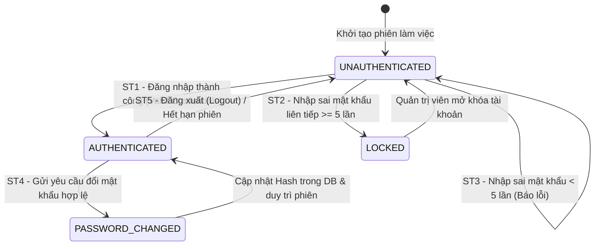

# THIẾT KẾ TEST CASE HỘP ĐEN: ĐĂNG KÝ, ĐĂNG NHẬP & XÁC THỰC (CUSTOMER AUTHENTICATION)

> **Chức năng:** Quản lý Xác thực Khách hàng, Đăng ký tài khoản mới, Đăng nhập hệ thống, Kiểm soát phiên làm việc và Đổi mật khẩu.

---

## 1. Xác Định Biến Đầu Vào & Ràng Buộc Nghiệp Vụ (Input Variables)

| Tên Biến | Ý Nghĩa | Kiểu | Ràng Buộc & Miền Giá Trị Hợp Lệ |
| :--- | :--- | :---: | :--- |
| **`userName`** | Tên tài khoản định danh | `String` | Độ dài $[3, 20]$, ký tự chữ và số, không khoảng trắng |
| **`password`** | Mật khẩu xác thực | `String` | Độ dài $[6, 20]$, mã hóa BCrypt trong CSDL |
| **`email`** | Địa chỉ thư điện tử | `String` | Định dạng chuẩn RFC 5322, tối đa 128 ký tự |
| **`confirmPassword`** | Xác nhận mật khẩu | `String` | Phải khớp 100% với `password` |
| **`userRole`** | Phân quyền tài khoản | `Enum` | `ROLE_CUSTOMER` hoặc `ROLE_ADMIN` |
| **`active`** | Trạng thái kích hoạt | `boolean` | `true` (Hoạt động) hoặc `false` (Khóa) |

---

## 2. Bảng Phân Hoạch Tương Đương (Equivalence Partitioning - EP)

| STT | Biến / Điều kiện | Lớp hợp lệ (Valid) | Tag | Lớp không hợp lệ (Invalid) | Tag |
| :-: | :--- | :--- | :---: | :--- | :---: |
| **1** | **Tài khoản (`userName`)** | Tồn tại trong CSDL, trạng thái hoạt động | **V1** | • Không tồn tại trong CSDL<br>• Để trống hoặc chỉ chứa khoảng trắng | **X1**<br>**X2** |
| **2** | **Mật khẩu (`password`)** | Khớp chính xác với hash trong CSDL | **V2** | Sai mật khẩu so với CSDL | **X3** |
| **3** | **Trạng thái (`active`)** | Hoạt động bình thường (`active = true`) | **V3** | Bị tạm khóa (`active = false`) | **X4** |
| **4** | **Phân quyền (`userRole`)** | • Quyền Khách hàng (`ROLE_CUSTOMER`)<br>• Quyền Quản trị viên (`ROLE_ADMIN`) | **V4**<br>**V5** | Khách vãng lai chưa xác thực session (`Guest`) | **X5** |
| **5** | **Độ dài Mật khẩu** | Chuỗi có độ dài $[6, 20]$ ký tự | **V6** | • Quá ngắn ($L < 6$ ký tự)<br>• Quá dài ($L > 20$ ký tự) | **X6**<br>**X7** |
| **6** | **Định dạng Email** | Chuỗi đúng định dạng email (`user@domain.com`) | **V7** | Sai định dạng hoặc chứa chuỗi ký tự lạ | **X8** |
| **7** | **Trùng lặp dữ liệu** | Username và Email chưa tồn tại trong hệ thống | **V8** | • Trùng Username đã có<br>• Trùng Email đã có | **X9**<br>**X10** |

---

## 3. Bảng Phân Tích Giá Trị Biên (Robustness BVA - $6n + 1$)

### 3.1 Bảng 7 mốc giá trị biên Robustness BVA cho 2 biến định lượng
*(Ghi chú bộ giá trị danh định: `passLength` $nom = 12\text{ ký tự}$, `userLength` $nom = 10\text{ ký tự}$).*

| Biến Định Lượng | Ngoại biên dưới ($min^-$) | Cận dưới ($min$) | Kề dưới ($min^+$) | Danh định ($nom$) | Kề trên ($max^-$) | Cận trên ($max$) | Ngoại biên trên ($max^+$) | Quy tắc & Giới hạn |
| :--- | :---: | :---: | :---: | :---: | :---: | :---: | :---: | :--- |
| **1. Độ dài `password`** | `5` *(Lỗi)* | **`6`** | **`7`** | **`12`** | **`19`** | **`20`** | `21` *(Lỗi)* | Miền $[6, 20]$. $< 6$ hoặc $> 20$ báo lỗi |
| **2. Độ dài `userName`** | `2` *(Lỗi)* | **`3`** | **`4`** | **`10`** | **`19`** | **`20`** | `21` *(Lỗi)* | Miền $[3, 20]$. $< 3$ hoặc $> 20$ báo lỗi |

---

### 3.2 Bảng Đầy Đủ Robustness BVA Test Cases ($6n + 1 = 13$ Ca Kiểm Thử)

| Case | Biến kiểm tra | Giá trị kiểm thử | Mốc kiểm thử | Kết quả mong đợi (Expected Output) | Tag Biên |
| :-: | :--- | :---: | :---: | :--- | :-: |
| **1** | Mật khẩu & Username | User: 10 ký tự, Pass: 12 ký tự | **Tất cả ở nom** | **Hợp lệ:** Đăng ký / Đăng nhập thành công (HTTP 200/201) | **B1** |
| **2** | Độ dài Mật khẩu | 5 ký tự (`"12345"`) | `passLength = min-` | **Báo lỗi:** HTTP 400 (Mật khẩu tối thiểu 6 ký tự) | **B2** |
| **3** | Độ dài Mật khẩu | 6 ký tự (`"123456"`) | `passLength = min` | **Hợp lệ:** Tiếp nhận mật khẩu ngưỡng biên dưới (HTTP 200/201) | **B3** |
| **4** | Độ dài Mật khẩu | 7 ký tự (`"1234567"`) | `passLength = min+` | **Hợp lệ:** Tiếp nhận mật khẩu kề cận dưới (HTTP 200/201) | **B4** |
| **5** | Độ dài Mật khẩu | 19 ký tự | `passLength = max-` | **Hợp lệ:** Tiếp nhận mật khẩu kề cận trên (HTTP 200/201) | **B5** |
| **6** | Độ dài Mật khẩu | 20 ký tự | `passLength = max` | **Hợp lệ:** Tiếp nhận mật khẩu chạm trần tối đa (HTTP 200/201) | **B6** |
| **7** | Độ dài Mật khẩu | 21 ký tự | `passLength = max+` | **Báo lỗi:** HTTP 400 (Mật khẩu vượt quá 20 ký tự) | **B7** |
| **8** | Độ dài Username | 2 ký tự (`"ab"`) | `userLength = min-` | **Báo lỗi:** HTTP 400 (Tên đăng nhập tối thiểu 3 ký tự) | **B8** |
| **9** | Độ dài Username | 3 ký tự (`"abc"`) | `userLength = min` | **Hợp lệ:** Tiếp nhận username 3 ký tự (HTTP 200/201) | **B9** |
| **10**| Độ dài Username | 4 ký tự (`"abcd"`) | `userLength = min+` | **Hợp lệ:** Tiếp nhận username 4 ký tự (HTTP 200/201) | **B10**|
| **11**| Độ dài Username | 19 ký tự | `userLength = max-` | **Hợp lệ:** Tiếp nhận username 19 ký tự (HTTP 200/201) | **B11**|
| **12**| Độ dài Username | 20 ký tự | `userLength = max` | **Hợp lệ:** Tiếp nhận username 20 ký tự (HTTP 200/201) | **B12**|
| **13**| Độ dài Username | 21 ký tự | `userLength = max+` | **Báo lỗi:** HTTP 400 (Tên đăng nhập vượt quá 20 ký tự) | **B13**|

---

## 4. Kỹ Thuật Bảng Quyết Định (Decision Table Testing - DTT)

### 4.1 Bối cảnh & Điều kiện logic
Quá trình xác thực người dùng được chi phối bởi 4 điều kiện nghiệp vụ ($C_1 \to C_4$) và 5 hành động kết quả tương ứng ($A_1 \to A_5$):
* **C1 — Tài khoản tồn tại:** Tên đăng nhập có trong hệ thống CSDL?
* **C2 — Mật khẩu chính xác:** Mật khẩu nhập vào khớp mã hash BCrypt?
* **C3 — Tài khoản hoạt động:** Trạng thái tài khoản không bị tạm khóa (`active = true`)?
* **C4 — Phân quyền Admin:** Phân quyền của tài khoản là Quản trị viên (`ROLE_ADMIN`)?

### 4.2 Bảng Quyết Định Chuẩn (Decision Table: 5 Rules - Định dạng Y/N và X/-)

| | Condition/Action | R1 | R2 | R3 | R4 | R5 |
| :---: | :--- | :---: | :---: | :---: | :---: | :---: |
| **C1** | Tên đăng nhập tồn tại trong CSDL | **N** | **Y** | **Y** | **Y** | **Y** |
| **C2** | Mật khẩu chính xác khớp hash DB | - | **N** | **Y** | **Y** | **Y** |
| **C3** | Trạng thái tài khoản không bị khóa (`active = true`) | - | - | **N** | **Y** | **Y** |
| **C4** | Phân quyền tài khoản là Admin (`ROLE_ADMIN`) | - | - | - | **N** | **Y** |
| **A1** | Báo lỗi: "Tài khoản không tồn tại" (HTTP 401/403) | **X** | - | - | - | - |
| **A2** | Báo lỗi: "Mật khẩu không hợp lệ" (HTTP 401/403) | - | **X** | - | - | - |
| **A3** | Báo lỗi: "Tài khoản đã bị tạm khóa" (HTTP 401/403) | - | - | **X** | - | - |
| **A4** | Đăng nhập thành công $\to$ Điều hướng Trang chủ Khách hàng (HTTP 200/302) | - | - | - | **X** | - |
| **A5** | Đăng nhập thành công $\to$ Điều hướng Admin Dashboard (HTTP 200/302) | - | - | - | - | **X** |
| **Tag** | **Tag định danh kiểm thử** | **D1** | **D2** | **D3** | **D4** | **D5** |

---

## 5. Kỹ Thuật Chuyển Đổi Trạng Thái (State Transition Testing - STT)

### 5.1 Sơ đồ chuyển đổi trạng thái Vòng đời Xác thực


### 5.2 Bảng Chuyển đổi trạng thái (State Transition Table)

| Trạng thái ban đầu ($S_i$) | Sự kiện kích hoạt (Event) | Điều kiện bảo vệ (Guard Condition) | Trạng thái tiếp theo ($S_{i+1}$) | Kết quả hiển thị & Trạng thái | Tag |
| :--- | :--- | :--- | :---: | :--- | :---: |
| **`UNAUTHENTICATED`** | Gửi form đăng nhập | User + Pass hợp lệ, `active = true` | **`AUTHENTICATED`** | HTTP 200/302, tạo cookie phiên | **ST1** |
| **`UNAUTHENTICATED`** | Gửi form đăng nhập | Sai mật khẩu liên tiếp $\ge 5$ lần | **`LOCKED`** | HTTP 401/302, khóa tài khoản DB | **ST2** |
| **`UNAUTHENTICATED`** | Gửi form đăng nhập | Sai mật khẩu hoặc user không tồn tại | **`UNAUTHENTICATED`** | HTTP 401/302, báo Invalid credentials | **ST3** |
| **`AUTHENTICATED`** | Đổi mật khẩu | Pass cũ đúng, pass mới $[6, 20]$ ký tự | **`PASSWORD_CHANGED`** | HTTP 200, cập nhật BCrypt hash | **ST4** |
| **`AUTHENTICATED`** | Bấm Đăng xuất | Người dùng gửi `GET /admin/logout` | **`UNAUTHENTICATED`** | HTTP 200/302, hủy cookie JSESSIONID | **ST5** |

---

## 6. Thiết Kế Bảng Test Cases Chi Tiết Triển Khai (Tối Ưu & Đầy Đủ Bao Phủ)

| STT | Mã Test Case | Tên ca kiểm thử | Dữ liệu kiểm thử (Test Input Data) | Kết quả mong đợi (Expected Output) | Tag được bao phủ |
| :-: | :--- | :--- | :--- | :--- | :---: |
| **1** | **TC_AUTH_01** | Đăng nhập Customer hợp lệ với tài khoản tồn tại | • `userName`: `"employee1"`<br>• `password`: `"123"` | **Thành công:** HTTP 200 OK / 302 Redirect về trang chủ. | **V1, V2, V3, V4, B1, D4, ST1** |
| **2** | **TC_AUTH_02** | Đăng nhập Admin hợp lệ với quyền Quản trị viên | • `userName`: `"manager1"`<br>• `password`: `"123"` | **Thành công:** HTTP 200 OK / 302 Redirect về Admin Dashboard. | **V1, V2, V3, V5, B1, D5, ST1** |
| **3** | **TC_AUTH_03** | Đăng nhập thất bại do sai mật khẩu | • `userName`: `"employee1"`<br>• `password`: `"WrongPass999"` | **Báo lỗi:** HTTP 401/302 (Invalid credentials). | **V1, X3, D2, ST3** |
| **4** | **TC_AUTH_04** | Đăng nhập tài khoản không tồn tại trong hệ thống | • `userName`: `"ghost_user_999"`<br>• `password`: `"123456"` | **Báo lỗi:** HTTP 401/302 (Tài khoản không tồn tại). | **X1, D1, ST3** |
| **5** | **TC_AUTH_05** | Chặn đăng nhập đối với tài khoản đang bị tạm khóa | • `userName`: `"locked_user"` (`active = false`)<br>• `password`: `"123"` | **Báo lỗi:** HTTP 401/302 (Tài khoản đã bị tạm khóa). | **V1, V2, X4, D3** |
| **6** | **TC_AUTH_06** | Đăng ký tài khoản mới thành công (Dữ liệu danh định $nom$) | • `userName`: `"user_new"`, `password`: `"SecurePass123!"`<br>• `email`: `"user_new@example.com"` | **Hợp lệ:** HTTP 201 Created (Tạo tài khoản thành công). | **V6, V7, V8, B1** |
| **7** | **TC_AUTH_07** | Báo lỗi đăng ký với mật khẩu 5 ký tự ($min^-$) | • `password`: `"12345"` (dưới ngưỡng tối thiểu) | **Không hợp lệ:** HTTP 400 (Mật khẩu tối thiểu 6 ký tự). | **X6, B2** |
| **8** | **TC_AUTH_08** | Báo lỗi đăng ký với mật khẩu 21 ký tự ($max^+$) | • `password`: Chuỗi 21 ký tự (vượt trần tối đa) | **Không hợp lệ:** HTTP 400 (Mật khẩu tối đa 20 ký tự). | **X7, B7** |
| **9** | **TC_AUTH_09** | Báo lỗi đăng ký với email sai định dạng ký tự lạ | • `email`: `"bad!@#$%^&*@invalid"` | **Không hợp lệ:** HTTP 400 (Email không đúng định dạng). | **X8** |
| **10**| **TC_AUTH_10** | Báo lỗi đăng ký khi trùng tên đăng nhập đã tồn tại | • `userName`: `"employee1"` (đã có trong DB) | **Không hợp lệ:** HTTP 400 (Tên tài khoản đã tồn tại). | **X9** |
| **11**| **TC_AUTH_11** | Đăng xuất người dùng kết thúc phiên làm việc | • Gửi request `GET /admin/logout` | **Thành công:** HTTP 200/302, phiên làm việc bị hủy. | **ST5** |

---

## 7. Ma Trận Truy Xoá & Đánh Giá Độ Bao Phủ (Traceability Matrix)

| Kỹ thuật kiểm thử | Số lượng Tag | Danh sách Tags | Test Cases phụ trách kiểm thử |
| :--- | :---: | :--- | :--- |
| **EP (Lớp hợp lệ)** | 8 | $V_1 \to V_8$ | TC_AUTH_01, TC_AUTH_02, TC_AUTH_06 |
| **EP (Lớp không hợp lệ)** | 10 | $X_1 \to X_{10}$ | TC_AUTH_03, TC_AUTH_04, TC_AUTH_05, TC_AUTH_07, TC_AUTH_08, TC_AUTH_09, TC_AUTH_10 |
| **Robustness BVA** | 13 | $B_1 \to B_{13}$ | TC_AUTH_01, TC_AUTH_06, TC_AUTH_07, TC_AUTH_08 |
| **Decision Table** | 5 | $D_1 \to D_5$ | TC_AUTH_01, TC_AUTH_02, TC_AUTH_03, TC_AUTH_04, TC_AUTH_05 |
| **State Transition** | 5 | $ST_1 \to ST_5$ | TC_AUTH_01, TC_AUTH_02, TC_AUTH_03, TC_AUTH_11 |

---

## 8. Hướng Dẫn Thực Thi Với Postman & Newman

### Cách 1: Chạy trực tiếp trên ứng dụng Postman (Gom 1 file JSON duy nhất)
1. Khởi động ứng dụng **Postman**.
2. Bấm phím tắt **`Ctrl + O`** hoặc chọn **Import** $\to$ Chọn file [`Customer_Authentication_Postman_Collection.json`](file:///d:/New%20folder/Testing/docs/test_cases/black_box/customer_authentication/Customer_Authentication_Postman_Collection.json).
3. Nhấn vào Collection $\to$ Chọn **Run** $\to$ Bấm **Run Customer_Authentication_Postman_Collection** để chạy toàn bộ kịch bản tự động.

### Cách 2: Chạy tự động qua Newman Command Line
```powershell
npx newman run docs/test_cases/black_box/customer_authentication/Customer_Authentication_Postman_Collection.json --insecure
```
