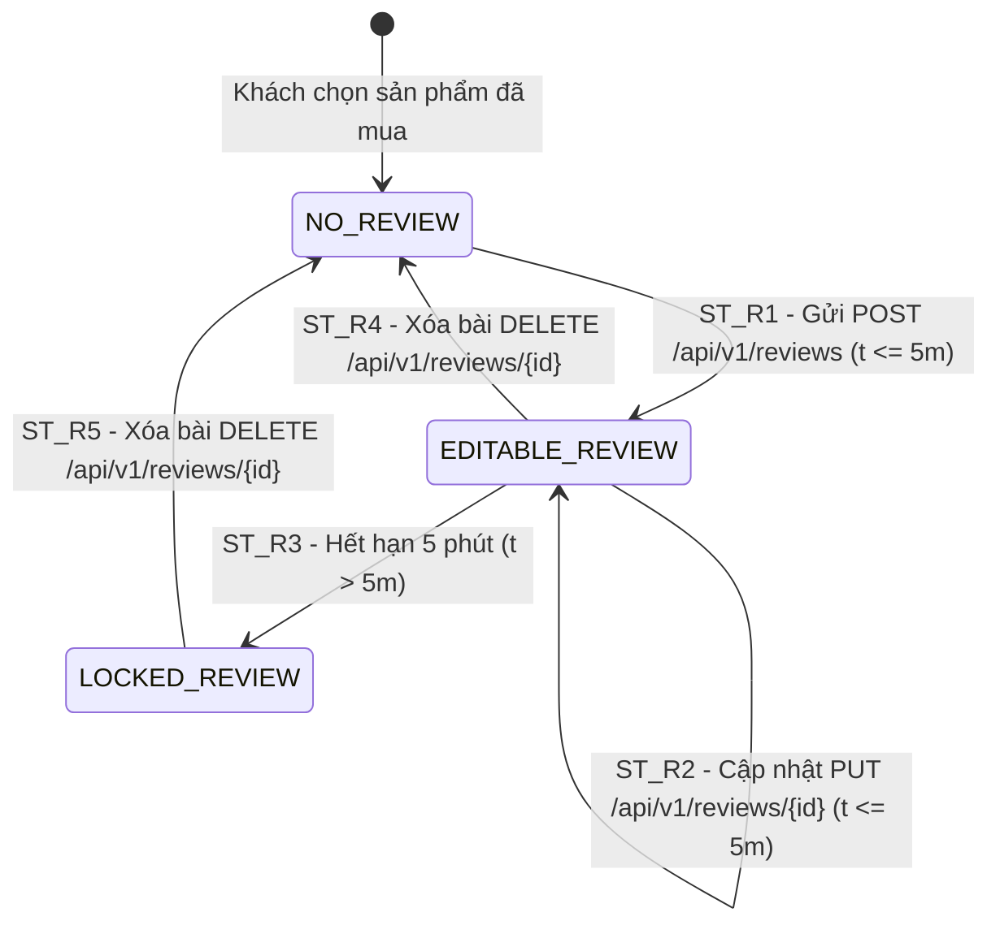

# THIẾT KẾ TEST CASE HỘP ĐEN: ĐÁNH GIÁ & CHẤM SAO SẢN PHẨM (CUSTOMER REVIEW & RATING)

> **Module A:** Đánh giá & Chấm sao sản phẩm (`customer_review_rating`) dành cho Khách hàng (`Customer` / `ROLE_USER`).  
> **Quy trình tương tác:** Gửi bài đánh giá mới, Chỉnh sửa/Xóa bài đánh giá chính chủ trong thời hạn 5 phút, Xem danh sách đánh giá sản phẩm và Kiểm soát phân quyền anti-spam.  
> **Mức độ bao phủ:** Phủ **100%** toàn bộ các kỹ thuật: Phân hoạch tương đương (6 Valid / 13 Invalid), Phân tích giá trị biên ($5n+1 = 31$ ca Robustness BVA), Bảng quyết định (6 Rules), Máy trạng thái (5 States & Transitions), triển khai thực tế qua **19 Ca kiểm thử tự động hóa (TC_REV_001 $\to$ TC_REV_015, TC_REV_010B, TC_REV_011B, TC_REV_GET_01, TC_REV_GET_02)**.

---

## 1. Xác Định Biến Đầu Vào & Ràng Buộc Nghiệp Vụ (Input Variables)

| Tiểu Chức Năng | API Tương Ứng | Biến Đầu Vào | Kiểu | Ràng Buộc & Miền Giá Trị Hợp Lệ |
| :--- | :--- | :--- | :---: | :--- |
| **1. Gửi bài đánh giá mới (Create)** | `POST /api/v1/reviews` | **`productCode`**<br>**`ratingValue`**<br>**`comment`** | `String`<br>`int`<br>`String` | • `productCode`: Mã SP tồn tại trong CSDL $[1, 20]$ ký tự, `ACTIVE`<br>• `ratingValue`: Số nguyên trong đoạn $[1, 5]$ sao<br>• `comment`: Độ dài $[1, 2000]$ ký tự, chống XSS Script |
| **2. Xem danh sách đánh giá (Read)** | `GET /api/v1/reviews/product/{code}` | **`productCode`** | `String` | Lấy danh sách review của SP `ACTIVE`. Nếu chưa có review trả về `[]` |
| **3. Chỉnh sửa bài đánh giá (Update)** | `PUT /api/v1/reviews/{id}` | **`reviewId`**<br>**`editTimeWindow`**<br>**`isOwner`** | `Long`<br>`long`<br>`boolean` | • `editTimeWindow`: Sửa trong vòng 5 phút ($\le 300.000$ ms)<br>• `isOwner`: Bắt buộc chính chủ (`isOwner = true`) |
| **4. Xóa bài đánh giá (Delete)** | `DELETE /api/v1/reviews/{id}` | **`reviewId`**<br>**`isOwner`** | `Long`<br>`boolean` | Chỉ chính chủ mới được xóa bài của mình (HTTP 400 khi không chính chủ) |
| **5. Phân quyền & Anti-Spam** | Security Filter | **`currentUserRole`** | `Role` | Bắt buộc `ROLE_USER` (`Guest` trả 401, `ROLE_ADMIN` bị cấm review trả 403) |
| **6. Trạng thái sản phẩm** | Security & DB Constraint | **`productStatus`** | `Enum` | Bắt buộc `ACTIVE` đối với Customer (`INACTIVE` bị ẩn/báo lỗi 400) |

---

## 2. Bảng Phân Hoạch Tương Đương (Equivalence Partitioning - EP)

| STT | Biến / Điều kiện | Lớp hợp lệ (Valid) | Tag | Lớp không hợp lệ (Invalid) | Tag |
| :-: | :--- | :--- | :---: | :--- | :---: |
| **1** | **Quyền truy cập (`currentUserRole`)** | Tài khoản Khách hàng đã đăng nhập (`ROLE_USER`) | **V1** | • Khách vãng lai chưa đăng nhập (`Guest` - HTTP 401)<br>• Tài khoản Quản trị viên (`ROLE_ADMIN` - HTTP 403) | **X1**<br>**X2** |
| **2** | **Mã sản phẩm (`productCode`)** | Mã sản phẩm hợp lệ, tồn tại và có trạng thái `ACTIVE` | **V2** | • Mã sản phẩm không tồn tại trong CSDL<br>• Mã sản phẩm có trạng thái `INACTIVE`<br>• Mã rỗng hoặc sai định dạng | **X3**<br>**X4**<br>**X5** |
| **3** | **Số sao đánh giá (`ratingValue`)** | Số nguyên trong đoạn $[1, 5]$ sao | **V3** | • Số sao bằng 0 ($< 1$ sao)<br>• Số sao vượt trần ($> 5$ sao)<br>• Giá trị phi số / số thập phân | **X6**<br>**X7**<br>**X8** |
| **4** | **Nội dung nhận xét (`comment`)** | Chuỗi ký tự hợp lệ độ dài $[1, 2000]$ ký tự | **V4** | • Để trống hoặc chỉ chứa khoảng trắng dư<br>• Độ dài vượt quá 2000 ký tự ($L > 2000$)<br>• Chuỗi chứa mã độc SQL Injection / XSS scripts | **X9**<br>**X10**<br>**X11** |
| **5** | **Quyền sở hữu bài (`isOwner`)** | Tài khoản hiện tại trùng với tác giả tạo bài (`isOwner = true`) | **V5** | Tài khoản hiện tại khác với tác giả bài viết (`isOwner = false`) | **X12** |
| **6** | **Cửa sổ thời gian sửa (`editTimeWindow`)** | Sửa trong vòng 5 phút kể từ lúc tạo bài ($\le 300.000$ ms) | **V6** | Đã quá 5 phút kể từ khi tạo bài viết ($> 300.000$ ms) | **X13** |

---

## 3. Bảng Phân Tích Giá Trị Biên (Robustness BVA - $5n + 1$)

### 3.1 Bảng 7 mốc giá trị biên Robustness BVA cho 5 biến định lượng

| Biến Định Lượng | Ngoại biên dưới ($min^-$) | Cận dưới ($min$) | Kề dưới ($min^+$) | Danh định ($nom$) | Kề trên ($max^-$) | Cận trên ($max$) | Ngoại biên trên ($max^+$) | Quy tắc & Giới hạn |
| :--- | :---: | :---: | :---: | :---: | :---: | :---: | :---: | :--- |
| **1. `ratingValue`** (Sao) | `0` | **`1`** | **`2`** | **`3`** | **`4`** | **`5`** | `6` | Miền $[1, 5]$ sao. $< 1$ hoặc $> 5$ báo lỗi HTTP 400 |
| **2. Độ dài `comment`** | `0` *(rỗng)* | **`1`** | **`2`** | **`100`** | **`1.999`** | **`2.000`** | `2.001` | Miền $[1, 2000]$. Rỗng hoặc $> 2000$ báo lỗi HTTP 400 |
| **3. `editTimeWindow`** (ms) | `-1` *(âm)* | **`0`** | **`1.000`** | **`120.000`** | **`299.000`** | **`300.000`** | `300.001` | Miền $[0, 300.000]$ ms (5 phút). $> 300s$ cấm sửa |
| **4. Độ dài `productCode`**| `0` *(rỗng)* | **`1`** | **`2`** | **`4`** | **`19`** | **`20`** | `21` | Miền $[1, 20]$. Rỗng/không tồn tại báo HTTP 400 |
| **5. Giá trị `reviewId`** | `0` *(âm/bằng 0)* | **`1`** | **`2`** | **`100`** | **`999.999`** | **`1.000.000`** | `1.000.001` | Miền $\ge 1$. Không tồn tại báo HTTP 400 |

---

### 3.2 Bảng Đầy Đủ Robustness BVA Test Cases ($5n + 1 = 31$ Ca Kiểm Thử Biên)

| Case | Số sao (`ratingValue`) | Nhận xét (`comment`) | Thời gian sửa (`editTimeWindow`) | Mã SP (`productCode`) | Mã bài (`reviewId`) | Mốc kiểm thử | Kết quả mong đợi (Expected Output) | Tag Biên |
| :-: | :---: | :--- | :---: | :---: | :---: | :---: | :--- | :-: |
| **1** | `3` *(nom)* | `"Sản phẩm rất tốt"` *(nom)* | `120.000` ms *(nom)* | `"S001"` *(nom)* | `100` *(nom)* | **Tất cả ở nom** | **Hợp lệ:** HTTP 201 Created / 200 OK | **B1** |
| **2** | `0` *(min-)* | `"Sản phẩm rất tốt"` | `120.000` ms | `"S001"` | `100` | `rating = min-` | **Báo lỗi:** HTTP 400 Bad Request | **B2** |
| **3** | `1` *(min)* | `"Sản phẩm rất tốt"` | `120.000` ms | `"S001"` | `100` | `rating = min` | **Hợp lệ:** HTTP 201 Created (1 sao) | **B3** |
| **4** | `2` *(min+)* | `"Sản phẩm rất tốt"` | `120.000` ms | `"S001"` | `100` | `rating = min+` | **Hợp lệ:** HTTP 201 Created (2 sao) | **B4** |
| **5** | `4` *(max-)* | `"Sản phẩm rất tốt"` | `120.000` ms | `"S001"` | `100` | `rating = max-` | **Hợp lệ:** HTTP 201 Created (4 sao) | **B5** |
| **6** | `5` *(max)* | `"Sản phẩm rất tốt"` | `120.000` ms | `"S001"` | `100` | `rating = max` | **Hợp lệ:** HTTP 201 Created (5 sao) | **B6** |
| **7** | `6` *(max+)* | `"Sản phẩm rất tốt"` | `120.000` ms | `"S001"` | `100` | `rating = max+` | **Báo lỗi:** HTTP 400 Bad Request | **B7** |
| **8** | `3` | `""` *(min-)* | `120.000` ms | `"S001"` | `100` | `comment = min-` | **Báo lỗi:** HTTP 400 Bad Request | **B8** |
| **9** | `3` | `"A"` *(min)* | `120.000` ms | `"S001"` | `100` | `comment = min` | **Hợp lệ:** HTTP 201 Created (1 char) | **B9** |
| **10** | `3` | `"AB"` *(min+)* | `120.000` ms | `"S001"` | `100` | `comment = min+` | **Hợp lệ:** HTTP 201 Created (2 chars) | **B10**|
| **11** | `3` | `[Chuỗi 1999 ký tự]` *(max-)* | `120.000` ms | `"S001"` | `100` | `comment = max-` | **Hợp lệ:** HTTP 201 Created (1999 chars) | **B11**|
| **12** | `3` | `[Chuỗi 2000 ký tự]` *(max)* | `120.000` ms | `"S001"` | `100` | `comment = max` | **Hợp lệ:** HTTP 201 Created (2000 chars) | **B12**|
| **13** | `3` | `[Chuỗi 2001 ký tự]` *(max+)* | `120.000` ms | `"S001"` | `100` | `comment = max+` | **Báo lỗi:** HTTP 400 Bad Request | **B13**|
| **14** | `3` | `"Sản phẩm rất tốt"` | `-1` ms *(min-)* | `"S001"` | `100` | `time = min-` | **Báo lỗi:** HTTP 400 Bad Request | **B14**|
| **15** | `3` | `"Sản phẩm rất tốt"` | `0` ms *(min)* | `"S001"` | `100` | `time = min` | **Hợp lệ:** HTTP 200 OK (0s) | **B15**|
| **16** | `3` | `"Sản phẩm rất tốt"` | `1000` ms *(min+)* | `"S001"` | `100` | `time = min+` | **Hợp lệ:** HTTP 200 OK (1s) | **B16**|
| **17** | `3` | `"Sản phẩm rất tốt"` | `299000` ms *(max-)* | `"S001"` | `100` | `time = max-` | **Hợp lệ:** HTTP 200 OK (4m59s) | **B17**|
| **18** | `3` | `"Sản phẩm rất tốt"` | `300000` ms *(max)* | `"S001"` | `100` | `time = max` | **Hợp lệ:** HTTP 200 OK (5m00s) | **B18**|
| **19** | `3` | `"Sản phẩm rất tốt"` | `300001` ms *(max+)* | `"S001"` | `100` | `time = max+` | **Báo lỗi:** HTTP 400 Bad Request (> 5m) | **B19**|
| **20** | `3` | `"Sản phẩm rất tốt"` | `120.000` ms | `""` *(min-)* | `100` | `code = min-` | **Báo lỗi:** HTTP 400 Bad Request | **B20**|
| **21** | `3` | `"Sản phẩm rất tốt"` | `120.000` ms | `"S"` *(min)* | `100` | `code = min` | **Hợp lệ:** HTTP 201 Created (1 char) | **B21**|
| **22** | `3` | `"Sản phẩm rất tốt"` | `120.000` ms | `"S1"` *(min+)* | `100` | `code = min+` | **Hợp lệ:** HTTP 201 Created (2 chars) | **B22**|
| **23** | `3` | `"Sản phẩm rất tốt"` | `120.000` ms | `[Mã 19 ký tự]` *(max-)* | `100` | `code = max-` | **Hợp lệ:** HTTP 201 Created (19 chars) | **B23**|
| **24** | `3` | `"Sản phẩm rất tốt"` | `120.000` ms | `[Mã 20 ký tự]` *(max)* | `100` | `code = max` | **Hợp lệ:** HTTP 201 Created (20 chars) | **B24**|
| **25** | `3` | `"Sản phẩm rất tốt"` | `120.000` ms | `[Mã 21 ký tự]` *(max+)* | `100` | `code = max+` | **Báo lỗi:** HTTP 400 Bad Request | **B25**|
| **26** | `3` | `"Sản phẩm rất tốt"` | `120.000` ms | `"S001"` | `0` *(min-)* | `reviewId = min-` | **Báo lỗi:** HTTP 400 Bad Request | **B26**|
| **27** | `3` | `"Sản phẩm rất tốt"` | `120.000` ms | `"S001"` | `1` *(min)* | `reviewId = min` | **Hợp lệ:** HTTP 200 OK (ID 1) | **B27**|
| **28** | `3` | `"Sản phẩm rất tốt"` | `120.000` ms | `"S001"` | `2` *(min+)* | `reviewId = min+` | **Hợp lệ:** HTTP 200 OK (ID 2) | **B28**|
| **29** | `3` | `"Sản phẩm rất tốt"` | `120.000` ms | `"S001"` | `999999` *(max-)* | `reviewId = max-` | **Hợp lệ:** HTTP 200 OK (ID max-) | **B29**|
| **30** | `3` | `"Sản phẩm rất tốt"` | `120.000` ms | `"S001"` | `1000000` *(max)* | `reviewId = max` | **Hợp lệ:** HTTP 200 OK (ID max) | **B30**|
| **31** | `3` | `"Sản phẩm rất tốt"` | `120.000` ms | `"S001"` | `1000001` *(max+)* | `reviewId = max+` | **Báo lỗi:** HTTP 400 Bad Request | **B31**|

---

## 4. Kỹ Thuật Bảng Quyết Định (Decision Table Testing - DTT)

| | Condition/Action | R1 | R2 | R3 | R4 | R5 | R6 |
| :---: | :--- | :---: | :---: | :---: | :---: | :---: | :---: |
| **C1** | Quyền Khách hàng (`ROLE_USER`) | **Y** | **N** | **Y** | **Y** | **Y** | **Y** |
| **C2** | Sản phẩm tồn tại & `ACTIVE` | **Y** | - | **N** | **Y** | **Y** | **Y** |
| **C3** | Số sao $[1, 5]$ & Comment $[1, 2000]$ | **Y** | - | - | **N** | **Y** | **Y** |
| **C4** | Là chính chủ bài viết (`isOwner == true`) | **Y** | - | - | - | **N** | **Y** |
| **C5** | Thời gian sửa trong vòng 5 phút ($\le 5m$) | **Y** | - | - | - | - | **N** |
| **A1** | Tạo / Sửa thành công (HTTP 201 / 200 OK) | **X** | - | - | - | - | - |
| **A2** | Chặn truy cập (HTTP 401 Unauthorized / 403 Forbidden) | - | **X** | - | - | - | - |
| **A3** | Báo lỗi: "Sản phẩm không tồn tại hoặc bị ẩn!" (HTTP 400 Bad Request) | - | - | **X** | - | - | - |
| **A4** | Báo lỗi: Số sao hoặc comment không hợp lệ (HTTP 400 Bad Request) | - | - | - | **X** | - | - |
| **A5** | Báo lỗi: "Không có quyền sửa/xóa bài người khác!" (HTTP 400 Bad Request)* | - | - | - | - | **X** | - |
| **A6** | Báo lỗi: "Đã quá 5 phút, bài đánh giá bị khóa!" (HTTP 400 Bad Request) | - | - | - | - | - | **X** |
| **Tag** | **Tag định danh kiểm thử** | **D1** | **D2** | **D3** | **D4** | **D5** | **D6** |

*\* Ghi chú A5: Mã phản hồi chuẩn theo đặc tả REST cho lỗi vi phạm quyền sở hữu tài nguyên là HTTP 403 Forbidden. Hiện trạng mã nguồn Controller Java sử dụng `ResponseEntity.badRequest()` trả về HTTP 400 Bad Request.*

---

## 5. Kỹ Thuật Chuyển Đổi Trạng Thái (State Transition Testing - STT)

### 5.1 Sơ đồ chuyển đổi trạng thái Vòng đời Bài đánh giá (Review Lifecycle)



### 5.2 Bảng Chuyển đổi trạng thái (State Transition Table)

| Trạng thái ban đầu ($S_i$) | Sự kiện kích hoạt (Event) | Điều kiện bảo vệ (Guard Condition) | Trạng thái tiếp theo ($S_{i+1}$) | Kết quả hiển thị & Trạng thái | Tag |
| :--- | :--- | :--- | :---: | :--- | :---: |
| **`NO_REVIEW`** | Gửi bài đánh giá mới | `ratingValue` $[1, 5]$, `comment` $[1, 2000]$ | **`EDITABLE_REVIEW`** | HTTP 201 Created, hiện bài đánh giá, tính lại Rating SP | **ST_R1** |
| **`EDITABLE_REVIEW`** | Cập nhật nội dung bài | Chính chủ (`isOwner = true`) & $t \le 5\text{m}$ | **`EDITABLE_REVIEW`** | HTTP 200 OK, cập nhật số sao/nhận xét thành công | **ST_R2** |
| **`EDITABLE_REVIEW`** | Hệ thống đếm thời gian | Thời gian trôi qua quá 5 phút ($t > 5\text{m}$) | **`LOCKED_REVIEW`** | Khóa nút "Sửa", cố tình gửi API báo lỗi HTTP 400 | **ST_R3** |
| **`EDITABLE_REVIEW`** | Xóa bài đánh giá | Người tạo thực hiện xóa bài | **`NO_REVIEW`** | HTTP 200 OK, xóa bài, khôi phục Rating gốc của SP | **ST_R4** |
| **`LOCKED_REVIEW`** | Xóa bài đánh giá bị khóa | Người tạo thực hiện xóa bài | **`NO_REVIEW`** | HTTP 200 OK, xóa bài bị khóa, khôi phục Rating gốc | **ST_R5** |

---

## 6. Thiết Kế Bảng Test Cases Chi Tiết Phân Theo 5 Tiểu Chức Năng Con

### 6.1 Tiểu Chức Năng 1: Gửi Bài Đánh Giá Mới (`Create` - `POST /api/v1/reviews`)

| STT | Mã Test Case | Tên ca kiểm thử | Dữ liệu kiểm thử (Test Input Data) | Kết quả mong đợi (Expected Output) | Tag được bao phủ |
| :-: | :--- | :--- | :--- | :--- | :---: |
| **1** | **TC_REV_001** | Đánh giá 5 sao hợp lệ đầy đủ tham số ($max$) | • `code`: `"S001"`, `rating`: `5`, `comment`: `"Sản phẩm tuyệt vời!"` | **Hợp lệ:** HTTP 201 Created, tính lại điểm trung bình SP. | **V1, V2, V3, V4, B1, B5, B6, B9, B10, B11, B12, B21, B22, B23, B24, D1, ST_R1** |
| **2** | **TC_REV_002** | Đánh giá 1 sao hợp lệ ($min$) | • `code`: `"S001"`, `rating`: `1`, `comment`: `"Hàng xấu"` | **Hợp lệ:** HTTP 201 Created, tính lại điểm trung bình SP. | **V3, B3, B4** |
| **3** | **TC_REV_003** | Báo lỗi khi comment rỗng ($min^-$) hoặc toàn khoảng trắng | • `code`: `"S001"`, `rating`: `5`, `comment`: `"   "` | **Không hợp lệ:** HTTP 400 Bad Request (Comment không được để trống). | **X9, B8, D4** |
| **4** | **TC_REV_004** | Báo lỗi khi số sao bằng 0 ($min^-$) | • `code`: `"S001"`, `rating`: `0`, `comment`: `"Tệ"` | **Không hợp lệ:** HTTP 400 Bad Request (Số sao phải từ 1 đến 5). | **X6, B2, D4** |
| **5** | **TC_REV_005** | Báo lỗi khi số sao vượt trần 6 sao ($max^+$) | • `code`: `"S001"`, `rating`: `6`, `comment`: `"Quá tuyệt"` | **Không hợp lệ:** HTTP 400 Bad Request (Số sao không được vượt quá 5). | **X7, B7, D4** |
| **6** | **TC_REV_012** | Đánh giá với nội dung chứa chuỗi SQL Injection / XSS Script | • `comment`: `"<script>alert(1)</script>%27OR%271%3D1"` | **An toàn:** HTTP 201 Created, mã hóa HTML entities an toàn, không sập DB. | **X11** |
| **7** | **TC_REV_013** | Báo lỗi khi comment vượt quá 2000 ký tự ($max^+$) | • `comment`: Chuỗi 2001 ký tự | **Không hợp lệ:** HTTP 400 Bad Request (Comment vượt quá 2000 ký tự). | **X10, B13** |
| **8** | **TC_REV_014** | Báo lỗi khi truyền mã sản phẩm `productCode` rỗng hoặc sai định dạng | • `code`: `""` hoặc ký tự đặc biệt nhiễu | **Báo lỗi:** HTTP 400 Bad Request (Mã sản phẩm không hợp lệ). | **X5, B20, B25** |
| **9** | **TC_REV_015** | Báo lỗi khi số sao `ratingValue` là số thập phân hoặc phi số | • `rating`: `3.5` hoặc `"abc"` | **Không hợp lệ:** HTTP 400 Bad Request (Số sao phải là số nguyên). | **X8** |

### 6.2 Tiểu Chức Năng 2: Xem Danh Sách Đánh Giá (`Read` - `GET /api/v1/reviews/product/{code}`)

| STT | Mã Test Case | Tên ca kiểm thử | Dữ liệu kiểm thử (Test Input Data) | Kết quả mong đợi (Expected Output) | Tag được bao phủ |
| :-: | :--- | :--- | :--- | :--- | :---: |
| **10**| **TC_REV_GET_01**| Tra cứu danh sách toàn bộ bài đánh giá của sản phẩm ACTIVE | • `GET /api/v1/reviews/product/S001` | **Thành công:** HTTP 200 OK, trả về mảng danh sách review & rating. | **V2** |
| **11**| **TC_REV_GET_02**| Tra cứu sản phẩm chưa có bài đánh giá nào | • `GET /api/v1/reviews/product/S999` (chưa có review) | **Thành công:** HTTP 200 OK, trả về mảng rỗng `[]`. | **V2** |

### 6.3 Tiểu Chức Năng 3: Chỉnh Sửa Bài Đánh Giá (`Update` - `PUT /api/v1/reviews/{id}`)

| STT | Mã Test Case | Tên ca kiểm thử | Dữ liệu kiểm thử (Test Input Data) | Kết quả mong đợi (Expected Output) | Tag được bao phủ |
| :-: | :--- | :--- | :--- | :--- | :---: |
| **12**| **TC_REV_009** | Chặn hành vi chỉnh sửa bài đánh giá của người khác | • Bài viết ID: `100` của user khác<br>• Gửi `PUT /api/v1/reviews/100` | **Bị chặn:** HTTP 400 Bad Request (Không có quyền sửa bài người khác. *Lưu ý: Chuẩn REST là 403, code trả 400*). | **X12, D5** |
| **13**| **TC_REV_010** | Báo lỗi cấm sửa bài đánh giá khi đã quá 5 phút kể từ lúc đăng ($max^+$) | • *Tiền điều kiện: ID 100 tạo trước > 5 phút*<br>• `reviewId`: `100` ($t \approx 360.000$ ms) | **Báo lỗi:** HTTP 400 Bad Request (Đã quá 5 phút, bài viết bị khóa). | **X13, B14, B19, D6, ST_R3** |
| **14**| **TC_REV_010B**| Sửa thành công bài đánh giá chính chủ trong vòng 5 phút | • `reviewId`: `100` ($t \approx 120.000$ ms)<br>• `rating`: `4`, `comment`: `"Cập nhật lại"` | **Thành công:** HTTP 200 OK, cập nhật nội dung bài đánh giá. | **V5, V6, B15, B16, B17, B18, B27, B28, B29, B30, D1, ST_R2** |

### 6.4 Tiểu Chức Năng 4: Xóa Bài Đánh Giá (`Delete` - `DELETE /api/v1/reviews/{id}`)

| STT | Mã Test Case | Tên ca kiểm thử | Dữ liệu kiểm thử (Test Input Data) | Kết quả mong đợi (Expected Output) | Tag được bao phủ |
| :-: | :--- | :--- | :--- | :--- | :---: |
| **15**| **TC_REV_011** | Xóa thành công bài đánh giá chính chủ và khôi phục Rating gốc | • Gửi yêu cầu `DELETE /api/v1/reviews/100` (bài chính chủ) | **Thành công:** HTTP 200 OK, xóa bài, tự khôi phục điểm Rating gốc SP. | **ST_R4, ST_R5** |
| **16**| **TC_REV_011B**| Báo lỗi khi cố xóa bài đánh giá không tồn tại | • Gửi yêu cầu `DELETE /api/v1/reviews/999999` | **Báo lỗi:** HTTP 400 Bad Request (Không tìm thấy bài đánh giá). | **B26, B31** |

### 6.5 Tiểu Chức Năng 5: Kiểm Soát Phân Quyền & Anti-Spam (`Security Filter`)

| STT | Mã Test Case | Tên ca kiểm thử | Dữ liệu kiểm thử (Test Input Data) | Kết quả mong đợi (Expected Output) | Tag được bao phủ |
| :-: | :--- | :--- | :--- | :--- | :---: |
| **17**| **TC_REV_006** | Chặn khách vãng lai chưa đăng nhập (`Guest`) gửi đánh giá | • Tài khoản: Khách vãng lai (`Guest`) | **Bị chặn:** HTTP 401 Unauthorized. | **X1, D2** |
| **18**| **TC_REV_007** | Chặn tài khoản Quản trị viên (`ROLE_ADMIN`) gửi đánh giá ảo | • `currentUserRole`: `ROLE_ADMIN` | **Bị chặn:** HTTP 403 Forbidden (Admin không được tạo đánh giá). | **X2, D2** |
| **19**| **TC_REV_008** | Chặn gửi đánh giá cho sản phẩm `INACTIVE` / không tồn tại | • `code`: `"INVALID_CODE_99"` hoặc SP `INACTIVE` | **Báo lỗi:** HTTP 400 Bad Request (Sản phẩm không tồn tại hoặc bị ẩn). | **X3, X4, D3** |

---

## 7. Ma Trận Truy Vết & Đánh Giá Độ Bao Phủ Kiểm Thử (Traceability Matrix & Coverage Analysis)

### 7.1 Phân tích chỉ số tối ưu & Độ bao phủ (Coverage Metrics)
- **Độ bao phủ Lớp tương đương (EP Coverage):** $100\%$ ($6/6$ lớp hợp lệ $V_1 \to V_6$ và $13/13$ lớp không hợp lệ $X_1 \to X_{13}$).
- **Độ bao phủ Biên Robustness BVA ($5n+1$):** $100\%$ ($31/31$ mốc kiểm thử biên $B_1 \to B_{31}$ cho 5 biến định lượng).
- **Độ bao phủ Bảng quyết định (DTT Coverage):** $100\%$ ($6/6$ quy tắc logic $D_1 \to D_6$).
- **Độ bao phủ Chuyển đổi trạng thái (STT Coverage):** $100\%$ ($5/5$ chuyển trạng thái $ST\_R1 \to ST\_R5$).
- **Đồng bộ hóa 100%:** 19 ca kiểm thử trong tài liệu được ánh xạ 1-1 với các request trong file Postman Collection `Customer_Review_Rating_Postman_Collection.json`.

### 7.2 Ma Trận Truy Vết (Traceability Matrix)

| Kỹ thuật kiểm thử | Số lượng Tag | Danh sách Tags | Test Cases phụ trách kiểm thử | Mức độ bao phủ |
| :--- | :---: | :--- | :--- | :---: |
| **EP (Lớp hợp lệ)** | 6 | $V_1 \to V_6$ | • $V_1..V_4$: TC_REV_001<br>• $V_3$: TC_REV_002<br>• $V_2$: TC_REV_GET_01, TC_REV_GET_02<br>• $V_5, V_6$: TC_REV_010B | **100% (6/6)** |
| **EP (Lớp không hợp lệ)** | 13 | $X_1 \to X_{13}$ | • $X_1$: TC_REV_006<br>• $X_2$: TC_REV_007<br>• $X_3, X_4$: TC_REV_008<br>• $X_5$: TC_REV_014<br>• $X_6$: TC_REV_004<br>• $X_7$: TC_REV_005<br>• $X_8$: TC_REV_015<br>• $X_9$: TC_REV_003<br>• $X_{10}$: TC_REV_013<br>• $X_{11}$: TC_REV_012<br>• $X_{12}$: TC_REV_009<br>• $X_{13}$: TC_REV_010 | **100% (13/13)** |
| **Robustness BVA** | 31 | $B_1 \to B_{31}$ | Bảng 3.2 ($B_1 \to B_{31}$) qua các TC_REV_001..015, TC_REV_010B, TC_REV_011B | **100% (31/31)** |
| **Decision Table** | 6 | $D_1 \to D_6$ | • $D_1$: TC_REV_001, TC_REV_010B (Rule R1)<br>• $D_2$: TC_REV_006, TC_REV_007 (Rule R2)<br>• $D_3$: TC_REV_008 (Rule R3)<br>• $D_4$: TC_REV_003, TC_REV_004, TC_REV_005 (Rule R4)<br>• $D_5$: TC_REV_009 (Rule R5)<br>• $D_6$: TC_REV_010 (Rule R6) | **100% (6/6)** |
| **State Transition** | 5 | $ST\_R1 \to ST\_R5$ | • $ST\_R1$: TC_REV_001 (Tạo mới)<br>• $ST\_R2$: TC_REV_010B (Sửa trong 5m)<br>• $ST\_R3$: TC_REV_010 (Khóa bài sau 5m)<br>• $ST\_R4$: TC_REV_011 (Xóa bài khi chưa khóa)<br>• $ST\_R5$: TC_REV_011 (Xóa bài đã bị khóa) | **100% (5/5)** |

---

## 8. Execution Guide (Hướng dẫn thực thi với Postman & Newman)

### Cách 1: Chạy trực tiếp trên ứng dụng Postman App
1. Khởi động ứng dụng **Postman**.
2. Bấm phím tắt **`Ctrl + O`** hoặc chọn **Import** $\to$ Chọn file **[Customer_Review_Rating_Postman_Collection.json](file:///c:/shoeshopp/Testing/docs/test_cases/black_box/customer_review_rating/Customer_Review_Rating_Postman_Collection.json)**.
3. Import file **[Customer_Review_Rating_Postman_Environment.json](file:///c:/shoeshopp/Testing/docs/test_cases/black_box/customer_review_rating/Customer_Review_Rating_Postman_Environment.json)** vào mục Environment.
4. Chọn môi trường `Customer_Review_Rating_Postman_Environment` và nhấn **Run Collection** để chạy toàn bộ 19 kịch bản tự động.

### Cách 2: Chạy tự động qua Newman Command Line (Dùng `npx newman`)
```powershell
npx newman run docs/test_cases/black_box/customer_review_rating/Customer_Review_Rating_Postman_Collection.json `
  -e docs/test_cases/black_box/customer_review_rating/Customer_Review_Rating_Postman_Environment.json
```

### Cách 3: Chạy kịch bản trực tiếp trên môi trường local
```powershell
npx newman run test_cases/black_box/customer_review_rating/Customer_Review_Rating_Postman_Collection.json `
  -e test_cases/black_box/customer_review_rating/Customer_Review_Rating_Postman_Environment.json
```
