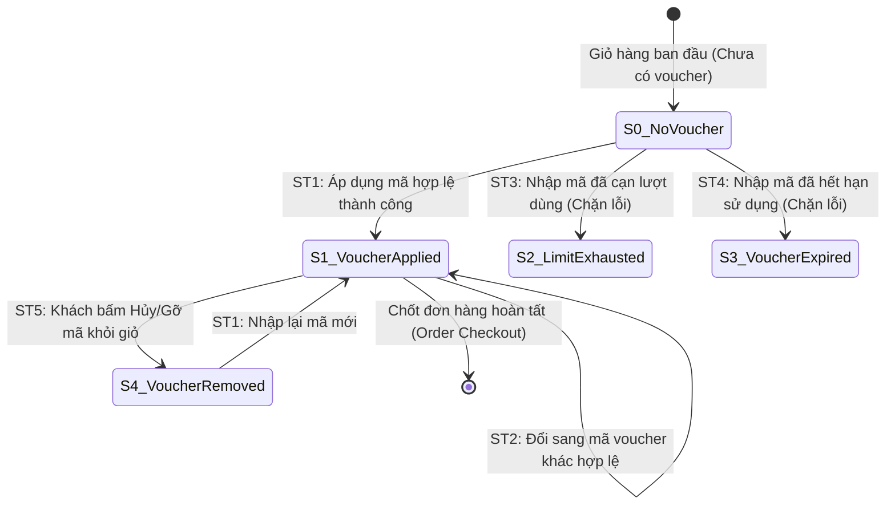

# THIẾT KẾ TEST CASE HỘP ĐEN: ÁP DỤNG MÃ GIẢM GIÁ (CUSTOMER VOUCHER APPLICATION)

> **Chức năng:** Kiểm tra tính hợp lệ và áp dụng mã giảm giá (Voucher) cho đơn hàng dành cho Khách hàng (`POST /api/v1/vouchers/apply` và `GET /api/v1/vouchers`).  

---

## 1. Xác Định Biến Đầu Vào & Ràng Buộc Nghiệp Vụ (Input Variables)

| Tên Biến | Ý Nghĩa | Kiểu | Ràng Buộc & Miền Giá Trị Hợp Lệ |
| :--- | :--- | :---: | :--- |
| **`voucherCode`** | Mã giảm giá người dùng nhập | `String` | Độ dài $[1, 50]$, không rỗng, tự động UPPERCASE, tồn tại trong CSDL |
| **`orderAmount`** | Tổng giá trị đơn hàng hiện tại | `double` | Số thực $> 0$ (ngưỡng nghiệp vụ $[500.0, 50.000.0]$ nghìn VNĐ) |
| **`discountPercent`**| Tỷ lệ chiết khấu theo % | `double` | Số thực trong đoạn $[1.0, 100.0]\%$ (đối với voucher % discount) |
| **`usedCount`** | Lượt dùng chung toàn hệ thống | `int` | $0 \le usedCount < usageLimit$ (ngưỡng tối đa 50 lượt) |
| **`userUsedCount`**| Lượt dùng cá nhân của User | `int` | $0 \le userUsedCount < perUserLimit$ (ngưỡng tối đa 2 lượt/khách) |
| **`active`** | Trạng thái kích hoạt của mã | `boolean` | Bắt buộc `true` (Hoạt động). Nếu `false` từ chối áp dụng |
| **`expiryDate`** | Hạn sử dụng của mã | `Date` | Ngày trong tương lai ($> \text{thời điểm hiện tại}$) hoặc `null` |
| **`currentUser`** | Trạng thái tài khoản người dùng | `User` | Khách vãng lai (`Guest`) hoặc Thành viên đã đăng nhập (`ROLE_USER`) |

---

## 2. Bảng Phân Hoạch Tương Đương (Equivalence Partitioning - EP)

| STT | Biến / Điều kiện | Lớp hợp lệ (Valid) | Tag | Lớp không hợp lệ (Invalid) | Tag |
| :-: | :--- | :--- | :---: | :--- | :---: |
| **1** | **Mã voucher (`voucherCode`)** | Mã tồn tại trong CSDL, `active = true` | **V1** | • Để trống hoặc rỗng (`null` / `""`) • Mã không tồn tại trong CSDL • Mã đã bị vô hiệu hóa (`active = false`) | **X1** **X2** **X3** |
| **2** | **Giá trị đơn hàng (`orderAmount`)**| $500.0 \le orderAmount \le 50.000.0$ k VNĐ | **V2** | • Chưa đạt mức tối thiểu ($orderAmount < 500.0$ k) • Vượt trần giao dịch ($orderAmount > 50.000.0$ k) | **X4** **X5** |
| **3** | **Chiết khấu (`discountPercent`)** | $1.0 \le discountPercent \le 100.0\%$ | **V3** | • Chiết khấu dưới mức tối thiểu ($< 1.0\%$) • Vượt quá trần 100% ($> 100.0\%$) | **X6** **X7** |
| **4** | **Lượt dùng chung (`usedCount`)** | $0 \le usedCount < usageLimit$ ($0 \to 49$) | **V4** | • Lượt dùng âm ($< 0$) • Đã cạn lượt toàn hệ thống ($usedCount \ge 50$) | **X8** **X9** |
| **5** | **Lượt dùng cá nhân (`userUsedCount`)**| $0 \le userUsedCount < perUserLimit$ ($0 \to 1$) | **V5** | • Lượt dùng âm ($< 0$) • Đã hết lượt cá nhân ($userUsedCount \ge 2$) | **X10** **X11** |
| **6** | **Hạn sử dụng (`expiryDate`)** | Ngày hết hạn còn hiệu lực ($> \text{now}$) | **V6** | Mã đã quá hạn sử dụng ($\le \text{now}$) | **X12** |
| **7** | **Đối tượng áp dụng (`currentUser`)** | Khách vãng lai (Guest) bỏ qua perUserLimit | **V7** | - | - |

---

## 3. Bảng Phân Tích Giá Trị Biên (Boundary Value Analysis - BVA)

### 3.1 Bảng 7 mốc giá trị biên Robustness BVA cho 4 biến định lượng

*(Ghi chú bộ giá trị danh định: `orderAmount` $nom = 25.000.0$ k VNĐ, `discountPercent` $nom = 20.0\%$, `usedCount` $nom = 25$ lượt, `userUsedCount` $nom = 1$ lượt).*

| Biến Định Lượng | Ngoại biên dưới ($min^-$) | Cận dưới ($min$) | Kề dưới ($min^+$) | Danh định ($nom$) | Kề trên ($max^-$) | Cận trên ($max$) | Ngoại biên trên ($max^+$) | Quy tắc & Giới hạn |
| :--- | :---: | :---: | :---: | :---: | :---: | :---: | :---: | :--- |
| **1. Đơn hàng `orderAmount` (k)** | `499.0` | **`500.0`** | **`501.0`** | **`25.000.0`** | **`49.999.0`** | **`50.000.0`** | `50.001.0` | Miền $[500.0, 50.000.0]$ k VNĐ. Dưới 500k từ chối |
| **2. Tỷ lệ `discountPercent` (%)**| `0.9` | **`1.0`** | **`1.1`** | **`20.0`** | **`99.9`** | **`100.0`** | `100.1` | Miền $[1.0, 100.0]\%$. Ngoài khoảng báo lỗi |
| **3. Lượt chung `usedCount`** | `-1` | **`0`** | **`1`** | **`25`** | **`48`** | **`49`** | `50` | Giới hạn 50 lượt. $\ge 50$ báo hết lượt hệ thống |
| **4. Lượt cá nhân `userUsedCount`**| `-1` | **`0`** | **`1`** | **`1`** | **`1`** | **`1`** | `2` | Giới hạn 2 lượt/khách. $\ge 2$ báo hết lượt cá nhân |

---

### 3.2 Bảng 25 Ca Kiểm Thử Robustness BVA ($6n + 1 = 25$)

| Case | Đơn hàng (`orderAmount`) | Chiết khấu (`discount`) | Lượt chung (`used`) | Lượt cá nhân (`userUsed`) | Mốc kiểm thử | Kết quả mong đợi (Expected Output) | Tag Biên |
| :-: | :--- | :--- | :--- | :--- | :---: | :--- | :-: |
| **1** | `25.000.0k` *(nom)* | `20.0%` *(nom)* | `25` *(nom)* | `1` *(nom)* | **Tất cả ở nom** | **HTTP 200 OK:** Áp dụng mã thành công, giảm 5.000.000 VNĐ | **B1** |
| **2** | `499.0k` *(min-)* | `20.0%` | `25` | `1` | `amount = min-` | **HTTP 400 Bad Request:** Đơn hàng chưa đạt mức tối thiểu 500k | **B2** |
| **3** | `500.0k` *(min)* | `20.0%` | `25` | `1` | `amount = min` | **HTTP 200 OK:** Áp dụng thành công tại cận dưới tối thiểu | **B3** |
| **4** | `501.0k` *(min+)* | `20.0%` | `25` | `1` | `amount = min+` | **HTTP 200 OK:** Áp dụng thành công tại kề cận dưới | **B4** |
| **5** | `49.999.0k` *(max-)*| `20.0%` | `25` | `1` | `amount = max-` | **HTTP 200 OK:** Áp dụng thành công tại kề cận trên | **B5** |
| **6** | `50.000.0k` *(max)* | `20.0%` | `25` | `1` | `amount = max` | **HTTP 200 OK:** Áp dụng thành công tại cận trên tối đa | **B6** |
| **7** | `50.001.0k` *(max+)*| `20.0%` | `25` | `1` | `amount = max+` | **HTTP 400 Bad Request:** Đơn hàng vượt trần 50.000k VNĐ | **B7** |
| **8** | `25.000.0k` | `0.9%` *(min-)* | `25` | `1` | `discount = min-` | **HTTP 400 Bad Request:** Tỷ lệ chiết khấu nhỏ hơn 1% | **B8** |
| **9** | `25.000.0k` | `1.0%` *(min)* | `25` | `1` | `discount = min` | **HTTP 200 OK:** Áp dụng chiết khấu cận dưới 1% | **B9** |
| **10**| `25.000.0k` | `1.1%` *(min+)* | `25` | `1` | `discount = min+` | **HTTP 200 OK:** Áp dụng chiết khấu kề cận dưới 1.1% | **B10**|
| **11**| `25.000.0k` | `99.9%` *(max-)*| `25` | `1` | `discount = max-` | **HTTP 200 OK:** Áp dụng chiết khấu kề cận trên 99.9% | **B11**|
| **12**| `25.000.0k` | `100.0%` *(max)*| `25` | `1` | `discount = max` | **HTTP 200 OK:** Áp dụng chiết khấu tối đa 100% | **B12**|
| **13**| `25.000.0k` | `100.1%` *(max+)*| `25` | `1` | `discount = max+`| **HTTP 400 Bad Request:** Tỷ lệ chiết khấu vượt quá 100% | **B13**|
| **14**| `25.000.0k` | `20.0%` | `-1` *(min-)* | `1` | `used = min-` | **HTTP 400 Bad Request:** Lượt sử dụng âm không hợp lệ | **B14**|
| **15**| `25.000.0k` | `20.0%` | `0` *(min)* | `1` | `used = min` | **HTTP 200 OK:** Áp dụng thành công cho lượt dùng đầu tiên | **B15**|
| **16**| `25.000.0k` | `20.0%` | `1` *(min+)* | `1` | `used = min+` | **HTTP 200 OK:** Áp dụng thành công cho lượt dùng thứ 2 | **B16**|
| **17**| `25.000.0k` | `20.0%` | `48` *(max-)* | `1` | `used = max-` | **HTTP 200 OK:** Áp dụng thành công tại lượt dùng thứ 49 | **B17**|
| **18**| `25.000.0k` | `20.0%` | `49` *(max)* | `1` | `used = max` | **HTTP 200 OK:** Áp dụng thành công cho lượt dùng cuối cùng 50 | **B18**|
| **19**| `25.000.0k` | `20.0%` | `50` *(max+)* | `1` | `used = max+` | **HTTP 400 Bad Request:** Mã giảm giá đã hết số lượt sử dụng | **B19**|
| **20**| `25.000.0k` | `20.0%` | `25` | `-1` *(min-)* | `userUsed = min-` | **HTTP 400 Bad Request:** Lượt dùng cá nhân không hợp lệ | **B20**|
| **21**| `25.000.0k` | `20.0%` | `25` | `0` *(min)* | `userUsed = min` | **HTTP 200 OK:** Áp dụng thành công lần đầu cho tài khoản | **B21**|
| **22**| `25.000.0k` | `20.0%` | `25` | `1` *(max)* | `userUsed = max` | **HTTP 200 OK:** Áp dụng thành công lần thứ 2 (chạm hạn mức) | **B22**|
| **23**| `25.000.0k` | `20.0%` | `25` | `2` *(max+)* | `userUsed = max+` | **HTTP 400 Bad Request:** Tài khoản của bạn đã dùng hết lượt | **B23**|
| **24**| `25.000.0k` | `20.0%` | `25` | `Guest` | `user = Guest` | **HTTP 200 OK:** Khách vãng lai áp dụng thành công (bỏ qua hạn cá nhân) | **B24**|
| **25**| `25.000.0k` | `Fix: 50.0k` | `25` | `1` | `type = FIXED` | **HTTP 200 OK:** Áp dụng voucher giảm tiền cố định 50k thành công | **B25**|

---

## 4. Kỹ Thuật Bảng Quyết Định (Decision Table Testing)

### 4.1 Bảng Quyết Định Rút Gọn (Collapsed Decision Table - 8 Rules)

| Điều kiện & Hành động | Rule 1 | Rule 2 | Rule 3 | Rule 4 | Rule 5 | Rule 6 | Rule 7 | Rule 8 |
| :--- | :---: | :---: | :---: | :---: | :---: | :---: | :---: | :---: |
| **C1: Mã tồn tại trong CSDL?** | **N** | Y | Y | Y | Y | Y | Y | Y |
| **C2: Đang kích hoạt (`active = true`)?** | - | **N** | Y | Y | Y | Y | Y | Y |
| **C3: Còn hạn dùng (`date <= expiry`)?** | - | - | **N** | Y | Y | Y | Y | Y |
| **C4: Đạt đơn tối thiểu (`total >= min`)?** | - | - | - | **N** | Y | Y | Y | Y |
| **C5: Còn lượt chung (`used < limit`)?** | - | - | - | - | **N** | Y | Y | Y |
| **C6: Là Khách vãng lai (Guest)?** | - | - | - | - | - | **Y** | N | N |
| **C7: Còn lượt User (`userUsed < limit`)?** | - | - | - | - | - | - | **N** | **Y** |
| *A1: Báo lỗi 'Mã không tồn tại / vô hiệu' (HTTP 400)* | **X** | **X** | - | - | - | - | - | - |
| *A2: Báo lỗi 'Mã đã hết hạn sử dụng' (HTTP 400)* | - | - | **X** | - | - | - | - | - |
| *A3: Báo lỗi 'Chưa đạt đơn tối thiểu' (HTTP 400)* | - | - | - | **X** | - | - | - | - |
| *A4: Báo lỗi 'Hết lượt toàn hệ thống' (HTTP 400)* | - | - | - | - | **X** | - | - | - |
| *A5: Báo lỗi 'Tài khoản đã hết lượt' (HTTP 400)* | - | - | - | - | - | - | **X** | - |
| *A6: Áp dụng thành công (HTTP 200 OK)* | - | - | - | - | - | **X** | - | **X** |
| **Tag Bảng Quyết Định** | **D1** | **D2** | **D3** | **D4** | **D5** | **D6** | **D7** | **D8** |

*Giải thích quy tắc nghiệp vụ:*
- **Rule 1 (`D1`):** Mã voucher không tồn tại trong hệ thống $\to$ Báo lỗi `HTTP 400 Bad Request`.
- **Rule 2 (`D2`):** Mã voucher đã bị Quản trị viên tắt kích hoạt (`active = false`) $\to$ Báo lỗi `HTTP 400 Bad Request`.
- **Rule 3 (`D3`):** Mã voucher đã qua ngày hết hạn (`expiryDate < now`) $\to$ Báo lỗi `HTTP 400 Bad Request`.
- **Rule 4 (`D4`):** Tổng giá trị giỏ hàng chưa đạt giá trị tối thiểu của mã $\to$ Báo lỗi `HTTP 400 Bad Request`.
- **Rule 5 (`D5`):** Tổng số lượt dùng chung của mã đã chạm giới hạn (`usedCount >= usageLimit`) $\to$ Báo lỗi `HTTP 400 Bad Request`.
- **Rule 6 (`D6`):** Khách vãng lai (chưa đăng nhập) thỏa mãn mọi điều kiện $\to$ Bỏ qua kiểm tra perUserLimit, áp dụng thành công (`HTTP 200 OK`).
- **Rule 7 (`D7`):** Tài khoản đã đăng nhập đã dùng hết số lượt cá nhân cho phép $\to$ Báo lỗi `HTTP 400 Bad Request`.
- **Rule 8 (`D8`):** Tài khoản đã đăng nhập thỏa mãn mọi điều kiện và còn lượt cá nhân $\to$ Áp dụng thành công (`HTTP 200 OK`).

---

## 5. Kỹ Thuật Kiểm Thử Chuyển Đổi Trạng Thái (State Transition Testing - STT)

### 5.1 Sơ đồ chuyển đổi trạng thái áp dụng Voucher

### 5.2 Bảng phân tích chi tiết các Ca chuyển đổi trạng thái (State Transition Details)

| Mã Transition | Trạng thái ban đầu | Hành động / Sự kiện | Trạng thái kế tiếp | Kết quả xử lý hệ thống | Tag |
| :---: | :--- | :--- | :--- | :--- | :---: |
| **ST_01** | `S0_NoVoucher` | Gửi `POST /apply` với mã hợp lệ | `S1_VoucherApplied` | Giảm trừ tiền thành công, gán voucher vào Session Cart | **ST1** |
| **ST_02** | `S1_VoucherApplied` | Gửi `POST /apply` với mã hợp lệ khác | `S1_VoucherApplied` | Ghi đè mã mới, tính lại mức giảm tương ứng | **ST2** |
| **ST_03** | `S0_NoVoucher` | Gửi `POST /apply` với mã hết lượt | `S2_LimitExhausted` | Giữ nguyên giỏ hàng, thông báo lỗi hết lượt | **ST3** |
| **ST_04** | `S0_NoVoucher` | Gửi `POST /apply` với mã hết hạn | `S3_VoucherExpired` | Giữ nguyên giỏ hàng, thông báo lỗi hết hạn | **ST4** |
| **ST_05** | `S1_VoucherApplied` | Xóa mã giảm giá khỏi giỏ hàng | `S4_VoucherRemoved` | Xóa `voucherCode`, đưa `discountAmount = 0`, khôi phục giá gốc | **ST5** |

---

## 6. Thiết Kế Bảng Test Cases Chi Tiết Triển Khai (Đầy Đủ Không Rút Gọn - 57 Ca Kiểm Thử)

| STT | Mã Test Case | Tên ca kiểm thử | Dữ liệu kiểm thử (Test Input Data) | Kết quả mong đợi (Expected Output) | Tag được bao phủ |
| :-: | :--- | :--- | :--- | :--- | :---: |
| **1** | **TC_VOU_01** | Áp dụng mã voucher hợp lệ đang kích hoạt | • `voucherCode`: `"SALE10"` (`active = true`, CSDL có sẵn) | **HTTP 200 OK:** Áp dụng mã thành công, trừ chiết khấu vào giỏ hàng. | **V1** |
| **2** | **TC_VOU_02** | Áp dụng voucher với giá trị đơn hàng trong ngưỡng hợp lệ | • `orderAmount`: `25.000.0k` VNĐ ($500.0k \le amount \le 50.000.0k$) | **HTTP 200 OK:** Đơn hàng đủ điều kiện giá trị, giảm giá chính xác. | **V2** |
| **3** | **TC_VOU_03** | Áp dụng voucher có phần trăm chiết khấu hợp lệ | • `discountPercent`: `20.0%` ($1.0% \le discount \le 100.0%$) | **HTTP 200 OK:** Giảm 20% trên tổng giá trị các sản phẩm hợp lệ. | **V3** |
| **4** | **TC_VOU_04** | Áp dụng voucher khi tổng lượt dùng chung còn hiệu lực | • `usedCount`: `25` lượt ($0 \le usedCount < 50$ lượt tối đa) | **HTTP 200 OK:** Tiếp nhận và tăng `usedCount` thêm 1 lượt. | **V4** |
| **5** | **TC_VOU_05** | Áp dụng voucher khi lượt dùng cá nhân của User còn hiệu lực | • `userUsedCount`: `0` hoặc `1` ($0 \le userUsedCount < 2$ lượt/user) | **HTTP 200 OK:** Ghi nhận 1 lượt sử dụng cho tài khoản khách hàng. | **V5** |
| **6** | **TC_VOU_06** | Áp dụng voucher khi thời hạn sử dụng còn hiệu lực | • `expiryDate`: Ngày hết hạn trong tương lai ($> \text{now}$) | **HTTP 200 OK:** Voucher còn hạn, hệ thống tính chiết khấu. | **V6** |
| **7** | **TC_VOU_07** | Khách vãng lai (Guest) áp dụng voucher thành công | • `currentUser`: `Guest` (Chưa đăng nhập) • Bỏ qua perUserLimit | **HTTP 200 OK:** Khách vãng lai được áp dụng mã voucher bình thường. | **V7** |
| **8** | **TC_VOU_08** | Báo lỗi khi để trống mã voucher (null hoặc rỗng) | • `voucherCode`: `""` (rỗng hoặc `null`) | **HTTP 400 Bad Request:** Mã voucher không được để trống. | **X1** |
| **9** | **TC_VOU_09** | Từ chối mã voucher không tồn tại trong CSDL | • `voucherCode`: `"VOUCHER_NOT_FOUND_999"` | **HTTP 400 Bad Request:** Mã giảm giá không tồn tại trong hệ thống. | **X2** |
| **10** | **TC_VOU_10** | Từ chối mã voucher đã bị vô hiệu hóa | • `voucherCode`: Mã có `active = false` trong CSDL | **HTTP 400 Bad Request:** Mã giảm giá đã bị tạm ngưng kích hoạt. | **X3** |
| **11** | **TC_VOU_11** | Từ chối áp dụng khi đơn hàng chưa đạt mức tối thiểu | • `orderAmount`: `499.0k` VNĐ (Mức tối thiểu = `500.0k`) | **HTTP 400 Bad Request:** Đơn hàng chưa đạt giá trị tối thiểu để áp dụng mã. | **X4** |
| **12** | **TC_VOU_12** | Từ chối áp dụng khi đơn hàng vượt quá trần tối đa | • `orderAmount`: `50.001.0k` VNĐ (Trần tối đa = `50.000.0k`) | **HTTP 400 Bad Request:** Giá trị đơn hàng vượt trần quy định của voucher. | **X5** |
| **13** | **TC_VOU_13** | Từ chối voucher có mức chiết khấu dưới 1% | • `discountPercent`: `0.9%` (Ngưỡng tối thiểu = `1.0%`) | **HTTP 400 Bad Request:** Phần trăm chiết khấu không hợp lệ (< 1%). | **X6** |
| **14** | **TC_VOU_14** | Từ chối voucher có mức chiết khấu vượt trần 100% | • `discountPercent`: `100.1%` (Trần tối đa = `100.0%`) | **HTTP 400 Bad Request:** Phần trăm chiết khấu không được vượt quá 100%. | **X7** |
| **15** | **TC_VOU_15** | Chặn hệ thống khi số lượt dùng chung là số âm | • `usedCount`: `-1` (Số âm bất hợp pháp) | **HTTP 400 Bad Request:** Số lượt sử dụng không được là số âm. | **X8** |
| **16** | **TC_VOU_16** | Từ chối voucher khi đã cạn kiệt tổng lượt dùng hệ thống | • `usedCount`: `50` lượt (Đạt trần `usageLimit = 50`) | **HTTP 400 Bad Request:** Mã giảm giá đã hết lượt sử dụng toàn hệ thống. | **X9** |
| **17** | **TC_VOU_17** | Chặn hệ thống khi số lượt dùng cá nhân là số âm | • `userUsedCount`: `-1` (Số âm bất hợp pháp) | **HTTP 400 Bad Request:** Số lượt sử dụng cá nhân không được âm. | **X10** |
| **18** | **TC_VOU_18** | Từ chối voucher khi User đã dùng hết số lượt cá nhân | • `userUsedCount`: `2` lượt (Đạt trần `perUserLimit = 2`) | **HTTP 400 Bad Request:** Tài khoản của bạn đã dùng hết số lượt cho phép. | **X11** |
| **19** | **TC_VOU_19** | Từ chối mã voucher đã quá hạn sử dụng | • `expiryDate`: Ngày hết hạn trong quá khứ ($< \text{now}$) | **HTTP 400 Bad Request:** Mã giảm giá đã hết hạn sử dụng. | **X12** |
| **20** | **TC_VOU_20** | Robustness BVA: Tất cả 4 biến định lượng ở mốc danh định | • `orderAmount`: 25.000k, `discount`: 20%, `used`: 25, `userUsed`: 1 | **HTTP 200 OK:** Áp dụng voucher thành công tại bộ giá trị danh định. | **B1** |
| **21** | **TC_VOU_21** | Robustness BVA: Giá trị đơn hàng tại ngoại biên dưới min- | • `orderAmount`: `499.0k` VNĐ (Dưới min 500k) | **HTTP 400 Bad Request:** Đơn hàng chưa đạt mức tối thiểu 500k VNĐ. | **B2** |
| **22** | **TC_VOU_22** | Robustness BVA: Giá trị đơn hàng tại cận dưới min | • `orderAmount`: `500.0k` VNĐ (Vừa chạm mốc min) | **HTTP 200 OK:** Áp dụng thành công tại cận dưới tối thiểu 500k VNĐ. | **B3** |
| **23** | **TC_VOU_23** | Robustness BVA: Giá trị đơn hàng tại kề cận dưới min+ | • `orderAmount`: `501.0k` VNĐ (Kề cận dưới) | **HTTP 200 OK:** Áp dụng thành công tại cận kề dưới 501k VNĐ. | **B4** |
| **24** | **TC_VOU_24** | Robustness BVA: Giá trị đơn hàng tại kề cận trên max- | • `orderAmount`: `49.999.0k` VNĐ (Kề cận trên) | **HTTP 200 OK:** Áp dụng thành công tại cận kề trên 49.999k VNĐ. | **B5** |
| **25** | **TC_VOU_25** | Robustness BVA: Giá trị đơn hàng tại cận trên max | • `orderAmount`: `50.000.0k` VNĐ (Chạm trần max) | **HTTP 200 OK:** Áp dụng thành công tại cận trên tối đa 50.000k VNĐ. | **B6** |
| **26** | **TC_VOU_26** | Robustness BVA: Giá trị đơn hàng tại ngoại biên trên max+ | • `orderAmount`: `50.001.0k` VNĐ (Vượt trần max) | **HTTP 400 Bad Request:** Đơn hàng vượt trần 50.000k VNĐ. | **B7** |
| **27** | **TC_VOU_27** | Robustness BVA: Tỷ lệ chiết khấu tại ngoại biên dưới min- | • `discountPercent`: `0.9%` (< 1%) | **HTTP 400 Bad Request:** Tỷ lệ chiết khấu nhỏ hơn 1%. | **B8** |
| **28** | **TC_VOU_28** | Robustness BVA: Tỷ lệ chiết khấu tại cận dưới min | • `discountPercent`: `1.0%` (Chạm min) | **HTTP 200 OK:** Áp dụng chiết khấu cận dưới 1% thành công. | **B9** |
| **29** | **TC_VOU_29** | Robustness BVA: Tỷ lệ chiết khấu tại kề cận dưới min+ | • `discountPercent`: `1.1%` (Kề min) | **HTTP 200 OK:** Áp dụng chiết khấu kề cận dưới 1.1% thành công. | **B10** |
| **30** | **TC_VOU_30** | Robustness BVA: Tỷ lệ chiết khấu tại kề cận trên max- | • `discountPercent`: `99.9%` (Kề max) | **HTTP 200 OK:** Áp dụng chiết khấu kề cận trên 99.9% thành công. | **B11** |
| **31** | **TC_VOU_31** | Robustness BVA: Tỷ lệ chiết khấu tại cận trên max | • `discountPercent`: `100.0%` (Chạm max) | **HTTP 200 OK:** Áp dụng chiết khấu tối đa 100% thành công. | **B12** |
| **32** | **TC_VOU_32** | Robustness BVA: Tỷ lệ chiết khấu tại ngoại biên trên max+ | • `discountPercent`: `100.1%` (> 100%) | **HTTP 400 Bad Request:** Tỷ lệ chiết khấu vượt quá 100%. | **B13** |
| **33** | **TC_VOU_33** | Robustness BVA: Lượt dùng chung tại ngoại biên dưới min- | • `usedCount`: `-1` (Âm) | **HTTP 400 Bad Request:** Lượt sử dụng âm không hợp lệ. | **B14** |
| **34** | **TC_VOU_34** | Robustness BVA: Lượt dùng chung tại cận dưới min | • `usedCount`: `0` (Lượt đầu tiên) | **HTTP 200 OK:** Áp dụng thành công cho lượt dùng đầu tiên. | **B15** |
| **35** | **TC_VOU_35** | Robustness BVA: Lượt dùng chung tại kề cận dưới min+ | • `usedCount`: `1` (Lượt thứ 2) | **HTTP 200 OK:** Áp dụng thành công cho lượt dùng thứ 2. | **B16** |
| **36** | **TC_VOU_36** | Robustness BVA: Lượt dùng chung tại kề cận trên max- | • `usedCount`: `48` (Lượt thứ 49) | **HTTP 200 OK:** Áp dụng thành công tại lượt dùng thứ 49. | **B17** |
| **37** | **TC_VOU_37** | Robustness BVA: Lượt dùng chung tại cận trên max | • `usedCount`: `49` (Lượt cuối cùng 50) | **HTTP 200 OK:** Áp dụng thành công cho lượt dùng cuối cùng 50. | **B18** |
| **38** | **TC_VOU_38** | Robustness BVA: Lượt dùng chung tại ngoại biên trên max+ | • `usedCount`: `50` (Đã hết lượt) | **HTTP 400 Bad Request:** Mã giảm giá đã hết số lượt sử dụng. | **B19** |
| **39** | **TC_VOU_39** | Robustness BVA: Lượt dùng cá nhân tại ngoại biên dưới min- | • `userUsedCount`: `-1` (Âm) | **HTTP 400 Bad Request:** Lượt dùng cá nhân không hợp lệ. | **B20** |
| **40** | **TC_VOU_40** | Robustness BVA: Lượt dùng cá nhân tại cận dưới min | • `userUsedCount`: `0` (Lần đầu của tài khoản) | **HTTP 200 OK:** Áp dụng thành công lần đầu cho tài khoản. | **B21** |
| **41** | **TC_VOU_41** | Robustness BVA: Lượt dùng cá nhân tại cận trên max | • `userUsedCount`: `1` (Lần 2 chạm hạn mức) | **HTTP 200 OK:** Áp dụng thành công lần thứ 2 (chạm hạn mức). | **B22** |
| **42** | **TC_VOU_42** | Robustness BVA: Lượt dùng cá nhân tại ngoại biên trên max+ | • `userUsedCount`: `2` (Hết lượt cá nhân) | **HTTP 400 Bad Request:** Tài khoản của bạn đã dùng hết lượt. | **B23** |
| **43** | **TC_VOU_43** | Robustness BVA: Khách vãng lai bỏ qua kiểm tra perUserLimit | • `currentUser`: `Guest`, `userUsedCount`: Bỏ qua | **HTTP 200 OK:** Khách vãng lai áp dụng thành công không bị chặn cá nhân. | **B24** |
| **44** | **TC_VOU_44** | Robustness BVA: Áp dụng voucher loại giảm tiền cố định | • `voucherType`: `FIXED`, giảm trừ `50.0k` VNĐ | **HTTP 200 OK:** Áp dụng voucher giảm tiền cố định 50k thành công. | **B25** |
| **45** | **TC_VOU_45** | Decision Table: Rule 1 - Mã voucher không tồn tại trong CSDL | • `voucherCode`: Mã rác không có trong DB | **HTTP 400 Bad Request:** Báo lỗi mã không tồn tại. | **D1** |
| **46** | **TC_VOU_46** | Decision Table: Rule 2 - Mã voucher bị vô hiệu hóa | • `voucherCode`: Mã có `active = false` | **HTTP 400 Bad Request:** Báo lỗi mã đã bị vô hiệu hóa. | **D2** |
| **47** | **TC_VOU_47** | Decision Table: Rule 3 - Mã voucher đã quá hạn dùng | • `expiryDate`: Quá hạn (`date > expiry`) | **HTTP 400 Bad Request:** Báo lỗi mã đã hết hạn sử dụng. | **D3** |
| **48** | **TC_VOU_48** | Decision Table: Rule 4 - Đơn hàng chưa đạt mức tối thiểu | • `orderAmount` nhỏ hơn `minOrderValue` | **HTTP 400 Bad Request:** Báo lỗi chưa đạt đơn tối thiểu. | **D4** |
| **49** | **TC_VOU_49** | Decision Table: Rule 5 - Hết số lượt dùng chung toàn hệ thống | • `usedCount >= usageLimit` | **HTTP 400 Bad Request:** Báo lỗi mã đã hết lượt sử dụng. | **D5** |
| **50** | **TC_VOU_50** | Decision Table: Rule 6 - Khách vãng lai hợp lệ bỏ qua perUserLimit | • `currentUser`: `Guest`, các điều kiện khác hợp lệ | **HTTP 200 OK:** Bỏ qua lượt cá nhân, áp dụng thành công. | **D6** |
| **51** | **TC_VOU_51** | Decision Table: Rule 7 - User đăng nhập đã hết lượt dùng cá nhân | • User đăng nhập có `userUsed >= perUserLimit` | **HTTP 400 Bad Request:** Báo lỗi bạn đã hết lượt dùng. | **D7** |
| **52** | **TC_VOU_52** | Decision Table: Rule 8 - Luồng áp dụng thành công đầy đủ điều kiện | • Tất cả 7 điều kiện đều thỏa mãn hoàn hảo | **HTTP 200 OK:** Áp dụng voucher thành công, tính tiền chuẩn xác. | **D8** |
| **53** | **TC_VOU_53** | State Transition: ST1 - Áp dụng mã hợp lệ thành công | • Từ `S0_NoVoucher` gửi `POST /apply` mã hợp lệ | **Chuyển trạng thái:** Sang `S1_VoucherApplied`, giảm trừ tiền giỏ. | **ST1** |
| **54** | **TC_VOU_54** | State Transition: ST2 - Đổi sang mã voucher khác hợp lệ | • Từ `S1_VoucherApplied` gửi `POST /apply` mã hợp lệ khác | **Giữ trạng thái:** Ghi đè mã mới, cập nhật lại số tiền giảm. | **ST2** |
| **55** | **TC_VOU_55** | State Transition: ST3 - Nhập mã đã cạn lượt sử dụng | • Từ `S0_NoVoucher` gửi `POST /apply` mã đã hết lượt | **Chặn lỗi:** Chuyển `S2_LimitExhausted`, giữ nguyên giỏ hàng. | **ST3** |
| **56** | **TC_VOU_56** | State Transition: ST4 - Nhập mã đã hết hạn sử dụng | • Từ `S0_NoVoucher` gửi `POST /apply` mã quá hạn | **Chặn lỗi:** Chuyển `S3_VoucherExpired`, giữ nguyên giỏ hàng. | **ST4** |
| **57** | **TC_VOU_57** | State Transition: ST5 - Hủy và gỡ bỏ mã voucher khỏi giỏ hàng | • Từ `S1_VoucherApplied` bấm xóa mã giảm giá | **Chuyển trạng thái:** Sang `S4_VoucherRemoved`, khôi phục giá gốc. | **ST5** |
