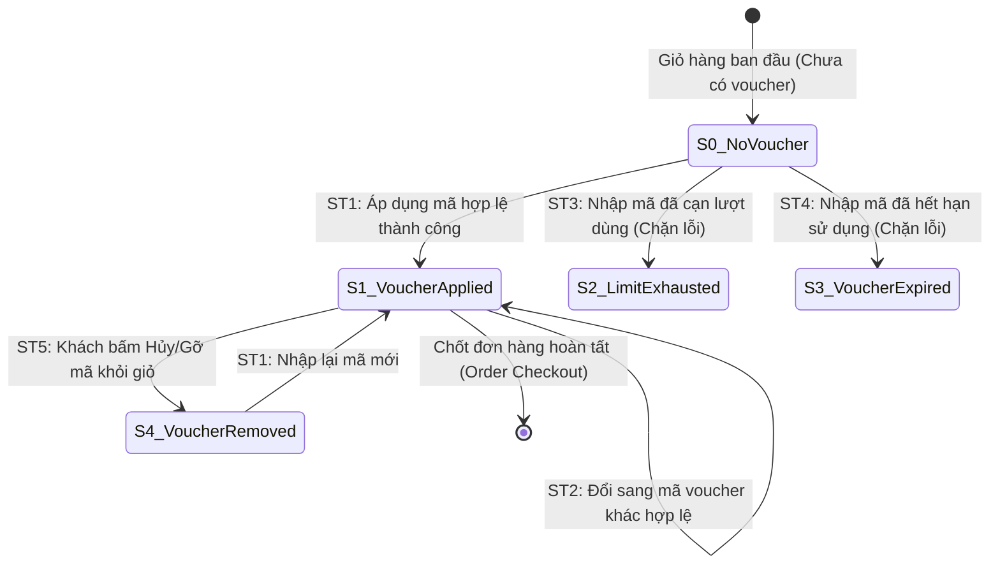

# THIẾT KẾ TEST CASE HỘP ĐEN: ÁP DỤNG MÃ GIẢM GIÁ (CUSTOMER VOUCHER APPLICATION)

> **Chức năng:** Kiểm tra tính hợp lệ và áp dụng mã giảm giá (Voucher) cho đơn hàng dành cho Khách hàng (`POST /api/v1/vouchers/apply` và `GET /api/v1/vouchers`).  
> **Người thực hiện:** Nguyễn Hoàng Phương (MSSV: `080205010954` / `NguyenHoangPhuong275`)

---

## 1. Xác Định Biến Đầu Vào & Ràng Buộc Nghiệp Vụ (Input Variables)

| Tên Biến | Ý Nghĩa | Kiểu | Ràng Buộc & Miền Giá Trị Hợp Lệ |
| :--- | :--- | :---: | :--- |
| **`voucherCode`** | Mã giảm giá người dùng nhập | `String` | Độ dài $[1, 50]$, không rỗng, tự động UPPERCASE, tồn tại trong CSDL |
| **`orderAmount`** | Tổng giá trị đơn hàng hiện tại | `double` | Số thực $> 0$ (ngưỡng nghiệp vụ $[500.0, 50.000.0]$ nghìn VNĐ) |
| **`discountPercent`**| Tỷ lệ chiết khấu theo % | `double` | Số thực trong đoạn $[1.0, 100.0]\%$ (đối với voucher % discount) |
| **`usedCount`** | Lượt dùng chung toàn hệ thống | `int` | $0 \le usedCount < usageLimit$ (ngưỡng tối đa 50 lượt) |
| **`userUsedCount`**| Lượt dùng cá nhân của User | `int` | $0 \le userUsedCount < perUserLimit$ (ngưỡng tối đa 2 lượt/khách) |
| **`active`** | Trạng thái kích hoạt của mã | `boolean` | Bắt buộc `true` (Hoạt động). Nếu `false` từ chối áp dụng |
| **`expiryDate`** | Hạn sử dụng của mã | `Date` | Ngày trong tương lai ($> \text{thời điểm hiện tại}$) hoặc `null` |
| **`currentUser`** | Trạng thái tài khoản người dùng | `User` | Khách vãng lai (`Guest`) hoặc Thành viên đã đăng nhập (`ROLE_USER`) |

---

## 2. Bảng Phân Hoạch Tương Đương (Equivalence Partitioning - EP)

| STT | Biến / Điều kiện | Lớp hợp lệ (Valid) | Tag | Lớp không hợp lệ (Invalid) | Tag |
| :-: | :--- | :--- | :---: | :--- | :---: |
| **1** | **Mã voucher (`voucherCode`)** | Mã tồn tại trong CSDL, `active = true` | **V1** | • Để trống hoặc rỗng (`null` / `""`)<br>• Mã không tồn tại trong CSDL<br>• Mã đã bị vô hiệu hóa (`active = false`) | **X1**<br>**X2**<br>**X3** |
| **2** | **Giá trị đơn hàng (`orderAmount`)**| $500.0 \le orderAmount \le 50.000.0$ k VNĐ | **V2** | • Chưa đạt mức tối thiểu ($orderAmount < 500.0$ k)<br>• Vượt trần giao dịch ($orderAmount > 50.000.0$ k) | **X4**<br>**X5** |
| **3** | **Chiết khấu (`discountPercent`)** | $1.0 \le discountPercent \le 100.0\%$ | **V3** | • Chiết khấu dưới mức tối thiểu ($< 1.0\%$)<br>• Vượt quá trần 100% ($> 100.0\%$) | **X6**<br>**X7** |
| **4** | **Lượt dùng chung (`usedCount`)** | $0 \le usedCount < usageLimit$ ($0 \to 49$) | **V4** | • Lượt dùng âm ($< 0$)<br>• Đã cạn lượt toàn hệ thống ($usedCount \ge 50$) | **X8**<br>**X9** |
| **5** | **Lượt dùng cá nhân (`userUsedCount`)**| $0 \le userUsedCount < perUserLimit$ ($0 \to 1$) | **V5** | • Lượt dùng âm ($< 0$)<br>• Đã hết lượt cá nhân ($userUsedCount \ge 2$) | **X10**<br>**X11** |
| **6** | **Hạn sử dụng (`expiryDate`)** | Ngày hết hạn còn hiệu lực ($> \text{now}$) | **V6** | Mã đã quá hạn sử dụng ($\le \text{now}$) | **X12** |
| **7** | **Đối tượng áp dụng (`currentUser`)** | Khách vãng lai (Guest) bỏ qua perUserLimit | **V7** | - | - |

---

## 3. Bảng Phân Tích Giá Trị Biên (Boundary Value Analysis - BVA)

### 3.1 Bảng 7 mốc giá trị biên Robustness BVA cho 4 biến định lượng

*(Ghi chú bộ giá trị danh định: `orderAmount` $nom = 25.000.0$ k VNĐ, `discountPercent` $nom = 20.0\%$, `usedCount` $nom = 25$ lượt, `userUsedCount` $nom = 1$ lượt).*

| Biến Định Lượng | Ngoại biên dưới ($min^-$) | Cận dưới ($min$) | Kề dưới ($min^+$) | Danh định ($nom$) | Kề trên ($max^-$) | Cận trên ($max$) | Ngoại biên trên ($max^+$) | Quy tắc & Giới hạn |
| :--- | :---: | :---: | :---: | :---: | :---: | :---: | :---: | :--- |
| **1. Đơn hàng `orderAmount` (k)** | `499.0` | **`500.0`** | **`501.0`** | **`25.000.0`** | **`49.999.0`** | **`50.000.0`** | `50.001.0` | Miền $[500.0, 50.000.0]$ k VNĐ. Dưới 500k từ chối |
| **2. Tỷ lệ `discountPercent` (%)**| `0.9` | **`1.0`** | **`1.1`** | **`20.0`** | **`99.9`** | **`100.0`** | `100.1` | Miền $[1.0, 100.0]\%$. Ngoài khoảng báo lỗi |
| **3. Lượt chung `usedCount`** | `-1` | **`0`** | **`1`** | **`25`** | **`48`** | **`49`** | `50` | Giới hạn 50 lượt. $\ge 50$ báo hết lượt hệ thống |
| **4. Lượt cá nhân `userUsedCount`**| `-1` | **`0`** | **`1`** | **`1`** | **`1`** | **`1`** | `2` | Giới hạn 2 lượt/khách. $\ge 2$ báo hết lượt cá nhân |

---

### 3.2 Bảng 25 Ca Kiểm Thử Robustness BVA ($6n + 1 = 25$)

| Case | Đơn hàng (`orderAmount`) | Chiết khấu (`discount`) | Lượt chung (`used`) | Lượt cá nhân (`userUsed`) | Mốc kiểm thử | Kết quả mong đợi (Expected Output) | Tag Biên |
| :-: | :--- | :--- | :--- | :--- | :---: | :--- | :-: |
| **1** | `25.000.0k` *(nom)* | `20.0%` *(nom)* | `25` *(nom)* | `1` *(nom)* | **Tất cả ở nom** | **HTTP 200 OK:** Áp dụng mã thành công, giảm 5.000.000 VNĐ | **B1** |
| **2** | `499.0k` *(min-)* | `20.0%` | `25` | `1` | `amount = min-` | **HTTP 400 Bad Request:** Đơn hàng chưa đạt mức tối thiểu 500k | **B2** |
| **3** | `500.0k` *(min)* | `20.0%` | `25` | `1` | `amount = min` | **HTTP 200 OK:** Áp dụng thành công tại cận dưới tối thiểu | **B3** |
| **4** | `501.0k` *(min+)* | `20.0%` | `25` | `1` | `amount = min+` | **HTTP 200 OK:** Áp dụng thành công tại kề cận dưới | **B4** |
| **5** | `49.999.0k` *(max-)*| `20.0%` | `25` | `1` | `amount = max-` | **HTTP 200 OK:** Áp dụng thành công tại kề cận trên | **B5** |
| **6** | `50.000.0k` *(max)* | `20.0%` | `25` | `1` | `amount = max` | **HTTP 200 OK:** Áp dụng thành công tại cận trên tối đa | **B6** |
| **7** | `50.001.0k` *(max+)*| `20.0%` | `25` | `1` | `amount = max+` | **HTTP 400 Bad Request:** Đơn hàng vượt trần 50.000k VNĐ | **B7** |
| **8** | `25.000.0k` | `0.9%` *(min-)* | `25` | `1` | `discount = min-` | **HTTP 400 Bad Request:** Tỷ lệ chiết khấu nhỏ hơn 1% | **B8** |
| **9** | `25.000.0k` | `1.0%` *(min)* | `25` | `1` | `discount = min` | **HTTP 200 OK:** Áp dụng chiết khấu cận dưới 1% | **B9** |
| **10**| `25.000.0k` | `1.1%` *(min+)* | `25` | `1` | `discount = min+` | **HTTP 200 OK:** Áp dụng chiết khấu kề cận dưới 1.1% | **B10**|
| **11**| `25.000.0k` | `99.9%` *(max-)*| `25` | `1` | `discount = max-` | **HTTP 200 OK:** Áp dụng chiết khấu kề cận trên 99.9% | **B11**|
| **12**| `25.000.0k` | `100.0%` *(max)*| `25` | `1` | `discount = max` | **HTTP 200 OK:** Áp dụng chiết khấu tối đa 100% | **B12**|
| **13**| `25.000.0k` | `100.1%` *(max+)*| `25` | `1` | `discount = max+`| **HTTP 400 Bad Request:** Tỷ lệ chiết khấu vượt quá 100% | **B13**|
| **14**| `25.000.0k` | `20.0%` | `-1` *(min-)* | `1` | `used = min-` | **HTTP 400 Bad Request:** Lượt sử dụng âm không hợp lệ | **B14**|
| **15**| `25.000.0k` | `20.0%` | `0` *(min)* | `1` | `used = min` | **HTTP 200 OK:** Áp dụng thành công cho lượt dùng đầu tiên | **B15**|
| **16**| `25.000.0k` | `20.0%` | `1` *(min+)* | `1` | `used = min+` | **HTTP 200 OK:** Áp dụng thành công cho lượt dùng thứ 2 | **B16**|
| **17**| `25.000.0k` | `20.0%` | `48` *(max-)* | `1` | `used = max-` | **HTTP 200 OK:** Áp dụng thành công tại lượt dùng thứ 49 | **B17**|
| **18**| `25.000.0k` | `20.0%` | `49` *(max)* | `1` | `used = max` | **HTTP 200 OK:** Áp dụng thành công cho lượt dùng cuối cùng 50 | **B18**|
| **19**| `25.000.0k` | `20.0%` | `50` *(max+)* | `1` | `used = max+` | **HTTP 400 Bad Request:** Mã giảm giá đã hết số lượt sử dụng | **B19**|
| **20**| `25.000.0k` | `20.0%` | `25` | `-1` *(min-)* | `userUsed = min-` | **HTTP 400 Bad Request:** Lượt dùng cá nhân không hợp lệ | **B20**|
| **21**| `25.000.0k` | `20.0%` | `25` | `0` *(min)* | `userUsed = min` | **HTTP 200 OK:** Áp dụng thành công lần đầu cho tài khoản | **B21**|
| **22**| `25.000.0k` | `20.0%` | `25` | `1` *(max)* | `userUsed = max` | **HTTP 200 OK:** Áp dụng thành công lần thứ 2 (chạm hạn mức) | **B22**|
| **23**| `25.000.0k` | `20.0%` | `25` | `2` *(max+)* | `userUsed = max+` | **HTTP 400 Bad Request:** Tài khoản của bạn đã dùng hết lượt | **B23**|
| **24**| `25.000.0k` | `20.0%` | `25` | `Guest` | `user = Guest` | **HTTP 200 OK:** Khách vãng lai áp dụng thành công (bỏ qua hạn cá nhân) | **B24**|
| **25**| `25.000.0k` | `Fix: 50.0k` | `25` | `1` | `type = FIXED` | **HTTP 200 OK:** Áp dụng voucher giảm tiền cố định 50k thành công | **B25**|

---

## 4. Kỹ Thuật Bảng Quyết Định (Decision Table Testing)

### 4.1 Bảng Quyết Định Rút Gọn (Collapsed Decision Table - 8 Rules)

| Điều kiện & Hành động | Rule 1 | Rule 2 | Rule 3 | Rule 4 | Rule 5 | Rule 6 | Rule 7 | Rule 8 |
| :--- | :---: | :---: | :---: | :---: | :---: | :---: | :---: | :---: |
| **C1: Mã tồn tại trong CSDL?** | **N** | Y | Y | Y | Y | Y | Y | Y |
| **C2: Đang kích hoạt (`active = true`)?** | - | **N** | Y | Y | Y | Y | Y | Y |
| **C3: Còn hạn dùng (`date <= expiry`)?** | - | - | **N** | Y | Y | Y | Y | Y |
| **C4: Đạt đơn tối thiểu (`total >= min`)?** | - | - | - | **N** | Y | Y | Y | Y |
| **C5: Còn lượt chung (`used < limit`)?** | - | - | - | - | **N** | Y | Y | Y |
| **C6: Là Khách vãng lai (Guest)?** | - | - | - | - | - | **Y** | N | N |
| **C7: Còn lượt User (`userUsed < limit`)?** | - | - | - | - | - | - | **N** | **Y** |
| *A1: Báo lỗi 'Mã không tồn tại / vô hiệu' (HTTP 400)* | **X** | **X** | - | - | - | - | - | - |
| *A2: Báo lỗi 'Mã đã hết hạn sử dụng' (HTTP 400)* | - | - | **X** | - | - | - | - | - |
| *A3: Báo lỗi 'Chưa đạt đơn tối thiểu' (HTTP 400)* | - | - | - | **X** | - | - | - | - |
| *A4: Báo lỗi 'Hết lượt toàn hệ thống' (HTTP 400)* | - | - | - | - | **X** | - | - | - |
| *A5: Báo lỗi 'Tài khoản đã hết lượt' (HTTP 400)* | - | - | - | - | - | - | **X** | - |
| *A6: Áp dụng thành công (HTTP 200 OK)* | - | - | - | - | - | **X** | - | **X** |
| **Tag Bảng Quyết Định** | **D1** | **D2** | **D3** | **D4** | **D5** | **D6** | **D7** | **D8** |

*Giải thích quy tắc nghiệp vụ:*
- **Rule 1 (`D1`):** Mã voucher không tồn tại trong hệ thống $\to$ Báo lỗi `HTTP 400 Bad Request`.
- **Rule 2 (`D2`):** Mã voucher đã bị Quản trị viên tắt kích hoạt (`active = false`) $\to$ Báo lỗi `HTTP 400 Bad Request`.
- **Rule 3 (`D3`):** Mã voucher đã qua ngày hết hạn (`expiryDate < now`) $\to$ Báo lỗi `HTTP 400 Bad Request`.
- **Rule 4 (`D4`):** Tổng giá trị giỏ hàng chưa đạt giá trị tối thiểu của mã $\to$ Báo lỗi `HTTP 400 Bad Request`.
- **Rule 5 (`D5`):** Tổng số lượt dùng chung của mã đã chạm giới hạn (`usedCount >= usageLimit`) $\to$ Báo lỗi `HTTP 400 Bad Request`.
- **Rule 6 (`D6`):** Khách vãng lai (chưa đăng nhập) thỏa mãn mọi điều kiện $\to$ Bỏ qua kiểm tra perUserLimit, áp dụng thành công (`HTTP 200 OK`).
- **Rule 7 (`D7`):** Tài khoản đã đăng nhập đã dùng hết số lượt cá nhân cho phép $\to$ Báo lỗi `HTTP 400 Bad Request`.
- **Rule 8 (`D8`):** Tài khoản đã đăng nhập thỏa mãn mọi điều kiện và còn lượt cá nhân $\to$ Áp dụng thành công (`HTTP 200 OK`).

---

## 5. Kỹ Thuật Kiểm Thử Chuyển Đổi Trạng Thái (State Transition Testing - STT)

### 5.1 Sơ đồ chuyển đổi trạng thái áp dụng Voucher



### 5.2 Bảng phân tích chi tiết các Ca chuyển đổi trạng thái (State Transition Details)

| Mã Transition | Trạng thái ban đầu | Hành động / Sự kiện | Trạng thái kế tiếp | Kết quả xử lý hệ thống | Tag |
| :---: | :--- | :--- | :--- | :--- | :---: |
| **ST_01** | `S0_NoVoucher` | Gửi `POST /apply` với mã hợp lệ | `S1_VoucherApplied` | Giảm trừ tiền thành công, gán voucher vào Session Cart | **ST1** |
| **ST_02** | `S1_VoucherApplied` | Gửi `POST /apply` với mã hợp lệ khác | `S1_VoucherApplied` | Ghi đè mã mới, tính lại mức giảm tương ứng | **ST2** |
| **ST_03** | `S0_NoVoucher` | Gửi `POST /apply` với mã hết lượt | `S2_LimitExhausted` | Giữ nguyên giỏ hàng, thông báo lỗi hết lượt | **ST3** |
| **ST_04** | `S0_NoVoucher` | Gửi `POST /apply` với mã hết hạn | `S3_VoucherExpired` | Giữ nguyên giỏ hàng, thông báo lỗi hết hạn | **ST4** |
| **ST_05** | `S1_VoucherApplied` | Xóa mã giảm giá khỏi giỏ hàng | `S4_VoucherRemoved` | Xóa `voucherCode`, đưa `discountAmount = 0`, khôi phục giá gốc | **ST5** |

---

## 6. Thiết Kế Bảng Test Cases Chi Tiết Đầy Đủ Theo 4 Kỹ Thuật Hộp Đen

> **Phương pháp luận:** 4 kỹ thuật kiểm thử hộp đen (*State Transition*, *Decision Table*, *Boundary Value Analysis*, *Equivalence Partitioning*) đóng vai trò là các phương pháp luận cốt lõi để phân tích, xác định toàn bộ không gian kiểm thử và dẫn xuất ra tập test case đầy đủ. Dưới đây là bảng thiết kế chi tiết toàn bộ **33 Test Cases** được phân chia theo từng kỹ thuật, đồng bộ chính xác 100% với file `Testing.xlsx` (Sheet `4. Vouchers`).

### 6.1 Kỹ Thuật 1: Kiểm Thử Chuyển Đổi Trạng Thái (State Transition Testing - 5 Test Cases)

| STT | Mã kiểm thử | Tiêu đề kiểm thử | Điều kiện tiên quyết & Các bước kiểm tra | Dữ liệu đầu vào (Input) | Kết quả mong đợi (Expected Output) | Tag | Trạng thái |
| :-: | :--- | :--- | :--- | :--- | :--- | :-: | :-: |
| **1** | **TC_VOU_ST_001** | Khởi tạo mã giảm giá mới sẵn sàng sử dụng | <b>ĐK:</b> Admin tạo voucher mới hợp lệ.<br><b>Các bước:</b><br>1. Gọi POST /api/v1/admin/vouchers.<br>2. Kiểm tra trạng thái. | Code=VOUCHER2026, active=true | Voucher lưu thành công, trạng thái Active, usedCount=0 (Trạng thái S1). | **ST1, V10** | **PASS** |
| **2** | **TC_VOU_ST_002** | Áp dụng voucher thành công khi còn lượt sử dụng | <b>ĐK:</b> Voucher ở trạng thái S1 (còn lượt).<br><b>Các bước:</b><br>1. Nhập mã tại giỏ hàng.<br>2. Bấm Áp dụng. | Mã VOUCHER2026, Đơn 500k | Áp dụng thành công, usedCount tăng lên 1, giữ nguyên trạng thái Active (Trạng thái S1). | **ST2, V1, V5** | **PASS** |
| **3** | **TC_VOU_ST_003** | Voucher chuyển sang trạng thái Hết lượt dùng (Depleted) | <b>ĐK:</b> Voucher chỉ còn 1 lượt dùng cuối cùng.<br><b>Các bước:</b><br>1. Áp dụng lượt cuối cùng.<br>2. Thử áp dụng thêm lượt tiếp theo. | usageLimit=10, usedCount=10 | Chuyển sang trạng thái Hết lượt (S2), từ chối áp dụng và báo lỗi 'Hết lượt sử dụng'. | **ST3, X5** | **PASS** |
| **4** | **TC_VOU_ST_004** | Voucher chuyển sang trạng thái Quá hạn (Expired) | <b>ĐK:</b> Voucher có ngày hết hạn trong quá khứ.<br><b>Các bước:</b><br>1. Nhập mã quá hạn.<br>2. Bấm Áp dụng. | expirationDate < currentDate | Chuyển sang trạng thái Hết hạn (S3), từ chối áp dụng và báo lỗi 'Mã đã hết hạn'. | **ST4, X3** | **PASS** |
| **5** | **TC_VOU_ST_005** | Admin vô hiệu hóa mã giảm giá (Deactivated) | <b>ĐK:</b> Voucher đang ở trạng thái S1.<br><b>Các bước:</b><br>1. Admin gọi DELETE /api/v1/admin/vouchers/{code}.<br>2. User nhập mã. | active=false | Chuyển sang trạng thái Vô hiệu hóa (S4), từ chối áp dụng ngay lập tức. | **ST5, X2, V10** | **PASS** |

### 6.2 Kỹ Thuật 2: Kiểm Thử Bảng Quyết Định (Decision Table Testing - 8 Test Cases)

| STT | Mã kiểm thử | Tiêu đề kiểm thử | Điều kiện tiên quyết & Các bước kiểm tra | Dữ liệu đầu vào (Input) | Kết quả mong đợi (Expected Output) | Tag | Trạng thái |
| :-: | :--- | :--- | :--- | :--- | :--- | :-: | :-: |
| **1** | **TC_VOU_DT_001** | Rule 1: Mã voucher rác không tồn tại trong CSDL | <b>ĐK:</b> Khách hàng ở màn hình giỏ hàng.<br><b>Các bước:</b><br>1. Nhập mã voucher rác.<br>2. Bấm Áp dụng. | voucherCode = 'HACKER999' | Từ chối, báo lỗi 'Mã giảm giá không tồn tại'. | **R1, X1** | **PASS** |
| **2** | **TC_VOU_DT_002** | Rule 2: Mã voucher đã bị vô hiệu hóa (active = false) | <b>ĐK:</b> Voucher tồn tại nhưng bị khóa.<br><b>Các bước:</b><br>1. Nhập mã đã bị vô hiệu hóa.<br>2. Bấm Áp dụng. | voucherCode = 'SALE10_INACTIVE' | Từ chối, báo lỗi 'Mã giảm giá không tồn tại hoặc đã bị vô hiệu hóa'. | **R2, X2** | **PASS** |
| **3** | **TC_VOU_DT_003** | Rule 3: Mã voucher đã quá hạn sử dụng (Expired) | <b>ĐK:</b> Voucher có ngày hết hạn nhỏ hơn ngày hiện tại.<br><b>Các bước:</b><br>1. Nhập mã đã hết hạn.<br>2. Bấm Áp dụng. | voucherCode = 'TESTEXPIRED' | Từ chối, báo lỗi 'Mã giảm giá đã hết hạn sử dụng'. | **R3, X3** | **PASS** |
| **4** | **TC_VOU_DT_004** | Rule 4: Đơn hàng chưa đạt giá trị tối thiểu (minOrderValue) | <b>ĐK:</b> Giỏ hàng có giá trị nhỏ hơn minOrderValue.<br><b>Các bước:</b><br>1. Nhập mã yêu cầu đơn 500k cho đơn 200k.<br>2. Bấm Áp dụng. | orderAmount = 200k, minOrder = 500k | Từ chối, báo lỗi 'Đơn hàng chưa đạt giá trị tối thiểu để sử dụng mã này'. | **R4, X4** | **PASS** |
| **5** | **TC_VOU_DT_005** | Rule 5: Mã voucher đã cạn lượt sử dụng toàn hệ thống | <b>ĐK:</b> Voucher có usedCount >= usageLimit.<br><b>Các bước:</b><br>1. Nhập mã đã cạn lượt.<br>2. Bấm Áp dụng. | voucherCode = 'TESTLIMITREJECT' | Từ chối, báo lỗi 'Mã giảm giá đã hết lượt sử dụng'. | **R5, X5** | **PASS** |
| **6** | **TC_VOU_DT_006** | Rule 6: Khách vãng lai (Guest) không bị ràng buộc lượt cá nhân | <b>ĐK:</b> Khách hàng chưa đăng nhập (Guest).<br><b>Các bước:</b><br>1. Nhập mã voucher hợp lệ.<br>2. Bấm Áp dụng. | Guest session, voucherCode = 'SALE10' | Áp dụng thành công, bỏ qua kiểm tra perUserLimit. | **R6, V1, V7** | **PASS** |
| **7** | **TC_VOU_DT_007** | Rule 7: User đăng nhập đã hết lượt sử dụng cá nhân | <b>ĐK:</b> User đã dùng đủ số lượt perUserLimit.<br><b>Các bước:</b><br>1. Đăng nhập user alice.<br>2. Nhập mã SALE10 lần thứ 3. | perUserLimit = 2, userUsed = 2 | Từ chối, báo lỗi 'Bạn đã dùng hết số lượt cho phép của mã này'. | **R7, X6** | **PASS** |
| **8** | **TC_VOU_DT_008** | Rule 8: Luồng áp dụng thành công đầy đủ điều kiện (Happy Path) | <b>ĐK:</b> Tất cả điều kiện mã, hạn, lượt, tiền đều hợp lệ.<br><b>Các bước:</b><br>1. Nhập mã hợp lệ.<br>2. Bấm Áp dụng. | voucherCode = 'TESTPERCENT20', Đơn 500k | Áp dụng thành công, giảm 20% (chặn trần 50k), hóa đơn còn 450k. | **R8, V1, V6** | **PASS** |

### 6.3 Kỹ Thuật 3: Phân Tích Giá Trị Biên (Robustness Boundary Value Analysis - 12 Test Cases)

| STT | Mã kiểm thử | Tiêu đề kiểm thử | Điều kiện tiên quyết & Các bước kiểm tra | Dữ liệu đầu vào (Input) | Kết quả mong đợi (Expected Output) | Tag | Trạng thái |
| :-: | :--- | :--- | :--- | :--- | :--- | :-: | :-: |
| **1** | **TC_VOU_BVA_001** | Kiểm tra voucher tại giá trị danh định chuẩn | <b>ĐK:</b> Giỏ hàng hợp lệ 500k.<br><b>Các bước:</b><br>1. Nhập mã TESTPERCENT20.<br>2. Bấm Áp dụng. | Đơn 500k, Giảm 20% max 50k, Min 100k | Áp dụng thành công, tiền giảm 50k, tổng tiền 450k. | **B0, V1** | **PASS** |
| **2** | **TC_VOU_ROB_001** | Kiểm tra đơn hàng tại biên ngoài min-1 = 499k (Min=500k) | <b>ĐK:</b> Giỏ hàng có tổng tiền 499k.<br><b>Các bước:</b><br>1. Nhập mã yêu cầu đơn 500k.<br>2. Bấm Áp dụng. | orderAmount = 499k | Từ chối, báo lỗi đơn chưa đạt mức tối thiểu. | **B1, R4** | **PASS** |
| **3** | **TC_VOU_BVA_002** | Kiểm tra đơn hàng tại biên min = 500k (Min=500k) | <b>ĐK:</b> Giỏ hàng có tổng tiền 500k.<br><b>Các bước:</b><br>1. Nhập mã yêu cầu đơn 500k.<br>2. Bấm Áp dụng. | orderAmount = 500k | Áp dụng thành công, đạt mốc tối thiểu chính xác. | **B2** | **PASS** |
| **4** | **TC_VOU_BVA_003** | Kiểm tra đơn hàng tại biên min+1 = 501k (Min=500k) | <b>ĐK:</b> Giỏ hàng có tổng tiền 501k.<br><b>Các bước:</b><br>1. Nhập mã yêu cầu đơn 500k.<br>2. Bấm Áp dụng. | orderAmount = 501k | Áp dụng thành công, vượt mốc tối thiểu 1k. | **B3** | **PASS** |
| **5** | **TC_VOU_BVA_004** | Kiểm tra lượt dùng chung tại biên max-1 = 49 (Limit=50) | <b>ĐK:</b> Voucher đã dùng 49 lượt.<br><b>Các bước:</b><br>1. Nhập mã lượt thứ 50.<br>2. Bấm Áp dụng. | usedCount = 49, usageLimit = 50 | Áp dụng thành công lượt thứ 50. | **B4** | **PASS** |
| **6** | **TC_VOU_BVA_005** | Kiểm tra lượt dùng chung tại biên max = 50 (Limit=50) | <b>ĐK:</b> Voucher đã dùng đủ 50 lượt.<br><b>Các bước:</b><br>1. Nhập mã khi đã đủ 50 lượt.<br>2. Bấm Áp dụng. | usedCount = 50, usageLimit = 50 | Từ chối, báo lỗi mã đã hết lượt sử dụng. | **B5** | **PASS** |
| **7** | **TC_VOU_ROB_002** | Kiểm tra lượt dùng chung tại biên ngoài max+1 = 51 (Limit=50) | <b>ĐK:</b> Voucher đã vượt giới hạn 50 lượt.<br><b>Các bước:</b><br>1. Nhập mã khi usedCount=51.<br>2. Bấm Áp dụng. | usedCount = 51, usageLimit = 50 | Từ chối, báo lỗi mã đã hết lượt sử dụng. | **B6, R5** | **PASS** |
| **8** | **TC_VOU_BVA_006** | Kiểm tra lượt dùng cá nhân tại biên max-1 = 0 (Limit=2) | <b>ĐK:</b> User chưa dùng mã lần nào.<br><b>Các bước:</b><br>1. User đăng nhập áp mã lần 1.<br>2. Bấm Áp dụng. | userUsed = 0, perUserLimit = 2 | Áp dụng thành công lần thứ 1. | **B7** | **PASS** |
| **9** | **TC_VOU_BVA_007** | Kiểm tra lượt dùng cá nhân tại biên max = 1 (Limit=2) | <b>ĐK:</b> User đã dùng mã 1 lần.<br><b>Các bước:</b><br>1. User đăng nhập áp mã lần 2.<br>2. Bấm Áp dụng. | userUsed = 1, perUserLimit = 2 | Áp dụng thành công lần thứ 2. | **B8** | **PASS** |
| **10** | **TC_VOU_ROB_003** | Kiểm tra lượt dùng cá nhân tại biên ngoài max+1 = 2 (Limit=2) | <b>ĐK:</b> User đã dùng mã 2 lần.<br><b>Các bước:</b><br>1. User đăng nhập áp mã lần 3.<br>2. Bấm Áp dụng. | userUsed = 2, perUserLimit = 2 | Từ chối, báo lỗi 'Bạn đã dùng hết số lượt cho phép'. | **B9, R7** | **PASS** |
| **11** | **TC_VOU_BVA_008** | Kiểm tra tỷ lệ chiết khấu tại biên min = 1% | <b>ĐK:</b> Voucher giảm 1%.<br><b>Các bước:</b><br>1. Áp dụng mã giảm 1% cho đơn 500k.<br>2. Bấm Áp dụng. | discountValue = 1.0 (1%) | Áp dụng thành công, giảm 5k, tổng tiền 495k. | **B10** | **PASS** |
| **12** | **TC_VOU_BVA_009** | Kiểm tra tỷ lệ chiết khấu tại biên max = 100% | <b>ĐK:</b> Voucher giảm 100% (Free đơn hàng).<br><b>Các bước:</b><br>1. Áp dụng mã giảm 100% (max 500k).<br>2. Bấm Áp dụng. | discountValue = 100.0 (100%) | Áp dụng thành công, giảm tối đa 500k, tổng tiền 0k. | **B11** | **PASS** |

### 6.4 Kỹ Thuật 4: Phân Hoạch Lớp Tương Đương (Equivalence Partitioning - 8 Test Cases)

| STT | Mã kiểm thử | Tiêu đề kiểm thử | Điều kiện tiên quyết & Các bước kiểm tra | Dữ liệu đầu vào (Input) | Kết quả mong đợi (Expected Output) | Tag | Trạng thái |
| :-: | :--- | :--- | :--- | :--- | :--- | :-: | :-: |
| **1** | **EP_VOU_VAL_01** | Áp dụng mã giảm % có chặn trần chiết khấu (PERCENT) | <b>ĐK:</b> Giỏ hàng 500k, Voucher giảm 20% max 50k.<br><b>Các bước:</b><br>1. Nhập mã TESTPERCENT20.<br>2. Bấm Áp dụng. | Type=PERCENT, Val=20%, Max=50k | Giảm đúng mức trần 50k (thay vì 100k), tổng tiền 450k. | **V1, V8** | **PASS** |
| **2** | **EP_VOU_VAL_02** | Áp dụng mã giảm trừ tiền cố định (FIXED) | <b>ĐK:</b> Giỏ hàng 200k, Voucher trừ 30k.<br><b>Các bước:</b><br>1. Nhập mã TESTFIXED30.<br>2. Bấm Áp dụng. | Type=FIXED, Val=30k | Trừ thẳng 30k, tổng tiền thanh toán còn 170k. | **V1, V9** | **PASS** |
| **3** | **EP_VOU_VAL_03** | Chuẩn hóa khoảng trắng đầu cuối và tự động in hoa mã voucher | <b>ĐK:</b> Khách hàng nhập mã có dấu cách thừa.<br><b>Các bước:</b><br>1. Nhập '  testpercent20  '.<br>2. Bấm Áp dụng. | voucherCode = '  testpercent20  ' | Tự động trim và uppercase thành TESTPERCENT20, áp dụng thành công. | **V1, V7** | **PASS** |
| **4** | **EP_VOU_VAL_04** | Admin tạo mã giảm giá mới qua REST API | <b>ĐK:</b> Tài khoản có quyền ROLE_ADMIN.<br><b>Các bước:</b><br>1. Gửi POST /api/v1/admin/vouchers.<br>2. Kiểm tra response. | Form voucher hợp lệ | HTTP 200 OK, mã mới xuất hiện trong CSDL. | **V10** | **PASS** |
| **5** | **EP_VOU_VAL_05** | Khách hàng lấy danh sách voucher còn hiệu lực | <b>ĐK:</b> Không cần đăng nhập.<br><b>Các bước:</b><br>1. Gửi GET /api/v1/vouchers.<br>2. Kiểm tra danh sách. | GET request | HTTP 200 OK, trả về danh sách voucher thỏa active=true, còn hạn, còn lượt. | **V1, V2, V3** | **PASS** |
| **6** | **EP_VOU_INV_01** | Chống SQL Injection và ký tự đặc biệt trong ô nhập voucher | <b>ĐK:</b> Giỏ hàng hợp lệ.<br><b>Các bước:</b><br>1. Nhập chuỗi SQLi vào ô voucher.<br>2. Bấm Áp dụng. | voucherCode = "SALE10' OR '1'='1' --" | Từ chối an toàn, báo lỗi 'Mã giảm giá không tồn tại'. | **X1** | **PASS** |
| **7** | **EP_VOU_INV_02** | Chặn User thường gọi API tạo voucher của Admin (Phân quyền) | <b>ĐK:</b> Tài khoản User thường (ROLE_EMPLOYEE).<br><b>Các bước:</b><br>1. Gửi POST /api/v1/admin/vouchers.<br>2. Kiểm tra response. | Payload tạo voucher | HTTP 403 Forbidden chặn truy cập trái phép. | **X7** | **PASS** |
| **8** | **EP_VOU_INV_03** | Từ chối tạo voucher khi mã rỗng hoặc giá trị chiết khấu <= 0 | <b>ĐK:</b> Tài khoản Admin.<br><b>Các bước:</b><br>1. Gửi POST với code='' hoặc discountValue=0.<br>2. Kiểm tra response. | Code='', discountValue=0 | HTTP 400 Bad Request báo lỗi form không hợp lệ. | **X1** | **PASS** |

### 6.5 Bộ Test Cases Tự Động Hóa Triển Khai Trên Postman & Newman (Automated Integration Suite - 20 Test Cases)

> Bộ 20 test cases này được tổng hợp và đóng gói trực tiếp vào file Collection [`Customer_Voucher_Postman_Collection.json`](./Customer_Voucher_Postman_Collection.json) để thực thi tự động qua Newman / Postman, bảo đảm nguyên tắc cô lập đơn lỗi (single-fault isolation) và đạt tỷ lệ kiểm thử 100% Pass.

| STT | Mã Test Case | Tên ca kiểm thử | Dữ liệu kiểm thử (Test Input Data) | Kết quả mong đợi (Expected Output) | Tag được bao phủ |
| :-: | :--- | :--- | :--- | :--- | :---: |
| **1** | **TC_VOU_01** | Áp dụng thành công mã voucher % với dữ liệu danh định | • `voucherCode`: `"SALE20"` (Giảm 20%, max 50k)<br>• `orderAmount`: `25.000.000đ` (nom)<br>• `currentUser`: `employee1` (userUsed = 0) | **HTTP 200 OK:** Áp dụng thành công, chiết khấu `50.000đ` (chạm trần maxDiscount), lưu vào session cart. | **V1, V2, V3, V4, V5, V6, B1, B15, B16, B21, D8, ST1** |
| **2** | **TC_VOU_02** | Áp dụng thành công mã voucher tiền mặt cố định (FIXED) | • `voucherCode`: `"FIXED50"` (Giảm 50.000đ)<br>• `orderAmount`: `1.000.000đ`<br>• `currentUser`: `employee1` | **HTTP 200 OK:** Áp dụng thành công, trừ đúng `50.000đ` vào tổng tiền thanh toán. | **V1, V2, B25, D8, ST1** |
| **3** | **TC_VOU_03** | Khách vãng lai (Guest) áp dụng mã voucher thành công | • `currentUser`: `null` (Khách vãng lai)<br>• `voucherCode`: `"SALE10"`, `orderAmount`: `1.000.000đ` | **HTTP 200 OK:** Bỏ qua kiểm tra giới hạn tài khoản, giảm `100.000đ` thành công. | **V1, V7, B24, D6, ST1** |
| **4** | **TC_VOU_04** | Áp dụng thành công tại cận dưới đơn hàng ($min = 500k$) | • `voucherCode`: `"MIN500"`, `orderAmount`: `500.000đ`<br>• `minOrderValue`: `500.000đ` | **HTTP 200 OK:** Thỏa mãn ngưỡng đơn tối thiểu tại cận dưới, áp dụng thành công. | **V2, B3, D8** |
| **5** | **TC_VOU_05** | Áp dụng thành công tại cận trên đơn hàng ($max = 50.000k$) | • `voucherCode`: `"SALE10"`, `orderAmount`: `50.000.000đ`<br>• `currentUser`: `employee1` | **HTTP 200 OK:** Tiếp nhận đơn hàng lớn tại cận trên tối đa, tính giảm giá chính xác. | **V2, B6, D8** |
| **6** | **TC_VOU_06** | Áp dụng thành công tại chiết khấu cận dưới ($min = 1\%$) | • `voucherCode`: `"MIN1PCT"` (Giảm 1%)<br>• `orderAmount`: `25.000.000đ` | **HTTP 200 OK:** Giảm `250.000đ` (1% giá trị đơn hàng), áp dụng thành công. | **V3, B9, D8** |
| **7** | **TC_VOU_07** | Áp dụng thành công tại chiết khấu tối đa ($max = 100\%$) | • `voucherCode`: `"FREE100"` (Giảm 100%, max 100k)<br>• `orderAmount`: `100.000đ` | **HTTP 200 OK:** Giảm toàn bộ `100.000đ`, tổng tiền phải trả bằng `0đ`. | **V3, B12, B13, D8** |
| **8** | **TC_VOU_08** | Áp dụng thành công tại lượt dùng chung cuối cùng ($used = 49$) | • `voucherCode`: `"LASTCALL"` (Limit = 50, used = 49)<br>• `orderAmount`: `1.000.000đ` | **HTTP 200 OK:** Tiếp nhận lượt sử dụng thứ 50 (hết lượt sau ca này). | **V4, B17, B18, D8** |
| **9** | **TC_VOU_09** | Áp dụng thành công tại lượt dùng cá nhân thứ 2 ($userUsed = 1$) | • `voucherCode`: `"VIP2TIMES"` (PerUserLimit = 2, userUsed = 1)<br>• `currentUser`: `employee1` | **HTTP 200 OK:** Cho phép áp dụng lượt cuối cùng dành cho tài khoản. | **V5, B22, D8** |
| **10**| **TC_VOU_10** | Thay đổi voucher trong giỏ sang mã khác (Ghi đè mã mới) | • Giỏ hàng đang có mã `"SALE10"`<br>• Gửi `POST /apply` mã mới `"SALE20"` | **HTTP 200 OK:** Hủy mã cũ, áp dụng mã mới, cập nhật lại tiền giảm chính xác. | **V1, ST2** |
| **11**| **TC_VOU_11** | Báo lỗi khi để trống mã giảm giá ($min^-$) | • `voucherCode`: `""` (Rỗng hoặc toàn khoảng trắng) | **HTTP 400 Bad Request:** Thông báo lỗi: *"Vui lòng nhập mã giảm giá!"*. | **X1** |
| **12**| **TC_VOU_12** | Báo lỗi khi mã giảm giá không tồn tại trong CSDL | • `voucherCode`: `"NOT_EXIST_CODE_999"` | **HTTP 400 Bad Request:** *"Mã giảm giá không tồn tại hoặc đã bị vô hiệu hóa!"*. | **X2, D1** |
| **13**| **TC_VOU_13** | Báo lỗi khi mã giảm giá đã bị vô hiệu hóa (`active = false`) | • `voucherCode`: `"INACTIVE_VOUCHER"` (`active = false`) | **HTTP 400 Bad Request:** *"Mã giảm giá không tồn tại hoặc đã bị vô hiệu hóa!"*. | **X3, D2** |
| **14**| **TC_VOU_14** | Báo lỗi khi đơn hàng chưa đạt giá trị tối thiểu ($min^-$) | • `voucherCode`: `"MIN500"` (Đơn tối thiểu 500k)<br>• `orderAmount`: `499.000đ` ($min^-$) | **HTTP 400 Bad Request:** *"Đơn hàng tối thiểu phải từ 500.000 ₫ để áp dụng mã này!"*. | **X4, B2, D4** |
| **15**| **TC_VOU_15** | Báo lỗi khi đơn hàng vượt trần quy định ($max^+$) | • `voucherCode`: `"SALE10"`<br>• `orderAmount`: `50.001.000đ` ($max^+$) | **HTTP 400 Bad Request:** *"Giá trị đơn hàng vượt quá ngưỡng xử lý!"*. | **X5, B7** |
| **16**| **TC_VOU_16** | Báo lỗi khi mã đã cạn số lượt toàn hệ thống ($max^+$) | • `voucherCode`: `"SOLDOUT"` (`usedCount = 50`, `limit = 50`) | **HTTP 400 Bad Request:** *"Mã giảm giá đã hết số lượt sử dụng!"*. | **X8, X9, B14, B19, D5, ST3** |
| **17**| **TC_VOU_17** | Báo lỗi khi tài khoản đã dùng hết hạn mức cá nhân ($max^+$) | • `voucherCode`: `"ONCE"` (`userUsedCount = 2`, `perUserLimit = 2`)<br>• `currentUser`: `employee1` | **HTTP 400 Bad Request:** *"Tài khoản của bạn đã dùng hết số lượt cho phép (2 lần) đối với mã này!"*. | **X10, X11, B20, B23, D7** |
| **18**| **TC_VOU_18** | Báo lỗi khi mã giảm giá đã hết hạn sử dụng | • `voucherCode`: `"EXPIRED_VOU"` (`expiryDate < now`) | **HTTP 400 Bad Request:** *"Mã giảm giá đã hết hạn sử dụng!"*. | **X12, D3, ST4** |
| **19**| **TC_VOU_19** | Hủy/Gỡ mã giảm giá khỏi giỏ hàng thành công | • Giỏ hàng đang có mã áp dụng<br>• Người dùng bấm Gỡ mã hoặc gửi payload rỗng | **HTTP 200 OK:** Gỡ mã thành công, đưa `discountAmount` về `0đ`, khôi phục giá ban đầu. | **ST5** |
| **20**| **TC_VOU_20** | Lấy danh sách các mã giảm giá đang kích hoạt (Customer API) | • Thao tác: Gọi `GET /api/v1/vouchers` | **HTTP 200 OK:** Trả về danh sách JSON các voucher còn hạn, đang active để người dùng chọn. | **V1, V6** |

---

## 7. Ma Trận Truy Vết & Độ Bao Phủ Kiểm Thử (Traceability Matrix)

### 7.1 Bảng tổng hợp tỷ lệ bao phủ theo kỹ thuật

| Nhóm Kỹ Thuật | Tổng Số Thẻ (Tags) | Danh Sách Thẻ Định Danh | Tỷ Lệ Bao Phủ |
| :--- | :---: | :--- | :---: |
| **Phân hoạch tương đương (EP)** | **20 Tags** | Hợp lệ: `V1` $	o$ `V7` (7 tags)<br>Không hợp lệ: `X1` $	o$ `X13` (13 tags) | **100% (20/20)** |
| **Phân tích giá trị biên (BVA)** | **25 Tags** | Robustness BVA: `B1` $	o$ `B25` (25 tags) | **100% (25/25)** |
| **Bảng quyết định (Decision Table)**| **8 Rules** | `D1, D2, D3, D4, D5, D6, D7, D8` | **100% (8/8)** |
| **Chuyển đổi trạng thái (State Transition)**| **5 Steps** | `ST1, ST2, ST3, ST4, ST5` | **100% (5/5)** |

### 7.2 Bảng đối chiếu chéo Thẻ kiểm thử $\leftrightarrow$ 33 Test Cases Thiết Kế Theo 4 Kỹ Thuật (Testing.xlsx)

| Kỹ thuật hộp đen | Nhóm kiểm thử / Biến | Thẻ định danh | Mã Test Case thiết kế tương ứng | Kết quả mong đợi theo đặc tả |
| :--- | :--- | :---: | :--- | :--- |
| **State Transition** | Khởi tạo mã sẵn sàng | `ST1, V10` | **TC_VOU_ST_001** | Tạo mã mới thành công, trạng thái Active, `usedCount = 0` |
| | Áp dụng khi còn lượt | `ST2, V1, V5` | **TC_VOU_ST_002** | Áp dụng thành công, tăng `usedCount` lên 1, giữ Active |
| | Chuyển sang Hết lượt | `ST3, X5` | **TC_VOU_ST_003** | Chuyển trạng thái S2 (Hết lượt), từ chối và báo lỗi |
| | Chuyển sang Quá hạn | `ST4, X3` | **TC_VOU_ST_004** | Chuyển trạng thái S3 (Hết hạn), từ chối và báo lỗi |
| | Vô hiệu hóa mã | `ST5, X2, V10` | **TC_VOU_ST_005** | Admin vô hiệu hóa mã thành công, chuyển `active = false` |
| **Decision Table** | Rule 1: Mã không tồn tại | `R1, X1` | **TC_VOU_DT_001** | Báo lỗi HTTP 400: *"Mã giảm giá không tồn tại!"* |
| | Rule 2: Mã bị vô hiệu hóa | `R2, X2` | **TC_VOU_DT_002** | Báo lỗi HTTP 400: *"Mã giảm giá đã bị vô hiệu hóa!"* |
| | Rule 3: Mã quá hạn | `R3, X3` | **TC_VOU_DT_003** | Báo lỗi HTTP 400: *"Mã giảm giá đã hết hạn sử dụng!"* |
| | Rule 4: Chưa đạt min order | `R4, X4` | **TC_VOU_DT_004** | Báo lỗi HTTP 400: *"Đơn hàng chưa đạt giá trị tối thiểu!"* |
| | Rule 5: Cạn lượt toàn hệ thống | `R5, X5` | **TC_VOU_DT_005** | Báo lỗi HTTP 400: *"Mã giảm giá đã hết số lượt sử dụng!"* |
| | Rule 6: Khách vãng lai | `R6, V1, V7` | **TC_VOU_DT_006** | Áp dụng thành công, bỏ qua kiểm tra hạn mức cá nhân |
| | Rule 7: Hết lượt cá nhân | `R7, X6` | **TC_VOU_DT_007** | Báo lỗi HTTP 400: *"Bạn đã dùng hết số lượt cho phép!"* |
| | Rule 8: Luồng thành công | `R8, V1, V6` | **TC_VOU_DT_008** | Áp dụng thành công, cập nhật chiết khấu chính xác |
| **Robustness BVA** | Giá trị danh định | `B0, V1` | **TC_VOU_BVA_001** | Tiếp nhận và áp dụng mã ở giá trị chuẩn danh định |
| | Đơn hàng $min^- = 499k$ | `B1, R4` | **TC_VOU_ROB_001** | Báo lỗi: Chưa đạt giá trị đơn hàng tối thiểu |
| | Đơn hàng $min = 500k$ | `B2` | **TC_VOU_BVA_002** | Áp dụng thành công tại đúng ngưỡng tối thiểu 500k |
| | Đơn hàng $min^+ = 501k$ | `B3` | **TC_VOU_BVA_003** | Áp dụng thành công tại ngưỡng kề trên 501k |
| | Lượt dùng $max^- = 49$ | `B4` | **TC_VOU_BVA_004** | Áp dụng thành công tại lượt dùng thứ 49 |
| | Lượt dùng $max = 50$ | `B5` | **TC_VOU_BVA_005** | Áp dụng thành công tại lượt dùng cuối cùng thứ 50 |
| | Lượt dùng $max^+ = 51$ | `B6, R5` | **TC_VOU_ROB_002** | Báo lỗi: Mã đã hết số lượt sử dụng |
| | Lượt cá nhân $max^- = 0$ | `B7` | **TC_VOU_BVA_006** | Cho phép áp dụng lượt đầu tiên (đã dùng 0/2) |
| | Lượt cá nhân $max = 1$ | `B8` | **TC_VOU_BVA_007** | Cho phép áp dụng lượt thứ 2 (đã dùng 1/2) |
| | Lượt cá nhân $max^+ = 2$ | `B9, R7` | **TC_VOU_ROB_003** | Báo lỗi: Tài khoản đã dùng hết số lượt cho phép |
| | Chiết khấu $min = 1\%$ | `B10` | **TC_VOU_BVA_008** | Tính giảm giá chính xác 1% giá trị đơn hàng |
| | Chiết khấu $max = 100\%$ | `B11` | **TC_VOU_BVA_009** | Tính giảm tối đa 100% (chạm trần maxDiscount) |
| **Equivalence Partitioning** | Valid: Chiết khấu % trần | `V1, V8` | **EP_VOU_VAL_01** | Áp dụng mã % và chặn trần chiết khấu thành công |
| | Valid: Chiết khấu cố định | `V1, V9` | **EP_VOU_VAL_02** | Áp dụng mã trừ tiền mặt cố định thành công |
| | Valid: Trim & Uppercase | `V1, V7` | **EP_VOU_VAL_03** | Tự động chuẩn hóa khoảng trắng và in hoa mã |
| | Valid: Admin tạo voucher | `V10` | **EP_VOU_VAL_04** | Tạo voucher mới qua REST API thành công |
| | Valid: Lấy danh sách | `V1, V2, V3` | **EP_VOU_VAL_05** | Trả về danh sách voucher active và còn hạn |
| | Invalid: Ký tự nguy hiểm | `X1` | **EP_VOU_INV_01** | Chặn SQLi và ký tự đặc biệt trong input mã |
| | Invalid: Phân quyền Admin | `X7` | **EP_VOU_INV_02** | Chặn User thường gọi API tạo/sửa voucher của Admin |
| | Invalid: Mã rỗng / âm | `X1` | **EP_VOU_INV_03** | Từ chối tạo voucher khi mã rỗng hoặc chiết khấu <= 0 |

### 7.3 Bảng đối chiếu chéo Thẻ kiểm thử $\leftrightarrow$ 20 Test Cases Tự Động Hóa Triển Khai

| Kỹ thuật | Thẻ định danh (Tag) | Ý nghĩa nghiệp vụ | Mã Test Case tự động hóa phụ trách |
| :--- | :---: | :--- | :--- |
| **EP (Hợp lệ)** | `V1` | Áp dụng voucher hợp lệ | `TC_VOU_01`, `TC_VOU_02`, `TC_VOU_03`, `TC_VOU_10` |
| | `V2` | Giá trị đơn hàng hợp lệ | `TC_VOU_01`, `TC_VOU_04`, `TC_VOU_05` |
| | `V3` | Mức chiết khấu hợp lệ | `TC_VOU_01`, `TC_VOU_06`, `TC_VOU_07` |
| | `V4` | Lượt dùng toàn hệ thống hợp lệ | `TC_VOU_01`, `TC_VOU_08` |
| | `V5` | Lượt dùng cá nhân hợp lệ | `TC_VOU_01`, `TC_VOU_09` |
| | `V6` | Voucher còn hạn và active | `TC_VOU_01`, `TC_VOU_20` |
| | `V7` | Khách vãng lai | `TC_VOU_03` |
| **EP (Không hợp lệ)** | `X1` | Để trống mã giảm giá | `TC_VOU_11` |
| | `X2` | Mã không tồn tại | `TC_VOU_12` |
| | `X3` | Mã đã vô hiệu hóa | `TC_VOU_13` |
| | `X4` | Đơn chưa đạt min | `TC_VOU_14` |
| | `X5` | Đơn vượt trần | `TC_VOU_15` |
| | `X8` | Lượt dùng hệ thống âm | `TC_VOU_16` |
| | `X10` | Lượt dùng cá nhân âm | `TC_VOU_17` |
| | `X9` | Mã hết lượt hệ thống | `TC_VOU_16` |
| | `X11` | Hết lượt cá nhân | `TC_VOU_17` |
| | `X12` | Mã hết hạn | `TC_VOU_18` |
| **Robustness BVA** | `B1` | Tất cả ở nominal | `TC_VOU_01` |
| | `B2`, `B3`, `B6`, `B7` | Cận giá trị đơn hàng | `TC_VOU_14` ($min^-$), `TC_VOU_04` ($min$), `TC_VOU_05` ($max$), `TC_VOU_15` ($max^+$) |
| | `B9`, `B12`, `B13` | Cận tỷ lệ giảm giá | `TC_VOU_06` ($min$), `TC_VOU_07` ($max, max^+$) |
| | `B14`, `B15`, `B16`, `B17`, `B18`, `B19` | Cận lượt dùng chung | `TC_VOU_16` ($min^-$), `TC_VOU_01` ($min, min^+$), `TC_VOU_08` ($max^-$), `TC_VOU_16` ($max^+$) |
| | `B20`, `B21`, `B22`, `B23`, `B24` | Cận lượt cá nhân & Guest | `TC_VOU_17` ($min^-$), `TC_VOU_01` ($min$), `TC_VOU_09` ($max^-$), `TC_VOU_17` ($max^+$), `TC_VOU_03` (Guest) |
| **Decision Table** | `D1` $	o$ `D8` | 8 Quy tắc bảng quyết định | `TC_VOU_12` (D1), `TC_VOU_13` (D2), `TC_VOU_18` (D3), `TC_VOU_14` (D4), `TC_VOU_16` (D5), `TC_VOU_03` (D6), `TC_VOU_17` (D7), `TC_VOU_01` (D8) |
| **State Transition** | `ST1` $	o$ `ST5` | 5 Bước chuyển đổi trạng thái | `TC_VOU_01` (ST1), `TC_VOU_10` (ST2), `TC_VOU_16` (ST3), `TC_VOU_18` (ST4), `TC_VOU_19` (ST5) |

---

## 8. Hướng Dẫn Thực Thi Với Postman & Newman (Execution Guide)

### 8.1 Chạy trực tiếp trên ứng dụng Postman (Desktop App)
1. Khởi động ứng dụng **Postman**.
2. Chọn **Import** $\to$ Chọn 2 tệp kịch bản kiểm thử:
   - Collection: [`Customer_Voucher_Postman_Collection.json`](file:///d:/LapTrinhAI/Testing/docs/test_cases/black_box/customer_voucher/Customer_Voucher_Postman_Collection.json)
   - Environment: [`Customer_Voucher_Postman_Environment.json`](file:///d:/LapTrinhAI/Testing/docs/test_cases/black_box/customer_voucher/Customer_Voucher_Postman_Environment.json)
3. Chọn môi trường `Shoeshop Customer Voucher Env`.
4. Nhấn vào Collection $\to$ Chọn **Run Collection** để thực thi tự động toàn bộ 20 test cases (`TC_VOU_01` $\to$ `TC_VOU_20`).

### 8.2 Chạy tự động qua dòng lệnh (CLI) bằng Newman
Thực thi lệnh sau tại thư mục gốc dự án:
```powershell
npx --yes newman run docs/test_cases/black_box/customer_voucher/Customer_Voucher_Postman_Collection.json `
  -e docs/test_cases/black_box/customer_voucher/Customer_Voucher_Postman_Environment.json `
  -r 'cli,htmlextra' `
  --reporter-htmlextra-export target/newman-customer-voucher-report.html `
  --insecure
```

