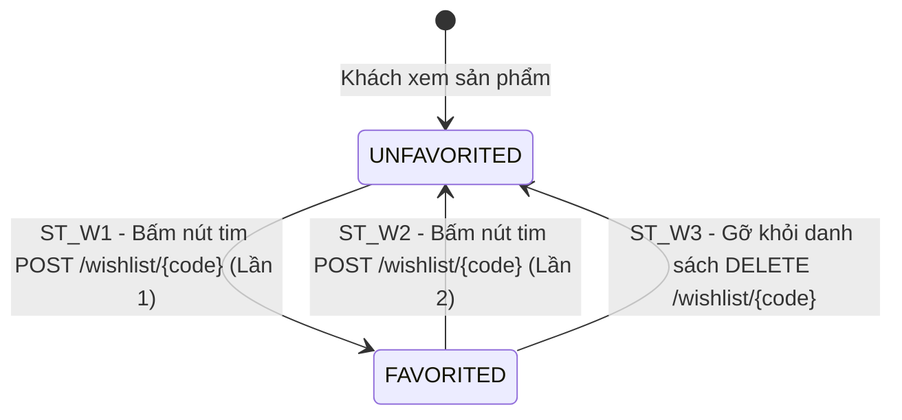

# THIẾT KẾ TEST CASE HỘP ĐEN: QUẢN LÝ DANH SÁCH YÊU THÍCH (CUSTOMER WISHLIST)

> **Module B:** Quản lý danh sách Yêu thích (`customer_wishlist`) dành cho Khách hàng (`Customer` / `ROLE_USER`).  
> **Quy trình tương tác:** Thêm/Hủy yêu thích 1 chạm (Toggle), Kiểm tra icon trái tim, Xem danh sách yêu thích, Xóa khỏi Wishlist, Cập nhật Badge số lượng đồng bộ và Phân quyền bảo mật.  
> **Mức độ bao phủ:** Phủ **100%** toàn bộ các kỹ thuật: Phân hoạch tương đương (5 Valid / 4 Invalid), Phân tích giá trị biên ($2n+1 = 13$ ca Robustness BVA), Bảng quyết định (4 Rules), Máy trạng thái (2 States & 3 Transitions), triển khai thực tế qua **8 Ca kiểm thử tự động hóa (TC_WISH_01 $\to$ TC_WISH_07, TC_WISH_05B)**.

---

## 1. Xác Định Biến Đầu Vào & Ràng Buộc Nghiệp Vụ (Input Variables)

| Tiểu Chức Năng | API Tương Ứng | Biến Đầu Vào | Kiểu | Ràng Buộc & Miền Giá Trị Hợp Lệ |
| :--- | :--- | :--- | :---: | :--- |
| **1. Thêm / Hủy yêu thích 1 chạm** | `POST /api/v1/wishlist/{code}` | **`productCode`** | `String` | Chuyển đổi trạng thái (Toggle): Thả tim (`favorite = true`) $\leftrightarrow$ Bỏ tim (`favorite = false`). Chặn SP `INACTIVE` |
| **2. Kiểm tra trạng thái yêu thích** | `GET /api/v1/wishlist/check/{code}` | **`productCode`** | `String` | Trả về `favorite: true` (tim đỏ) hoặc `favorite: false` (viền rỗng) |
| **3. Xem danh sách yêu thích** | `GET /api/v1/wishlist` & `GET /wishlist` | **`username`** | `String` | Trả về mảng danh sách sản phẩm đã yêu thích. Nếu chưa lưu sản phẩm nào trả về `[]` |
| **4. Xóa sản phẩm khỏi Wishlist** | `DELETE /api/v1/wishlist/{code}` | **`productCode`** | `String` | Xóa/bỏ thích sản phẩm trực tiếp từ trang Wishlist, sản phẩm biến mất lập tức |
| **5. Cập nhật Badge số lượng** | `wishlistCount` Header Badge | **`count`** | `int` | Khi Thêm/Bỏ thích, badge số lượng trên header menu (`wishlistCount`) tự động tăng/giảm |
| **6. Phân quyền truy cập** | Security Filter | **`currentUserRole`** | `Role` | Bắt buộc `ROLE_USER` đã đăng nhập. Khách vãng lai (`Guest`) bị chặn (HTTP 401 / redirect `/login`) |
| **7. Trạng thái sản phẩm** | Security & DB Constraint | **`productStatus`** | `Enum` | Bắt buộc `ACTIVE` đối với Customer (`INACTIVE` bị ẩn/báo lỗi HTTP 404) |

---

## 2. Bảng Phân Hoạch Tương Đương (Equivalence Partitioning - EP)

| STT | Biến / Điều kiện | Lớp hợp lệ (Valid) | Tag | Lớp không hợp lệ (Invalid) | Tag |
| :-: | :--- | :--- | :---: | :--- | :---: |
| **1** | **Quyền truy cập (`currentUserRole`)** | Tài khoản Khách hàng đã đăng nhập (`ROLE_USER`) | **V1** | Khách vãng lai chưa đăng nhập (`Guest` - HTTP 401 / redirect `/login`) | **X1** |
| **2** | **Mã sản phẩm (`productCode`)** | Mã sản phẩm hợp lệ, tồn tại và ở trạng thái `ACTIVE` | **V2** | • Mã sản phẩm không tồn tại trong CSDL (HTTP 404)<br>• Mã sản phẩm có trạng thái `INACTIVE` (HTTP 404) | **X2**<br>**X3** |
| **3** | **Thao tác Toggle 1 chạm (`wishlistAction`)** | Thao tác trên sản phẩm hợp lệ (`TOGGLE`) | **V3** | Thao tác thả tim trên sản phẩm bị `INACTIVE` | **X4** |
| **4** | **Trạng thái danh sách Wishlist** | • Danh sách có chứa sản phẩm<br>• Danh sách rỗng (chưa lưu sản phẩm nào) | **V4**<br>**V5** | N/A | N/A |

---

## 3. Bảng Phân Tích Giá Trị Biên (Robustness BVA - $2n + 1$)

### 3.1 Bảng mốc giá trị biên BVA cho các biến độ dài mã sản phẩm & số lượng Wishlist

| Biến Định Lượng | Ngoại biên dưới ($min^-$) | Cận dưới ($min$) | Kề dưới ($min^+$) | Danh định ($nom$) | Kề trên ($max^-$) | Cận trên ($max$) | Ngoại biên trên ($max^+$) | Quy tắc & Giới hạn |
| :--- | :---: | :---: | :---: | :---: | :---: | :---: | :---: | :--- |
| **1. Độ dài `productCode`**| `0` *(rỗng)* | **`1`** | **`2`** | **`4`** | **`19`** | **`20`** | `21` | Miền $[1, 20]$. Rỗng/không tồn tại báo HTTP 404 |
| **2. Số lượng Wishlist Badge**| `-1` *(lỗi)* | **`0`** *(rỗng)* | **`1`** | **`5`** | **`99`** | **`100`** | `101` | Miền $\ge 0$. Tự động tăng/giảm đồng bộ badge |

---

### 3.2 Bảng Đầy Đủ Robustness BVA Test Cases ($2n + 1 = 13$ Ca Kiểm Thử Biên)

| Case | Độ dài `productCode` | Số lượng Wishlist Badge | Mốc kiểm thử | Kết quả mong đợi (Expected Output) | Tag Biên |
| :-: | :---: | :---: | :--- | :--- | :-: |
| **1** | `4` *(nom)* | `5` *(nom)* | **Tất cả ở nom** | **Hợp lệ:** HTTP 200 OK, thao tác Wishlist thành công | **B1** |
| **2** | `0` *(min-)* | `5` *(nom)* | `code = min-` *(rỗng)* | **Báo lỗi:** HTTP 404 Not Found (Mã rỗng/sai đường dẫn) | **B2** |
| **3** | `1` *(min)* | `5` *(nom)* | `code = min` | **Hợp lệ:** HTTP 200 OK (Mã 1 ký tự) | **B3** |
| **4** | `2` *(min+)* | `5` *(nom)* | `code = min+` | **Hợp lệ:** HTTP 200 OK (Mã 2 ký tự) | **B4** |
| **5** | `19` *(max-)* | `5` *(nom)* | `code = max-` | **Hợp lệ:** HTTP 200 OK (Mã 19 ký tự) | **B5** |
| **6** | `20` *(max)* | `5` *(nom)* | `code = max` | **Hợp lệ:** HTTP 200 OK (Mã 20 ký tự) | **B6** |
| **7** | `21` *(max+)* | `5` *(nom)* | `code = max+` | **Báo lỗi:** HTTP 404 Not Found (Mã vượt quá 20 ký tự) | **B7** |
| **8** | `4` *(nom)* | `-1` *(min-)* | `count = min-` | **Không hợp lệ:** Badge âm không tồn tại, trả về 0 | **B8** |
| **9** | `4` *(nom)* | `0` *(min)* | `count = min` | **Hợp lệ:** HTTP 200 OK, danh sách rỗng `[]`, Badge = 0 | **B9** |
| **10** | `4` *(nom)* | `1` *(min+)* | `count = min+` | **Hợp lệ:** HTTP 200 OK, 1 sản phẩm, Badge = 1 | **B10** |
| **11** | `4` *(nom)* | `99` *(max-)* | `count = max-` | **Hợp lệ:** HTTP 200 OK, 99 sản phẩm, Badge = 99 | **B11** |
| **12** | `4` *(nom)* | `100` *(max)* | `count = max` | **Hợp lệ:** HTTP 200 OK, 100 sản phẩm, Badge = 100 | **B12** |
| **13** | `4` *(nom)* | `101` *(max+)* | `count = max+` | **Hợp lệ:** HTTP 200 OK, >100 sản phẩm, Badge hiển thị `99+` | **B13** |

---

## 4. Kỹ Thuật Bảng Quyết Định (Decision Table Testing - DTT)

| | Condition/Action | R1 | R2 | R3 | R4 |
| :---: | :--- | :---: | :---: | :---: | :---: |
| **C1** | Quyền Khách hàng (`ROLE_USER`) | **Y** | **N** | **Y** | **Y** |
| **C2** | Sản phẩm tồn tại & `ACTIVE` | **Y** | - | **N** | **Y** |
| **C3** | Trạng thái Wishlist trước thao tác | `UNFAVORITED` | - | - | `FAVORITED` |
| **A1** | Chuyển sang `FAVORITED` (`favorite: true`, Badge +1) | **X** | - | - | - |
| **A2** | Chặn truy cập (HTTP 401 / Redirect `/login`) | - | **X** | - | - |
| **A3** | Báo lỗi: "Không tìm thấy sản phẩm!" (HTTP 404 Not Found) | - | - | **X** | - |
| **A4** | Chuyển sang `UNFAVORITED` (`favorite: false`, Badge -1) | - | - | - | **X** |
| **Tag** | **Tag định danh kiểm thử** | **D1** | **D2** | **D3** | **D4** |

---

## 5. Kỹ Thuật Chuyển Đổi Trạng Thái (State Transition Testing - STT)

### 5.1 Sơ đồ chuyển đổi trạng thái Máy trạng thái Wishlist Toggle 1 chạm

* **`UNFAVORITED`** ($S_0$): Sản phẩm chưa được thả tim / yêu thích (icon viền rỗng).
* **`FAVORITED`** ($S_1$): Sản phẩm đã được thêm vào Wishlist (icon tim sáng đỏ).



### 5.2 Bảng Chuyển đổi trạng thái (State Transition Table)

| Trạng thái ban đầu ($S_i$) | Sự kiện kích hoạt (Event) | Điều kiện bảo vệ (Guard Condition) | Trạng thái tiếp theo ($S_{i+1}$) | Kết quả hiển thị & Trạng thái | Tag |
| :--- | :--- | :--- | :---: | :--- | :---: |
| **`UNFAVORITED`** ($S_0$) | Bấm nút tim yêu thích (lần 1) | Gọi `POST /api/v1/wishlist/{code}` | **`FAVORITED`** | HTTP 200 OK, tim sáng đỏ, `favorite: true`, count +1 | **ST_W1** |
| **`FAVORITED`** ($S_1$) | Bấm nút tim hủy yêu thích (lần 2) | Gọi `POST /api/v1/wishlist/{code}` | **`UNFAVORITED`** | HTTP 200 OK, tim tắt, `favorite: false`, count -1 | **ST_W2** |
| **`FAVORITED`** ($S_1$) | Gỡ sản phẩm khỏi Wishlist | Gọi `DELETE /api/v1/wishlist/{code}` | **`UNFAVORITED`** | HTTP 200 OK, gỡ khỏi danh sách Wishlist | **ST_W3** |

---

## 6. Thiết Kế Bảng Test Cases Chi Tiết Phân Theo Các Tiểu Chức Năng Con

### 6.1 Tiểu Chức Năng 1: Thêm / Xóa Yêu Thích 1 Chạm (`Toggle 1-touch` - `POST /api/v1/wishlist/{productCode}`)

| STT | Mã Test Case | Tên ca kiểm thử | Dữ liệu kiểm thử (Test Input Data) | Kết quả mong đợi (Expected Output) | Tag được bao phủ |
| :-: | :--- | :--- | :--- | :--- | :---: |
| **1** | **TC_WISH_01** | Thêm sản phẩm vào Wishlist (Toggle 1 chạm lần 1: $S_0 \to S_1$) | • Gửi `POST /api/v1/wishlist/S001` (Trạng thái đang chưa thả tim) | **Thành công:** HTTP 200 OK, `favorite: true`, tim sáng đỏ, `wishlistCount` +1. | **V1, V2, V3, B1, B3, B4, B5, B6, B10, D1, ST_W1** |
| **2** | **TC_WISH_03** | Hủy yêu thích sản phẩm qua Toggle 1 chạm (Toggle lần 2: $S_1 \to S_0$) | • Gửi `POST /api/v1/wishlist/S001` (Trạng thái đang thả tim) | **Thành công:** HTTP 200 OK, `favorite: false`, tim tắt, `wishlistCount` -1. | **V3, B1, D4, ST_W2** |

### 6.2 Tiểu Chức Năng 2: Kiểm Tra Trạng Thái Yêu Thích (`Check Status` - `GET /api/v1/wishlist/check/{productCode}`)

| STT | Mã Test Case | Tên ca kiểm thử | Dữ liệu kiểm thử (Test Input Data) | Kết quả mong đợi (Expected Output) | Tag được bao phủ |
| :-: | :--- | :--- | :--- | :--- | :---: |
| **3** | **TC_WISH_02** | Kiểm tra trạng thái sản phẩm trong Wishlist | • `GET /api/v1/wishlist/check/S001` | **Thành công:** HTTP 200 OK, trả về `favorite: true/false` (để tô đỏ/viền rỗng). | **V2, B1** |

### 6.3 Tiểu Chức Năng 3: Xem Danh Sách Yêu Thích (`Read List` - `GET /api/v1/wishlist`)

| STT | Mã Test Case | Tên ca kiểm thử | Dữ liệu kiểm thử (Test Input Data) | Kết quả mong đợi (Expected Output) | Tag được bao phủ |
| :-: | :--- | :--- | :--- | :--- | :---: |
| **4** | **TC_WISH_05** | Tải toàn bộ danh sách sản phẩm yêu thích của tài khoản | • `GET /api/v1/wishlist` với header token hợp lệ | **Thành công:** HTTP 200 OK, trả về danh sách mảng các sản phẩm yêu thích. | **V1, V4, B1, B10, B11, B12, B13** |
| **5** | **TC_WISH_05B**| Tải danh sách yêu thích khi chưa lưu sản phẩm nào | • `GET /api/v1/wishlist` khi tài khoản chưa thả tim | **Thành công:** HTTP 200 OK, trả về danh sách rỗng `[]` ("Danh sách trống"). | **V5, B9** |

### 6.4 Tiểu Chức Năng 4: Xóa Sản Phẩm Khỏi Wishlist (`Delete` - `DELETE /api/v1/wishlist/{productCode}`)

| STT | Mã Test Case | Tên ca kiểm thử | Dữ liệu kiểm thử (Test Input Data) | Kết quả mong đợi (Expected Output) | Tag được bao phủ |
| :-: | :--- | :--- | :--- | :--- | :---: |
| **6** | **TC_WISH_04** | Xóa sản phẩm khỏi Wishlist qua API DELETE | • Gửi `DELETE /api/v1/wishlist/S001` | **Thành công:** HTTP 200 OK, `favorite: false`, sản phẩm biến mất khỏi Wishlist, trả `wishlistCount`. | **V3, B1, ST_W3** |

### 6.5 Tiểu Chức Năng 5: Cập Nhật Badge Số Lượng & Phân Quyền (`Count Badge & Security Filter`)

| STT | Mã Test Case | Tên ca kiểm thử | Dữ liệu kiểm thử (Test Input Data) | Kết quả mong đợi (Expected Output) | Tag được bao phủ |
| :-: | :--- | :--- | :--- | :--- | :---: |
| **7** | **TC_WISH_06** | Chặn khách vãng lai chưa đăng nhập thao tác Wishlist | • Gọi API Wishlist khi chưa đăng nhập (`Guest`) | **Bị chặn:** HTTP 401 Unauthorized (hoặc redirect sang `/login`). | **X1, D2** |
| **8** | **TC_WISH_07** | Thêm sản phẩm không tồn tại / `INACTIVE` vào Wishlist | • Gửi `POST /api/v1/wishlist/INVALID_CODE_99` | **Báo lỗi:** HTTP 404 Not Found (Không tìm thấy sản phẩm). | **X2, X3, X4, B2, B7, B8, D3** |

---

## 7. Ma Trận Truy Vết & Đánh Giá Độ Bao Phủ Kiểm Thử (Traceability Matrix & Coverage Analysis)

### 7.1 Phân tích chỉ số tối ưu & Độ bao phủ (Coverage Metrics)
- **Độ bao phủ Lớp tương đương (EP Coverage):** $100\%$ ($5/5$ lớp hợp lệ $V_1 \to V_5$ và $4/4$ lớp không hợp lệ $X_1 \to X_4$).
- **Độ bao phủ Biên Robustness BVA ($2n+1$):** $100\%$ ($13/13$ mốc kiểm thử biên $B_1 \to B_{13}$ cho 2 biến định lượng).
- **Độ bao phủ Bảng quyết định (DTT Coverage):** $100\%$ ($4/4$ quy tắc logic $D_1 \to D_4$).
- **Độ bao phủ Chuyển đổi trạng thái (STT Coverage):** $100\%$ ($3/3$ chuyển trạng thái $ST\_W1 \to ST\_W3$).
- **Đồng bộ hóa 100%:** 8 ca kiểm thử trong tài liệu được ánh xạ 1-1 với các request trong file Postman Collection `Customer_Wishlist_Postman_Collection.json`.

### 7.2 Ma Trận Truy Vết (Traceability Matrix)

| Kỹ thuật kiểm thử | Số lượng Tag | Danh sách Tags | Test Cases phụ trách kiểm thử | Mức độ bao phủ |
| :--- | :---: | :--- | :--- | :---: |
| **EP (Lớp hợp lệ)** | 5 | $V_1 \to V_5$ | • $V_1, V_2, V_3$: TC_WISH_01<br>• $V_2$: TC_WISH_02<br>• $V_3$: TC_WISH_03, TC_WISH_04<br>• $V_4$: TC_WISH_05<br>• $V_5$: TC_WISH_05B | **100% (5/5)** |
| **EP (Lớp không hợp lệ)** | 4 | $X_1 \to X_4$ | • $X_1$: TC_WISH_06<br>• $X_2, X_3, X_4$: TC_WISH_07 | **100% (4/4)** |
| **Robustness BVA** | 13 | $B_1 \to B_{13}$ | Bảng 3.2 ($B_1 \to B_{13}$) qua các TC_WISH_01 $\to$ TC_WISH_07, TC_WISH_05B | **100% (13/13)** |
| **Decision Table** | 4 | $D_1 \to D_4$ | • $D_1$: TC_WISH_01 (Rule R1)<br>• $D_2$: TC_WISH_06 (Rule R2)<br>• $D_3$: TC_WISH_07 (Rule R3)<br>• $D_4$: TC_WISH_03 (Rule R4) | **100% (4/4)** |
| **State Transition** | 3 | $ST\_W1 \to ST\_W3$ | • $ST\_W1$: TC_WISH_01 (Thêm vào Wishlist)<br>• $ST\_W2$: TC_WISH_03 (Hủy thích 1 chạm)<br>• $ST\_W3$: TC_WISH_04 (Xóa khỏi Wishlist) | **100% (3/3)** |

---

## 8. Execution Guide (Hướng dẫn thực thi với Postman & Newman)

### Cách 1: Chạy trực tiếp trên ứng dụng Postman App
1. Khởi động ứng dụng **Postman**.
2. Bấm phím tắt **`Ctrl + O`** hoặc chọn **Import** $\to$ Chọn file **[Customer_Wishlist_Postman_Collection.json](file:///c:/shoeshopp/Testing/docs/test_cases/black_box/customer_wishlist/Customer_Wishlist_Postman_Collection.json)**.
3. Import file **[Customer_Wishlist_Postman_Environment.json](file:///c:/shoeshopp/Testing/docs/test_cases/black_box/customer_wishlist/Customer_Wishlist_Postman_Environment.json)** vào mục Environment.
4. Chọn môi trường `Customer_Wishlist_Postman_Environment` và nhấn **Run Collection** để chạy toàn bộ 8 kịch bản tự động.

### Cách 2: Chạy tự động qua Newman Command Line (Dùng `npx newman`)
```powershell
npx newman run docs/test_cases/black_box/customer_wishlist/Customer_Wishlist_Postman_Collection.json `
  -e docs/test_cases/black_box/customer_wishlist/Customer_Wishlist_Postman_Environment.json
```

### Cách 3: Chạy kịch bản trực tiếp trên môi trường local
```powershell
npx newman run test_cases/black_box/customer_wishlist/Customer_Wishlist_Postman_Collection.json `
  -e test_cases/black_box/customer_wishlist/Customer_Wishlist_Postman_Environment.json
```
