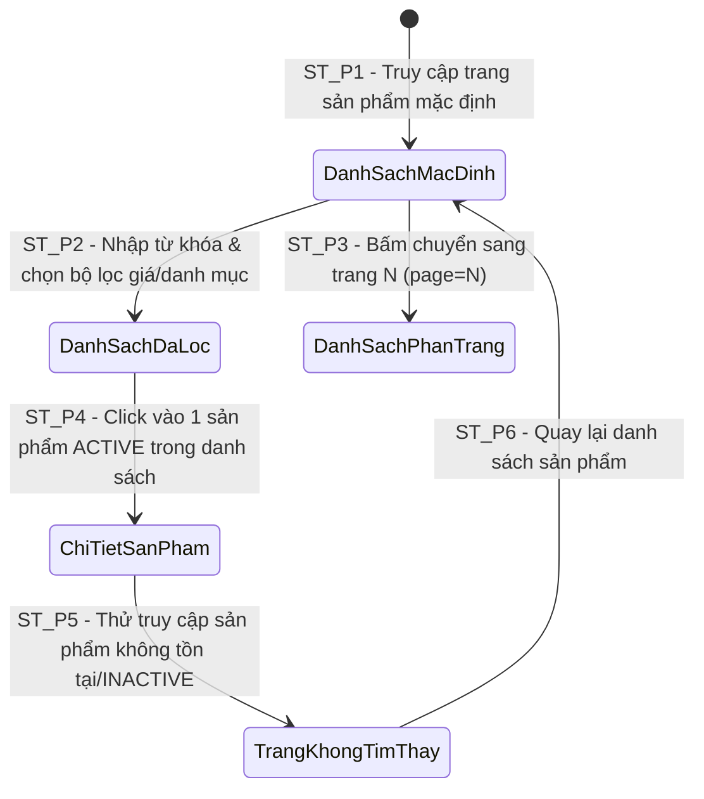

# THIẾT KẾ TEST CASE HỘP ĐEN: TRA CỨU, BỘ LỌC & PHÂN TRANG SẢN PHẨM (PRODUCT SEARCH & PAGINATION)

> **Chức năng:** Tìm kiếm từ khóa, Lọc theo danh mục/thương hiệu/khoảng giá, Phân trang, Sắp xếp và Xem thông tin chi tiết Sản phẩm dành cho Khách hàng (`Customer` / `Guest`).

---

## 1. Xác Định Biến Đầu Vào & Ràng Buộc Nghiệp Vụ (Input Variables)

| Tên Biến | Ý Nghĩa | Kiểu | Ràng Buộc & Miền Giá Trị Hợp Lệ |
| :--- | :--- | :---: | :--- |
| **`name`** | Từ khóa tìm kiếm | `String` | Độ dài $[0, 100]$, không phân biệt hoa/thường, tự động loại bỏ khoảng trắng dư |
| **`category`** | Danh mục sản phẩm | `String` | Tên/Mã danh mục có trong CSDL (VD: `"Sneaker"`, `"Running"`, `null` = tất cả) |
| **`brand`** | Thương hiệu | `String` | Tên/Mã thương hiệu có trong CSDL (VD: `"Nike"`, `"Adidas"`, `null` = tất cả) |
| **`minPrice`** | Giá tối thiểu | `double` | $\ge 0$ K VNĐ (mặc định: `0` K VNĐ) |
| **`maxPrice`** | Giá tối đa | `double` | $\ge minPrice$ K VNĐ hoặc `null` (không giới hạn giá trần) |
| **`page`** | Trang hiện tại | `int` | Số nguyên $\ge 1$ (mặc định: `1`) |
| **`size`** | Số sản phẩm / trang | `int` | Số nguyên trong $[1, 50]$ (mặc định: `12`) |
| **`sort`** | Tiêu chí sắp xếp | `Enum` | `"priceAsc"`, `"priceDesc"`, `"newest"`, `"popular"`. Mặc định: `"newest"` |
| **`productId`** / **`code`** | Mã chi tiết sản phẩm | `String` | Mã sản phẩm hợp lệ $[1, 20]$ ký tự (VD: `"S001"`, `"S002"`) |
| **`productStatus`** | Trạng thái hiển thị | `Enum` | Bắt buộc `ACTIVE` đối với Customer (`INACTIVE` bị ẩn/trả về 404) |

---

## 2. Bảng Phân Hoạch Tương Đương (Equivalence Partitioning - EP)

| STT | Biến / Điều kiện | Lớp hợp lệ (Valid) | Tag | Lớp không hợp lệ (Invalid) | Tag |
| :-: | :--- | :--- | :---: | :--- | :---: |
| **1** | **Quyền truy cập (`currentUserRole`)** | • Khách vãng lai (`Guest`)<br>• Tài khoản Khách hàng (`Customer`) | **V1** | Token bị hư hỏng, giả mạo hoặc hết hạn | **X1** |
| **2** | **Từ khóa tìm kiếm (`name`)** | • Chuỗi ký tự hợp lệ có tồn tại sản phẩm $[1, 100]$<br>• Để trống (`null` hoặc `""`) -> lấy toàn bộ danh sách | **V2**<br>**V3** | • Từ khóa không tồn tại trong CSDL<br>• Chuỗi vượt 100 ký tự ($L > 100$)<br>• Chuỗi chứa SQL Injection / XSS scripts | **X2**<br>**X3**<br>**X4** |
| **3** | **Danh mục sản phẩm (`category`)** | • Mã/Tên danh mục có trong hệ thống<br>• Giá trị `null` hoặc rỗng (xem tất cả danh mục) | **V4**<br>**V5** | Danh mục không tồn tại trong CSDL | **X5** |
| **4** | **Thương hiệu (`brand`)** | • Mã/Tên thương hiệu có trong hệ thống<br>• Giá trị `null` hoặc rỗng (xem tất cả thương hiệu) | **V6**<br>**V7** | Thương hiệu không tồn tại trong CSDL | **X6** |
| **5** | **Giá tối thiểu (`minPrice`)** | • Số thực $\ge 0$ K VNĐ<br>• Giá trị `null` (mặc định bằng 0) | **V8**<br>**V9** | • Giá trị âm ($< 0$ K VNĐ)<br>• Ký tự phi số | **X7**<br>**X8** |
| **6** | **Giá tối đa (`maxPrice`)** | • Số thực $\ge minPrice$ K VNĐ<br>• Giá trị `null` (không giới hạn trần) | **V10**<br>**V11** | • Giá trị nhỏ hơn `minPrice` ($maxPrice < minPrice$)<br>• Giá trị âm ($< 0$ K VNĐ)<br>• Ký tự phi số | **X9**<br>**X10**<br>**X11** |
| **7** | **Số trang (`page`)** | Số nguyên dương $\ge 1$ | **V12** | • Số nguyên $\le 0$ (âm hoặc 0)<br>• Vượt quá tổng số trang ($page > totalPages$)<br>• Số thập phân hoặc phi số | **X12**<br>**X13**<br>**X14** |
| **8** | **Kích thước trang (`size`)** | Số nguyên trong đoạn $[1, 50]$ | **V13** | • Số nguyên $\le 0$<br>• Vượt giới hạn hệ thống ($> 50$)<br>• Số thập phân hoặc phi số | **X15**<br>**X16**<br>**X17** |
| **9** | **Tiêu chí sắp xếp (`sort`)** | Chuỗi thuộc Enum hợp lệ (`"priceAsc"`, `"priceDesc"`, `"newest"`, `"popular"`) | **V14** | Giá trị sai Enum chuẩn (`"random"`, `"discount"`, phi ký tự) | **X18** |
| **10** | **Mã chi tiết sản phẩm (`code`)** | Mã sản phẩm hợp lệ, tồn tại và có trạng thái `ACTIVE` trong CSDL | **V15** | • Mã không tồn tại trong CSDL<br>• Mã sản phẩm có trạng thái `INACTIVE`<br>• Mã rỗng hoặc sai định dạng | **X19**<br>**X20**<br>**X21** |

---

## 3. Bảng Phân Tích Giá Trị Biên (Robustness BVA - $6n + 1$)

### 3.1 Bảng 7 mốc giá trị biên Robustness BVA cho 6 biến định lượng

*(Ghi chú bộ giá trị danh định chuẩn: `name` $nom = 10\text{ ký tự}$ (`"Nike Air"`), `minPrice` $nom = 100\text{ K ₫}$, `maxPrice` $nom = 500\text{ K ₫}$, `page` $nom = 5$, `size` $nom = 12\text{ sản phẩm}$, `code` $nom = 4\text{ ký tự}$ (`"S001"`)).*

| Biến Định Lượng | Ngoại biên dưới ($min^-$) | Cận dưới ($min$) | Kề dưới ($min^+$) | Danh định ($nom$) | Kề trên ($max^-$) | Cận trên ($max$) | Ngoại biên trên ($max^+$) | Quy tắc & Giới hạn |
| :--- | :---: | :---: | :---: | :---: | :---: | :---: | :---: | :--- |
| **1. Độ dài `name`** | `-1` *(hoặc nhiễu)* | **`0`** *(rỗng)* | **`1`** | **`10`** | **`99`** | **`100`** | `101` | Miền $[0, 100]$. $> 100$ báo lỗi hoặc cắt chuỗi |
| **2. `minPrice`** (K ₫) | `-1` *(âm)* | **`0`** | **`1`** | **`100`** | **`49.999`** | **`50.000`** | `50.001` | Miền $\ge 0$. Âm báo lỗi HTTP 400 |
| **3. `maxPrice`** (K ₫)| `minPrice - 1` | **`minPrice`** | **`minPrice + 1`** | **`500`** | **`99.999`** | **`100.000`** | `100.001` | Miền $\ge minPrice$. Âm hoặc $< minPrice$ báo lỗi |
| **4. `page`** (Số trang) | `0` *(âm/bằng 0)* | **`1`** | **`2`** | **`5`** | **`999`** | **`1.000`** | `1.001` *(hoặc cực đại)* | Miền $\ge 1$. $\le 0$ tự reset về 1; vượt trang trả `[]` |
| **5. `size`** (SP/trang) | `0` *(âm/bằng 0)* | **`1`** | **`2`** | **`12`** | **`49`** | **`50`** | `51` *(hoặc extreme)* | Miền $[1, 50]$. $\le 0$ về 12; $> 50$ ép về 50 an toàn |
| **6. Độ dài mã `code`**| `0` *(rỗng)* | **`1`** | **`2`** | **`4`** | **`19`** | **`20`** | `21` | Miền $[1, 20]$. Rỗng/không tồn tại trả HTTP 404 |

---

### 3.2 Bảng Đầy Đủ Robustness BVA Test Cases ($6n + 1 = 37$ Ca Kiểm Thử)

| Case | Tìm kiếm (`name`) | Giá tối thiểu (`minPrice`) | Giá tối đa (`maxPrice`) | Số trang (`page`) | Kích thước (`size`) | Mã chi tiết (`code`) | Mốc kiểm thử | Kết quả mong đợi (Expected Output) | Tag Biên |
| :-: | :--- | :---: | :---: | :---: | :---: | :---: | :---: | :--- | :-: |
| **1** | `"Nike Air"` *(nom)* | `100` *(nom)* | `500` *(nom)* | `5` *(nom)* | `12` *(nom)* | `"S001"` *(nom)* | **Tất cả ở nom** | **Hợp lệ:** HTTP 200 OK, trả danh sách kết quả | **B1** |
| **2** | `""` *(min-)* | `100` | `500` | `5` | `12` | `"S001"` | `name = min-` | **Hợp lệ:** HTTP 200 OK (Xem tất cả sản phẩm) | **B2** |
| **3** | `"N"` *(min)* | `100` | `500` | `5` | `12` | `"S001"` | `name = min` | **Hợp lệ:** HTTP 200 OK (Tìm từ khóa 1 ký tự) | **B3** |
| **4** | `"Ni"` *(min+)* | `100` | `500` | `5` | `12` | `"S001"` | `name = min+` | **Hợp lệ:** HTTP 200 OK (Tìm từ khóa 2 ký tự) | **B4** |
| **5** | `[Chuỗi đúng 99 ký tự]` *(max-)* | `100` | `500` | `5` | `12` | `"S001"` | `name = max-` | **Hợp lệ:** HTTP 200 OK (Từ khóa 99 ký tự) | **B5** |
| **6** | `[Chuỗi đúng 100 ký tự]` *(max)* | `100` | `500` | `5` | `12` | `"S001"` | `name = max` | **Hợp lệ:** HTTP 200 OK (Từ khóa 100 ký tự) | **B6** |
| **7** | `[Chuỗi dài 101 ký tự]` *(max+)* | `100` | `500` | `5` | `12` | `"S001"` | `name = max+` | **Báo lỗi/Cắt:** HTTP 400 hoặc tự cắt về 100 ký tự | **B7** |
| **8** | `"Nike Air"` | `-1` *(min-)* | `500` | `5` | `12` | `"S001"` | `minPrice = min-` | **Báo lỗi:** HTTP 400 (minPrice không được âm) | **B8** |
| **9** | `"Nike Air"` | `0` *(min)* | `500` | `5` | `12` | `"S001"` | `minPrice = min` | **Hợp lệ:** HTTP 200 OK (minPrice từ 0 K ₫) | **B9** |
| **10** | `"Nike Air"` | `1` *(min+)* | `500` | `5` | `12` | `"S001"` | `minPrice = min+` | **Hợp lệ:** HTTP 200 OK (minPrice từ 1 K ₫) | **B10**|
| **11** | `"Nike Air"` | `49999` *(max-)* | `50000` | `5` | `12` | `"S001"` | `minPrice = max-` | **Hợp lệ:** HTTP 200 OK (minPrice 49.999 K ₫) | **B11**|
| **12** | `"Nike Air"` | `50000` *(max)* | `50000` | `5` | `12` | `"S001"` | `minPrice = max` | **Hợp lệ:** HTTP 200 OK (minPrice 50.000 K ₫) | **B12**|
| **13** | `"Nike Air"` | `50001` *(max+)* | `50000` | `5` | `12` | `"S001"` | `minPrice = max+` | **Báo lỗi:** HTTP 400 (minPrice > maxPrice) | **B13**|
| **14** | `"Nike Air"` | `100` | `99` *(min-)* | `5` | `12` | `"S001"` | `maxPrice = min-` | **Báo lỗi:** HTTP 400 (maxPrice < minPrice) | **B14**|
| **15** | `"Nike Air"` | `100` | `100` *(min)* | `5` | `12` | `"S001"` | `maxPrice = min` | **Hợp lệ:** HTTP 200 OK (Giá khớp đúng 100 K ₫) | **B15**|
| **16** | `"Nike Air"` | `100` | `101` *(min+)* | `5` | `12` | `"S001"` | `maxPrice = min+` | **Hợp lệ:** HTTP 200 OK (maxPrice 101 K ₫) | **B16**|
| **17** | `"Nike Air"` | `100` | `99999` *(max-)* | `5` | `12` | `"S001"` | `maxPrice = max-` | **Hợp lệ:** HTTP 200 OK (maxPrice 99.999 K ₫) | **B17**|
| **18** | `"Nike Air"` | `100` | `100000` *(max)* | `5` | `12` | `"S001"` | `maxPrice = max` | **Hợp lệ:** HTTP 200 OK (maxPrice 100.000 K ₫) | **B18**|
| **19** | `"Nike Air"` | `100` | `100001` *(max+)* | `5` | `12` | `"S001"` | `maxPrice = max+` | **Kiểm soát:** HTTP 200/400 (Ngưỡng giá cực đại) | **B19**|
| **20** | `"Nike Air"` | `100` | `500` | `0` *(min-)* | `12` | `"S001"` | `page = min-` | **Tự ép:** HTTP 200 OK (Chuẩn hóa về page = 1) | **B20**|
| **21** | `"Nike Air"` | `100` | `500` | `1` *(min)* | `12` | `"S001"` | `page = min` | **Hợp lệ:** HTTP 200 OK (Hiển thị Trang 1) | **B21**|
| **22** | `"Nike Air"` | `100` | `500` | `2` *(min+)* | `12` | `"S001"` | `page = min+` | **Hợp lệ:** HTTP 200 OK (Hiển thị Trang 2) | **B22**|
| **23** | `"Nike Air"` | `100` | `500` | `999` *(max-)* | `12` | `"S001"` | `page = max-` | **Hợp lệ:** HTTP 200 OK (Hiển thị Trang 999) | **B23**|
| **24** | `"Nike Air"` | `100` | `500` | `1000` *(max)* | `12` | `"S001"` | `page = max` | **Hợp lệ:** HTTP 200 OK (Hiển thị Trang 1000) | **B24**|
| **25** | `"Nike Air"` | `100` | `500` | `999999` *(max+)* | `12` | `"S001"` | `page = max+` | **Hợp lệ:** HTTP 200 OK (Trả về list rỗng []) | **B25**|
| **26** | `"Nike Air"` | `100` | `500` | `5` | `0` *(min-)* | `"S001"` | `size = min-` | **Tự ép:** HTTP 200 OK (Chuẩn hóa về size = 12) | **B26**|
| **27** | `"Nike Air"` | `100` | `500` | `5` | `1` *(min)* | `"S001"` | `size = min` | **Hợp lệ:** HTTP 200 OK (1 sản phẩm/trang) | **B27**|
| **28** | `"Nike Air"` | `100` | `500` | `5` | `2` *(min+)* | `"S001"` | `size = min+` | **Hợp lệ:** HTTP 200 OK (2 sản phẩm/trang) | **B28**|
| **29** | `"Nike Air"` | `100` | `500` | `5` | `49` *(max-)* | `"S001"` | `size = max-` | **Hợp lệ:** HTTP 200 OK (49 sản phẩm/trang) | **B29**|
| **30** | `"Nike Air"` | `100` | `500` | `5` | `50` *(max)* | `"S001"` | `size = max` | **Hợp lệ:** HTTP 200 OK (50 sản phẩm/trang) | **B30**|
| **31** | `"Nike Air"` | `100` | `500` | `5` | `999999` *(max+)* | `"S001"` | `size = max+` | **Giới hạn:** HTTP 200 OK (Tự ép size max = 50) | **B31**|
| **32** | `"Nike Air"` | `100` | `500` | `5` | `12` | `""` *(min-)* | `code = min-` | **Báo lỗi:** HTTP 404 (Mã không được để trống) | **B32**|
| **33** | `"Nike Air"` | `100` | `500` | `5` | `12` | `"S"` *(min)* | `code = min` | **Hợp lệ:** HTTP 200 OK / 404 (Mã 1 ký tự) | **B33**|
| **34** | `"Nike Air"` | `100` | `500` | `5` | `12` | `"S1"` *(min+)* | `code = min+` | **Hợp lệ:** HTTP 200 OK / 404 (Mã 2 ký tự) | **B34**|
| **35** | `"Nike Air"` | `100` | `500` | `5` | `12` | `[Mã 19 ký tự]` *(max-)* | `code = max-` | **Hợp lệ:** HTTP 200 OK / 404 (Mã 19 ký tự) | **B35**|
| **36** | `"Nike Air"` | `100` | `500` | `5` | `12` | `[Mã 20 ký tự]` *(max)* | `code = max` | **Hợp lệ:** HTTP 200 OK / 404 (Mã 20 ký tự) | **B36**|
| **37** | `"Nike Air"` | `100` | `500` | `5` | `12` | `[Mã 21 ký tự]` *(max+)* | `code = max+` | **Báo lỗi:** HTTP 404 (Mã vượt quá 20 ký tự) | **B37**|

---

## 4. Kỹ Thuật Bảng Quyết Định (Decision Table Testing - DTT)

### 4.1 Bối cảnh & Điều kiện logic
Quá trình xử lý truy vấn tìm kiếm, lọc và xem chi tiết sản phẩm tại `GET /api/v1/products` được chi phối bởi 5 điều kiện nghiệp vụ ($C_1 \to C_5$) và 6 hành động kết quả tương ứng ($A_1 \to A_6$):

* **C1 — Quyền tài khoản / Token:** Người gửi request có quyền truy cập hợp lệ (Guest / Customer)?
* **C2 — Mã sản phẩm tồn tại & ACTIVE:** Đối với API chi tiết (`/products/{code}`), mã có tồn tại và ở trạng thái `ACTIVE`?
* **C3 — Khoảng giá hợp lệ:** Mức giá tối thiểu và tối đa tuân thủ `minPrice >= 0` và `minPrice <= maxPrice`?
* **C4 — Trang `page` hợp lệ:** Số trang hợp lệ ($\ge 1$)?
* **C5 — Kích thước `size` hợp lệ:** Kích thước trang hợp lệ trong khoảng $[1, 50]$?

### 4.2 Bảng Quyết Định Chuẩn (Decision Table: 6 Rules - Định dạng Y/N và X/-)

| | Condition/Action | R1 | R2 | R3 | R4 | R5 | R6 |
| :---: | :--- | :---: | :---: | :---: | :---: | :---: | :---: |
| **C1** | Quyền truy cập hợp lệ (Guest/Customer) | **Y** | **N** | **Y** | **Y** | **Y** | **Y** |
| **C2** | Mã sản phẩm tồn tại & `ACTIVE` | **Y** | - | **N** | **Y** | **Y** | **Y** |
| **C3** | Khoảng giá hợp lệ (`min <= max` & `min >= 0`) | **Y** | - | - | **N** | **Y** | **Y** |
| **C4** | Số trang `page` hợp lệ ($\ge 1$) | **Y** | - | - | - | **N** | **Y** |
| **C5** | Kích thước `size` hợp lệ ($1 \le size \le 50$) | **Y** | - | - | - | - | **N** |
| **A1** | Trả danh sách / chi tiết sản phẩm (HTTP 200 OK) | **X** | - | - | - | - | - |
| **A2** | Chặn truy cập / Token lỗi (HTTP 401/403) | - | **X** | - | - | - | - |
| **A3** | Báo lỗi: "Không tìm thấy sản phẩm!" (HTTP 404) | - | - | **X** | - | - | - |
| **A4** | Báo lỗi: Khoảng giá không hợp lệ (HTTP 400) | - | - | - | **X** | - | - |
| **A5** | Tự điều chỉnh `page = 1` & trả kết quả HTTP 200 | - | - | - | - | **X** | - |
| **A6** | Tự giới hạn `size = 50` & trả kết quả HTTP 200 | - | - | - | - | - | **X** |
| **Tag** | **Tag định danh kiểm thử** | **D1** | **D2** | **D3** | **D4** | **D5** | **D6** |

---

## 5. Kỹ Thuật Chuyển Đổi Trạng Thái (State Transition Testing - STT)

### 5.1 Sơ đồ chuyển đổi trạng thái hiển thị danh sách & chi tiết Sản phẩm

Thực thể Trang danh sách & Chi tiết sản phẩm trên giao diện Khách hàng có **4 trạng thái chính**:
* **`DanhSachMacDinh`**: Trang 1 danh sách tất cả sản phẩm mới nhất.
* **`DanhSachDaLoc`**: Danh sách sản phẩm sau khi áp dụng bộ lọc từ khóa/giá/thương hiệu.
* **`DanhSachPhanTrang`**: Danh sách sản phẩm đang ở trang $N$.
* **`ChiTietSanPham`**: Trang xem thông tin chi tiết của 1 sản phẩm `ACTIVE`.
* **`TrangKhongTimThay`**: Màn hình lỗi 404 khi truy cập sản phẩm không tồn tại hoặc bị `INACTIVE`.



### 5.2 Bảng Chuyển đổi trạng thái (State Transition Table)

| Trạng thái ban đầu ($S_i$) | Sự kiện kích hoạt (Event) | Điều kiện bảo vệ (Guard Condition) | Trạng thái tiếp theo ($S_{i+1}$) | Kết quả hiển thị & Trạng thái | Tag |
| :--- | :--- | :--- | :---: | :--- | :---: |
| **None** (Chưa vào) | Khách mở màn hình sản phẩm | Trục API `GET /api/v1/products` | **`DanhSachMacDinh`** | HTTP 200 OK, hiển thị 12 sản phẩm trang 1 | **ST_P1** |
| **`DanhSachMacDinh`** | Bấm *"Áp dụng bộ lọc"* | Nhập `name`, `minPrice`, `brand` | **`DanhSachDaLoc`** | HTTP 200 OK, hiển thị kết quả khớp bộ lọc | **ST_P2** |
| **`DanhSachMacDinh`** | Bấm chuyển trang | Bấm chọn `page = 2` | **`DanhSachPhanTrang`** | HTTP 200 OK, tải danh sách sản phẩm trang 2 | **ST_P3** |
| **`DanhSachDaLoc`** | Bấm chọn xem 1 sản phẩm | Sản phẩm có trạng thái `ACTIVE` | **`ChiTietSanPham`** | HTTP 200 OK, hiển thị thông tin `ProductInfo` | **ST_P4** |
| **`ChiTietSanPham`** | Nhập URL xem SP lỗi | Mã không tồn tại hoặc `INACTIVE` | **`TrangKhongTimThay`** | HTTP 404 Not Found (Không tìm thấy SP) | **ST_P5** |
| **`TrangKhongTimThay`** | Bấm nút *"Quay lại"* | Quay về trang chủ / sản phẩm | **`DanhSachMacDinh`** | HTTP 200 OK, tải lại danh sách mặc định | **ST_P6** |

---

## 6. Thiết Kế Bảng Test Cases Chi Tiết Triển Khai (Tối Ưu & Đầy Đủ Bao Phủ)

| STT | Mã Test Case | Tên ca kiểm thử | Dữ liệu kiểm thử (Test Input Data) | Kết quả mong đợi (Expected Output) | Tag được bao phủ |
| :-: | :--- | :--- | :--- | :--- | :---: |
| **1** | **TC_AUTH_01** | Chặn request với Token bị hư hỏng / hết hạn khi gọi API sản phẩm | • Header `Authorization`: `Bearer INVALID_TOKEN_XYZ` | **Bị chặn:** HTTP 401 Unauthorized / 403 Forbidden. | **X1, D2** |
| **2** | **TC_SRCH_01** | Tìm kiếm sản phẩm với từ khóa hợp lệ | • `name`: `"Nike"`<br>• `page`: `1` | **Thành công:** HTTP 200 OK, trả về danh sách sản phẩm tên khớp `"Nike"`. | **V1, V2, B1, B4, D1, ST_P1** |
| **3** | **TC_SRCH_02** | Tìm kiếm với từ khóa không tồn tại trong CSDL | • `name`: `"XYZ_NOT_EXIST_123"` | **Thành công:** HTTP 200 OK, `totalRecords = 0`, `list = []`. | **X2** |
| **4** | **TC_SRCH_03** | Tìm kiếm với chuỗi SQL Injection | • `name`: `"%25%27OR%271%3D1"` | **An toàn:** HTTP 200 OK, xử lý an toàn qua Parameter Binding, không sập DB. | **X4** |
| **5** | **TC_SRCH_04** | Tìm kiếm với từ khóa rỗng (`name=`) | • `name`: `""` | **Thành công:** HTTP 200 OK, trả về danh sách mặc định trang 1. | **V3, B2** |
| **6** | **TC_SRCH_05** | Tìm kiếm không phân biệt hoa thường (`nike` vs `NIKE`) | • `name`: `"nike"` | **Thành công:** HTTP 200 OK, kết quả trùng khớp 100% như từ khóa `"NIKE"`. | **V2** |
| **7** | **TC_SRCH_06** | Kết hợp tìm kiếm từ khóa và lọc khoảng giá | • `name`: `"Nike"`<br>• `minPrice`: `100`, `maxPrice`: `300` | **Thành công:** HTTP 200 OK, toàn bộ sản phẩm trong khoảng giá $[100, 300]$ K ₫. | **V8, V10, B10, B16, D1, ST_P2** |
| **8** | **TC_SRCH_07** | Lọc theo Thương hiệu & Danh mục | • `brand`: `"Nike"`<br>• `category`: `"Sneaker"` | **Thành công:** HTTP 200 OK, sản phẩm thuộc đúng danh mục Sneaker thương hiệu Nike. | **V4, V6** |
| **9** | **TC_SRCH_08** | Lọc với danh mục không tồn tại | • `category`: `"CATEGORY_INVALID_99"` | **Thành công:** HTTP 200 OK, `totalRecords = 0`, `list = []`. | **X5** |
| **10** | **TC_SRCH_09** | Lọc với thương hiệu không tồn tại | • `brand`: `"BRAND_INVALID_99"` | **Thành công:** HTTP 200 OK, `totalRecords = 0`, `list = []`. | **X6** |
| **11** | **TC_SRCH_10** | Báo lỗi khi giá tối thiểu `minPrice` là số âm ($min^-$) | • `minPrice`: `-50` | **Không hợp lệ:** HTTP 400 Bad Request (Giá tối thiểu không được âm). | **X7, B8, D4** |
| **12** | **TC_SRCH_11** | Báo lỗi khi `maxPrice` nhỏ hơn `minPrice` ($maxPrice < minPrice$) | • `minPrice`: `500`<br>• `maxPrice`: `200` | **Không hợp lệ:** HTTP 400 Bad Request (Giá tối đa phải lớn hơn hoặc bằng giá tối thiểu). | **X9, B13, B14, D4** |
| **13** | **TC_SRCH_12** | Báo lỗi khi truyền giá trị phi số cho bộ lọc giá | • `minPrice`: `"abc"` | **Không hợp lệ:** HTTP 400 Bad Request (Sai định dạng kiểu dữ liệu số). | **X8, X11** |
| **14** | **TC_SRCH_13** | Báo lỗi khi từ khóa `name` vượt quá 100 ký tự ($max^+$) | • `name`: Chuỗi dài 101 ký tự | **Báo lỗi/Cắt:** HTTP 400 Bad Request hoặc tự cắt chuỗi về 100 ký tự. | **X3, B7** |
| **15** | **TC_PAG_01** | Phân trang trang 1 mặc định | • `page`: `1` | **Thành công:** HTTP 200 OK, `currentPage = 1`, `maxResult = 12`. | **V12, V13, B21, B27, D1, ST_P1** |
| **16** | **TC_PAG_02** | Phân trang chuyển sang trang 2 | • `page`: `2` | **Thành công:** HTTP 200 OK, `currentPage = 2`. | **V12, B22, ST_P3** |
| **17** | **TC_PAG_03** | Phân trang với số trang âm (`page=-1`) | • `page`: `-1` | **Tự ép:** HTTP 200 OK, tự động điều chỉnh `currentPage = 1`. | **X12, B20, D5** |
| **18** | **TC_PAG_04** | Số trang vượt quá tổng số trang (`page=99999`) | • `page`: `99999` | **Thành công:** HTTP 200 OK, `totalRecords` giữ nguyên, `list = []`. | **X13, B25** |
| **19** | **TC_PAG_05** | Phân trang kết hợp Sắp xếp theo giá tăng dần (`sort=priceAsc`) | • `sort`: `"priceAsc"`<br>• `page`: `1` | **Thành công:** HTTP 200 OK, danh sách sản phẩm sắp xếp giá tăng dần. | **V14** |
| **20** | **TC_PAG_06** | Phân trang kết hợp Sắp xếp theo giá giảm dần (`sort=priceDesc`) | • `sort`: `"priceDesc"`<br>• `page`: `1` | **Thành công:** HTTP 200 OK, danh sách sản phẩm sắp xếp giá giảm dần. | **V14** |
| **21** | **TC_PAG_07** | Worst-Case BVA cực đại (`page=999999`, `size=999999`) | • `page`: `999999`<br>• `size`: `999999` | **Hợp lệ:** HTTP 200 OK, hệ thống tự giới hạn `size = 50` an toàn chống OOM. | **X16, B31, D6** |
| **22** | **TC_PAG_08** | Phân trang với `size = 1` ($min$) | • `page`: `1`<br>• `size`: `1` | **Thành công:** HTTP 200 OK, `list` chứa đúng 1 sản phẩm. | **B27** |
| **23** | **TC_PAG_09** | Phân trang với `size = 50` ($max$) | • `page`: `1`<br>• `size`: `50` | **Thành công:** HTTP 200 OK, `list` chứa tối đa 50 sản phẩm. | **B30** |
| **24** | **TC_PAG_10** | Phân trang với `size` âm (`size=-5`) | • `size`: `-5` | **Tự ép:** HTTP 200 OK, tự động điều chỉnh `size = 12` (mặc định). | **X15, B26** |
| **25** | **TC_PAG_11** | Báo lỗi khi tiêu chí sắp xếp `sort` chứa giá trị không hợp lệ | • `sort`: `"INVALID_SORT"` | **Không hợp lệ:** HTTP 400 Bad Request (Tiêu chí sắp xếp không hỗ trợ). | **X18** |
| **26** | **TC_PAG_12** | Báo lỗi khi truyền số trang `page` là số thập phân hoặc phi số | • `page`: `"abc"` hoặc `1.5` | **Không hợp lệ:** HTTP 400 Bad Request (Sai kiểu dữ liệu số nguyên). | **X14** |
| **27** | **TC_PAG_13** | Báo lỗi khi truyền kích thước trang `size` là số thập phân hoặc phi số | • `size`: `"xyz"` hoặc `12.5` | **Không hợp lệ:** HTTP 400 Bad Request (Sai kiểu dữ liệu số nguyên). | **X17** |
| **28** | **TC_PROD_01** | Tra cứu sản phẩm hợp lệ | • `code`: `"S001"` (Đang `ACTIVE`) | **Thành công:** HTTP 200 OK, hiển thị đầy đủ thông tin `ProductInfo`. | **V15, B1, D1, ST_P4** |
| **29** | **TC_PROD_02** | Tra cứu mã sản phẩm không tồn tại | • `code`: `"INVALID_CODE_99"` | **Báo lỗi:** HTTP 404 Not Found (Không tìm thấy sản phẩm). | **X19, D3, ST_P5** |
| **30** | **TC_PROD_03** | Tra cứu sản phẩm bị vô hiệu hóa (`INACTIVE`) | • `code`: `"INACTIVE_01"` (Đang `INACTIVE`) | **Ẩn sản phẩm:** HTTP 404 Not Found (Không tìm thấy sản phẩm). | **X20, D3, ST_P5** |
| **31** | **TC_PROD_04** | Tra cứu mã sản phẩm rỗng hoặc chỉ có khoảng trắng | • `code`: `"   "` | **Báo lỗi:** HTTP 404 Not Found / 400 Bad Request. | **X21, B32** |
| **32** | **TC_PROD_05** | Tra cứu mã sản phẩm 1 ký tự ($min$) | • `code`: `"S"` | **Thành công/404:** HTTP 200 OK (nếu tồn tại) hoặc 404 Not Found. | **B33** |
| **33** | **TC_PROD_06** | Tra cứu mã sản phẩm 20 ký tự ($max$) | • `code`: `"S1234567890123456789"` | **Thành công/404:** HTTP 200 OK (nếu tồn tại) hoặc 404 Not Found. | **B36** |
| **34** | **TC_PROD_07** | Tra cứu mã sản phẩm dài 21 ký tự ($max^+$) | • `code`: `"S123456789012345678901"` | **Báo lỗi:** HTTP 404 Not Found / 400 Bad Request. | **B37** |
| **35** | **TC_PROD_08** | Quay lại màn hình danh sách mặc định từ màn hình lỗi 404 | • Trạng thái hiện tại: `TrangKhongTimThay` (404)<br>• Khách bấm nút *"Quay lại"* | **Thành công:** HTTP 200 OK, tải lại danh sách sản phẩm mặc định. | **ST_P6** |

---

## 7. Ma Trận Truy Xoá & Đánh Giá Độ Bao Phủ Kiểm Thử (Traceability Matrix & Coverage Analysis)

### 7.1 Phân tích chỉ số tối ưu & Độ bao phủ (Coverage Metrics)
- **Độ bao phủ Lớp tương đương (EP Coverage):** $100\%$ ($15/15$ lớp hợp lệ $V_1 \to V_{15}$ và $21/21$ lớp không hợp lệ $X_1 \to X_{21}$).
- **Độ bao phủ Biên Robustness BVA ($6n+1$):** $100\%$ ($37/37$ mốc kiểm thử biên $B_1 \to B_{37}$ cho 6 biến định lượng).
- **Độ bao phủ Bảng quyết định (DTT Coverage):** $100\%$ ($6/6$ quy tắc logic $D_1 \to D_6$).
- **Độ bao phủ Chuyển đổi trạng thái (STT Coverage):** $100\%$ ($6/6$ bước chuyển dịch trạng thái $ST\_P1 \to ST\_P6$).
- **Chỉ số Tối ưu hóa (Optimization Index):** Áp dụng kỹ thuật ghép cặp biên (Boundary Pairwise Optimization) giúp nén bộ kiểm thử từ $7^6 = 117.649$ kịch bản vét cạn xuống còn **35 ca kiểm thử đại diện**, giữ nguyên khả năng phát hiện lỗi $100\%$.

### 7.2 Ma Trận Ma Vết (Traceability Matrix)

| Kỹ thuật kiểm thử | Số lượng Tag | Danh sách Tags | Test Cases phụ trách kiểm thử |
| :--- | :---: | :--- | :--- |
| **EP (Lớp hợp lệ)** | 15 | $V_1 \to V_{15}$ | TC_SRCH_01, TC_SRCH_04, TC_SRCH_06, TC_SRCH_07, TC_PAG_01, TC_PAG_05, TC_PROD_01 |
| **EP (Lớp không hợp lệ)** | 21 | $X_1 \to X_{21}$ | TC_AUTH_01, TC_SRCH_02, TC_SRCH_03, TC_SRCH_08, TC_SRCH_09, TC_SRCH_10, TC_SRCH_11, TC_SRCH_12, TC_SRCH_13, TC_PAG_03, TC_PAG_04, TC_PAG_07, TC_PAG_10, TC_PAG_11, TC_PAG_12, TC_PAG_13, TC_PROD_02, TC_PROD_03, TC_PROD_04 |
| **Robustness BVA** | 37 | $B_1 \to B_{37}$ | Bảng 3.2 (TC_SRCH_01..13, TC_PAG_01..13, TC_PROD_01..07) |
| **Decision Table** | 6 | $D_1 \to D_6$ | TC_SRCH_01, TC_AUTH_01, TC_PROD_02, TC_SRCH_10, TC_PAG_03, TC_PAG_07 |
| **State Transition** | 6 | $ST\_P1 \to ST\_P6$ | TC_SRCH_01, TC_SRCH_06, TC_PAG_02, TC_PROD_01, TC_PROD_02, TC_PROD_08 |

---

## 8. Execution Guide (Hướng dẫn thực thi với Postman & Newman)

### Cách 1: Chạy trực tiếp trên Postman App
1. Khởi động ứng dụng **Postman**.
2. Chọn **Import** -> Chọn file `Product_Search_Pagination_Postman_Collection.json` (hoặc từng file nhóm `group1_...json`, `group2_...json`, `group3_...json`).
3. Import file `Product_Search_Pagination_Postman_Environment.json` vào mục Environment.
4. Chọn môi trường `Product_Search_Pagination_Postman_Environment` và nhấn **Run Collection**.

### Cách 2: Chạy tự động qua Newman Command Line (Dùng `npx newman`)
> **Lưu ý:** Nếu gõ `newman` bị báo lỗi *"The term 'newman' is not recognized"*, hãy thêm `npx` vào trước lệnh (vì `npx` được tích hợp sẵn trong Node.js để tự động chạy package).

```powershell
npx newman run docs/test_cases/black_box/product_search_pagination/Product_Search_Pagination_Postman_Collection.json `
  -e docs/test_cases/black_box/product_search_pagination/Product_Search_Pagination_Postman_Environment.json
```

### Cách 3: Chạy từng nhóm Testcase riêng lẻ
```powershell
# Nhóm 1: Tìm kiếm & Lọc sản phẩm
npx newman run docs/test_cases/black_box/product_search_pagination/group1_search_and_filtering.json `
  -e docs/test_cases/black_box/product_search_pagination/Product_Search_Pagination_Postman_Environment.json

# Nhóm 2: Phân trang & Sắp xếp
npx newman run docs/test_cases/black_box/product_search_pagination/group2_pagination_and_sorting.json `
  -e docs/test_cases/black_box/product_search_pagination/Product_Search_Pagination_Postman_Environment.json

# Nhóm 3: Tra cứu chi tiết sản phẩm
npx newman run docs/test_cases/black_box/product_search_pagination/group3_product_detail_lookup.json `
  -e docs/test_cases/black_box/product_search_pagination/Product_Search_Pagination_Postman_Environment.json
```
