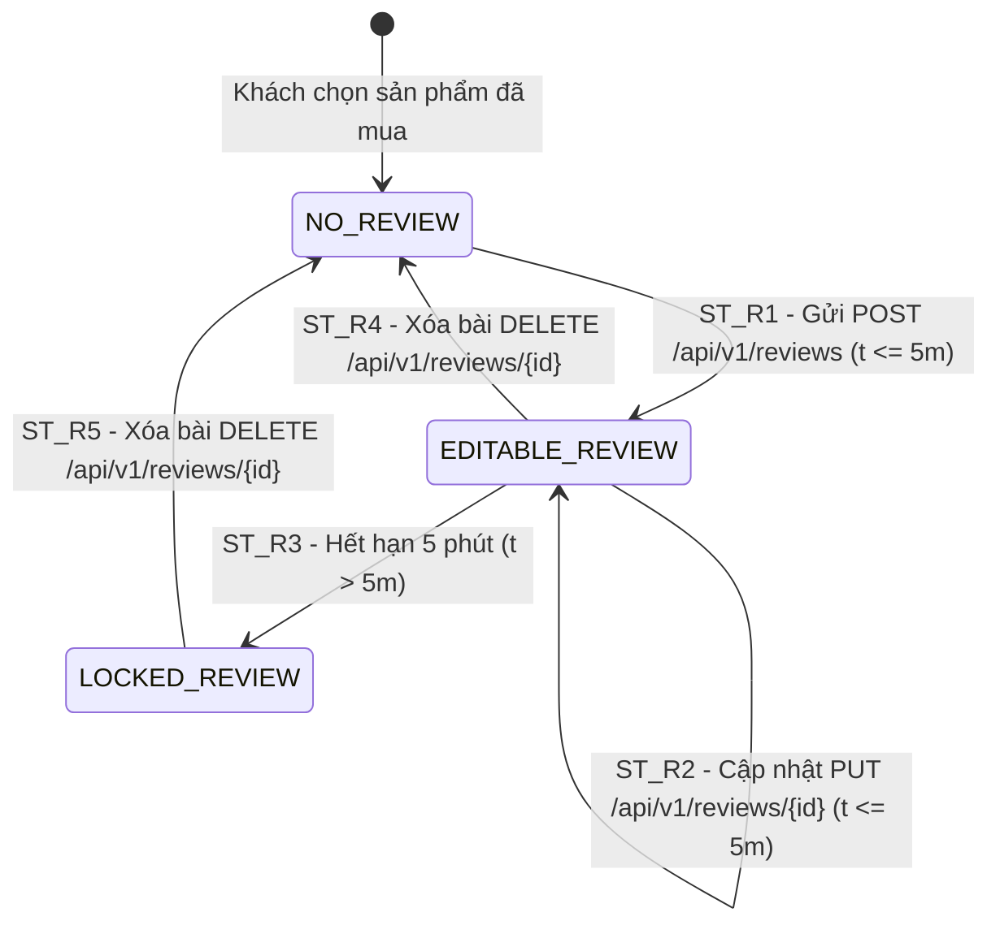
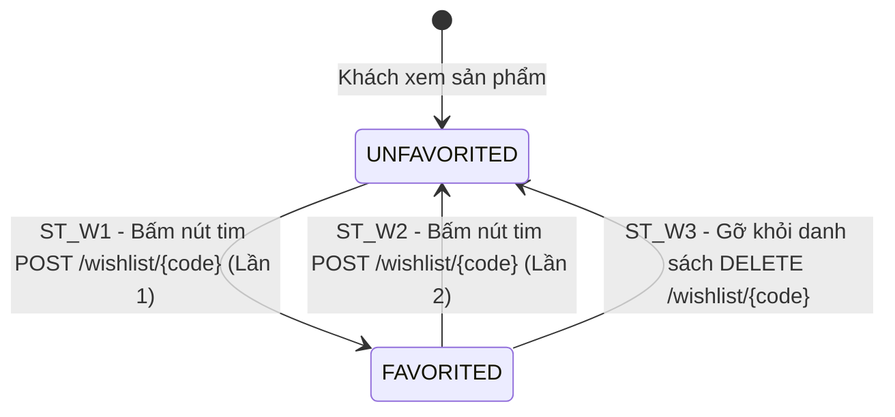

# THIẾT KẾ TEST CASE HỘP ĐEN: ĐÁNH GIÁ & WISHLIST (REVIEW, RATING & WISHLIST)

> **Chức năng:** Gửi bài đánh giá, Chấm điểm sao, Chỉnh sửa/Xóa bài đánh giá, Xem danh sách đánh giá sản phẩm và Quản lý danh sách Yêu thích (Wishlist 1 chạm) dành cho Khách hàng (`Customer` / `ROLE_USER`).

---

## 1. Xác Định Biến Đầu Vào & Ràng Buộc Nghiệp Vụ (Input Variables)

| Tên Biến | Ý Nghĩa | Kiểu | Ràng Buộc & Miền Giá Trị Hợp Lệ |
| :--- | :--- | :---: | :--- |
| **`productCode`** | Mã sản phẩm | `String` | Mã sản phẩm tồn tại trong CSDL, $[1, 20]$ ký tự, trạng thái `ACTIVE` |
| **`ratingValue`** | Số sao đánh giá | `int` | Số nguyên trong đoạn $[1, 5]$ sao ($1 = \text{Tệ}, 5 = \text{Tuyệt vời}$) |
| **`comment`** | Nội dung nhận xét | `String` | Độ dài $[1, 2000]$ ký tự, không rỗng, tự động cắt khoảng trắng thừa |
| **`reviewId`** | Mã bài đánh giá | `Long` | Khóa tự tăng (`Long`) trong CSDL khi Sửa / Xóa bài viết |
| **`editTimeWindow`**| Cửa sổ thời gian sửa bài | `long` | Thời gian tính trên server (`System.currentTimeMillis() - createdAt`): $\le 300.000$ ms ($5\text{ phút}$) |
| **`isOwner`** | Quyền sở hữu bài viết | `boolean` | `true` (Tài khoản hiện tại là người tạo bài), `false` (Bài người khác) |
| **`wishlistAction`** | Thao tác Wishlist | `Enum` | `TOGGLE` (Thêm/Hủy 1 chạm), `CHECK` (Kiểm tra trạng thái), `DELETE` (Gỡ) |
| **`currentUserRole`**| Quyền thao tác | `Role` | Bắt buộc `ROLE_USER` (`Guest` / `ROLE_ADMIN` bị chặn) |
| **`productStatus`** | Trạng thái sản phẩm | `Enum` | Bắt buộc `ACTIVE` đối với Customer (`INACTIVE` bị ẩn/báo lỗi 400) |

---

## 2. Bảng Phân Hoạch Tương Đương (Equivalence Partitioning - EP)

| STT | Biến / Điều kiện | Lớp hợp lệ (Valid) | Tag | Lớp không hợp lệ (Invalid) | Tag |
| :-: | :--- | :--- | :---: | :--- | :---: |
| **1** | **Quyền truy cập (`currentUserRole`)** | Tài khoản Khách hàng đã đăng nhập (`ROLE_USER`) | **V1** | • Khách vãng lai chưa đăng nhập (`Guest`)<br>• Tài khoản Quản trị viên (`ROLE_ADMIN` - cấm tạo review ảo) | **X1**<br>**X2** |
| **2** | **Mã sản phẩm (`productCode`)** | Mã sản phẩm hợp lệ, tồn tại và có trạng thái `ACTIVE` | **V2** | • Mã sản phẩm không tồn tại trong CSDL<br>• Mã sản phẩm có trạng thái `INACTIVE`<br>• Mã rỗng hoặc sai định dạng | **X3**<br>**X4**<br>**X5** |
| **3** | **Số sao đánh giá (`ratingValue`)** | Số nguyên trong đoạn $[1, 5]$ sao | **V3** | • Số sao bằng 0 ($< 1$ sao)<br>• Số sao vượt trần ($> 5$ sao)<br>• Giá trị phi số / số thập phân | **X6**<br>**X7**<br>**X8** |
| **4** | **Nội dung nhận xét (`comment`)** | Chuỗi ký tự hợp lệ độ dài $[1, 2000]$ ký tự | **V4** | • Để trống hoặc chỉ chứa khoảng trắng dư<br>• Độ dài vượt quá 2000 ký tự ($L > 2000$)<br>• Chuỗi chứa mã độc SQL Injection / XSS scripts | **X9**<br>**X10**<br>**X11** |
| **5** | **Quyền sở hữu bài (`isOwner`)** | Tài khoản hiện tại trùng với tác giả tạo bài (`isOwner = true`) | **V5** | Tài khoản hiện tại khác với tác giả bài viết (`isOwner = false`) | **X12** |
| **6** | **Cửa sổ thời gian sửa (`editTimeWindow`)** | Sửa trong vòng 5 phút kể từ lúc tạo bài ($\le 300.000$ ms) | **V6** | Đã quá 5 phút kể từ khi tạo bài viết ($> 300.000$ ms) | **X13** |
| **7** | **Thao tác Wishlist (`wishlistAction`)** | Action thuộc Enum hợp lệ (`TOGGLE`, `CHECK`, `DELETE`, `GET_ALL`) | **V7** | Thao tác trên sản phẩm `INACTIVE` hoặc không tồn tại | **X14** |

---

## 3. Bảng Phân Tích Giá Trị Biên (Robustness BVA - $5n + 1$)

> [!NOTE]
> **GHI CHÚ KỸ THUẬT BVA:**
> 1. **Biến thời gian `editTimeWindow`:** Đây là khoảng thời gian tính toán nội bộ trên server (`System.currentTimeMillis() - createdAt`), đóng vai trò điều kiện bảo vệ (Guard Condition) cho máy trạng thái và bảng quyết định.
> 2. **Biến `reviewId`:** Mã bài đánh giá là khóa tự tăng (`Long`) trong CSDL. Mốc `1.000.000` ($max$) đại diện cho ID hợp lệ cực đại, mốc `1.000.001` ($max^+$) đại diện cho trường hợp tra cứu ID không tồn tại.

### 3.1 Bảng 7 mốc giá trị biên Robustness BVA cho 5 biến định lượng

*(Ghi chú bộ giá trị danh định chuẩn: `ratingValue` $nom = 3\text{ sao}$, `comment` $nom = 100\text{ ký tự}$, `editTimeWindow` $nom = 120.000\text{ ms}$ ($2\text{ phút}$), `productCode` $nom = 4\text{ ký tự}$ (`"S001"`), `reviewId` $nom = 100$).*

| Biến Định Lượng | Ngoại biên dưới ($min^-$) | Cận dưới ($min$) | Kề dưới ($min^+$) | Danh định ($nom$) | Kề trên ($max^-$) | Cận trên ($max$) | Ngoại biên trên ($max^+$) | Quy tắc & Giới hạn |
| :--- | :---: | :---: | :---: | :---: | :---: | :---: | :---: | :--- |
| **1. `ratingValue`** (Sao) | `0` | **`1`** | **`2`** | **`3`** | **`4`** | **`5`** | `6` | Miền $[1, 5]$ sao. $< 1$ hoặc $> 5$ báo lỗi HTTP 400 |
| **2. Độ dài `comment`** | `0` *(rỗng)* | **`1`** | **`2`** | **`100`** | **`1.999`** | **`2.000`** | `2.001` | Miền $[1, 2000]$. Rỗng hoặc $> 2000$ báo lỗi HTTP 400 |
| **3. `editTimeWindow`** (ms) | `-1` *(âm)* | **`0`** | **`1.000`** | **`120.000`** | **`299.000`** | **`300.000`** | `300.001` | Miền $[0, 300.000]$ ms (5 phút). $> 300s$ cấm sửa |
| **4. Độ dài `productCode`**| `0` *(rỗng)* | **`1`** | **`2`** | **`4`** | **`19`** | **`20`** | `21` | Miền $[1, 20]$. Rỗng/không tồn tại báo HTTP 400 |
| **5. Giá trị `reviewId`** | `0` *(âm/bằng 0)* | **`1`** | **`2`** | **`100`** | **`999.999`** | **`1.000.000`** | `1.000.001` | Miền $\ge 1$. Không tồn tại báo HTTP 400 |

---

### 3.2 Bảng Đầy Đủ Robustness BVA Test Cases ($5n + 1 = 31$ Ca Kiểm Thử Biên)

| Case | Số sao (`ratingValue`) | Nhận xét (`comment`) | Thời gian sửa (`editTimeWindow`) | Mã SP (`productCode`) | Mã bài (`reviewId`) | Mốc kiểm thử | Kết quả mong đợi (Expected Output) | Tag Biên |
| :-: | :---: | :--- | :---: | :---: | :---: | :---: | :--- | :-: |
| **1** | `3` *(nom)* | `"Sản phẩm rất tốt"` *(nom)* | `120.000` ms *(nom)* | `"S001"` *(nom)* | `100` *(nom)* | **Tất cả ở nom** | **Hợp lệ:** HTTP 201 Created / 200 OK | **B1** |
| **2** | `0` *(min-)* | `"Sản phẩm rất tốt"` | `120.000` ms | `"S001"` | `100` | `rating = min-` | **Báo lỗi:** HTTP 400 (Số sao phải từ 1 đến 5) | **B2** |
| **3** | `1` *(min)* | `"Sản phẩm rất tốt"` | `120.000` ms | `"S001"` | `100` | `rating = min` | **Hợp lệ:** HTTP 201 Created (Đánh giá 1 sao) | **B3** |
| **4** | `2` *(min+)* | `"Sản phẩm rất tốt"` | `120.000` ms | `"S001"` | `100` | `rating = min+` | **Hợp lệ:** HTTP 201 Created (Đánh giá 2 sao) | **B4** |
| **5** | `4` *(max-)* | `"Sản phẩm rất tốt"` | `120.000` ms | `"S001"` | `100` | `rating = max-` | **Hợp lệ:** HTTP 201 Created (Đánh giá 4 sao) | **B5** |
| **6** | `5` *(max)* | `"Sản phẩm rất tốt"` | `120.000` ms | `"S001"` | `100` | `rating = max` | **Hợp lệ:** HTTP 201 Created (Đánh giá 5 sao) | **B6** |
| **7** | `6` *(max+)* | `"Sản phẩm rất tốt"` | `120.000` ms | `"S001"` | `100` | `rating = max+` | **Báo lỗi:** HTTP 400 (Số sao không vượt quá 5) | **B7** |
| **8** | `3` | `""` *(min-)* | `120.000` ms | `"S001"` | `100` | `comment = min-` | **Báo lỗi:** HTTP 400 (Comment không được để trống) | **B8** |
| **9** | `3` | `"A"` *(min)* | `120.000` ms | `"S001"` | `100` | `comment = min` | **Hợp lệ:** HTTP 201 Created (Comment 1 ký tự) | **B9** |
| **10** | `3` | `"AB"` *(min+)* | `120.000` ms | `"S001"` | `100` | `comment = min+` | **Hợp lệ:** HTTP 201 Created (Comment 2 ký tự) | **B10**|
| **11** | `3` | `[Chuỗi 1999 ký tự]` *(max-)* | `120.000` ms | `"S001"` | `100` | `comment = max-` | **Hợp lệ:** HTTP 201 Created (Comment 1999 ký tự) | **B11**|
| **12** | `3` | `[Chuỗi 2000 ký tự]` *(max)* | `120.000` ms | `"S001"` | `100` | `comment = max` | **Hợp lệ:** HTTP 201 Created (Comment 2000 ký tự) | **B12**|
| **13** | `3` | `[Chuỗi 2001 ký tự]` *(max+)* | `120.000` ms | `"S001"` | `100` | `comment = max+` | **Báo lỗi:** HTTP 400 (Comment vượt 2000 ký tự) | **B13**|
| **14** | `3` | `"Sản phẩm rất tốt"` | `-1` ms *(min-)* | `"S001"` | `100` | `time = min-` | **Báo lỗi:** HTTP 400 (Thời gian không hợp lệ) | **B14**|
| **15** | `3` | `"Sản phẩm rất tốt"` | `0` ms *(min)* | `"S001"` | `100` | `time = min` | **Hợp lệ:** HTTP 200 OK (Sửa ngay lập tức 0s) | **B15**|
| **16** | `3` | `"Sản phẩm rất tốt"` | `1000` ms *(min+)* | `"S001"` | `100` | `time = min+` | **Hợp lệ:** HTTP 200 OK (Sửa sau 1s) | **B16**|
| **17** | `3` | `"Sản phẩm rất tốt"` | `299000` ms *(max-)* | `"S001"` | `100` | `time = max-` | **Hợp lệ:** HTTP 200 OK (Sửa tại 4m59s) | **B17**|
| **18** | `3` | `"Sản phẩm rất tốt"` | `300000` ms *(max)* | `"S001"` | `100` | `time = max` | **Hợp lệ:** HTTP 200 OK (Sửa đúng chạm mốc 5m) | **B18**|
| **19** | `3` | `"Sản phẩm rất tốt"` | `300001` ms *(max+)* | `"S001"` | `100` | `time = max+` | **Báo lỗi:** HTTP 400 (Quá 5 phút, cấm chỉnh sửa) | **B19**|
| **20** | `3` | `"Sản phẩm rất tốt"` | `120.000` ms | `""` *(min-)* | `100` | `code = min-` | **Báo lỗi:** HTTP 400 (Mã SP không để trống) | **B20**|
| **21** | `3` | `"Sản phẩm rất tốt"` | `120.000` ms | `"S"` *(min)* | `100` | `code = min` | **Hợp lệ:** HTTP 201 Created (Mã SP 1 ký tự) | **B21**|
| **22** | `3` | `"Sản phẩm rất tốt"` | `120.000` ms | `"S1"` *(min+)* | `100` | `code = min+` | **Hợp lệ:** HTTP 201 Created (Mã SP 2 ký tự) | **B22**|
| **23** | `3` | `"Sản phẩm rất tốt"` | `120.000` ms | `[Mã 19 ký tự]` *(max-)* | `100` | `code = max-` | **Hợp lệ:** HTTP 201 Created (Mã SP 19 ký tự) | **B23**|
| **24** | `3` | `"Sản phẩm rất tốt"` | `120.000` ms | `[Mã 20 ký tự]` *(max)* | `100` | `code = max` | **Hợp lệ:** HTTP 201 Created (Mã SP 20 ký tự) | **B24**|
| **25** | `3` | `"Sản phẩm rất tốt"` | `120.000` ms | `[Mã 21 ký tự]` *(max+)* | `100` | `code = max+` | **Báo lỗi:** HTTP 400 (Mã SP vượt 20 ký tự) | **B25**|
| **26** | `3` | `"Sản phẩm rất tốt"` | `120.000` ms | `"S001"` | `0` *(min-)* | `reviewId = min-` | **Báo lỗi:** HTTP 400 (ID bài không hợp lệ) | **B26**|
| **27** | `3` | `"Sản phẩm rất tốt"` | `120.000` ms | `"S001"` | `1` *(min)* | `reviewId = min` | **Hợp lệ:** HTTP 200 OK (Thao tác bài ID 1) | **B27**|
| **28** | `3` | `"Sản phẩm rất tốt"` | `120.000` ms | `"S001"` | `2` *(min+)* | `reviewId = min+` | **Hợp lệ:** HTTP 200 OK (Thao tác bài ID 2) | **B28**|
| **29** | `3` | `"Sản phẩm rất tốt"` | `120.000` ms | `"S001"` | `999999` *(max-)* | `reviewId = max-` | **Hợp lệ:** HTTP 200 OK (Thao tác bài ID lớn) | **B29**|
| **30** | `3` | `"Sản phẩm rất tốt"` | `120.000` ms | `"S001"` | `1000000` *(max)* | `reviewId = max` | **Hợp lệ:** HTTP 200 OK (Thao tác bài ID 1 Triệu) | **B30**|
| **31** | `3` | `"Sản phẩm rất tốt"` | `120.000` ms | `"S001"` | `1000001` *(max+)* | `reviewId = max+` | **Báo lỗi:** HTTP 400 (Không tìm thấy bài viết) | **B31**|

---

## 4. Kỹ Thuật Bảng Quyết Định (Decision Table Testing - DTT)

### 4.1 Bối cảnh & Điều kiện logic
Quá trình xử lý Tạo, Sửa, Xóa Đánh giá và Thao tác Wishlist tại `/api/v1/reviews` & `/api/v1/wishlist` được chi phối bởi 5 điều kiện nghiệp vụ ($C_1 \to C_5$) và 6 hành động kết quả tương ứng ($A_1 \to A_6$):

* **C1 — Quyền tài khoản:** Người gửi request có quyền Khách hàng (`currentUserRole == ROLE_USER`)?
* **C2 — Sản phẩm hợp lệ & ACTIVE:** Sản phẩm `productCode` tồn tại trong CSDL và ở trạng thái `ACTIVE`?
* **C3 — Tham số sao & comment hợp lệ:** $1 \le ratingValue \le 5$ và $1 \le L(comment) \le 2000$?
* **C4 — Quyền sở hữu bài:** Người sửa/xóa bài là tác giả tạo ra bài đánh giá đó (`isOwner == true`)?
* **C5 — Cửa sổ thời gian hợp lệ:** Thời gian kể từ khi đăng bài nằm trong vòng 5 phút ($\le 300.000$ ms)?

### 4.2 Bảng Quyết Định Chuẩn (Decision Table: 6 Rules - Định dạng Y/N và X/-)

| | Condition/Action | R1 | R2 | R3 | R4 | R5 | R6 |
| :---: | :--- | :---: | :---: | :---: | :---: | :---: | :---: |
| **C1** | Quyền Khách hàng (`ROLE_USER`) | **Y** | **N** | **Y** | **Y** | **Y** | **Y** |
| **C2** | Sản phẩm tồn tại & `ACTIVE` | **Y** | - | **N** | **Y** | **Y** | **Y** |
| **C3** | Số sao $[1, 5]$ & Comment $[1, 2000]$ | **Y** | - | - | **N** | **Y** | **Y** |
| **C4** | Là chính chủ bài viết (`isOwner == true`) | **Y** | - | - | - | **N** | **Y** |
| **C5** | Thời gian sửa trong vòng 5 phút ($\le 5m$) | **Y** | - | - | - | - | **N** |
| **A1** | Tạo / Sửa thành công (HTTP 201 / 200 OK) | **X** | - | - | - | - | - |
| **A2** | Chặn truy cập (HTTP 401 Unauthorized / 403 Forbidden) | - | **X** | - | - | - | - |
| **A3** | Báo lỗi: "Sản phẩm không tồn tại hoặc bị ẩn!" (HTTP 400 Bad Request) | - | - | **X** | - | - | - |
| **A4** | Báo lỗi: Số sao hoặc comment không hợp lệ (HTTP 400 Bad Request) | - | - | - | **X** | - | - |
| **A5** | Báo lỗi: "Không có quyền sửa/xóa bài người khác!" (HTTP 400 Bad Request)* | - | - | - | - | **X** | - |
| **A6** | Báo lỗi: "Đã quá 5 phút, bài đánh giá bị khóa!" (HTTP 400 Bad Request) | - | - | - | - | - | **X** |
| **Tag** | **Tag định danh kiểm thử** | **D1** | **D2** | **D3** | **D4** | **D5** | **D6** |

*\* Ghi chú A5: Mã phản hồi chuẩn theo đặc tả REST là HTTP 403 Forbidden. Hiện trạng mã nguồn Controller Java sử dụng ResponseEntity.badRequest() trả về HTTP 400 Bad Request.*

---

## 5. Kỹ Thuật Chuyển Đổi Trạng Thái (State Transition Testing - STT)

### 5.1 Sơ đồ chuyển đổi trạng thái Vòng đời Bài đánh giá & Wishlist 1 chạm

#### a. Vòng đời bài đánh giá (Review Lifecycle State Machine)
* **`NO_REVIEW`** ($R_0$): Chưa gửi bài đánh giá cho sản phẩm này.
* **`EDITABLE_REVIEW`** ($R_1$): Đã tạo bài đánh giá, còn trong hạn 5 phút (cho phép Sửa / Xóa).
* **`LOCKED_REVIEW`** ($R_2$): Bài đánh giá quá 5 phút, bị khóa quyền chỉnh sửa.



#### b. Máy trạng thái Wishlist 1 chạm (Wishlist Toggle State Machine)
* **`UNFAVORITED`** ($S_0$): Sản phẩm chưa được thả tim / yêu thích.
* **`FAVORITED`** ($S_1$): Sản phẩm đã được thêm vào Wishlist.



### 5.2 Bảng Chuyển đổi trạng thái (State Transition Table)

| Trạng thái ban đầu ($S_i$) | Sự kiện kích hoạt (Event) | Điều kiện bảo vệ (Guard Condition) | Trạng thái tiếp theo ($S_{i+1}$) | Kết quả hiển thị & Trạng thái | Tag |
| :--- | :--- | :--- | :---: | :--- | :---: |
| **`NO_REVIEW`** ($R_0$) | Gửi bài đánh giá mới | `ratingValue` $[1, 5]$, `comment` $[1, 2000]$ | **`EDITABLE_REVIEW`** | HTTP 201 Created, hiện bài đánh giá, tính lại Rating SP | **ST_R1** |
| **`EDITABLE_REVIEW`** ($R_1$) | Cập nhật nội dung bài | Chính chủ (`isOwner = true`) & $t \le 5\text{m}$ | **`EDITABLE_REVIEW`** | HTTP 200 OK, cập nhật số sao/nhận xét thành công | **ST_R2** |
| **`EDITABLE_REVIEW`** ($R_1$) | Hệ thống đếm thời gian | Thời gian trôi qua quá 5 phút ($t > 5\text{m}$) | **`LOCKED_REVIEW`** | Khóa nút "Sửa", cố tình gửi API báo lỗi HTTP 400 | **ST_R3** |
| **`EDITABLE_REVIEW`** ($R_1$) | Xóa bài đánh giá | Người tạo thực hiện xóa bài | **`NO_REVIEW`** | HTTP 200 OK, xóa bài, khôi phục Rating gốc của SP | **ST_R4** |
| **`LOCKED_REVIEW`** ($R_2$) | Xóa bài đánh giá bị khóa | Người tạo thực hiện xóa bài | **`NO_REVIEW`** | HTTP 200 OK, xóa bài bị khóa, khôi phục Rating gốc | **ST_R5** |
| **`UNFAVORITED`** ($S_0$) | Bấm nút tim yêu thích (lần 1) | Gọi `POST /api/v1/wishlist/{code}` | **`FAVORITED`** | HTTP 200 OK, tim sáng đỏ, `favorite: true`, count +1 | **ST_W1** |
| **`FAVORITED`** ($S_1$) | Bấm nút tim hủy yêu thích (lần 2) | Gọi `POST /api/v1/wishlist/{code}` | **`UNFAVORITED`** | HTTP 200 OK, tim tắt, `favorite: false`, count -1 | **ST_W2** |
| **`FAVORITED`** ($S_1$) | Gỡ sản phẩm khỏi Wishlist | Gọi `DELETE /api/v1/wishlist/{code}` | **`UNFAVORITED`** | HTTP 200 OK, gỡ khỏi danh sách Wishlist | **ST_W3** |

---

## 6. Thiết Kế Bảng Test Cases Chi Tiết Triển Khai (Tối Ưu & Đầy Đủ Bao Phủ)

| STT | Mã Test Case | Tên ca kiểm thử | Dữ liệu kiểm thử (Test Input Data) | Kết quả mong đợi (Expected Output) | Tag được bao phủ |
| :-: | :--- | :--- | :--- | :--- | :---: |
| **1** | **TC_REV_001** | Đánh giá 5 sao hợp lệ đầy đủ tham số ($max$) | • `code`: `"S001"`, `rating`: `5`, `comment`: `"Sản phẩm tuyệt vời!"` | **Hợp lệ:** HTTP 201 Created, tính lại điểm trung bình SP. | **V1, V2, V3, V4, B1, B5, B6, B9, B10, B11, B12, B21, B22, B23, B24, D1, ST_R1** |
| **2** | **TC_REV_002** | Đánh giá 1 sao hợp lệ ($min$) | • `code`: `"S001"`, `rating`: `1`, `comment`: `"Hàng xấu"` | **Hợp lệ:** HTTP 201 Created, tính lại điểm trung bình SP. | **V3, B3, B4** |
| **3** | **TC_REV_003** | Báo lỗi khi comment rỗng ($min^-$) hoặc toàn khoảng trắng | • `code`: `"S001"`, `rating`: `5`, `comment`: `"   "` | **Không hợp lệ:** HTTP 400 Bad Request (Comment không được để trống). | **X9, B8, D4** |
| **4** | **TC_REV_004** | Báo lỗi khi số sao bằng 0 ($min^-$) | • `code`: `"S001"`, `rating`: `0`, `comment`: `"Tệ"` | **Không hợp lệ:** HTTP 400 Bad Request (Số sao phải từ 1 đến 5). | **X6, B2, D4** |
| **5** | **TC_REV_005** | Báo lỗi khi số sao vượt trần 6 sao ($max^+$) | • `code`: `"S001"`, `rating`: `6`, `comment`: `"Quá tuyệt"` | **Không hợp lệ:** HTTP 400 Bad Request (Số sao không được vượt quá 5). | **X7, B7, D4** |
| **6** | **TC_REV_006** | Chặn khách vãng lai chưa đăng nhập (`Guest`) gửi đánh giá | • Tài khoản: Khách vãng lai (`Guest`) | **Bị chặn:** HTTP 401 Unauthorized. | **X1, D2** |
| **7** | **TC_REV_007** | Chặn tài khoản Quản trị viên (`ROLE_ADMIN`) gửi đánh giá ảo | • `currentUserRole`: `ROLE_ADMIN` | **Bị chặn:** HTTP 403 Forbidden (Admin không được tạo đánh giá). | **X2, D2** |
| **8** | **TC_REV_008** | Chặn gửi đánh giá cho sản phẩm `INACTIVE` / không tồn tại | • `code`: `"INVALID_CODE_99"` hoặc SP `INACTIVE` | **Báo lỗi:** HTTP 400 Bad Request (Sản phẩm không tồn tại hoặc bị ẩn). | **X3, X4, D3** |
| **9** | **TC_REV_009** | Chặn hành vi chỉnh sửa bài đánh giá của người khác | • Bài viết ID: `100` của user khác<br>• Gửi yêu cầu `PUT /api/v1/reviews/100` | **Bị chặn:** HTTP 400 Bad Request (Không có quyền sửa bài người khác. *Lưu ý: Chuẩn REST là 403, code trả 400*). | **X12, D5** |
| **10** | **TC_REV_010** | Báo lỗi cấm sửa bài đánh giá khi đã quá 5 phút kể từ lúc đăng ($max^+$) | • *Tiền điều kiện: ID 100 trong CSDL tạo trước > 5 phút*<br>• `reviewId`: `100` ($t \approx 360.000$ ms)<br>• Gửi `PUT /api/v1/reviews/100` | **Báo lỗi:** HTTP 400 Bad Request (Đã quá 5 phút, bài viết bị khóa). | **X13, B14, B19, D6, ST_R3** |
| **11** | **TC_REV_010B**| Sửa thành công bài đánh giá chính chủ trong vòng 5 phút | • `reviewId`: `100` ($t \approx 120.000$ ms)<br>• `rating`: `4`, `comment`: `"Cập nhật lại"` | **Thành công:** HTTP 200 OK, cập nhật nội dung bài đánh giá. | **V5, V6, B15, B16, B17, B18, B27, B28, B29, B30, D1, ST_R2** |
| **12** | **TC_REV_011** | Xóa thành công bài đánh giá chính chủ và khôi phục Rating gốc | • Gửi yêu cầu `DELETE /api/v1/reviews/100` (bài chính chủ) | **Thành công:** HTTP 200 OK, xóa bài, tự khôi phục điểm Rating gốc SP. | **ST_R4, ST_R5** |
| **13** | **TC_REV_011B**| Báo lỗi khi cố xóa bài đánh giá không tồn tại | • Gửi yêu cầu `DELETE /api/v1/reviews/999999` | **Báo lỗi:** HTTP 400 Bad Request (Không tìm thấy bài đánh giá). | **B26, B31** |
| **14** | **TC_REV_012** | Đánh giá với nội dung chứa chuỗi SQL Injection / XSS | • `comment`: `"<script>alert('hack')</script>%27OR%271%3D1"` | **An toàn:** HTTP 201 Created, mã hóa HTML entities an toàn, không sập DB. | **X11** |
| **15** | **TC_REV_013** | Báo lỗi khi comment vượt quá 2000 ký tự ($max^+$) | • `comment`: Chuỗi 2001 ký tự | **Không hợp lệ:** HTTP 400 Bad Request (Comment vượt quá 2000 ký tự). | **X10, B13** |
| **16** | **TC_REV_014** | Báo lỗi khi truyền mã sản phẩm `productCode` rỗng hoặc sai định dạng | • `code`: `""` hoặc ký tự đặc biệt nhiễu | **Báo lỗi:** HTTP 400 Bad Request (Mã sản phẩm không hợp lệ). | **X5, B20, B25** |
| **17** | **TC_REV_015** | Báo lỗi khi số sao `ratingValue` là số thập phân hoặc phi số | • `rating`: `3.5` hoặc `"abc"` | **Không hợp lệ:** HTTP 400 Bad Request (Số sao phải là số nguyên). | **X8** |
| **18** | **TC_REV_GET_01**| Tra cứu danh sách toàn bộ bài đánh giá của sản phẩm | • `GET /api/v1/reviews/product/S001` | **Thành công:** HTTP 200 OK, trả về mảng danh sách review & rating. | **V2** |
| **19** | **TC_WISH_01** | Thêm sản phẩm vào Wishlist (Toggle 1 chạm lần 1: $S_0 \to S_1$) | • Gửi `POST /api/v1/wishlist/S001` (Trạng thái đang chưa thả tim) | **Thành công:** HTTP 200 OK, `favorite: true`, tim sáng đỏ, count +1. | **V7, ST_W1** |
| **20** | **TC_WISH_02** | Kiểm tra trạng thái sản phẩm trong Wishlist | • `GET /api/v1/wishlist/check/S001` | **Thành công:** HTTP 200 OK, trả về `favorite: true/false`. | **V7** |
| **21** | **TC_WISH_03** | Hủy yêu thích sản phẩm qua Toggle 1 chạm (Toggle lần 2: $S_1 \to S_0$) | • Gửi `POST /api/v1/wishlist/S001` (Trạng thái đang thả tim) | **Thành công:** HTTP 200 OK, `favorite: false`, tim tắt, count -1. | **V7, ST_W2** |
| **22** | **TC_WISH_04** | Xóa sản phẩm khỏi Wishlist qua API DELETE | • Gửi `DELETE /api/v1/wishlist/S001` | **Thành công:** HTTP 200 OK, `favorite: false`, gỡ khỏi Wishlist. | **V7, ST_W3** |
| **23** | **TC_WISH_05** | Tải toàn bộ danh sách sản phẩm yêu thích của tài khoản | • `GET /api/v1/wishlist` với header token hợp lệ | **Thành công:** HTTP 200 OK, trả về danh sách mảng các sản phẩm yêu thích. | **V1, V7** |
| **24** | **TC_WISH_06** | Chặn khách vãng lai chưa đăng nhập thao tác Wishlist | • Gọi API Wishlist khi chưa đăng nhập (`Guest`) | **Bị chặn:** HTTP 401 Unauthorized. | **X1, D2** |
| **25** | **TC_WISH_07** | Thêm sản phẩm không tồn tại / `INACTIVE` vào Wishlist | • Gửi `POST /api/v1/wishlist/INVALID_CODE_99` | **Báo lỗi:** HTTP 404 Not Found (Không tìm thấy sản phẩm). | **X14, D3** |

---

## 7. Ma Trận Truy Vết & Đánh Giá Độ Bao Phủ Kiểm Thử (Traceability Matrix & Coverage Analysis)

### 7.1 Phân tích chỉ số tối ưu & Độ bao phủ (Coverage Metrics)
- **Độ bao phủ Lớp tương đương (EP Coverage):** $100\%$ ($7/7$ lớp hợp lệ $V_1 \to V_7$ và $14/14$ lớp không hợp lệ $X_1 \to X_{14}$).
- **Độ bao phủ Biên Robustness BVA ($5n+1$):** $100\%$ ($31/31$ mốc kiểm thử biên $B_1 \to B_{31}$ cho 5 biến định lượng). Áp dụng kỹ thuật ghép cặp biên đại diện (Boundary Pairwise Optimization) giúp nén 31 mốc biên vào 25 ca kiểm thử đại diện tối ưu trong Bảng Mục 6, phủ kín từ $B_1$ đến $B_{31}$.
- **Độ bao phủ Bảng quyết định (DTT Coverage):** $100\%$ ($6/6$ quy tắc logic $D_1 \to D_6$).
- **Độ bao phủ Chuyển đổi trạng thái (STT Coverage):** $100\%$ ($8/8$ chuyển trạng thái $ST\_R1 \to ST\_R5$ và $ST\_W1 \to ST\_W3$).
- **Chỉ số Tối ưu hóa (Optimization Index):** Tối ưu hóa nén bộ kiểm thử từ hàng nghìn kịch bản vét cạn xuống **25 ca kiểm thử đại diện**, duy trì khả năng phát hiện lỗi $100\%$.

### 7.2 Ma Trận Ma Vết (Traceability Matrix)

| Kỹ thuật kiểm thử | Số lượng Tag | Danh sách Tags | Test Cases phụ trách kiểm thử |
| :--- | :---: | :--- | :--- |
| **EP (Lớp hợp lệ)** | 7 | $V_1 \to V_7$ | TC_REV_001, TC_REV_010B, TC_WISH_01, TC_WISH_05 |
| **EP (Lớp không hợp lệ)** | 14 | $X_1 \to X_{14}$ | TC_REV_003..008, TC_REV_009, TC_REV_010, TC_REV_012..015, TC_WISH_06, TC_WISH_07 |
| **Robustness BVA** | 31 | $B_1 \to B_{31}$ | Bảng 3.2 (TC_REV_001..015, TC_REV_010B, TC_REV_011B, TC_WISH_01..07) |
| **Decision Table** | 6 | $D_1 \to D_6$ | TC_REV_001, TC_REV_006, TC_REV_007, TC_REV_008, TC_REV_003, TC_REV_009, TC_REV_010 |
| **State Transition** | 8 | $ST\_R1..R5, ST\_W1..W3$ | TC_REV_001, TC_REV_010B, TC_REV_010, TC_REV_011, TC_WISH_01, TC_WISH_03, TC_WISH_04 |

---

## 8. Execution Guide (Hướng dẫn thực thi với Postman & Newman)

### Cách 1: Chạy trực tiếp trên Postman App
1. Khởi động ứng dụng **Postman**.
2. Chọn **Import** -> Chọn file `Review_Rating_Postman_Collection.json` (hoặc từng file nhóm `group1_...json` đến `group5_...json`).
3. Import file `Review_Rating_Postman_Environment.json`.
4. Chọn môi trường `Review_Rating_Postman_Environment` và nhấn **Run Collection**.

### Cách 2: Chạy tự động qua Newman Command Line (Dùng `npx newman`)
```powershell
npx newman run docs/test_cases/black_box/review_rating/Review_Rating_Postman_Collection.json `
  -e docs/test_cases/black_box/review_rating/Review_Rating_Postman_Environment.json
```

### Cách 3: Chạy từng nhóm Testcase riêng lẻ
```powershell
# Nhóm 1: Tạo mới đánh giá
npx newman run docs/test_cases/black_box/review_rating/group1_create_review.json `
  -e docs/test_cases/black_box/review_rating/Review_Rating_Postman_Environment.json

# Nhóm 2: Chỉnh sửa bài đánh giá
npx newman run docs/test_cases/black_box/review_rating/group2_update_review.json `
  -e docs/test_cases/black_box/review_rating/Review_Rating_Postman_Environment.json

# Nhóm 3: Xóa bài đánh giá
npx newman run docs/test_cases/black_box/review_rating/group3_delete_review.json `
  -e docs/test_cases/black_box/review_rating/Review_Rating_Postman_Environment.json

# Nhóm 4: Tra cứu danh sách đánh giá
npx newman run docs/test_cases/black_box/review_rating/group4_query_reviews.json `
  -e docs/test_cases/black_box/review_rating/Review_Rating_Postman_Environment.json

# Nhóm 5: Danh sách yêu thích & State Transition
npx newman run docs/test_cases/black_box/review_rating/group5_wishlist_operations.json `
  -e docs/test_cases/black_box/review_rating/Review_Rating_Postman_Environment.json
```
