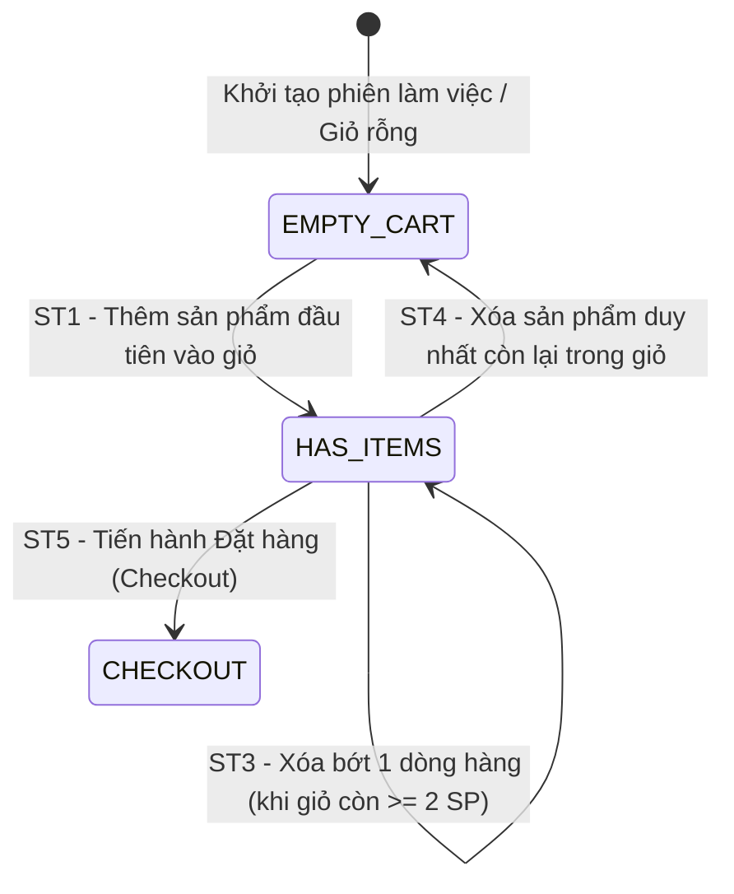

# THIẾT KẾ TEST CASE HỘP ĐEN: GIỎ HÀNG (SHOPPING CART CRUD)

> **Chức năng:** Quản lý Giỏ hàng Khách hàng, Thêm mới sản phẩm, Cập nhật số lượng mua, Kiểm soát tồn kho, Xóa sản phẩm và Chuẩn bị Đặt hàng.

---

## 1. Xác Định Biến Đầu Vào & Ràng Buộc Nghiệp Vụ (Input Variables)

| Tên Biến | Ý Nghĩa | Kiểu | Ràng Buộc & Miền Giá Trị Hợp Lệ |
| :--- | :--- | :---: | :--- |
| **`code`** | Mã sản phẩm | `String` | Độ dài $[1, 50]$, không rỗng, tồn tại trong CSDL và đang mở bán |
| **`quantity`** | Số lượng mua | `int` | Số nguyên dương $\ge 1$ và không vượt quá tồn kho ($\le Stock$) |
| **`stock`** | Tồn kho hệ thống | `int` | Số lượng tồn kho hiện tại trong CSDL ($\ge 0$) |
| **`cartStatus`** | Trạng thái giỏ hàng | `Enum` | `EMPTY_CART` (Rỗng), `HAS_ITEMS` (Có sản phẩm), `CHECKOUT` (Thanh toán) |
| **`currentUserRole`** | Quyền thao tác | `Role` | Yêu cầu `ROLE_USER` hoặc `ROLE_ADMIN` đã đăng nhập |

---

## 2. Bảng Phân Hoạch Tương Đương (Equivalence Partitioning - EP)

| STT | Biến / Điều kiện | Lớp hợp lệ (Valid) | Tag | Lớp không hợp lệ (Invalid) | Tag |
| :-: | :--- | :--- | :---: | :--- | :---: |
| **1** | **Mã sản phẩm (`code`)** | Mã tồn tại trong CSDL và còn bán | **V1** | • Mã không tồn tại trong CSDL<br>• Để trống (`""`) hoặc chỉ chứa khoảng trắng<br>• Độ dài vượt quá 50 ký tự ($L > 50$) | **X1**<br>**X2**<br>**X2b** |
| **2** | **Số lượng mua (`quantity`)** | Số nguyên dương $1 \le Q \le \text{Stock}$ | **V2** | • Số lượng bằng $0$ ($Q = 0$)<br>• Số lượng âm ($Q < 0$)<br>• Vượt quá số lượng tồn kho ($Q > \text{Stock}$)<br>• Chứa ký tự phi số / số thập phân | **X3**<br>**X4**<br>**X5**<br>**X6** |
| **3** | **Tình trạng dòng hàng** | • Thêm sản phẩm chưa có trong giỏ<br>• Cập nhật số lượng sản phẩm đã có sẵn | **V3**<br>**V4** | Cập nhật / Xóa sản phẩm không nằm trong giỏ | **X7** |
| **4** | **Quyền truy cập (`currentUserRole`)** | Khách hàng đã xác thực session (`ROLE_USER`) | **V5** | Khách vãng lai chưa đăng nhập (`Guest` $\to$ HTTP 401) | **X8** |

---

## 3. Bảng Phân Tích Giá Trị Biên (Robustness BVA - $6n + 1$)

### 3.1 Bảng 7 mốc giá trị biên Robustness BVA cho 2 biến định lượng
*(Ghi chú bộ giá trị danh định: `quantity` $nom = 5$, Tồn kho hệ thống $Stock = 10$; Độ dài `code` $nom = 10\text{ ký tự}$).*

| Biến Định Lượng | Ngoại biên dưới ($min^-$) | Cận dưới ($min$) | Kề dưới ($min^+$) | Danh định ($nom$) | Kề trên ($max^-$) | Cận trên ($max$) | Ngoại biên trên ($max^+$) | Quy tắc & Giới hạn |
| :--- | :---: | :---: | :---: | :---: | :---: | :---: | :---: | :--- |
| **1. Số lượng `quantity`** | `0` *(Lỗi)* | **`1`** | **`2`** | **`5`** | **`9`** | **`10`** | `11` *(Lỗi/Capped)* | Miền $[1, 10]$. $Q \le 0$ báo lỗi; $Q > 10$ chặn vượt kho |
| **2. Độ dài `code`** | `0` *(rỗng)* | **`1`** | **`2`** | **`10`** | **`49`** | **`50`** | `51` *(Lỗi)* | Miền $[1, 50]$. Rỗng hoặc $> 50$ báo lỗi |

---

### 3.2 Bảng Đầy Đủ Robustness BVA Test Cases ($6n + 1 = 7$ Ca Kiểm Thử)

| Case | Biến kiểm tra | Giá trị `quantity` | Mốc kiểm thử | Ý nghĩa nghiệp vụ | Kết quả mong đợi (Expected Output) | Tag Biên |
| :-: | :--- | :---: | :---: | :--- | :--- | :-: |
| **1** | `quantity` | `5` | **$nom$** | Giá trị trung bình thông thường | **Hợp lệ:** HTTP 200 OK, cập nhật số lượng 5 | **B1** |
| **2** | `quantity` | `0` | **$min^-$** | Mua 0 sản phẩm | **Báo lỗi:** HTTP 400 Bad Request (Số lượng phải $\ge 1$) | **B2** |
| **3** | `quantity` | `1` | **$min$** | Số lượng tối thiểu cho phép | **Hợp lệ:** HTTP 200 OK, giỏ hàng có số lượng 1 | **B3** |
| **4** | `quantity` | `2` | **$min^+$** | Kề cận tối thiểu | **Hợp lệ:** HTTP 200 OK, giỏ hàng cập nhật số lượng 2 | **B4** |
| **5** | `quantity` | `9` | **$max^-$** | Kề cận tồn kho tối đa | **Hợp lệ:** HTTP 200 OK, giỏ hàng cập nhật số lượng 9 | **B5** |
| **6** | `quantity` | `10` | **$max$** | Chạm trần số lượng tồn kho | **Hợp lệ:** HTTP 200 OK, mua toàn bộ tồn kho | **B6** |
| **7** | `quantity` | `11` | **$max^+$** | Vượt tồn kho hệ thống | **Chặn / Xử lý:** HTTP 400 hoặc tự giới hạn kèm cảnh báo | **B7** |

---

## 4. Kỹ Thuật Bảng Quyết Định (Decision Table Testing - DTT)

### 4.1 Bối cảnh & Điều kiện logic
Quá trình xử lý Giỏ hàng được chi phối bởi 4 điều kiện nghiệp vụ ($C_1 \to C_4$) và 5 hành động kết quả tương ứng ($A_1 \to A_5$):
* **C1 — Session Hợp Lệ:** Khách hàng đã đăng nhập có Session cookie hợp lệ?
* **C2 — Mã Sản Phẩm Tồn Tại:** Mã sản phẩm có trong hệ thống CSDL?
* **C3 — Số Lượng Hợp Lệ:** Số lượng mua $Q \ge 1$?
* **C4 — Còn Hàng Trong Kho:** Số lượng mua $Q \le \text{Stock}$?

### 4.2 Bảng Quyết Định Chuẩn (Decision Table: 5 Rules - Định dạng Y/N và X/-)

| | Condition/Action | R1 | R2 | R3 | R4 | R5 |
| :---: | :--- | :---: | :---: | :---: | :---: | :---: |
| **C1** | Session hợp lệ (Authenticated `ROLE_USER`/`ROLE_ADMIN`) | **Y** | **N** | **Y** | **Y** | **Y** |
| **C2** | Mã sản phẩm tồn tại trong CSDL | **Y** | - | **N** | **Y** | **Y** |
| **C3** | Số lượng mua $Q \ge 1$ | **Y** | - | - | **N** | **Y** |
| **C4** | Số lượng mua không vượt tồn kho ($Q \le Stock$) | **Y** | - | - | - | **N** |
| **A1** | Tiếp nhận và cập nhật vào giỏ hàng (HTTP 200 OK) | **X** | - | - | - | - |
| **A2** | Chặn xác thực (HTTP 401 Unauthorized) | - | **X** | - | - | - |
| **A3** | Báo lỗi không tìm thấy sản phẩm (HTTP 404 Not Found) | - | - | **X** | - | - |
| **A4** | Báo lỗi số lượng không hợp lệ (HTTP 400 Bad Request) | - | - | - | **X** | - |
| **A5** | Báo lỗi hoặc chặn vượt quá tồn kho (HTTP 400/200 Limit) | - | - | - | - | **X** |
| **Tag** | **Tag định danh kiểm thử** | **D1** | **D2** | **D3** | **D4** | **D5** |

---

## 5. Kỹ Thuật Chuyển Đổi Trạng Thái (State Transition Testing - STT)

### 5.1 Sơ đồ chuyển đổi trạng thái Giỏ Hàng (Cart FSM)


### 5.2 Bảng Chuyển đổi trạng thái (State Transition Table)

| Trạng thái ban đầu ($S_i$) | Sự kiện kích hoạt (Event) | Điều kiện bảo vệ (Guard Condition) | Trạng thái tiếp theo ($S_{i+1}$) | Kết quả hiển thị & Trạng thái | Tag |
| :--- | :--- | :--- | :---: | :--- | :---: |
| **`EMPTY_CART`** | `POST /api/v1/cart/items` | Mã hợp lệ, $Q \ge 1$ | **`HAS_ITEMS`** | HTTP 200, `totalItems = Q` | **ST1** |
| **`HAS_ITEMS`** | `PUT /api/v1/cart/items` | Mã trong giỏ, $1 \le Q_{mới} \le Stock$ | **`HAS_ITEMS`** | HTTP 200, số lượng cập nhật | **ST2** |
| **`HAS_ITEMS`** | `DELETE /api/v1/cart/items/{code}` | Giỏ còn $\ge 2$ sản phẩm | **`HAS_ITEMS`** | HTTP 200, xóa 1 sản phẩm, còn lại SP khác | **ST3** |
| **`HAS_ITEMS`** | `DELETE /api/v1/cart/items/{code}` | Xóa sản phẩm duy nhất còn lại | **`EMPTY_CART`** | HTTP 200, giỏ hàng rỗng | **ST4** |
| **`HAS_ITEMS`** | `POST /api/v1/cart/checkout` | Thông tin người mua hợp lệ, giỏ có hàng | **`CHECKOUT`** | HTTP 200 OK, hoàn tất đặt hàng | **ST5** |

---

## 6. Thiết Kế Bảng Test Cases Chi Tiết Triển Khai (Tối Ưu & Đầy Đủ Bao Phủ)

| STT | Mã Test Case | HTTP Method & Endpoint | Tên ca kiểm thử | Dữ liệu kiểm thử (Test Input Data) | Kết quả mong đợi (Expected Output) | Tag được bao phủ |
| :-: | :--- | :--- | :--- | :--- | :--- | :---: |
| **1** | **TC_CART_00** | `POST /j_spring_security_check` | Khởi tạo phiên xác thực User hợp lệ (`ROLE_USER`) | • `userName`: `"employee1"`<br>• `password`: `"123"` | **Thành công:** Tạo cookie phiên JSESSIONID hợp lệ. | **V5, D1** |
| **2** | **TC_CART_01** | `POST /api/v1/cart/items` | Thêm mới sản phẩm hợp lệ vào giỏ ($min: Q=1$) | • `code`: `"S001"`<br>• `quantity`: `1` | **Thêm thành công:** HTTP 200 OK, `totalItems = 1`. | **V1, V2, V3, B3, D1, ST1** |
| **3** | **TC_CART_02** | `PUT /api/v1/cart/items` | Cập nhật số lượng sản phẩm có sẵn ($min+: Q=2$) | • `code`: `"S001"`<br>• `quantity`: `2` | **Cập nhật thành công:** HTTP 200 OK, giỏ có số lượng 2. | **V1, V2, V4, B4, ST2** |
| **4** | **TC_CART_03** | `PUT /api/v1/cart/items` | Cập nhật số lượng danh định ($nom: Q=5$) | • `code`: `"S001"`<br>• `quantity`: `5` | **Cập nhật thành công:** HTTP 200 OK, giỏ có số lượng 5. | **V1, V2, B1, ST2** |
| **5** | **TC_CART_04** | `PUT /api/v1/cart/items` | Cập nhật số lượng kề cận tồn kho tối đa ($max-: Q=9$) | • `code`: `"S001"`<br>• `quantity`: `9` | **Cập nhật thành công:** HTTP 200 OK, giỏ có số lượng 9. | **V1, V2, B5, ST2** |
| **6** | **TC_CART_05** | `PUT /api/v1/cart/items` | Cập nhật số lượng chạm trần tồn kho ($max: Q=10$) | • `code`: `"S001"`<br>• `quantity`: `10` | **Chạm trần thành công:** HTTP 200 OK, giỏ có số lượng 10. | **V1, V2, B6, ST2** |
| **7** | **TC_CART_06** | `PUT /api/v1/cart/items` | Chặn cập nhật số lượng mua bằng 0 ($min-: Q=0$) | • `code`: `"S001"`<br>• `quantity`: `0` | **Báo lỗi:** HTTP 400 Bad Request (Số lượng phải $\ge 1$). | **X3, B2, D4** |
| **8** | **TC_CART_07** | `PUT /api/v1/cart/items` | Chặn cập nhật số lượng âm ($Q = -1$) | • `code`: `"S001"`<br>• `quantity`: `-1` | **Báo lỗi:** HTTP 400 Bad Request (Số lượng phải $\ge 1$). | **X4** |
| **9** | **TC_CART_08** | `PUT /api/v1/cart/items` | Chặn cập nhật số lượng chứa ký tự phi số | • `code`: `"S001"`<br>• `quantity`: `"abc"` | **Báo lỗi:** HTTP 400 Bad Request. | **X6** |
| **10**| **TC_CART_09** | `POST /api/v1/cart/items` | Chặn thêm sản phẩm với mã để trống | • `code`: `""`<br>• `quantity`: `1` | **Báo lỗi:** HTTP 400 Bad Request (Mã 'code' không được để trống). | **X2** |
| **11**| **TC_CART_10** | `POST /api/v1/cart/items` | Chặn thêm sản phẩm với mã không tồn tại | • `code`: `"NON_EXISTENT_CODE_999"`<br>• `quantity`: `1` | **Báo lỗi:** HTTP 404 Not Found (Sản phẩm không tồn tại). | **X1, D3** |
| **12**| **TC_CART_11** | `PUT /api/v1/cart/items` | Xử lý cập nhật số lượng vượt tồn kho ($max+: Q=11$) | • `code`: `"S001"`<br>• `quantity`: `11` | **Kiểm soát:** HTTP 200 OK (auto-cap về 10) hoặc 400 Bad Request. | **X5, B7, D5** |
| **13**| **TC_CART_12** | `POST /api/v1/cart/items` | Chặn khách vãng lai gọi Cart API khi chưa đăng nhập | • Gửi request không kèm Session cookie | **Chặn xác thực:** HTTP 401 Unauthorized. | **X8, D2** |
| **14**| **TC_CART_13** | `DELETE /api/v1/cart/items/S001` | Xóa 1 dòng hàng khi giỏ còn sản phẩm khác (sau khi đã thêm `S002`) | • Thêm `S002` ($Q=1$)<br>• Gửi DELETE cho `S001` | **Xóa thành công:** HTTP 200 OK, giỏ vẫn giữ trạng thái `HAS_ITEMS`. | **ST3** |
| **15**| **TC_CART_14** | `DELETE /api/v1/cart/items/S002` | Xóa sản phẩm duy nhất còn lại trong giỏ | • Gửi DELETE cho `S002` | **Xóa thành công:** HTTP 200 OK, giỏ chuyển về `EMPTY_CART`. | **ST4** |
| **16**| **TC_CART_15** | `DELETE /api/v1/cart/items/S999` | Chặn xóa sản phẩm không nằm trong giỏ hàng | • Gửi DELETE cho mã `"S999"` (không có trong giỏ) | **Báo lỗi:** HTTP 404 Not Found (Sản phẩm không tồn tại). | **X7** |
| **17**| **TC_CART_16** | `POST /api/v1/cart/checkout` | Tiến hành Đặt hàng (Checkout) với giỏ hàng có sản phẩm | • Thêm `S001` ($Q=1$)<br>• Cập nhật CustomerInfo<br>• Gửi POST checkout | **Đặt hàng thành công:** HTTP 200 OK, chuyển trạng thái `CHECKOUT`. | **ST5** |

---

## 7. Ma Trận Truy Xoá & Đánh Giá Độ Bao Phủ (Traceability Matrix)

| Kỹ thuật kiểm thử | Số lượng Tag | Danh sách Tags | Test Cases phụ trách kiểm thử | Mức độ bao phủ |
| :--- | :---: | :--- | :--- | :---: |
| **EP (Lớp hợp lệ)** | 5 | $V_1 \to V_5$ | TC_CART_00 ($V_5$), TC_CART_01 ($V_1, V_2, V_3$), TC_CART_02 ($V_4$), TC_CART_03, TC_CART_04, TC_CART_05 | **100% (5/5)** |
| **EP (Lớp không hợp lệ)** | 8 | $X_1 \to X_8$ | TC_CART_06 ($X_3$), TC_CART_07 ($X_4$), TC_CART_08 ($X_6$), TC_CART_09 ($X_2$), TC_CART_10 ($X_1$), TC_CART_11 ($X_5$), TC_CART_12 ($X_8$), TC_CART_15 ($X_7$) | **100% (8/8)** |
| **Robustness BVA** | 7 | $B_1 \to B_7$ | TC_CART_01 ($B_3$), TC_CART_02 ($B_4$), TC_CART_03 ($B_1$), TC_CART_04 ($B_5$), TC_CART_05 ($B_6$), TC_CART_06 ($B_2$), TC_CART_11 ($B_7$) | **100% (7/7)** |
| **Decision Table** | 5 | $D_1 \to D_5$ | TC_CART_00, TC_CART_01 ($D_1$), TC_CART_12 ($D_2$), TC_CART_10 ($D_3$), TC_CART_06 ($D_4$), TC_CART_11 ($D_5$) | **100% (5/5)** |
| **State Transition** | 5 | $ST_1 \to ST_5$ | TC_CART_01 ($ST_1$), TC_CART_02, TC_CART_03, TC_CART_04, TC_CART_05 ($ST_2$), TC_CART_13 ($ST_3$), TC_CART_14 ($ST_4$), TC_CART_16 ($ST_5$) | **100% (5/5)** |

---

## 8. Hướng Dẫn Thực Thi Với Postman & Newman

### Cách 1: Chạy trực tiếp trên ứng dụng Postman (Gom 1 file JSON duy nhất)
1. Khởi động ứng dụng **Postman**.
2. Bấm phím tắt **`Ctrl + O`** hoặc chọn **Import** $\to$ Chọn file [`Shopping_Cart_Postman_Collection.json`](file:///d:/New%20folder/Testing/docs/test_cases/black_box/shopping_cart/Shopping_Cart_Postman_Collection.json).
3. Nhấn vào Collection $\to$ Chọn **Run** $\to$ Bấm **Run Shopping_Cart_Postman_Collection** để chạy toàn bộ kịch bản tự động.

### Cách 2: Chạy tự động qua Newman Command Line
```powershell
npx newman run docs/test_cases/black_box/shopping_cart/Shopping_Cart_Postman_Collection.json --insecure
```
