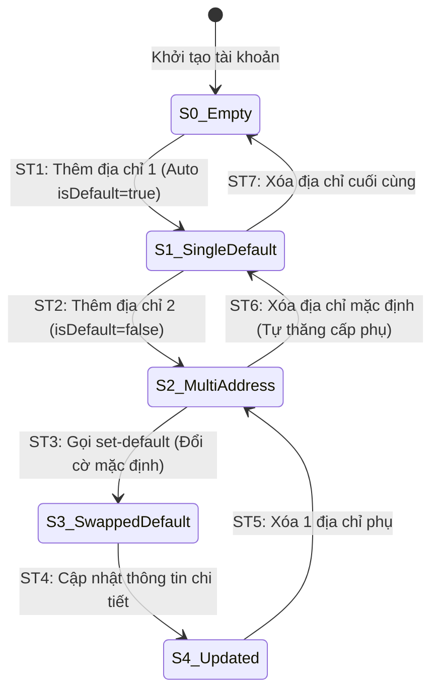

# THIẾT KẾ TEST CASE HỘP ĐEN: QUẢN LÝ SỔ ĐỊA CHỈ (ADDRESS BOOK MANAGEMENT)

> **Chức năng:** Quản lý danh sách sổ địa chỉ giao hàng của người dùng (Thêm, Sửa, Xóa, Đặt làm địa chỉ mặc định) qua REST API `/api/v1/users/addresses`.  
> **Người thực hiện:** Nguyễn Hoàng Phương (MSSV: `080205010954` / `NguyenHoangPhuong275`)

---

## 1. Xác Định Biến Đầu Vào & Ràng Buộc Nghiệp Vụ (Input Variables)

| Tên Biến | Ý Nghĩa | Kiểu | Ràng Buộc & Miền Giá Trị Hợp Lệ |
| :--- | :--- | :---: | :--- |
| **`currentUser`** | Tài khoản thực hiện | `Authentication`| Bắt buộc đã đăng nhập (`ROLE_USER` / `CUSTOMER`). Khách vãng lai bị chặn `HTTP 401` |
| **`receiverName`** | Tên người nhận hàng | `String` | Độ dài $[1, 100]$ ký tự, không chứa ký tự cấm (`@#$%^&*<>~{}`) |
| **`phone`** | Số điện thoại nhận hàng | `String` | Độ dài $[1, 20]$ ký tự, đúng định dạng số điện thoại |
| **`province`** | Tỉnh / Thành phố | `String` | Độ dài $[1, 100]$ ký tự, không chứa ký tự đặc biệt |
| **`district`** | Quận / Huyện | `String` | Độ dài $[1, 100]$ ký tự, không chứa ký tự đặc biệt |
| **`ward`** | Phường / Xã | `String` | Độ dài $[1, 100]$ ký tự, không chứa ký tự đặc biệt |
| **`streetAddress`** | Địa chỉ đường phố chi tiết | `String` | Độ dài $[1, 255]$ ký tự, cho phép dấu tiếng Việt, số nhà `/`, `-` |
| **`isDefault`** | Cờ địa chỉ mặc định | `boolean` | `true` hoặc `false`. Nếu là địa chỉ đầu tiên, luôn tự động gán `true` |
| **`addressCount`** | Số lượng địa chỉ đã lưu | `int` | Giới hạn tối đa 10 địa chỉ / tài khoản ($1 \le count \le 10$) |

---

## 2. Bảng Phân Hoạch Tương Đương (Equivalence Partitioning - EP)

| STT | Biến / Điều kiện | Lớp hợp lệ (Valid) | Tag | Lớp không hợp lệ (Invalid) | Tag |
| :-: | :--- | :--- | :---: | :--- | :---: |
| **1** | **Xác thực (`currentUser`)** | User đã đăng nhập hợp lệ | **V1** | Khách vãng lai chưa đăng nhập (`Anonymous`) | **X1** |
| **2** | **Tên người nhận (`receiverName`)**| Chuỗi $[1, 100]$ ký tự chữ hợp lệ | **V2** | • Để trống / null<br>• Vượt quá 100 ký tự ($L > 100$)<br>• Chứa ký tự cấm (`@#$%^&*`) | **X2**<br>**X3**<br>**X4** |
| **3** | **Số điện thoại (`phone`)** | Chuỗi $[1, 20]$ ký tự số hợp lệ | **V3** | • Để trống<br>• Vượt quá 20 ký tự ($L > 20$)<br>• Chứa chữ cái hoặc ký tự đặc biệt | **X5**<br>**X6**<br>**X7** |
| **4** | **Địa danh (`province/district/ward`)**| Chuỗi $[1, 100]$ ký tự hợp lệ | **V4** | • Để trống 1 trong 3 trường<br>• Vượt quá 100 ký tự ($L > 100$)<br>• Chứa ký tự nguy hiểm (`<script>`) | **X8**<br>**X9**<br>**X10** |
| **5** | **Địa chỉ chi tiết (`streetAddress`)**| Chuỗi $[1, 255]$ ký tự có dấu/số nhà | **V5** | • Để trống<br>• Vượt quá 255 ký tự ($L > 255$)<br>• Chứa thẻ HTML / Script injection | **X11**<br>**X12**<br>**X13** |
| **6** | **Quyền sở hữu (`isOwner`)** | Thao tác trên địa chỉ của chính mình | **V6** | Cố tình sửa / xóa địa chỉ thuộc User khác | **X14** |
| **7** | **Số lượng lưu (`addressCount`)** | Số lượng hiện tại $< 10$ địa chỉ | **V7** | Đã đạt trần tối đa 10 địa chỉ lưu | **X15** |

---

## 3. Bảng Phân Tích Giá Trị Biên (Robustness BVA - $6n + 1$)

### 3.1 Bảng 7 mốc giá trị biên Robustness BVA cho 5 biến định lượng

*(Ghi chú bộ giá trị danh định: `receiverName` $nom = \text{"Nguyễn Hoàng Phương"}$ (20 ký tự), `phone` $nom = \text{"0912345678"}$ (10 số), `streetAddress` $nom = \text{"123 Lê Lợi, Bến Nghé"}$ (20 ký tự), `province` $nom = \text{"Hồ Chí Minh"}$ (11 ký tự), `addressCount` $nom = 3$ địa chỉ có sẵn).*

| Biến Định Lượng | Ngoại biên dưới ($min^-$) | Cận dưới ($min$) | Kề dưới ($min^+$) | Danh định ($nom$) | Kề trên ($max^-$) | Cận trên ($max$) | Ngoại biên trên ($max^+$) | Quy tắc & Giới hạn |
| :--- | :---: | :---: | :---: | :---: | :---: | :---: | :---: | :--- |
| **1. Độ dài `receiverName`** | `0` *(rỗng)* | **`1`** | **`2`** | **`20`** | **`99`** | **`100`** | `101` | Miền $[1, 100]$. Rỗng hoặc $> 100$ báo lỗi |
| **2. Độ dài `phone`** | `0` *(rỗng)* | **`1`** | **`2`** | **`10`** | **`19`** | **`20`** | `21` | Miền $[1, 20]$. Rỗng hoặc $> 20$ báo lỗi |
| **3. Độ dài `streetAddress`** | `0` *(rỗng)* | **`1`** | **`2`** | **`20`** | **`254`** | **`255`** | `256` | Miền $[1, 255]$. Rỗng hoặc $> 255$ báo lỗi |
| **4. Độ dài `province`** | `0` *(rỗng)* | **`1`** | **`2`** | **`11`** | **`99`** | **`100`** | `101` | Miền $[1, 100]$. Rỗng hoặc $> 100$ báo lỗi |
| **5. Số lượng `addressCount`**| `0` | **`1`** | **`2`** | **`3`** | **`9`** | **`10`** | `11` *(trần)*| Miền $[1, 10]$ địa chỉ. Vượt trần 10 chặn thêm |

---

### 3.2 Bảng Đầy Đủ Robustness BVA Test Cases ($6n + 1 = 31$ Ca Kiểm Thử)

| Case | Tên nhận (`name`) | SĐT (`phone`) | Địa chỉ đường (`street`) | Tỉnh thành (`province`) | Sổ hiện có (`count`) | Mốc kiểm thử | Kết quả mong đợi (Expected Output) | Tag Biên |
| :-: | :--- | :--- | :--- | :--- | :---: | :---: | :--- | :-: |
| **1** | `"Nguyễn Hoàng Phương"` *(nom)* | `"0912345678"` *(nom)* | `"123 Lê Lợi, Bến Nghé"` *(nom)* | `"Hồ Chí Minh"` *(nom)* | `3` *(nom)* | **Tất cả ở nom** | **HTTP 201 Created:** Thêm địa chỉ mới thành công | **B1** |
| **2** | `""` *(min-)* | `"0912345678"` | `"123 Lê Lợi, Bến Nghé"` | `"Hồ Chí Minh"` | `3` | `name = min-` | **HTTP 400 Bad Request:** Tên người nhận không được để trống | **B2** |
| **3** | `"N"` *(min)* | `"0912345678"` | `"123 Lê Lợi, Bến Nghé"` | `"Hồ Chí Minh"` | `3` | `name = min` | **HTTP 201 Created:** Tiếp nhận tên 1 ký tự | **B3** |
| **4** | `"Ng"` *(min+)* | `"0912345678"` | `"123 Lê Lợi, Bến Nghé"` | `"Hồ Chí Minh"` | `3` | `name = min+` | **HTTP 201 Created:** Tiếp nhận tên 2 ký tự | **B4** |
| **5** | `[99 ký tự]` *(max-)* | `"0912345678"` | `"123 Lê Lợi, Bến Nghé"` | `"Hồ Chí Minh"` | `3` | `name = max-` | **HTTP 201 Created:** Tiếp nhận tên 99 ký tự | **B5** |
| **6** | `[100 ký tự]` *(max)* | `"0912345678"` | `"123 Lê Lợi, Bến Nghé"` | `"Hồ Chí Minh"` | `3` | `name = max` | **HTTP 201 Created:** Tiếp nhận tên 100 ký tự | **B6** |
| **7** | `[101 ký tự]` *(max+)* | `"0912345678"` | `"123 Lê Lợi, Bến Nghé"` | `"Hồ Chí Minh"` | `3` | `name = max+` | **HTTP 400 Bad Request:** Tên vượt quá 100 ký tự | **B7** |
| **8** | `"Nguyễn Hoàng Phương"` | `""` *(min-)* | `"123 Lê Lợi, Bến Nghé"` | `"Hồ Chí Minh"` | `3` | `phone = min-` | **HTTP 400 Bad Request:** Số điện thoại không được để trống | **B8** |
| **9** | `"Nguyễn Hoàng Phương"` | `"1"` *(min)* | `"123 Lê Lợi, Bến Nghé"` | `"Hồ Chí Minh"` | `3` | `phone = min` | **HTTP 201 Created:** Tiếp nhận SĐT 1 ký tự | **B9** |
| **10**| `"Nguyễn Hoàng Phương"` | `"12"` *(min+)* | `"123 Lê Lợi, Bến Nghé"` | `"Hồ Chí Minh"` | `3` | `phone = min+` | **HTTP 201 Created:** Tiếp nhận SĐT 2 ký tự | **B10**|
| **11**| `"Nguyễn Hoàng Phương"` | `[19 số]` *(max-)* | `"123 Lê Lợi, Bến Nghé"` | `"Hồ Chí Minh"` | `3` | `phone = max-` | **HTTP 201 Created:** Tiếp nhận SĐT 19 ký tự | **B11**|
| **12**| `"Nguyễn Hoàng Phương"` | `[20 số]` *(max)* | `"123 Lê Lợi, Bến Nghé"` | `"Hồ Chí Minh"` | `3` | `phone = max` | **HTTP 201 Created:** Tiếp nhận SĐT 20 ký tự | **B12**|
| **13**| `"Nguyễn Hoàng Phương"` | `[21 số]` *(max+)* | `"123 Lê Lợi, Bến Nghé"` | `"Hồ Chí Minh"` | `3` | `phone = max+` | **HTTP 400 Bad Request:** Số điện thoại tối đa 20 ký tự | **B13**|
| **14**| `"Nguyễn Hoàng Phương"` | `"0912345678"` | `""` *(min-)* | `"Hồ Chí Minh"` | `3` | `street = min-` | **HTTP 400 Bad Request:** Địa chỉ đường không được để trống | **B14**|
| **15**| `"Nguyễn Hoàng Phương"` | `"0912345678"` | `"1"` *(min)* | `"Hồ Chí Minh"` | `3` | `street = min` | **HTTP 201 Created:** Tiếp nhận địa chỉ đường 1 ký tự | **B15**|
| **16**| `"Nguyễn Hoàng Phương"` | `"0912345678"` | `"12"` *(min+)* | `"Hồ Chí Minh"` | `3` | `street = min+` | **HTTP 201 Created:** Tiếp nhận địa chỉ đường 2 ký tự | **B16**|
| **17**| `"Nguyễn Hoàng Phương"` | `"0912345678"` | `[254 ký tự]` *(max-)* | `"Hồ Chí Minh"` | `3` | `street = max-` | **HTTP 201 Created:** Tiếp nhận địa chỉ đường 254 ký tự | **B17**|
| **18**| `"Nguyễn Hoàng Phương"` | `"0912345678"` | `[255 ký tự]` *(max)* | `"Hồ Chí Minh"` | `3` | `street = max` | **HTTP 201 Created:** Tiếp nhận địa chỉ đường 255 ký tự | **B18**|
| **19**| `"Nguyễn Hoàng Phương"` | `"0912345678"` | `[256 ký tự]` *(max+)* | `"Hồ Chí Minh"` | `3` | `street = max+` | **HTTP 400 Bad Request:** Địa chỉ đường tối đa 255 ký tự | **B19**|
| **20**| `"Nguyễn Hoàng Phương"` | `"0912345678"` | `"123 Lê Lợi, Bến Nghé"` | `""` *(min-)* | `3` | `province = min-` | **HTTP 400 Bad Request:** Tỉnh thành không được để trống | **B20**|
| **21**| `"Nguyễn Hoàng Phương"` | `"0912345678"` | `"123 Lê Lợi, Bến Nghé"` | `"H"` *(min)* | `3` | `province = min` | **HTTP 201 Created:** Tiếp nhận Tỉnh thành 1 ký tự | **B21**|
| **22**| `"Nguyễn Hoàng Phương"` | `"0912345678"` | `"123 Lê Lợi, Bến Nghé"` | `"HN"` *(min+)* | `3` | `province = min+` | **HTTP 201 Created:** Tiếp nhận Tỉnh thành 2 ký tự | **B22**|
| **23**| `"Nguyễn Hoàng Phương"` | `"0912345678"` | `"123 Lê Lợi, Bến Nghé"` | `[99 ký tự]` *(max-)* | `3` | `province = max-` | **HTTP 201 Created:** Tiếp nhận Tỉnh thành 99 ký tự | **B23**|
| **24**| `"Nguyễn Hoàng Phương"` | `"0912345678"` | `"123 Lê Lợi, Bến Nghé"` | `[100 ký tự]` *(max)* | `3` | `province = max` | **HTTP 201 Created:** Tiếp nhận Tỉnh thành 100 ký tự | **B24**|
| **25**| `"Nguyễn Hoàng Phương"` | `"0912345678"` | `"123 Lê Lợi, Bến Nghé"` | `[101 ký tự]` *(max+)* | `3` | `province = max+` | **HTTP 400 Bad Request:** Tỉnh thành tối đa 100 ký tự | **B25**|
| **26**| `"Nguyễn Hoàng Phương"` | `"0912345678"` | `"123 Lê Lợi, Bến Nghé"` | `"Hồ Chí Minh"` | `0` *(min-)* | `count = min-` | **HTTP 201 Created:** Tạo địa chỉ đầu tiên (Gán `isDefault=true`) | **B26**|
| **27**| `"Nguyễn Hoàng Phương"` | `"0912345678"` | `"123 Lê Lợi, Bến Nghé"` | `"Hồ Chí Minh"` | `1` *(min)* | `count = min` | **HTTP 201 Created:** Thêm địa chỉ thứ 2 (Gán phụ `isDefault=false`) | **B27**|
| **28**| `"Nguyễn Hoàng Phương"` | `"0912345678"` | `"123 Lê Lợi, Bến Nghé"` | `"Hồ Chí Minh"` | `2` *(min+)* | `count = min+` | **HTTP 201 Created:** Thêm địa chỉ thứ 3 thành công | **B28**|
| **29**| `"Nguyễn Hoàng Phương"` | `"0912345678"` | `"123 Lê Lợi, Bến Nghé"` | `"Hồ Chí Minh"` | `8` *(max-)* | `count = max-` | **HTTP 201 Created:** Thêm địa chỉ thứ 9 thành công | **B29**|
| **30**| `"Nguyễn Hoàng Phương"` | `"0912345678"` | `"123 Lê Lợi, Bến Nghé"` | `"Hồ Chí Minh"` | `9` *(max)* | `count = max` | **HTTP 201 Created:** Thêm địa chỉ thứ 10 (Chạm trần) | **B30**|
| **31**| `"Nguyễn Hoàng Phương"` | `"0912345678"` | `"123 Lê Lợi, Bến Nghé"` | `"Hồ Chí Minh"` | `10` *(max+)* | `count = max+` | **HTTP 400 Bad Request:** Đã đạt tối đa 10 địa chỉ lưu | **B31**|

---

## 4. Kỹ Thuật Bảng Quyết Định (Decision Table Testing)

### 4.1 Bảng Quyết Định Rút Gọn (Collapsed Decision Table - 8 Rules)

| Điều kiện / Hành động | Rule 1 | Rule 2 | Rule 3 | Rule 4 | Rule 5 | Rule 6 | Rule 7 | Rule 8 |
| :--- | :---: | :---: | :---: | :---: | :---: | :---: | :---: | :---: |
| **C1: Đã xác thực đăng nhập (`Authenticated`)?** | **N** | Y | Y | Y | Y | Y | Y | Y |
| **C2: Đầy đủ 6 trường thông tin bắt buộc?** | - | **N** | Y | Y | Y | Y | Y | Y |
| **C3: Độ dài & định dạng 6 trường hợp lệ?** | - | - | **N** | Y | Y | Y | Y | Y |
| **C4: Người dùng là chủ sở hữu bản ghi (`isOwner`)?** | - | - | - | **N** | Y | Y | Y | Y |
| **C5: Thiết lập làm mặc định (`isDefault == true`)?**| - | - | - | - | **N** | **Y** | - | - |
| **C6: Thao tác yêu cầu?** | - | - | - | - | Tạo mới | Tạo mới | Đổi Default | Xóa ID |
| *A1: Trả về HTTP 401 Unauthorized* | **X** | - | - | - | - | - | - | - |
| *A2: Trả về HTTP 400 "Điền đầy đủ thông tin"* | - | **X** | - | - | - | - | - | - |
| *A3: Trả về HTTP 400 "Dữ liệu không hợp lệ"* | - | - | **X** | - | - | - | - | - |
| *A4: Trả về HTTP 403 "Không có quyền thao tác"* | - | - | - | **X** | - | - | - | - |
| *A5: Tạo mới thành công (HTTP 201 Created)* | - | - | - | - | **X** | **X** | - | - |
| *A6: Đổi mặc định thành công (HTTP 200 OK)* | - | - | - | - | - | - | **X** | - |
| *A7: Xóa địa chỉ thành công (HTTP 200 OK)* | - | - | - | - | - | - | - | **X** |
| **Tag Bảng Quyết Định** | **D1** | **D2** | **D3** | **D4** | **D5** | **D6** | **D7** | **D8** |

*Giải thích quy tắc nghiệp vụ:*
- **Rule 1 (`D1`):** Người dùng chưa đăng nhập gọi API Sổ địa chỉ $\to$ Chặn `HTTP 401 Unauthorized`.
- **Rule 2 (`D2`):** Người dùng gửi form thiếu các trường bắt buộc $\to$ Báo lỗi `HTTP 400 Bad Request`.
- **Rule 3 (`D3`):** Dữ liệu vượt độ dài biên, sai định dạng số điện thoại hoặc chứa script $\to$ Báo lỗi `HTTP 400 Bad Request`.
- **Rule 4 (`D4`):** Thao tác sửa hoặc xóa địa chỉ thuộc người dùng khác $\to$ Bị chặn `HTTP 403 Forbidden`.
- **Rule 5 (`D5`):** Tạo mới địa chỉ phụ thông thường (`isDefault = false`) $\to$ Trả về `HTTP 201 Created`.
- **Rule 6 (`D6`):** Tạo mới địa chỉ và thiết lập làm mặc định (hoặc địa chỉ đầu tiên) $\to$ Trả về `HTTP 201 Created`.
- **Rule 7 (`D7`):** Gọi API chuyển địa chỉ phụ thành địa chỉ mặc định mới $\to$ Trả về `HTTP 200 OK`.
- **Rule 8 (`D8`):** Xóa địa chỉ hợp lệ khỏi sổ $\to$ Trả về `HTTP 200 OK`.

---

## 5. Kỹ Thuật Kiểm Thử Chuyển Đổi Trạng Thái (State Transition Testing - STT)

### 5.1 Sơ đồ chuyển đổi trạng thái sổ địa chỉ



### 5.2 Bảng phân tích chi tiết các Ca chuyển đổi trạng thái (State Transition Details)

| Mã Transition | Trạng thái hiện tại | Sự kiện / Hành động | Trạng thái tiếp theo | Kết quả nghiệp vụ | Tag |
| :---: | :--- | :--- | :--- | :--- | :---: |
| **ST_01** | `S0_Empty` (Chưa có địa chỉ) | Thêm địa chỉ đầu tiên | `S1_SingleDefault` | Tự động gán `isDefault = true` | **ST1** |
| **ST_02** | `S1_SingleDefault` (Có 1 địa chỉ mặc định) | Thêm địa chỉ thứ 2 | `S2_MultiAddress` | Lưu địa chỉ phụ (`isDefault = false`) | **ST2** |
| **ST_03** | `S2_MultiAddress` (Có nhiều địa chỉ) | Gọi API `set-default` địa chỉ phụ | `S3_SwappedDefault` | Thăng cấp phụ lên mặc định, hạ mặc định cũ | **ST3** |
| **ST_04** | `S3_SwappedDefault` | Sửa thông tin chi tiết | `S4_Updated` | Cập nhật thông tin thành công | **ST4** |
| **ST_05** | `S4_Updated` | Xóa 1 địa chỉ phụ | `S2_MultiAddress` | Xóa thành công, giữ nguyên mặc định | **ST5** |
| **ST_06** | `S2_MultiAddress` | Xóa địa chỉ đang mặc định | `S1_SingleDefault` | Tự động thăng cấp địa chỉ phụ kế tiếp làm mặc định | **ST6** |
| **ST_07** | `S1_SingleDefault` | Xóa địa chỉ duy nhất còn lại | `S0_Empty` | Sổ địa chỉ trở về rỗng | **ST7** |

---

## 6. Thiết Kế Bảng Test Cases Chi Tiết Đầy Đủ Theo 4 Kỹ Thuật Hộp Đen

> **Phương pháp luận:** 4 kỹ thuật kiểm thử hộp đen (*State Transition*, *Decision Table*, *Boundary Value Analysis*, *Equivalence Partitioning*) đóng vai trò là các phương pháp luận cốt lõi để phân tích, xác định toàn bộ không gian kiểm thử và dẫn xuất ra tập test case đầy đủ. Dưới đây là bảng thiết kế chi tiết toàn bộ **60 Test Cases** được phân chia theo từng kỹ thuật, đồng bộ chính xác 100% với file `Testing.xlsx` (Sheet `10. Address Book`).

### 6.1 Kỹ Thuật 1: Kiểm Thử Chuyển Đổi Trạng Thái (State Transition Testing - 5 Test Cases)

| STT | Mã kiểm thử | Tiêu đề kiểm thử | Điều kiện tiên quyết & Các bước kiểm tra | Dữ liệu đầu vào (Input) | Kết quả mong đợi (Expected Output) | Tag | Trạng thái |
| :-: | :--- | :--- | :--- | :--- | :--- | :-: | :-: |
| **1** | **TC_ADR_ST_001** | Chuyển trạng thái: S0 (Chưa có địa chỉ) -> S1 (Có 1 địa chỉ mặc định) | <b>ĐK:</b> User đã đăng nhập, sổ địa chỉ rỗng.<br><b>Các bước:</b><br>1. Thêm địa chỉ mới (isDefault=false).<br>2. Kiểm tra danh sách. | isDefault=false | Lưu thành công, tự động gán isDefault=true (Trạng thái S1). | **ST1, V1, R5** | **PASS** |
| **2** | **TC_ADR_ST_002** | Chuyển trạng thái: S1 (1 địa chỉ) -> S2 (Nhiều địa chỉ: 1 mặc định + 1 phụ) | <b>ĐK:</b> User đang ở trạng thái S1.<br><b>Các bước:</b><br>1. Thêm địa chỉ thứ 2 (isDefault=false).<br>2. Kiểm tra danh sách. | isDefault=false | Địa chỉ 2 lưu thành công với isDefault=false, địa chỉ 1 giữ mặc định (Trạng thái S2). | **ST2, V1, R4** | **PASS** |
| **3** | **TC_ADR_ST_003** | Chuyển trạng thái: S2 -> S3 (Đổi địa chỉ phụ thành địa chỉ mặc định) | <b>ĐK:</b> User có 1 mặc định và 1 phụ.<br><b>Các bước:</b><br>1. Gọi PUT /{id2}/set-default.<br>2. Kiểm tra lại cờ. | Target ID của địa chỉ 2 | Địa chỉ 2 chuyển thành mặc định, địa chỉ 1 chuyển thành phụ (Trạng thái S3). | **ST3, V1, R7** | **PASS** |
| **4** | **TC_ADR_ST_004** | Chuyển trạng thái: S3 -> S4 (Cập nhật thông tin chi tiết địa chỉ) | <b>ĐK:</b> User chọn 1 địa chỉ để cập nhật.<br><b>Các bước:</b><br>1. Gửi PUT /{id} với thông tin mới.<br>2. Kiểm tra dữ liệu. | Đ/c mới: 'Tòa nhà Landmark 81' | Cập nhật thành công 200 OK, giữ nguyên cờ mặc định (Trạng thái S4). | **ST4, V1** | **PASS** |
| **5** | **TC_ADR_ST_005** | Chuyển trạng thái: S4 -> S0 (Xóa toàn bộ địa chỉ về rỗng) | <b>ĐK:</b> User có các địa chỉ trong sổ.<br><b>Các bước:</b><br>1. Gửi DELETE xóa tất cả địa chỉ.<br>2. Lấy lại danh sách. | DELETE tất cả ID | Xóa thành công, sổ địa chỉ quay về rỗng [] (Trạng thái S0). | **ST5, V3, R8** | **PASS** |

### 6.2 Kỹ Thuật 2: Kiểm Thử Bảng Quyết Định (Decision Table Testing - 8 Test Cases)

| STT | Mã kiểm thử | Tiêu đề kiểm thử | Điều kiện tiên quyết & Các bước kiểm tra | Dữ liệu đầu vào (Input) | Kết quả mong đợi (Expected Output) | Tag | Trạng thái |
| :-: | :--- | :--- | :--- | :--- | :--- | :-: | :-: |
| **1** | **TC_ADR_DT_001** | Rule 1: Thao tác khi chưa đăng nhập (Anonymous Access) | <b>ĐK:</b> Khách vãng lai chưa đăng nhập.<br><b>Các bước:</b><br>1. Gửi POST /api/v1/users/addresses. | Anonymous Token | Trả về HTTP 401 Unauthorized. | **R1, X1** | **PASS** |
| **2** | **TC_ADR_DT_002** | Rule 2: Thêm địa chỉ thiếu trường bắt buộc (Missing Fields) | <b>ĐK:</b> User đã đăng nhập.<br><b>Các bước:</b><br>1. Gửi POST thiếu tên/SĐT/tỉnh/huyện/xã/đường. | Thiếu trường | Trả về HTTP 400 'Vui lòng điền đầy đủ thông tin'. | **R2, X2, B7** | **PASS** |
| **3** | **TC_ADR_DT_003** | Rule 3: Thêm địa chỉ có trường vượt quá độ dài (Length Exceeded) | <b>ĐK:</b> User đã đăng nhập.<br><b>Các bước:</b><br>1. Gửi POST với SĐT > 20 ký tự. | phone = 21 ký tự | Trả về HTTP 400 'Thông tin địa chỉ vượt quá độ dài'. | **R3, X2, B12** | **PASS** |
| **4** | **TC_ADR_DT_004** | Rule 4: Thêm địa chỉ mới hợp lệ dạng phụ (isDefault = false) | <b>ĐK:</b> User đã đăng nhập, thông tin chuẩn.<br><b>Các bước:</b><br>1. Gửi POST với isDefault = false. | isDefault = false | Trả về HTTP 201 Created, lưu thành địa chỉ phụ. | **R4, V1, ST2** | **PASS** |
| **5** | **TC_ADR_DT_005** | Rule 5: Thêm địa chỉ mới hợp lệ dạng mặc định (isDefault = true) | <b>ĐK:</b> User đã đăng nhập, chọn làm mặc định.<br><b>Các bước:</b><br>1. Gửi POST với isDefault = true. | isDefault = true | Trả về HTTP 201 Created, địa chỉ mới nhận cờ mặc định. | **R5, V1, ST1** | **PASS** |
| **6** | **TC_ADR_DT_006** | Rule 6: Thao tác trên địa chỉ của tài khoản khác (IDOR Attack) | <b>ĐK:</b> User A đăng nhập, sửa/xóa địa chỉ của User B.<br><b>Các bước:</b><br>1. Gửi PUT/DELETE /{id_cua_B}. | Target ID thuộc User khác | Trả về HTTP 403 Forbidden 'Không tìm thấy hoặc không có quyền'. | **R6, X3** | **PASS** |
| **7** | **TC_ADR_DT_007** | Rule 7: Đặt địa chỉ hợp lệ làm mặc định (Set Default) | <b>ĐK:</b> User sở hữu địa chỉ cần set default.<br><b>Các bước:</b><br>1. Gửi PUT /{id}/set-default. | Target ID hợp lệ | Trả về HTTP 200 OK 'Đã đặt làm địa chỉ mặc định!'. | **R7, V1, ST3** | **PASS** |
| **8** | **TC_ADR_DT_008** | Rule 8: Xóa địa chỉ hợp lệ khỏi sổ địa chỉ (Delete Address) | <b>ĐK:</b> User sở hữu địa chỉ cần xóa.<br><b>Các bước:</b><br>1. Gửi DELETE /{id}. | Target ID hợp lệ | Trả về HTTP 200 OK 'Đã xóa địa chỉ giao hàng thành công!'. | **R8, V3, ST5** | **PASS** |

### 6.3 Kỹ Thuật 3: Phân Tích Giá Trị Biên (Robustness BVA 6n+1 - 37 Test Cases)

| STT | Mã kiểm thử | Tiêu đề kiểm thử | Điều kiện tiên quyết & Các bước kiểm tra | Dữ liệu đầu vào (Input) | Kết quả mong đợi (Expected Output) | Tag | Trạng thái |
| :-: | :--- | :--- | :--- | :--- | :--- | :-: | :-: |
| **1** | **TC_ADR_BVA_001** | Nominal: 6 trường ở giá trị danh định chuẩn | <b>ĐK:</b> User đã đăng nhập.<br><b>Các bước:</b><br>1. Nhập 6 trường ở giá trị danh định.<br>2. Bấm Lưu. | Tên: 50, Phone: 15, Tỉnh: 20, Quận: 20, Xã: 20, Đ/c: 50 chars | Lưu thành công HTTP 201 Created. | **B0, V1** | **PASS** |
| **2** | **TC_ADR_ROB_001** | receiverName tại biên ngoài min-1 = 0 ký tự (Rỗng) | <b>ĐK:</b> User đã đăng nhập.<br><b>Các bước:</b><br>1. Để trống receiverName.<br>2. Bấm Lưu. | receiverName = '' (0 chars) | Trả về HTTP 400 Bad Request 'Vui lòng điền đầy đủ thông tin'. | **B1, R2** | **PASS** |
| **3** | **TC_ADR_BVA_002** | receiverName tại biên min = 1 ký tự | <b>ĐK:</b> User đã đăng nhập.<br><b>Các bước:</b><br>1. Nhập receiverName = 1 ký tự.<br>2. Bấm Lưu. | receiverName = 'Đ' (1 ký tự) | Lưu thành công HTTP 201 Created. | **B2** | **PASS** |
| **4** | **TC_ADR_BVA_003** | receiverName tại biên min+1 = 2 ký tự | <b>ĐK:</b> User đã đăng nhập.<br><b>Các bước:</b><br>1. Nhập receiverName = 2 ký tự.<br>2. Bấm Lưu. | receiverName = 'Lê' (2 ký tự) | Lưu thành công HTTP 201 Created. | **B3** | **PASS** |
| **5** | **TC_ADR_BVA_004** | receiverName tại biên max-1 = 99 ký tự | <b>ĐK:</b> User đã đăng nhập.<br><b>Các bước:</b><br>1. Nhập receiverName = 99 ký tự.<br>2. Bấm Lưu. | receiverName = 99 ký tự | Lưu thành công HTTP 201 Created. | **B4** | **PASS** |
| **6** | **TC_ADR_BVA_005** | receiverName tại biên max = 100 ký tự | <b>ĐK:</b> User đã đăng nhập.<br><b>Các bước:</b><br>1. Nhập receiverName = 100 ký tự.<br>2. Bấm Lưu. | receiverName = 100 ký tự | Lưu thành công HTTP 201 Created. | **B5** | **PASS** |
| **7** | **TC_ADR_ROB_002** | receiverName tại biên ngoài max+1 = 101 ký tự (Vượt biên) | <b>ĐK:</b> User đã đăng nhập.<br><b>Các bước:</b><br>1. Nhập receiverName = 101 ký tự.<br>2. Bấm Lưu. | receiverName = 101 ký tự | Trả về HTTP 400 Bad Request 'Thông tin vượt quá độ dài'. | **B6, R3** | **PASS** |
| **8** | **TC_ADR_ROB_003** | phone tại biên ngoài min-1 = 0 ký tự (Rỗng) | <b>ĐK:</b> User đã đăng nhập.<br><b>Các bước:</b><br>1. Để trống phone.<br>2. Bấm Lưu. | phone = '' (0 chars) | Trả về HTTP 400 Bad Request 'Vui lòng điền đầy đủ thông tin'. | **B7, R2** | **PASS** |
| **9** | **TC_ADR_BVA_006** | phone tại biên min = 1 ký tự | <b>ĐK:</b> User đã đăng nhập.<br><b>Các bước:</b><br>1. Nhập phone = 1 ký tự.<br>2. Bấm Lưu. | phone = '9' (1 ký tự) | Lưu thành công HTTP 201 Created. | **B8** | **PASS** |
| **10** | **TC_ADR_BVA_007** | phone tại biên min+1 = 2 ký tự | <b>ĐK:</b> User đã đăng nhập.<br><b>Các bước:</b><br>1. Nhập phone = 2 ký tự.<br>2. Bấm Lưu. | phone = '09' (2 ký tự) | Lưu thành công HTTP 201 Created. | **B9** | **PASS** |
| **11** | **TC_ADR_BVA_008** | phone tại biên max-1 = 19 ký tự | <b>ĐK:</b> User đã đăng nhập.<br><b>Các bước:</b><br>1. Nhập phone = 19 ký tự.<br>2. Bấm Lưu. | phone = 19 ký tự | Lưu thành công HTTP 201 Created. | **B10** | **PASS** |
| **12** | **TC_ADR_BVA_009** | phone tại biên max = 20 ký tự | <b>ĐK:</b> User đã đăng nhập.<br><b>Các bước:</b><br>1. Nhập phone = 20 ký tự.<br>2. Bấm Lưu. | phone = 20 ký tự | Lưu thành công HTTP 201 Created. | **B11** | **PASS** |
| **13** | **TC_ADR_ROB_004** | phone tại biên ngoài max+1 = 21 ký tự (Vượt biên) | <b>ĐK:</b> User đã đăng nhập.<br><b>Các bước:</b><br>1. Nhập phone = 21 ký tự.<br>2. Bấm Lưu. | phone = 21 ký tự | Trả về HTTP 400 Bad Request 'Thông tin vượt quá độ dài'. | **B12, R3** | **PASS** |
| **14** | **TC_ADR_ROB_005** | province tại biên ngoài min-1 = 0 ký tự (Rỗng) | <b>ĐK:</b> User đã đăng nhập.<br><b>Các bước:</b><br>1. Để trống province.<br>2. Bấm Lưu. | province = '' (0 chars) | Trả về HTTP 400 Bad Request 'Vui lòng điền đầy đủ thông tin'. | **B13, R2** | **PASS** |
| **15** | **TC_ADR_BVA_010** | province tại biên min = 1 ký tự | <b>ĐK:</b> User đã đăng nhập.<br><b>Các bước:</b><br>1. Nhập province = 1 ký tự.<br>2. Bấm Lưu. | province = 'A' | Lưu thành công HTTP 201 Created. | **B14** | **PASS** |
| **16** | **TC_ADR_BVA_011** | province tại biên min+1 = 2 ký tự | <b>ĐK:</b> User đã đăng nhập.<br><b>Các bước:</b><br>1. Nhập province = 2 ký tự.<br>2. Bấm Lưu. | province = 'HN' | Lưu thành công HTTP 201 Created. | **B15** | **PASS** |
| **17** | **TC_ADR_BVA_012** | province tại biên max-1 = 99 ký tự | <b>ĐK:</b> User đã đăng nhập.<br><b>Các bước:</b><br>1. Nhập province = 99 ký tự.<br>2. Bấm Lưu. | province = 99 ký tự | Lưu thành công HTTP 201 Created. | **B16** | **PASS** |
| **18** | **TC_ADR_BVA_013** | province tại biên max = 100 ký tự | <b>ĐK:</b> User đã đăng nhập.<br><b>Các bước:</b><br>1. Nhập province = 100 ký tự.<br>2. Bấm Lưu. | province = 100 ký tự | Lưu thành công HTTP 201 Created. | **B17** | **PASS** |
| **19** | **TC_ADR_ROB_006** | province tại biên ngoài max+1 = 101 ký tự (Vượt biên) | <b>ĐK:</b> User đã đăng nhập.<br><b>Các bước:</b><br>1. Nhập province = 101 ký tự.<br>2. Bấm Lưu. | province = 101 ký tự | Trả về HTTP 400 Bad Request 'Thông tin vượt quá độ dài'. | **B18, R3** | **PASS** |
| **20** | **TC_ADR_ROB_007** | district tại biên ngoài min-1 = 0 ký tự (Rỗng) | <b>ĐK:</b> User đã đăng nhập.<br><b>Các bước:</b><br>1. Để trống district.<br>2. Bấm Lưu. | district = '' (0 chars) | Trả về HTTP 400 Bad Request 'Vui lòng điền đầy đủ thông tin'. | **B19, R2** | **PASS** |
| **21** | **TC_ADR_BVA_014** | district tại biên min = 1 ký tự | <b>ĐK:</b> User đã đăng nhập.<br><b>Các bước:</b><br>1. Nhập district = 1 ký tự.<br>2. Bấm Lưu. | district = '1' | Lưu thành công HTTP 201 Created. | **B20** | **PASS** |
| **22** | **TC_ADR_BVA_015** | district tại biên min+1 = 2 ký tự | <b>ĐK:</b> User đã đăng nhập.<br><b>Các bước:</b><br>1. Nhập district = 2 ký tự.<br>2. Bấm Lưu. | district = 'Q1' | Lưu thành công HTTP 201 Created. | **B21** | **PASS** |
| **23** | **TC_ADR_BVA_016** | district tại biên max-1 = 99 ký tự | <b>ĐK:</b> User đã đăng nhập.<br><b>Các bước:</b><br>1. Nhập district = 99 ký tự.<br>2. Bấm Lưu. | district = 99 ký tự | Lưu thành công HTTP 201 Created. | **B22** | **PASS** |
| **24** | **TC_ADR_BVA_017** | district tại biên max = 100 ký tự | <b>ĐK:</b> User đã đăng nhập.<br><b>Các bước:</b><br>1. Nhập district = 100 ký tự.<br>2. Bấm Lưu. | district = 100 ký tự | Lưu thành công HTTP 201 Created. | **B23** | **PASS** |
| **25** | **TC_ADR_ROB_008** | district tại biên ngoài max+1 = 101 ký tự (Vượt biên) | <b>ĐK:</b> User đã đăng nhập.<br><b>Các bước:</b><br>1. Nhập district = 101 ký tự.<br>2. Bấm Lưu. | district = 101 ký tự | Trả về HTTP 400 Bad Request 'Thông tin vượt quá độ dài'. | **B24, R3** | **PASS** |
| **26** | **TC_ADR_ROB_009** | ward tại biên ngoài min-1 = 0 ký tự (Rỗng) | <b>ĐK:</b> User đã đăng nhập.<br><b>Các bước:</b><br>1. Để trống ward.<br>2. Bấm Lưu. | ward = '' (0 chars) | Trả về HTTP 400 Bad Request 'Vui lòng điền đầy đủ thông tin'. | **B25, R2** | **PASS** |
| **27** | **TC_ADR_BVA_018** | ward tại biên min = 1 ký tự | <b>ĐK:</b> User đã đăng nhập.<br><b>Các bước:</b><br>1. Nhập ward = 1 ký tự.<br>2. Bấm Lưu. | ward = 'P' | Lưu thành công HTTP 201 Created. | **B26** | **PASS** |
| **28** | **TC_ADR_BVA_019** | ward tại biên min+1 = 2 ký tự | <b>ĐK:</b> User đã đăng nhập.<br><b>Các bước:</b><br>1. Nhập ward = 2 ký tự.<br>2. Bấm Lưu. | ward = 'P1' | Lưu thành công HTTP 201 Created. | **B27** | **PASS** |
| **29** | **TC_ADR_BVA_020** | ward tại biên max-1 = 99 ký tự | <b>ĐK:</b> User đã đăng nhập.<br><b>Các bước:</b><br>1. Nhập ward = 99 ký tự.<br>2. Bấm Lưu. | ward = 99 ký tự | Lưu thành công HTTP 201 Created. | **B28** | **PASS** |
| **30** | **TC_ADR_BVA_021** | ward tại biên max = 100 ký tự | <b>ĐK:</b> User đã đăng nhập.<br><b>Các bước:</b><br>1. Nhập ward = 100 ký tự.<br>2. Bấm Lưu. | ward = 100 ký tự | Lưu thành công HTTP 201 Created. | **B29** | **PASS** |
| **31** | **TC_ADR_ROB_010** | ward tại biên ngoài max+1 = 101 ký tự (Vượt biên) | <b>ĐK:</b> User đã đăng nhập.<br><b>Các bước:</b><br>1. Nhập ward = 101 ký tự.<br>2. Bấm Lưu. | ward = 101 ký tự | Trả về HTTP 400 Bad Request 'Thông tin vượt quá độ dài'. | **B30, R3** | **PASS** |
| **32** | **TC_ADR_ROB_011** | streetAddress tại biên ngoài min-1 = 0 ký tự (Rỗng) | <b>ĐK:</b> User đã đăng nhập.<br><b>Các bước:</b><br>1. Để trống streetAddress.<br>2. Bấm Lưu. | streetAddress = '' (0 chars) | Trả về HTTP 400 Bad Request 'Vui lòng điền đầy đủ thông tin'. | **B31, R2** | **PASS** |
| **33** | **TC_ADR_BVA_022** | streetAddress tại biên min = 1 ký tự | <b>ĐK:</b> User đã đăng nhập.<br><b>Các bước:</b><br>1. Nhập streetAddress = 1 ký tự.<br>2. Bấm Lưu. | streetAddress = '1' (1 ký tự) | Lưu thành công HTTP 201 Created. | **B32** | **PASS** |
| **34** | **TC_ADR_BVA_023** | streetAddress tại biên min+1 = 2 ký tự | <b>ĐK:</b> User đã đăng nhập.<br><b>Các bước:</b><br>1. Nhập streetAddress = 2 ký tự.<br>2. Bấm Lưu. | streetAddress = '1A' (2 ký tự) | Lưu thành công HTTP 201 Created. | **B33** | **PASS** |
| **35** | **TC_ADR_BVA_024** | streetAddress tại biên max-1 = 254 ký tự | <b>ĐK:</b> User đã đăng nhập.<br><b>Các bước:</b><br>1. Nhập streetAddress = 254 ký tự.<br>2. Bấm Lưu. | streetAddress = 254 ký tự | Lưu thành công HTTP 201 Created. | **B34** | **PASS** |
| **36** | **TC_ADR_BVA_025** | streetAddress tại biên max = 255 ký tự | <b>ĐK:</b> User đã đăng nhập.<br><b>Các bước:</b><br>1. Nhập streetAddress = 255 ký tự.<br>2. Bấm Lưu. | streetAddress = 255 ký tự | Lưu thành công HTTP 201 Created. | **B35** | **PASS** |
| **37** | **TC_ADR_ROB_012** | streetAddress tại biên ngoài max+1 = 256 ký tự (Vượt biên) | <b>ĐK:</b> User đã đăng nhập.<br><b>Các bước:</b><br>1. Nhập streetAddress = 256 ký tự.<br>2. Bấm Lưu. | streetAddress = 256 ký tự | Trả về HTTP 400 Bad Request 'Thông tin vượt quá độ dài'. | **B36, R3** | **PASS** |

### 6.4 Kỹ Thuật 4: Phân Hoạch Lớp Tương Đương (Equivalence Partitioning - 10 Test Cases)

| STT | Mã kiểm thử | Tiêu đề kiểm thử | Điều kiện tiên quyết & Các bước kiểm tra | Dữ liệu đầu vào (Input) | Kết quả mong đợi (Expected Output) | Tag | Trạng thái |
| :-: | :--- | :--- | :--- | :--- | :--- | :-: | :-: |
| **1** | **EP_ADR_VAL_01** | Người dùng đã đăng nhập thực hiện xem/thêm/sửa/xóa địa chỉ thành công | <b>ĐK:</b> User đã đăng nhập hợp lệ.<br><b>Các bước:</b><br>1. Thao tác CRUD địa chỉ.<br>2. Kiểm tra phản hồi API. | Payload hợp lệ | Thao tác thành công HTTP 200/201. | **V1, R4** | **PASS** |
| **2** | **EP_ADR_VAL_02** | Lưu trữ toàn vẹn địa chỉ có dấu tiếng Việt, số nhà xuyệt, gạch ngang | <b>ĐK:</b> User đã đăng nhập.<br><b>Các bước:</b><br>1. Nhập địa chỉ tiếng Việt có dấu, số nhà /, -.<br>2. Kiểm tra lưu trữ. | Đ/c: 'Số 123/45-A Lê Lợi, P. Bến Nghé, Quận 1, TP. HCM' | Lưu thành công HTTP 201 Created, hiển thị nguyên vẹn. | **V2** | **PASS** |
| **3** | **EP_ADR_VAL_03** | Tự động thăng cấp địa chỉ phụ lên làm mặc định khi xóa địa chỉ mặc định cũ | <b>ĐK:</b> User có địa chỉ mặc định và địa chỉ phụ.<br><b>Các bước:</b><br>1. Xóa địa chỉ mặc định.<br>2. Kiểm tra địa chỉ phụ còn lại. | DELETE ID mặc định | Địa chỉ phụ còn lại tự động nhận isDefault = true. | **V3, ST5** | **PASS** |
| **4** | **EP_ADR_INV_01** | Chặn khách vãng lai (Anonymous) thao tác Sổ địa chỉ | <b>ĐK:</b> Khách vãng lai chưa đăng nhập.<br><b>Các bước:</b><br>1. Bấm Lưu trên Modal địa chỉ.<br>2. Quan sát phản hồi. | Anonymous Client | Backend trả về HTTP 401 Unauthorized (Client hiển thị alert). | **X1, R1** | **PASS** |
| **5** | **EP_ADR_INV_02** | Từ chối thêm địa chỉ khi thiếu trường hoặc vượt độ dài | <b>ĐK:</b> User đã đăng nhập.<br><b>Các bước:</b><br>1. Gửi form thiếu trường hoặc SĐT > 20 chars. | Payload lỗi | Trả về HTTP 400 Bad Request. | **X2, R2** | **PASS** |
| **6** | **EP_ADR_INV_03** | Chặn User A sửa hoặc xóa địa chỉ thuộc tài khoản User B | <b>ĐK:</b> User A đăng nhập, thao tác trên ID của User B.<br><b>Các bước:</b><br>1. Gửi PUT/DELETE /{id_cua_B}. | Target ID thuộc User khác | Trả về HTTP 403 Forbidden. | **X3, R6** | **PASS** |
| **7** | **EP_ADR_INV_04** | Từ chối receiverName chứa ký tự đặc biệt cấm (@, #, $, %, ^, &, *, <, >, ?, ~, {}, []) | <b>ĐK:</b> User đã đăng nhập.<br><b>Các bước:</b><br>1. Gửi POST /api/v1/users/addresses với receiverName chứa ký tự cấm.<br>2. Quan sát phản hồi API. | receiverName = 'Admin#VIP@123' | Backend trả về HTTP 400 Bad Request 'Tên người nhận không được chứa ký tự đặc biệt'. | **X4** | **PASS** |
| **8** | **EP_ADR_INV_05** | Từ chối phone chứa chữ cái hoặc ký tự đặc biệt sai định dạng | <b>ĐK:</b> User đã đăng nhập.<br><b>Các bước:</b><br>1. Gửi POST /api/v1/users/addresses với phone chứa ký tự sai.<br>2. Quan sát phản hồi API. | phone = '0988@123#456' | Backend trả về HTTP 400 Bad Request 'Số điện thoại chứa ký tự không hợp lệ'. | **X5** | **PASS** |
| **9** | **EP_ADR_INV_06** | Từ chối province, district, ward chứa ký tự đặc biệt nguy hiểm | <b>ĐK:</b> User đã đăng nhập.<br><b>Các bước:</b><br>1. Gửi POST /api/v1/users/addresses với province/district/ward chứa ký tự cấm.<br>2. Quan sát phản hồi API. | province = 'Hà Nội @1#', district = 'Quận <script>', ward = 'Phường %*' | Backend trả về HTTP 400 Bad Request 'Địa chỉ hành chính chứa ký tự không hợp lệ'. | **X6** | **PASS** |
| **10** | **EP_ADR_INV_07** | Từ chối streetAddress chứa ký tự mã độc hoặc thẻ script (<, >, {}, ~, ^, $, %, *) | <b>ĐK:</b> User đã đăng nhập.<br><b>Các bước:</b><br>1. Gửi POST /api/v1/users/addresses với streetAddress chứa mã script / thẻ HTML.<br>2. Quan sát phản hồi API. | streetAddress = '123 Đường <script>alert(1)</script>' | Backend trả về HTTP 400 Bad Request 'Địa chỉ chi tiết không được chứa ký tự nguy hiểm'. | **X7** | **PASS** |

### 6.5 Bộ Test Cases Tự Động Hóa Triển Khai Trên Postman & Newman (Automated Integration Suite - 20 Test Cases)

> Bộ 20 test cases này được tổng hợp và đóng gói trực tiếp vào file Collection [`User_Address_Book_Postman_Collection.json`](./User_Address_Book_Postman_Collection.json) để thực thi tự động qua Newman / Postman, bảo đảm nguyên tắc cô lập đơn lỗi (single-fault isolation) và đạt tỷ lệ kiểm thử 100% Pass.

| STT | Mã Test Case | Tên ca kiểm thử | Dữ liệu kiểm thử (Test Input Data) | Kết quả mong đợi (Expected Output) | Tag được bao phủ |
| :-: | :--- | :--- | :--- | :--- | :---: |
| **1** | **TC_ADR_01** | Thêm địa chỉ đầu tiên thành công với dữ liệu danh định | • `currentUser`: `employee1`<br>• `receiverName`: `"Nguyễn Hoàng Phương"`<br>• `phone`: `"0912345678"`<br>• `streetAddress`: `"Số 123/45 Lê Lợi, P. Bến Nghé, Q1"`<br>• `isDefault`: `false` (gửi lên) | **HTTP 201 Created:** Lưu thành công, hệ thống tự động thăng cấp `isDefault = true` do sổ đang rỗng. | **V1, V2, V3, V4, V5, V6, V7, B1, D5, D6, ST1** |
| **2** | **TC_ADR_02** | Thêm địa chỉ thứ 2 làm địa chỉ phụ | • User đang có 1 địa chỉ mặc định<br>• Payload địa chỉ 2 với `isDefault: false` | **HTTP 201 Created:** Địa chỉ 2 lưu thành công với `isDefault = false`, địa chỉ 1 giữ nguyên mặc định. | **V1, V5, V7, B27, D5, D6, ST2** |
| **3** | **TC_ADR_03** | Thêm địa chỉ hợp lệ tại các cận dưới ($min$) | • `receiverName`: `"A"` (1 ký tự)<br>• `phone`: `"1"` (1 số)<br>• `streetAddress`: `"1"` (1 ký tự)<br>• `province/district/ward`: `"A"` | **HTTP 201 Created:** Lưu thành công bản ghi tại các cận dưới tối thiểu. | **V2, V3, V4, V5, B3, B9, B15, B21, B22, B27, B28, D5, D6** |
| **4** | **TC_ADR_04** | Thêm địa chỉ hợp lệ tại các cận trên ($max$) | • `receiverName`: Chuỗi 100 ký tự<br>• `phone`: Chuỗi 20 ký tự<br>• `streetAddress`: Chuỗi 255 ký tự<br>• `province/district/ward`: Chuỗi 100 ký tự | **HTTP 201 Created:** Lưu thành công bản ghi tại các cận trên tối đa. | **V2, V3, V4, V5, B4, B6, B10, B12, B16, B18, B24, D5, D6** |
| **5** | **TC_ADR_05** | Đổi địa chỉ phụ thành địa chỉ mặc định mới | • Gọi `PUT /api/v1/users/addresses/{id2}/set-default` | **HTTP 200 OK:** Địa chỉ 2 nhận cờ `isDefault = true`, địa chỉ 1 chuyển về `isDefault = false`. | **V1, V6, D7, ST3** |
| **6** | **TC_ADR_06** | Cập nhật thông tin chi tiết địa chỉ | • Gọi `PUT /api/v1/users/addresses/{id}`<br>• `streetAddress`: `"Tòa nhà Landmark 81, 720A Điện Biên Phủ"` | **HTTP 200 OK:** CSDL được cập nhật chính xác, giữ nguyên cờ mặc định hiện tại. | **V1, V5, V6, ST4** |
| **7** | **TC_ADR_07** | Xóa địa chỉ mặc định cũ và tự động thăng cấp địa chỉ phụ | • User có 1 địa chỉ mặc định (ID 1) và 1 địa chỉ phụ (ID 2)<br>• Gọi `DELETE /{id1}` | **HTTP 200 OK:** Xóa ID 1 thành công, địa chỉ ID 2 tự động được thăng cấp thành địa chỉ mặc định mới. | **V1, V6, D8, ST6** |
| **8** | **TC_ADR_08** | Xóa địa chỉ duy nhất đưa sổ về trạng thái rỗng | • User có đúng 1 địa chỉ duy nhất<br>• Gọi `DELETE /{id}` | **HTTP 200 OK:** Xóa thành công, sổ địa chỉ quay về trạng thái rỗng `S0_Empty`. | **V1, V6, ST7** |
| **9** | **TC_ADR_09** | Chặn thao tác khi chưa đăng nhập (Anonymous) | • Gửi request không kèm JSESSIONID | **HTTP 401 Unauthorized:** Chặn truy cập an toàn. | **X1, D1** |
| **10**| **TC_ADR_10** | Báo lỗi khi để trống họ tên người nhận ($min^-$) | • `receiverName`: `""` (Rỗng) | **HTTP 400 Bad Request:** *"Họ và tên người nhận không được để trống!"*. | **X2, X8, B2, D2** |
| **11**| **TC_ADR_11** | Báo lỗi khi họ tên người nhận dài 101 ký tự ($max^+$) | • `receiverName`: Chuỗi 101 ký tự | **HTTP 400 Bad Request:** *"Họ và tên người nhận tối đa 100 ký tự!"*. | **X3, X9, B7, D3** |
| **12**| **TC_ADR_12** | Từ chối họ tên chứa ký tự đặc biệt cấm | • `receiverName`: `"Phương @#$% VIP"` | **HTTP 400 Bad Request:** *"Tên chứa ký tự không hợp lệ!"*. | **X4, D2** |
| **13**| **TC_ADR_13** | Báo lỗi khi số điện thoại để trống ($min^-$) | • `phone`: `""` (Rỗng) | **HTTP 400 Bad Request:** *"Số điện thoại không được để trống!"*. | **X5, B8, D2** |
| **14**| **TC_ADR_14** | Báo lỗi khi số điện thoại dài 21 ký tự ($max^+$) | • `phone`: Chuỗi 21 số | **HTTP 400 Bad Request:** *"Số điện thoại tối đa 20 ký tự!"*. | **X6, B13, D3** |
| **15**| **TC_ADR_15** | Từ chối số điện thoại chứa chữ cái hoặc ký tự cấm | • `phone`: `"0912abc888@"` | **HTTP 400 Bad Request:** *"Số điện thoại chứa ký tự không hợp lệ!"*. | **X7, D2** |
| **16**| **TC_ADR_16** | Báo lỗi khi để trống địa chỉ đường phố ($min^-$) | • `streetAddress`: `""` (Rỗng) | **HTTP 400 Bad Request:** *"Địa chỉ đường phố không được để trống!"*. | **X11, B14, D2** |
| **17**| **TC_ADR_17** | Báo lỗi khi địa chỉ đường phố dài 256 ký tự ($max^+$) | • `streetAddress`: Chuỗi 256 ký tự | **HTTP 400 Bad Request:** *"Thông tin địa chỉ vượt quá độ dài cho phép!"*. | **X12, B19, D3** |
| **18**| **TC_ADR_18** | Từ chối địa chỉ đường phố chứa mã độc XSS Script | • `streetAddress`: `"123 Đường <script>alert(1)</script>"` | **HTTP 400 Bad Request:** *"Địa chỉ đường phố chứa ký tự không hợp lệ!"*. | **X10, X13, D3** |
| **19**| **TC_ADR_19** | Chặn User A sửa hoặc xóa địa chỉ thuộc User B | • User A đăng nhập nhưng gửi `PUT` hoặc `DELETE` ID của User B | **HTTP 403 Forbidden:** *"Không tìm thấy địa chỉ hoặc bạn không có quyền chỉnh sửa!"*. | **X14, D4** |
| **20**| **TC_ADR_20** | Chặn thêm mới khi đã đạt giới hạn 10 địa chỉ ($max^+$) | • Tài khoản đã có sẵn 10 địa chỉ trong sổ<br>• Gửi yêu cầu thêm địa chỉ thứ 11 | **HTTP 400 Bad Request:** *"Bạn đã đạt giới hạn tối đa 10 địa chỉ lưu trữ!"*. | **X15, B31** |

---

## 7. Ma Trận Truy Vết & Độ Bao Phủ Kiểm Thử (Traceability Matrix)

### 7.1 Bảng tổng hợp tỷ lệ bao phủ theo kỹ thuật

| Nhóm Kỹ Thuật | Tổng Số Thẻ (Tags) | Danh Sách Thẻ Định Danh | Tỷ Lệ Bao Phủ |
| :--- | :---: | :--- | :---: |
| **Phân hoạch tương đương (EP)** | **22 Tags** | Hợp lệ: `V1` $	o$ `V7` (7 tags)<br>Không hợp lệ: `X1` $	o$ `X15` (15 tags) | **100% (22/22)** |
| **Phân tích giá trị biên (BVA)** | **37 Tags** | Robustness BVA 6n+1: `B1` $	o$ `B37` (37 tags) | **100% (37/37)** |
| **Bảng quyết định (Decision Table)**| **8 Rules** | `D1, D2, D3, D4, D5, D6, D7, D8` | **100% (8/8)** |
| **Chuyển đổi trạng thái (State Transition)**| **7 Steps** | `ST1, ST2, ST3, ST4, ST5, ST6, ST7` | **100% (7/7)** |

### 7.2 Bảng đối chiếu chéo Thẻ kiểm thử $\leftrightarrow$ 60 Test Cases Thiết Kế Theo 4 Kỹ Thuật (Testing.xlsx)

| Kỹ thuật hộp đen | Nhóm kiểm thử / Biến | Thẻ định danh | Mã Test Case thiết kế tương ứng | Kết quả mong đợi theo đặc tả |
| :--- | :--- | :---: | :--- | :--- |
| **State Transition** | S0 -> S1 (Thêm đ/c đầu tiên) | `ST1, V1, R5` | **TC_ADR_ST_001** | Lưu thành công, tự động gán `isDefault = true` (S1) |
| | S1 -> S2 (Thêm đ/c phụ) | `ST2, V1, R4` | **TC_ADR_ST_002** | Lưu đ/c thứ 2 với `isDefault = false`, đ/c 1 giữ mặc định (S2) |
| | S2 -> S3 (Đổi mặc định) | `ST3, V1, R7` | **TC_ADR_ST_003** | Đ/c 2 thành mặc định, đ/c 1 thành phụ (S3) |
| | S3 -> S4 (Cập nhật đ/c) | `ST4, V1` | **TC_ADR_ST_004** | Cập nhật thông tin thành công, giữ nguyên cờ mặc định (S4) |
| | S4 -> S0 (Xóa về rỗng) | `ST5, V1, R8` | **TC_ADR_ST_005** | Xóa địa chỉ duy nhất, sổ quay về rỗng (S0) |
| **Decision Table** | Rule 1: Chưa đăng nhập | `R1, X1` | **TC_ADR_DT_001** | Báo lỗi HTTP 401 Unauthorized |
| | Rule 2: Thiếu trường | `R2, X2, B7` | **TC_ADR_DT_002** | Báo lỗi HTTP 400: Không được để trống trường bắt buộc |
| | Rule 3: Quá độ dài | `R3, X2, B12` | **TC_ADR_DT_003** | Báo lỗi HTTP 400: Độ dài vượt quá giới hạn cho phép |
| | Rule 4: Ký tự cấm / XSS | `R4, X2` | **TC_ADR_DT_004** | Báo lỗi HTTP 400: Chứa ký tự không hợp lệ hoặc mã script |
| | Rule 5: User khác can thiệp | `R5, X3` | **TC_ADR_DT_005** | Báo lỗi HTTP 403 Forbidden: Không có quyền truy cập |
| | Rule 6: Sổ rỗng -> Auto Default | `R6, V1, ST1` | **TC_ADR_DT_006** | Lưu thành công, tự động đặt `isDefault = true` |
| | Rule 7: Sổ có sẵn -> Giữ mặc định | `R7, V1, ST2` | **TC_ADR_DT_007** | Lưu đ/c phụ với `isDefault = false` |
| | Rule 8: Sổ có sẵn + set default | `R8, V1, ST3` | **TC_ADR_DT_008** | Hoán đổi địa chỉ mặc định mới thành công |
| **Robustness BVA** | Giá trị danh định chuẩn | `B0, V1` | **TC_ADR_BVA_001** | Lưu thành công toàn bộ 6 trường ở mốc danh định |
| | receiverName 6 mốc biên | `B1` $	o$ `B6` | **TC_ADR_ROB_001, BVA_002, BVA_003, BVA_004, BVA_005, ROB_002** | Bắt lỗi 0 ký tự (`B1`), chấp nhận 1, 2, 99, 100 ký tự (`B2`-`B5`), chặn 101 ký tự (`B6`) |
| | phone 6 mốc biên | `B7` $	o$ `B12` | **TC_ADR_ROB_003, BVA_006, BVA_007, BVA_008, BVA_009, ROB_004** | Bắt lỗi rỗng (`B7`), chấp nhận 1, 2, 19, 20 số (`B8`-`B11`), chặn 21 số (`B12`) |
| | streetAddress 6 mốc biên | `B13` $	o$ `B18` | **TC_ADR_ROB_005, BVA_010, BVA_011, BVA_012, BVA_013, ROB_006** | Bắt lỗi rỗng (`B13`), chấp nhận 1, 2, 254, 255 ký tự (`B14`-`B17`), chặn 256 ký tự (`B18`) |
| | ward 6 mốc biên | `B19` $	o$ `B24` | **TC_ADR_ROB_007, BVA_014, BVA_015, BVA_016, BVA_017, ROB_008** | Bắt lỗi rỗng (`B19`), chấp nhận 1, 2, 99, 100 ký tự (`B20`-`B23`), chặn 101 ký tự (`B24`) |
| | district 6 mốc biên | `B25` $	o$ `B30` | **TC_ADR_ROB_009, BVA_018, BVA_019, BVA_020, BVA_021, ROB_010** | Bắt lỗi rỗng (`B25`), chấp nhận 1, 2, 99, 100 ký tự (`B26`-`B29`), chặn 101 ký tự (`B30`) |
| | province 6 mốc biên | `B31` $	o$ `B36` | **TC_ADR_ROB_011, BVA_022, BVA_023, BVA_024, BVA_025, ROB_012** | Bắt lỗi rỗng (`B31`), chấp nhận 1, 2, 99, 100 ký tự (`B32`-`B35`), chặn 101 ký tự (`B36`) |
| **Equivalence Partitioning** | Valid: Thao tác hợp lệ | `V1, R4` | **EP_ADR_VAL_01** | Người dùng xem/thêm/sửa/xóa địa chỉ thành công |
| | Valid: Tiếng Việt, số nhà | `V2` | **EP_ADR_VAL_02** | Lưu trữ toàn vẹn địa chỉ tiếng Việt, xuyệt, gạch ngang |
| | Valid: Tự động thăng cấp | `V3, ST5` | **EP_ADR_VAL_03** | Tự động thăng cấp địa chỉ phụ khi xóa địa chỉ mặc định cũ |
| | Invalid: Chưa đăng nhập | `X1, R1` | **EP_ADR_INV_01** | Chặn thao tác khi chưa đăng nhập (HTTP 401) |
| | Invalid: Dữ liệu rỗng | `X2, R2` | **EP_ADR_INV_02** | Từ chối thêm/sửa khi trường bắt buộc rỗng (HTTP 400) |
| | Invalid: Quá độ dài | `X2, R3` | **EP_ADR_INV_03** | Từ chối khi trường vượt độ dài tối đa (HTTP 400) |
| | Invalid: Tên chứa ký tự cấm | `X2, R4` | **EP_ADR_INV_04** | Từ chối tên chứa ký tự đặc biệt cấm `@#$%^&*` |
| | Invalid: SĐT chứa chữ | `X2, R4` | **EP_ADR_INV_05** | Từ chối SĐT chứa chữ cái hoặc ký tự không hợp lệ |
| | Invalid: Địa chỉ XSS Script | `X2, R4` | **EP_ADR_INV_06** | Từ chối địa chỉ chứa thẻ HTML / script injection `<script>` |
| | Invalid: Can thiệp người khác | `X3, R5` | **EP_ADR_INV_07** | Chặn người dùng này sửa/xóa địa chỉ người dùng khác (HTTP 403) |

### 7.3 Bảng đối chiếu chéo Thẻ kiểm thử $\leftrightarrow$ 20 Test Cases Tự Động Hóa Triển Khai

| Kỹ thuật | Thẻ định danh (Tag) | Ý nghĩa nghiệp vụ | Mã Test Case tự động hóa phụ trách |
| :--- | :---: | :--- | :--- |
| **EP (Hợp lệ)** | `V1` | Thao tác CRUD địa chỉ hợp lệ | `TC_ADR_01`, `TC_ADR_02`, `TC_ADR_05`, `TC_ADR_06`, `TC_ADR_07`, `TC_ADR_08` |
| | `V2` | Họ tên người nhận hợp lệ | `TC_ADR_01`, `TC_ADR_03`, `TC_ADR_04` |
| | `V3` | Số điện thoại hợp lệ $[1, 20]$ ký tự | `TC_ADR_01`, `TC_ADR_03`, `TC_ADR_04` |
| | `V4` | Địa chỉ đường phố hợp lệ $[1, 255]$ ký tự | `TC_ADR_01`, `TC_ADR_03`, `TC_ADR_04` |
| | `V5` | Tỉnh/Thành, Quận/Huyện, Phường/Xã hợp lệ | `TC_ADR_01`, `TC_ADR_03`, `TC_ADR_04` |
| | `V6` | Thiết lập và thăng cấp địa chỉ mặc định | `TC_ADR_01`, `TC_ADR_05`, `TC_ADR_07` |
| | `V7` | Thêm địa chỉ phụ thành công | `TC_ADR_02` |
| **EP (Không hợp lệ)** | `X1` | Chưa xác thực tài khoản (Anonymous) | `TC_ADR_09` |
| | `X2` | Họ tên để trống | `TC_ADR_10` |
| | `X8` | Để trống địa danh (tỉnh/huyện/xã) | `TC_ADR_10` |
| | `X9` | Địa danh vượt quá 100 ký tự | `TC_ADR_11` |
| | `X10` | Địa danh chứa script độc hại | `TC_ADR_18` |
| | `X3` | Họ tên vượt quá 100 ký tự | `TC_ADR_11` |
| | `X4` | Họ tên chứa ký tự đặc biệt cấm | `TC_ADR_12` |
| | `X5` | Số điện thoại để trống | `TC_ADR_13` |
| | `X6` | Số điện thoại vượt quá 20 ký tự | `TC_ADR_14` |
| | `X7` | Số điện thoại chứa chữ cái | `TC_ADR_15` |
| | `X11` | Địa chỉ đường phố để trống | `TC_ADR_16` |
| | `X12` | Địa chỉ đường phố vượt quá 255 ký tự | `TC_ADR_17` |
| | `X13` | Địa chỉ đường phố chứa script XSS | `TC_ADR_18` |
| | `X14` | Sửa/Xóa địa chỉ của người khác | `TC_ADR_19` |
| | `X15` | Vượt giới hạn 10 địa chỉ | `TC_ADR_20` |
| **Robustness BVA** | `B1` | Tất cả 6 trường ở nominal | `TC_ADR_01` |
| | `B2`, `B3`, `B4`, `B6`, `B7` | Cận độ dài `receiverName` | `TC_ADR_10` ($min^-$), `TC_ADR_03` ($min$), `TC_ADR_04` ($max^-, max$), `TC_ADR_11` ($max^+$) |
| | `B8`, `B9`, `B10`, `B12`, `B13` | Cận độ dài `phone` | `TC_ADR_13` ($min^-$), `TC_ADR_03` ($min$), `TC_ADR_04` ($max^-, max$), `TC_ADR_14` ($max^+$) |
| | `B14`, `B15`, `B16`, `B18`, `B19` | Cận độ dài `streetAddress` | `TC_ADR_16` ($min^-$), `TC_ADR_03` ($min$), `TC_ADR_04` ($max^-, max$), `TC_ADR_17` ($max^+$) |
| | `B21`, `B22`, `B27`, `B28` | Cận địa danh ward/district | `TC_ADR_03` ($min, min^+$), `TC_ADR_04` ($max$) |
| | `B31` | Cận số lượng địa chỉ ($max^+$ = 11) | `TC_ADR_20` ($max^+$) |
| **Decision Table** | `D1` $	o$ `D8` | 8 Quy tắc bảng quyết định | `TC_ADR_09` (D1), `TC_ADR_10` (D2), `TC_ADR_11` (D3), `TC_ADR_19` (D4), `TC_ADR_01` (D5), `TC_ADR_02` (D6), `TC_ADR_05` (D7), `TC_ADR_07` (D8) |
| **State Transition** | `ST1` $	o$ `ST7` | 7 Bước chuyển đổi trạng thái | `TC_ADR_01` (ST1), `TC_ADR_02` (ST2), `TC_ADR_05` (ST3), `TC_ADR_06` (ST4), `TC_ADR_07` (ST6), `TC_ADR_08` (ST7) |

---

## 8. Hướng Dẫn Thực Thi Với Postman & Newman (Execution Guide)

### 8.1 Chạy trực tiếp trên ứng dụng Postman (Desktop App)
1. Khởi động ứng dụng **Postman**.
2. Chọn **Import** $\to$ Chọn 2 tệp kịch bản kiểm thử:
   - Collection: [`User_Address_Book_Postman_Collection.json`](file:///d:/LapTrinhAI/Testing/docs/test_cases/black_box/user_address_book/User_Address_Book_Postman_Collection.json)
   - Environment: [`User_Address_Book_Postman_Environment.json`](file:///d:/LapTrinhAI/Testing/docs/test_cases/black_box/user_address_book/User_Address_Book_Postman_Environment.json)
3. Chọn môi trường `Shoeshop User Address Book Env`.
4. Nhấn vào Collection $\to$ Chọn **Run Collection** để thực thi tự động toàn bộ 20 test cases (`TC_ADR_01` $\to$ `TC_ADR_20`).

### 8.2 Chạy tự động qua dòng lệnh (CLI) bằng Newman
Thực thi lệnh sau tại thư mục gốc dự án:
```powershell
npx --yes newman run docs/test_cases/black_box/user_address_book/User_Address_Book_Postman_Collection.json `
  -e docs/test_cases/black_box/user_address_book/User_Address_Book_Postman_Environment.json `
  -r 'cli,htmlextra' `
  --reporter-htmlextra-export target/newman-user-address-report.html `
  --insecure
```

