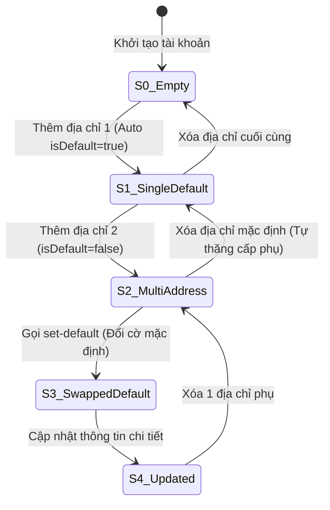

# THIẾT KẾ TEST CASE HỘP ĐEN: QUẢN LÝ SỔ ĐỊA CHỈ (ADDRESS BOOK MANAGEMENT)

> **Chức năng:** Quản lý danh sách sổ địa chỉ giao hàng của người dùng (Thêm, Sửa, Xóa, Đặt làm địa chỉ mặc định) qua REST API `/api/v1/users/addresses`.  
> **Người thực hiện:** Nguyễn Hoàng Phương (MSSV: `080205010954` / `NguyenHoangPhuong275`)

---

## 1. Xác Định Biến Đầu Vào & Ràng Buộc Nghiệp Vụ (Input Variables)

| Tên Biến | Ý Nghĩa | Kiểu | Ràng Buộc & Miền Giá Trị Hợp Lệ |
| :--- | :--- | :---: | :--- |
| **`currentUser`** | Tài khoản thực hiện | `Authentication`| Bắt buộc đã đăng nhập (`ROLE_USER` / `CUSTOMER`). Khách vãng lai bị chặn `HTTP 401` |
| **`receiverName`** | Tên người nhận hàng | `String` | Độ dài $[1, 100]$ ký tự, không chứa ký tự cấm (`@#$%^&*<>~{}`) |
| **`phone`** | Số điện thoại nhận hàng | `String` | Độ dài $[1, 20]$ ký tự, đúng định dạng số điện thoại |
| **`province`** | Tỉnh / Thành phố | `String` | Độ dài $[1, 100]$ ký tự, không chứa ký tự đặc biệt |
| **`district`** | Quận / Huyện | `String` | Độ dài $[1, 100]$ ký tự, không chứa ký tự đặc biệt |
| **`ward`** | Phường / Xã | `String` | Độ dài $[1, 100]$ ký tự, không chứa ký tự đặc biệt |
| **`streetAddress`** | Địa chỉ đường phố chi tiết | `String` | Độ dài $[1, 255]$ ký tự, cho phép dấu tiếng Việt, số nhà `/`, `-` |
| **`isDefault`** | Cờ địa chỉ mặc định | `boolean` | `true` hoặc `false`. Nếu là địa chỉ đầu tiên, luôn tự động gán `true` |
| **`addressCount`** | Số lượng địa chỉ đã lưu | `int` | Giới hạn tối đa 10 địa chỉ / tài khoản ($1 \le count \le 10$) |

---

## 2. Bảng Phân Hoạch Tương Đương (Equivalence Partitioning - EP)

| STT | Biến / Điều kiện | Lớp hợp lệ (Valid) | Tag | Lớp không hợp lệ (Invalid) | Tag |
| :-: | :--- | :--- | :---: | :--- | :---: |
| **1** | **Xác thực (`currentUser`)** | User đã đăng nhập hợp lệ | **V1** | Khách vãng lai chưa đăng nhập (`Anonymous`) | **X1** |
| **2** | **Tên người nhận (`receiverName`)**| Chuỗi $[1, 100]$ ký tự chữ hợp lệ | **V2** | • Để trống / null • Vượt quá 100 ký tự ($L > 100$) • Chứa ký tự cấm (`@#$%^&*`) | **X2** **X3** **X4** |
| **3** | **Số điện thoại (`phone`)** | Chuỗi $[1, 20]$ ký tự số hợp lệ | **V3** | • Để trống • Vượt quá 20 ký tự ($L > 20$) • Chứa chữ cái hoặc ký tự đặc biệt | **X5** **X6** **X7** |
| **4** | **Địa danh (`province/district/ward`)**| Chuỗi $[1, 100]$ ký tự hợp lệ | **V4** | • Để trống 1 trong 3 trường • Vượt quá 100 ký tự ($L > 100$) • Chứa ký tự nguy hiểm (`"` | **HTTP 400 Bad Request:** *"Địa chỉ đường phố chứa ký tự không hợp lệ!"*. | **X13** |
| **19**| **TC_ADR_19** | Chặn User A sửa hoặc xóa địa chỉ thuộc User B | • User A đăng nhập nhưng gửi `PUT` hoặc `DELETE` ID của User B | **HTTP 403 Forbidden:** *"Không tìm thấy địa chỉ hoặc bạn không có quyền chỉnh sửa!"*. | **X14** |
| **20**| **TC_ADR_20** | Chặn thêm mới khi đã đạt giới hạn 10 địa chỉ ($max^+$) | • Tài khoản đã có sẵn 10 địa chỉ trong sổ • Gửi yêu cầu thêm địa chỉ thứ 11 | **HTTP 400 Bad Request:** *"Bạn đã đạt giới hạn tối đa 10 địa chỉ lưu trữ!"*. | **X15, B31** |

---

## 5. Bảng Quyết Định & Máy Trạng Thái (Decision Table & State Transition)

### 5.1 Bảng Quyết Định Rút Gọn (Collapsed Decision Table - 8 Rules)

| Condition / Action | Rule 1 | Rule 2 | Rule 3 | Rule 4 | Rule 5 | Rule 6 | Rule 7 | Rule 8 |
| :--- | :---: | :---: | :---: | :---: | :---: | :---: | :---: | :---: |
| **C1: Đã xác thực đăng nhập (`Authenticated`)?** | **N** | Y | Y | Y | Y | Y | Y | Y |
| **C2: Đầy đủ 6 trường thông tin bắt buộc?** | - | **N** | Y | Y | Y | Y | Y | Y |
| **C3: Độ dài & định dạng 6 trường hợp lệ?** | - | - | **N** | Y | Y | Y | Y | Y |
| **C4: Người dùng là chủ sở hữu bản ghi (`isOwner`)?** | - | - | - | **N** | Y | Y | Y | Y |
| **C5: Thiết lập làm mặc định (`isDefault == true`)?**| - | - | - | - | **N** | **Y** | - | - |
| **C6: Thao tác yêu cầu?** | - | - | - | - | Tạo mới | Tạo mới | Đổi Default | Xóa ID |
| *A1: Trả về HTTP 401 Unauthorized* | **X** | - | - | - | - | - | - | - |
| *A2: Trả về HTTP 400 "Điền đầy đủ thông tin"* | - | **X** | - | - | - | - | - | - |
| *A3: Trả về HTTP 400 "Dữ liệu không hợp lệ"* | - | - | **X** | - | - | - | - | - |
| *A4: Trả về HTTP 403 "Không có quyền thao tác"* | - | - | - | **X** | - | - | - | - |
| *A5: Tạo mới thành công (HTTP 201 Created)* | - | - | - | - | **X** | **X** | - | - |
| *A6: Đổi mặc định thành công (HTTP 200 OK)* | - | - | - | - | - | - | **X** | - |
| *A7: Xóa địa chỉ thành công (HTTP 200 OK)* | - | - | - | - | - | - | - | **X** |

### 5.2 Máy Trạng Thái Chuyển Đổi Sổ Địa Chỉ (State Transition)

