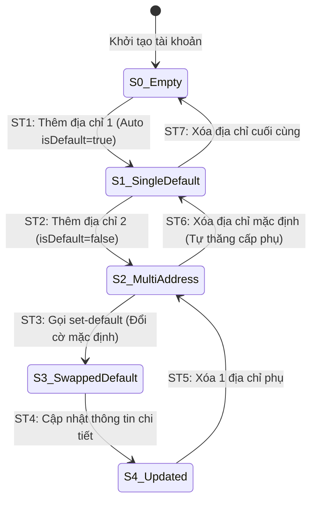

# THIẾT KẾ TEST CASE HỘP ĐEN: QUẢN LÝ SỔ ĐỊA CHỈ (ADDRESS BOOK MANAGEMENT)

> **Chức năng:** Quản lý danh sách sổ địa chỉ giao hàng của người dùng (Thêm, Sửa, Xóa, Đặt làm địa chỉ mặc định) qua REST API `/api/v1/users/addresses`.  

---

## 1. Xác Định Biến Đầu Vào & Ràng Buộc Nghiệp Vụ (Input Variables)

| Tên Biến | Ý Nghĩa | Kiểu | Ràng Buộc & Miền Giá Trị Hợp Lệ |
| :--- | :--- | :---: | :--- |
| **`currentUser`** | Tài khoản thực hiện | `Authentication`| Bắt buộc đã đăng nhập (`ROLE_USER` / `CUSTOMER`). Khách vãng lai bị chặn `HTTP 401` |
| **`receiverName`** | Tên người nhận hàng | `String` | Độ dài $[1, 100]$ ký tự, không chứa ký tự cấm (`@#$%^&*<>~{}`) |
| **`phone`** | Số điện thoại nhận hàng | `String` | Độ dài $[1, 20]$ ký tự, đúng định dạng số điện thoại |
| **`province`** | Tỉnh / Thành phố | `String` | Độ dài $[1, 100]$ ký tự, không chứa ký tự đặc biệt |
| **`district`** | Quận / Huyện | `String` | Độ dài $[1, 100]$ ký tự, không chứa ký tự đặc biệt |
| **`ward`** | Phường / Xã | `String` | Độ dài $[1, 100]$ ký tự, không chứa ký tự đặc biệt |
| **`streetAddress`** | Địa chỉ đường phố chi tiết | `String` | Độ dài $[1, 255]$ ký tự, cho phép dấu tiếng Việt, số nhà `/`, `-` |
| **`isDefault`** | Cờ địa chỉ mặc định | `boolean` | `true` hoặc `false`. Nếu là địa chỉ đầu tiên, luôn tự động gán `true` |
| **`addressCount`** | Số lượng địa chỉ đã lưu | `int` | Giới hạn tối đa 10 địa chỉ / tài khoản ($1 \le count \le 10$) |

---

## 2. Bảng Phân Hoạch Tương Đương (Equivalence Partitioning - EP)

| STT | Biến / Điều kiện | Lớp hợp lệ (Valid) | Tag | Lớp không hợp lệ (Invalid) | Tag |
| :-: | :--- | :--- | :---: | :--- | :---: |
| **1** | **Xác thực (`currentUser`)** | User đã đăng nhập hợp lệ | **V1** | Khách vãng lai chưa đăng nhập (`Anonymous`) | **X1** |
| **2** | **Tên người nhận (`receiverName`)**| Chuỗi $[1, 100]$ ký tự chữ hợp lệ | **V2** | • Để trống / null • Vượt quá 100 ký tự ($L > 100$) • Chứa ký tự cấm (`@#$%^&*`) | **X2** **X3** **X4** |
| **3** | **Số điện thoại (`phone`)** | Chuỗi $[1, 20]$ ký tự số hợp lệ | **V3** | • Để trống • Vượt quá 20 ký tự ($L > 20$) • Chứa chữ cái hoặc ký tự đặc biệt | **X5** **X6** **X7** |
| **4** | **Địa danh (`province/district/ward`)**| Chuỗi $[1, 100]$ ký tự hợp lệ | **V4** | • Để trống 1 trong 3 trường • Vượt quá 100 ký tự ($L > 100$) • Chứa ký tự nguy hiểm (`"` | **HTTP 400 Bad Request:** Phát hiện ký tự độc hại, từ chối lưu dữ liệu. | **X10, D3** |
| **22** | **TC_ADR_22** | Báo lỗi khi địa chỉ đường phố để trống ($min^-$) | • `streetAddress`: `""` (rỗng hoặc khoảng trắng) | **HTTP 400 Bad Request:** Thông báo lỗi: *"Địa chỉ đường phố không được để trống"*. | **X11, B14, D2** |
| **23** | **TC_ADR_23** | Báo lỗi khi địa chỉ đường phố dài 256 ký tự ($max^+$) | • `streetAddress`: Chuỗi dài 256 ký tự ($max^+$) | **HTTP 400 Bad Request:** Thông báo lỗi: *"Địa chỉ đường phố tối đa 255 ký tự"*. | **X12, B19, D3** |
| **24** | **TC_ADR_24** | Từ chối địa chỉ đường phố chứa mã độc XSS Script | • `streetAddress`: `""` | **HTTP 400 Bad Request:** Chặn lưu trữ mã độc XSS Script. | **X13, D3** |
| **25** | **TC_ADR_25** | Chặn User sửa hoặc xóa địa chỉ không thuộc sở hữu (IDOR) | • Gửi `PUT` hoặc `DELETE /api/v1/users/addresses/999999` (ID của User khác) | **HTTP 403 Forbidden / 404:** Chặn truy cập trái phép bản ghi không thuộc sở hữu. | **X14, D4** |
| **26** | **TC_ADR_26** | Báo lỗi khi thêm địa chỉ vượt trần tối đa 10 địa chỉ ($max^+$) | • Sổ hiện tại đã có `10` địa chỉ • Gửi yêu cầu thêm địa chỉ thứ `11` ($max^+$) | **HTTP 400 Bad Request:** Thông báo lỗi: *"Tài khoản đã đạt tối đa 10 địa chỉ lưu trữ"*. | **X15, B31** |
