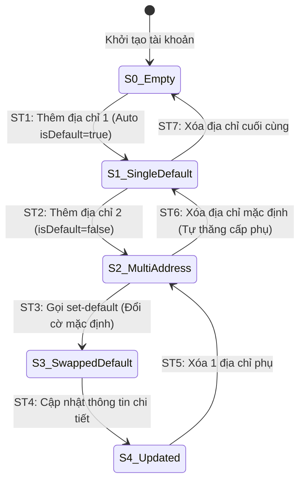

# THIẾT KẾ TEST CASE HỘP ĐEN: QUẢN LÝ SỔ ĐỊA CHỈ (ADDRESS BOOK MANAGEMENT)

> **Chức năng:** Quản lý danh sách sổ địa chỉ giao hàng của người dùng (Thêm, Sửa, Xóa, Đặt làm địa chỉ mặc định) qua REST API `/api/v1/users/addresses`.  

---

## 1. Xác Định Biến Đầu Vào & Ràng Buộc Nghiệp Vụ (Input Variables)

| Tên Biến | Ý Nghĩa | Kiểu | Ràng Buộc & Miền Giá Trị Hợp Lệ |
| :--- | :--- | :---: | :--- |
| **`currentUser`** | Tài khoản thực hiện | `Authentication`| Bắt buộc đã đăng nhập (`ROLE_USER` / `CUSTOMER`). Khách vãng lai bị chặn `HTTP 401` |
| **`receiverName`** | Tên người nhận hàng | `String` | Độ dài $[1, 100]$ ký tự, không chứa ký tự cấm (`@#$%^&*<>~{}`) |
| **`phone`** | Số điện thoại nhận hàng | `String` | Độ dài $[1, 20]$ ký tự, đúng định dạng số điện thoại |
| **`province`** | Tỉnh / Thành phố | `String` | Độ dài $[1, 100]$ ký tự, không chứa ký tự đặc biệt |
| **`district`** | Quận / Huyện | `String` | Độ dài $[1, 100]$ ký tự, không chứa ký tự đặc biệt |
| **`ward`** | Phường / Xã | `String` | Độ dài $[1, 100]$ ký tự, không chứa ký tự đặc biệt |
| **`streetAddress`** | Địa chỉ đường phố chi tiết | `String` | Độ dài $[1, 255]$ ký tự, cho phép dấu tiếng Việt, số nhà `/`, `-` |
| **`isDefault`** | Cờ địa chỉ mặc định | `boolean` | `true` hoặc `false`. Nếu là địa chỉ đầu tiên, luôn tự động gán `true` |
| **`addressCount`** | Số lượng địa chỉ đã lưu | `int` | Giới hạn tối đa 10 địa chỉ / tài khoản ($1 \le count \le 10$) |

---

## 2. Bảng Phân Hoạch Tương Đương (Equivalence Partitioning - EP)

| STT | Biến / Điều kiện | Lớp hợp lệ (Valid) | Tag | Lớp không hợp lệ (Invalid) | Tag |
| :-: | :--- | :--- | :---: | :--- | :---: |
| **1** | **Xác thực (`currentUser`)** | User đã đăng nhập hợp lệ | **V1** | Khách vãng lai chưa đăng nhập (`Anonymous`) | **X1** |
| **2** | **Tên người nhận (`receiverName`)**| Chuỗi $[1, 100]$ ký tự chữ hợp lệ | **V2** | • Để trống / null • Vượt quá 100 ký tự ($L > 100$) • Chứa ký tự cấm (`@#$%^&*`) | **X2** **X3** **X4** |
| **3** | **Số điện thoại (`phone`)** | Chuỗi $[1, 20]$ ký tự số hợp lệ | **V3** | • Để trống • Vượt quá 20 ký tự ($L > 20$) • Chứa chữ cái hoặc ký tự đặc biệt | **X5** **X6** **X7** |
| **4** | **Địa danh (`province/district/ward`)**| Chuỗi $[1, 100]$ ký tự hợp lệ | **V4** | • Để trống 1 trong 3 trường • Vượt quá 100 ký tự ($L > 100$) • Chứa ký tự nguy hiểm (`"` | **HTTP 400 Bad Request:** *"Địa danh chứa ký tự không hợp lệ!"*. | **X10** |
| **18** | **TC_ADR_18** | Báo lỗi khi để trống địa chỉ đường phố chi tiết | • `streetAddress`: `""` (rỗng) | **HTTP 400 Bad Request:** *"Địa chỉ đường phố không được để trống!"*. | **X11** |
| **19** | **TC_ADR_19** | Báo lỗi khi địa chỉ đường phố vượt quá 255 ký tự | • `streetAddress`: Chuỗi dài 256 ký tự | **HTTP 400 Bad Request:** *"Địa chỉ đường phố tối đa 255 ký tự!"*. | **X12** |
| **20** | **TC_ADR_20** | Từ chối địa chỉ đường phố chứa mã độc XSS Script | • `streetAddress`: `"123 Đường "` | **HTTP 400 Bad Request:** *"Địa chỉ đường phố chứa ký tự không hợp lệ!"*. | **X13** |
| **21** | **TC_ADR_21** | Chặn người dùng thao tác trên địa chỉ của tài khoản khác (IDOR) | • User A gửi `PUT` hoặc `DELETE` mã địa chỉ thuộc User B | **HTTP 403 Forbidden:** *"Không tìm thấy địa chỉ hoặc bạn không có quyền chỉnh sửa!"*. | **X14** |
| **22** | **TC_ADR_22** | Chặn thêm mới khi đã đạt giới hạn tối đa 10 địa chỉ | • Sổ địa chỉ đã có 10 bản ghi, gửi thêm địa chỉ thứ 11 | **HTTP 400 Bad Request:** *"Bạn đã đạt giới hạn tối đa 10 địa chỉ lưu trữ!"*. | **X15** |
| **23** | **TC_ADR_23** | Robustness BVA: Tất cả 6 trường ở giá trị danh định chuẩn | • `receiverName` (20 ký tự), `phone` (10 số), `street` (20 ký tự), `province` (11 ký tự), `count` = 3 | **HTTP 201 Created:** Lưu thành công bản ghi tại giá trị danh định. | **B1** |
| **24** | **TC_ADR_24** | Robustness BVA: Độ dài tên người nhận tại ngoại biên dưới min- | • `receiverName`: `""` (0 ký tự, rỗng) | **HTTP 400 Bad Request:** Họ tên người nhận không được để trống. | **B2** |
| **25** | **TC_ADR_25** | Robustness BVA: Độ dài tên người nhận tại cận dưới min | • `receiverName`: `"A"` (1 ký tự) | **HTTP 201 Created:** Tiếp nhận tên 1 ký tự thành công. | **B3** |
| **26** | **TC_ADR_26** | Robustness BVA: Độ dài tên người nhận tại kề cận dưới min+ | • `receiverName`: `"An"` (2 ký tự) | **HTTP 201 Created:** Tiếp nhận tên 2 ký tự thành công. | **B4** |
| **27** | **TC_ADR_27** | Robustness BVA: Độ dài tên người nhận tại kề cận trên max- | • `receiverName`: Chuỗi dài 99 ký tự | **HTTP 201 Created:** Tiếp nhận tên 99 ký tự thành công. | **B5** |
| **28** | **TC_ADR_28** | Robustness BVA: Độ dài tên người nhận tại cận trên max | • `receiverName`: Chuỗi dài 100 ký tự | **HTTP 201 Created:** Tiếp nhận tên 100 ký tự thành công. | **B6** |
| **29** | **TC_ADR_29** | Robustness BVA: Độ dài tên người nhận tại ngoại biên trên max+ | • `receiverName`: Chuỗi dài 101 ký tự | **HTTP 400 Bad Request:** Họ tên người nhận tối đa 100 ký tự. | **B7** |
| **30** | **TC_ADR_30** | Robustness BVA: Độ dài số điện thoại tại ngoại biên dưới min- | • `phone`: `""` (0 số, rỗng) | **HTTP 400 Bad Request:** Số điện thoại không được để trống. | **B8** |
| **31** | **TC_ADR_31** | Robustness BVA: Độ dài số điện thoại tại cận dưới min | • `phone`: `"1"` (1 chữ số) | **HTTP 201 Created:** Tiếp nhận SĐT 1 ký tự thành công. | **B9** |
| **32** | **TC_ADR_32** | Robustness BVA: Độ dài số điện thoại tại kề cận dưới min+ | • `phone`: `"12"` (2 chữ số) | **HTTP 201 Created:** Tiếp nhận SĐT 2 ký tự thành công. | **B10** |
| **33** | **TC_ADR_33** | Robustness BVA: Độ dài số điện thoại tại kề cận trên max- | • `phone`: Chuỗi 19 chữ số | **HTTP 201 Created:** Tiếp nhận SĐT 19 chữ số thành công. | **B11** |
| **34** | **TC_ADR_34** | Robustness BVA: Độ dài số điện thoại tại cận trên max | • `phone`: Chuỗi 20 chữ số | **HTTP 201 Created:** Tiếp nhận SĐT 20 chữ số thành công. | **B12** |
| **35** | **TC_ADR_35** | Robustness BVA: Độ dài số điện thoại tại ngoại biên trên max+ | • `phone`: Chuỗi 21 chữ số | **HTTP 400 Bad Request:** Số điện thoại tối đa 20 ký tự. | **B13** |
| **36** | **TC_ADR_36** | Robustness BVA: Độ dài địa chỉ đường phố tại ngoại biên dưới min- | • `streetAddress`: `""` (0 ký tự, rỗng) | **HTTP 400 Bad Request:** Địa chỉ đường phố không được để trống. | **B14** |
| **37** | **TC_ADR_37** | Robustness BVA: Độ dài địa chỉ đường phố tại cận dưới min | • `streetAddress`: `"1"` (1 ký tự) | **HTTP 201 Created:** Tiếp nhận địa chỉ đường phố 1 ký tự thành công. | **B15** |
| **38** | **TC_ADR_38** | Robustness BVA: Độ dài địa chỉ đường phố tại kề cận dưới min+ | • `streetAddress`: `"12"` (2 ký tự) | **HTTP 201 Created:** Tiếp nhận địa chỉ đường phố 2 ký tự thành công. | **B16** |
| **39** | **TC_ADR_39** | Robustness BVA: Độ dài địa chỉ đường phố tại kề cận trên max- | • `streetAddress`: Chuỗi dài 254 ký tự | **HTTP 201 Created:** Tiếp nhận địa chỉ đường phố 254 ký tự thành công. | **B17** |
| **40** | **TC_ADR_40** | Robustness BVA: Độ dài địa chỉ đường phố tại cận trên max | • `streetAddress`: Chuỗi dài 255 ký tự | **HTTP 201 Created:** Tiếp nhận địa chỉ đường phố 255 ký tự thành công. | **B18** |
| **41** | **TC_ADR_41** | Robustness BVA: Độ dài địa chỉ đường phố tại ngoại biên trên max+ | • `streetAddress`: Chuỗi dài 256 ký tự | **HTTP 400 Bad Request:** Địa chỉ đường phố tối đa 255 ký tự. | **B19** |
| **42** | **TC_ADR_42** | Robustness BVA: Độ dài địa danh tỉnh/thành tại ngoại biên dưới min- | • `province`: `""` (0 ký tự, rỗng) | **HTTP 400 Bad Request:** Tỉnh/Thành phố không được để trống. | **B20** |
| **43** | **TC_ADR_43** | Robustness BVA: Độ dài địa danh tỉnh/thành tại cận dưới min | • `province`: `"A"` (1 ký tự) | **HTTP 201 Created:** Tiếp nhận tỉnh thành 1 ký tự thành công. | **B21** |
| **44** | **TC_ADR_44** | Robustness BVA: Độ dài địa danh tỉnh/thành tại kề cận dưới min+ | • `province`: `"HN"` (2 ký tự) | **HTTP 201 Created:** Tiếp nhận tỉnh thành 2 ký tự thành công. | **B22** |
| **45** | **TC_ADR_45** | Robustness BVA: Độ dài địa danh tỉnh/thành tại kề cận trên max- | • `province`: Chuỗi dài 99 ký tự | **HTTP 201 Created:** Tiếp nhận tỉnh thành 99 ký tự thành công. | **B23** |
| **46** | **TC_ADR_46** | Robustness BVA: Độ dài địa danh tỉnh/thành tại cận trên max | • `province`: Chuỗi dài 100 ký tự | **HTTP 201 Created:** Tiếp nhận tỉnh thành 100 ký tự thành công. | **B24** |
| **47** | **TC_ADR_47** | Robustness BVA: Độ dài địa danh tỉnh/thành tại ngoại biên trên max+ | • `province`: Chuỗi dài 101 ký tự | **HTTP 400 Bad Request:** Tỉnh/Thành phố tối đa 100 ký tự. | **B25** |
| **48** | **TC_ADR_48** | Robustness BVA: Số lượng địa chỉ đã lưu tại cận dưới min | • Sổ địa chỉ rỗng ($count = 0$), thêm địa chỉ đầu tiên | **HTTP 201 Created:** Lưu thành công, tự động thăng cấp `isDefault = true`. | **B26** |
| **49** | **TC_ADR_49** | Robustness BVA: Số lượng địa chỉ đã lưu tại kề cận dưới min+ | • Sổ địa chỉ đang có 1 bản ghi ($count = 1$), thêm địa chỉ thứ 2 | **HTTP 201 Created:** Lưu thành công địa chỉ thứ 2 dạng phụ (`isDefault = false`). | **B27** |
| **50** | **TC_ADR_50** | Robustness BVA: Số lượng địa chỉ đã lưu tại mốc danh định nom | • Sổ địa chỉ đang có 3 bản ghi ($count = 3$), thêm địa chỉ thứ 4 | **HTTP 201 Created:** Lưu thành công địa chỉ thứ 4 dạng phụ. | **B28** |
| **51** | **TC_ADR_51** | Robustness BVA: Số lượng địa chỉ đã lưu tại kề cận trên max- | • Sổ địa chỉ đang có 8 bản ghi ($count = 8$), thêm địa chỉ thứ 9 | **HTTP 201 Created:** Lưu thành công địa chỉ thứ 9 dạng phụ. | **B29** |
| **52** | **TC_ADR_52** | Robustness BVA: Số lượng địa chỉ đã lưu tại cận trên max | • Sổ địa chỉ đang có 9 bản ghi ($count = 9$), thêm địa chỉ thứ 10 | **HTTP 201 Created:** Lưu thành công địa chỉ thứ 10, chạm trần tối đa. | **B30** |
| **53** | **TC_ADR_53** | Robustness BVA: Số lượng địa chỉ đã lưu tại ngoại biên trên max+ | • Sổ địa chỉ đã có đủ 10 bản ghi ($count = 10$), cố tình thêm thứ 11 | **HTTP 400 Bad Request:** Báo lỗi đạt giới hạn tối đa 10 địa chỉ lưu trữ. | **B31** |
| **54** | **TC_ADR_54** | Decision Table: Rule 1 - Khách vãng lai thao tác sổ địa chỉ | • Chưa đăng nhập, gửi request quản lý địa chỉ | **HTTP 401 Unauthorized:** Từ chối truy cập người dùng chưa xác thực. | **D1** |
| **55** | **TC_ADR_55** | Decision Table: Rule 2 - Thêm địa chỉ thiếu trường bắt buộc | • Form thiếu 1 trong các trường bắt buộc | **HTTP 400 Bad Request:** Báo lỗi không được để trống trường bắt buộc. | **D2** |
| **56** | **TC_ADR_56** | Decision Table: Rule 3 - Dữ liệu trường vượt quá độ dài cho phép | • 1 trường có độ dài vượt trần quy định | **HTTP 400 Bad Request:** Báo lỗi độ dài trường vượt quá giới hạn. | **D3** |
| **57** | **TC_ADR_57** | Decision Table: Rule 4 - Người dùng thao tác trên địa chỉ của User khác | • User A cố tình gửi ID địa chỉ của User B | **HTTP 403 Forbidden:** Báo lỗi không có quyền thao tác trên bản ghi. | **D4** |
| **58** | **TC_ADR_58** | Decision Table: Rule 5 - Thêm địa chỉ đầu tiên vào sổ rỗng | • Sổ rỗng ($count = 0$), thêm địa chỉ hợp lệ | **HTTP 201 Created:** Lưu thành công, tự động đặt làm mặc định (`isDefault = true`). | **D5** |
| **59** | **TC_ADR_59** | Decision Table: Rule 6 - Thêm địa chỉ mới vào sổ đã có địa chỉ | • Sổ đã có địa chỉ, thêm địa chỉ mới hợp lệ | **HTTP 201 Created:** Lưu thành công địa chỉ phụ (`isDefault = false`). | **D6** |
| **60** | **TC_ADR_60** | Decision Table: Rule 7 - Đặt địa chỉ phụ làm mặc định | • Gọi API `set-default` trên địa chỉ phụ | **HTTP 200 OK:** Đổi địa chỉ này thành mặc định, hạ mặc định cũ thành phụ. | **D7** |
| **61** | **TC_ADR_61** | Decision Table: Rule 8 - Xóa địa chỉ hợp lệ khỏi sổ địa chỉ | • Gọi API `DELETE` trên địa chỉ hợp lệ | **HTTP 200 OK:** Xóa thành công bản ghi khỏi CSDL. | **D8** |
| **62** | **TC_ADR_62** | State Transition: ST1 - Chuyển S0 sang S1 (Thêm địa chỉ đầu tiên) | • Sổ rỗng (`S0_Empty`) thêm địa chỉ đầu tiên | **Chuyển trạng thái:** Sang `S1_SingleDefault`, tự động gán mặc định. | **ST1** |
| **63** | **TC_ADR_63** | State Transition: ST2 - Chuyển S1 sang S2 (Thêm địa chỉ thứ hai) | • Đang có 1 địa chỉ (`S1_SingleDefault`) thêm địa chỉ thứ 2 | **Chuyển trạng thái:** Sang `S2_MultiAddress`, lưu địa chỉ phụ. | **ST2** |
| **64** | **TC_ADR_64** | State Transition: ST3 - Chuyển S2 sang S3 (Đổi địa chỉ mặc định) | • Đang có nhiều địa chỉ (`S2_MultiAddress`) đổi mặc định | **Chuyển trạng thái:** Sang `S3_SwappedDefault`, hoán đổi cờ mặc định. | **ST3** |
| **65** | **TC_ADR_65** | State Transition: ST4 - Chuyển S3 sang S4 (Cập nhật thông tin chi tiết) | • Đang ở `S3_SwappedDefault` gửi cập nhật thông tin | **Chuyển trạng thái:** Sang `S4_Updated`, cập nhật thành công dữ liệu. | **ST4** |
| **66** | **TC_ADR_66** | State Transition: ST5 - Chuyển S4 sang S2 (Xóa 1 địa chỉ phụ) | • Từ `S4_Updated` gửi xóa 1 địa chỉ phụ | **Chuyển trạng thái:** Quay về `S2_MultiAddress`, giữ nguyên mặc định. | **ST5** |
| **67** | **TC_ADR_67** | State Transition: ST6 - Chuyển S2 sang S1 (Xóa địa chỉ đang mặc định) | • Có 2 địa chỉ, xóa địa chỉ đang mặc định | **Chuyển trạng thái:** Tự động thăng cấp địa chỉ phụ còn lại làm mặc định (`S1_SingleDefault`). | **ST6** |
| **68** | **TC_ADR_68** | State Transition: ST7 - Chuyển S1 sang S0 (Xóa địa chỉ duy nhất còn lại) | • Có đúng 1 địa chỉ, gửi lệnh xóa | **Chuyển trạng thái:** Xóa thành công, sổ trở về rỗng `S0_Empty`. | **ST7** |
