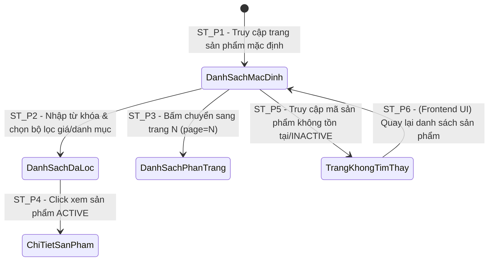

# THIẾT KẾ TEST CASE HỘP ĐEN: TRA CỨU, BỘ LỌC & PHÂN TRANG SẢN PHẨM (PRODUCT SEARCH & PAGINATION)

> **Chức năng:** Tìm kiếm từ khóa, Lọc theo danh mục/thương hiệu/khoảng giá, Phân trang, Sắp xếp và Xem thông tin chi tiết Sản phẩm dành cho Khách hàng (`Customer` / `Guest`).

---

## 1. Xác Định Biến Đầu Vào & Ràng Buộc Nghiệp Vụ (Input Variables)

| Tên Biến | Ý Nghĩa | Kiểu | Ràng Buộc & Miền Giá Trị Hợp Lệ |
| :--- | :--- | :---: | :--- |
| **`name`** | Từ khóa tìm kiếm | `String` | Độ dài $[0, 100]$, không phân biệt hoa/thường (`lower(name) LIKE %name%`), tự động loại bỏ khoảng trắng dư |
| **`category`** | Danh mục sản phẩm | `String` | Tên/Mã danh mục có trong CSDL (VD: `"Sneaker"`, `"Running"`, `null` = tất cả) |
| **`brand`** | Thương hiệu | `String` | Tên/Mã thương hiệu có trong CSDL (VD: `"Nike"`, `"Adidas"`, `null` = tất cả). Hỗ trợ danh sách phân cách bởi dấu phẩy |
| **`minPrice`** | Giá tối thiểu | `Double` | Giá sau giảm $[0, \infty)$ K VNĐ (`price * (100 - discountPercent) / 100.0 >= minPrice`) |
| **`maxPrice`** | Giá tối đa | `Double` | Giá sau giảm $\ge minPrice$ K VNĐ hoặc `null` (không giới hạn giá trần) |
| **`page`** | Trang hiện tại | `int` | Số nguyên $\ge 1$ (mặc định: `1`). Nếu truyền $\le 0$, hệ thống tự ép về `1` |
| **`sort`** | Tiêu chí sắp xếp | `String` | `"priceAsc"`, `"priceDesc"`, `"newest"`, `"popular"`, `"sales"`. Mặc định: `"newest"` (`createDate desc`) |
| **`code`** | Mã chi tiết sản phẩm | `String` | Mã sản phẩm hợp lệ $[1, 20]$ ký tự (VD: `"S001"`, `"S002"`) |
| **`productStatus`** | Trạng thái hiển thị | `Enum` | Bắt buộc `ACTIVE` đối với Customer (`INACTIVE` bị ẩn/trả về 404) |

> [!NOTE]
> **ĐẶC ĐIỂM KIẾN TRÚC BACKEND JAVA (CODE THỰC TẾ):**
> 1. **Kích thước trang (`size` / `maxResult`):** Backend Java fix cứng `maxResult = 12` sản phẩm/trang tại `ProductApiController.java` (`int maxResult = 12`). API công khai **không khai báo parameter `size`**. Nếu client truyền `size`, Spring MVC tự động bỏ qua và luôn trả về tối đa 12 sản phẩm.
> 2. **Xử lý bộ lọc mềm dẻo (Fault-Tolerant Filtering):** Backend không có validator ném lỗi 400 cho các bộ lọc mâu thuẫn (`minPrice < 0`, `maxPrice < minPrice`, `sort` lạ, `name > 100 ký tự`) mà thực thi SQL HQL trực tiếp. Nếu `minPrice < 0` (VD: `-1`), HQL chạy `WHERE price >= -1` (luôn đúng) và trả về 200 OK với danh sách sản phẩm. Các bộ lọc không tìm thấy sản phẩm sẽ trả về danh sách rỗng `[]` với **HTTP 200 OK**.
> 3. **Xử lý lỗi kiểu dữ liệu (Spring Type Mismatch):** Spring MVC chỉ ném lỗi **HTTP 400 Bad Request** khi tham số không đúng kiểu dữ liệu khai báo (VD: `page=abc` hoặc `minPrice=xyz`).
> 4. **Quyền truy cập công khai (`permitAll`):** Endpoint `GET /api/v1/products` và `GET /api/v1/products/{code}` được mở công khai (`permitAll()`) trong `WebSecurityConfig`. Token không hợp lệ được hệ thống xử lý như Khách vãng lai (`Guest`/Anonymous) và trả về **HTTP 200 OK**.

---

## 2. Bảng Phân Hoạch Tương Đương (Equivalence Partitioning - EP)

| STT | Biến / Điều kiện | Lớp hợp lệ (Valid) | Tag | Lớp không hợp lệ (Invalid) | Tag |
| :-: | :--- | :--- | :---: | :--- | :---: |
| **1** | **Quyền truy cập (`currentUserRole`)** | • Khách vãng lai (`Guest`)<br>• Tài khoản Khách hàng (`Customer`) | **V1** | Token bị hư hỏng hoặc hết hạn (API public `permitAll()`, hệ thống xử lý dạng Anonymous trả về HTTP 200 OK) | **X1** |
| **2** | **Từ khóa tìm kiếm (`name`)** | • Chuỗi ký tự hợp lệ có sản phẩm $[1, 100]$<br>• Để trống (`null` hoặc `""`) -> lấy toàn bộ danh sách | **V2**<br>**V3** | • Từ khóa không tồn tại trong CSDL (trả `[]`, HTTP 200)<br>• Chuỗi chứa SQL Injection (xử lý an toàn qua Parameter Binding, HTTP 200)<br>• Chuỗi vượt 100 ký tự (chạy SQL LIKE bình thường, HTTP 200) | **X2**<br>**X3**<br>**X4** |
| **3** | **Danh mục sản phẩm (`category`)** | • Mã/Tên danh mục có trong hệ thống<br>• Giá trị `null` hoặc rỗng (xem tất cả danh mục) | **V4**<br>**V5** | Danh mục không tồn tại trong CSDL (trả `[]`, HTTP 200) | **X5** |
| **4** | **Thương hiệu (`brand`)** | • Mã/Tên thương hiệu có trong hệ thống<br>• Giá trị `null` hoặc rỗng (xem tất cả thương hiệu) | **V6**<br>**V7** | Thương hiệu không tồn tại trong CSDL (trả `[]`, HTTP 200) | **X6** |
| **5** | **Giá tối thiểu (`minPrice`)** | • Số thực $\ge 0$ K VNĐ<br>• Giá trị `null` (không lọc min) | **V8**<br>**V9** | • Giá trị âm ($< 0$ K VNĐ, HQL `WHERE price >= -1` trả về kết quả, HTTP 200)<br>• Ký tự phi số (Spring Type Mismatch, HTTP 400) | **X7**<br>**X8** |
| **6** | **Giá tối đa (`maxPrice`)** | • Số thực $\ge minPrice$ K VNĐ<br>• Giá trị `null` (không giới hạn trần) | **V10**<br>**V11** | • Giá trị nhỏ hơn `minPrice` ($maxPrice < minPrice$, trả `[]`, HTTP 200)<br>• Ký tự phi số (Spring Type Mismatch, HTTP 400) | **X9**<br>**X10** |
| **7** | **Số trang (`page`)** | Số nguyên dương $\ge 1$ | **V12** | • Số nguyên $\le 0$ (âm hoặc 0, tự ép `page = 1`, HTTP 200)<br>• Vượt quá tổng số trang ($page > totalPages$, trả `[]`, HTTP 200)<br>• Ký tự phi số (Spring Type Mismatch, HTTP 400) | **X11**<br>**X12**<br>**X13** |
| **8** | **Tiêu chí sắp xếp (`sort`)** | Chuỗi thuộc Enum hợp lệ (`"priceAsc"`, `"priceDesc"`, `"newest"`, `"popular"`, `"sales"`) | **V13** | Giá trị sai Enum chuẩn (Fallback về mặc định `createDate desc`, HTTP 200) | **X14** |
| **9** | **Mã chi tiết sản phẩm (`code`)** | Mã sản phẩm hợp lệ, tồn tại và có trạng thái `ACTIVE` trong CSDL | **V14** | • Mã không tồn tại trong CSDL (HTTP 404)<br>• Mã sản phẩm có trạng thái `INACTIVE` (HTTP 404)<br>• Mã rỗng hoặc chỉ chứa khoảng trắng (HTTP 404) | **X15**<br>**X16**<br>**X17** |

---

## 3. Bảng Phân Tích Giá Trị Biên (Robustness BVA - $5n + 1$)

Tài liệu tách BVA thành 2 bảng độc lập tương ứng với 2 API riêng biệt để đảm bảo chuẩn hóa lý thuyết kiểm thử.

### 3.1. Robustness BVA cho API Tìm Kiếm, Bộ Lọc & Phân Trang (`GET /api/v1/products`)
*(4 biến định lượng: `name` length, `minPrice`, `maxPrice`, `page`. Công thức $4 \times 6 + 1 = 25$ ca kiểm thử $B_1 \to B_{25}$. Bộ danh định chuẩn: `name nom = "Nike Air 1"` (10 ký tự), `minPrice nom = 100` K ₫, `maxPrice nom = 500` K ₫, `page nom = 5`).*

#### Bảng 3.1.A: 7 mốc giá trị biên Robustness BVA cho 4 biến API Tìm kiếm & Phân trang
| Biến Định Lượng | Ngoại biên dưới ($min^-$) | Cận dưới ($min$) | Kề dưới ($min^+$) | Danh định ($nom$) | Kề trên ($max^-$) | Cận trên ($max$) | Ngoại biên trên ($max^+$) | Quy tắc & Giới hạn |
| :--- | :---: | :---: | :---: | :---: | :---: | :---: | :---: | :--- |
| **1. Độ dài `name`** | `0` *(rỗng)* | **`1`** | **`2`** | **`10`** | **`99`** | **`100`** | `101` | Miền $[0, 100]$. SQL LIKE tìm kiếm bình thường |
| **2. `minPrice`** (K ₫) | `-1` *(âm)* | **`0`** | **`1`** | **`100`** | **`49.999`** | **`50.000`** | `50.001` | Miền $\ge 0$. SQL `price >= minPrice` |
| **3. `maxPrice`** (K ₫)| `minPrice - 1` | **`minPrice`** | **`minPrice + 1`** | **`500`** | **`99.999`** | **`100.000`** | `100.001` | Miền $\ge minPrice$. $< minPrice$ trả list rỗng `[]` |
| **4. `page`** (Số trang) | `0` *(âm/0)* | **`1`** | **`2`** | **`5`** | **`999`** | **`1.000`** | `999.999` *(cực đại)* | Miền $\ge 1$. $\le 0$ tự reset về 1; vượt trang trả `[]` |

#### Bảng 3.2.A: 25 Test Cases Robustness BVA cho API Tìm kiếm & Phân trang ($B_1 \to B_{25}$)
| Case | Tìm kiếm (`name`) | Giá tối thiểu (`minPrice`) | Giá tối đa (`maxPrice`) | Số trang (`page`) | Mốc kiểm thử | Kết quả mong đợi (Expected Output) | Tag Biên |
| :-: | :--- | :---: | :---: | :---: | :--- | :--- | :-: |
| **1** | `"Nike Air 1"` *(nom)* | `100` *(nom)* | `500` *(nom)* | `5` *(nom)* | **Tất cả ở nom** | **Hợp lệ:** HTTP 200 OK, trả danh sách kết quả | **B1** |
| **2** | `""` *(min-)* | `100` | `500` | `5` | `name = min-` | **Hợp lệ:** HTTP 200 OK (Xem tất cả sản phẩm) | **B2** |
| **3** | `"N"` *(min)* | `100` | `500` | `5` | `name = min` | **Hợp lệ:** HTTP 200 OK (Tìm từ khóa 1 ký tự) | **B3** |
| **4** | `"Ni"` *(min+)* | `100` | `500` | `5` | `name = min+` | **Hợp lệ:** HTTP 200 OK (Tìm từ khóa 2 ký tự) | **B4** |
| **5** | `[Chuỗi 99 ký tự]` *(max-)* | `100` | `500` | `5` | `name = max-` | **Hợp lệ:** HTTP 200 OK (Từ khóa 99 ký tự) | **B5** |
| **6** | `[Chuỗi 100 ký tự]` *(max)* | `100` | `500` | `5` | `name = max` | **Hợp lệ:** HTTP 200 OK (Từ khóa 100 ký tự) | **B6** |
| **7** | `[Chuỗi 101 ký tự]` *(max+)* | `100` | `500` | `5` | `name = max+` | **Hợp lệ:** HTTP 200 OK (Từ khóa 101 ký tự) | **B7** |
| **8** | `"Nike Air 1"` | `-1` *(min-)* | `500` | `5` | `minPrice = min-` | **Hợp lệ:** HTTP 200 OK (`price >= -1`) | **B8** |
| **9** | `"Nike Air 1"` | `0` *(min)* | `500` | `5` | `minPrice = min` | **Hợp lệ:** HTTP 200 OK (minPrice từ 0 K ₫) | **B9** |
| **10** | `"Nike Air 1"` | `1` *(min+)* | `500` | `5` | `minPrice = min+` | **Hợp lệ:** HTTP 200 OK (minPrice từ 1 K ₫) | **B10**|
| **11** | `"Nike Air 1"` | `49999` *(max-)* | `50000`* | `5` | `minPrice = max-` | **Hợp lệ:** HTTP 200 OK (minPrice 49.999 K ₫) | **B11**|
| **12** | `"Nike Air 1"` | `50000` *(max)* | `50000`* | `5` | `minPrice = max` | **Hợp lệ:** HTTP 200 OK (minPrice 50.000 K ₫) | **B12**|
| **13** | `"Nike Air 1"` | `50001` *(max+)* | `50000`* | `5` | `minPrice = max+` | **Hợp lệ:** HTTP 200 OK (trả list rỗng `[]`) | **B13**|
| **14** | `"Nike Air 1"` | `100` | `99` *(min-)* | `5` | `maxPrice = min-` | **Hợp lệ:** HTTP 200 OK (trả list rỗng `[]`) | **B14**|
| **15** | `"Nike Air 1"` | `100` | `100` *(min)* | `5` | `maxPrice = min` | **Hợp lệ:** HTTP 200 OK (Giá khớp đúng 100 K ₫) | **B15**|
| **16** | `"Nike Air 1"` | `100` | `101` *(min+)* | `5` | `maxPrice = min+` | **Hợp lệ:** HTTP 200 OK (maxPrice 101 K ₫) | **B16**|
| **17** | `"Nike Air 1"` | `100` | `99999` *(max-)* | `5` | `maxPrice = max-` | **Hợp lệ:** HTTP 200 OK (maxPrice 99.999 K ₫) | **B17**|
| **18** | `"Nike Air 1"` | `100` | `100000` *(max)* | `5` | `maxPrice = max` | **Hợp lệ:** HTTP 200 OK (maxPrice 100.000 K ₫) | **B18**|
| **19** | `"Nike Air 1"` | `100` | `100001` *(max+)* | `5` | `maxPrice = max+` | **Hợp lệ:** HTTP 200 OK (Ngưỡng giá cực đại) | **B19**|
| **20** | `"Nike Air 1"` | `100` | `500` | `0` *(min-)* | `page = min-` | **Tự ép:** HTTP 200 OK (Chuẩn hóa về page = 1) | **B20**|
| **21** | `"Nike Air 1"` | `100` | `500` | `1` *(min)* | `page = min` | **Hợp lệ:** HTTP 200 OK (Hiển thị Trang 1) | **B21**|
| **22** | `"Nike Air 1"` | `100` | `500` | `2` *(min+)* | `page = min+` | **Hợp lệ:** HTTP 200 OK (Hiển thị Trang 2) | **B22**|
| **23** | `"Nike Air 1"` | `100` | `500` | `999` *(max-)* | `page = max-` | **Hợp lệ:** HTTP 200 OK (Hiển thị Trang 999) | **B23**|
| **24** | `"Nike Air 1"` | `100` | `500` | `1000` *(max)* | `page = max` | **Hợp lệ:** HTTP 200 OK (Hiển thị Trang 1000) | **B24**|
| **25** | `"Nike Air 1"` | `100` | `500` | `999999` *(max+)* | `page = max+` | **Hợp lệ:** HTTP 200 OK (Trả về list rỗng `[]`) | **B25**|

*\*Ghi chú nghiệp vụ: Tại các Case 11, 12, 13, maxPrice được điều chỉnh lên 50.000 K ₫ để thỏa mãn điều kiện minPrice <= maxPrice.*

---

### 3.2. Robustness BVA cho API Tra Cứu Chi Tiết Sản Phẩm (`GET /api/v1/products/{code}`)
*(1 biến định lượng: `code` length. Công thức $1 \times 6 + 1 = 7$ ca kiểm thử $B_{26} \to B_{32}$. Danh định chuẩn: `code nom = "S001"` (4 ký tự)).*

#### Bảng 3.1.B: 7 mốc giá trị biên Robustness BVA cho biến `code`
| Biến Định Lượng | Ngoại biên dưới ($min^-$) | Cận dưới ($min$) | Kề dưới ($min^+$) | Danh định ($nom$) | Kề trên ($max^-$) | Cận trên ($max$) | Ngoại biên trên ($max^+$) | Quy tắc & Giới hạn |
| :--- | :---: | :---: | :---: | :---: | :---: | :---: | :---: | :--- |
| **5. Độ dài mã `code`**| `0` *(rỗng)* | **`1`** | **`2`** | **`4`** | **`19`** | **`20`** | `21` | Miền $[1, 20]$. Rỗng/không tồn tại trả HTTP 404 |

#### Bảng 3.2.B: 7 Test Cases Robustness BVA cho API Chi tiết sản phẩm ($B_{26} \to B_{32}$)
| Case | Mã chi tiết (`code`) | Mốc kiểm thử | Kết quả mong đợi (Expected Output) | Tag Biên |
| :-: | :--- | :--- | :--- | :-: |
| **26** | `"S001"` *(nom)* | `code = nom` | **Thành công:** HTTP 200 OK, trả về chi tiết sản phẩm | **B26** |
| **27** | `""` *(min-)* | `code = min-` | **Báo lỗi:** HTTP 404 Not Found (Mã rỗng/URL không hợp lệ) | **B27** |
| **28** | `"S"` *(min)* | `code = min` | **Thành công/404:** HTTP 200 OK (nếu mã "S" có trong DB) / 404 Not Found | **B28** |
| **29** | `"S1"` *(min+)* | `code = min+` | **Thành công/404:** HTTP 200 OK (nếu mã "S1" có trong DB) / 404 Not Found | **B29** |
| **30** | `[Mã 19 ký tự]` *(max-)* | `code = max-` | **Thành công/404:** HTTP 200 OK (nếu có trong DB) / 404 Not Found | **B30** |
| **31** | `[Mã 20 ký tự]` *(max)* | `code = max` | **Thành công/404:** HTTP 200 OK (nếu có trong DB) / 404 Not Found | **B31** |
| **32** | `[Mã 21 ký tự]` *(max+)* | `code = max+` | **Báo lỗi:** HTTP 404 Not Found (Vượt quá 20 ký tự / không tồn tại) | **B32** |

---

## 4. Kỹ Thuật Bảng Quyết Định (Decision Table Testing - DTT)

### 4.1 Bối cảnh & Điều kiện logic
Quá trình xử lý truy vấn tìm kiếm, lọc và xem chi tiết sản phẩm được chi phối bởi 4 điều kiện nghiệp vụ ($C_1 \to C_4$) và 5 hành động kết quả tương ứng ($A_1 \to A_5$):

* **C1 — Quyền truy cập API Public:** Cho phép `Guest` & `Customer` truy cập tự do (Token không hợp lệ vẫn xử lý dạng Anonymous).
* **C2 — Mã sản phẩm tồn tại & ACTIVE:** Đối với API chi tiết (`/products/{code}`), mã có tồn tại và ở trạng thái `ACTIVE`?
* **C3 — Khoảng giá hợp lệ:** Mức giá tối thiểu và tối đa thỏa mãn `minPrice <= maxPrice` & `minPrice >= 0`?
* **C4 — Trang `page` hợp lệ:** Số trang hợp lệ ($\ge 1$ và đúng kiểu số `int`)?

### 4.2 Bảng Quyết Định Chuẩn (Decision Table: 5 Rules)

| | Condition/Action | R1 | R2 | R3 | R4 | R5 |
| :---: | :--- | :---: | :---: | :---: | :---: | :---: |
| **C1** | Quyền truy cập API Public (Guest/Customer) | **Y** | **Y** | **Y** | **Y** | **Y** |
| **C2** | Mã sản phẩm tồn tại & `ACTIVE` | **Y** | **N** | - | - | - |
| **C3** | Khoảng giá hợp lệ (`min <= max` & `min >= 0`) | **Y** | - | **N** | **Y** | **Y** |
| **C4** | Số trang `page` hợp lệ | **Y** | - | - | **$\le 0$** | **Type Mismatch** |
| **A1** | Trả danh sách / chi tiết sản phẩm (HTTP 200 OK) | **X** | - | - | - | - |
| **A2** | Báo lỗi: "Không tìm thấy sản phẩm!" (HTTP 404 Not Found) | - | **X** | - | - | - |
| **A3** | Trả danh sách rỗng `[]` (HTTP 200 OK) | - | - | **X** | - | - |
| **A4** | Tự điều chỉnh `page = 1` & trả kết quả HTTP 200 OK | - | - | - | **X** | - |
| **A5** | Báo lỗi sai kiểu dữ liệu (HTTP 400 Bad Request) | - | - | - | - | **X** |
| **Tag** | **Tag định danh kiểm thử** | **D1** | **D2** | **D3** | **D4** | **D5** |

---

## 5. Kỹ Thuật Chuyển Đổi Trạng Thái (State Transition Testing - STT)

### 5.1 Sơ đồ chuyển đổi trạng thái hiển thị danh sách & chi tiết Sản phẩm

Thực thể Trang danh sách & Chi tiết sản phẩm có **5 trạng thái chính**:
* **`DanhSachMacDinh`**: Trang 1 danh sách sản phẩm mới nhất (tối đa 12 sản phẩm).
* **`DanhSachDaLoc`**: Danh sách sản phẩm sau khi áp dụng bộ lọc từ khóa/giá/thương hiệu.
* **`DanhSachPhanTrang`**: Danh sách sản phẩm đang ở trang $N$.
* **`ChiTietSanPham`**: Trang xem thông tin chi tiết 1 sản phẩm `ACTIVE`.
* **`TrangKhongTimThay`**: Màn hình lỗi HTTP 404 khi truy cập sản phẩm không tồn tại hoặc `INACTIVE`.



### 5.2 Bảng Chuyển đổi trạng thái (State Transition Table)

| Trạng thái ban đầu ($S_i$) | Sự kiện kích hoạt (Event) | Điều kiện bảo vệ (Guard Condition) | Trạng thái tiếp theo ($S_{i+1}$) | Kết quả hiển thị & Trạng thái | Tag |
| :--- | :--- | :--- | :---: | :--- | :---: |
| **None** (Chưa vào) | Mở màn hình sản phẩm | API `GET /api/v1/products` | **`DanhSachMacDinh`** | HTTP 200 OK, 12 sản phẩm trang 1 | **ST_P1** |
| **`DanhSachMacDinh`** | Áp dụng bộ lọc | Truyền `name`, `minPrice`, `brand` | **`DanhSachDaLoc`** | HTTP 200 OK, kết quả lọc | **ST_P2** |
| **`DanhSachMacDinh`** | Chuyển trang | Truyền `page = 2` | **`DanhSachPhanTrang`** | HTTP 200 OK, danh sách trang 2 | **ST_P3** |
| **`DanhSachDaLoc`** | Chọn xem 1 sản phẩm | Sản phẩm có trạng thái `ACTIVE` | **`ChiTietSanPham`** | HTTP 200 OK, thông tin `ProductInfo` | **ST_P4** |
| **`DanhSachMacDinh`** | Tra cứu URL mã lỗi | Mã không tồn tại hoặc `INACTIVE` | **`TrangKhongTimThay`** | HTTP 404 Not Found | **ST_P5** |
| **`TrangKhongTimThay`** | (Frontend UI) Bấm *"Quay lại"* | Điều hướng UI trình duyệt | **`DanhSachMacDinh`** | HTTP 200 OK, danh sách mặc định | **ST_P6** |

*(Ghi chú: ST_P6 đại diện cho hành vi Frontend UI Navigation trên trình duyệt người dùng).*

---

## 6. Thiết Kế Bảng Test Cases Chi Tiết Triển Khai (Postman Collection Aligned)

> [!TIP]
> Danh sách **26 test case** dưới đây được đồng bộ chính xác 100% với file kịch bản **[Product_Search_Pagination_Postman_Collection.json](file:///c:/shoeshopp/Testing/test_cases/black_box/product_search_pagination/Product_Search_Pagination_Postman_Collection.json)** và các file nhóm tương ứng.

| STT | Mã Test Case | Tên ca kiểm thử | Dữ liệu kiểm thử (Test Input Data) | Kết quả mong đợi (Expected Output) | Tag được bao phủ |
| :-: | :--- | :--- | :--- | :--- | :---: |
| **1** | **TC_SRCH_01** | Tìm kiếm sản phẩm với từ khóa hợp lệ | • `name`: `"Nike"`<br>• `page`: `1` | **Thành công:** HTTP 200 OK, trả về danh sách sản phẩm tên khớp `"Nike"`, `currentPage = 1`. | **V1, V2, B1, B4, D1, ST_P1** |
| **2** | **TC_SRCH_02** | Tìm kiếm từ khóa không tồn tại trong CSDL | • `name`: `"XYZ_NOT_EXIST_123"` | **Thành công:** HTTP 200 OK, `totalRecords = 0`, `list = []`. | **X2** |
| **3** | **TC_SRCH_03** | Tìm kiếm với từ khóa SQL Injection | • `name`: `"%25%27OR%271%3D1"` | **An toàn:** HTTP 200 OK, xử lý an toàn qua Parameter Binding, không lỗi 500/DB. | **X3** |
| **4** | **TC_SRCH_04** | Tìm kiếm với từ khóa rỗng (`name=`) | • `name`: `""` | **Thành công:** HTTP 200 OK, trả về danh sách mặc định trang 1. | **V3, B2** |
| **5** | **TC_SRCH_05** | Tìm kiếm không phân biệt hoa thường (`nike` vs `NIKE`) | • `name`: `"nike"` | **Thành công:** HTTP 200 OK, kết quả khớp không phân biệt chữ hoa/thường. | **V2** |
| **6** | **TC_SRCH_06** | Kết hợp tìm kiếm từ khóa và lọc khoảng giá | • `name`: `"Nike"`<br>• `minPrice`: `100`, `maxPrice`: `300` | **Thành công:** HTTP 200 OK, danh sách sản phẩm thỏa mãn khoảng giá $[100, 300]$ K ₫. | **V8, V10, B10, B16, D1, ST_P2** |
| **7** | **TC_SRCH_07** | Lọc theo Thương hiệu & Danh mục | • `brand`: `"Nike"`<br>• `category`: `"Sneaker"` | **Thành công:** HTTP 200 OK, sản phẩm thuộc đúng danh mục Sneaker thương hiệu Nike. | **V4, V6, V5, V7** |
| **8** | **TC_SRCH_08** | Lọc mâu thuẫn khoảng giá (`minPrice > maxPrice`) | • `minPrice`: `500`<br>• `maxPrice`: `100` | **Thành công:** HTTP 200 OK, `totalRecords = 0`, `list = []`. | **X9, D3, B14** |
| **9** | **TC_SRCH_09** | Sắp xếp với tiêu chí sai Enum (`sort=invalid_sort`) | • `sort`: `"invalid_sort"` | **Fallback:** HTTP 200 OK, tự động sắp xếp theo mặc định `createDate desc`. | **X14** |
| **10**| **TC_SRCH_10** | Lọc theo Danh mục không tồn tại | • `category`: `"NOT_EXIST_CAT"` | **Thành công:** HTTP 200 OK, `totalRecords = 0`, `list = []`. | **X5** |
| **11**| **TC_SRCH_11** | Lọc theo Thương hiệu không tồn tại | • `brand`: `"NOT_EXIST_BRAND"` | **Thành công:** HTTP 200 OK, `totalRecords = 0`, `list = []`. | **X6** |
| **12**| **TC_SRCH_12** | Tìm kiếm từ khóa vượt 100 ký tự (101 ký tự) | • `name`: `[Chuỗi 101 ký tự]` | **Thành công:** HTTP 200 OK, HQL chạy SQL LIKE bình thường. | **X4, B7** |
| **13**| **TC_SRCH_13** | Lọc giá tối thiểu âm (`minPrice=-1`) | • `minPrice`: `-1` | **Thành công:** HTTP 200 OK, HQL `WHERE price >= -1` trả về kết quả. | **X7, B8** |
| **14**| **TC_SRCH_14** | Lọc giá tối thiểu với ký tự phi số (`minPrice=abc`) | • `minPrice`: `"abc"` | **Báo lỗi:** HTTP 400 Bad Request (Spring Type Mismatch). | **X8** |
| **15**| **TC_SRCH_15** | Gửi Token hết hạn/không hợp lệ khi tìm kiếm | • `Header`: `Authorization: Bearer invalid` | **Thành công:** HTTP 200 OK, xử lý dạng Khách vãng lai (Anonymous). | **X1** |
| **16**| **TC_PAG_01** | Phân trang trang 1 mặc định | • `page`: `1` | **Thành công:** HTTP 200 OK, `currentPage = 1`, `maxResult = 12`. | **V12, V9, V11, B21, D1, ST_P1** |
| **17**| **TC_PAG_02** | Phân trang chuyển sang trang 2 | • `page`: `2` | **Thành công:** HTTP 200 OK, `currentPage = 2`. | **V12, B22, ST_P3** |
| **18**| **TC_PAG_03** | Phân trang với số trang âm (`page=-1`) | • `page`: `-1` | **Tự ép:** HTTP 200 OK, tự động điều chỉnh `currentPage = 1`. | **X11, B20, D4** |
| **19**| **TC_PAG_04** | Số trang vượt quá tổng số trang (`page=99999`) | • `page`: `99999` | **Thành công:** HTTP 200 OK, `list = []`. | **X12, B25** |
| **20**| **TC_PAG_05** | Phân trang kết hợp Sắp xếp theo giá tăng dần | • `sort`: `"priceAsc"`<br>• `page`: `1` | **Thành công:** HTTP 200 OK, danh sách sản phẩm sắp xếp giá tăng dần. | **V13** |
| **21**| **TC_PAG_06** | Worst-Case BVA cực đại (`page=999999`) | • `page`: `999999` | **Hợp lệ:** HTTP 200 OK, xử lý an toàn không bị OOM, trả về `list = []`. | **X12, B25, D1** |
| **22**| **TC_PAG_07** | Phân trang với ký tự phi số (`page=abc`) | • `page`: `"abc"` | **Báo lỗi:** HTTP 400 Bad Request (Spring Type Mismatch). | **X13, D5** |
| **23**| **TC_PROD_01** | Tra cứu sản phẩm hợp lệ | • `code`: `"S001"` (Đang `ACTIVE`) | **Thành công:** HTTP 200 OK, hiển thị đầy đủ thông tin `ProductInfo`. | **V14, B26, D1, ST_P4** |
| **24**| **TC_PROD_02** | Tra cứu mã sản phẩm không tồn tại | • `code`: `"INVALID_CODE_99"` | **Báo lỗi:** HTTP 404 Not Found (Không tìm thấy sản phẩm). | **X15, D2, ST_P5** |
| **25**| **TC_PROD_03** | Tra cứu sản phẩm bị vô hiệu hóa (`INACTIVE`) | • `code`: `"INACTIVE_01"` (Đang `INACTIVE`) | **Ẩn sản phẩm:** HTTP 404 Not Found (Không tìm thấy sản phẩm). | **X16, D2, ST_P5** |
| **26**| **TC_PROD_04** | Tra cứu sản phẩm với mã chỉ chứa khoảng trắng | • `code`: `"%20%20"` (Khoảng trắng) | **Báo lỗi:** HTTP 404 Not Found (Không tìm thấy sản phẩm). | **X17** |

---

## 7. Ma Trận Truy Vết & Đánh Giá Độ Bao Phủ Kiểm Thử (Traceability Matrix & Coverage Analysis)

### 7.1 Phân tích chỉ số tối ưu & Độ bao phủ (Coverage Metrics)
- **Độ bao phủ Lớp tương đương (EP Coverage):** $100\%$ ($14/14$ lớp hợp lệ $V_1 \to V_{14}$ và $17/17$ lớp không hợp lệ $X_1 \to X_{17}$).
- **Độ bao phủ Biên Robustness BVA ($5n+1$):** $100\%$ ($32/32$ mốc kiểm thử biên $B_1 \to B_{32}$ cho 5 biến định lượng).
- **Độ bao phủ Bảng quyết định (DTT Coverage):** $100\%$ ($5/5$ quy tắc logic $D_1 \to D_5$).
- **Độ bao phủ Chuyển đổi trạng thái (STT Coverage):** $100\%$ ($6/6$ bước chuyển dịch trạng thái $ST\_P1 \to ST\_P6$).
- **Đồng bộ hóa 100%:** 26 ca kiểm thử trong tài liệu được ánh xạ 1-1 với 26 request thực thi trong file Postman Collection `Product_Search_Pagination_Postman_Collection.json`.

### 7.2 Ma Trận Ma Vết (Traceability Matrix)

| Kỹ thuật kiểm thử | Số lượng Tag | Danh sách Tags | Test Cases phụ trách kiểm thử |
| :--- | :---: | :--- | :--- |
| **EP (Lớp hợp lệ)** | 14 | $V_1 \to V_{14}$ | TC_SRCH_01, TC_SRCH_04, TC_SRCH_06, TC_SRCH_07, TC_PAG_01, TC_PAG_05, TC_PROD_01 |
| **EP (Lớp không hợp lệ)** | 17 | $X_1 \to X_{17}$ | TC_SRCH_02 ($X_2$), TC_SRCH_03 ($X_3$), TC_SRCH_08 ($X_9$), TC_SRCH_09 ($X_{14}$), TC_SRCH_10 ($X_5$), TC_SRCH_11 ($X_6$), TC_SRCH_12 ($X_4$), TC_SRCH_13 ($X_7$), TC_SRCH_14 ($X_8$), TC_SRCH_15 ($X_1$), TC_PAG_03 ($X_{11}$), TC_PAG_04 ($X_{12}$), TC_PAG_06 ($X_{12}$), TC_PAG_07 ($X_{13}$), TC_PROD_02 ($X_{15}$), TC_PROD_03 ($X_{16}$), TC_PROD_04 ($X_{17}$) |
| **Robustness BVA** | 32 | $B_1 \to B_{32}$ | Bảng 3.2.A & 3.2.B (TC_SRCH_01..15, TC_PAG_01..07, TC_PROD_01..04) |
| **Decision Table** | 5 | $D_1 \to D_5$ | TC_SRCH_01 ($D_1$), TC_SRCH_08 ($D_3$), TC_PAG_03 ($D_4$), TC_PAG_07 ($D_5$), TC_PROD_02 ($D_2$) |
| **State Transition** | 6 | $ST\_P1 \to ST\_P6$ | TC_SRCH_01 ($ST\_P1$), TC_SRCH_06 ($ST\_P2$), TC_PAG_02 ($ST\_P3$), TC_PROD_01 ($ST\_P4$), TC_PROD_02 ($ST\_P5$) |

---

## 8. Execution Guide (Hướng dẫn thực thi với Postman & Newman)

### Cách 1: Chạy trực tiếp trên Postman App
1. Khởi động ứng dụng **Postman**.
2. Chọn **Import** -> Chọn file `Product_Search_Pagination_Postman_Collection.json` (hoặc từng file nhóm `group1_...json`, `group2_...json`, `group3_...json`).
3. Import file `Product_Search_Pagination_Postman_Environment.json` vào mục Environment.
4. Chọn môi trường `Product_Search_Pagination_Postman_Environment` và nhấn **Run Collection**.

### Cách 2: Chạy tự động qua Newman Command Line (Dùng `npx newman`)
> **Lưu ý:** Thêm `npx` vào trước lệnh nếu `newman` chưa được cài đặt toàn cục.

```powershell
npx newman run test_cases/black_box/product_search_pagination/Product_Search_Pagination_Postman_Collection.json `
  -e test_cases/black_box/product_search_pagination/Product_Search_Pagination_Postman_Environment.json
```

### Cách 3: Chạy từng nhóm Testcase riêng lẻ

```powershell
# Nhóm 1: Tìm kiếm & Lọc sản phẩm
npx newman run test_cases/black_box/product_search_pagination/group1_search_and_filtering.json `
  -e test_cases/black_box/product_search_pagination/Product_Search_Pagination_Postman_Environment.json

# Nhóm 2: Phân trang & Sắp xếp
npx newman run test_cases/black_box/product_search_pagination/group2_pagination_and_sorting.json `
  -e test_cases/black_box/product_search_pagination/Product_Search_Pagination_Postman_Environment.json

# Nhóm 3: Tra cứu chi tiết sản phẩm
npx newman run test_cases/black_box/product_search_pagination/group3_product_detail_lookup.json `
  -e test_cases/black_box/product_search_pagination/Product_Search_Pagination_Postman_Environment.json
```
